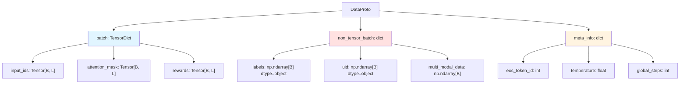
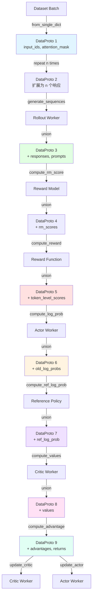
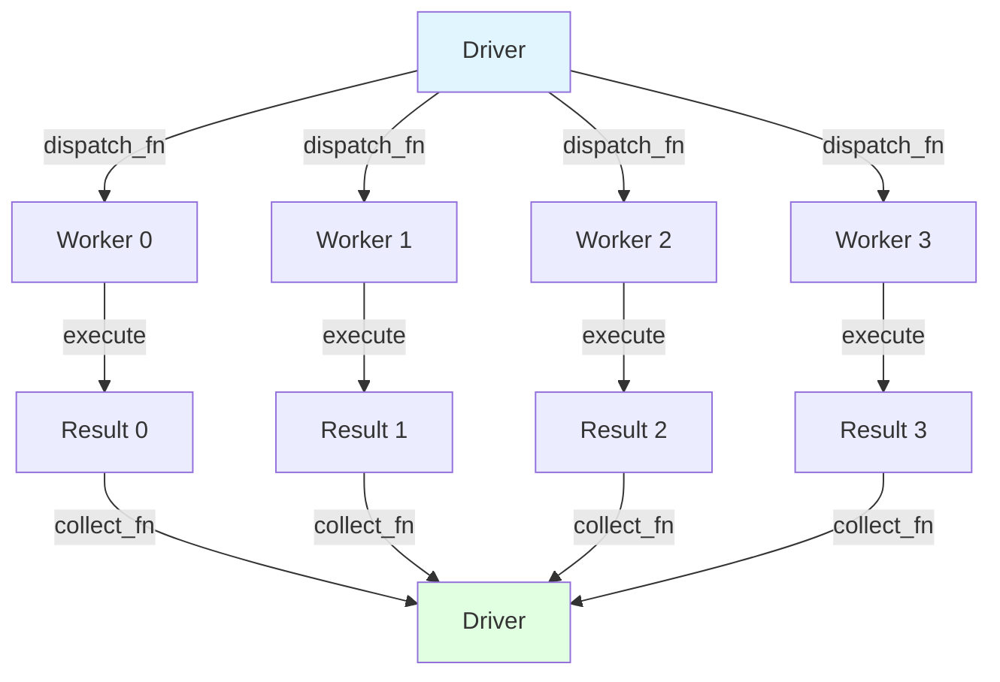
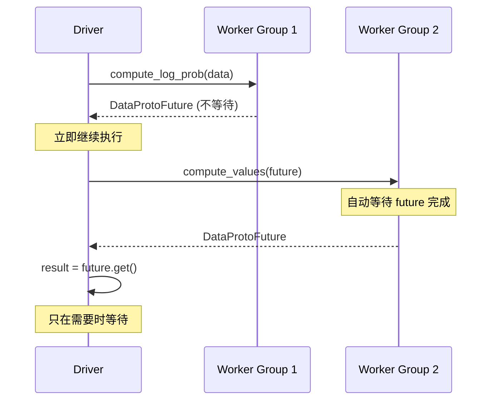
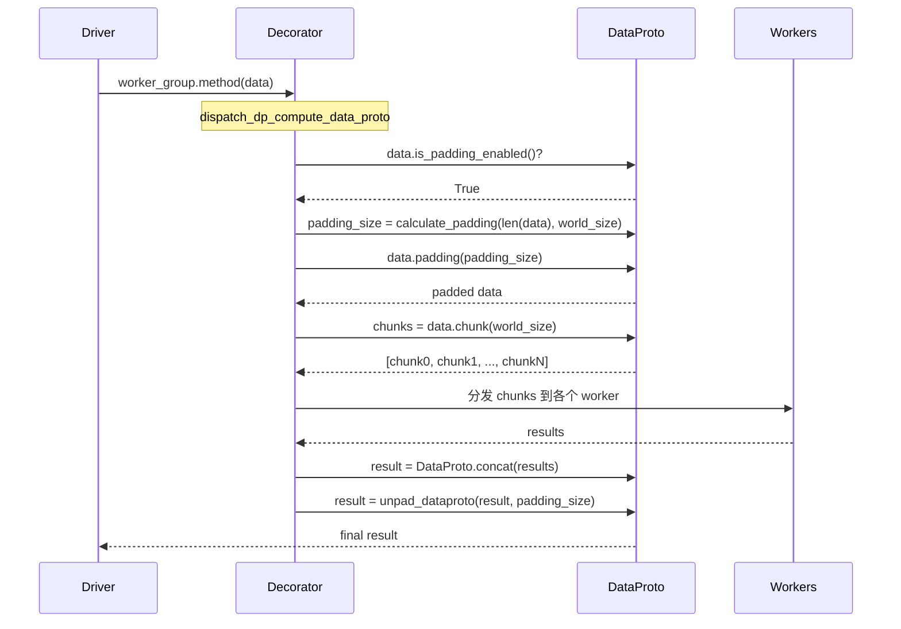

# DataProto 深度讲解文档

> 本文档全面讲解 DataProto 在 VERL 框架中的概念、实现和用法，帮助开发者理解其在 training 和 inference 中的具体应用。

## 目录

1. [概述](#1-概述)
2. [核心定义详解](#2-核心定义详解)
3. [Training 流程中的 DataProto](#3-training-流程中的-dataproto)
4. [Inference/Rollout 中的用法](#4-inferencerollout-中的用法)
5. [Worker 模块详解](#5-worker-模块详解)
6. [分布式机制](#6-分布式机制)
7. [实用工具函数](#7-实用工具函数)
8. [修改扩展指南](#8-修改扩展指南)

---

## 1. 概述

### 1.1 什么是 DataProto？

**DataProto** 是 VERL 框架中的核心数据传输协议，用于在不同函数、模块和分布式 worker 之间标准化数据交换。

**设计目标**：
- 统一的数据格式，支持张量和非张量数据的混合存储
- 高效的批量操作（concat, split, chunk 等）
- 支持分布式场景下的数据分发和收集
- 自动化的 padding 和序列化机制

**核心特点**：
- 基于 PyTorch TensorDict 封装，继承其高效的批量操作能力
- 支持混合数据类型（张量 + Python 对象）
- 内置元信息管理，方便传递配置和状态

### 1.2 DataProto 在 VERL 中的作用


DataProto 贯穿整个 RLHF 训练流程，是所有组件之间通信的桥梁。

---

## 2. 核心定义详解

### 2.1 DataProto 类结构

**源码位置**: `verl/verl/protocol.py:329`

```python
@dataclass
class DataProto:
    """数据传输协议的核心类

    包含三大组成部分：
    - batch: TensorDict，存储所有张量数据
    - non_tensor_batch: dict，存储非张量数据（如字符串、Python对象等）
    - meta_info: dict，存储元信息（配置、状态等）
    """
    batch: TensorDict = None
    non_tensor_batch: dict = field(default_factory=dict)
    meta_info: dict = field(default_factory=dict)
```

#### 三大组成部分详解



**1. batch (TensorDict)**
- 存储所有可张量化的数据
- 支持批量操作（自动广播、设备转移等）
- 常见字段：`input_ids`, `attention_mask`, `position_ids`, `responses`, `rewards`, `advantages`, `values` 等

**2. non_tensor_batch (dict[str, np.ndarray])**
- 存储无法张量化的数据（字符串、复杂对象等）
- 所有值必须是 `numpy.ndarray`，且 `dtype=object`
- 第一维必须与 batch_size 一致
- 常见字段：`labels`, `uid`, `data_source`, `reward_model`, `multi_modal_data`

**3. meta_info (dict)**
- 存储全局元信息，不随数据分割而变化
- 配置信息：`eos_token_id`, `pad_token_id`, `temperature`
- 状态信息：`global_steps`, `validate`, `do_sample`
- 性能信息：`timing`, `metrics`

### 2.2 创建 DataProto

#### 方法 1: from_dict() - 分离张量和非张量

**源码位置**: `verl/verl/protocol.py:488`

```python
@classmethod
def from_dict(
    cls,
    tensors: Optional[dict[str, torch.Tensor]] = None,
    non_tensors=None,
    meta_info=None,
    num_batch_dims=1,
    auto_padding=False,
):
    """从分离的张量和非张量字典创建 DataProto

    Args:
        tensors: 张量字典，所有张量的第一维必须相同
        non_tensors: 非张量字典，会转换为 numpy.ndarray
        meta_info: 元信息字典
        num_batch_dims: batch 维度数（默认为 1）
        auto_padding: 是否启用自动 padding
    """
```

**使用示例**:

```python
# 来源: verl/tests/test_protocol_on_cpu.py:143
obs = torch.randn(10, 5)
act = torch.randn(10, 3)
labels = ["label_" + str(i) for i in range(10)]

data = DataProto.from_dict(
    tensors={"obs": obs, "act": act},
    non_tensors={"labels": labels},
    meta_info={"name": "example"}
)
```

#### 方法 2: from_single_dict() - 自动分类

**源码位置**: `verl/verl/protocol.py:511`

```python
@classmethod
def from_single_dict(cls, data: dict[str, torch.Tensor | np.ndarray],
                     meta_info=None, auto_padding=False):
    """从单个字典自动分类创建 DataProto

    会自动将 torch.Tensor 放入 batch，np.ndarray 放入 non_tensor_batch
    """
```

**使用示例**:

```python
# 来源: verl/verl/trainer/ppo/ray_trainer.py:985
batch_dict = {
    "input_ids": torch.tensor([[1, 2, 3], [4, 5, 6]]),
    "attention_mask": torch.tensor([[1, 1, 1], [1, 1, 0]]),
    "labels": np.array(["A", "B"], dtype=object)
}

batch = DataProto.from_single_dict(batch_dict)
# batch.batch 包含 input_ids, attention_mask
# batch.non_tensor_batch 包含 labels
```

### 2.3 核心操作方法

#### concat() - 拼接多个 DataProto

**源码位置**: `verl/verl/protocol.py:883`

```python
@staticmethod
def concat(data: list["DataProto"]) -> "DataProto":
    """沿 batch 维度拼接多个 DataProto

    使用场景：
    - 合并多个 worker 的输出
    - 收集分布式计算结果
    """
```

**实际使用**:

```python
# 来源: verl/verl/single_controller/base/decorator.py:146
def collect_dp_compute_data_proto(worker_group, output):
    # 从多个 worker 收集结果并拼接
    return DataProto.concat(output)
```

#### chunk() - 均匀分割

**源码位置**: `verl/verl/protocol.py:830`

```python
def chunk(self, chunks: int) -> list["DataProto"]:
    """将 DataProto 均匀分割成 chunks 份

    使用场景：
    - 分布式数据并行时分发数据到各个 rank
    - 启用 auto_padding 时会自动 pad 到可整除
    """
```

**实际使用**:

```python
# 来源: verl/verl/single_controller/base/decorator.py:102
def dispatch_dp_compute_data_proto(worker_group, *args, **kwargs):
    # 将数据分割并分发到各个 worker
    splitted_args, splitted_kwargs = _split_args_kwargs_data_proto_with_auto_padding(
        worker_group.world_size, *args, **kwargs
    )
    return splitted_args, splitted_kwargs
```

#### split() - 按大小分割

**源码位置**: `verl/verl/protocol.py:871`

```python
def split(self, split_size: int) -> list["DataProto"]:
    """按指定大小分割 DataProto

    使用场景：
    - 创建 mini-batch 进行梯度累积
    - 内存受限时的分批处理
    """
```

**实际使用**:

```python
# 来源: verl/verl/workers/actor/dp_actor.py:401
def update_policy(self, data: DataProto):
    # 分割成 mini-batches 进行 PPO 更新
    mini_batches = data.split(self.config.ppo_mini_batch_size)

    for _ in range(self.config.ppo_epochs):
        for mini_batch in mini_batches:
            # 对每个 mini-batch 计算损失并更新
            ...
```

#### select() - 选择字段

**源码位置**: `verl/verl/protocol.py:566`

```python
def select(self, batch_keys=None, non_tensor_batch_keys=None,
          meta_info_keys=None, deepcopy=False) -> "DataProto":
    """选择 DataProto 的部分字段

    使用场景：
    - 传递数据时只保留需要的字段，减少通信开销
    - 避免不必要的数据拷贝
    """
```

**实际使用**:

```python
# 来源: verl/verl/workers/actor/dp_actor.py:318
def compute_log_prob(self, data: DataProto):
    # 只选择计算 log_prob 需要的字段
    select_keys = ["responses", "input_ids", "attention_mask", "position_ids"]
    non_tensor_select_keys = ["multi_modal_inputs"] if has_multi_modal_inputs else []

    data = data.select(
        batch_keys=select_keys,
        non_tensor_batch_keys=non_tensor_select_keys
    )
```

#### union() - 合并字段

**源码位置**: `verl/verl/protocol.py:747`

```python
def union(self, other: "DataProto") -> "DataProto":
    """合并两个 DataProto 的字段

    规则：
    - 如果有重复字段且值不同，会抛出异常
    - batch_size 必须一致
    """
```

**实际使用**:

```python
# 来源: verl/verl/trainer/ppo/ray_trainer.py:1031
# 合并 rollout 输出和原始 batch
batch = batch.union(gen_batch_output)

# 合并 reward model 输出
reward_tensor = self.rm_wg.compute_rm_score(batch)
batch = batch.union(reward_tensor)

# 合并 actor 的 log_prob
old_log_prob = self.actor_rollout_wg.compute_log_prob(batch)
batch = batch.union(old_log_prob)
```

### 2.4 DataProtoConfig 和自动 Padding

**源码位置**: `verl/verl/protocol.py:66`

#### 配置自动 Padding

```python
class DataProtoConfig(metaclass=_DataProtoConfigMeta):
    """全局配置类

    通过环境变量或代码配置：
    - 环境变量：VERL_AUTO_PADDING=TRUE
    - 代码配置：DataProtoConfig.auto_padding = True
    """
```

**使用场景**：当数据需要分发到多个 worker，但 batch_size 不能被 world_size 整除时

```python
# 来源: verl/tests/single_controller/test_auto_padding_on_cpu.py:26
DataProtoConfig.auto_padding = True

data = DataProto.from_dict(
    {"a": torch.zeros(10)},
    {"na": np.array([str(i) for i in range(10)], dtype=object)}
)

# 分发到 4 个 worker，自动 pad 到 12
# 10 % 4 != 0，会 pad 2 个样本
chunks = data.chunk(4)  # 每个 chunk 有 3 个样本
```

#### Padding 实现机制

**源码位置**: `verl/verl/protocol.py:73`

```python
def pad_dataproto_to_divisor(data: "DataProto", size_divisor: int):
    """将 DataProto pad 到可被 size_divisor 整除

    实现：
    1. 计算需要 pad 的数量：pad_size = size_divisor - len(data) % size_divisor
    2. 重复前几个样本作为 padding
    3. 拼接原始数据和 padding
    """
    if len(data) % size_divisor != 0:
        pad_size = size_divisor - len(data) % size_divisor
        padding_protos = []
        remaining_pad = pad_size
        while remaining_pad > 0:
            take_size = min(remaining_pad, len(data))
            padding_protos.append(data[:take_size])
            remaining_pad -= take_size
        data_padded = DataProto.concat([data] + padding_protos)
    else:
        pad_size = 0
        data_padded = data
    return data_padded, pad_size
```

**Unpadding**:

```python
# 来源: verl/verl/trainer/ppo/ray_trainer.py:1009
test_gen_batch_padded, pad_size = pad_dataproto_to_divisor(
    test_gen_batch, size_divisor
)
test_output_gen_batch_padded = self.actor_rollout_wg.generate_sequences(
    test_gen_batch_padded
)
# 移除 padding
test_output_gen_batch = unpad_dataproto(test_output_gen_batch_padded, pad_size)
```

### 2.5 DataProtoFuture - 异步执行优化

**源码位置**: `verl/verl/protocol.py:1113`

```python
@dataclass
class DataProtoFuture:
    """DataProto 的 Future 版本，用于异步执行优化

    目的：避免 driver 进程等待数据，实现真正的异步执行

    组成：
    - collect_fn: 将多个 worker 的 future 合并成 DataProto 的函数
    - dispatch_fn: 将 DataProto 分发到多个 worker 的函数
    - futures: 来自各个 worker 的 ray.ObjectRef 列表
    """
    collect_fn: Callable
    futures: list[ray.ObjectRef]
    dispatch_fn: Callable = None
```

**使用场景**：


**实际使用**:

```python
# 来源: verl/verl/single_controller/base/decorator.py:148
def collect_dp_compute_data_proto(worker_group, output):
    # 如果 output 是 Future，返回 DataProtoFuture
    # 否则返回 DataProto
    if isinstance(output[0], ray.ObjectRef):
        return DataProtoFuture.concat(output)
    else:
        return DataProto.concat(output)
```

---

## 3. Training 流程中的 DataProto

### 3.1 PPO Training 完整数据流



### 3.2 各阶段详解

#### 阶段 1: Dataset → DataProto

**源码位置**: `verl/verl/trainer/ppo/ray_trainer.py:985`

```python
for batch_dict in self.train_dataloader:
    batch: DataProto = DataProto.from_single_dict(batch_dict)

    # 添加唯一 ID
    batch.non_tensor_batch["uid"] = np.array(
        [str(uuid.uuid4()) for _ in range(len(batch.batch))],
        dtype=object
    )
```

**输入**: 来自 DataLoader 的 dict
**输出**: DataProto
- `batch`: `input_ids`, `attention_mask`, `position_ids`
- `non_tensor_batch`: `uid`, `data_source`, `reward_model`

#### 阶段 2: Generate Sequences (Rollout)

**源码位置**: `verl/verl/trainer/ppo/ray_trainer.py:1000-1008`

```python
gen_batch = self._get_gen_batch(batch)
gen_batch.meta_info["global_steps"] = self.global_steps

# 重复 n 次以生成 n 个不同的响应
gen_batch = gen_batch.repeat(
    repeat_times=self.config.actor_rollout_ref.rollout.n,
    interleave=True
)

# 调用 rollout worker
gen_batch_output = self.actor_rollout_wg.generate_sequences(gen_batch)

# 合并结果
batch = batch.repeat(
    repeat_times=self.config.actor_rollout_ref.rollout.n,
    interleave=True
)
batch = batch.union(gen_batch_output)
```

**新增字段**:
- `batch`: `responses`, `prompts`, `response_mask`

#### 阶段 3: Compute Reward

**源码位置**: `verl/verl/trainer/ppo/ray_trainer.py:1036-1057`

```python
# 如果使用 RM，先计算 RM score
if self.use_rm:
    reward_tensor = self.rm_wg.compute_rm_score(batch)
    batch = batch.union(reward_tensor)

# 使用 reward function 计算最终 reward
if self.config.reward_model.launch_reward_fn_async:
    future_reward = compute_reward_async.remote(
        data=batch, reward_fn=self.reward_fn
    )
else:
    reward_tensor, reward_extra_infos_dict = compute_reward(
        batch, self.reward_fn
    )

# 等待异步 reward 完成
if self.config.reward_model.launch_reward_fn_async:
    reward_tensor, reward_extra_infos_dict = ray.get(future_reward)

batch.batch["token_level_scores"] = reward_tensor
```

**新增字段**:
- `batch`: `rm_scores` (可选), `token_level_scores`
- `non_tensor_batch`: reward_extra_infos_dict 中的各种指标

#### 阶段 4: Compute Log Probabilities

**源码位置**: `verl/verl/trainer/ppo/ray_trainer.py:1060-1073`

```python
# 计算 old_log_prob (用于 PPO 的重要性采样)
old_log_prob = self.actor_rollout_wg.compute_log_prob(batch)
entropys = old_log_prob.batch["entropys"]
response_masks = batch.batch["response_mask"]

# 计算平均 entropy
entropy_agg = agg_loss(
    loss_mat=entropys,
    loss_mask=response_masks,
    loss_agg_mode=loss_agg_mode
)
metrics.update({"actor/entropy": entropy_agg.detach().item()})

old_log_prob.batch.pop("entropys")
batch = batch.union(old_log_prob)
```

**新增字段**:
- `batch`: `old_log_probs`

#### 阶段 5: Compute Reference Log Prob (可选)

**源码位置**: `verl/verl/trainer/ppo/ray_trainer.py:1075-1082`

```python
if self.use_reference_policy:
    if not self.ref_in_actor:
        ref_log_prob = self.ref_policy_wg.compute_ref_log_prob(batch)
    else:
        # Reference policy 在 actor 中
        ref_log_prob = self.actor_rollout_wg.compute_ref_log_prob(batch)
    batch = batch.union(ref_log_prob)
```

**新增字段**:
- `batch`: `ref_log_prob`

#### 阶段 6: Compute Values (Critic)

**源码位置**: `verl/verl/trainer/ppo/ray_trainer.py:1085-1089`

```python
if self.use_critic:
    values = self.critic_wg.compute_values(batch)
    batch = batch.union(values)
```

**新增字段**:
- `batch`: `values`

#### 阶段 7: Compute Advantages

**源码位置**: `verl/verl/trainer/ppo/ray_trainer.py:1091-1126`

```python
# 计算 KL penalty (如果启用)
if self.config.algorithm.use_kl_in_reward:
    batch, kl_metrics = apply_kl_penalty(
        batch,
        kl_ctrl=self.kl_ctrl_in_reward,
        kl_penalty=self.config.algorithm.kl_penalty
    )
    metrics.update(kl_metrics)
else:
    batch.batch["token_level_rewards"] = batch.batch["token_level_scores"]

# 计算 advantages
batch = compute_advantage(
    batch,
    adv_estimator=self.config.algorithm.adv_estimator,
    gamma=self.config.algorithm.gamma,
    lam=self.config.algorithm.lam,
    num_repeat=self.config.actor_rollout_ref.rollout.n,
    norm_adv_by_std_in_grpo=norm_adv_by_std_in_grpo,
    config=self.config.algorithm,
)
```

**新增字段**:
- `batch`: `token_level_rewards`, `advantages`, `returns`

#### 阶段 8: Update Critic

**源码位置**: `verl/verl/trainer/ppo/ray_trainer.py:1129-1133`

```python
if self.use_critic:
    critic_output = self.critic_wg.update_critic(batch)
    critic_output_metrics = reduce_metrics(
        critic_output.meta_info["metrics"]
    )
    metrics.update(critic_output_metrics)
```

**输入字段**: `input_ids`, `responses`, `response_mask`, `attention_mask`, `position_ids`, `values`, `returns`

**输出**: DataProto with `meta_info["metrics"]`

#### 阶段 9: Update Actor

**源码位置**: `verl/verl/trainer/ppo/ray_trainer.py:1136-1142`

```python
if self.config.trainer.critic_warmup <= self.global_steps:
    batch.meta_info["multi_turn"] = self.config.actor_rollout_ref.rollout.multi_turn.enable
    actor_output = self.actor_rollout_wg.update_actor(batch)
    actor_output_metrics = reduce_metrics(
        actor_output.meta_info["metrics"]
    )
    metrics.update(actor_output_metrics)
```

**输入字段**: `responses`, `response_mask`, `input_ids`, `attention_mask`, `position_ids`, `old_log_probs`, `advantages`, (`ref_log_prob` 可选)

**输出**: DataProto with `meta_info["metrics"]`

### 3.3 关键辅助函数

#### apply_kl_penalty()

**源码位置**: `verl/verl/trainer/ppo/ray_trainer.py:121`

```python
def apply_kl_penalty(data: DataProto, kl_ctrl: core_algos.AdaptiveKLController,
                     kl_penalty="kl"):
    """在 token-level rewards 上应用 KL penalty

    公式: token_level_rewards = token_level_scores - beta * kld
    """
    response_mask = data.batch["response_mask"]
    token_level_scores = data.batch["token_level_scores"]

    # 计算 KL divergence
    kld = core_algos.kl_penalty(
        data.batch["old_log_probs"],
        data.batch["ref_log_prob"],
        kl_penalty=kl_penalty
    )
    kld = kld * response_mask
    beta = kl_ctrl.value

    # 应用 penalty
    token_level_rewards = token_level_scores - beta * kld
    data.batch["token_level_rewards"] = token_level_rewards

    return data, metrics
```

#### compute_advantage()

**源码位置**: `verl/verl/trainer/ppo/ray_trainer.py:182`

```python
def compute_advantage(
    data: DataProto,
    adv_estimator: AdvantageEstimator,
    gamma: float = 1.0,
    lam: float = 1.0,
    num_repeat: int = 1,
    norm_adv_by_std_in_grpo: bool = True,
    config: Optional[AlgoConfig] = None,
) -> DataProto:
    """计算 advantage estimates

    支持多种 estimator:
    - GAE (Generalized Advantage Estimation)
    - GRPO (Group Relative Policy Optimization)
    - REINFORCE++
    - REMAX
    等
    """
    if adv_estimator == AdvantageEstimator.GAE:
        advantages, returns = core_algos.compute_gae_advantage_return(
            token_level_rewards=data.batch["token_level_rewards"],
            values=data.batch["values"],
            response_mask=data.batch["response_mask"],
            gamma=gamma,
            lam=lam,
        )
        data.batch["advantages"] = advantages
        data.batch["returns"] = returns
    elif adv_estimator == AdvantageEstimator.GRPO:
        advantages, returns = core_algos.compute_grpo_outcome_advantage(
            token_level_rewards=data.batch["token_level_rewards"],
            response_mask=data.batch["response_mask"],
            index=data.non_tensor_batch["uid"],
            norm_adv_by_std_in_grpo=norm_adv_by_std_in_grpo,
        )
        data.batch["advantages"] = advantages
        data.batch["returns"] = returns
    else:
        # 其他 estimator...
        adv_estimator_fn = core_algos.get_adv_estimator_fn(adv_estimator)
        advantages, returns = adv_estimator_fn(...)
        data.batch["advantages"] = advantages
        data.batch["returns"] = returns

    return data
```

---

## 4. Inference/Rollout 中的用法

### 4.1 vLLM Rollout 实现

**源码位置**: `verl/verl/workers/rollout/vllm_rollout/vllm_rollout_spmd.py:249`

```python
@torch.no_grad()
def generate_sequences(self, prompts: DataProto, **kwargs) -> DataProto:
    """使用 vLLM 生成序列

    输入 DataProto:
    - batch:
        - input_ids: [bsz, prompt_length]
        - attention_mask: [bsz, prompt_length]
        - position_ids: [bsz, prompt_length]
    - non_tensor_batch:
        - raw_prompt_ids (可选)
        - multi_modal_data (可选，用于多模态)
    - meta_info:
        - eos_token_id
        - do_sample
        - validate

    输出 DataProto:
    - batch:
        - prompts: [bsz, prompt_length] - 原始 prompt
        - responses: [bsz, response_length] - 生成的响应
        - input_ids: [bsz, prompt_length + response_length] - 完整序列
        - attention_mask: [bsz, prompt_length + response_length]
        - position_ids: [bsz, prompt_length + response_length]
        - response_mask: [bsz, response_length] - 1 for LLM生成的token
        - rollout_log_probs (可选): [bsz, response_length]
    """
```

#### 关键步骤解析

**1. 准备输入**

```python
# 来源: verl/verl/workers/rollout/vllm_rollout/vllm_rollout_spmd.py:270
idx = prompts.batch["input_ids"]  # (bs, prompt_length)
attention_mask = prompts.batch["attention_mask"]
position_ids = prompts.batch["position_ids"]
eos_token_id = prompts.meta_info["eos_token_id"]
batch_size = idx.size(0)

non_tensor_batch = prompts.non_tensor_batch
if "raw_prompt_ids" not in non_tensor_batch:
    non_tensor_batch["raw_prompt_ids"] = np.array(
        [_pre_process_inputs(self.pad_token_id, idx[i]) for i in range(batch_size)],
        dtype=object
    )
```

**2. 处理多模态数据**

```python
# 来源: verl/verl/workers/rollout/vllm_rollout/vllm_rollout_spmd.py:285
if "multi_modal_data" in non_tensor_batch:
    vllm_inputs = []
    for raw_prompt_ids, multi_modal_data in zip(
        non_tensor_batch.pop("raw_prompt_ids"),
        non_tensor_batch.pop("multi_modal_data"),
        strict=True
    ):
        vllm_inputs.append({
            "prompt_token_ids": raw_prompt_ids,
            "multi_modal_data": multi_modal_data
        })
else:
    vllm_inputs = [
        {"prompt_token_ids": raw_prompt_ids}
        for raw_prompt_ids in non_tensor_batch.pop("raw_prompt_ids")
    ]
```

**3. 配置采样参数**

```python
# 来源: verl/verl/workers/rollout/vllm_rollout/vllm_rollout_spmd.py:304
do_sample = prompts.meta_info.get("do_sample", True)
is_validate = prompts.meta_info.get("validate", False)

if not do_sample:
    # Greedy decoding
    kwargs = {
        "best_of": 1,
        "top_p": 1.0,
        "top_k": -1,
        "min_p": 0.0,
        "temperature": 0,
        "n": 1,
    }
elif is_validate:
    # Validation 采样
    kwargs = {
        "top_k": self.config.val_kwargs.top_k,
        "top_p": self.config.val_kwargs.top_p,
        "temperature": self.config.val_kwargs.temperature,
        "n": 1,
    }
```

**4. 调用 vLLM 生成**

```python
# 来源: verl/verl/workers/rollout/vllm_rollout/vllm_rollout_spmd.py:330
with self.update_sampling_params(**kwargs):
    outputs = self.inference_engine.generate(
        prompts=vllm_inputs,
        sampling_params=self.sampling_params,
        lora_request=lora_requests,
        use_tqdm=False,
    )

    response = []
    rollout_log_probs = []
    for output in outputs:
        for sample_id in range(len(output.outputs)):
            response_ids = output.outputs[sample_id].token_ids
            response.append(response_ids)
            if self.config.calculate_log_probs:
                curr_log_prob = []
                for i, logprob in enumerate(output.outputs[sample_id].logprobs):
                    curr_log_prob.append(logprob[response_ids[i]].logprob)
                rollout_log_probs.append(curr_log_prob)
```

**5. 构建输出 DataProto**

```python
# 来源: verl/verl/workers/rollout/vllm_rollout/vllm_rollout_spmd.py:350-405
response = pad_2d_list_to_length(
    response, self.pad_token_id, max_length=self.config.response_length
).to(idx.device)

seq = torch.cat([idx, response], dim=-1)

# 更新 position_ids
response_length = response.size(1)
delta_position_id = torch.arange(1, response_length + 1, device=position_ids.device)
delta_position_id = delta_position_id.unsqueeze(0).expand(batch_size, -1)
response_position_ids = position_ids[..., -1:] + delta_position_id
position_ids = torch.cat([position_ids, response_position_ids], dim=-1)

# 构建 response_attention_mask
response_attention_mask = get_response_mask(
    response_id=response, eos_token=eos_token_id, dtype=attention_mask.dtype
)
attention_mask = torch.cat((attention_mask, response_attention_mask), dim=-1)

# 构建输出
batch = TensorDict(
    {
        "prompts": idx,
        "responses": response,
        "input_ids": seq,
        "attention_mask": attention_mask,
        "position_ids": position_ids,
    },
    batch_size=batch_size,
)
if self.config.calculate_log_probs:
    batch["rollout_log_probs"] = rollout_log_probs

return DataProto(batch=batch, non_tensor_batch=non_tensor_batch)
```

### 4.2 Multi-turn Conversation 中的 DataProto

对于多轮对话，`response_mask` 的设计非常巧妙：

```
responses:     |<- LLM gen 1 ->|<- tool_calls ->|<- LLM gen 2 ->|<- padding ->|
response_mask: | 1, 1, 1, ..., 1| 0, 0, .., 0, 0 | 1, 1, 1, ..., 1| 0, 0, ..., 0|
```

- `1` 表示 LLM 生成的 token（需要计算损失）
- `0` 表示工具调用观察或 padding（不计算损失）

---

## 5. Worker 模块详解

### 5.1 Actor Worker

**源码位置**: `verl/verl/workers/actor/dp_actor.py`

#### compute_log_prob()

**源码位置**: `verl/verl/workers/actor/dp_actor.py:297`

```python
@GPUMemoryLogger(role="dp actor", logger=logger)
def compute_log_prob(self, data: DataProto, calculate_entropy=False) -> torch.Tensor:
    """计算给定 input_ids 下 responses 的 log probability

    输入 DataProto:
    - batch:
        - input_ids: [batch_size, sequence_length] - prompt + response
        - attention_mask: [batch_size, sequence_length]
        - position_ids: [batch_size, sequence_length]
        - responses: [batch_size, response_length]
    - non_tensor_batch:
        - multi_modal_inputs (可选)
    - meta_info:
        - micro_batch_size
        - temperature
        - use_dynamic_bsz

    输出: log_probs, entropys
    - log_probs: [batch_size, response_length]
    - entropys: [batch_size, response_length] (如果 calculate_entropy=True)
    """
    self.actor_module.eval()

    # 提取需要的字段
    select_keys = ["responses", "input_ids", "attention_mask", "position_ids"]
    non_tensor_select_keys = ["multi_modal_inputs"] if has_multi_modal_inputs else []
    data = data.select(batch_keys=select_keys, non_tensor_batch_keys=non_tensor_select_keys)

    # 分割成 micro-batches
    micro_batch_size = data.meta_info["micro_batch_size"]
    temperature = data.meta_info["temperature"]
    use_dynamic_bsz = data.meta_info["use_dynamic_bsz"]

    if use_dynamic_bsz:
        max_token_len = data.meta_info["max_token_len"] * self.ulysses_sequence_parallel_size
        micro_batches, batch_idx_list = prepare_dynamic_batch(data, max_token_len=max_token_len)
    else:
        micro_batches = data.split(micro_batch_size)

    # 逐个处理 micro-batch
    log_probs_lst = []
    entropy_lst = []
    for micro_batch in micro_batches:
        micro_batch = micro_batch.to(get_device_id())
        model_inputs = {**micro_batch.batch, **micro_batch.non_tensor_batch}
        with torch.no_grad():
            entropy, log_probs = self._forward_micro_batch(
                model_inputs, temperature=temperature, calculate_entropy=calculate_entropy
            )
        log_probs_lst.append(log_probs)
        if calculate_entropy:
            entropy_lst.append(entropy)

    # 合并结果
    log_probs = torch.concat(log_probs_lst, dim=0)
    entropys = None
    if calculate_entropy:
        entropys = torch.concat(entropy_lst, dim=0)

    if use_dynamic_bsz:
        log_probs = restore_dynamic_batch(log_probs, batch_idx_list)
        if calculate_entropy:
            entropys = restore_dynamic_batch(entropys, batch_idx_list)

    return log_probs, entropys
```

#### update_policy()

**源码位置**: `verl/verl/workers/actor/dp_actor.py:359`

```python
@GPUMemoryLogger(role="dp actor", logger=logger)
def update_policy(self, data: DataProto):
    """使用 PPO 算法更新 policy

    输入 DataProto:
    - batch:
        - responses: [batch_size, response_length]
        - response_mask: [batch_size, response_length]
        - input_ids: [batch_size, sequence_length]
        - attention_mask: [batch_size, sequence_length]
        - position_ids: [batch_size, sequence_length]
        - old_log_probs: [batch_size, response_length]
        - advantages: [batch_size, response_length]
        - ref_log_prob (可选): [batch_size, response_length]
        - rollout_log_probs (可选): [batch_size, response_length] - for TIS
    - meta_info:
        - temperature
    """
    self.actor_module.train()

    temperature = data.meta_info["temperature"]

    # 选择需要的字段
    select_keys = [
        "responses", "response_mask", "input_ids", "attention_mask", "position_ids",
        "old_log_probs", "advantages"
    ]
    if self.config.use_kl_loss:
        select_keys.append("ref_log_prob")
    if self.config.tis_imp_ratio_cap > 0:
        select_keys.append("rollout_log_probs")

    data = data.select(batch_keys=select_keys, non_tensor_batch_keys=non_tensor_select_keys)

    # 分割成 mini-batches (for PPO)
    mini_batches = data.split(self.config.ppo_mini_batch_size)

    metrics = {}
    for _ in range(self.config.ppo_epochs):
        for batch_idx, mini_batch in enumerate(mini_batches):
            # 进一步分割成 micro-batches (for gradient accumulation)
            if self.config.use_dynamic_bsz:
                max_token_len = self.config.ppo_max_token_len_per_gpu * self.ulysses_sequence_parallel_size
                micro_batches, _ = prepare_dynamic_batch(mini_batch, max_token_len=max_token_len)
            else:
                self.gradient_accumulation = (
                    self.config.ppo_mini_batch_size // self.config.ppo_micro_batch_size_per_gpu
                )
                micro_batches = mini_batch.split(self.config.ppo_micro_batch_size_per_gpu)

            self.actor_optimizer.zero_grad()

            for micro_batch in micro_batches:
                micro_batch = micro_batch.to(get_device_id())
                model_inputs = {**micro_batch.batch, **micro_batch.non_tensor_batch}

                # 前向传播
                entropy, log_prob = self._forward_micro_batch(
                    model_inputs, temperature=temperature, calculate_entropy=True
                )

                # 计算 PPO loss
                policy_loss_fn = get_policy_loss_fn(self.config.policy_loss.get("loss_mode", "vanilla"))
                pg_loss, pg_clipfrac, ppo_kl, pg_clipfrac_lower = policy_loss_fn(
                    old_log_prob=model_inputs["old_log_probs"],
                    log_prob=log_prob,
                    advantages=model_inputs["advantages"],
                    response_mask=model_inputs["response_mask"],
                    loss_agg_mode=self.config.loss_agg_mode,
                    config=self.config,
                    rollout_log_probs=model_inputs.get("rollout_log_probs"),
                )

                # 添加 entropy loss
                if self.config.entropy_coeff != 0:
                    entropy_loss = agg_loss(
                        loss_mat=entropy,
                        loss_mask=model_inputs["response_mask"],
                        loss_agg_mode=self.config.loss_agg_mode
                    )
                    policy_loss = pg_loss - entropy_loss * self.config.entropy_coeff
                else:
                    policy_loss = pg_loss

                # 添加 KL loss (可选)
                if self.config.use_kl_loss:
                    kld = kl_penalty(
                        logprob=log_prob,
                        ref_logprob=model_inputs["ref_log_prob"],
                        kl_penalty=self.config.kl_loss_type
                    )
                    kl_loss = agg_loss(loss_mat=kld, loss_mask=model_inputs["response_mask"], loss_agg_mode=self.config.loss_agg_mode)
                    policy_loss = policy_loss + kl_loss * self.config.kl_loss_coef

                # 反向传播
                loss_scale_factor = 1 / self.gradient_accumulation
                loss = policy_loss * loss_scale_factor
                loss.backward()

            # 优化器步骤
            grad_norm = self._optimizer_step()
            metrics["actor/grad_norm"] = grad_norm.detach().item()

    self.actor_optimizer.zero_grad()
    return metrics
```

### 5.2 Critic Worker

**源码位置**: `verl/verl/workers/critic/dp_critic.py`

#### compute_values()

**源码位置**: `verl/verl/workers/critic/dp_critic.py:153`

```python
@GPUMemoryLogger(role="dp critic", logger=logger)
def compute_values(self, data: DataProto) -> torch.Tensor:
    """计算 state values

    输入 DataProto:
    - batch:
        - responses: [batch_size, response_length]
        - input_ids: [batch_size, sequence_length]
        - response_mask (可选): [batch_size, response_length]
        - attention_mask: [batch_size, sequence_length]
        - position_ids: [batch_size, sequence_length]
    - meta_info:
        - micro_batch_size
        - use_dynamic_bsz

    输出: values [batch_size, response_length]
    """
    self.critic_module.eval()

    # 提取字段
    select_keys = (
        ["responses", "input_ids", "response_mask", "attention_mask", "position_ids"]
        if "response_mask" in data.batch
        else ["responses", "input_ids", "attention_mask", "position_ids"]
    )
    data = data.select(batch_keys=select_keys, non_tensor_batch_keys=non_tensor_select_keys)

    # 分割成 micro-batches
    micro_batch_size = data.meta_info["micro_batch_size"]
    use_dynamic_bsz = data.meta_info["use_dynamic_bsz"]

    if use_dynamic_bsz:
        max_token_len = data.meta_info["max_token_len"] * self.ulysses_sequence_parallel_size
        micro_batches, batch_idx_list = prepare_dynamic_batch(data, max_token_len=max_token_len)
    else:
        micro_batches = data.split(micro_batch_size)

    # 计算 values
    values_lst = []
    for micro_batch in micro_batches:
        micro_batch = micro_batch.to(get_device_id())
        model_inputs = {**micro_batch.batch, **micro_batch.non_tensor_batch}
        with torch.no_grad():
            values = self._forward_micro_batch(model_inputs)
        values_lst.append(values)

    values = torch.concat(values_lst, dim=0)

    if use_dynamic_bsz:
        values = restore_dynamic_batch(values, batch_idx_list)

    # Mask values (只有 action tokens 有 value)
    if "response_mask" in data.batch:
        response_mask = data.batch["response_mask"]
        response_mask = response_mask.to(values.device)
        values = values * response_mask

    return values
```

#### update_critic()

**源码位置**: `verl/verl/workers/critic/dp_critic.py:192`

```python
@GPUMemoryLogger(role="dp critic", logger=logger)
def update_critic(self, data: DataProto):
    """更新 critic 网络

    输入 DataProto:
    - batch:
        - input_ids: [batch_size, sequence_length]
        - responses: [batch_size, response_length]
        - response_mask: [batch_size, response_length]
        - attention_mask: [batch_size, sequence_length]
        - position_ids: [batch_size, sequence_length]
        - values: [batch_size, response_length] - old values
        - returns: [batch_size, response_length] - target returns
    """
    self.critic_module.train()
    metrics = {}

    # 选择字段
    select_keys = ["input_ids", "responses", "response_mask", "attention_mask",
                   "position_ids", "values", "returns"]
    data = data.select(batch_keys=select_keys, non_tensor_batch_keys=non_tensor_select_keys)

    # 分割成 mini-batches
    mini_batches = data.split(self.config.ppo_mini_batch_size)

    for _ in range(self.config.ppo_epochs):
        for batch_idx, mini_batch in enumerate(mini_batches):
            # 进一步分割成 micro-batches
            if self.config.use_dynamic_bsz:
                max_token_len = self.config.ppo_max_token_len_per_gpu * self.ulysses_sequence_parallel_size
                micro_batches, _ = prepare_dynamic_batch(mini_batch, max_token_len=max_token_len)
            else:
                self.gradient_accumulation = (
                    self.config.ppo_mini_batch_size // self.config.ppo_micro_batch_size_per_gpu
                )
                micro_batches = mini_batch.split(self.config.ppo_micro_batch_size_per_gpu)

            self.critic_optimizer.zero_grad()

            for micro_batch in micro_batches:
                micro_batch = micro_batch.to(get_device_id())
                model_inputs = {**micro_batch.batch, **micro_batch.non_tensor_batch}

                # 前向传播
                vpreds = self._forward_micro_batch(model_inputs)

                # 计算 value loss (with clipping)
                vf_loss, vf_clipfrac = core_algos.compute_value_loss(
                    vpreds=vpreds,
                    values=model_inputs["values"],
                    returns=model_inputs["returns"],
                    response_mask=model_inputs["response_mask"],
                    cliprange_value=self.config.cliprange_value,
                    loss_agg_mode=self.config.loss_agg_mode,
                )

                # 反向传播
                loss_scale_factor = 1 / self.gradient_accumulation
                loss = vf_loss * loss_scale_factor
                loss.backward()

                metrics["critic/vf_loss"] = vf_loss.detach().item() * loss_scale_factor
                metrics["critic/vf_clipfrac"] = vf_clipfrac.detach().item()

            # 优化器步骤
            grad_norm = self._optimizer_step()
            metrics["critic/grad_norm"] = grad_norm.detach().item()

    self.critic_optimizer.zero_grad()
    return metrics
```

### 5.3 Reward Model Worker

**源码位置**: `verl/verl/workers/reward_model/base.py:42`

```python
class BasePPORewardModel(ABC):
    """Reward Model 基类"""

    @abstractmethod
    def compute_reward(self, data: DataProto) -> DataProto:
        """计算 reward

        输入 DataProto:
        - batch:
            - input_ids: [batch_size, sequence_length]
            - attention_mask: [batch_size, sequence_length]
            - position_ids: [batch_size, sequence_length]

        输出 DataProto:
        - batch:
            - reward: [batch_size, sequence_length]
              只有 [EOS] 位置包含实际 reward，其他位置为 0
        """
        pass
```

**实际使用**:

```python
# 来源: verl/verl/trainer/ppo/reward.py:154
def compute_reward(data: DataProto, reward_fn: AbstractRewardManager) -> tuple[torch.Tensor, dict[str, Any]]:
    """计算 reward

    Args:
        data: DataProto 包含 input_ids 等
        reward_fn: Reward function (可以是 RM worker 或 rule-based function)

    Returns:
        reward_tensor: [batch_size, sequence_length]
        reward_extra_infos_dict: 额外信息字典
    """
    try:
        reward_result = reward_fn(data, return_dict=True)
        reward_tensor = reward_result["reward_tensor"]
        reward_extra_infos_dict = reward_result.get("reward_extra_info", {})
    except Exception as e:
        print(f"Error in reward_fn: {e}")
        reward_tensor = reward_fn(data)
        reward_extra_infos_dict = {}

    return reward_tensor, reward_extra_infos_dict
```

---

## 6. 分布式机制

### 6.1 Dispatch/Collect 装饰器机制

VERL 使用装饰器模式来标记 worker 方法的分布式执行策略。

**源码位置**: `verl/verl/single_controller/base/decorator.py`



#### 核心 Dispatch Mode

```python
# 来源: verl/verl/single_controller/base/decorator.py
class Dispatch(Enum):
    ONE_TO_ALL = "one_to_all"           # 所有 worker 收到相同数据
    ALL_TO_ALL = "all_to_all"           # 无数据转换
    DP_COMPUTE = "dp_compute"           # 数据并行计算
    DP_COMPUTE_PROTO = "dp_compute_proto"  # DataProto 数据并行
```

#### DP_COMPUTE_PROTO 详解

这是最常用的模式，用于 DataProto 的分布式处理。

**Dispatch 函数**:

**源码位置**: `verl/verl/single_controller/base/decorator.py:137`

```python
def dispatch_dp_compute_data_proto(worker_group, *args, **kwargs):
    """将 DataProto 分割并分发到各个 worker

    流程：
    1. 检查 auto_padding 是否启用
    2. 如果启用，pad DataProto 到可被 world_size 整除
    3. 使用 chunk() 分割 DataProto
    4. 返回分割后的列表
    """
    splitted_args, splitted_kwargs = _split_args_kwargs_data_proto_with_auto_padding(
        worker_group.world_size,
        *args,
        **kwargs,
    )
    return splitted_args, splitted_kwargs


def _split_args_kwargs_data_proto_with_auto_padding(chunks, *args, **kwargs):
    """处理 auto_padding 并分割 DataProto

    实现：
    1. 检查所有 DataProto 是否启用 padding
    2. 计算需要 pad 的数量
    3. 调用 DataProto.padding() 添加 padding
    4. 使用 chunk() 分割
    5. 在 kwargs 中添加 _padding_size_key 用于后续 unpad
    """
    data_proto_len = None
    padding_size = None

    def _padding_and_split_data(obj, chunks):
        nonlocal data_proto_len, padding_size
        if isinstance(obj, DataProto) and obj.is_padding_enabled():
            if data_proto_len is None:
                data_proto_len = len(obj)
                padding_size = (chunks - (data_proto_len % chunks)) if (data_proto_len % chunks > 0) else 0
            obj.padding(padding_size=padding_size)
        return obj.chunk(chunks=chunks)

    splitted_args = [_padding_and_split_data(arg, chunks) for arg in args]
    splitted_kwargs = {key: _padding_and_split_data(val, chunks) for key, val in kwargs.items()}

    if padding_size is not None:
        splitted_kwargs[_padding_size_key] = padding_size

    return splitted_args, splitted_kwargs
```

**Collect 函数**:

**源码位置**: `verl/verl/single_controller/base/decorator.py:199`

```python
def collect_dp_compute_data_proto(worker_group, output):
    """收集各个 worker 的 DataProto 输出并拼接

    流程：
    1. 检查 output 类型 (DataProto 或 Future)
    2. 使用 DataProto.concat() 或 DataProtoFuture.concat() 拼接
    3. 返回合并后的结果
    """
    for o in output:
        assert isinstance(o, DataProto | ray.ObjectRef)

    output = collect_dp_compute(worker_group, output)
    return _concat_data_proto_or_future(output)


def _concat_data_proto_or_future(output: list):
    """根据类型选择合适的 concat 方法"""
    if isinstance(output[0], DataProto):
        return DataProto.concat(output)
    elif isinstance(output[0], ray.ObjectRef):
        return DataProtoFuture.concat(output)
    else:
        raise NotImplementedError
```

#### 使用装饰器

```python
# 例子：Actor worker 的 compute_log_prob 方法
from verl.single_controller.base.decorator import register, Dispatch

@register(dispatch_mode=Dispatch.DP_COMPUTE_PROTO)
def compute_log_prob(self, data: DataProto) -> DataProto:
    """
    这个装饰器会：
    1. 自动将输入的 DataProto 分割到各个 rank
    2. 在每个 rank 上执行 compute_log_prob
    3. 自动收集并拼接各个 rank 的输出
    """
    # 实际的计算逻辑
    ...
```

### 6.2 Sharding Manager

Sharding Manager 用于处理混合引擎场景（如 FSDP + vLLM），需要在不同并行策略之间转换数据。

**源码位置**: `verl/verl/workers/sharding_manager/base.py:18`

```python
class BaseShardingManager:
    """Sharding Manager 基类

    作用：
    - preprocess_data: 在调用 worker 方法前转换数据格式
    - postprocess_data: 在 worker 方法返回后恢复数据格式
    """

    def preprocess_data(self, data: DataProto) -> DataProto:
        """预处理数据，通常是 all_gather 或 broadcast"""
        return data

    def postprocess_data(self, data: DataProto) -> DataProto:
        """后处理数据，通常是 chunk 或 select"""
        return data
```

#### FSDP + vLLM Sharding Manager

**源码位置**: `verl/verl/workers/sharding_manager/fsdp_vllm.py:264`

```python
class FSDPVLLMShardingManager(BaseShardingManager):
    """FSDP 训练 + vLLM 推理的 Sharding Manager

    问题：
    - FSDP 使用 DP (Data Parallel)
    - vLLM 使用 TP (Tensor Parallel)
    - 两者的数据分布不同

    解决：
    - preprocess_data: all_gather 数据，使每个 TP rank 有完整数据
    - postprocess_data: chunk 数据，每个 TP rank 只保留自己的部分
    """

    @GPUMemoryLogger(role="fsdp vllm sharding_manager", logger=logger)
    def preprocess_data(self, data: DataProto) -> DataProto:
        """All gather across TP group to make each rank has identical input"""
        if self.tp_size == 1:
            return data

        # All gather 数据
        group = vllm_ps.get_tensor_model_parallel_group().device_group
        all_gather_data_proto(data=data, process_group=group)
        return data

    @GPUMemoryLogger(role="fsdp vllm sharding_manager", logger=logger)
    def postprocess_data(self, data: DataProto) -> DataProto:
        """Get chunk data of this TP rank since we did all gather in preprocess"""
        if self.tp_size == 1:
            return data

        # 只保留当前 TP rank 的数据
        return data.chunk(chunks=self.tp_size)[self.tp_rank]
```

**使用示例**:

```python
# 在 hybrid engine 中使用
with self.sharding_manager:
    # preprocess_data 被自动调用
    output = self.rollout_engine.generate_sequences(input_data)
    # postprocess_data 被自动调用
```

### 6.3 DataProtoFuture 在分布式中的作用

**问题**：在分布式场景中，driver 需要等待 worker 计算完成并传回数据，这会导致阻塞。

**解决**：使用 DataProtoFuture 实现异步执行流水线。



**实现**:

```python
# 来源: verl/verl/protocol.py:1132
@staticmethod
def concat(data: list[ray.ObjectRef]) -> "DataProtoFuture":
    """从多个 worker 的 ObjectRef 创建 DataProtoFuture"""
    output = DataProtoFuture(collect_fn=DataProto.concat, futures=data)
    return output

def get(self):
    """等待所有 futures 完成并收集结果"""
    output = ray.get(self.futures)  # 等待所有 worker
    for o in output:
        assert isinstance(o, DataProto)
    output = self.collect_fn(output)  # concat
    if self.dispatch_fn is not None:
        output = self.dispatch_fn(output)  # 可选的再分发
    return output
```

---

## 7. 实用工具函数

### 7.1 Sequence Length Balancing

在数据并行训练中，不同 rank 的序列长度不平衡会导致计算效率低下（长序列的 rank 成为瓶颈）。

**源码位置**: `verl/verl/utils/seqlen_balancing.py:344`

```python
def prepare_dynamic_batch(
    data: DataProto,
    max_token_len: int,
    dp_group=None,
    num_batches_divided_by=None,
    same_micro_num_in_dp=True,
    min_num_micro_batch=None,
    use_dynamic_bsz_balance=True,
) -> tuple[list[DataProto], list[list[int]]]:
    """准备动态批次，实现序列长度平衡

    算法：
    1. 计算每个样本的 token 数
    2. 使用贪心算法将样本分配到 micro-batches
    3. 确保每个 micro-batch 的总 token 数不超过 max_token_len
    4. 返回 micro-batches 和对应的索引列表

    Returns:
        micro_batches: List[DataProto] - 分割后的 micro-batches
        batch_idx_list: List[List[int]] - 每个 micro-batch 包含的原始索引
    """
    batch, batch_idx_list = rearrange_micro_batches(
        data.batch,
        max_token_len=max_token_len,
        dp_group=dp_group,
        num_batches_divided_by=num_batches_divided_by,
        same_micro_num_in_dp=same_micro_num_in_dp,
        min_num_micro_batch=min_num_micro_batch,
        use_dynamic_bsz_balance=use_dynamic_bsz_balance,
    )

    micro_batches = []
    for i, batch_idx in enumerate(batch_idx_list):
        tensors = dict(batch[i])
        non_tensors = {key: value[batch_idx] for key, value in data.non_tensor_batch.items()}
        meta_info = copy.deepcopy(data.meta_info)
        micro_batches.append(DataProto.from_dict(tensors, non_tensors, meta_info=meta_info))

    return micro_batches, batch_idx_list


def restore_dynamic_batch(data: torch.Tensor, batch_idx_list: list[list[int]]) -> torch.Tensor:
    """从动态批次恢复原始顺序

    算法：
    1. 展平 batch_idx_list 得到实际顺序
    2. 计算逆序索引
    3. 使用逆序索引恢复原始顺序
    """
    indices = list(chain.from_iterable(batch_idx_list))
    batch_size = data.shape[0]
    revert_indices = torch.tensor(get_reverse_idx(indices), dtype=torch.long)

    if data.is_nested:
        tensors = [data[i] for i in revert_indices]
        reverted_data = torch.nested.as_nested_tensor(tensors, layout=torch.jagged)
    else:
        reverted_data = data[revert_indices]

    return reverted_data
```

**使用示例**:

```python
# 来源: verl/verl/workers/actor/dp_actor.py:327
def compute_log_prob(self, data: DataProto):
    if use_dynamic_bsz:
        max_token_len = data.meta_info["max_token_len"] * self.ulysses_sequence_parallel_size
        micro_batches, batch_idx_list = prepare_dynamic_batch(data, max_token_len=max_token_len)
    else:
        micro_batches = data.split(micro_batch_size)

    # 处理 micro-batches
    log_probs_lst = []
    for micro_batch in micro_batches:
        log_probs = self._forward_micro_batch(...)
        log_probs_lst.append(log_probs)

    log_probs = torch.concat(log_probs_lst, dim=0)

    # 恢复原始顺序
    if use_dynamic_bsz:
        log_probs = restore_dynamic_batch(log_probs, batch_idx_list)

    return log_probs
```

### 7.2 序列化机制

DataProto 支持高效的序列化，用于 Ray 的跨进程通信和磁盘存储。

#### 自定义序列化

**源码位置**: `verl/verl/protocol.py:387`

```python
def __getstate__(self):
    """自定义序列化

    支持两种方式：
    1. numpy 方式 (通过环境变量 VERL_DATAPROTO_SERIALIZATION_METHOD=numpy)
    2. torch 方式 (默认)
    """
    if version.parse(tensordict.__version__) >= version.parse("0.5.0") and self.batch is not None:
        batch = self.batch.contiguous().consolidate()
    else:
        batch = self.batch

    if os.getenv("VERL_DATAPROTO_SERIALIZATION_METHOD") == "numpy":
        if batch is not None:
            batch = serialize_tensordict(self.batch)
        return (batch, self.non_tensor_batch, self.meta_info)
    else:
        # Torch 方式：更快但需要更多内存
        import io
        buffer = io.BytesIO()
        torch.save(batch, buffer)
        buffer_bytes = buffer.getvalue()
        return buffer_bytes, self.non_tensor_batch, self.meta_info

def __setstate__(self, data):
    """自定义反序列化"""
    batch_deserialized_bytes, non_tensor_batch, meta_info = data

    if os.getenv("VERL_DATAPROTO_SERIALIZATION_METHOD") == "numpy":
        if batch_deserialized_bytes is not None:
            self.batch = deserialize_tensordict(batch_deserialized_bytes)
        else:
            self.batch = None
    else:
        import io
        batch_deserialized = io.BytesIO(initial_bytes=batch_deserialized_bytes)
        batch = torch.load(
            batch_deserialized,
            weights_only=False,
            map_location="cpu" if not get_torch_device().is_available() else None,
        )
        self.batch = batch

    self.non_tensor_batch = non_tensor_batch
    self.meta_info = meta_info
```

#### 磁盘存储

```python
# 来源: verl/verl/protocol.py:430
def save_to_disk(self, filepath):
    """保存到磁盘"""
    with open(filepath, "wb") as f:
        pickle.dump(self, f)

@staticmethod
def load_from_disk(filepath) -> "DataProto":
    """从磁盘加载"""
    with open(filepath, "rb") as f:
        data = pickle.load(f)
        return data
```

**使用场景**:

```python
# 来源: verl/tests/test_protocol_on_cpu.py:336
# 保存
data.save_to_disk("test_data.pt")

# 加载
loaded_data = DataProto.load_from_disk("test_data.pt")
```

### 7.3 其他实用方法

#### to() - 设备转移

```python
# 来源: verl/verl/protocol.py:552
def to(self, device) -> "DataProto":
    """将 batch 中的所有 tensor 转移到指定设备"""
    if self.batch is not None:
        self.batch = self.batch.to(device)
    return self
```

#### repeat() - 重复数据

```python
# 来源: verl/verl/protocol.py:908
def repeat(self, repeat_times=2, interleave=True):
    """重复数据

    Args:
        repeat_times: 重复次数
        interleave: 是否交错重复
            - True: [a, a, b, b]
            - False: [a, b, a, b]
    """
```

**使用场景**：生成多个不同的响应

```python
# 来源: verl/verl/trainer/ppo/ray_trainer.py:995
gen_batch = gen_batch.repeat(
    repeat_times=self.config.actor_rollout_ref.rollout.n,
    interleave=True
)
# 原始 batch: [sample1, sample2]
# repeat 2 次后: [sample1, sample1, sample2, sample2]
```

#### select_idxs() - 索引选择

```python
# 来源: verl/verl/protocol.py:603
def select_idxs(self, idxs):
    """根据索引选择子集

    Args:
        idxs: torch.Tensor, numpy.ndarray, or list
            可以是布尔索引或整数索引
    """
```

---

## 8. 修改扩展指南

### 8.1 如何添加新的数据字段

#### 场景 1: 添加张量字段

假设你想在 rollout 阶段添加一个新的 `attention_scores` 字段。

**步骤**:

1. **在 rollout worker 中生成字段**

```python
# 在 verl/verl/workers/rollout/vllm_rollout/vllm_rollout_spmd.py 中
def generate_sequences(self, prompts: DataProto) -> DataProto:
    # ... 现有代码 ...

    # 添加新字段
    attention_scores = compute_attention_scores(...)  # 你的计算逻辑

    batch = TensorDict(
        {
            "prompts": idx,
            "responses": response,
            "input_ids": seq,
            "attention_mask": attention_mask,
            "position_ids": position_ids,
            "attention_scores": attention_scores,  # 新增
        },
        batch_size=batch_size,
    )

    return DataProto(batch=batch, non_tensor_batch=non_tensor_batch)
```

2. **在下游使用新字段**

```python
# 在 actor worker 或其他需要使用的地方
def compute_log_prob(self, data: DataProto):
    # 如果需要使用 attention_scores
    select_keys = ["responses", "input_ids", "attention_mask",
                   "position_ids", "attention_scores"]  # 添加新字段
    data = data.select(batch_keys=select_keys)

    # 使用新字段
    attention_scores = data.batch["attention_scores"]
    # ... 你的逻辑 ...
```

#### 场景 2: 添加非张量字段

假设你想添加一个 `prompt_type` 字段（字符串）。

**步骤**:

1. **在 dataset 或 dataloader 中添加**

```python
# 在你的 collate_fn 或 dataset 中
def collate_fn(batch):
    return {
        "input_ids": ...,
        "attention_mask": ...,
        "prompt_type": [sample["prompt_type"] for sample in batch],  # 字符串列表
    }
```

2. **创建 DataProto 时自动分类**

```python
# 在 ray_trainer.py 中
batch: DataProto = DataProto.from_single_dict(batch_dict)
# prompt_type 会自动放入 non_tensor_batch
```

3. **在 worker 中使用**

```python
# 在任何 worker 中
def some_method(self, data: DataProto):
    prompt_types = data.non_tensor_batch["prompt_type"]
    # prompt_types 是 np.ndarray，dtype=object
    for i, prompt_type in enumerate(prompt_types):
        if prompt_type == "math":
            # 特殊处理数学问题
            ...
```

### 8.2 如何修改 Worker 接口

假设你想在 actor worker 中添加一个新方法 `compute_policy_gradient`。

**步骤**:

1. **在 worker 类中定义方法**

```python
# 在 verl/verl/workers/actor/dp_actor.py 中
from verl.single_controller.base.decorator import register, Dispatch

class DataParallelPPOActor:

    @register(dispatch_mode=Dispatch.DP_COMPUTE_PROTO)  # 使用装饰器
    def compute_policy_gradient(self, data: DataProto) -> DataProto:
        """计算 policy gradient

        输入 DataProto:
        - batch:
            - input_ids, attention_mask, responses, advantages

        输出 DataProto:
        - batch:
            - policy_gradients: [batch_size, response_length]
        """
        # 提取字段
        select_keys = ["input_ids", "attention_mask", "responses", "advantages"]
        data = data.select(batch_keys=select_keys)

        # 计算 policy gradient
        policy_gradients = ...

        return DataProto.from_dict(
            tensors={"policy_gradients": policy_gradients}
        )
```

2. **在 trainer 中调用**

```python
# 在 verl/verl/trainer/ppo/ray_trainer.py 中
def fit(self):
    ...
    # 调用新方法
    pg_output = self.actor_rollout_wg.compute_policy_gradient(batch)
    batch = batch.union(pg_output)
    ...
```

### 8.3 常见接入点总结

| 接入点 | 位置 | 作用 | DataProto 字段 |
|--------|------|------|----------------|
| **Dataset/Dataloader** | `verl/utils/dataset/` | 数据加载 | 初始字段：`input_ids`, `attention_mask`, 自定义字段 |
| **Rollout Worker** | `verl/verl/workers/rollout/` | 序列生成 | 添加：`responses`, `prompts`, `response_mask` |
| **Reward Function** | `verl/verl/workers/reward_manager/` | 计算 reward | 添加：`token_level_scores` |
| **Reward Model** | `verl/verl/workers/reward_model/` | RM 打分 | 添加：`rm_scores` |
| **Actor Worker** | `verl/verl/workers/actor/` | 策略更新 | 添加：`old_log_probs`, 使用：所有字段 |
| **Critic Worker** | `verl/verl/workers/critic/` | 价值估计 | 添加：`values` |
| **Trainer** | `verl/verl/trainer/ppo/ray_trainer.py` | 训练流程 | 协调所有字段 |

### 8.4 Tricky 实现专题

#### 专题 1: Auto-Padding 的完整流程

Auto-padding 是一个复杂但强大的功能，让我们完整追踪它的流程：



**关键代码路径**:

1. **启用 padding**: `verl/verl/protocol.py:66`
2. **检查 padding**: `verl/verl/protocol.py:808`
3. **执行 padding**: `verl/verl/protocol.py:816`
4. **自动 pad 和分发**: `verl/verl/single_controller/base/decorator.py:88`
5. **Unpad**: `verl/verl/protocol.py:101`

#### 专题 2: DataProtoFuture 的优化原理

**问题**：在多级流水线中，driver 需要等待每一步完成，无法并行。

**解决**：

```python
# 传统方式（阻塞）
log_prob_data = worker1.compute_log_prob(data)  # 等待
values_data = worker2.compute_values(log_prob_data)  # 等待
result = worker3.process(values_data)  # 等待

# 使用 Future（非阻塞）
log_prob_future = worker1.compute_log_prob(data)  # 不等待，返回 Future
values_future = worker2.compute_values(log_prob_future)  # worker2 自动等待 Future
result_future = worker3.process(values_future)  # worker3 自动等待 Future
result = result_future.get()  # 只在最后等待一次
```

**实现细节**:

```python
# 来源: verl/verl/single_controller/base/decorator.py:392
def _materialize_futures(*args, **kwargs):
    """在实际执行前，将 Future 转换为实际数据"""
    new_args = []
    for arg in args:
        if isinstance(arg, DataProtoFuture):
            arg = arg.get()  # 阻塞等待
        new_args.append(arg)

    # kwargs 同理
    return new_args, kwargs

@register(materialize_futures=True)  # 自动 materialize
def worker_method(self, data: DataProto):
    # data 已经是实际的 DataProto，不是 Future
    ...
```

#### 专题 3: 分布式数据分发的最佳实践

**问题**：如何在不同的并行策略间高效转换数据？

**最佳实践**：

1. **使用 Sharding Manager 封装转换逻辑**

```python
class MyShardingManager(BaseShardingManager):
    def preprocess_data(self, data: DataProto) -> DataProto:
        # 从 DP 转换到 TP
        # 例如：all_gather
        return all_gathered_data

    def postprocess_data(self, data: DataProto) -> DataProto:
        # 从 TP 转换回 DP
        # 例如：chunk
        return chunked_data
```

2. **使用 context manager 自动管理**

```python
with self.sharding_manager:
    # preprocess 自动调用
    output = self.worker.method(input_data)
    # postprocess 自动调用
```

3. **避免不必要的数据传输**

```python
# 不好的做法：
data = data.to("cpu")
data = worker.process(data)
data = data.to("cuda")

# 好的做法：让 worker 处理设备转移
data = worker.process(data)  # worker 内部处理设备转移
```

---

## 总结

DataProto 是 VERL 框架的核心数据结构，贯穿整个 RLHF 训练流程：

1. **统一接口**：所有 worker 方法都使用 DataProto 作为输入输出
2. **灵活组合**：支持张量和非张量数据的混合存储
3. **高效分布式**：内置 auto-padding, chunk, concat 等分布式操作
4. **异步优化**：通过 DataProtoFuture 实现流水线并行

**修改和扩展 DataProto 的关键点**：
- 添加新字段：在 rollout/reward/worker 等合适位置添加
- 修改 worker：使用装饰器标记分布式策略
- 理解数据流：跟踪 DataProto 在各个阶段的字段变化

希望本文档能帮助你深入理解 DataProto，并顺利进行修改和扩展！
