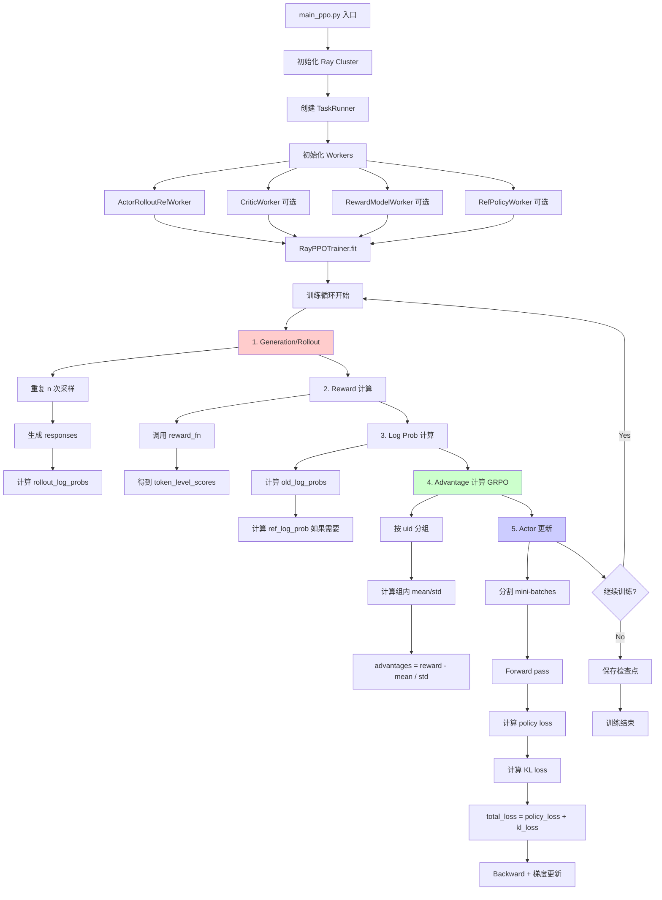

# GRPO Training 完整链路深度解析

> 本文档详细讲解 verl 框架中 GRPO (Group Relative Policy Optimization) 训练的完整链路，包括每一步的代码实现、核心算法和扩展接入点。

## 目录

- [1. 概述与核心概念](#1-概述与核心概念)
- [2. 整体架构流程](#2-整体架构流程)
- [3. 入口和初始化](#3-入口和初始化)
- [4. 训练主循环详解](#4-训练主循环详解)
- [5. 核心算法深度解析](#5-核心算法深度解析)
- [6. 关键组件架构](#6-关键组件架构)
- [7. 配置参数完全指南](#7-配置参数完全指南)
- [8. 修改和扩展指南](#8-修改和扩展指南)

---

## 1. 概述与核心概念

### 1.1 GRPO 是什么？

**文档来源**: `verl/docs/algo/grpo.md`

GRPO (Group Relative Policy Optimization) 是一种简化的强化学习算法，通过消除 Critic 模型来降低训练开销。

**核心特点**:
1. **无需 Value Function (Critic-less)**: 不训练单独的 value network
2. **Group Sampling (分组采样)**: 为每个 prompt 生成多个 completions 形成一组
3. **Relative Rewards (相对奖励)**: 组内的 reward 相对于组平均值进行归一化

### 1.2 与 PPO 的关键区别

| 特性 | PPO | GRPO |
|------|-----|------|
| Critic Model | ✅ 需要 | ❌ 不需要 |
| Advantage 计算 | GAE (需要 value function) | Group-based (组平均作为 baseline) |
| KL 惩罚方式 | 在 reward 中添加 | 在 loss 中添加 KL loss |
| 每个 prompt 的采样数 | 通常 1 次 | 多次 (n >= 2) |

### 1.3 算法流程

```
For each prompt in batch:
  1. Sample n responses (Group Sampling)
  2. Compute reward for each response
  3. Calculate group mean as baseline
  4. Advantage = (reward - group_mean) / group_std
  5. Update policy with advantage and KL loss
```

---

## 2. 整体架构流程

### 2.1 训练流程图



### 2.2 数据流转图

```mermaid
graph LR
    A[DataLoader] --> B[Batch: prompts]
    B --> C[Repeat n times]
    C --> D[Rollout Worker]
    D --> E[Batch: prompts + responses]
    E --> F[Reward Function]
    F --> G[Batch + token_level_scores]
    G --> H[Actor Worker]
    H --> I[Batch + old_log_probs]
    I --> J[Ref Worker 可选]
    J --> K[Batch + ref_log_prob]
    K --> L[Driver: compute_advantage]
    L --> M[Batch + advantages]
    M --> N[Actor Worker: update_policy]
    N --> O[Updated Model]
```



---

## 3. 入口和初始化

### 3.1 Main Entry Point

**文件路径**: `verl/trainer/main_ppo.py:35-42`

```python
@hydra.main(config_path="config", config_name="ppo_trainer", version_base=None)
def main(config):
    """Main entry point for PPO training with Hydra configuration management."""
    run_ppo(config)
```

**讲解**:
- 使用 Hydra 管理配置，默认配置文件为 `verl/trainer/config/ppo_trainer.yaml`
- GRPO 和 PPO 共用同一个入口，通过配置区分算法类型

**关键配置**:
```yaml
algorithm:
  adv_estimator: grpo  # 设置为 grpo
  use_kl_in_reward: false  # GRPO 不在 reward 中使用 KL

actor_rollout_ref:
  rollout:
    n: 5  # Group sampling 次数
  actor:
    use_kl_loss: true  # GRPO 使用 KL loss
    kl_loss_coef: 0.001
    kl_loss_type: low_var_kl
```

### 3.2 Ray 初始化

**文件路径**: `verl/trainer/main_ppo.py:55-66`

```python
if not ray.is_initialized():
    default_runtime_env = get_ppo_ray_runtime_env()
    ray_init_kwargs = config.ray_kwargs.get("ray_init", {})
    runtime_env_kwargs = ray_init_kwargs.get("runtime_env", {})
    runtime_env = OmegaConf.merge(default_runtime_env, runtime_env_kwargs)
    ray_init_kwargs = OmegaConf.create({**ray_init_kwargs, "runtime_env": runtime_env})
    print(f"ray init kwargs: {ray_init_kwargs}")
    ray.init(**OmegaConf.to_container(ray_init_kwargs))
```

**讲解**:
- 设置分布式运行环境
- 配置环境变量（TOKENIZERS_PARALLELISM, NCCL_DEBUG 等）
- 指定 CPU 核心数等资源

### 3.3 TaskRunner 和 Workers 初始化

**文件路径**: `verl/trainer/main_ppo.py:94-141`

```python
@ray.remote(num_cpus=1)
class TaskRunner:
    def __init__(self):
        self.role_worker_mapping = {}
        self.mapping = {}

    def add_actor_rollout_worker(self, config):
        from verl.single_controller.ray import RayWorkerGroup

        if config.actor_rollout_ref.actor.strategy in {"fsdp", "fsdp2"}:
            from verl.workers.fsdp_workers import ActorRolloutRefWorker
            actor_rollout_cls = ActorRolloutRefWorker
        elif config.actor_rollout_ref.actor.strategy == "megatron":
            from verl.workers.megatron_workers import ActorRolloutRefWorker
            actor_rollout_cls = ActorRolloutRefWorker

        self.role_worker_mapping[Role.ActorRollout] = ray.remote(actor_rollout_cls)
        return actor_rollout_cls, ray_worker_group_cls
```

**讲解**:
- TaskRunner 是 Ray remote actor，负责协调整个训练流程
- 根据配置选择不同的 worker 实现（FSDP 或 Megatron）
- `role_worker_mapping` 维护角色到 worker 类的映射

**Worker 角色**:
1. **ActorRollout**: 同时负责 generation 和 actor 训练（hybrid engine）
2. **Critic**: 可选，GRPO 不需要
3. **RefPolicy**: 可选，当使用 KL loss 时需要
4. **RewardModel**: 可选，当使用 model-based reward 时需要

### 3.4 Resource Pool 初始化

**文件路径**: `verl/trainer/main_ppo.py:166-189`

```python
def init_resource_pool_mgr(self, config):
    from verl.trainer.ppo.ray_trainer import Role, ResourcePoolManager

    global_pool_id = "global_pool"
    resource_pool_spec = {
        global_pool_id: [config.trainer.n_gpus_per_node] * config.trainer.nnodes,
    }

    # 可选：为 reward model 创建独立资源池
    if config.reward_model.enable_resource_pool:
        reward_pool = [config.reward_model.n_gpus_per_node] * config.reward_model.nnodes
        resource_pool_spec["reward_pool"] = reward_pool

    self.mapping[Role.ActorRollout] = global_pool_id
    self.mapping[Role.Critic] = global_pool_id

    resource_pool_manager = ResourcePoolManager(
        resource_pool_spec=resource_pool_spec,
        mapping=self.mapping
    )
    return resource_pool_manager
```

**讲解**:
- 管理 GPU 资源分配
- 可以为不同角色分配到不同的资源池
- `global_pool` 是默认池，所有主要 workers 使用

### 3.5 RayPPOTrainer 初始化

**文件路径**: `verl/trainer/main_ppo.py:298-312`

```python
trainer = RayPPOTrainer(
    config=config,
    tokenizer=tokenizer,
    processor=processor,
    role_worker_mapping=self.role_worker_mapping,
    resource_pool_manager=resource_pool_manager,
    ray_worker_group_cls=ray_worker_group_cls,
    reward_fn=reward_fn,
    val_reward_fn=val_reward_fn,
    train_dataset=train_dataset,
    val_dataset=val_dataset,
    collate_fn=collate_fn,
    train_sampler=train_sampler,
)
trainer.init_workers()
trainer.fit()
```

**讲解**:
- 创建主训练器实例
- `init_workers()` 初始化所有 Ray worker groups
- `fit()` 开始训练循环

---

## 4. 训练主循环详解

### 4.1 Fit 方法概览

**文件路径**: `verl/trainer/ppo/ray_trainer.py:921-1237`

```python
def fit(self):
    """训练循环的主要逻辑"""
    logger = Tracking(...)
    self.global_steps = 0
    self._load_checkpoint()  # 加载检查点（如果有）

    # 训练前验证
    if self.val_reward_fn is not None:
        val_metrics = self._validate()
        logger.log(data=val_metrics, step=self.global_steps)

    progress_bar = tqdm(total=self.total_training_steps, ...)

    for epoch in range(self.config.trainer.total_epochs):
        for batch_dict in self.train_dataloader:
            # === 核心训练步骤 ===
            # 1. Generation
            # 2. Reward 计算
            # 3. Log Prob 计算
            # 4. Advantage 计算
            # 5. Actor 更新
            # 6. Validation (可选)
            # 7. Checkpoint (可选)
```

### 4.2 Generation/Rollout 阶段

**文件路径**: `verl/trainer/ppo/ray_trainer.py:985-1008`

```python
# 准备 generation batch
batch: DataProto = DataProto.from_single_dict(batch_dict)
batch.non_tensor_batch["uid"] = np.array(
    [str(uuid.uuid4()) for _ in range(len(batch.batch))], dtype=object
)

gen_batch = self._get_gen_batch(batch)
gen_batch.meta_info["global_steps"] = self.global_steps

# === GRPO 关键：重复采样 n 次 ===
gen_batch = gen_batch.repeat(
    repeat_times=self.config.actor_rollout_ref.rollout.n,
    interleave=True
)

# 生成 responses
with marked_timer("gen", timing_raw, color="red"):
    if not self.async_rollout_mode:
        gen_batch_output = self.actor_rollout_wg.generate_sequences(gen_batch)
    else:
        gen_batch_output = self.async_rollout_manager.generate_sequences(gen_batch)

    timing_raw.update(gen_batch_output.meta_info["timing"])
```

**讲解**:
- **uid 的作用**: 唯一标识每个 prompt，用于后续 GRPO 分组
- **repeat 操作**: 将 batch 重复 n 次，实现 group sampling
  - 例如：原 batch_size=1024，n=5，则 gen_batch_size=5120
  - `interleave=True` 保证同一 prompt 的多个采样在一起
- **generate_sequences**: 调用 rollout worker（vLLM/SGLang）生成 responses

**数据结构变化**:
```python
# 输入 gen_batch
{
    'input_ids': [batch_size, prompt_len],
    'attention_mask': [batch_size, prompt_len],
    'uid': [batch_size]  # 唯一标识符
}

# 输出 gen_batch_output
{
    'responses': [batch_size * n, response_len],
    'rollout_log_probs': [batch_size * n, response_len],  # 可选
    ...
}
```

### 4.3 Reward 计算阶段

**文件路径**: `verl/trainer/ppo/ray_trainer.py:1031-1056`

```python
# 合并 batch 和 generation 输出
batch = batch.repeat(repeat_times=self.config.actor_rollout_ref.rollout.n, interleave=True)
batch = batch.union(gen_batch_output)

# 计算 response mask
if "response_mask" not in batch.batch.keys():
    batch.batch["response_mask"] = compute_response_mask(batch)

# Reward 计算
with marked_timer("reward", timing_raw, color="yellow"):
    # 如果有 reward model
    if self.use_rm and "rm_scores" not in batch.batch.keys():
        reward_tensor = self.rm_wg.compute_rm_score(batch)
        batch = batch.union(reward_tensor)

    # 调用 reward function
    if self.config.reward_model.launch_reward_fn_async:
        future_reward = compute_reward_async.remote(data=batch, reward_fn=self.reward_fn)
    else:
        reward_tensor, reward_extra_infos_dict = compute_reward(batch, self.reward_fn)
```

**讲解**:
- **response_mask**: 标记哪些 token 是 response 部分，用于后续 mask 计算
- **reward_fn**: 可以是函数式 reward（如 GSM8K 验证）或 model-based reward
- **异步计算**: 可选择异步计算 reward 以提升效率

**Reward Function 示例**:
```python
# verl/trainer/ppo/reward.py
def compute_reward(data: DataProto, reward_fn) -> tuple:
    """
    reward_fn 签名:
    - 输入: DataProto (包含 prompts, responses, ground_truth 等)
    - 输出:
      - reward_tensor: [batch_size, response_len]
      - reward_extra_infos: dict (可选的额外信息)
    """
    result = reward_fn(data, return_dict=True)
    reward_tensor = result["reward_tensor"]
    reward_extra_infos = result.get("reward_extra_info", {})
    return reward_tensor, reward_extra_infos
```

### 4.4 Log Probability 计算

**文件路径**: `verl/trainer/ppo/ray_trainer.py:1059-1083`

```python
# 计算 old_log_probs（当前策略的 log prob）
with marked_timer("old_log_prob", timing_raw, color="blue"):
    old_log_prob = self.actor_rollout_wg.compute_log_prob(batch)
    entropys = old_log_prob.batch["entropys"]
    response_masks = batch.batch["response_mask"]

    # 计算 entropy metric
    loss_agg_mode = self.config.actor_rollout_ref.actor.loss_agg_mode
    entropy_agg = agg_loss(
        loss_mat=entropys,
        loss_mask=response_masks,
        loss_agg_mode=loss_agg_mode
    )
    old_log_prob_metrics = {"actor/entropy": entropy_agg.detach().item()}

    old_log_prob.batch.pop("entropys")
    batch = batch.union(old_log_prob)

# 计算 reference log prob（如果需要 KL）
if self.use_reference_policy:
    with marked_timer("ref", timing_raw, color="olive"):
        if not self.ref_in_actor:
            ref_log_prob = self.ref_policy_wg.compute_ref_log_prob(batch)
        else:
            # 如果使用 LoRA，actor 不带 LoRA 就是 ref
            ref_log_prob = self.actor_rollout_wg.compute_ref_log_prob(batch)
        batch = batch.union(ref_log_prob)
```

**讲解**:
- **old_log_probs**: 在 rollout 时就可以计算，但这里重新计算是为了后续梯度更新
- **entropy**: 策略的熵，用于鼓励探索（可选）
- **ref_log_prob**: Reference policy 的 log prob，用于 KL loss
- **ref_in_actor**: 当使用 LoRA 时，base model 就是 reference policy

**Log Prob 计算细节** (`verl/workers/actor/dp_actor.py:297-356`):
```python
def compute_log_prob(self, data: DataProto, calculate_entropy=False):
    """计算 log probability"""
    # 准备 micro batches
    micro_batches = ...

    log_probs_list = []
    entropys_list = []

    for micro_batch in micro_batches:
        # Forward pass 获取 logits
        entropy, log_prob = self._forward_micro_batch(
            micro_batch, temperature, calculate_entropy
        )
        log_probs_list.append(log_prob)
        if calculate_entropy:
            entropys_list.append(entropy)

    # 拼接所有 micro batch 结果
    log_probs = torch.cat(log_probs_list, dim=0)

    return log_probs, entropys
```

### 4.5 Advantage 计算 (GRPO 核心)

**文件路径**: `verl/trainer/ppo/ray_trainer.py:1091-1123`

```python
with marked_timer("adv", timing_raw, color="brown"):
    # 获取 reward
    if self.config.reward_model.launch_reward_fn_async:
        reward_tensor, reward_extra_infos_dict = ray.get(future_reward)
    batch.batch["token_level_scores"] = reward_tensor

    # 应用 KL penalty（如果在 reward 中，GRPO 不使用）
    if self.config.algorithm.use_kl_in_reward:
        batch, kl_metrics = apply_kl_penalty(
            batch, kl_ctrl=self.kl_ctrl_in_reward,
            kl_penalty=self.config.algorithm.kl_penalty
        )
        batch.batch["token_level_rewards"] = batch.batch["token_level_scores"] - kl_penalty
    else:
        batch.batch["token_level_rewards"] = batch.batch["token_level_scores"]

    # === GRPO Advantage 计算 ===
    norm_adv_by_std_in_grpo = self.config.algorithm.get("norm_adv_by_std_in_grpo", True)

    batch = compute_advantage(
        batch,
        adv_estimator=self.config.algorithm.adv_estimator,  # AdvantageEstimator.GRPO
        gamma=self.config.algorithm.gamma,
        lam=self.config.algorithm.lam,
        num_repeat=self.config.actor_rollout_ref.rollout.n,
        norm_adv_by_std_in_grpo=norm_adv_by_std_in_grpo,
        config=self.config.algorithm,
    )
```

**讲解**:
- **token_level_scores**: 原始 reward
- **token_level_rewards**: 应用 KL penalty 后的 reward（GRPO 不使用）
- **compute_advantage**: 调用具体的 advantage estimator（详见第5节）
- **norm_adv_by_std_in_grpo**: 是否按标准差归一化（GRPO 默认 True，Dr.GRPO 为 False）

### 4.6 Actor 更新

**文件路径**: `verl/trainer/ppo/ray_trainer.py:1133-1139`

```python
# 跳过 critic warmup 阶段（GRPO 无 critic）
if self.config.trainer.critic_warmup <= self.global_steps:
    # 更新 actor
    with marked_timer("update_actor", timing_raw, color="red"):
        batch.meta_info["multi_turn"] = self.config.actor_rollout_ref.rollout.multi_turn.enable
        actor_output = self.actor_rollout_wg.update_actor(batch)

    actor_output_metrics = reduce_metrics(actor_output.meta_info["metrics"])
    metrics.update(actor_output_metrics)
```

**update_actor 详细实现** (`verl/workers/actor/dp_actor.py:359-494`):

```python
def update_policy(self, data: DataProto):
    self.actor_module.train()
    temperature = data.meta_info["temperature"]

    # 选择需要的 keys
    select_keys = [
        "responses", "response_mask", "input_ids", "attention_mask",
        "position_ids", "old_log_probs", "advantages"
    ]
    if self.config.use_kl_loss:
        select_keys.append("ref_log_prob")

    data = data.select(batch_keys=select_keys, ...)

    # 分割 mini-batches（PPO 标准做法）
    mini_batches = data.split(self.config.ppo_mini_batch_size)

    metrics = {}
    for _ in range(self.config.ppo_epochs):
        for mini_batch in mini_batches:
            # 进一步分割为 micro-batches（梯度累积）
            micro_batches = mini_batch.split(self.config.ppo_micro_batch_size_per_gpu)
            self.actor_optimizer.zero_grad()

            for micro_batch in micro_batches:
                micro_batch = micro_batch.to(device)

                # === 1. Forward pass 计算 log_prob ===
                entropy, log_prob = self._forward_micro_batch(
                    micro_batch, temperature, calculate_entropy=(entropy_coeff != 0)
                )

                # === 2. 计算 Policy Loss ===
                old_log_prob = micro_batch["old_log_probs"]
                advantages = micro_batch["advantages"]
                response_mask = micro_batch["response_mask"]

                policy_loss_fn = get_policy_loss_fn(loss_mode)
                pg_loss, pg_clipfrac, ppo_kl, _ = policy_loss_fn(
                    old_log_prob=old_log_prob,
                    log_prob=log_prob,
                    advantages=advantages,
                    response_mask=response_mask,
                    loss_agg_mode=loss_agg_mode,
                    config=self.config,
                )

                # === 3. 添加 Entropy Loss ===
                if entropy_coeff != 0:
                    entropy_loss = agg_loss(entropy, response_mask, loss_agg_mode)
                    policy_loss = pg_loss - entropy_loss * entropy_coeff
                else:
                    policy_loss = pg_loss

                # === 4. 添加 KL Loss (GRPO 特有) ===
                if self.config.use_kl_loss:
                    ref_log_prob = micro_batch["ref_log_prob"]
                    kld = kl_penalty(
                        logprob=log_prob,
                        ref_logprob=ref_log_prob,
                        kl_penalty=self.config.kl_loss_type
                    )
                    kl_loss = agg_loss(kld, response_mask, loss_agg_mode)
                    policy_loss = policy_loss + kl_loss * self.config.kl_loss_coef

                # === 5. Backward ===
                loss = policy_loss * loss_scale_factor
                loss.backward()

            # === 6. 梯度裁剪和优化器步进 ===
            grad_norm = self._optimizer_step()

    return metrics
```

**讲解**:
- **Mini-batch 和 Micro-batch**:
  - Mini-batch: PPO 标准做法，多次迭代同一批数据
  - Micro-batch: 梯度累积，降低显存占用
- **Policy Loss**: PPO clipping loss（详见第5节）
- **KL Loss**: GRPO 的关键，直接在 loss 中添加而非 reward

---

## 5. 核心算法深度解析

### 5.1 GRPO Advantage 计算

**文件路径**: `verl/trainer/ppo/core_algos.py:264-328`

```python
@register_adv_est(AdvantageEstimator.GRPO)
def compute_grpo_outcome_advantage(
    token_level_rewards: torch.Tensor,  # (bs, response_length)
    response_mask: torch.Tensor,  # (bs, response_length)
    index: np.ndarray,  # (bs,) uid 数组
    epsilon: float = 1e-6,
    norm_adv_by_std_in_grpo: bool = True,
    config: Optional[AlgoConfig] = None,
) -> tuple[torch.Tensor, torch.Tensor]:
    """
    GRPO 核心算法：基于 Group 的 Outcome Advantage

    核心思想：
    1. 将同一个 prompt 的多个 responses 分为一组（通过 index/uid）
    2. 计算组内 reward 的均值和标准差
    3. Advantage = (reward - group_mean) / group_std
    """

    # === Step 1: 计算每个 response 的总 reward ===
    scores = token_level_rewards.sum(dim=-1)  # (bs,) 每个 response 的总分

    # === Step 2: 按 index 分组 ===
    id2score = defaultdict(list)
    id2mean = {}
    id2std = {}

    with torch.no_grad():
        bsz = scores.shape[0]

        # 收集每个 group 的所有 scores
        for i in range(bsz):
            id2score[index[i]].append(scores[i])

        # === Step 3: 计算每个 group 的统计量 ===
        for idx in id2score:
            if len(id2score[idx]) == 1:
                # 只有1个样本，无法计算 std
                id2mean[idx] = torch.tensor(0.0)
                id2std[idx] = torch.tensor(1.0)
            elif len(id2score[idx]) > 1:
                scores_tensor = torch.stack(id2score[idx])
                id2mean[idx] = torch.mean(scores_tensor)  # 组均值
                id2std[idx] = torch.std(scores_tensor)    # 组标准差
            else:
                raise ValueError(f"no score in prompt index: {idx}")

        # === Step 4: 计算每个样本的 advantage ===
        for i in range(bsz):
            if norm_adv_by_std_in_grpo:
                # 标准 GRPO: (r - mean) / std
                scores[i] = (scores[i] - id2mean[index[i]]) / (id2std[index[i]] + epsilon)
            else:
                # Dr.GRPO: r - mean (不除以 std，避免长度偏差)
                scores[i] = scores[i] - id2mean[index[i]]

        # === Step 5: 广播到 token 维度 ===
        scores = scores.unsqueeze(-1) * response_mask  # (bs, response_length)

    return scores, scores  # (advantages, returns)
```

**关键理解**:

1. **为什么用 Group Mean 作为 Baseline？**
   - 不需要额外训练 value network
   - 同一 prompt 的多个 responses 自然形成对比
   - 高于平均的 response 会被强化，低于平均的会被抑制

2. **Normalization 的作用**:
   - `norm_adv_by_std_in_grpo=True`: 标准化到相同尺度，避免不同 group 的 std 差异影响训练
   - `norm_adv_by_std_in_grpo=False`: Dr.GRPO，避免人为拉长回复来获得更高 advantage

3. **Index/UID 的重要性**:
   - 必须正确分组，确保同一 prompt 的 responses 在一个 group
   - Repeat 时使用 `interleave=True` 保证正确分组

**示例**:
```python
# 假设 batch_size=2, n=3（每个 prompt 采样3次）
prompts = ["What is 2+2?", "What is 3+3?"]
uid = ["uid1", "uid1", "uid1", "uid2", "uid2", "uid2"]  # 分组标识

responses = [
    "2+2=4",     # uid1, score=1.0
    "2+2=5",     # uid1, score=0.0
    "2+2=4!",    # uid1, score=1.0
    "3+3=6",     # uid2, score=1.0
    "3+3=7",     # uid2, score=0.0
    "3+3=5",     # uid2, score=0.0
]

# Group 1 (uid1): scores=[1.0, 0.0, 1.0]
#   mean=0.667, std=0.471
#   advantages = [(1.0-0.667)/0.471, (0.0-0.667)/0.471, (1.0-0.667)/0.471]
#              = [0.707, -1.415, 0.707]

# Group 2 (uid2): scores=[1.0, 0.0, 0.0]
#   mean=0.333, std=0.471
#   advantages = [(1.0-0.333)/0.471, (0.0-0.333)/0.471, (0.0-0.333)/0.471]
#              = [1.415, -0.707, -0.707]
```

### 5.2 KL Loss 计算

**文件路径**: `verl/trainer/ppo/core_algos.py` (kl_penalty 函数)

```python
def kl_penalty(
    logprob: torch.Tensor,      # 当前策略的 log prob
    ref_logprob: torch.Tensor,  # Reference 策略的 log prob
    kl_penalty: str = "kl"      # KL 类型
) -> torch.Tensor:
    """
    计算 KL divergence

    支持的类型：
    - "kl" (k1): KL(ref || policy) = ref_log - log
    - "abs": |ref_log - log|
    - "mse" (k2): (ref_log - log)^2
    - "low_var_kl" (k3): 混合 k1 和 k2，降低方差
    - "full": 完整 KL = exp(ref_log) * (ref_log - log)
    """
    if kl_penalty == "kl" or kl_penalty == "k1":
        # 近似 KL: ref_log - log
        return ref_logprob - logprob

    elif kl_penalty == "abs":
        return torch.abs(ref_logprob - logprob)

    elif kl_penalty == "mse" or kl_penalty == "k2":
        return 0.5 * (ref_logprob - logprob).pow(2)

    elif kl_penalty == "low_var_kl" or kl_penalty == "k3":
        # 混合 k1 和 k2，平衡偏差和方差
        kl = ref_logprob - logprob
        return torch.where(kl < 0, kl, 0.5 * kl.pow(2))

    elif kl_penalty == "full":
        # 完整 KL divergence
        return torch.exp(ref_logprob) * (ref_logprob - logprob)

    else:
        raise ValueError(f"Unknown kl_penalty: {kl_penalty}")
```

**Straight-through Variants (+后缀)**:
```python
# 如果 kl_penalty 以 '+' 结尾（如 'k1+', 'k3+'）
# 使用 straight-through estimator 进行无偏梯度估计
if kl_penalty.endswith('+'):
    base_type = kl_penalty[:-1]
    kl_value = kl_penalty(logprob, ref_logprob, base_type)
    # 计算梯度时使用 k2（MSE）
    kl_grad = kl_penalty(logprob, ref_logprob, "k2")
    # Straight-through: forward 用 value，backward 用 grad
    kl = kl_value.detach() + (kl_grad - kl_grad.detach())
    return kl
```

**在 Actor Update 中的应用** (`verl/workers/actor/dp_actor.py:462-472`):
```python
if self.config.use_kl_loss:
    ref_log_prob = micro_batch["ref_log_prob"]

    # 计算 token-level KL
    kld = kl_penalty(
        logprob=log_prob,
        ref_logprob=ref_log_prob,
        kl_penalty=self.config.kl_loss_type  # 例如 "low_var_kl"
    )  # (bsz, response_length)

    # Aggregate 到 scalar
    kl_loss = agg_loss(
        loss_mat=kld,
        loss_mask=response_mask,
        loss_agg_mode=loss_agg_mode
    )

    # 添加到 policy loss
    policy_loss = policy_loss + kl_loss * self.config.kl_loss_coef
```

**KL Loss 的作用**:
- 防止策略偏离 reference policy 太远
- 提高训练稳定性
- GRPO 必须使用 KL loss（而非 reward 中的 KL penalty）

### 5.3 Policy Loss 计算

**文件路径**: `verl/trainer/ppo/core_algos.py` (compute_policy_loss_vanilla)

```python
@register_policy_loss("vanilla")
def compute_policy_loss_vanilla(
    old_log_prob: torch.Tensor,  # (bs, response_length)
    log_prob: torch.Tensor,      # (bs, response_length)
    advantages: torch.Tensor,    # (bs, response_length)
    response_mask: torch.Tensor, # (bs, response_length)
    loss_agg_mode: str,
    config: Optional[AlgoConfig] = None,
    rollout_log_probs: torch.Tensor = None,
) -> tuple:
    """
    PPO Policy Loss with Clipping

    核心公式：
    ratio = exp(log_prob - old_log_prob)
    clipped_ratio = clip(ratio, 1-epsilon, 1+epsilon)
    loss = -min(ratio * advantage, clipped_ratio * advantage)
    """

    # === 1. 计算 importance sampling ratio ===
    ratio = torch.exp(log_prob - old_log_prob)  # (bs, response_length)

    # === 2. PPO Clipping ===
    clip_ratio = config.clip_ratio if config else 0.2
    clipped_ratio = torch.clamp(ratio, 1.0 - clip_ratio, 1.0 + clip_ratio)

    # === 3. 计算两种 loss ===
    pg_loss1 = -advantages * ratio
    pg_loss2 = -advantages * clipped_ratio

    # === 4. 取最大值（最保守的更新）===
    pg_loss = torch.max(pg_loss1, pg_loss2)

    # === 5. Aggregate ===
    pg_loss = agg_loss(pg_loss, response_mask, loss_agg_mode)

    # === 6. 计算 metrics ===
    with torch.no_grad():
        # Clip fraction: 被 clip 的比例
        pg_clipfrac = torch.mean((torch.abs(ratio - 1.0) > clip_ratio).float())

        # PPO KL: 近似 KL divergence
        ppo_kl = torch.mean((log_prob - old_log_prob) * response_mask)

        # Lower clip fraction
        pg_clipfrac_lower = torch.mean((ratio < 1.0 - clip_ratio).float())

    return pg_loss, pg_clipfrac, ppo_kl, pg_clipfrac_lower
```

**Loss Aggregation 模式** (`verl/trainer/ppo/core_algos.py:agg_loss`):

```python
def agg_loss(
    loss_mat: torch.Tensor,    # (bs, response_length)
    loss_mask: torch.Tensor,   # (bs, response_length)
    loss_agg_mode: str
) -> torch.Tensor:
    """
    聚合 token-level loss 到 scalar

    支持的模式：
    - "token-mean": 所有 token 的平均（默认，GRPO 推荐）
    - "seq-mean-token-sum": 序列维度求和，batch 维度平均
    - "seq-mean-token-mean": 序列和 batch 都平均（原始 GRPO 论文）
    - "seq-mean-token-sum-norm": Dr.GRPO 模式
    """

    if loss_agg_mode == "token-mean":
        # 所有 valid token 的平均
        loss = masked_mean(loss_mat, mask=loss_mask, axis=None)

    elif loss_agg_mode == "seq-mean-token-sum":
        # 每个序列先求和，然后 batch 平均
        loss = torch.sum(loss_mat * loss_mask, dim=-1)  # (bs,)
        loss = torch.mean(loss, dim=0)  # scalar

    elif loss_agg_mode == "seq-mean-token-mean":
        # 原始 GRPO: 序列平均，batch 平均
        loss = masked_mean(loss_mat, mask=loss_mask, axis=-1)  # (bs,)
        loss = torch.mean(loss, dim=0)  # scalar

    elif loss_agg_mode == "seq-mean-token-sum-norm":
        # Dr.GRPO: 全局常数归一化
        loss = torch.sum(loss_mat * loss_mask)
        loss = loss / loss_mask.sum()

    else:
        raise ValueError(f"Unknown loss_agg_mode: {loss_agg_mode}")

    return loss
```

**为什么 GRPO 推荐 "token-mean"？**
- 原始 GRPO 论文使用 "seq-mean-token-mean"，但在长 CoT 场景不稳定
- "token-mean" 更稳定，所有 verl 示例都使用此模式
- Dr.GRPO 使用 "seq-mean-token-sum-norm" 避免长度偏差

---

## 6. 关键组件架构

### 6.1 ActorRolloutRefWorker (Hybrid Engine)

**文件路径**: `verl/workers/fsdp_workers.py:133-200`

```python
class ActorRolloutRefWorker(Worker, DistProfilerExtension):
    """
    Hybrid Engine: 单个 worker 同时承担多个角色

    可能的角色组合：
    - "actor_rollout_ref": Actor + Rollout + Reference (GRPO 典型配置)
    - "actor_rollout": Actor + Rollout
    - "actor": 仅 Actor
    - "rollout": 仅 Rollout
    - "ref": 仅 Reference
    """

    def __init__(self, config: DictConfig, role: str, **kwargs):
        Worker.__init__(self)
        self.config = config

        # 初始化分布式
        if not torch.distributed.is_initialized():
            torch.distributed.init_process_group(...)

        # 构建 FSDP device mesh
        world_size = torch.distributed.get_world_size()
        self.device_mesh = create_device_mesh(
            world_size=world_size,
            fsdp_size=self.config.actor.fsdp_config.fsdp_size
        )

        # Ulysses Sequence Parallel device mesh (可选)
        self.ulysses_sequence_parallel_size = self.config.actor.get(
            "ulysses_sequence_parallel_size", 1
        )
        if self.ulysses_sequence_parallel_size > 1:
            self.ulysses_device_mesh = init_device_mesh(...)

        # 确定角色
        self.role = role
        self._is_actor = self.role in ["actor", "actor_rollout", "actor_rollout_ref"]
        self._is_rollout = self.role in ["rollout", "actor_rollout", "actor_rollout_ref"]
        self._is_ref = self.role in ["ref", "actor_rollout_ref"]

        # LoRA 配置
        self._lora_rank = self.config.model.get("lora_rank", 0)
        self._is_lora = self._lora_rank > 0
```

**核心方法**:

1. **init_model** - 初始化模型
2. **update_actor** - Actor 更新（调用 DataParallelPPOActor）
3. **generate_sequences** - Rollout 生成
4. **compute_log_prob** - 计算 log probability
5. **compute_ref_log_prob** - 计算 reference log probability

### 6.2 Model 初始化流程

**文件路径**: `verl/workers/fsdp_workers.py` (init_model 方法)

```python
def init_model(self):
    """初始化模型、优化器、rollout"""

    # === 1. 加载 base model ===
    from verl.utils import hf_tokenizer, hf_processor

    local_path = copy_to_local(self.config.model.path)
    tokenizer = hf_tokenizer(local_path)
    processor = hf_processor(local_path)  # 多模态

    # 加载 HF model
    from transformers import AutoModelForCausalLM

    with get_init_weight_context_manager(...):
        actor_model = AutoModelForCausalLM.from_pretrained(
            local_path,
            torch_dtype=torch.bfloat16,
            attn_implementation="flash_attention_2",
            ...
        )

    # === 2. 应用 LoRA (可选) ===
    if self._is_lora:
        from peft import LoraConfig, get_peft_model

        lora_config = LoraConfig(
            task_type=TaskType.CAUSAL_LM,
            r=self._lora_rank,
            lora_alpha=self.config.model.lora_alpha,
            target_modules=self.config.model.lora_target_modules,
            ...
        )
        actor_model = get_peft_model(actor_model, lora_config)

    # === 3. 应用 FSDP ===
    from verl.utils.fsdp_utils import get_fsdp_wrap_policy, apply_fsdp2

    fsdp_config = self.config.actor.fsdp_config
    wrap_policy = get_fsdp_wrap_policy(actor_model, fsdp_config)

    if fsdp_config.version == "2":
        actor_model = apply_fsdp2(
            actor_model,
            device_mesh=self.device_mesh,
            wrap_policy=wrap_policy,
            ...
        )
    else:
        from torch.distributed.fsdp import FullyShardedDataParallel as FSDP
        actor_model = FSDP(
            actor_model,
            device_mesh=self.device_mesh,
            auto_wrap_policy=wrap_policy,
            ...
        )

    # === 4. 创建 Actor/Ref ===
    if self._is_actor:
        # 创建优化器
        from verl.utils.megatron import get_megatron_optimizer
        actor_optimizer = get_megatron_optimizer(
            actor_model,
            self.config.actor.optim
        )

        # 创建 DataParallelPPOActor
        from verl.workers.actor import DataParallelPPOActor
        self.actor = DataParallelPPOActor(
            config=self.config.actor,
            actor_module=actor_model,
            actor_optimizer=actor_optimizer
        )

    if self._is_ref and not self._is_lora:
        # Reference 是不带优化器的 actor
        self.ref_policy = DataParallelPPOActor(
            config=self.config.ref,
            actor_module=actor_model,
            actor_optimizer=None  # 无优化器
        )

    # === 5. 创建 Rollout ===
    if self._is_rollout:
        from verl.workers.rollout import get_rollout_class

        rollout_cls = get_rollout_class(self.config.rollout.name)
        self.rollout = rollout_cls(
            actor_module=actor_model,
            config=self.config.rollout,
            tokenizer=tokenizer,
            ...
        )
```

**Hybrid Engine 的优势**:
- **显存效率**: 三个角色共享同一个模型权重
- **通信效率**: 避免模型参数在不同 workers 间传输
- **计算效率**: 充分利用 GPU

### 6.3 Rollout 组件

**文件路径**: `verl/workers/rollout/vllm_rollout/` 或 `verl/workers/rollout/sglang_rollout/`

GRPO 通常使用 vLLM 或 SGLang 作为 rollout 引擎：

```python
class VLLMRollout:
    """vLLM-based Rollout Worker"""

    def __init__(self, actor_module, config, tokenizer, ...):
        # 初始化 vLLM engine
        from vllm import LLM

        self.llm = LLM(
            model=actor_module,  # 使用 FSDP 包装的模型
            tensor_parallel_size=config.tensor_model_parallel_size,
            gpu_memory_utilization=config.gpu_memory_utilization,
            ...
        )
        self.tokenizer = tokenizer

    def generate_sequences(self, data: DataProto) -> DataProto:
        """
        生成 sequences

        输入:
        - data.batch['input_ids']: (bs, prompt_len)

        输出:
        - data.batch['responses']: (bs, response_len)
        - data.batch['rollout_log_probs']: (bs, response_len) [可选]
        """

        # 准备 sampling params
        from vllm import SamplingParams

        sampling_params = SamplingParams(
            temperature=data.meta_info.get("temperature", 1.0),
            top_p=data.meta_info.get("top_p", 1.0),
            max_tokens=self.config.response_length,
            n=1,  # 每个 prompt 生成 1 个（已在上层 repeat）
            ...
        )

        # vLLM 生成
        prompts = self.tokenizer.batch_decode(data.batch['input_ids'])
        outputs = self.llm.generate(prompts, sampling_params)

        # 解析输出
        responses = []
        rollout_log_probs = [] if self.config.calculate_log_probs else None

        for output in outputs:
            response_ids = output.outputs[0].token_ids
            responses.append(response_ids)

            if rollout_log_probs is not None:
                log_probs = output.outputs[0].logprobs
                rollout_log_probs.append(log_probs)

        # 构造返回的 DataProto
        output_data = DataProto(batch={
            'responses': torch.tensor(responses),
            'rollout_log_probs': torch.tensor(rollout_log_probs) if rollout_log_probs else None,
        })

        return output_data
```

**vLLM vs SGLang**:
- **vLLM**: 更成熟，支持更多模型
- **SGLang**: 更快，支持 multi-turn（agent loop）

---

## 7. 配置参数完全指南

### 7.1 GRPO 核心配置

**文件路径**: `verl/trainer/config/ppo_trainer.yaml`

```yaml
# === Algorithm 配置 ===
algorithm:
  adv_estimator: grpo  # 必须设置为 grpo
  use_kl_in_reward: false  # GRPO 不在 reward 中使用 KL
  norm_adv_by_std_in_grpo: true  # 是否标准化 advantage（Dr.GRPO=false）
  gamma: 1.0  # Discount factor（GRPO 通常为 1.0）
  lam: 1.0    # GAE lambda（GRPO 不使用）

  # KL control（如果 use_kl_in_reward=true）
  kl_ctrl:
    type: fixed  # 或 "adaptive"
    kl_coef: 0.001

# === Data 配置 ===
data:
  train_batch_size: 1024  # 全局 batch size（prompts 数量）
  max_prompt_length: 512
  max_response_length: 1024
  gen_batch_size: 1024  # Generation batch size（可选，默认=train_batch_size）

# === Actor/Rollout/Ref 配置 ===
actor_rollout_ref:
  # Model 配置
  model:
    path: "Qwen/Qwen3-8B"
    lora_rank: 0  # 0=不使用 LoRA，>0=使用 LoRA
    lora_alpha: 16
    use_remove_padding: true  # 使用 remove padding 优化
    enable_gradient_checkpointing: true

  # Actor 配置
  actor:
    strategy: fsdp  # 或 "fsdp2", "megatron"
    ppo_mini_batch_size: 256  # Mini-batch size（全局）
    ppo_micro_batch_size_per_gpu: 32  # Micro-batch size（每GPU）
    ppo_epochs: 1  # PPO 更新轮数

    # === GRPO 特有配置 ===
    use_kl_loss: true  # 必须为 true
    kl_loss_coef: 0.001  # KL loss 系数
    kl_loss_type: low_var_kl  # KL 类型：kl, mse, low_var_kl, full

    # Loss aggregation
    loss_agg_mode: token-mean  # 推荐：token-mean

    # Optimizer
    optim:
      lr: 1e-6
      betas: [0.9, 0.999]
      eps: 1e-8
      weight_decay: 0.0

    # FSDP 配置
    fsdp_config:
      version: "2"  # FSDP2
      fsdp_size: -1  # -1=world_size
      param_offload: false
      optimizer_offload: false

  # Rollout 配置
  rollout:
    name: vllm  # 或 "sglang"
    n: 5  # === Group sampling 次数（核心参数）===
    temperature: 1.0
    top_p: 1.0
    tensor_model_parallel_size: 2  # vLLM TP size
    gpu_memory_utilization: 0.6
    log_prob_micro_batch_size_per_gpu: 32

  # Reference 配置
  ref:
    log_prob_micro_batch_size_per_gpu: 32
    fsdp_config:
      param_offload: true  # Ref 可以 offload

# === Trainer 配置 ===
trainer:
  total_epochs: 15
  save_freq: 20  # 每 20 steps 保存
  test_freq: 5   # 每 5 steps 验证
  critic_warmup: 0  # GRPO 无 critic
  n_gpus_per_node: 8
  nnodes: 1
```

### 7.2 关键参数详解

#### 7.2.1 Group Sampling 配置

```yaml
actor_rollout_ref.rollout.n: 5
```
- **作用**: 每个 prompt 采样多少次
- **建议值**:
  - 数学任务：4-8
  - 代码任务：4-16
  - 对话任务：2-4
- **影响**:
  - 越大：baseline 越准确，但显存和计算开销越大
  - 越小：训练速度快，但 variance 大

#### 7.2.2 KL Loss 配置

```yaml
actor_rollout_ref.actor.use_kl_loss: true
actor_rollout_ref.actor.kl_loss_coef: 0.001
actor_rollout_ref.actor.kl_loss_type: low_var_kl
```
- **kl_loss_type 选择**:
  - `kl` (k1): 简单，但高方差
  - `mse` (k2): 低方差，但有偏
  - `low_var_kl` (k3): **推荐**，平衡偏差和方差
  - `full`: 完整 KL，计算开销大
  - 加 `+` 后缀（如 `k3+`）: 使用 straight-through 梯度估计

- **kl_loss_coef 调节**:
  - 太大：策略更新太保守
  - 太小：策略可能崩溃
  - 典型值：0.0001 - 0.01

#### 7.2.3 Loss Aggregation 配置

```yaml
actor_rollout_ref.actor.loss_agg_mode: token-mean
```
- **模式对比**:
  - `token-mean`: **GRPO 推荐**，所有 token 平均，稳定
  - `seq-mean-token-mean`: 原始 GRPO 论文，长 CoT 不稳定
  - `seq-mean-token-sum-norm`: Dr.GRPO，避免长度偏差

#### 7.2.4 Advantage Normalization 配置

```yaml
algorithm.norm_adv_by_std_in_grpo: true
```
- `true`: 标准 GRPO，除以组标准差
- `false`: Dr.GRPO，不除以标准差，避免人为拉长 response

### 7.3 不同场景的推荐配置

#### GSM8K 数学任务
```yaml
algorithm:
  adv_estimator: grpo
  norm_adv_by_std_in_grpo: true

actor_rollout_ref:
  rollout:
    n: 5
    temperature: 1.0
  actor:
    use_kl_loss: true
    kl_loss_coef: 0.001
    kl_loss_type: low_var_kl
    loss_agg_mode: token-mean
```

#### 代码生成任务
```yaml
algorithm:
  adv_estimator: grpo
  norm_adv_by_std_in_grpo: true

actor_rollout_ref:
  rollout:
    n: 8  # 更多采样
    temperature: 0.8
  actor:
    use_kl_loss: true
    kl_loss_coef: 0.0005  # 更小的 KL coef
    kl_loss_type: low_var_kl
    loss_agg_mode: token-mean
```

#### 长 CoT 推理任务（Dr.GRPO）
```yaml
algorithm:
  adv_estimator: grpo
  norm_adv_by_std_in_grpo: false  # 不标准化

actor_rollout_ref:
  rollout:
    n: 4
    temperature: 1.0
  actor:
    use_kl_loss: false  # Dr.GRPO 不用 KL loss
    loss_agg_mode: seq-mean-token-sum-norm  # 全局归一化
```

---

## 8. 修改和扩展指南

### 8.1 如何添加自定义 Advantage Estimator

**步骤**:

1. **定义新的 estimator**

**文件**: 创建新文件或在 `verl/trainer/ppo/core_algos.py` 中添加

```python
from verl.trainer.ppo.core_algos import register_adv_est, AdvantageEstimator
import torch

@register_adv_est("my_custom_adv")  # 注册名称
def compute_my_custom_advantage(
    token_level_rewards: torch.Tensor,
    response_mask: torch.Tensor,
    index: np.ndarray = None,
    config: Optional[AlgoConfig] = None,
    **kwargs
) -> tuple[torch.Tensor, torch.Tensor]:
    """
    自定义 advantage 计算

    必须返回: (advantages, returns)
    """

    # 你的实现
    # 例如：简单的 REINFORCE（无 baseline）
    scores = token_level_rewards.sum(dim=-1)  # (bs,)
    advantages = scores.unsqueeze(-1) * response_mask  # (bs, response_len)

    return advantages, advantages
```

2. **在配置中使用**

```yaml
algorithm:
  adv_estimator: my_custom_adv  # 使用自定义名称
```

3. **（可选）添加到 Enum**

如果想添加到 `AdvantageEstimator` enum：

```python
class AdvantageEstimator(str, Enum):
    # ... 现有的 ...
    MY_CUSTOM = "my_custom_adv"
```

### 8.2 如何添加自定义 Reward Function

**方式一：函数式 Reward**

**文件**: 创建 `my_reward.py`

```python
from verl import DataProto
import torch

def my_custom_reward_fn(data: DataProto, return_dict=True):
    """
    自定义 reward 函数

    输入:
    - data.batch['prompts']: (bs, prompt_len)
    - data.batch['responses']: (bs, response_len)
    - data.non_tensor_batch['ground_truth']: 可选的标签

    输出:
    - reward_tensor: (bs, response_len) token-level rewards
    - reward_extra_info: dict，额外信息
    """

    prompts = data.batch['prompts']
    responses = data.batch['responses']

    # 你的 reward 逻辑
    # 示例：计算长度 reward
    response_lengths = (responses != tokenizer.pad_token_id).sum(dim=-1)

    # 构造 token-level reward（最后一个 token 给分）
    reward_tensor = torch.zeros_like(responses, dtype=torch.float32)
    for i, length in enumerate(response_lengths):
        reward_tensor[i, length-1] = 1.0 if length < 100 else 0.0

    if return_dict:
        return {
            "reward_tensor": reward_tensor,
            "reward_extra_info": {"avg_length": response_lengths.float().mean().item()}
        }
    return reward_tensor
```

**配置**:

```yaml
reward_model:
  custom_reward_function:
    path: "path/to/my_reward.py"
    name: "my_custom_reward_fn"
    reward_kwargs:
      # 传递给 reward_fn 的额外参数
      tokenizer: ${tokenizer}
```

**方式二：Model-based Reward**

**步骤**:

1. 启用 reward model worker:

```yaml
reward_model:
  enable: true
  strategy: fsdp
  model:
    path: "path/to/reward/model"
  n_gpus_per_node: 2
  nnodes: 1
```

2. Reward model 会自动计算并添加到 `batch.batch['rm_scores']`

### 8.3 如何修改 Policy Loss

**步骤**:

1. **注册新的 policy loss**

**文件**: `verl/trainer/ppo/core_algos.py`

```python
from verl.trainer.ppo.core_algos import register_policy_loss
import torch

@register_policy_loss("my_custom_policy_loss")
def compute_my_custom_policy_loss(
    old_log_prob: torch.Tensor,
    log_prob: torch.Tensor,
    advantages: torch.Tensor,
    response_mask: torch.Tensor,
    loss_agg_mode: str,
    config: Optional[AlgoConfig] = None,
    rollout_log_probs: torch.Tensor = None,
) -> tuple:
    """
    自定义 policy loss

    必须返回: (loss, clipfrac, kl, clipfrac_lower)
    """

    # 例如：简单的 policy gradient（无 clipping）
    ratio = torch.exp(log_prob - old_log_prob)
    pg_loss = -advantages * ratio

    # Aggregate
    from verl.trainer.ppo.core_algos import agg_loss
    pg_loss = agg_loss(pg_loss, response_mask, loss_agg_mode)

    # Metrics
    with torch.no_grad():
        clipfrac = torch.tensor(0.0)
        kl = torch.mean((log_prob - old_log_prob) * response_mask)
        clipfrac_lower = torch.tensor(0.0)

    return pg_loss, clipfrac, kl, clipfrac_lower
```

2. **在配置中使用**

```yaml
actor_rollout_ref:
  actor:
    policy_loss:
      loss_mode: my_custom_policy_loss
```

### 8.4 如何扩展到新的 Rollout Backend

**步骤**:

1. **实现 Rollout 类**

**文件**: `verl/workers/rollout/my_backend/my_rollout.py`

```python
from verl.workers.rollout.base import BaseRollout
from verl import DataProto
import torch

class MyCustomRollout(BaseRollout):
    """自定义 Rollout Backend"""

    def __init__(self, actor_module, config, tokenizer, **kwargs):
        super().__init__(config)
        self.actor_module = actor_module
        self.tokenizer = tokenizer
        # 初始化你的 backend

    def generate_sequences(self, data: DataProto) -> DataProto:
        """
        生成 sequences

        必须实现这个方法
        """

        # 你的生成逻辑
        input_ids = data.batch['input_ids']

        # 调用你的 backend 生成
        outputs = my_backend_generate(input_ids, ...)

        # 返回 DataProto
        return DataProto(batch={
            'responses': outputs['sequences'],
            'rollout_log_probs': outputs.get('log_probs'),  # 可选
        })
```

2. **注册 Rollout**

**文件**: `verl/workers/rollout/__init__.py`

```python
def get_rollout_class(name: str):
    if name == "vllm":
        from .vllm_rollout import VLLMRollout
        return VLLMRollout
    elif name == "sglang":
        from .sglang_rollout import SGLangRollout
        return SGLangRollout
    elif name == "my_backend":
        from .my_backend import MyCustomRollout
        return MyCustomRollout
    else:
        raise ValueError(f"Unknown rollout: {name}")
```

3. **在配置中使用**

```yaml
actor_rollout_ref:
  rollout:
    name: my_backend
    # 你的 backend 特定配置
    my_param: value
```

### 8.5 如何修改 GRPO 的 Group 分组逻辑

**位置**: `verl/trainer/ppo/core_algos.py:compute_grpo_outcome_advantage`

**场景**：想要使用不同的分组策略（例如按难度分组）

```python
@register_adv_est("grpo_difficulty_based")
def compute_grpo_difficulty_based_advantage(
    token_level_rewards: torch.Tensor,
    response_mask: torch.Tensor,
    index: np.ndarray,
    difficulty_scores: torch.Tensor = None,  # 新参数
    **kwargs
) -> tuple[torch.Tensor, torch.Tensor]:
    """
    基于难度的 GRPO 分组

    将相似难度的 prompts 分为一组，而非同一 prompt 的 responses
    """

    scores = token_level_rewards.sum(dim=-1)

    # 按难度分组（例如：简单/中等/困难）
    if difficulty_scores is not None:
        # 量化难度为离散组
        difficulty_groups = (difficulty_scores * 3).long()  # 0, 1, 2
        index = difficulty_groups.cpu().numpy()

    # 其余逻辑同 GRPO
    id2score = defaultdict(list)
    # ... (同原实现)

    return advantages, returns
```

**传递难度信息**:

在 `compute_advantage` 调用时传入：

```python
batch.batch["difficulty_scores"] = compute_difficulty(batch)

batch = compute_advantage(
    batch,
    adv_estimator="grpo_difficulty_based",
    difficulty_scores=batch.batch["difficulty_scores"],
    ...
)
```

### 8.6 常见扩展接入点总结

| 功能 | 接入点文件 | 接入方式 |
|------|-----------|---------|
| 新 Advantage Estimator | `verl/trainer/ppo/core_algos.py` | `@register_adv_est("name")` |
| 新 Policy Loss | `verl/trainer/ppo/core_algos.py` | `@register_policy_loss("name")` |
| 自定义 Reward Function | 独立文件 | 配置 `custom_reward_function.path` |
| 新 Rollout Backend | `verl/workers/rollout/` | 实现 `BaseRollout` + 注册 |
| 修改 Actor 更新 | `verl/workers/actor/dp_actor.py` | 覆写 `update_policy` |
| 修改 Log Prob 计算 | `verl/workers/actor/dp_actor.py` | 覆写 `_forward_micro_batch` |
| 添加新 Metric | `verl/trainer/ppo/ray_trainer.py` | 在 `fit()` 中添加到 `metrics` |
| 自定义 Data Sampler | 独立文件 | 配置 `data.sampler.class_path` |

---

## 总结

本文档详细讲解了 verl 框架中 GRPO training 的完整链路，包括：

1. **核心概念**: GRPO 的算法原理和与 PPO 的区别
2. **整体流程**: 从入口到训练循环的完整数据流
3. **关键算法**: Advantage 计算、KL Loss、Policy Loss 的详细实现
4. **组件架构**: Hybrid Engine、Actor、Rollout 的设计
5. **配置指南**: 各种场景的推荐配置
6. **扩展方法**: 如何修改和扩展各个组件

**关键文件速查**:
- 入口：`verl/trainer/main_ppo.py`
- 训练器：`verl/trainer/ppo/ray_trainer.py`
- 核心算法：`verl/trainer/ppo/core_algos.py`
- Actor 实现：`verl/workers/actor/dp_actor.py`
- Worker 组合：`verl/workers/fsdp_workers.py`
- 配置文件：`verl/trainer/config/ppo_trainer.yaml`

通过本文档，您应该能够：
- ✅ 理解 GRPO 的每一步执行细节
- ✅ 知道如何修改配置以适应不同任务
- ✅ 清楚地知道在哪里修改代码以实现自定义功能
- ✅ 快速定位问题和调试训练过程
