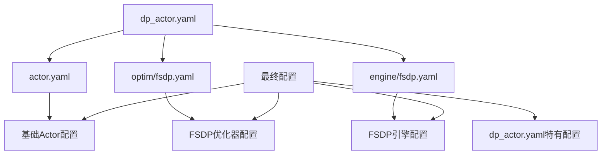

# VeRL中的Hydra配置系统完整解析

## 概述

Hydra是Facebook开源的Python配置管理框架，VeRL项目使用Hydra来管理复杂的分布式训练配置。本文档从Hydra基础概念开始，详细解释工作机制和实际应用。

## Hydra基础概念

### 什么是Hydra？

Hydra解决了复杂Python应用中的配置管理问题。想象你有一个复杂的机器学习项目，需要配置：
- 模型参数（学习率、批次大小等）
- 数据路径和预处理参数  
- 分布式训练设置
- 日志和监控配置

传统方式可能是写很多硬编码的参数或者使用argparse，但这样很难管理。Hydra提供了一种优雅的解决方案。

### Hydra的核心思想

#### 1. 配置即代码
```python
# 传统方式
def train():
    lr = 0.001
    batch_size = 32
    model_path = "/path/to/model"
    # ... 很多硬编码参数

# Hydra方式
@hydra.main(config_path="config", config_name="train")
def train(cfg):
    lr = cfg.optimizer.lr           # 来自配置文件
    batch_size = cfg.data.batch_size
    model_path = cfg.model.path
```

#### 2. 组合式配置
```yaml
# config/train.yaml
defaults:
  - model: resnet50      # 使用 config/model/resnet50.yaml
  - optimizer: adam      # 使用 config/optimizer/adam.yaml
  - data: imagenet       # 使用 config/data/imagenet.yaml

# 最终配置会自动组合这些部分
```

#### 3. 运行时覆盖
```bash
# 改变模型类型
python train.py model=vit_large

# 改变学习率
python train.py optimizer.lr=0.01

# 组合多个改变
python train.py model=vit_large optimizer.lr=0.01 data.batch_size=64
```

## Hydra工作机制详解

### 简单示例：从零开始理解

让我们通过一个简化的例子来理解Hydra的工作机制：

#### 基础示例

假设我们有这样的文件结构：
```
my_project/
├── main.py
└── config/
    ├── config.yaml
    ├── model/
    │   ├── small.yaml
    │   └── large.yaml
    └── optimizer/
        ├── sgd.yaml
        └── adam.yaml
```

**config/config.yaml** (主配置文件):
```yaml
defaults:
  - model: small        # 默认使用小模型
  - optimizer: sgd      # 默认使用SGD优化器

# 主配置内容
epochs: 10
save_path: "./checkpoints"
```

**config/model/small.yaml**:
```yaml
name: "ResNet18"
layers: 18
hidden_dim: 256
```

**config/model/large.yaml**:
```yaml
name: "ResNet50" 
layers: 50
hidden_dim: 512
```

**config/optimizer/sgd.yaml**:
```yaml
name: "SGD"
lr: 0.01
momentum: 0.9
```

**config/optimizer/adam.yaml**:
```yaml
name: "Adam"
lr: 0.001
beta1: 0.9
beta2: 0.999
```

**main.py**:
```python
import hydra
from omegaconf import DictConfig

@hydra.main(config_path="config", config_name="config", version_base=None)
def my_app(cfg: DictConfig) -> None:
    print("=== 最终配置 ===")
    print(f"模型: {cfg.model.name}, 层数: {cfg.model.layers}")
    print(f"优化器: {cfg.optimizer.name}, 学习率: {cfg.optimizer.lr}")
    print(f"训练轮数: {cfg.epochs}")

if __name__ == "__main__":
    my_app()
```

#### 运行结果

**默认运行**:
```bash
python main.py
```
输出:
```
=== 最终配置 ===
模型: ResNet18, 层数: 18
优化器: SGD, 学习率: 0.01
训练轮数: 10
```

**运行时覆盖**:
```bash
python main.py model=large optimizer=adam epochs=20
```
输出:
```
=== 最终配置 ===
模型: ResNet50, 层数: 50
优化器: Adam, 学习率: 0.001
训练轮数: 20
```

### Hydra配置合并过程

让我们看看Hydra是如何一步步合并配置的：

#### 步骤1: 读取主配置文件
```yaml
# config/config.yaml
defaults:
  - model: small
  - optimizer: sgd

epochs: 10
save_path: "./checkpoints"
```

#### 步骤2: 处理defaults列表
- 读取 `config/model/small.yaml`
- 读取 `config/optimizer/sgd.yaml`

#### 步骤3: 合并配置
```yaml
# 最终合并结果
model:                    # 来自 model/small.yaml
  name: "ResNet18"
  layers: 18
  hidden_dim: 256

optimizer:                # 来自 optimizer/sgd.yaml
  name: "SGD"
  lr: 0.01
  momentum: 0.9

epochs: 10               # 来自主配置文件
save_path: "./checkpoints"  # 来自主配置文件
```

#### 步骤4: 应用命令行覆盖
如果命令行指定 `model=large optimizer.lr=0.02`:
```yaml
# 最终结果
model:                    # 替换为 model/large.yaml
  name: "ResNet50"
  layers: 50
  hidden_dim: 512

optimizer:                # 保持 optimizer/sgd.yaml，但修改lr
  name: "SGD"
  lr: 0.02               # 命令行覆盖
  momentum: 0.9

epochs: 10
save_path: "./checkpoints"
```

## VeRL中的高级Hydra用法

### 嵌套配置注入语法

现在我们来理解VeRL中更复杂的语法：`folder@target.field: filename`

#### 语法拆解

```yaml
- actor@actor_rollout_ref.actor: dp_actor
```

这行的含义是：
1. **`actor`**: 从 `config/actor/` 文件夹中选择配置
2. **`@`**: 配置注入操作符
3. **`actor_rollout_ref.actor`**: 目标注入路径（嵌套字段）
4. **`dp_actor`**: 选择 `dp_actor.yaml` 文件

#### 详细过程演示

让我们用一个简化的例子来演示：

**主配置文件**:
```yaml
# main.yaml
defaults:
  - worker@system.worker: gpu_worker

system:
  name: "distributed_training"
  nodes: 4
```

**worker/gpu_worker.yaml**:
```yaml
type: "GPU"
count: 8
memory: "32GB"
```

**处理过程**:

1. **初始状态** (读取main.yaml):
```yaml
system:
  name: "distributed_training"
  nodes: 4
```

2. **应用注入** (worker@system.worker: gpu_worker):
```yaml
system:
  name: "distributed_training"     # 原有字段保留
  nodes: 4                         # 原有字段保留
  worker:                          # 新增字段
    type: "GPU"                    # 来自 worker/gpu_worker.yaml
    count: 8                       # 来自 worker/gpu_worker.yaml
    memory: "32GB"                 # 来自 worker/gpu_worker.yaml
```

### 更复杂的VeRL示例

让我们看一个更接近VeRL实际使用的例子：

#### 配置文件结构
```
config/
├── train.yaml
├── actor/
│   ├── base_actor.yaml
│   └── fsdp_actor.yaml
└── model/
    └── llama.yaml
```

**train.yaml**:
```yaml
defaults:
  - actor@components.actor: fsdp_actor
  - model@components.model: llama

components:
  trainer_type: "PPO"
  distributed: true

experiment:
  name: "llama_ppo_training"
  epochs: 5
```

**actor/fsdp_actor.yaml**:
```yaml
defaults:
  - base_actor

strategy: "FSDP"
gradient_clipping: 1.0
```

**actor/base_actor.yaml**:
```yaml
learning_rate: 1e-5
batch_size: 32
optimizer: "AdamW"
```

**model/llama.yaml**:
```yaml
name: "LLaMA-7B"
path: "/models/llama-7b"
max_length: 2048
```

#### 最终合并结果

```yaml
components:
  trainer_type: "PPO"              # 来自 train.yaml
  distributed: true                # 来自 train.yaml
  
  actor:                           # 注入位置 components.actor
    learning_rate: 1e-5            # 来自 actor/base_actor.yaml
    batch_size: 32                 # 来自 actor/base_actor.yaml  
    optimizer: "AdamW"             # 来自 actor/base_actor.yaml
    strategy: "FSDP"               # 来自 actor/fsdp_actor.yaml
    gradient_clipping: 1.0         # 来自 actor/fsdp_actor.yaml
  
  model:                           # 注入位置 components.model
    name: "LLaMA-7B"               # 来自 model/llama.yaml
    path: "/models/llama-7b"       # 来自 model/llama.yaml
    max_length: 2048               # 来自 model/llama.yaml

experiment:
  name: "llama_ppo_training"       # 来自 train.yaml
  epochs: 5                        # 来自 train.yaml
```

## VeRL实际配置系统

### 1. 配置文件层次结构

```
verl/trainer/config/
├── ppo_trainer.yaml          # 主配置文件
├── actor/                    # Actor组件配置
│   ├── actor.yaml           # 基础Actor配置
│   ├── dp_actor.yaml        # FSDP Actor配置
│   └── megatron_actor.yaml  # Megatron Actor配置
├── ref/                     # Reference模型配置
├── rollout/                 # Rollout推理配置
├── model/                   # 模型配置
├── data/                    # 数据配置
├── critic/                  # Critic配置
└── reward_model/            # 奖励模型配置
```

### 2. 配置注入语法

```yaml
defaults:
  - <folder_name>@<target_field_path>: <yaml_file_name>
```

**语法说明**:
- `<folder_name>`: 配置文件夹名称
- `@`: Hydra配置注入操作符
- `<target_field_path>`: 目标字段路径（支持嵌套）
- `<yaml_file_name>`: YAML文件名（不含扩展名）

## 详细配置解析

### 主配置文件：ppo_trainer.yaml

```yaml
# verl/trainer/config/ppo_trainer.yaml
defaults:
  # 将 actor/dp_actor.yaml 注入到 actor_rollout_ref.actor 字段
  - actor@actor_rollout_ref.actor: dp_actor
  
  # 将 data/legacy_data.yaml 注入到 data 字段
  - data@data: legacy_data
  
  # 将 ref/dp_ref.yaml 注入到 actor_rollout_ref.ref 字段
  - ref@actor_rollout_ref.ref: dp_ref
  
  # 将 rollout/rollout.yaml 注入到 actor_rollout_ref.rollout 字段
  - rollout@actor_rollout_ref.rollout: rollout
  
  # 将 model/hf_model.yaml 注入到 actor_rollout_ref.model 字段
  - model@actor_rollout_ref.model: hf_model
  
  # 将 critic/dp_critic.yaml 注入到 critic 字段
  - critic@critic: dp_critic
  
  # 将 reward_model/dp_reward_model.yaml 注入到 reward_model 字段
  - reward_model@reward_model: dp_reward_model
  
  # 应用当前文件的配置，覆盖上述默认配置
  - _self_

# 主配置内容
actor_rollout_ref:
  hybrid_engine: true
  nccl_timeout: 600
  rollout:
    enable_chunked_prefill: True
    load_format: dummy_dtensor

algorithm:
  _target_: verl.trainer.config.AlgoConfig
  gamma: 1.0
  lam: 1.0
  adv_estimator: gae
```

## VeRL中的Hydra配置注入实战

### 重要概念：@ 操作符的深度理解

在VeRL中，你会看到很多这样的配置：
```yaml
- actor@actor_rollout_ref.actor: dp_actor
```

这个语法的关键是理解**三个层面**：

#### 层面1：配置选择 (@ 之前)
- `actor` 表示从 `config/actor/` 文件夹中选择配置
- 类似于说："我要选择一个actor类型的配置"

#### 层面2：目标注入位置 (@ 之后，: 之前)  
- `actor_rollout_ref.actor` 表示最终配置中的嵌套路径
- 类似于说："把选择的配置放到这个位置"

#### 层面3：具体配置文件 (: 之后)
- `dp_actor` 表示选择 `config/actor/dp_actor.yaml` 文件
- 类似于说："具体选择这个配置文件"

### 实战演示：VeRL配置注入过程

让我们通过实际的VeRL配置来演示整个过程：

#### 第一步：主配置文件解析

**verl/trainer/config/ppo_trainer.yaml**:
```yaml
defaults:
  - actor@actor_rollout_ref.actor: dp_actor      # 注入点1
  - rollout@actor_rollout_ref.rollout: rollout   # 注入点2
  - model@actor_rollout_ref.model: hf_model      # 注入点3

# 主配置的基础结构
actor_rollout_ref:
  hybrid_engine: true          # 原有字段
  nccl_timeout: 600           # 原有字段

algorithm:
  gamma: 1.0
  adv_estimator: gae
```

#### 第二步：逐个配置注入

**注入1**: `actor@actor_rollout_ref.actor: dp_actor`

源文件 `config/actor/dp_actor.yaml`:
```yaml
_target_: verl.workers.config.FSDPActorConfig
strategy: fsdp
grad_clip: 1.0
ppo_mini_batch_size: 256
```

注入后的结果:
```yaml
actor_rollout_ref:
  hybrid_engine: true          # 保留
  nccl_timeout: 600           # 保留
  actor:                      # 新增！
    _target_: verl.workers.config.FSDPActorConfig
    strategy: fsdp
    grad_clip: 1.0
    ppo_mini_batch_size: 256
```

**注入2**: `rollout@actor_rollout_ref.rollout: rollout`

源文件 `config/rollout/rollout.yaml`:
```yaml
_target_: verl.workers.config.RolloutConfig
name: vllm
tensor_model_parallel_size: 1
gpu_memory_utilization: 0.85
```

注入后的结果:
```yaml
actor_rollout_ref:
  hybrid_engine: true          # 保留
  nccl_timeout: 600           # 保留
  actor:                      # 之前注入的
    _target_: verl.workers.config.FSDPActorConfig
    strategy: fsdp
    grad_clip: 1.0
    ppo_mini_batch_size: 256
  rollout:                    # 新增！
    _target_: verl.workers.config.RolloutConfig
    name: vllm
    tensor_model_parallel_size: 1
    gpu_memory_utilization: 0.85
```

**注入3**: `model@actor_rollout_ref.model: hf_model`

源文件 `config/model/hf_model.yaml`:
```yaml
_target_: verl.workers.config.HFModelConfig
path: null
tokenizer_path: null
trust_remote_code: true
```

最终完整结果:
```yaml
actor_rollout_ref:
  hybrid_engine: true          # 原有
  nccl_timeout: 600           # 原有
  actor:                      # 注入1
    _target_: verl.workers.config.FSDPActorConfig
    strategy: fsdp
    grad_clip: 1.0
    ppo_mini_batch_size: 256
  rollout:                    # 注入2
    _target_: verl.workers.config.RolloutConfig
    name: vllm
    tensor_model_parallel_size: 1
    gpu_memory_utilization: 0.85
  model:                      # 注入3
    _target_: verl.workers.config.HFModelConfig
    path: null
    tokenizer_path: null
    trust_remote_code: true

algorithm:                    # 原有
  gamma: 1.0
  adv_estimator: gae
```

### 命令行覆盖的实际应用

现在我们理解了基础结构，来看命令行覆盖是如何工作的：

```bash
python -m verl.trainer.main_ppo \
    actor_rollout_ref.rollout.name=sglang \
    actor_rollout_ref.actor.optim.lr=1e-6 \
    actor_rollout_ref.model.path="/path/to/qwen3-4b"
```

这会产生以下覆盖：
```yaml
actor_rollout_ref:
  rollout:
    name: sglang              # 覆盖：vllm -> sglang
    # 其他字段保持不变
  actor:
    optim:
      lr: 1e-6               # 覆盖：新增或修改lr字段
    # 其他字段保持不变
  model:
    path: "/path/to/qwen3-4b" # 覆盖：null -> 具体路径
    # 其他字段保持不变
```

### 配置继承的复杂示例

让我们看一个更复杂的继承情况：

**config/actor/dp_actor.yaml**:
```yaml
defaults:
  - ../optim@optim: fsdp      # 注入优化器配置到 optim 字段
  - ../engine@fsdp_config: fsdp  # 注入引擎配置到 fsdp_config 字段
  - actor                     # 继承基础actor配置
  - _self_                    # 应用当前文件配置

_target_: verl.workers.config.FSDPActorConfig
strategy: fsdp
grad_clip: 1.0
```

这个配置的处理过程：

1. **读取基础配置** (`actor.yaml`):
```yaml
_target_: verl.workers.config.ActorConfig
ppo_mini_batch_size: 256
clip_ratio: 0.2  
```

2. **注入优化器配置** (`../optim@optim: fsdp`):
```yaml
# 从 config/optim/fsdp.yaml 注入到 optim 字段
optim:
  _target_: verl.workers.config.FSDPOptimConfig
  lr: 1e-5
  weight_decay: 0.01
```

3. **注入引擎配置** (`../engine@fsdp_config: fsdp`):
```yaml  
# 从 config/engine/fsdp.yaml 注入到 fsdp_config 字段
fsdp_config:
  _target_: verl.workers.config.FSDPConfig
  param_offload: false
  optimizer_offload: false
```

4. **应用当前文件配置** (`_self_`):
```yaml
_target_: verl.workers.config.FSDPActorConfig  # 覆盖基础target
strategy: fsdp                                 # 新增字段
grad_clip: 1.0                                # 新增字段
```

5. **最终dp_actor配置**:
```yaml
_target_: verl.workers.config.FSDPActorConfig  # 来自dp_actor.yaml
strategy: fsdp                                 # 来自dp_actor.yaml  
grad_clip: 1.0                                # 来自dp_actor.yaml
ppo_mini_batch_size: 256                      # 来自actor.yaml
clip_ratio: 0.2                               # 来自actor.yaml
optim:                                        # 注入自optim/fsdp.yaml
  _target_: verl.workers.config.FSDPOptimConfig
  lr: 1e-5
  weight_decay: 0.01
fsdp_config:                                  # 注入自engine/fsdp.yaml
  _target_: verl.workers.config.FSDPConfig
  param_offload: false
  optimizer_offload: false
```

### 理解VeRL训练脚本的配置覆盖

现在我们来理解之前的训练脚本：

```bash
python3 -m verl.trainer.main_ppo \
    --config-path="$CONFIG_PATH" \
    --config-name='gsm8k_multiturn_grpo' \
    algorithm.adv_estimator=grpo \
    actor_rollout_ref.rollout.name=sglang \
    actor_rollout_ref.model.path="$PROJECT_DIR/model_weights/Qwen3-4B"
```

配置加载顺序：
1. **基础配置**: `ppo_trainer.yaml`
2. **专用配置**: `gsm8k_multiturn_grpo.yaml` (覆盖基础配置)  
3. **命令行覆盖**: 每个参数精确覆盖对应字段

最终的配置合并示意：
```yaml
# 从多个层次合并而来的最终配置
actor_rollout_ref:
  # 基础配置保留
  hybrid_engine: true
  nccl_timeout: 600
  
  # 复杂的actor配置（经过多层继承）
  actor:
    _target_: verl.workers.config.FSDPActorConfig
    strategy: fsdp
    ppo_mini_batch_size: 64          # 命令行覆盖
    ppo_micro_batch_size_per_gpu: 8  # 命令行覆盖
    optim:
      lr: 1e-6                       # 命令行覆盖
  
  # rollout配置  
  rollout:
    name: sglang                     # 命令行覆盖 (默认vllm)
    multi_turn:                      # 来自gsm8k_multiturn_grpo.yaml
      enable: true
      max_assistant_turns: 5
  
  # 模型配置
  model:
    path: "/path/to/Qwen3-4B"        # 命令行覆盖

# 算法配置
algorithm:
  adv_estimator: grpo                # 命令行覆盖 (默认gae)
```

### 动态结构创建

**示例**: `actor@actor_rollout_ref.actor: dp_actor`

#### 源配置文件 (actor/dp_actor.yaml)
```yaml
# verl/trainer/config/actor/dp_actor.yaml
defaults:
  - ../optim@optim: fsdp
  - ../engine@fsdp_config: fsdp  
  - actor
  - _self_

_target_: verl.workers.config.FSDPActorConfig
strategy: fsdp
grad_clip: 1.0
ulysses_sequence_parallel_size: 1
entropy_from_logits_with_chunking: False
```

#### Hydra处理过程

1. **读取源配置**: 加载 `dp_actor.yaml` 及其依赖
2. **解析目标路径**: `actor_rollout_ref.actor`
3. **动态创建嵌套结构**: 在 `actor_rollout_ref` 下创建 `actor` 子字段
4. **注入配置内容**: 将源配置内容放入目标位置

#### 最终配置结构
```yaml
actor_rollout_ref:
  # 原有字段保留
  hybrid_engine: true
  nccl_timeout: 600
  
  # 动态创建的 actor 子字段
  actor:
    _target_: verl.workers.config.FSDPActorConfig
    strategy: fsdp
    grad_clip: 1.0
    ulysses_sequence_parallel_size: 1
    entropy_from_logits_with_chunking: False
    
    # 通过 defaults 注入的配置
    optim:
      # 来自 optim/fsdp.yaml
    fsdp_config:
      # 来自 engine/fsdp.yaml
    # 来自 actor/actor.yaml 的基础配置
```

### 2. 配置继承链

#### dp_actor.yaml 的继承关系



#### 配置合并优先级
1. **基础配置**: `actor.yaml` 提供基础字段
2. **组件配置**: `optim/fsdp.yaml`, `engine/fsdp.yaml` 注入专门配置
3. **特化配置**: `dp_actor.yaml` 覆盖和添加特定字段
4. **命令行覆盖**: 运行时参数具有最高优先级

## 实际应用示例

### 训练脚本中的配置覆盖

```bash
python3 -m verl.trainer.main_ppo \
    --config-path="$CONFIG_PATH" \
    --config-name='gsm8k_multiturn_grpo' \
    algorithm.adv_estimator=grpo \
    actor_rollout_ref.rollout.name=sglang \
    actor_rollout_ref.actor.optim.lr=1e-6
```

#### 配置覆盖链

1. **基础配置**: `ppo_trainer.yaml`
2. **专用配置**: `gsm8k_multiturn_grpo.yaml` (覆盖基础配置)
3. **命令行参数**: 覆盖所有先前配置

### 最终配置结构示例

```yaml
# 经过所有处理后的完整配置结构
actor_rollout_ref:
  hybrid_engine: true                    # 来自 ppo_trainer.yaml
  nccl_timeout: 600                      # 来自 ppo_trainer.yaml
  
  actor:                                 # 注入自 actor/dp_actor.yaml
    _target_: verl.workers.config.FSDPActorConfig
    strategy: fsdp
    grad_clip: 1.0
    ppo_mini_batch_size: 64              # 命令行覆盖
    ppo_micro_batch_size_per_gpu: 8      # 命令行覆盖
    use_kl_loss: true                    # 命令行覆盖
    optim:                               # 注入自 optim/fsdp.yaml
      _target_: verl.workers.config.FSDPOptimConfig
      lr: 1e-6                           # 命令行覆盖
    fsdp_config:                         # 注入自 engine/fsdp.yaml
      param_offload: false               # 命令行覆盖
      optimizer_offload: false           # 命令行覆盖
  
  ref:                                   # 注入自 ref/dp_ref.yaml
    _target_: verl.workers.config.FSDPRefConfig
    fsdp_config:
      param_offload: true                # 命令行覆盖
  
  rollout:                               # 注入自 rollout/rollout.yaml
    _target_: verl.workers.config.RolloutConfig
    name: sglang                         # 命令行覆盖 (默认vllm)
    tensor_model_parallel_size: 2        # 命令行覆盖
    gpu_memory_utilization: 0.5          # 命令行覆盖
    multi_turn:                          # 来自 gsm8k_multiturn_grpo.yaml
      enable: true
      max_assistant_turns: 5
      tool_config_path: "..."            # 命令行覆盖
  
  model:                                 # 注入自 model/hf_model.yaml
    _target_: verl.workers.config.HFModelConfig
    path: "$PROJECT_DIR/model_weights/Qwen3-4B"  # 命令行覆盖

algorithm:                               # 来自 ppo_trainer.yaml
  _target_: verl.trainer.config.AlgoConfig
  adv_estimator: grpo                    # 命令行覆盖 (默认gae)
  use_kl_in_reward: false                # 命令行覆盖

data:                                    # 注入自 data/legacy_data.yaml
  _target_: verl.workers.config.DataConfig
  train_batch_size: 64                   # 命令行覆盖
  max_prompt_length: 1024                # 命令行覆盖
  return_raw_chat: true                  # 命令行覆盖

critic:                                  # 注入自 critic/dp_critic.yaml
  _target_: verl.workers.config.FSDPCriticConfig

reward_model:                            # 注入自 reward_model/dp_reward_model.yaml
  _target_: verl.workers.config.FSDPRewardModelConfig
```

## 高级特性

### 1. 配置间引用

```yaml
# 在配置文件中可以引用其他字段
use_remove_padding: ${oc.select:actor_rollout_ref.model.use_remove_padding,false}
```

**语法说明**:
- `${oc.select:path,default}`: 如果路径存在则使用该值，否则使用默认值
- `${path}`: 直接引用路径值
- `${env:VAR_NAME}`: 引用环境变量

### 2. 条件配置

```yaml
# 基于条件选择配置
strategy: ${oc.select:trainer.strategy,fsdp}
```

### 3. 配置验证

```yaml
# 使用 _target_ 进行类型验证
_target_: verl.workers.config.FSDPActorConfig
```

## 调试和验证

### 查看合并后的配置

```python
# 在代码中打印最终配置
from omegaconf import OmegaConf
print(OmegaConf.to_yaml(config))
```

### 常见错误排查

1. **配置文件路径错误**
   ```
   Error: Could not find 'actor/dp_actor'
   ```
   检查文件是否存在于正确路径

2. **循环引用**
   ```
   Error: Circular reference detected
   ```
   检查配置文件间的引用关系

3. **类型不匹配**
   ```
   Error: Cannot instantiate target
   ```
   检查 `_target_` 指定的类是否正确

## 最佳实践

### 1. 配置文件组织

- **模块化**: 将不同组件的配置分离到不同文件夹
- **继承层次**: 使用基础配置 + 特化配置的模式
- **命名规范**: 使用描述性的文件名

### 2. 配置复用

- **基础配置**: 定义通用字段
- **环境特化**: 为不同环境（开发/生产）创建专门配置
- **算法变体**: 为不同算法创建配置变体

### 3. 调试建议

- **逐步构建**: 从简单配置开始，逐步添加复杂性
- **配置验证**: 使用 `_target_` 确保类型安全
- **文档化**: 为关键配置添加注释

## 常见问题和调试技巧

### 常见问题 FAQ

#### Q1: 为什么我的配置没有生效？
**A**: 检查配置覆盖的优先级顺序：
1. 命令行参数（最高优先级）
2. 专用配置文件（如 `gsm8k_multiturn_grpo.yaml`）
3. 基础配置文件（如 `ppo_trainer.yaml`）
4. 组件配置文件（如 `dp_actor.yaml`）

#### Q2: 配置文件找不到怎么办？
```
ConfigCompositionException: Could not find 'actor/my_actor'
```
**A**: 检查：
- 文件路径是否正确：`config/actor/my_actor.yaml`
- 文件名是否匹配（不要包含 `.yaml` 扩展名）
- Hydra搜索路径是否包含该目录

#### Q3: 如何查看最终合并的配置？
**A**: 在代码中添加调试输出：
```python
@hydra.main(config_path="config", config_name="ppo_trainer")
def main(cfg):
    from omegaconf import OmegaConf
    print("=== 最终配置 ===")
    print(OmegaConf.to_yaml(cfg))
    # 继续你的代码...
```

#### Q4: 循环引用错误怎么解决？
```
ConfigCompositionException: Circular reference detected
```
**A**: 检查配置文件的 `defaults` 中是否存在循环依赖，例如：
- A.yaml 引用 B.yaml
- B.yaml 又引用 A.yaml

### 实用调试技巧

#### 1. 逐步验证配置
创建一个简单的测试脚本：
```python
import hydra
from omegaconf import DictConfig, OmegaConf

@hydra.main(config_path="verl/trainer/config", config_name="ppo_trainer")
def debug_config(cfg: DictConfig):
    # 查看特定部分的配置
    print("=== Actor配置 ===")
    print(OmegaConf.to_yaml(cfg.actor_rollout_ref.actor))
    
    print("\n=== Rollout配置 ===")
    print(OmegaConf.to_yaml(cfg.actor_rollout_ref.rollout))
    
    # 检查配置是否符合预期
    assert cfg.actor_rollout_ref.actor.strategy == "fsdp"
    print("✅ 配置验证通过")

if __name__ == "__main__":
    debug_config()
```

#### 2. 分步骤测试配置注入
```python
# 测试基础配置
python debug_config.py

# 测试命令行覆盖
python debug_config.py actor_rollout_ref.rollout.name=sglang

# 测试复杂覆盖
python debug_config.py \
    actor_rollout_ref.rollout.name=sglang \
    actor_rollout_ref.actor.optim.lr=1e-6
```

#### 3. 使用Hydra的配置验证功能
```python
from hydra.core.config_store import ConfigStore
from dataclasses import dataclass

@dataclass
class ActorConfig:
    strategy: str
    grad_clip: float
    lr: float

# 注册配置模式
cs = ConfigStore.instance()
cs.store(name="actor_schema", node=ActorConfig)

# 在主函数中验证
@hydra.main(config_path="config", config_name="train")
def main(cfg):
    # Hydra会自动验证配置是否符合ActorConfig结构
    pass
```

### 高级技巧

#### 1. 条件配置选择
```yaml
# 根据环境变量选择不同配置
defaults:
  - actor: ${oc.env:ACTOR_TYPE,dp_actor}  # 默认dp_actor，可通过环境变量覆盖
  - model: ${oc.env:MODEL_TYPE,hf_model}
```

#### 2. 配置模板化
```yaml
# 使用变量减少重复
common_lr: &common_lr 1e-5

actor:
  optim:
    lr: *common_lr
    
critic:
  optim:
    lr: *common_lr
```

#### 3. 动态配置路径
```yaml
# 基于其他配置值选择路径
model:
  path: ${oc.select:model.base_path,/default/path}/${model.name}
```

### 性能优化建议

#### 1. 减少配置文件层次
- 过深的继承层次会影响配置加载速度
- 建议继承层次不超过3层

#### 2. 缓存配置对象
```python
# 避免重复解析配置
@lru_cache(maxsize=1)
def get_config():
    with initialize(config_path="config"):
        cfg = compose(config_name="ppo_trainer")
    return cfg
```

#### 3. 使用配置组
```yaml
# 将相关配置组织在一起
defaults:
  - _group_: training/gpu_setup
  - _group_: training/distributed_setup
```

## 最佳实践总结

### 1. 配置文件组织
```
config/
├── algorithm/           # 算法相关配置
│   ├── ppo.yaml
│   └── grpo.yaml
├── infrastructure/      # 基础设施配置
│   ├── single_node.yaml
│   └── multi_node.yaml
├── experiment/          # 实验配置
│   ├── gsm8k.yaml
│   └── math_reasoning.yaml
└── main.yaml           # 主配置文件
```

### 2. 命名规范
- **配置文件**: 使用描述性名称，如 `fsdp_actor.yaml`
- **字段名**: 使用snake_case，如 `ppo_mini_batch_size`
- **目标路径**: 清晰的层次结构，如 `components.training.actor`

### 3. 文档化
```yaml
# 每个重要字段都添加注释
actor:
  # PPO训练的小批次大小，影响梯度累积
  ppo_mini_batch_size: 256
  
  # 梯度裁剪阈值，防止梯度爆炸
  grad_clip: 1.0
```

### 4. 版本控制
- 为重要的配置变更创建版本标记
- 使用Git标签跟踪配置演进
- 保留向后兼容性

## 总结

VeRL的Hydra配置系统提供了：

1. **直观的配置管理**: 从简单的键值对到复杂的嵌套注入
2. **强大的组合能力**: 通过 `@` 操作符实现灵活的配置组合
3. **运行时灵活性**: 命令行参数可以精确覆盖任何配置字段
4. **类型安全保障**: `_target_` 机制确保配置与代码的一致性
5. **可扩展的架构**: 易于添加新的组件和配置选项

通过理解这些概念和机制，你可以：
- **快速定位配置问题**: 知道配置值的来源和覆盖顺序
- **高效开发新功能**: 复用现有配置模式
- **优化训练流程**: 通过配置调整而非代码修改来实验不同设置
- **维护复杂项目**: 保持配置的可读性和可维护性

这种设计使得VeRL能够支持从简单的单机训练到复杂的多节点分布式强化学习的各种场景，同时保持配置的清晰和易用。