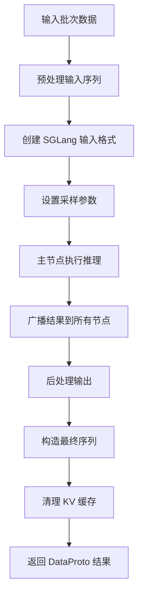
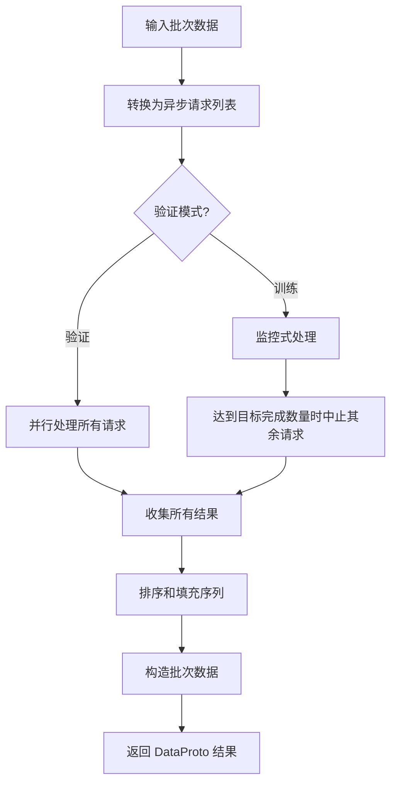
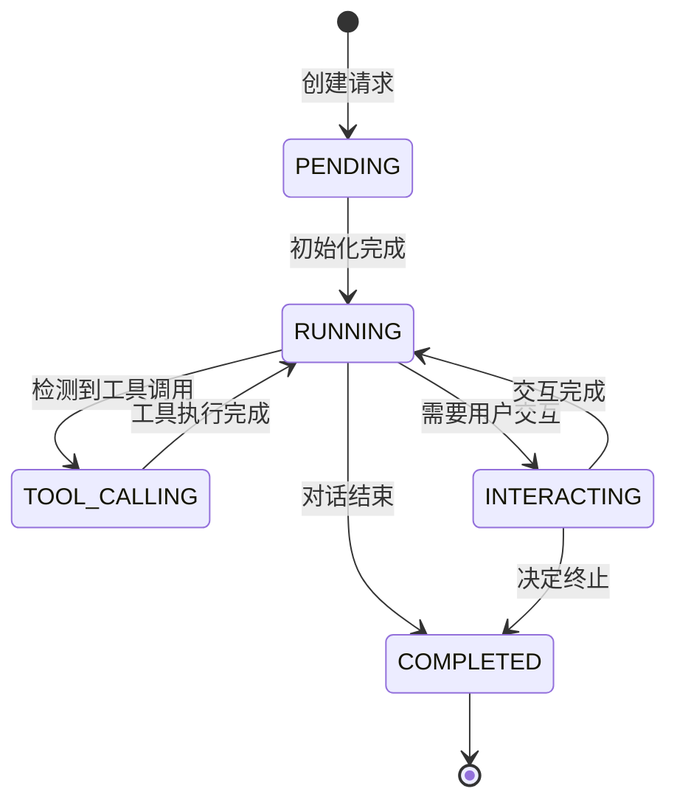

# SGLang Rollout 技术文档

## 概述

`SGLangRollout` 是 VeRL 强化学习框架中基于 SGLang 推理引擎的 Rollout 工作节点实现。它负责在强化学习训练过程中执行策略推理，生成训练所需的序列数据，支持单轮和多轮对话、工具调用、多模态输入等高级功能。

## 核心架构

### 类层次结构

```
BaseRollout (抽象基类)
    ↓
SGLangRollout (SGLang 实现)
    ├── AsyncEngine (异步推理引擎)
    ├── 工具调用系统 (Tool System)
    ├── 交互系统 (Interaction System)
    └── 分布式推理 (Distributed Inference)
```

### 主要组件

#### 1. AsyncEngine (异步推理引擎)
- **功能**: 封装 SGLang 推理引擎，提供异步推理接口
- **特点**: 
  - 支持内存管理（释放/恢复 GPU 内存）
  - 支持权重动态更新
  - 支持 KV 缓存清理
  - 支持请求中止功能

#### 2. SGLangRollout (主要 Rollout 类)
- **功能**: 管理整个推理流程
- **核心能力**:
  - 单轮/多轮序列生成
  - 分布式推理协调
  - 工具调用集成
  - 多模态数据处理

#### 3. 工具调用系统
- **组件**:
  - `_tool_schemas`: OpenAI 格式的工具定义
  - `_tool_map`: 工具名称到实例的映射
  - `_function_call_parser`: 解析生成文本中的工具调用
- **功能**: 支持模型调用外部工具并处理返回结果

#### 4. 交互系统
- **组件**: `interaction_map` - 交互处理器映射
- **功能**: 处理多轮对话中的用户交互逻辑

## 代码逻辑详解

### 初始化流程

```python
def __init__(self, config, model_config, device_mesh):
    # 1. 调用父类构造函数
    super().__init__(config, model_config, device_mesh)
    
    # 2. 获取模型配置
    actor_module = model_config.local_path
    processing_class = model_config.get_processor()
    
    # 3. 初始化工具和交互系统
    self._initialize_tools(config, processing_class)
    self._initialize_interactions(config)
    
    # 4. 初始化分布式环境
    self._init_distributed_env()
    
    # 5. 验证配置有效性
    self._verify_config(model_hf_config)
    
    # 6. 初始化推理引擎
    self._init_inference_engine(trust_remote_code, actor_module, port)
    
    # 7. 初始化采样参数
    self._init_sampling_params()
```

### 序列生成流程

#### 单轮生成 (`_batch_level_generate_sequences`)



#### 多轮生成 (`_req_level_generate_sequences`)



### 异步请求处理流程

每个异步请求经历以下状态转换：



### 工具调用处理

```python
async def _async_rollout_a_request(self, req, do_sample, is_validate, **kwargs):
    while current_turns < max_assistant_turns:
        if req.state == TOOL_CALLING:
            # 1. 解析工具调用
            parsed_tool_calls = self._function_call_parser.parse_non_stream(content)
            
            # 2. 并行执行所有工具
            tool_call_results = await asyncio.gather(*[
                self._tool_map[tool_call.function.name].execute(...)
                for tool_call in parsed_tool_calls
            ])
            
            # 3. 添加工具响应到对话历史
            req.add_tool_response_messages(processing_class, tool_results)
```

## 调用逻辑

### 主要调用路径

1. **训练阶段调用**:
   ```
   RayPPOTrainer → SGLangRollout.generate_sequences()
   ```

2. **序列生成调用**:
   ```
   generate_sequences()
   ├── 单轮: _batch_level_generate_sequences()
   └── 多轮: _req_level_generate_sequences()
       └── _async_rollout_a_request()
   ```

3. **权重更新调用**:
   ```
   TrainingWorker → SGLangRollout.update_weights()
   ```

### 分布式调用协调

- **主节点 (TP rank 0)**: 执行实际推理
- **从节点 (其他 TP ranks)**: 接收广播结果
- **同步点**: 使用 `dist.barrier()` 和 `broadcast_pyobj()` 确保一致性

## 架构设计特点

### 1. 异步处理架构
- 使用 `asyncio` 实现高并发请求处理
- 支持请求级别的并行化和取消机制
- 优化了多轮对话的响应时间

### 2. 内存管理策略
- 支持动态内存释放和恢复
- KV 缓存自动清理机制
- 权重更新的分桶传输优化

### 3. 容错和监控
- 请求超时和中止机制
- GPU 内存使用监控
- 详细的日志记录和调试信息

### 4. 扩展性设计
- 插件化的工具注册系统
- 灵活的交互处理器接口
- 支持自定义采样参数

## 使用示例

### 基本使用

```python
# 1. 创建配置
config = RolloutConfig(
    prompt_length=1024,
    response_length=512,
    max_model_len=2048,
    multi_turn={"enable": False}
)

model_config = HFModelConfig(
    local_path="/path/to/model",
    trust_remote_code=True
)

# 2. 初始化 Rollout
rollout = SGLangRollout(config, model_config, device_mesh)

# 3. 生成序列
input_data = DataProto(
    batch={"input_ids": prompt_ids, "attention_mask": attention_masks},
    meta_info={"do_sample": True, "eos_token_id": 2}
)

output_data = rollout.generate_sequences(input_data)
```

### 多轮对话配置

```python
config = RolloutConfig(
    multi_turn={
        "enable": True,
        "max_assistant_turns": 10,
        "max_user_turns": 5,
        "tool_config_path": "/path/to/tools.yaml",
        "interaction_config_path": "/path/to/interactions.yaml"
    }
)
```

### 工具调用配置

```yaml
# tools.yaml 示例
tools:
  - name: "calculator"
    class_path: "verl.tools.calculator.Calculator"
    description: "执行数学计算"
    parameters:
      type: "object"
      properties:
        expression:
          type: "string"
          description: "要计算的数学表达式"
```

### 服务器模式使用

```python
# 启用 HTTP 服务器模式
config.sglang_rollout_mode = "server"
config.server = {
    "timeout": 300,
    "max_attempts": 3,
    "max_connections": 100
}

# 调用 OpenAI 兼容的 API
response = await rollout.chat_completion({
    "messages": [{"role": "user", "content": "Hello!"}],
    "temperature": 0.7,
    "max_tokens": 100
})
```

## 性能优化建议

### 1. 内存优化
- 启用 `free_cache_engine` 定期清理 KV 缓存
- 合理设置 `update_weights_bucket_megabytes` 控制权重更新粒度
- 使用共享内存加速模型加载

### 2. 并发优化
- 根据硬件配置调整 `max_running_requests`
- 在训练模式下适当设置 `over_sample_rate` 提前终止部分请求
- 使用异步工具调用减少等待时间

### 3. 分布式优化
- 合理配置 `tensor_model_parallel_size` 平衡计算和通信
- 使用高速网络连接减少节点间通信延迟
- 启用 NCCL 优化加速集合通信

## 故障排除

### 常见问题

1. **内存不足错误**
   - 检查 `gpu_memory_utilization` 设置
   - 启用 `free_cache_engine` 选项
   - 减少 `max_running_requests` 数量

2. **工具调用解析失败**
   - 验证工具 schema 格式正确性
   - 检查模型是否支持函数调用格式
   - 确认 `tool_call_parser_type` 匹配

3. **分布式同步问题**
   - 检查网络连接和防火墙设置
   - 验证所有节点的 CUDA_VISIBLE_DEVICES 配置
   - 确保时钟同步

### 调试技巧

- 设置 `VERL_LOGGING_LEVEL=DEBUG` 获取详细日志
- 使用 `log_requests=True` 记录 SGLang 引擎请求
- 监控 GPU 内存使用情况定位内存泄漏

## 总结

SGLangRollout 是 VeRL 框架中功能最丰富的 Rollout 实现，它通过集成 SGLang 高性能推理引擎，提供了完整的强化学习推理解决方案。其异步处理架构、灵活的扩展机制和强大的多轮对话能力，使其成为构建复杂 AI 智能体的理想选择。

通过合理的配置和优化，SGLangRollout 可以在各种硬件环境下提供高效、稳定的推理服务，支持从简单的文本生成到复杂的多模态智能体应用场景。