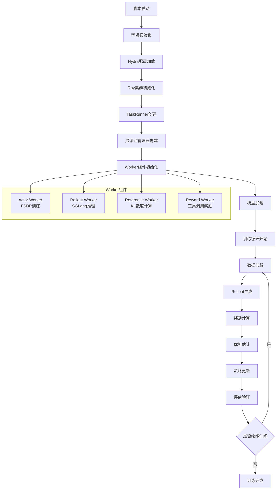
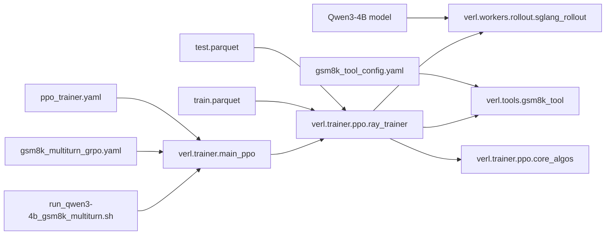

# Qwen3-4B GSM8K Multi-turn训练过程详细解释

## 概述

本文档详细解释了`examples/sglang_multiturn/run_qwen3-4b_gsm8k_multiturn.sh`脚本的执行和训练过程，包括每一步的调用逻辑和涉及的文件。

## 训练流程可视化



## 逐步详细解释

### 1. 脚本初始化阶段

**文件**: `examples/sglang_multiturn/run_qwen3-4b_gsm8k_multiturn.sh`

```bash
# 系统环境设置
set -x                    # 开启命令追踪
ulimit -n 65535          # 设置文件描述符限制
PROJECT_DIR="$(pwd)"     # 获取项目根目录
CONFIG_PATH="$PROJECT_DIR/examples/sglang_multiturn/config"  # 配置文件路径
```

**关键参数设置**:
- 使用8个H20 GPU
- 工作目录必须是项目根目录
- 配置文件位于`examples/sglang_multiturn/config/`

### 2. 主入口点调用

**调用**: `python3 -m verl.trainer.main_ppo`

**文件**: `verl/trainer/main_ppo.py`

**流程**:
1. **Hydra配置管理**:
   ```python
   @hydra.main(config_path="config", config_name="ppo_trainer", version_base=None)
   def main(config):
       run_ppo(config)
   ```

2. **配置文件覆盖**:
   - 基础配置: `verl/trainer/config/ppo_trainer.yaml`
   - 专用配置: `examples/sglang_multiturn/config/gsm8k_multiturn_grpo.yaml`
   - 命令行参数覆盖配置文件中的默认值

### 3. 配置系统详解

#### 3.1 主配置文件

**文件**: `examples/sglang_multiturn/config/gsm8k_multiturn_grpo.yaml`

```yaml
hydra:
  searchpath:
    - file://verl/trainer/config  # Hydra搜索路径

defaults:
  - ppo_trainer                   # 继承基础PPO配置
  - _self_                       # 应用当前配置

data:
  max_prompt_length: 1024        # 最大提示长度
  max_response_length: 1024      # 最大响应长度
  train_batch_size: 256          # 训练批次大小
  return_raw_chat: True          # 返回原始对话格式

actor_rollout_ref:
  hybrid_engine: True            # 启用混合引擎
  rollout:
    name: sglang                 # 使用SGLang推理引擎
    multi_turn:
      enable: True               # 启用多轮对话
      max_assistant_turns: 5     # 最大助手轮次
```

#### 3.2 工具配置文件

**文件**: `examples/sglang_multiturn/config/tool_config/gsm8k_tool_config.yaml`

```yaml
tools:
  - class_name: "verl.tools.gsm8k_tool.Gsm8kTool"  # GSM8K工具类
    config: 
      type: native                                   # 原生工具类型
    tool_schema:                                    # OpenAI函数调用格式
      type: "function"
      function:
        name: "calc_gsm8k_reward"                   # 函数名
        description: "计算GSM8K奖励的工具"           # 函数描述
        parameters:                                 # 参数定义
          type: "object"
          properties:
            answer:
              type: "string"
              description: "模型对GSM8K数学问题的答案，必须是数字"
          required: ["answer"]
```

### 4. Ray分布式初始化

**文件**: `verl/trainer/main_ppo.py` (`run_ppo`函数)

```python
def run_ppo(config) -> None:
    # 检查Ray是否已初始化
    if not ray.is_initialized():
        # 获取默认运行时环境
        default_runtime_env = get_ppo_ray_runtime_env()
        # 合并配置中的运行时环境
        runtime_env = OmegaConf.merge(default_runtime_env, runtime_env_kwargs)
        # 初始化Ray集群
        ray.init(**ray_init_kwargs)
    
    # 创建远程TaskRunner
    runner = TaskRunner.remote()
    # 远程执行训练任务
    ray.get(runner.run.remote(config))
```

**涉及的环境变量**:
- `TOKENIZERS_PARALLELISM`: 控制分词器并行化
- `NCCL_DEBUG`: NCCL调试级别
- `VLLM_LOGGING_LEVEL`: vLLM日志级别

### 5. TaskRunner和资源管理

**文件**: `verl/trainer/main_ppo.py` (`TaskRunner`类)

**Ray远程类定义**:
```python
@ray.remote(num_cpus=1)
class TaskRunner:
    def run(self, config):
        # 创建PPO训练器
        trainer = RayPPOTrainer(config)
        # 执行训练
        trainer.fit()
```

**文件**: `verl/trainer/ppo/ray_trainer.py`

#### 5.1 资源池管理器

```python
@dataclass
class ResourcePoolManager:
    resource_pool_spec: dict[str, list[int]]  # 资源池规格
    mapping: dict[Role, str]                  # 角色到资源池的映射
    resource_pool_dict: dict[str, RayResourcePool]  # 资源池字典
    
    def create_resource_pool(self):
        # 为每个资源池创建RayResourcePool
        for resource_pool_name, process_on_nodes in self.resource_pool_spec.items():
            resource_pool = RayResourcePool(
                process_on_nodes=process_on_nodes,
                use_gpu=True,
                max_colocate_count=1,  # FSDP后端推荐值
                name_prefix=resource_pool_name
            )
```

#### 5.2 Worker角色定义

基于配置创建以下Worker组件:

1. **Actor Worker**: 执行策略训练的主要模型
2. **Rollout Worker**: 使用SGLang进行推理生成
3. **Reference Worker**: 计算KL散度的参考模型
4. **Reward Worker**: 执行奖励计算

### 6. 模型和数据初始化

#### 6.1 模型配置

**关键参数**:
```bash
actor_rollout_ref.model.path="$PROJECT_DIR/model_weights/Qwen3-4B"  # 模型路径
actor_rollout_ref.model.use_remove_padding=True                     # 移除填充
actor_rollout_ref.model.enable_gradient_checkpointing=True          # 梯度检查点
```

#### 6.2 FSDP配置

```bash
# Actor FSDP配置
actor_rollout_ref.actor.fsdp_config.param_offload=False     # 参数不卸载到CPU
actor_rollout_ref.actor.fsdp_config.optimizer_offload=False # 优化器不卸载到CPU

# Reference FSDP配置  
actor_rollout_ref.ref.fsdp_config.param_offload=True        # 参考模型参数卸载到CPU
```

#### 6.3 数据配置

```bash
data.train_files="$PROJECT_DIR/data/gsm8k/train.parquet"    # 训练数据
data.val_files="$PROJECT_DIR/data/gsm8k/test.parquet"       # 验证数据
data.train_batch_size=64                                    # 训练批次大小
data.max_prompt_length=1024                                 # 最大提示长度
data.max_response_length=1024                               # 最大响应长度
data.return_raw_chat=True                                   # 返回原始对话格式
```

### 7. SGLang Rollout Worker详解

**文件**: `verl/workers/rollout/sglang_rollout/sglang_rollout.py`

#### 7.1 SGLang服务器初始化

```python
class SGLangRollout(BaseRollout):
    def __init__(self, config: RolloutConfig):
        # 创建SGLang服务器参数
        server_args = ServerArgs(
            model_path=config.model_config.path,
            tokenizer_path=config.model_config.tokenizer_path,
            tensor_parallel_size=config.tensor_model_parallel_size,
            gpu_memory_utilization=config.gpu_memory_utilization,
            # ... 其他参数
        )
        
        # 初始化SGLang引擎
        self.engine = sglang.srt.entrypoints.engine.Engine(server_args)
```

#### 7.2 多轮对话配置

```bash
actor_rollout_ref.rollout.multi_turn.tool_config_path="$PROJECT_DIR/examples/sglang_multiturn/config/tool_config/gsm8k_tool_config.yaml"
```

**关键参数**:
- `tensor_model_parallel_size=2`: 使用2个GPU进行张量并行
- `gpu_memory_utilization=0.5`: GPU内存利用率50%
- `n=8`: 每个提示生成8个候选响应
- `over_sample_rate=0.1`: 过采样率10%
- `mode=sync`: 同步模式

### 8. 训练循环核心流程

#### 8.1 数据加载和预处理

**文件**: `verl/trainer/ppo/ray_trainer.py` (`fit`方法)

```python
def fit(self):
    # 加载训练数据
    train_dataset = self.load_dataset()
    
    # 创建数据加载器
    train_dataloader = StatefulDataLoader(
        dataset=train_dataset,
        batch_size=None,  # 使用自定义批次逻辑
        sampler=self.sampler,
        collate_fn=self.collate_fn
    )
    
    # 训练循环
    for epoch in range(self.config.trainer.total_epochs):
        self.train_epoch(train_dataloader, epoch)
```

#### 8.2 Rollout生成阶段

**流程**:
1. **多轮对话管理**: SGLang处理多轮对话状态
2. **工具调用**: 模型可以调用GSM8K计算工具
3. **并行生成**: 每个提示生成n=8个候选响应
4. **响应收集**: 收集所有生成的响应和元数据

**关键代码位置**:
- `verl/workers/rollout/sglang_rollout/sglang_rollout.py`: SGLang推理实现
- `verl/tools/gsm8k_tool.py`: GSM8K工具实现

#### 8.3 奖励计算阶段

**文件**: `verl/trainer/ppo/reward.py`

**工具奖励计算**:
```python
# GSM8K工具调用奖励
def calc_gsm8k_reward(answer: str) -> float:
    # 解析模型答案
    parsed_answer = parse_answer(answer)
    # 与正确答案比较
    if parsed_answer == ground_truth:
        return 1.0  # 正确答案
    else:
        return 0.0  # 错误答案
```

**奖励组合**:
- 工具调用成功奖励
- 答案正确性奖励  
- KL散度惩罚 (当`use_kl_loss=True`)

#### 8.4 优势估计

**算法**: GRPO (Group Relative Policy Optimization)

```bash
algorithm.adv_estimator=grpo  # 使用GRPO算法
```

**文件**: `verl/trainer/ppo/core_algos.py`

GRPO通过相对优势估计来减少方差，提高训练稳定性。

#### 8.5 策略更新阶段

**FSDP训练配置**:
```bash
actor_rollout_ref.actor.optim.lr=1e-6                    # 学习率
actor_rollout_ref.actor.ppo_mini_batch_size=64           # PPO小批次大小
actor_rollout_ref.actor.ppo_micro_batch_size_per_gpu=8   # 每GPU微批次大小
actor_rollout_ref.actor.use_kl_loss=True                 # 使用KL损失
actor_rollout_ref.actor.kl_loss_coef=0.001               # KL损失系数
actor_rollout_ref.actor.kl_loss_type=low_var_kl          # 低方差KL损失
actor_rollout_ref.actor.entropy_coeff=0                  # 熵系数
```

### 9. 训练监控和日志

#### 9.1 日志配置

```bash
trainer.logger='["console"]'                                              # 控制台日志
trainer.project_name='gsm8k_async_rl'                                    # 项目名称
trainer.experiment_name='qwen3-4b_function_rm-gsm8k-sgl-multi-w-tool-verify-n8'  # 实验名称
```

#### 9.2 保存和评估频率

```bash
trainer.save_freq=-1      # 不定期保存检查点
trainer.test_freq=20      # 每20步进行一次测试
trainer.total_epochs=15   # 总共15个训练周期
```

### 10. 硬件资源配置

```bash
trainer.n_gpus_per_node=2  # 每个节点2个GPU
trainer.nnodes=1           # 1个节点
```

**资源分配**:
- **Actor训练**: 使用FSDP分布式训练
- **SGLang推理**: 2个GPU张量并行 (`tensor_model_parallel_size=2`)
- **内存管理**: GPU内存利用率50%，引用模型参数卸载到CPU

## 文件依赖关系图



## 总结

这个训练脚本实现了一个完整的多轮对话强化学习系统，具有以下特点:

1. **分布式架构**: 使用Ray进行分布式计算管理
2. **混合引擎**: Actor使用FSDP训练，Rollout使用SGLang推理
3. **多轮对话**: 支持最多5轮的工具辅助对话
4. **工具集成**: 集成GSM8K数学计算工具
5. **高效推理**: SGLang提供高吞吐量推理能力
6. **内存优化**: 灵活的参数和优化器卸载策略

整个系统通过精心设计的配置系统和模块化架构，实现了高效的大语言模型强化学习训练。