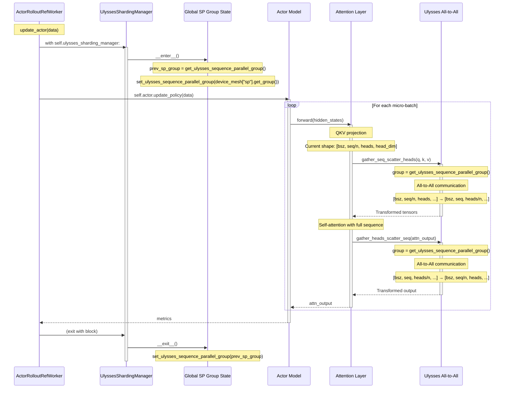

# UlyssesShardingManager 上下文管理器协议详解

## 问题引入

在代码中看到这样的用法：
```python
with self.ulysses_sharding_manager:
    data = data.to("cpu")
    metrics = self.actor.update_policy(data=data)
    output = DataProto(batch=None, meta_info={"metrics": metrics})
```

但是 `UlyssesShardingManager` 类明明定义了 `preprocess_data` 和 `postprocess_data` 方法，为什么没有看到调用？

## Python 上下文管理器协议

Python 的 `with` 语句会自动调用对象的魔法方法：

```python
with obj:
    # code block
```

等价于：

```python
obj.__enter__()
try:
    # code block
finally:
    obj.__exit__(exc_type, exc_value, traceback)
```

## UlyssesShardingManager 的实际实现

### 源码分析

**文件路径**: `verl/workers/sharding_manager/fsdp_ulysses.py`

```python
class FSDPUlyssesShardingManager(BaseShardingManager):
    def __init__(self, device_mesh: DeviceMesh):
        super().__init__()
        self.device_mesh = device_mesh
        self.seed_offset = 12345

    def __enter__(self):
        """进入上下文时调用"""
        if self.device_mesh is not None:
            # 保存当前的全局 SP group
            self.prev_sp_group = get_ulysses_sequence_parallel_group()
            # 设置为当前模型专用的 SP group
            set_ulysses_sequence_parallel_group(self.device_mesh["sp"].get_group())

    def __exit__(self, exc_type, exc_value, traceback):
        """退出上下文时调用"""
        if self.device_mesh is not None:
            # 恢复之前的 SP group
            set_ulysses_sequence_parallel_group(self.prev_sp_group)

    def preprocess_data(self, data: DataProto) -> DataProto:
        """
        AllGather data from sp region
        This is because the data is first sharded along the FSDP dimension as we utilize the DP_COMPUTE
        In Ulysses, we need to make sure the same data is used across a SP group
        """
        if self.device_mesh is not None:
            group = self.device_mesh["sp"].get_group()
            all_gather_data_proto(data=data, process_group=group)
        return data

    def postprocess_data(self, data: DataProto) -> DataProto:
        """Split the data to follow FSDP partition"""
        if self.device_mesh is not None:
            sp_size = self.device_mesh["sp"].size()
            sp_rank = self.device_mesh["sp"].get_local_rank()
            data = data.chunk(chunks=sp_size)[sp_rank]
        return data
```

### 关键发现

**`__enter__` 和 `__exit__` 并没有调用 `preprocess_data` 和 `postprocess_data`！**

它们只是设置和恢复 Sequence Parallel 的通信组（process group）。

## 两种使用模式

### 模式 1：标准实现（只用上下文管理器）

**文件路径**: `verl/workers/fsdp_workers.py:852-883`

```python
@register(dispatch_mode=make_nd_compute_dataproto_dispatch_fn(mesh_name="actor"))
@DistProfiler.annotate(color="red", role="actor_update")
def update_actor(self, data: DataProto):
    assert self._is_actor
    if self._is_offload_param:
        load_fsdp_model_to_gpu(self.actor_module_fsdp)
    if self._is_offload_optimizer:
        load_fsdp_optimizer(optimizer=self.actor_optimizer, device_id=get_device_id())

    with self.ulysses_sharding_manager:  # ← 只用 with 语句
        data = data.to("cpu")  # data will to device with each micro batch

        # perform training
        with Timer(name="update_policy", logger=None) as timer:
            metrics = self.actor.update_policy(data=data)  # ← 模型内部处理 SP

        # ... metrics collection ...

        output = DataProto(batch=None, meta_info={"metrics": metrics})
        output = output.to("cpu")

    # ... cleanup ...
    return output
```

**执行流程**：
1. ✅ `__enter__()` 被调用 → 设置 SP group
2. ❌ **没有**调用 `preprocess_data`
3. ✅ `self.actor.update_policy(data=data)` 内部的模型层自动处理 Ulysses SP（见下文）
4. ❌ **没有**调用 `postprocess_data`
5. ✅ `__exit__()` 被调用 → 恢复之前的 SP group

**为什么不需要显式调用？**

因为 Ulysses Sequence Parallel 是在**模型的 attention 层内部**实现的！

### 模型层的 Ulysses SP 实现

**文件路径**: `verl/models/transformers/qwen2.py:64-68, 148-150`

```python
def forward(self, ...):
    # ... qkv projection ...

    ########## AlltoAll for Ulysses ##########
    ulysses_sp_size = get_ulysses_sequence_parallel_world_size()

    if ulysses_sp_size > 1:
        validate_ulysses_config(self.num_heads, ulysses_sp_size)

        # 在 attention 计算前：
        # (bsz, n_head, seq_len/n, head_dim) -> (bsz, n_head/n, seq_len, head_dim)
        query_states = gather_seq_scatter_heads(query_states, seq_dim=2, head_dim=1)
        key_states = gather_seq_scatter_heads(key_states, seq_dim=2, head_dim=1)
        value_states = gather_seq_scatter_heads(value_states, seq_dim=2, head_dim=1)

    # ... attention computation with full sequence ...

    ########## AlltoAll for Ulysses ##########
    if ulysses_sp_size > 1:
        # 在 attention 计算后：
        # (bsz, seq, h/n, ...) -> (bsz, seq/n, h, ...)
        attn_output = gather_heads_scatter_seq(attn_output, seq_dim=1, head_dim=2)

    # ... output projection ...
```

**Ulysses SP 的 All-to-All 通信**

**文件路径**: `verl/utils/ulysses.py:62-101`

```python
def gather_seq_scatter_heads(x: Tensor, seq_dim: int, head_dim: int, ...) -> Tensor:
    """
    gather sequence dimension and scatter head dim:
    e.g. seq_dim: 1, head_dim: 2
    [bsz, seq/n, h, ...] -> [bsz, seq, h/n, ...]
    """
    group = get_ulysses_sequence_parallel_group()  # ← 获取上下文管理器设置的 SP group
    if not group:
        return x
    # ... all-to-all communication ...
    return SeqAllToAll.apply(group, x, seq_dim, head_dim, True)

def gather_heads_scatter_seq(x: Tensor, head_dim: int, seq_dim: int, ...) -> Tensor:
    """
    gather head dimension and scatter seq dim:
    e.g. seq_dim: 1, head_dim: 2
    [bsz, seq, h/n, ...] -> [bsz, seq/n, h, ...]
    """
    group = get_ulysses_sequence_parallel_group()  # ← 获取上下文管理器设置的 SP group
    if not group:
        return x
    # ... all-to-all communication ...
    return SeqAllToAll.apply(group, x, seq_dim, head_dim, False)
```

### 完整流程图



### 模式 2：显式调用预处理和后处理（Recipe 实现）

**文件路径**: `recipe/spin/fsdp_workers.py:567-591`

```python
@register(dispatch_mode=make_nd_compute_dataproto_dispatch_fn(mesh_name="reward_model"))
def compute_rm_score(self, data: DataProto):
    # ... preprocessing ...

    with self.ulysses_sharding_manager:
        # 显式调用 preprocess_data
        rm_data = self.ulysses_sharding_manager.preprocess_data(data=rm_data)
        data = self.ulysses_sharding_manager.preprocess_data(data=data)

        # ... model forward computation ...

        token_level_scores = self._expand_to_token_level(data, scores)
        output = DataProto.from_dict(tensors={"rm_scores": token_level_scores})

        # 显式调用 postprocess_data
        output = self.ulysses_sharding_manager.postprocess_data(data=output)

    return output
```

**为什么需要显式调用？**

在某些特殊场景中（如 SPIN、PRIME 等算法），需要：
1. **数据预处理**：确保 SP group 内的所有 ranks 有完整的、一致的数据
2. **自定义计算**：不依赖模型内置的 Ulysses SP 机制
3. **数据后处理**：将结果按 SP rank 分片，以便后续处理

## 总结对比

| 方面 | 标准实现 (fsdp_workers.py) | Recipe 实现 (SPIN/PRIME) |
|------|---------------------------|-------------------------|
| **上下文管理器** | ✅ 使用 `with` 语句 | ✅ 使用 `with` 语句 |
| **`__enter__`** | ✅ 设置 SP group | ✅ 设置 SP group |
| **`__exit__`** | ✅ 恢复 SP group | ✅ 恢复 SP group |
| **`preprocess_data`** | ❌ 不调用 | ✅ **显式调用** |
| **`postprocess_data`** | ❌ 不调用 | ✅ **显式调用** |
| **数据处理方式** | 模型内部 All-to-All | 手动 All-gather + Chunk |
| **使用场景** | 标准 PPO 训练 | 特殊算法（SPIN/PRIME） |

## 核心要点

### 1. 上下文管理器的唯一职责

```python
with self.ulysses_sharding_manager:
    # 在这个代码块中：
    # - SP group 被设置为当前模型的专用 group
    # - 模型内部的 Ulysses SP 能够使用正确的通信组
```

### 2. 数据处理的两种方式

**方式 A：模型内部自动处理（标准）**
- Dispatch 层：同一 DP rank 的所有 SP workers 收到相同数据
- 模型层：Attention 层内部通过 All-to-All 自动分配和聚合序列
- 上下文管理器：只负责设置正确的 SP group

**方式 B：显式预处理和后处理（特殊场景）**
- `preprocess_data`: All-gather 确保 SP group 内数据一致
- 自定义计算逻辑
- `postprocess_data`: 按 SP rank 分片结果

### 3. 为什么要有 `preprocess_data` 和 `postprocess_data`？

虽然标准实现不使用它们，但它们为特殊场景提供了灵活性：
- **扩展性**：支持不同的数据分片策略
- **复用性**：Recipe 实现可以复用这些方法
- **未来兼容**：为 HybridEngine 等高级特性预留接口

## 相关文件索引

| 文件路径 | 说明 | 关键代码行 |
|---------|------|-----------|
| `verl/workers/sharding_manager/base.py` | BaseShardingManager 基类 | 21-36 |
| `verl/workers/sharding_manager/fsdp_ulysses.py` | FSDPUlyssesShardingManager 实现 | 27-72 |
| `verl/workers/fsdp_workers.py` | 标准 Worker 实现（只用 with） | 852-883, 956-975, 996-1011, 1450-1458, 1469-1484 |
| `verl/models/transformers/qwen2.py` | 模型层 Ulysses SP 实现 | 64-68, 148-150 |
| `verl/utils/ulysses.py` | Ulysses All-to-All 通信原语 | 62-101 |
| `recipe/spin/fsdp_workers.py` | SPIN 显式调用示例 | 567-591 |
| `recipe/prime/prime_fsdp_workers.py` | PRIME 显式调用示例 | 290-304, 323-344 |

## 扩展阅读

- **DataProto 深度讲解**: `claude_docs/DataProto深度讲解.md`
- **Decorator 和 Worker 绑定机制**: `claude_docs/verl_decorator_worker_binding_mechanism.md`
- **Ray WorkerGroup 架构**: `claude_docs/verl_ray_workergroup_architecture.md`
