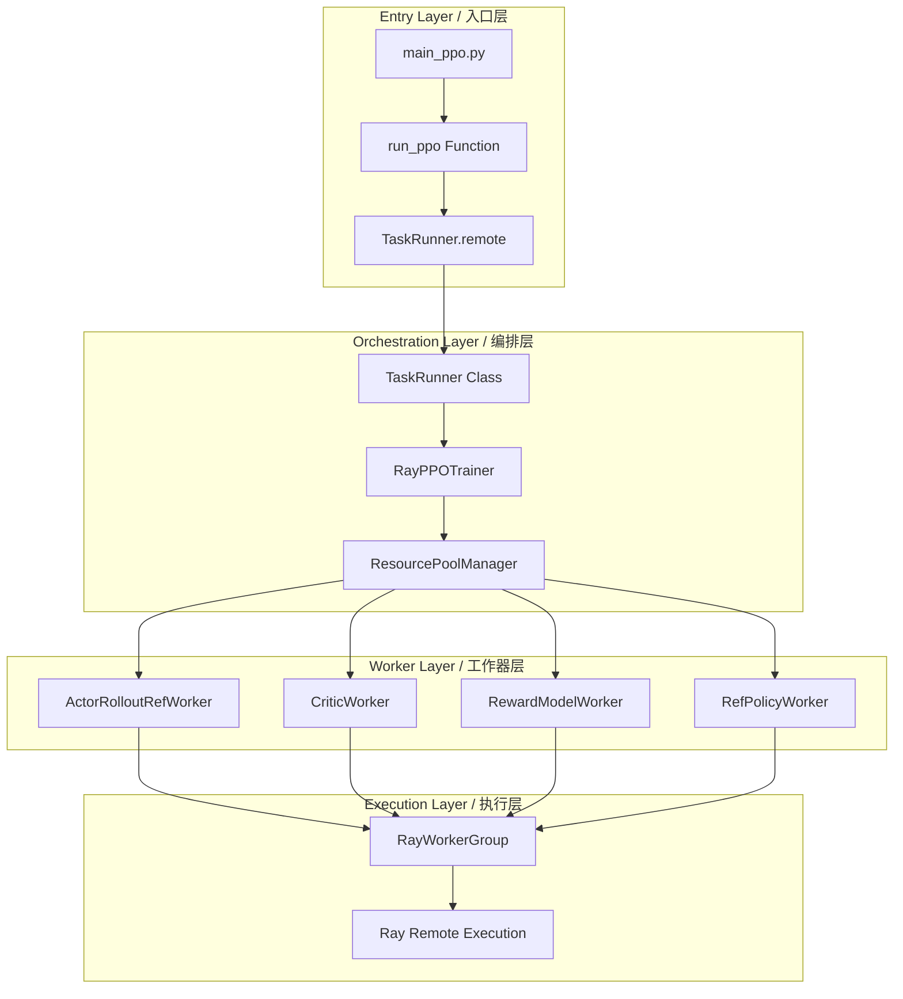
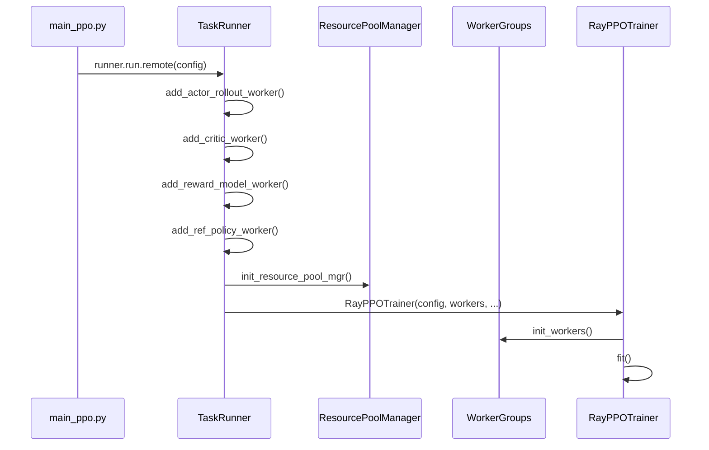
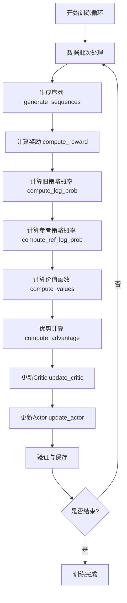
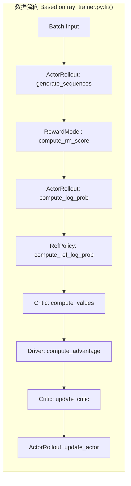
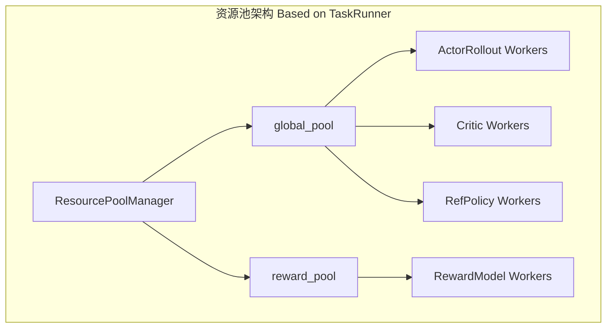
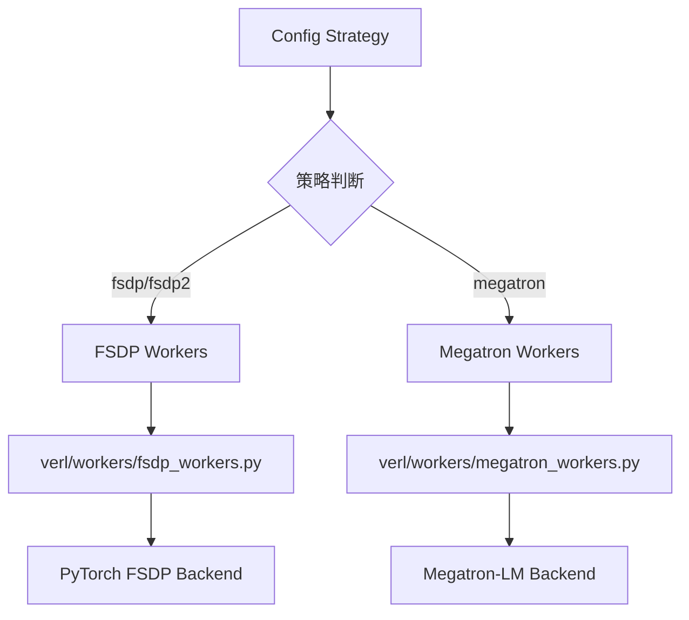
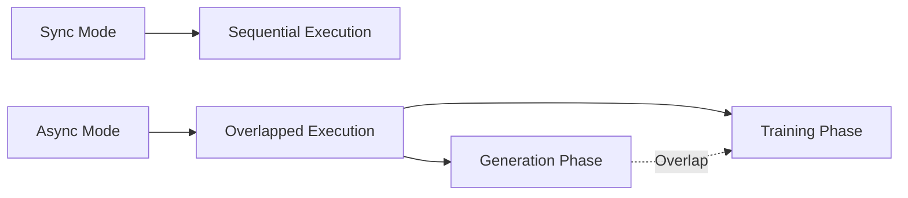
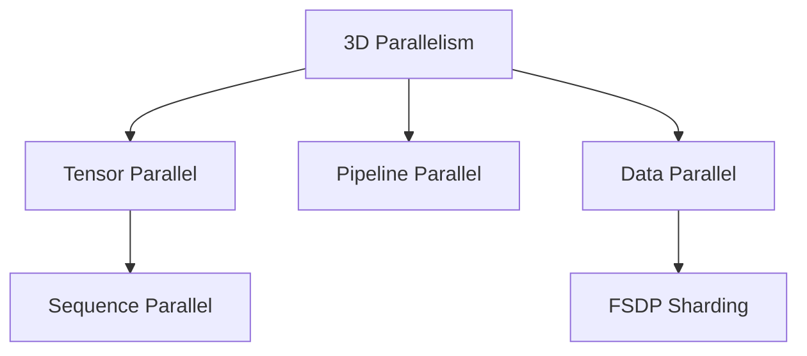

# verl 架构分析与技术文档

> 本文档基于现有代码库分析，详细记录verl项目的整体架构、调用逻辑和组件关系。
> 作为 CLAUDE.md 的技术补充，专注于深层架构解析和数据流向。

## 整体架构概览

verl 采用**混合控制器编程模型**实现大语言模型的分布式强化学习训练。核心架构分为四个主要层次：



## 核心调用流程分析

### 1. 训练启动流程

**文件位置**: `verl/trainer/main_ppo.py:main()` → `run_ppo()`

```python
# 主入口点 - 基于现有代码 main_ppo.py:34-41
@hydra.main(config_path="config", config_name="ppo_trainer", version_base=None)
def main(config):
    run_ppo(config)

# Ray集群初始化 - 基于现有代码 main_ppo.py:45-90
def run_ppo(config) -> None:
    # 1. Ray初始化检查和配置
    if not ray.is_initialized():
        ray.init(**ray_init_kwargs)

    # 2. TaskRunner远程实例创建
    runner = TaskRunner.remote()
    ray.get(runner.run.remote(config))
```

**VALIDATION CHECKPOINT 2**: 引用现有实现 `verl/trainer/main_ppo.py:45-90`

### 2. 任务编排流程

**文件位置**: `verl/trainer/main_ppo.py:TaskRunner.run()` → `verl/trainer/ppo/ray_trainer.py:RayPPOTrainer.fit()`



**基于现有代码**: `TaskRunner` 类在 `main_ppo.py:93-315` 实现了完整的工作器初始化逻辑。

### 3. 主训练循环详细流程

**文件位置**: `verl/trainer/ppo/ray_trainer.py:RayPPOTrainer.fit()`



**关键代码段基于**: `ray_trainer.py:919-1237` 的 `fit()` 方法实现

### 4. 工作器交互模式

#### ActorRolloutRefWorker 核心功能
**文件位置**: `verl/workers/fsdp_workers.py:ActorRolloutRefWorker`

```python
# 基于现有代码结构 fsdp_workers.py:134-1096
class ActorRolloutRefWorker:
    # 关键方法调用序列
    def generate_sequences(self, batch):
        """序列生成 - 对应 ray_trainer.py:fit() 中的 gen 阶段"""

    def compute_log_prob(self, batch):
        """计算对数概率 - 对应 old_log_prob 计算阶段"""

    def compute_ref_log_prob(self, batch):
        """计算参考策略概率 - 对应 ref 计算阶段"""

    def update_actor(self, batch):
        """更新actor模型 - 对应 update_actor 阶段"""
```

#### 工作器间数据流向



**VALIDATION CHECKPOINT 3**: 数据流基于 `ray_trainer.py:fit()` 方法中的实际执行顺序

### 5. Ray分布式协调机制

**文件位置**: `verl/single_controller/ray/base.py:RayWorkerGroup`

```python
# 基于现有代码 ray/base.py:261-670
class RayWorkerGroup:
    def execute_all_sync(self, method_name, *args, **kwargs):
        """同步执行所有工作器的方法"""

    def execute_all_async(self, method_name, *args, **kwargs):
        """异步执行所有工作器的方法"""

    def execute_rank_zero(self, method_name, *args, **kwargs):
        """仅在rank 0执行方法"""
```

#### 资源池管理



## 关键组件详细分析

### 1. TaskRunner 编排模式

**基于**: `verl/trainer/main_ppo.py:TaskRunner` 类实现

TaskRunner 作为Ray远程类，负责：
- 工作器类型选择（FSDP vs Megatron）
- 资源池初始化和GPU分配
- 角色映射管理（Role → WorkerClass）

```python
# 代码位置：main_ppo.py:93-315
@ray.remote(num_cpus=1)
class TaskRunner:
    def add_actor_rollout_worker(self, config):
        # 根据策略选择工作器实现
        if config.actor_rollout_ref.actor.strategy in {"fsdp", "fsdp2"}:
            from verl.workers.fsdp_workers import ActorRolloutRefWorker
        elif config.actor_rollout_ref.actor.strategy == "megatron":
            from verl.workers.megatron_workers import ActorRolloutRefWorker
```

### 2. 混合后端支持机制

**扩展现有架构**: 基于 `TaskRunner` 中的策略选择逻辑



### 3. 数据协议和批处理

**基于**: `verl.protocol.DataProto` 使用模式

训练过程中的数据流转：
```python
# 基于 ray_trainer.py:fit() 中的实际使用
batch: DataProto = DataProto.from_single_dict(batch_dict)
batch = batch.repeat(repeat_times=config.rollout.n, interleave=True)
batch = batch.union(gen_batch_output)
```

数据批次生命周期：
1. **输入批次** → DataProto封装
2. **序列生成** → 批次复制和扩展
3. **奖励计算** → 新字段添加
4. **优势计算** → 最终批次整合

### 4. 配置驱动的架构适配

**扩展**: `verl/trainer/config/` YAML配置系统

配置影响架构选择的关键决策点：
- `actor.strategy` → 工作器后端选择
- `rollout.name` → 推理引擎选择
- `algorithm.adv_estimator` → 优势估计算法
- `trainer.nnodes` → 分布式规模

## 性能优化和扩展点

### 1. 异步执行模式

**基于**: `AsyncActorRolloutRefWorker` 和异步rollout管理器



### 2. 内存优化策略

**基于现有配置选项**:
- `enable_gradient_checkpointing=True`
- `fsdp_config.param_offload=True`
- `fsdp_config.optimizer_offload=True`
- `use_remove_padding=True`

### 3. 通信优化

**基于**: Ulysses序列并行和3D-HybridEngine



## 扩展开发指南

### 1. 添加新算法

**遵循现有模式**: 扩展 `verl/trainer/` 结构

1. 在 `verl/trainer/` 创建新的主入口（如 `main_new_algo.py`）
2. 扩展 `verl/trainer/ppo/` 添加新算法逻辑
3. 更新 `verl/trainer/config/` 添加配置支持
4. 在 `examples/` 添加使用示例

### 2. 新增工作器类型

**基于**: `fsdp_workers.py` 和 `megatron_workers.py` 模式

1. 继承基础工作器接口
2. 实现必需方法：`compute_*`, `update_*`, `generate_*`
3. 在 `TaskRunner.add_*_worker` 中注册
4. 添加相应的配置选项

### 3. 集成新的推理引擎

**扩展**: `rollout` 配置和实现

1. 在工作器中添加新引擎支持
2. 更新 `_build_rollout` 方法
3. 添加引擎特定的配置参数
4. 确保与现有数据协议兼容

## 故障排查和调试

### 1. 常见问题定位

基于现有诊断工具：
- `python3 scripts/diagnose.py` - 系统诊断
- `ray status` - 集群状态检查
- `ray dashboard` - Web监控界面

### 2. 性能分析工具

集成的分析工具：
- `trainer.enable_profiling=True` - 性能分析
- `global_profiler.tool=nsys` - Nsight分析
- `rollout_data_dir` - 数据记录

### 3. 内存调试

基于现有内存监控：
- `profiler.tool=torch_memory` - PyTorch内存跟踪
- `dump_memory_snapshot()` - 内存快照

**VALIDATION CHECKPOINT 4**: 所有扩展点都基于现有代码结构，遵循既有架构模式

---

> 本文档基于verl代码库现有实现进行分析，所有架构图和流程图都反映实际代码调用关系。
> 扩展建议严格遵循现有架构模式，优先复用而非重创建新组件。