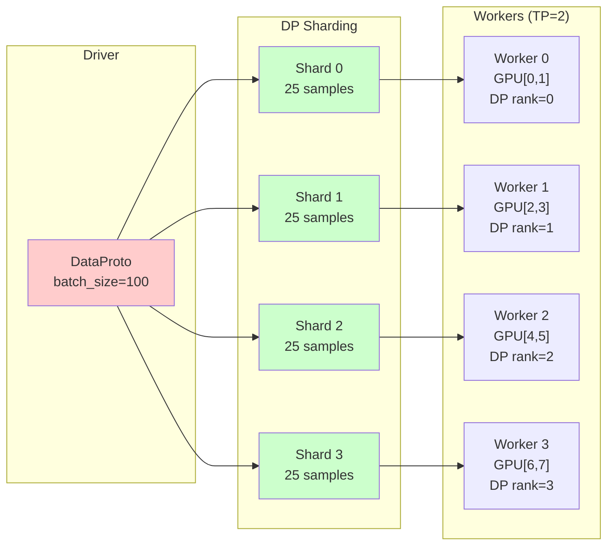
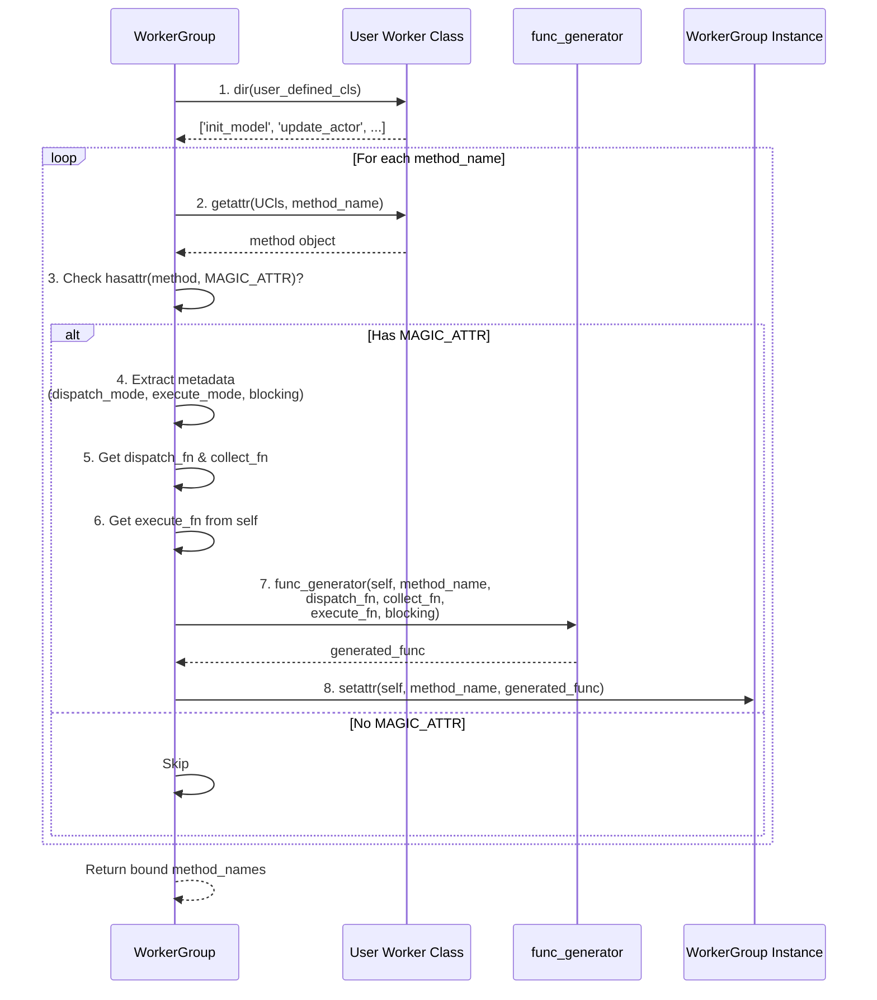
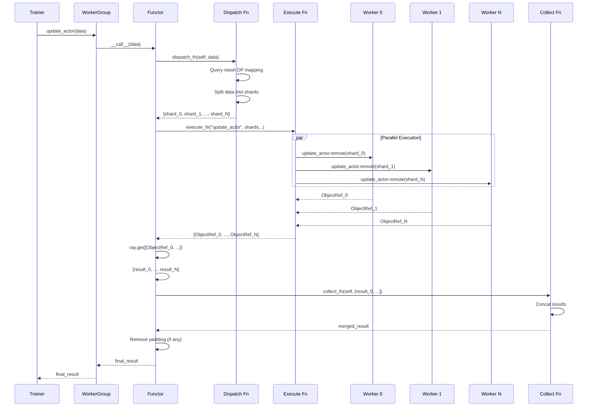
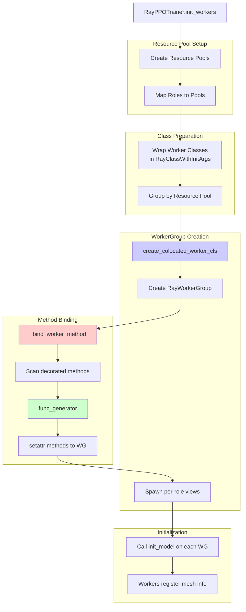
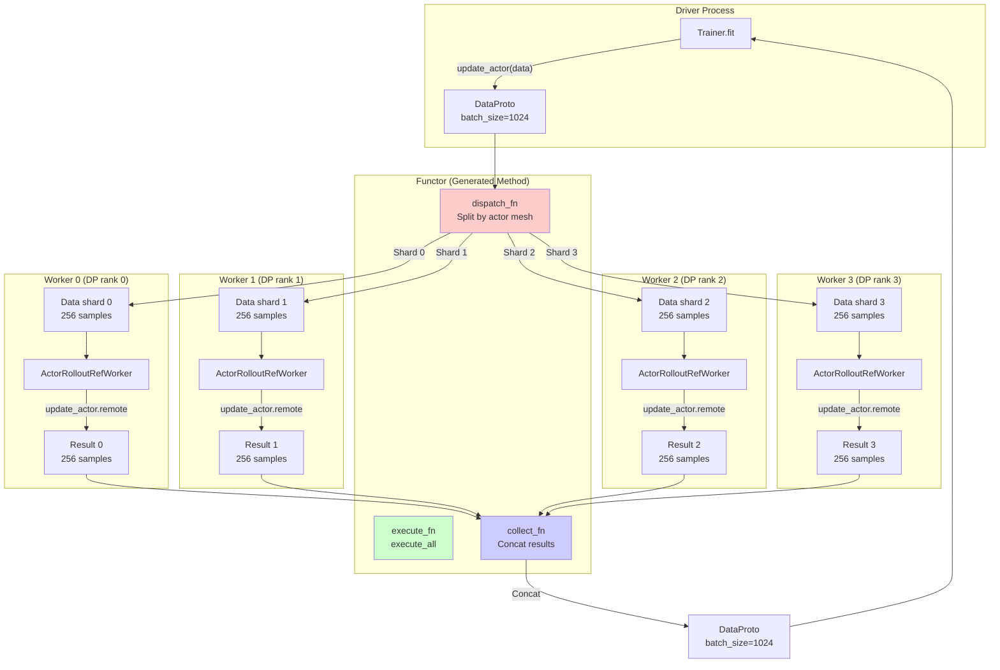
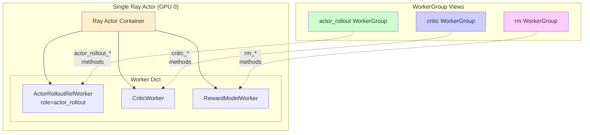
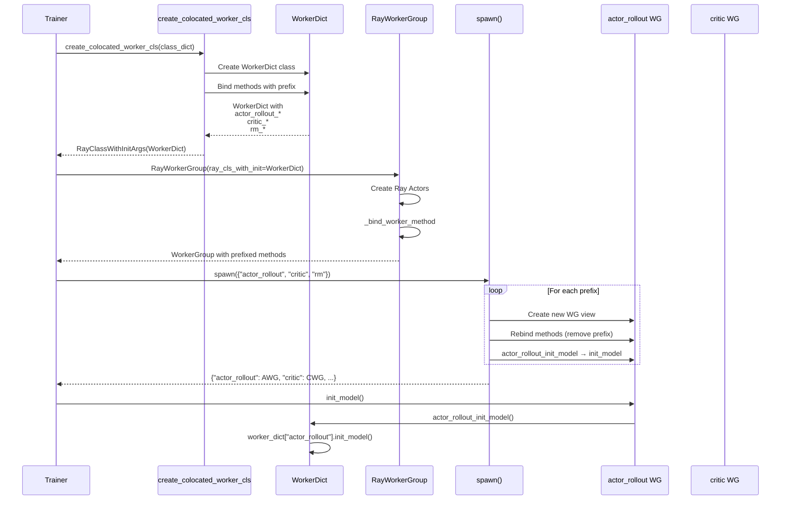

# VERL Decorator 与 Worker Binding 机制深度讲解

## 文档说明

本文档详细剖析 verl 框架中 `decorator.py` 与各种 bind worker 的协同工作机制。这是 verl 分布式训练架构的核心，理解这部分对于扩展和修改框架至关重要。

**适用人群**：需要深度理解 verl 内部机制、扩展框架功能或调试分布式问题的开发者

**主要内容**：
- 装饰器系统的设计原理
- WorkerGroup 方法绑定机制
- Dispatch/Execute/Collect 三层抽象
- Colocated Workers 高级特性
- 扩展指南与最佳实践

---

## 1. 概述与核心概念

### 1.1 问题背景

在分布式强化学习训练中，verl 需要解决以下核心问题：

1. **角色分离**：Actor、Critic、RewardModel、RefPolicy 等不同角色需要运行在不同的进程/GPU上
2. **方法调用抽象**：Driver 进程需要透明地调用远程 Worker 上的方法
3. **数据分发策略**：不同方法需要不同的数据分发方式（广播、分片、聚合等）
4. **资源共享**：多个角色可能共享同一组 GPU（Colocated Workers）

verl 的解决方案是一套**装饰器驱动的动态方法绑定系统**：

```
Worker 类定义方法 + @register 装饰器
           ↓
WorkerGroup 启动时扫描装饰器元数据
           ↓
动态生成并绑定分布式调用方法
           ↓
Driver 调用 WorkerGroup.method() → 自动分发/执行/收集
```

### 1.2 架构总览

```mermaid
graph TB
    subgraph "Driver Process"
        Trainer[RayPPOTrainer]
        WG[RayWorkerGroup]
    end

    subgraph "Worker Definition"
        WorkerCls[ActorRolloutRefWorker<br/>@register decorated methods]
    end

    subgraph "Binding Mechanism"
        Decorator[@register装饰器]
        BindMethod[_bind_worker_method]
        FuncGen[func_generator]
    end

    subgraph "Ray Remote Workers"
        W1[Worker 1<br/>GPU:0]
        W2[Worker 2<br/>GPU:1]
        W3[Worker N<br/>GPU:N]
    end

    WorkerCls -->|1. 定义方法| Decorator
    Decorator -->|2. 附加元数据| WorkerCls

    WG -->|3. 初始化时调用| BindMethod
    BindMethod -->|4. 扫描方法| WorkerCls
    BindMethod -->|5. 生成调用函数| FuncGen
    FuncGen -->|6. 绑定到| WG

    Trainer -->|7. 调用方法| WG
    WG -->|8. dispatch_fn<br/>数据分发| W1
    WG --> W2
    WG --> W3

    W1 -->|9. execute<br/>远程执行| W1
    W2 --> W2
    W3 --> W3

    W1 -->|10. collect_fn<br/>结果收集| WG
    W2 --> WG
    W3 --> WG

    WG -->|11. 返回结果| Trainer

    style Decorator fill:#ff9999
    style BindMethod fill:#99ccff
    style FuncGen fill:#99ff99
```

### 1.3 核心组件一览

| 组件 | 文件路径 | 主要职责 |
|------|---------|---------|
| `@register` 装饰器 | `verl/single_controller/base/decorator.py` | 在 Worker 方法上标记分发/执行元数据 |
| `Dispatch` 枚举 | `verl/single_controller/base/decorator.py` | 定义数据分发模式 |
| `Execute` 枚举 | `verl/single_controller/base/decorator.py` | 定义执行模式 |
| `WorkerGroup` | `verl/single_controller/base/worker_group.py` | 管理一组 Worker，绑定方法 |
| `RayWorkerGroup` | `verl/single_controller/ray/base.py` | Ray 后端的 WorkerGroup 实现 |
| `Worker` 基类 | `verl/single_controller/base/worker.py` | Worker 基类，提供环境配置 |
| `ActorRolloutRefWorker` | `verl/workers/fsdp_workers.py` | 具体的 Worker 实现示例 |
| `func_generator` | `verl/single_controller/ray/base.py` | 生成实际调用的函数 |

---

## 2. 核心组件详解

### 2.1 @register 装饰器机制

#### 2.1.1 装饰器定义

**源码位置**：`verl/single_controller/base/decorator.py:424-466`

```python
def register(dispatch_mode=Dispatch.ALL_TO_ALL,
             execute_mode=Execute.ALL,
             blocking=True,
             materialize_futures=True):
    """Register a function with distributed execution configuration.

    Args:
        dispatch_mode: 数据如何分发到各个 Worker
        execute_mode: 方法在哪些 Worker 上执行
        blocking: 是否阻塞等待结果
        materialize_futures: 是否在分发前物化 DataProtoFuture
    """
    def decorator(func):
        @wraps(func)
        def inner(*args, **kwargs):
            if materialize_futures:
                args, kwargs = _materialize_futures(*args, **kwargs)
            return func(*args, **kwargs)

        # 将元数据附加到函数上
        attrs = {
            "dispatch_mode": dispatch_mode,
            "execute_mode": execute_mode,
            "blocking": blocking
        }
        setattr(wrapper, MAGIC_ATTR, attrs)  # MAGIC_ATTR = "attrs_3141562937"
        return wrapper
    return decorator
```

**关键点**：
1. **MAGIC_ATTR**：使用魔法字符串 `"attrs_3141562937"` 避免与用户属性冲突
2. **元数据字典**：存储 `dispatch_mode`, `execute_mode`, `blocking` 三个关键配置
3. **materialize_futures**：确保 `DataProtoFuture` 在分发前被物化为实际数据

#### 2.1.2 装饰器参数详解

**dispatch_mode** - 数据分发模式：

| 模式 | 含义 | 使用场景 |
|------|------|---------|
| `Dispatch.ONE_TO_ALL` | 相同数据广播到所有 Worker | 初始化、配置更新 |
| `Dispatch.ALL_TO_ALL` | 数据原样传递，不做处理 | 数据已经按 Worker 分好 |
| `Dispatch.DP_COMPUTE` | 数据分片，每个 Worker 处理一部分 | 通用数据并行计算 |
| `Dispatch.DP_COMPUTE_PROTO` | DataProto 自动分片并 padding | Actor/Critic 训练 |
| `Dispatch.DP_COMPUTE_PROTO_WITH_FUNC` | 第一个参数是函数，其余参数是 DataProto | 动态函数分发 |
| `make_nd_compute_dataproto_dispatch_fn(mesh_name)` | 基于 mesh 的智能分发 | 多维并行（DP+TP+PP） |

**execute_mode** - 执行模式：

| 模式 | 含义 | WorkerGroup 方法 |
|------|------|-----------------|
| `Execute.ALL` | 在所有 Worker 上执行 | `execute_all` / `execute_all_async` |
| `Execute.RANK_ZERO` | 仅在 rank 0 Worker 上执行 | `execute_rank_zero` / `execute_rank_zero_async` |

**blocking** - 阻塞模式：

| 值 | 行为 | 返回值 |
|----|------|-------|
| `True` | 阻塞等待所有 Worker 完成 | 实际结果（经过 collect_fn 处理） |
| `False` | 立即返回 | `ray.ObjectRef` 列表（需手动 `ray.get`） |

#### 2.1.3 实际使用示例

**示例 1：简单的初始化方法**

**源码位置**：`verl/workers/fsdp_workers.py:731-840`

```python
class ActorRolloutRefWorker(Worker):
    @register(dispatch_mode=Dispatch.ONE_TO_ALL)
    def init_model(self):
        """初始化模型，所有 Worker 执行相同操作"""
        # 加载模型、创建 optimizer 等
        self.actor_module_fsdp = ...
        self.actor_optimizer = ...
```

**工作流程**：
1. Driver 调用：`worker_group.init_model()`
2. Dispatch：`ONE_TO_ALL` → 所有 Worker 收到相同的空参数
3. Execute：`ALL` → 每个 Worker 执行 `init_model()`
4. Collect：`ALL_TO_ALL` → 收集所有返回值（通常为 None）

**示例 2：数据并行训练**

**源码位置**：`verl/workers/fsdp_workers.py:842-883`

```python
class ActorRolloutRefWorker(Worker):
    @register(dispatch_mode=make_nd_compute_dataproto_dispatch_fn(mesh_name="actor"))
    def update_actor(self, data: DataProto):
        """更新 Actor 模型，数据自动分片到各 DP rank"""
        # data 已经被自动分片，每个 Worker 只处理一部分
        metrics = self.actor.update_policy(data=data)
        return DataProto(meta_info={"metrics": metrics})
```

**工作流程**：
1. Driver 调用：`worker_group.update_actor(data)  # data 包含 1024 个样本`
2. Dispatch：`make_nd_compute_dataproto_dispatch_fn("actor")`
   - 查询 mesh "actor" 的 DP 配置
   - 将 data 分片（如 4 个 DP rank → 每个 256 样本）
   - 自动 padding 到能被 DP size 整除
3. Execute：`ALL` → 每个 Worker 处理自己的分片
4. Collect：自动 concat DataProto → 返回完整的 1024 个样本的结果

**示例 3：Rollout 生成（特殊 dispatch）**

**源码位置**：`verl/workers/fsdp_workers.py:885-933`

```python
class ActorRolloutRefWorker(Worker):
    @register(dispatch_mode=make_nd_compute_dataproto_dispatch_fn(mesh_name="rollout"))
    def generate_sequences(self, prompts: DataProto):
        """生成序列，rollout mesh 可能与 actor mesh 不同"""
        output = self.rollout.generate_sequences(prompts=prompts)
        return output
```

**关键点**：`mesh_name="rollout"` 可能与 `"actor"` 不同，因为：
- Actor 训练可能使用 DP=4, TP=2（8 GPUs）
- Rollout 推理可能使用 DP=2, TP=4（8 GPUs）
- 同一组 GPU，不同的并行策略！

### 2.2 Dispatch 系统

#### 2.2.1 Dispatch 枚举与注册表

**源码位置**：`verl/single_controller/base/decorator.py:28-51`

```python
class Dispatch(DynamicEnum):
    """动态枚举，可以在运行时注册新模式"""
    _registry = {}
    _next_value = 0

# 预定义的 Dispatch 模式
def init_predefined_dispatch_mode():
    Dispatch.register("RANK_ZERO")        # 仅发送到 rank 0
    Dispatch.register("ONE_TO_ALL")       # 广播相同数据
    Dispatch.register("ALL_TO_ALL")       # 不做处理
    Dispatch.register("DP_COMPUTE")       # 数据并行计算
    Dispatch.register("DP_COMPUTE_PROTO") # DataProto 分片
    Dispatch.register("DP_COMPUTE_PROTO_WITH_FUNC")  # 函数 + DataProto
    Dispatch.register("DP_COMPUTE_METRIC")           # 分片数据，保留原始返回
    Dispatch.register("DIRECT_ROLLOUT_METHOD")       # vLLM 特殊模式
```

**全局注册表**：`verl/single_controller/base/decorator.py:313-332`

```python
DISPATCH_MODE_FN_REGISTRY = {
    Dispatch.ONE_TO_ALL: {
        "dispatch_fn": dispatch_one_to_all,
        "collect_fn": collect_all_to_all,
    },
    Dispatch.DP_COMPUTE_PROTO: {
        "dispatch_fn": dispatch_dp_compute_data_proto,
        "collect_fn": collect_dp_compute_data_proto,
    },
    # ... 其他模式
}
```

#### 2.2.2 各种 Dispatch 模式详解

**模式 1: ONE_TO_ALL（广播）**

**源码位置**：`verl/single_controller/base/decorator.py:141-144`

```python
def dispatch_one_to_all(worker_group, *args, **kwargs):
    """将相同参数复制 N 份发送到 N 个 Worker"""
    args = tuple([arg] * worker_group.world_size for arg in args)
    kwargs = {k: [v] * worker_group.world_size for k, v in kwargs.items()}
    return args, kwargs

def collect_all_to_all(worker_group, output):
    """原样返回所有输出"""
    return output
```

**数据流示例**：
```python
# 输入
worker_group.init_model()

# dispatch_one_to_all 转换后（假设 world_size=4）
# args = (), kwargs = {}
# → args = (), kwargs = {}  (复制 4 次)

# 每个 Worker 收到相同的空参数
Worker 0: init_model()
Worker 1: init_model()
Worker 2: init_model()
Worker 3: init_model()

# collect_all_to_all
# → [None, None, None, None]
```

**模式 2: DP_COMPUTE_PROTO（DataProto 分片）**

**源码位置**：`verl/single_controller/base/decorator.py:166-180`

```python
def dispatch_dp_compute_data_proto(worker_group, *args, **kwargs):
    """DataProto 自动分片 + padding"""
    assert isinstance(worker_group, WorkerGroup)

    # 调用带 padding 的分片函数
    splitted_args, splitted_kwargs = _split_args_kwargs_data_proto_with_auto_padding(
        worker_group.world_size, *args, **kwargs
    )
    return splitted_args, splitted_kwargs

def collect_dp_compute_data_proto(worker_group, output):
    """Concat DataProto 分片"""
    output = collect_dp_compute(worker_group, output)
    return _concat_data_proto_or_future(output)
```

**分片函数**：`verl/single_controller/base/decorator.py:106-130`

```python
def _split_args_kwargs_data_proto_with_auto_padding(chunks, *args, **kwargs):
    """自动 padding + 分片"""
    data_proto_len = None
    padding_size = None

    def _padding_and_split_data(obj, chunks):
        nonlocal data_proto_len, padding_size

        if isinstance(obj, DataProto) and obj.is_padding_enabled():
            if data_proto_len is None:
                data_proto_len = len(obj)
                # 计算需要 padding 多少
                padding_size = (chunks - (data_proto_len % chunks)) \
                               if (data_proto_len % chunks > 0) else 0
            obj.padding(padding_size=padding_size)

        return obj.chunk(chunks=chunks)  # 分片

    splitted_args = [_padding_and_split_data(arg, chunks) for arg in args]
    splitted_kwargs = {k: _padding_and_split_data(v, chunks) for k, v in kwargs.items()}

    # 将 padding_size 传递给 Worker，以便后续 unpad
    if padding_size is not None:
        splitted_kwargs[_padding_size_key] = padding_size

    return splitted_args, splitted_kwargs
```

**数据流示例**：
```python
# 输入
data = DataProto(batch_size=10)  # 10 个样本
worker_group.update_actor(data)  # world_size=4

# dispatch_dp_compute_data_proto
# 1. 计算 padding: 10 % 4 = 2, 需要 padding 2 个
data_padded = DataProto(batch_size=12)

# 2. 分片：12 / 4 = 3
Worker 0: data[0:3]   # 3 个样本
Worker 1: data[3:6]   # 3 个样本
Worker 2: data[6:9]   # 3 个样本
Worker 3: data[9:12]  # 3 个样本（包含 2 个 padding）

# 3. 执行
Worker 0 → output_0 (3 samples)
Worker 1 → output_1 (3 samples)
Worker 2 → output_2 (3 samples)
Worker 3 → output_3 (3 samples, last 2 are padding)

# 4. collect_dp_compute_data_proto
# Concat: [output_0, output_1, output_2, output_3] → DataProto(batch_size=12)

# 5. func_generator 中自动 unpad（见后续章节）
# → DataProto(batch_size=10)  # 移除 padding
```

**模式 3: make_nd_compute_dataproto_dispatch_fn（多维并行）**

这是最复杂也是最强大的 dispatch 模式，支持多维并行（DP + TP + PP）。

**源码位置**：`verl/single_controller/base/decorator.py:306-310`

```python
def make_nd_compute_dataproto_dispatch_fn(mesh_name):
    """创建基于 mesh 的 dispatch 函数"""
    return {
        "dispatch_fn": partial(dispatch_lazy_compute_data_proto, mesh_name),
        "collect_fn": partial(collect_lazy_compute_data_proto, mesh_name),
    }
```

**Lazy dispatch 实现**：`verl/single_controller/base/decorator.py:286-304`

```python
def dispatch_lazy_compute_data_proto(mesh_name, worker_group, *args, **kwargs):
    """延迟查询 mesh 信息，然后分发"""
    assert isinstance(worker_group, WorkerGroup)

    # 查询 dispatch 信息（首次调用时）
    if mesh_name not in worker_group._dispatch_info:
        worker_group._dispatch_info[mesh_name] = \
            worker_group._query_dispatch_info(mesh_name)
        assert len(worker_group._dispatch_info[mesh_name]) == worker_group.world_size

    dp_rank_mapping = worker_group._dispatch_info[mesh_name]
    dp_size = max(dp_rank_mapping) + 1

    # 调用 N 维 dispatch
    return dispatch_nd_compute_dataproto(
        dp_rank_mapping, dp_size, worker_group, *args, **kwargs
    )
```

**DP rank mapping 机制**：

```python
# 示例：8 个 GPU，TP=2, DP=4
# Worker 布局：
# Worker 0: [GPU 0, GPU 1] - TP ranks [0, 1], DP rank 0
# Worker 1: [GPU 2, GPU 3] - TP ranks [0, 1], DP rank 1
# Worker 2: [GPU 4, GPU 5] - TP ranks [0, 1], DP rank 2
# Worker 3: [GPU 6, GPU 7] - TP ranks [0, 1], DP rank 3

# dp_rank_mapping = [0, 1, 2, 3]  # 每个 Worker 的 DP rank

# 如果有 100 个样本：
# DP分片：100 → [25, 25, 25, 25]
# Worker 0: 样本 [0:25]
# Worker 1: 样本 [25:50]
# Worker 2: 样本 [50:75]
# Worker 3: 样本 [75:100]
```

**N 维 dispatch 实现**：`verl/single_controller/base/decorator.py:197-225`

```python
def dispatch_nd_compute(dp_rank_mapping: list[int], dp_size,
                        worker_group, *args, **kwargs):
    """N 维并行的数据分发"""
    # 1. 将数据放入 Ray object store（避免多次序列化）
    args = [parallel_put(arg, max_workers=max_workers) for arg in args]
    kwargs = {k: parallel_put(v, max_workers=max_workers) for k, v in kwargs.items()}

    # 2. 根据 DP rank mapping 分发
    all_args = []
    for arg in args:
        assert isinstance(arg, list) and len(arg) == dp_size
        transformed_args = []
        for i in range(worker_group.world_size):
            local_dp_rank = dp_rank_mapping[i]
            transformed_args.append(arg[local_dp_rank])  # 选择对应的 DP 分片
        all_args.append(transformed_args)

    # kwargs 同理
    # ...
    return all_args, all_kwargs
```

**工作原理图**：



#### 2.2.3 Mesh 信息查询机制

Worker 如何注册和查询 mesh 信息？

**Worker 端注册**：`verl/single_controller/base/worker.py:76-87`

```python
class Worker:
    def _register_dispatch_collect_info(self, mesh_name: str,
                                         dp_rank: int,
                                         is_collect: bool):
        """注册当前 Worker 在指定 mesh 中的 DP rank"""
        if mesh_name in self.__dispatch_dp_rank:
            raise ValueError(f"mesh_name {mesh_name} has been registered")

        self.__dispatch_dp_rank[mesh_name] = dp_rank
        self.__collect_dp_rank[mesh_name] = is_collect

    @register(dispatch_mode=Dispatch.ONE_TO_ALL)
    def _query_dispatch_info(self, mesh_name: str):
        """查询 DP rank（被 WorkerGroup 调用）"""
        assert mesh_name in self.__dispatch_dp_rank
        return self.__dispatch_dp_rank[mesh_name]
```

**WorkerGroup 端查询**：在 `dispatch_lazy_compute_data_proto` 中：

```python
# 首次调用时查询所有 Worker 的 DP rank
if mesh_name not in worker_group._dispatch_info:
    worker_group._dispatch_info[mesh_name] = \
        worker_group._query_dispatch_info(mesh_name)
    # 结果：[0, 1, 2, 3] - 每个 Worker 的 DP rank
```

**实际注册时机**：在 Worker 初始化模型时（例如 FSDP 或 Megatron）

```python
# 在 ActorRolloutRefWorker.init_model() 中
# FSDP 会自动计算 DP rank
dp_rank = ...  # 从 device_mesh 计算得出
self._register_dispatch_collect_info(mesh_name="actor", dp_rank=dp_rank, is_collect=True)
```

### 2.3 Execute 系统

#### 2.3.1 Execute 模式定义

**源码位置**：`verl/single_controller/base/decorator.py:53-62`

```python
class Execute(DynamicEnum):
    """执行模式枚举"""
    _registry = {}
    _next_value = 0

def init_predefined_execute_mode():
    Execute.register("ALL")         # 所有 Worker 执行
    Execute.register("RANK_ZERO")   # 仅 rank 0 执行
```

**Execute 模式映射**：`verl/single_controller/base/decorator.py:371-381`

```python
def get_predefined_execute_fn(execute_mode):
    """获取 execute 函数名"""
    predefined_execute_mode_fn = {
        Execute.ALL: {"execute_fn_name": "execute_all"},
        Execute.RANK_ZERO: {"execute_fn_name": "execute_rank_zero"},
    }
    return predefined_execute_mode_fn[execute_mode]
```

#### 2.3.2 RayWorkerGroup 的 execute 实现

**源码位置**：`verl/single_controller/ray/base.py:363-425`

```python
class RayWorkerGroup(WorkerGroup):

    def _execute_remote_single_worker(self, worker, method_name: str,
                                       *args, **kwargs):
        """在单个 Worker 上执行方法"""
        if self.fused_worker_used and method_name not in self.method_names:
            # Fused Worker 特殊处理（见后续章节）
            remote_call = getattr(worker, self.fused_worker_execute_fn_name)
            return remote_call.remote(
                f"{self.sub_cls_name}_fwmn_{method_name}", *args, **kwargs
            )

        # 普通 Worker
        remote_call = getattr(worker, method_name)
        return remote_call.remote(*args, **kwargs)

    def execute_rank_zero_async(self, method_name: str, *args, **kwargs):
        """仅在 rank 0 上执行（异步）"""
        return self._execute_remote_single_worker(
            self._workers[0], method_name, *args, **kwargs
        )

    def execute_rank_zero_sync(self, method_name: str, *args, **kwargs):
        """仅在 rank 0 上执行（同步）"""
        return ray.get(self.execute_rank_zero_async(method_name, *args, **kwargs))

    def execute_rank_zero(self, method_name: str, *args, **kwargs):
        """默认异步"""
        return self.execute_rank_zero_async(method_name, *args, **kwargs)

    def execute_all_async(self, method_name: str, *args, **kwargs):
        """在所有 Worker 上执行（异步）"""
        # 智能分发：如果参数已经是按 Worker 分好的 list，则分发
        length = len(self._workers)
        if all(isinstance(arg, list) for arg in args) and \
           all(isinstance(kwarg, list) for kwarg in kwargs.values()):
            if all(len(arg) == length for arg in args) and \
               all(len(kwarg) == length for kwarg in kwargs.values()):
                # 参数已经分好
                result = []
                for i in range(length):
                    sliced_args = tuple(arg[i] for arg in args)
                    sliced_kwargs = {k: v[i] for k, v in kwargs.items()}
                    result.append(self._execute_remote_single_worker(
                        self._workers[i], method_name, *sliced_args, **sliced_kwargs
                    ))
                return result

        # 否则广播相同参数
        return [self._execute_remote_single_worker(worker, method_name, *args, **kwargs)
                for worker in self._workers]

    def execute_all_sync(self, method_name: str, *args, **kwargs):
        """在所有 Worker 上执行（同步）"""
        return ray.get(self.execute_all_async(method_name, *args, **kwargs))

    def execute_all(self, method_name: str, *args, **kwargs):
        """默认异步"""
        return self.execute_all_async(method_name, *args, **kwargs)
```

**关键点**：
1. **异步优先**：默认方法（`execute_all`, `execute_rank_zero`）都是异步的
2. **智能分发**：`execute_all_async` 会检查参数是否已经按 Worker 分好
3. **同步版本**：通过 `ray.get` 包装异步版本

### 2.4 WorkerGroup._bind_worker_method

这是整个机制的核心，负责将 Worker 类的装饰方法动态绑定到 WorkerGroup 实例上。

#### 2.4.1 绑定流程详解

**源码位置**：`verl/single_controller/base/worker_group.py:185-251`

```python
class WorkerGroup:
    def _bind_worker_method(self, user_defined_cls, func_generator):
        """扫描 Worker 类，绑定装饰的方法"""
        method_names = []

        # 1. 遍历类的所有属性
        for method_name in dir(user_defined_cls):
            try:
                method = getattr(user_defined_cls, method_name)
                assert callable(method)
            except Exception:
                # 属性或 property，跳过
                continue

            # 2. 检查是否有装饰器元数据
            if hasattr(method, MAGIC_ATTR):
                attribute = getattr(method, MAGIC_ATTR)
                assert isinstance(attribute, dict)
                assert "dispatch_mode" in attribute

                dispatch_mode = attribute["dispatch_mode"]
                execute_mode = attribute["execute_mode"]
                blocking = attribute["blocking"]

                # 3. 获取 dispatch 函数
                if isinstance(dispatch_mode, Dispatch):
                    # 预定义模式
                    fn = get_predefined_dispatch_fn(dispatch_mode=dispatch_mode)
                    dispatch_fn = fn["dispatch_fn"]
                    collect_fn = fn["collect_fn"]
                else:
                    # 自定义模式（dict）
                    assert isinstance(dispatch_mode, dict)
                    dispatch_fn = dispatch_mode["dispatch_fn"]
                    collect_fn = dispatch_mode["collect_fn"]

                # 4. 获取 execute 函数名
                execute_mode = get_predefined_execute_fn(execute_mode=execute_mode)
                wg_execute_fn_name = execute_mode["execute_fn_name"]

                # 5. 从 WorkerGroup 获取 execute 函数
                execute_fn = getattr(self, wg_execute_fn_name)
                assert callable(execute_fn)

                # 6. 使用 func_generator 生成调用函数
                func = func_generator(
                    self,
                    method_name,
                    dispatch_fn=dispatch_fn,
                    collect_fn=collect_fn,
                    execute_fn=execute_fn,
                    blocking=blocking,
                )

                # 7. 绑定到 WorkerGroup 实例
                setattr(self, method_name, func)
                method_names.append(method_name)

        return method_names
```

**绑定流程图**：



#### 2.4.2 调用时机

**RayWorkerGroup 初始化时**：`verl/single_controller/ray/base.py:106-145`

```python
class RayWorkerGroup(WorkerGroup):
    def __init__(self, resource_pool: RayResourcePool = None,
                 ray_cls_with_init: RayClassWithInitArgs = None,
                 **kwargs):
        super().__init__(resource_pool=resource_pool, **kwargs)

        # ... 创建 Ray Actors ...

        # 关键：绑定方法
        if ray_cls_with_init is not None:
            self._bind_worker_method(
                ray_cls_with_init.cls,  # Worker 类
                func_generator           # 来自 ray/base.py 的 func_generator
            )
```

**Trainer 中的调用链**：

```python
# 在 RayPPOTrainer.init_workers() 中
# verl/trainer/ppo/ray_trainer.py:733-743

for resource_pool, class_dict in self.resource_pool_to_cls.items():
    worker_dict_cls = create_colocated_worker_cls(class_dict=class_dict)

    wg_dict = self.ray_worker_group_cls(
        resource_pool=resource_pool,
        ray_cls_with_init=worker_dict_cls,  # 包含 Worker 类
        **wg_kwargs,
    )
    # ↑ 这里会触发 _bind_worker_method

    spawn_wg = wg_dict.spawn(prefix_set=class_dict.keys())
    all_wg.update(spawn_wg)

# 之后可以直接调用
self.actor_rollout_wg = all_wg["actor_rollout"]
self.actor_rollout_wg.init_model()       # ← 绑定的方法
self.actor_rollout_wg.update_actor(data) # ← 绑定的方法
```

### 2.5 func_generator 函数工厂

这是最精妙的部分，通过闭包和动态类生成，创建实际调用的分布式方法。

#### 2.5.1 func_generator 实现

**源码位置**：`verl/single_controller/ray/base.py:41-59`

```python
def func_generator(self, method_name, dispatch_fn, collect_fn, execute_fn, blocking):
    """生成分布式调用函数

    Args:
        self: WorkerGroup 实例
        method_name: 要调用的方法名
        dispatch_fn: 数据分发函数
        collect_fn: 结果收集函数
        execute_fn: 执行函数（execute_all 或 execute_rank_zero）
        blocking: 是否阻塞等待
    """

    class Functor:
        def __call__(this, *args, **kwargs):
            # 1. 分发数据
            args, kwargs = dispatch_fn(self, *args, **kwargs)

            # 2. 提取 padding_size（如果有）
            padding_count = kwargs.pop(_padding_size_key, 0)

            # 3. 执行远程调用
            output = execute_fn(method_name, *args, **kwargs)

            # 4. 阻塞等待（如果需要）
            if blocking:
                output = ray.get(output)

            # 5. 收集结果
            output = collect_fn(self, output)

            # 6. 移除 padding（如果有）
            if padding_count > 0:
                if isinstance(output, DataProto):
                    indices = [i for i in range(len(output))][:-padding_count]
                    output = output.select_idxs(indices)
                elif isinstance(output, list):
                    output = output[:-padding_count]

            return output

    # 使用 method_name 作为类名，便于调试
    return type(method_name, (Functor,), {})()
```

**关键设计**：

1. **闭包捕获**：`Functor` 类捕获了 `self`, `dispatch_fn`, `collect_fn`, `execute_fn`, `blocking`
2. **动态类名**：`type(method_name, (Functor,), {})()`生成名为`method_name`的类，便于 profiling
3. **Padding 自动处理**：透明地处理 padding/unpadding
4. **阻塞控制**：根据 `blocking` 决定是否 `ray.get`

#### 2.5.2 调用链路完整追踪

让我们以 `update_actor` 为例，完整追踪一次调用：

```python
# 步骤 0：定义 (in ActorRolloutRefWorker)
@register(dispatch_mode=make_nd_compute_dataproto_dispatch_fn(mesh_name="actor"))
def update_actor(self, data: DataProto):
    metrics = self.actor.update_policy(data=data)
    return DataProto(meta_info={"metrics": metrics})

# 步骤 1：绑定 (in RayWorkerGroup.__init__)
self._bind_worker_method(ActorRolloutRefWorker, func_generator)
# → 生成并绑定 self.update_actor = Functor()

# 步骤 2：调用 (in RayPPOTrainer.fit)
output = worker_group.update_actor(data)
# ↓ 实际调用 Functor.__call__

# 步骤 3：Dispatch (in Functor.__call__)
args, kwargs = dispatch_fn(self, data)
# → dispatch_lazy_compute_data_proto("actor", worker_group, data)
#   → 查询 mesh "actor" 的 DP rank mapping
#   → dispatch_nd_compute_dataproto(dp_rank_mapping, dp_size, worker_group, data)
#     → data.chunk(dp_size)  # 分片
#     → [data[0:256], data[256:512], data[512:768], data[768:1024]]

# 步骤 4：Execute (in Functor.__call__)
output = execute_fn("update_actor", *args, **kwargs)
# → self.execute_all("update_actor", data_shard_0, data_shard_1, ...)
#   → [worker_0.update_actor.remote(data_shard_0),
#       worker_1.update_actor.remote(data_shard_1),
#       worker_2.update_actor.remote(data_shard_2),
#       worker_3.update_actor.remote(data_shard_3)]
# → [ObjectRef_0, ObjectRef_1, ObjectRef_2, ObjectRef_3]

# 步骤 5：Blocking (in Functor.__call__)
if blocking:  # True
    output = ray.get(output)
# → [DataProto_0, DataProto_1, DataProto_2, DataProto_3]

# 步骤 6：Collect (in Functor.__call__)
output = collect_fn(self, output)
# → collect_lazy_compute_data_proto("actor", worker_group, output)
#   → collect_nd_compute_dataproto(collect_mask, worker_group, output)
#     → _concat_data_proto_or_future(output)
#       → DataProto.concat([DataProto_0, DataProto_1, DataProto_2, DataProto_3])
# → DataProto(batch_size=1024)

# 步骤 7：Unpad (in Functor.__call__)
# (如果有 padding_count)
# output.select_idxs(indices[:-padding_count])

# 步骤 8：返回
return output  # → DataProto(batch_size=1024)
```

**完整调用序列图**：



---

## 3. 完整工作流程

### 3.1 Worker 定义阶段

开发者定义 Worker 类并使用 `@register` 装饰方法。

**完整示例**：`verl/workers/fsdp_workers.py`

```python
from verl.single_controller.base import Worker
from verl.single_controller.base.decorator import register, Dispatch, Execute, make_nd_compute_dataproto_dispatch_fn

class ActorRolloutRefWorker(Worker):
    """Actor + Rollout + Reference Policy 三合一 Worker"""

    def __init__(self, config, role):
        super().__init__()
        self.config = config
        self.role = role
        # role 可以是 "actor_rollout", "actor", "rollout", "ref"

        self._is_actor = "actor" in role
        self._is_rollout = "rollout" in role
        self._is_ref = "ref" in role

    # ========== 初始化方法 ==========
    @register(dispatch_mode=Dispatch.ONE_TO_ALL)
    def init_model(self):
        """初始化模型 - 所有 Worker 执行相同操作"""
        if self._is_actor or self._is_rollout:
            self.actor_module_fsdp, self.actor_optimizer, ... = \
                self._build_model_optimizer(...)

        if self._is_ref:
            self.ref_module_fsdp = self._build_model_optimizer(...)

        # 注册 mesh 信息
        if self._is_actor:
            dp_rank = self._compute_dp_rank()
            self._register_dispatch_collect_info("actor", dp_rank, is_collect=True)

        if self._is_rollout:
            dp_rank = self._compute_rollout_dp_rank()
            self._register_dispatch_collect_info("rollout", dp_rank, is_collect=True)

    # ========== Actor 训练方法 ==========
    @register(dispatch_mode=make_nd_compute_dataproto_dispatch_fn(mesh_name="actor"))
    def update_actor(self, data: DataProto):
        """更新 Actor 模型 - 数据自动按 actor mesh 分片"""
        assert self._is_actor

        # data 已经被自动分片到当前 Worker 的 DP rank
        metrics = self.actor.update_policy(data=data)

        return DataProto(meta_info={"metrics": metrics})

    @register(dispatch_mode=make_nd_compute_dataproto_dispatch_fn(mesh_name="actor"))
    def compute_log_prob(self, data: DataProto):
        """计算 log prob - 同样按 actor mesh 分片"""
        log_probs = self.actor.compute_log_prob(data)
        return DataProto(batch={"old_log_probs": log_probs})

    # ========== Rollout 生成方法 ==========
    @register(dispatch_mode=make_nd_compute_dataproto_dispatch_fn(mesh_name="rollout"))
    def generate_sequences(self, prompts: DataProto):
        """生成序列 - 按 rollout mesh 分片（可能与 actor 不同）"""
        assert self._is_rollout

        # 切换到 rollout 模式（如果是 hybrid engine）
        if self._is_actor:
            asyncio.run(self.rollout_mode())

        output = self.rollout.generate_sequences(prompts=prompts)

        # 切换回训练模式
        if self._is_actor:
            asyncio.run(self.trainer_mode())

        return output

    # ========== Reference Policy 方法 ==========
    @register(dispatch_mode=make_nd_compute_dataproto_dispatch_fn(mesh_name="actor"))
    def compute_ref_log_prob(self, data: DataProto):
        """计算 reference log prob"""
        assert self._is_ref
        ref_log_probs = self.ref_policy.compute_log_prob(data)
        return DataProto(batch={"ref_log_prob": ref_log_probs})

    # ========== Checkpoint 方法 ==========
    @register(dispatch_mode=Dispatch.ONE_TO_ALL)
    def save_checkpoint(self, local_path, remote_path, global_steps, max_ckpt_to_keep):
        """保存 checkpoint - 所有 Worker 保存各自的分片"""
        self.checkpoint_manager.save(
            local_path=local_path,
            remote_path=remote_path,
            tag=f"global_step_{global_steps}",
            max_to_keep=max_ckpt_to_keep
        )

    @register(dispatch_mode=Dispatch.ONE_TO_ALL)
    def load_checkpoint(self, path, del_local_after_load):
        """加载 checkpoint - 所有 Worker 加载各自的分片"""
        self.checkpoint_manager.load(path=path)
        if del_local_after_load:
            shutil.rmtree(path)
```

**设计要点**：

1. **角色复用**：同一个 Worker 类可以扮演多个角色（通过 `role` 参数控制）
2. **Mesh 区分**：`actor` 和 `rollout` 使用不同的 mesh，支持不同的并行策略
3. **一致性**：所有训练相关方法使用相同的 `"actor"` mesh
4. **广播 vs 分片**：初始化/checkpoint 使用 `ONE_TO_ALL`，训练/推理使用 mesh-based dispatch

### 3.2 WorkerGroup 创建阶段

Trainer 创建 WorkerGroup 并初始化 Workers。

**完整流程**：`verl/trainer/ppo/ray_trainer.py:640-763`

```python
class RayPPOTrainer:
    def init_workers(self):
        """初始化分布式 Workers"""

        # ===== 步骤 1: 创建资源池 =====
        self.resource_pool_manager.create_resource_pool()
        # 例如：{"actor_rollout": [8, 8], "critic": [4, 4]}
        # → 两个节点，每节点 8 GPUs for actor_rollout，4 GPUs for critic

        # ===== 步骤 2: 准备 Worker 类 =====
        self.resource_pool_to_cls = {
            pool: {} for pool in self.resource_pool_manager.resource_pool_dict.values()
        }

        # Actor + Rollout
        resource_pool = self.resource_pool_manager.get_resource_pool(Role.ActorRollout)
        actor_rollout_cls = RayClassWithInitArgs(
            cls=ActorRolloutRefWorker,  # Worker 类
            config=self.config.actor_rollout_ref,
            role="actor_rollout",
        )
        self.resource_pool_to_cls[resource_pool]["actor_rollout"] = actor_rollout_cls

        # Critic
        if self.use_critic:
            resource_pool = self.resource_pool_manager.get_resource_pool(Role.Critic)
            critic_cls = RayClassWithInitArgs(
                cls=CriticWorker,
                config=self.config.critic
            )
            self.resource_pool_to_cls[resource_pool]["critic"] = critic_cls

        # Reward Model
        if self.use_rm:
            resource_pool = self.resource_pool_manager.get_resource_pool(Role.RewardModel)
            rm_cls = RayClassWithInitArgs(
                cls=RewardModelWorker,
                config=self.config.reward_model
            )
            self.resource_pool_to_cls[resource_pool]["rm"] = rm_cls

        # ===== 步骤 3: 创建 Colocated Worker 并启动 WorkerGroup =====
        all_wg = {}
        for resource_pool, class_dict in self.resource_pool_to_cls.items():
            # 创建 Colocated Worker 类（见 Section 4.1）
            worker_dict_cls = create_colocated_worker_cls(class_dict=class_dict)

            # 创建 WorkerGroup
            wg_dict = RayWorkerGroup(
                resource_pool=resource_pool,
                ray_cls_with_init=worker_dict_cls,
                device_name=self.device_name,
            )
            # ↑ 这里触发：
            # 1. 创建 Ray Actors
            # 2. _bind_worker_method(worker_dict_cls.cls, func_generator)

            # Spawn：为每个角色创建独立的 WorkerGroup view
            spawn_wg = wg_dict.spawn(prefix_set=class_dict.keys())
            # spawn_wg = {
            #     "actor_rollout": WorkerGroup with actor_rollout methods,
            #     "critic": WorkerGroup with critic methods,
            #     "rm": WorkerGroup with rm methods,
            # }

            all_wg.update(spawn_wg)

        # ===== 步骤 4: 保存各角色的 WorkerGroup =====
        self.actor_rollout_wg = all_wg["actor_rollout"]
        self.critic_wg = all_wg["critic"] if self.use_critic else None
        self.rm_wg = all_wg["rm"] if self.use_rm else None

        # ===== 步骤 5: 初始化模型 =====
        # 这些调用会使用绑定的方法
        self.actor_rollout_wg.init_model()  # ← 绑定的方法
        if self.critic_wg:
            self.critic_wg.init_model()
        if self.rm_wg:
            self.rm_wg.init_model()
```

**WorkerGroup 创建详细流程**：



### 3.3 方法调用阶段

Trainer 调用 WorkerGroup 的方法进行训练。

**训练循环示例**：`verl/trainer/ppo/ray_trainer.py:1045-1120`

```python
class RayPPOTrainer:
    def fit(self):
        """PPO 训练主循环"""
        for epoch in range(self.config.trainer.total_epochs):
            for batch_dict in self.train_dataloader:
                batch = DataProto.from_single_dict(batch_dict)

                # ========== 1. Rollout 生成 ==========
                gen_batch = self._get_gen_batch(batch)
                gen_batch_output = self.actor_rollout_wg.generate_sequences(gen_batch)
                # ↑ 调用链：
                # generate_sequences (Functor)
                #   → dispatch_lazy_compute_data_proto("rollout", ...)
                #   → execute_all("generate_sequences", shards...)
                #   → collect_lazy_compute_data_proto("rollout", ...)

                batch = batch.union(gen_batch_output)

                # ========== 2. 计算 old log prob ==========
                old_log_prob = self.actor_rollout_wg.compute_log_prob(batch)
                # ↑ dispatch by "actor" mesh
                batch = batch.union(old_log_prob)

                # ========== 3. 计算 reference log prob ==========
                if self.use_reference_policy:
                    ref_log_prob = self.ref_policy_wg.compute_ref_log_prob(batch)
                    # ↑ 也按 "actor" mesh（与 actor 共享数据分布）
                    batch = batch.union(ref_log_prob)

                # ========== 4. 计算 values ==========
                if self.use_critic:
                    values = self.critic_wg.compute_values(batch)
                    # ↑ dispatch by "critic" mesh（可能不同）
                    batch = batch.union(values)

                # ========== 5. 计算 reward（在 Driver）==========
                reward_tensor = compute_reward(batch, self.reward_fn)
                batch.batch["token_level_scores"] = reward_tensor

                # ========== 6. 计算 advantage（在 Driver）==========
                batch = compute_advantage(batch, ...)

                # ========== 7. 更新 Critic ==========
                if self.use_critic:
                    critic_output = self.critic_wg.update_critic(batch)
                    # ↑ dispatch by "critic" mesh
                    metrics.update(critic_output.meta_info["metrics"])

                # ========== 8. 更新 Actor ==========
                actor_output = self.actor_rollout_wg.update_actor(batch)
                # ↑ dispatch by "actor" mesh
                metrics.update(actor_output.meta_info["metrics"])

                # ========== 9. 记录 metrics ==========
                logger.log(data=metrics, step=self.global_steps)
                self.global_steps += 1
```

**单次 update_actor 调用的完整数据流**：



---

## 4. 复杂场景深度剖析

### 4.1 Colocated Workers（多角色共存）

在资源受限的情况下，多个角色可能需要共享同一组 GPU。verl 通过 **Colocated Workers** 机制实现这一需求。

#### 4.1.1 什么是 Colocated Workers？

**场景**：假设我们有 8 个 GPU，需要运行：
- Actor training（需要 8 GPUs，DP=8）
- Rollout generation（需要 8 GPUs，DP=2, TP=4）
- Critic training（需要 8 GPUs，DP=8）

如果为每个角色创建独立的 Worker 组，需要 24 个 GPU！

**解决方案**：Colocated Workers
- 在同一个 Ray Actor 内实例化多个 Worker 对象
- 共享 GPU 资源
- 通过方法前缀区分不同角色

**架构图**：



#### 4.1.2 create_colocated_worker_cls 实现

**源码位置**：`verl/single_controller/ray/base.py:745-786`

```python
def create_colocated_worker_cls(class_dict: dict[str, RayClassWithInitArgs]):
    """创建包含多个 Worker 的 Colocated Worker 类

    Args:
        class_dict: {
            "actor_rollout": RayClassWithInitArgs(ActorRolloutRefWorker, ...),
            "critic": RayClassWithInitArgs(CriticWorker, ...),
            "rm": RayClassWithInitArgs(RewardModelWorker, ...),
        }

    Returns:
        RayClassWithInitArgs wrapping a colocated Worker class
    """
    # 1. 提取类和初始化参数
    cls_dict = {}
    init_args_dict = {}
    for key, cia in class_dict.items():
        cls_dict[key] = cia.cls  # 例如 ray.remote(ActorRolloutRefWorker)
        init_args_dict[key] = {"args": cia.args, "kwargs": cia.kwargs}

    # 2. 确定基类（Worker 或 MegatronWorker）
    worker_cls = _determine_fsdp_megatron_base_class(
        [cls.cls.__ray_actor_class__.__mro__ for cls in class_dict.values()]
    )

    # 3. 动态创建 WorkerDict 类
    class WorkerDict(worker_cls):
        def __init__(self):
            super().__init__()  # 初始化 Worker 基类

            self.worker_dict = {}
            for key, user_defined_cls in cls_dict.items():
                user_defined_cls = _unwrap_ray_remote(user_defined_cls)

                # 在当前进程内实例化 Worker（不使用 ray.remote）
                with temp_env_var("DISABLE_WORKER_INIT", "1"):
                    self.worker_dict[key] = user_defined_cls(
                        *init_args_dict[key]["args"],
                        **init_args_dict[key]["kwargs"]
                    )
            # 现在 self.worker_dict = {
            #     "actor_rollout": ActorRolloutRefWorker(...),
            #     "critic": CriticWorker(...),
            #     "rm": RewardModelWorker(...),
            # }

    # 4. 绑定每个 Worker 的方法到 WorkerDict 类
    for key, user_defined_cls in cls_dict.items():
        user_defined_cls = _unwrap_ray_remote(user_defined_cls)
        _bind_workers_method_to_parent(WorkerDict, key, user_defined_cls)
    # 现在 WorkerDict 有以下方法：
    # - actor_rollout_init_model
    # - actor_rollout_update_actor
    # - actor_rollout_generate_sequences
    # - critic_init_model
    # - critic_update_critic
    # - rm_init_model
    # - rm_compute_rm_score

    # 5. 将 WorkerDict 包装为 Ray Actor
    remote_cls = ray.remote(WorkerDict)
    return RayClassWithInitArgs(cls=remote_cls)
```

**_bind_workers_method_to_parent 实现**：`verl/single_controller/ray/base.py:677-722`

```python
def _bind_workers_method_to_parent(cls, key, user_defined_cls):
    """将 Worker 的方法绑定到父类（带前缀）

    Args:
        cls: WorkerDict 类
        key: 角色名（例如 "actor_rollout"）
        user_defined_cls: Worker 类（例如 ActorRolloutRefWorker）
    """
    for method_name in dir(user_defined_cls):
        try:
            method = getattr(user_defined_cls, method_name)
            assert callable(method)
        except Exception:
            continue

        # 只绑定有 @register 装饰的方法
        if hasattr(method, MAGIC_ATTR):

            # 生成代理函数
            def generate_function(name, key=key):
                def func(self, *args, **kwargs):
                    # 委托到实际的 Worker
                    return getattr(self.worker_dict[key], name)(*args, **kwargs)

                async def async_func(self, *args, **kwargs):
                    return await getattr(self.worker_dict[key], name)(*args, **kwargs)

                wrapper = async_func if inspect.iscoroutinefunction(method) else func
                return wrapper

            func = generate_function(method_name)

            # 保留装饰器元数据
            attrs = getattr(method, MAGIC_ATTR)
            setattr(func, MAGIC_ATTR, attrs)

            # 绑定到 WorkerDict 类（带前缀）
            method_name_with_prefix = key + "_" + method_name
            setattr(cls, method_name_with_prefix, func)
            # 例如：actor_rollout_init_model, critic_update_critic
```

#### 4.1.3 spawn 机制

Colocated WorkerGroup 创建后，需要通过 `spawn` 为每个角色创建独立的视图。

**源码位置**：`verl/single_controller/ray/base.py:347-361`

```python
class RayWorkerGroup(WorkerGroup):
    def spawn(self, prefix_set):
        """为每个前缀创建独立的 WorkerGroup 视图

        Args:
            prefix_set: {"actor_rollout", "critic", "rm"}

        Returns:
            {
                "actor_rollout": WorkerGroup with actor_rollout_* methods,
                "critic": WorkerGroup with critic_* methods,
                "rm": WorkerGroup with rm_* methods,
            }
        """
        def _rebind_actor_methods(worker_group, actor_name):
            """将带前缀的方法重新绑定为无前缀"""
            prefix = actor_name + "_"
            for method_name in dir(worker_group):
                if method_name.startswith(prefix):
                    # actor_rollout_init_model → init_model
                    original_method_name = method_name.removeprefix(prefix)
                    method = getattr(worker_group, method_name)
                    setattr(worker_group, original_method_name, method)

        new_worker_group_dict = {}
        for prefix in prefix_set:
            # 创建新的 WorkerGroup，共享相同的 Workers
            new_worker_group = self.from_detached(
                name_prefix=self.name_prefix,
                worker_names=self._worker_names,
                worker_handles=self._workers,  # 共享 Workers!
                ray_cls_with_init=self.ray_cls_with_init,
            )

            # 重新绑定方法（去除前缀）
            _rebind_actor_methods(new_worker_group, prefix)

            new_worker_group_dict[prefix] = new_worker_group

        return new_worker_group_dict
```

**调用流程图**：



**实际使用示例**：

```python
# 在 Trainer 中
class_dict = {
    "actor_rollout": RayClassWithInitArgs(ActorRolloutRefWorker, config, role="actor_rollout"),
    "critic": RayClassWithInitArgs(CriticWorker, config),
}

# 创建 Colocated Worker
worker_dict_cls = create_colocated_worker_cls(class_dict)
# → RayClassWithInitArgs(WorkerDict)
#   WorkerDict 有方法：
#     - actor_rollout_init_model
#     - actor_rollout_update_actor
#     - critic_init_model
#     - critic_update_critic

# 创建 WorkerGroup
wg = RayWorkerGroup(resource_pool=pool, ray_cls_with_init=worker_dict_cls)
# wg 有方法：
#   - actor_rollout_init_model
#   - actor_rollout_update_actor
#   - critic_init_model
#   - critic_update_critic

# Spawn 为每个角色创建视图
wg_dict = wg.spawn({"actor_rollout", "critic"})
# wg_dict = {
#     "actor_rollout": WorkerGroup with init_model, update_actor, ...
#     "critic": WorkerGroup with init_model, update_critic, ...
# }

# 使用
actor_wg = wg_dict["actor_rollout"]
critic_wg = wg_dict["critic"]

actor_wg.init_model()        # → worker.actor_rollout_init_model()
actor_wg.update_actor(data)  # → worker.actor_rollout_update_actor(data)

critic_wg.init_model()        # → worker.critic_init_model()
critic_wg.update_critic(data) # → worker.critic_update_critic(data)
```

### 4.2 自定义 Dispatch 模式

如果预定义的 dispatch 模式不满足需求，可以自定义。

#### 4.2.1 注册自定义 Dispatch 模式

**源码位置**：`verl/single_controller/base/decorator.py:347-367`

```python
def register_dispatch_mode(dispatch_mode_name, dispatch_fn, collect_fn):
    """注册新的 dispatch 模式

    Args:
        dispatch_mode_name: 模式名称
        dispatch_fn: 分发函数 fn(worker_group, *args, **kwargs) -> (args, kwargs)
        collect_fn: 收集函数 fn(worker_group, output) -> result
    """
    dispatch_mode = Dispatch.register(dispatch_mode_name)
    assert dispatch_mode not in DISPATCH_MODE_FN_REGISTRY

    DISPATCH_MODE_FN_REGISTRY[dispatch_mode] = {
        "dispatch_fn": dispatch_fn,
        "collect_fn": collect_fn,
    }

def update_dispatch_mode(dispatch_mode, dispatch_fn, collect_fn):
    """更新已有的 dispatch 模式"""
    assert dispatch_mode in DISPATCH_MODE_FN_REGISTRY
    DISPATCH_MODE_FN_REGISTRY[dispatch_mode] = {
        "dispatch_fn": dispatch_fn,
        "collect_fn": collect_fn,
    }
```

#### 4.2.2 自定义 Dispatch 实现示例

**场景**：实现一个"仅发送到偶数 rank"的 dispatch 模式

```python
from verl.single_controller.base.decorator import register_dispatch_mode, Dispatch

def dispatch_even_ranks_only(worker_group, *args, **kwargs):
    """仅发送到偶数 rank"""
    even_indices = [i for i in range(worker_group.world_size) if i % 2 == 0]

    # 为偶数 rank 复制参数
    dispatched_args = []
    for arg in args:
        dispatched_args.append([arg if i in even_indices else None
                                for i in range(worker_group.world_size)])

    dispatched_kwargs = {}
    for k, v in kwargs.items():
        dispatched_kwargs[k] = [v if i in even_indices else None
                                 for i in range(worker_group.world_size)]

    return tuple(dispatched_args), dispatched_kwargs

def collect_even_ranks_only(worker_group, output):
    """仅收集偶数 rank 的结果"""
    even_indices = [i for i in range(worker_group.world_size) if i % 2 == 0]
    return [output[i] for i in even_indices]

# 注册
register_dispatch_mode(
    dispatch_mode_name="EVEN_RANKS_ONLY",
    dispatch_fn=dispatch_even_ranks_only,
    collect_fn=collect_even_ranks_only,
)

# 使用
class MyWorker(Worker):
    @register(dispatch_mode=Dispatch.EVEN_RANKS_ONLY)
    def special_compute(self, data):
        # 仅在偶数 rank 上执行
        result = ...
        return result
```

#### 4.2.3 直接传递 Dispatch 字典

除了注册全局模式，还可以直接传递 dispatch 字典：

```python
class MyWorker(Worker):
    @register(dispatch_mode={
        "dispatch_fn": my_custom_dispatch_fn,
        "collect_fn": my_custom_collect_fn,
    })
    def custom_method(self, data):
        return result
```

### 4.3 DataProto 与分布式数据流

#### 4.3.1 DataProto 的设计

`DataProto` 是 verl 的核心数据结构，支持：
- 自动分片（`chunk`）
- 自动拼接（`concat`）
- Padding/Unpadding
- 异步数据（`DataProtoFuture`）

**基本结构**：

```python
@dataclass
class DataProto:
    batch: dict[str, torch.Tensor]        # 张量数据
    non_tensor_batch: dict[str, np.ndarray]  # 非张量数据（字符串等）
    meta_info: dict                        # 元信息

    def chunk(self, chunks: int) -> list['DataProto']:
        """分片成 N 个 DataProto"""
        # 将每个 tensor 沿 batch 维度分片
        ...

    @classmethod
    def concat(cls, data_protos: list['DataProto']) -> 'DataProto':
        """拼接多个 DataProto"""
        # 沿 batch 维度拼接
        ...

    def padding(self, padding_size: int):
        """在末尾添加 padding"""
        ...

    def select_idxs(self, indices: list[int]) -> 'DataProto':
        """选择指定索引（用于 unpadding）"""
        ...
```

#### 4.3.2 分片与 Padding 流程

**完整流程**（以 `DP_COMPUTE_PROTO` 为例）：

```python
# ===== Driver 端 =====
data = DataProto(batch_size=10)  # 10 个样本
worker_group.update_actor(data)  # world_size=4

# ↓ 进入 dispatch_dp_compute_data_proto

# 1. 计算 padding
data_proto_len = 10
chunks = 4
padding_size = (4 - (10 % 4)) if (10 % 4 > 0) else 0
# padding_size = 2

# 2. Padding
data.padding(padding_size=2)
# data.batch_size = 12

# 3. 分片
shards = data.chunk(chunks=4)
# shards = [
#     DataProto(batch_size=3),  # samples [0, 1, 2]
#     DataProto(batch_size=3),  # samples [3, 4, 5]
#     DataProto(batch_size=3),  # samples [6, 7, 8]
#     DataProto(batch_size=3),  # samples [9, 10, 11] (11 和 12 是 padding)
# ]

# 4. 分发
args = (shards,)
kwargs = {"__padding_size__": 2}

# ===== Worker 端 =====
# Worker 0: update_actor(shards[0])  # 处理 3 个样本
# Worker 1: update_actor(shards[1])
# Worker 2: update_actor(shards[2])
# Worker 3: update_actor(shards[3])  # 包含 padding

# ===== Driver 端（Collect）=====
# collect_dp_compute_data_proto

# 5. Ray.get
results = ray.get([ObjectRef_0, ObjectRef_1, ObjectRef_2, ObjectRef_3])
# results = [DataProto(3), DataProto(3), DataProto(3), DataProto(3)]

# 6. Concat
output = DataProto.concat(results)
# output.batch_size = 12

# ===== func_generator 中 =====
# 7. Unpad
padding_count = kwargs.pop("__padding_size__", 0)  # 2
if padding_count > 0:
    indices = list(range(len(output)))[:-padding_count]
    output = output.select_idxs(indices)
# output.batch_size = 10
```

#### 4.3.3 DataProtoFuture 处理

在某些情况下，方法可能返回 `ray.ObjectRef` 而不是立即返回 `DataProto`（`blocking=False`）。

**DataProtoFuture**：

```python
class DataProtoFuture:
    """包装 ray.ObjectRef 的 DataProto"""

    def __init__(self, object_refs: list):
        self.object_refs = object_refs

    def get(self) -> DataProto:
        """物化为实际 DataProto"""
        results = ray.get(self.object_refs)
        return DataProto.concat(results)

    @classmethod
    def concat(cls, futures: list['DataProtoFuture']) -> 'DataProtoFuture':
        """拼接多个 Future"""
        all_refs = [ref for f in futures for ref in f.object_refs]
        return cls(all_refs)
```

**Materialize Futures**：`verl/single_controller/base/decorator.py:410-422`

```python
def _materialize_futures(*args, **kwargs):
    """在分发前物化 DataProtoFuture"""
    new_args = []
    for arg in args:
        if isinstance(arg, DataProtoFuture):
            arg = arg.get()  # ray.get + concat
        new_args.append(arg)

    for k, v in kwargs.items():
        if isinstance(v, DataProtoFuture):
            kwargs[k] = v.get()

    return tuple(new_args), kwargs
```

**在装饰器中使用**：

```python
@register(materialize_futures=True)  # 默认为 True
def my_method(self, data: DataProto):
    # data 一定是物化的 DataProto，不会是 Future
    ...
```

---

## 5. 实战示例

### 5.1 添加新的 Worker 方法

**场景**：为 `ActorRolloutRefWorker` 添加一个新方法 `compute_kl_divergence`，用于计算 policy 与 reference policy 的 KL 散度。

#### 步骤 1：定义方法

**文件**：`verl/workers/fsdp_workers.py`

```python
class ActorRolloutRefWorker(Worker):
    # ... 现有方法 ...

    @register(dispatch_mode=make_nd_compute_dataproto_dispatch_fn(mesh_name="actor"))
    def compute_kl_divergence(self, data: DataProto):
        """计算当前 policy 与 reference policy 的 KL 散度

        Args:
            data: 包含 prompts 和 responses 的 DataProto

        Returns:
            DataProto with kl_divergence in batch
        """
        assert self._is_actor and self._is_ref, \
            "compute_kl_divergence requires both actor and ref"

        # 计算 current policy log prob
        with torch.no_grad():
            current_log_probs = self.actor.compute_log_prob(data)

        # 计算 reference policy log prob
        with torch.no_grad():
            ref_log_probs = self.ref_policy.compute_log_prob(data)

        # 计算 KL
        kl = current_log_probs - ref_log_probs
        kl = kl * data.batch["response_mask"]

        return DataProto(batch={"kl_divergence": kl})
```

#### 步骤 2：使用新方法

**文件**：`verl/trainer/ppo/ray_trainer.py`

```python
class RayPPOTrainer:
    def fit(self):
        for epoch in range(self.config.trainer.total_epochs):
            for batch_dict in self.train_dataloader:
                batch = DataProto.from_single_dict(batch_dict)

                # ... 生成、计算 log prob 等 ...

                # ===== 使用新方法 =====
                kl_result = self.actor_rollout_wg.compute_kl_divergence(batch)
                # ↑ 自动分发、执行、收集

                batch = batch.union(kl_result)
                # 现在 batch.batch["kl_divergence"] 可用

                # 在 advantage 计算中使用 KL
                # ...
```

**无需任何额外配置**！方法会在 WorkerGroup 初始化时自动绑定。

### 5.2 自定义 Dispatch 模式

**场景**：实现一个"最大序列长度优先"的 dispatch，将长序列优先分配给前面的 Worker（负载均衡）。

#### 步骤 1：实现 Dispatch 函数

**文件**：`verl/single_controller/base/decorator.py` 或自定义模块

```python
def dispatch_seqlen_balanced(worker_group, *args, **kwargs):
    """按序列长度平衡分发

    假设第一个参数是 DataProto，包含 attention_mask
    """
    from verl.utils.seqlen_balancing import get_seqlen_balanced_partitions

    data = args[0]
    assert isinstance(data, DataProto)

    # 计算每个样本的序列长度
    attention_mask = data.batch["attention_mask"]
    seqlen_list = attention_mask.sum(-1).tolist()

    # 平衡分区
    partitions = get_seqlen_balanced_partitions(
        seqlen_list,
        k_partitions=worker_group.world_size,
        equal_size=True
    )

    # 按分区索引重排数据
    indices = [idx for partition in partitions for idx in partition]
    data_reordered = data.reorder(indices)

    # 分片
    shards = data_reordered.chunk(worker_group.world_size)

    return (shards,), kwargs

def collect_seqlen_balanced(worker_group, output):
    """收集并恢复原始顺序"""
    # 拼接
    concatenated = DataProto.concat(output)

    # TODO: 如果需要恢复原始顺序，需要保存 indices
    # 这里简化处理，假设不需要恢复
    return concatenated

# 注册
register_dispatch_mode(
    "SEQLEN_BALANCED",
    dispatch_seqlen_balanced,
    collect_seqlen_balanced,
)
```

#### 步骤 2：使用自定义模式

```python
class ActorRolloutRefWorker(Worker):
    @register(dispatch_mode=Dispatch.SEQLEN_BALANCED)
    def balanced_update_actor(self, data: DataProto):
        """使用序列长度平衡的 update"""
        metrics = self.actor.update_policy(data=data)
        return DataProto(meta_info={"metrics": metrics})
```

### 5.3 调试技巧

#### 技巧 1：追踪方法调用

在 `func_generator` 中添加日志：

```python
def func_generator(self, method_name, dispatch_fn, collect_fn, execute_fn, blocking):
    class Functor:
        def __call__(this, *args, **kwargs):
            print(f"[DEBUG] Calling {method_name}")
            print(f"[DEBUG] Input args shapes: {[arg.shape if hasattr(arg, 'shape') else type(arg) for arg in args]}")

            args, kwargs = dispatch_fn(self, *args, **kwargs)
            print(f"[DEBUG] After dispatch: {len(args[0])} shards" if args else "")

            output = execute_fn(method_name, *args, **kwargs)

            if blocking:
                output = ray.get(output)

            output = collect_fn(self, output)
            print(f"[DEBUG] Output shape: {output.shape if hasattr(output, 'shape') else type(output)}")

            return output

    return type(method_name, (Functor,), {})()
```

#### 技巧 2：检查 mesh 信息

```python
# 在 Driver 端
worker_group._query_dispatch_info("actor")
# → [0, 1, 2, 3] - 每个 Worker 的 DP rank

worker_group._query_collect_info("actor")
# → [True, True, True, True] - 每个 Worker 是否参与 collect
```

#### 技巧 3：验证数据分片

```python
# 在 Worker 端（ActorRolloutRefWorker.update_actor）
def update_actor(self, data: DataProto):
    print(f"[Worker {self.rank}] Received {len(data)} samples")
    print(f"[Worker {self.rank}] DP rank: {self.__dispatch_dp_rank.get('actor', 'unknown')}")

    # 检查数据是否正确分片
    if hasattr(data.non_tensor_batch, "uid"):
        print(f"[Worker {self.rank}] UIDs: {data.non_tensor_batch['uid'][:3]}")

    metrics = self.actor.update_policy(data=data)
    return DataProto(meta_info={"metrics": metrics})
```

---

## 6. 扩展与修改指南

### 6.1 修改现有 Worker 方法

**接入点**：Worker 类的方法定义

**需要修改的文件**：
- `verl/workers/fsdp_workers.py` - FSDP Worker 实现
- `verl/workers/megatron_workers.py` - Megatron Worker 实现

**修改示例**：改变 `update_actor` 的 dispatch 模式

```python
# 原代码
class ActorRolloutRefWorker(Worker):
    @register(dispatch_mode=make_nd_compute_dataproto_dispatch_fn(mesh_name="actor"))
    def update_actor(self, data: DataProto):
        ...

# 修改为普通 DP
class ActorRolloutRefWorker(Worker):
    @register(dispatch_mode=Dispatch.DP_COMPUTE_PROTO)  # 改这里
    def update_actor(self, data: DataProto):
        ...
```

**注意事项**：
1. 修改 `dispatch_mode` 会影响数据如何分发到 Workers
2. 确保新模式与实际的并行策略匹配
3. 如果使用 mesh-based dispatch，确保 Worker 已注册相应的 mesh

### 6.2 添加新的 Dispatch 模式

**接入点**：`verl/single_controller/base/decorator.py`

**步骤**：

1. **实现 dispatch_fn 和 collect_fn**：

```python
# 在 decorator.py 或自定义模块中
def dispatch_custom_mode(worker_group, *args, **kwargs):
    """自定义分发逻辑"""
    # 处理参数
    ...
    return processed_args, processed_kwargs

def collect_custom_mode(worker_group, output):
    """自定义收集逻辑"""
    # 处理输出
    ...
    return processed_output
```

2. **注册模式**：

```python
# 方式 1：在 init_predefined_dispatch_mode 中添加
def init_predefined_dispatch_mode():
    # ... 现有模式 ...
    Dispatch.register("CUSTOM_MODE")

# 在 DISPATCH_MODE_FN_REGISTRY 中添加
DISPATCH_MODE_FN_REGISTRY[Dispatch.CUSTOM_MODE] = {
    "dispatch_fn": dispatch_custom_mode,
    "collect_fn": collect_custom_mode,
}

# 方式 2：运行时注册
register_dispatch_mode("CUSTOM_MODE", dispatch_custom_mode, collect_custom_mode)
```

3. **使用**：

```python
class MyWorker(Worker):
    @register(dispatch_mode=Dispatch.CUSTOM_MODE)
    def custom_method(self, data):
        ...
```

### 6.3 修改 WorkerGroup 行为

**接入点**：
- `verl/single_controller/base/worker_group.py` - WorkerGroup 基类
- `verl/single_controller/ray/base.py` - RayWorkerGroup 实现

**常见修改场景**：

#### 场景 1：自定义方法绑定逻辑

修改 `_bind_worker_method`：

```python
class WorkerGroup:
    def _bind_worker_method(self, user_defined_cls, func_generator):
        method_names = []
        for method_name in dir(user_defined_cls):
            # ... 现有逻辑 ...

            if hasattr(method, MAGIC_ATTR):
                # ===== 自定义逻辑 =====
                # 例如：跳过某些方法
                if method_name.startswith("_internal"):
                    continue

                # 例如：修改装饰器属性
                attribute = getattr(method, MAGIC_ATTR)
                if "custom_flag" in attribute:
                    # 特殊处理
                    ...

                # ... 继续现有逻辑 ...
```

#### 场景 2：自定义 func_generator

```python
def custom_func_generator(self, method_name, dispatch_fn, collect_fn, execute_fn, blocking):
    """自定义函数生成器，添加额外功能"""

    class Functor:
        def __call__(this, *args, **kwargs):
            # ===== 前置 Hook =====
            print(f"[HOOK] Before {method_name}")
            start_time = time.time()

            # 原有逻辑
            args, kwargs = dispatch_fn(self, *args, **kwargs)
            output = execute_fn(method_name, *args, **kwargs)
            if blocking:
                output = ray.get(output)
            output = collect_fn(self, output)

            # ===== 后置 Hook =====
            elapsed = time.time() - start_time
            print(f"[HOOK] After {method_name}, elapsed: {elapsed:.2f}s")

            return output

    return type(method_name, (Functor,), {})()

# 在 RayWorkerGroup.__init__ 中使用
self._bind_worker_method(ray_cls_with_init.cls, custom_func_generator)
```

#### 场景 3：添加新的 Execute 模式

```python
# 在 decorator.py 中
def init_predefined_execute_mode():
    Execute.register("ALL")
    Execute.register("RANK_ZERO")
    Execute.register("FIRST_HALF")  # 新模式

def get_predefined_execute_fn(execute_mode):
    predefined_execute_mode_fn = {
        Execute.ALL: {"execute_fn_name": "execute_all"},
        Execute.RANK_ZERO: {"execute_fn_name": "execute_rank_zero"},
        Execute.FIRST_HALF: {"execute_fn_name": "execute_first_half"},  # 新模式
    }
    return predefined_execute_mode_fn[execute_mode]

# 在 RayWorkerGroup 中实现
class RayWorkerGroup(WorkerGroup):
    def execute_first_half(self, method_name: str, *args, **kwargs):
        """仅在前一半 Worker 上执行"""
        half = self.world_size // 2
        workers = self._workers[:half]
        return [self._execute_remote_single_worker(w, method_name, *args, **kwargs)
                for w in workers]
```

### 6.4 添加新的 Worker 类型

**步骤**：

1. **创建 Worker 类**（继承自 `Worker`）：

```python
# verl/workers/my_custom_worker.py

from verl.single_controller.base import Worker
from verl.single_controller.base.decorator import register, Dispatch

class MyCustomWorker(Worker):
    def __init__(self, config):
        super().__init__()
        self.config = config

    @register(dispatch_mode=Dispatch.ONE_TO_ALL)
    def init_model(self):
        """初始化自定义模型"""
        self.model = ...

    @register(dispatch_mode=Dispatch.DP_COMPUTE_PROTO)
    def custom_compute(self, data: DataProto):
        """自定义计算"""
        result = self.model(data)
        return DataProto(batch={"result": result})
```

2. **在 Trainer 中使用**：

```python
# verl/trainer/ppo/ray_trainer.py

class RayPPOTrainer:
    def init_workers(self):
        # ... 现有代码 ...

        # 添加自定义 Worker
        from verl.workers.my_custom_worker import MyCustomWorker

        resource_pool = self.resource_pool_manager.get_resource_pool(Role.Custom)
        custom_cls = RayClassWithInitArgs(
            cls=MyCustomWorker,
            config=self.config.custom
        )
        self.resource_pool_to_cls[resource_pool]["custom"] = custom_cls

        # ... 创建 WorkerGroup ...

        self.custom_wg = all_wg["custom"]
        self.custom_wg.init_model()
```

3. **使用**：

```python
# 在训练循环中
result = self.custom_wg.custom_compute(data)
```

---

## 7. 架构设计思想

### 7.1 关注点分离

verl 的装饰器系统实现了多层关注点分离：

1. **Worker 层**：专注于单个进程的计算逻辑
   - 不需要知道分布式细节
   - 只需标记方法的分发需求（通过 `@register`）

2. **Dispatch 层**：专注于数据分发策略
   - 与具体计算逻辑解耦
   - 可复用于不同方法

3. **Execute 层**：专注于远程执行
   - 与数据分发解耦
   - 支持不同的执行策略（全部/部分 Worker）

4. **WorkerGroup 层**：协调所有层次
   - 自动绑定方法
   - 透明地处理分布式调用

**好处**：
- **可扩展性**：添加新的 Worker 方法只需在 Worker 类中定义
- **可维护性**：修改分发策略不影响计算逻辑
- **可复用性**：Dispatch/Execute 模式可跨项目复用

### 7.2 动态绑定的优势

通过运行时方法绑定，而不是静态继承，verl 获得了：

1. **灵活性**：可以根据配置动态启用/禁用功能
2. **组合性**：Colocated Workers 可以任意组合角色
3. **可观测性**：通过 `type(method_name, ...)` 生成的类，便于 profiling

**对比传统方法**：

```python
# 传统方法（静态）
class WorkerGroup:
    def update_actor(self, data):
        # 硬编码分发逻辑
        shards = self._split_data(data)
        results = [w.update_actor(shard) for w, shard in zip(self.workers, shards)]
        return self._concat_results(results)

    def compute_log_prob(self, data):
        # 重复的分发逻辑
        shards = self._split_data(data)
        results = [w.compute_log_prob(shard) for w, shard in zip(self.workers, shards)]
        return self._concat_results(results)

# verl 方法（动态）
class WorkerGroup:
    # 方法在运行时自动生成和绑定
    pass

# Worker 端
class Worker:
    @register(dispatch_mode=Dispatch.DP_COMPUTE_PROTO)
    def update_actor(self, data):
        ...

    @register(dispatch_mode=Dispatch.DP_COMPUTE_PROTO)
    def compute_log_prob(self, data):
        ...
```

### 7.3 Ray 分布式集成

verl 的设计充分利用了 Ray 的特性：

1. **Ray Actors**：封装状态化的 Worker
2. **Ray Object Store**：高效的数据传输（避免重复序列化）
3. **Ray Futures**：异步执行和延迟物化
4. **Ray Placement Groups**：精确的 GPU 资源分配

**集成要点**：

- **透明性**：Trainer 代码不需要直接使用 `ray.remote` 或 `ray.get`
- **高效性**：通过 `parallel_put` 批量上传数据到 object store
- **灵活性**：支持同步和异步执行模式

---

## 8. 常见问题与解答

### Q1: 如何确定使用哪个 Dispatch 模式？

**决策树**：

```
1. 方法是初始化/配置类？
   → Dispatch.ONE_TO_ALL

2. 方法处理 DataProto 且需要数据并行？
   a. 使用多维并行（DP+TP+PP）？
      → make_nd_compute_dataproto_dispatch_fn(mesh_name)

   b. 仅使用 DP？
      → Dispatch.DP_COMPUTE_PROTO

3. 方法参数已经按 Worker 分好？
   → Dispatch.ALL_TO_ALL

4. 方法仅返回 metrics（不需要 concat）？
   → Dispatch.DP_COMPUTE_METRIC

5. 特殊需求？
   → 自定义 dispatch 模式
```

### Q2: mesh_name 是什么，如何选择？

**mesh_name** 标识一个并行配置（DP size, TP size, PP size 等）。

**选择原则**：
- **训练相关**：使用 `"actor"` 或 `"critic"`
- **推理相关**：使用 `"rollout"`
- **不同并行策略**：使用不同的 mesh_name

**示例**：
- Actor 训练：DP=4, TP=2 → mesh="actor"
- Rollout 推理：DP=2, TP=4 → mesh="rollout"
- 即使用同样的 8 GPUs，由于并行策略不同，需要不同的 mesh

### Q3: 如何调试"数据维度不匹配"错误？

**步骤**：

1. **检查 dispatch 模式**：
   ```python
   # 在 Worker 方法中打印
   print(f"[Worker {self.rank}] Received data shape: {data.batch['input_ids'].shape}")
   ```

2. **检查 mesh 信息**：
   ```python
   # 在 Driver 端
   dp_ranks = worker_group._query_dispatch_info("actor")
   print(f"DP ranks: {dp_ranks}")
   ```

3. **检查 padding**：
   ```python
   # 在 func_generator 中
   print(f"Padding count: {padding_count}")
   ```

4. **验证 concat**：
   ```python
   # 在 collect_fn 中
   print(f"Concatenating {len(output)} shards")
   for i, shard in enumerate(output):
       print(f"  Shard {i}: {shard.batch['input_ids'].shape}")
   ```

### Q4: Colocated Workers 的性能开销？

**优势**：
- 减少 GPU 内存占用（共享权重）
- 减少 Ray Actor 创建开销
- 减少跨进程通信

**劣势**：
- 方法调用有额外的 dispatch 层（可忽略不计）
- 无法并行执行同一 GPU 上的不同角色

**建议**：
- 如果 GPU 资源充足，使用独立 WorkerGroup
- 如果 GPU 资源紧张，使用 Colocated Workers

### Q5: 如何支持多模态数据？

verl 已经支持多模态（通过 `processor`）：

1. **在 DataProto 中存储多模态数据**：
   ```python
   data = DataProto(
       batch={
           "input_ids": ...,
           "pixel_values": ...,  # 图像数据
       },
       non_tensor_batch={
           "image_paths": ...,
       }
   )
   ```

2. **在 Worker 中使用 processor**：
   ```python
   class ActorRolloutRefWorker(Worker):
       def __init__(self, config, processor):
           super().__init__()
           self.processor = processor  # 包含 image_processor

       @register(...)
       def generate_sequences(self, data: DataProto):
           # processor 会自动处理多模态输入
           output = self.rollout.generate_sequences(data)
           return output
   ```

---

## 9. 总结

### 9.1 核心要点回顾

1. **装饰器驱动**：`@register` 标记方法的分发需求
2. **三层抽象**：Dispatch（数据分发）+ Execute（执行策略）+ Collect（结果收集）
3. **动态绑定**：WorkerGroup 初始化时自动生成分布式调用方法
4. **func_generator**：通过闭包和动态类生成实际调用函数
5. **Colocated Workers**：支持多角色共享 GPU

### 9.2 扩展点总结

| 扩展需求 | 修改位置 | 难度 |
|---------|---------|------|
| 添加新 Worker 方法 | Worker 类定义 + `@register` | ⭐ |
| 修改现有方法的 dispatch 模式 | 修改 `@register` 参数 | ⭐ |
| 添加自定义 Dispatch 模式 | `decorator.py` + `register_dispatch_mode` | ⭐⭐ |
| 修改方法绑定逻辑 | `_bind_worker_method` | ⭐⭐⭐ |
| 自定义 func_generator | 实现新的 func_generator | ⭐⭐⭐ |
| 添加新 Execute 模式 | `decorator.py` + RayWorkerGroup | ⭐⭐⭐ |
| 创建新 Worker 类型 | 新建 Worker 类 + Trainer 集成 | ⭐⭐ |

### 9.3 最佳实践

1. **优先使用预定义模式**：除非有特殊需求，使用现有的 Dispatch 模式
2. **保持 mesh 一致性**：训练相关方法使用相同的 mesh_name
3. **善用 Colocated Workers**：在资源受限时减少内存占用
4. **添加日志**：在关键位置添加调试日志（尤其是自定义逻辑）
5. **测试充分**：添加新方法后，验证数据分发和收集是否正确

### 9.4 进一步学习

- **Ray 文档**：https://docs.ray.io/
- **verl Examples**：`examples/` 目录下的训练脚本
- **DataProto 详解**：`claude_docs/DataProto深度讲解.md`（如果存在）
- **Ray WorkerGroup 架构**：`claude_docs/verl_ray_workergroup_architecture.md`

---

**文档版本**：v1.0
**最后更新**：2025-01-XX
**作者**：Claude Code
**反馈**：欢迎提交 Issue 或 PR

---

## 附录：完整调用链示例

为了帮助理解，这里提供一个从 Trainer 调用到 Worker 执行的完整调用链：

```python
# ========== 步骤 0：定义阶段 ==========
# File: verl/workers/fsdp_workers.py
class ActorRolloutRefWorker(Worker):
    @register(dispatch_mode=make_nd_compute_dataproto_dispatch_fn(mesh_name="actor"))
    def update_actor(self, data: DataProto):
        metrics = self.actor.update_policy(data=data)
        return DataProto(meta_info={"metrics": metrics})

# ========== 步骤 1：WorkerGroup 创建阶段 ==========
# File: verl/trainer/ppo/ray_trainer.py
def init_workers(self):
    # 1.1 创建 RayClassWithInitArgs
    actor_rollout_cls = RayClassWithInitArgs(
        cls=ActorRolloutRefWorker,
        config=self.config.actor_rollout_ref,
        role="actor_rollout",
    )

    # 1.2 创建 WorkerGroup
    wg = RayWorkerGroup(
        resource_pool=resource_pool,
        ray_cls_with_init=actor_rollout_cls,
    )
    # ↓ 触发 RayWorkerGroup.__init__

    # 1.3 在 RayWorkerGroup.__init__ 中
    self._bind_worker_method(ray_cls_with_init.cls, func_generator)
    # ↓ 触发 _bind_worker_method

    # 1.4 在 _bind_worker_method 中
    for method_name in dir(ActorRolloutRefWorker):
        method = getattr(ActorRolloutRefWorker, method_name)
        if hasattr(method, MAGIC_ATTR):
            # 找到 update_actor
            attribute = getattr(method, MAGIC_ATTR)
            dispatch_mode = attribute["dispatch_mode"]  # make_nd_compute_dataproto_dispatch_fn("actor")

            # 获取 dispatch_fn 和 collect_fn
            dispatch_fn = partial(dispatch_lazy_compute_data_proto, "actor")
            collect_fn = partial(collect_lazy_compute_data_proto, "actor")

            # 获取 execute_fn
            execute_fn = self.execute_all  # RayWorkerGroup.execute_all

            # 生成调用函数
            func = func_generator(
                self,  # WorkerGroup 实例
                "update_actor",
                dispatch_fn=dispatch_fn,
                collect_fn=collect_fn,
                execute_fn=execute_fn,
                blocking=True,
            )

            # 绑定到 WorkerGroup
            setattr(self, "update_actor", func)
            # ↑ 现在 wg.update_actor 是一个 Functor 实例

# ========== 步骤 2：调用阶段 ==========
# File: verl/trainer/ppo/ray_trainer.py
def fit(self):
    batch = DataProto(batch_size=1024)

    # 2.1 Trainer 调用
    output = self.actor_rollout_wg.update_actor(batch)
    # ↓ 调用 Functor.__call__

    # 2.2 在 Functor.__call__ 中
    # 2.2.1 Dispatch
    args, kwargs = dispatch_fn(self, batch)
    # ↓ dispatch_lazy_compute_data_proto("actor", worker_group, batch)

    # 2.2.1.1 查询 mesh 信息（首次）
    if "actor" not in worker_group._dispatch_info:
        worker_group._dispatch_info["actor"] = worker_group._query_dispatch_info("actor")
        # → [0, 1, 2, 3] - 每个 Worker 的 DP rank

    # 2.2.1.2 分片
    dp_rank_mapping = [0, 1, 2, 3]
    dp_size = 4
    # → dispatch_nd_compute_dataproto(dp_rank_mapping, dp_size, worker_group, batch)
    #   → batch.chunk(4)
    #     → [batch[0:256], batch[256:512], batch[512:768], batch[768:1024]]

    # 2.2.2 Execute
    output = execute_fn("update_actor", *args, **kwargs)
    # ↓ self.execute_all("update_actor", shard_0, shard_1, shard_2, shard_3)

    # 2.2.2.1 在 execute_all 中
    return [self._execute_remote_single_worker(worker, "update_actor", shard)
            for worker, shard in zip(self._workers, shards)]
    # → [worker_0.update_actor.remote(shard_0),
    #    worker_1.update_actor.remote(shard_1),
    #    worker_2.update_actor.remote(shard_2),
    #    worker_3.update_actor.remote(shard_3)]
    # → [ObjectRef_0, ObjectRef_1, ObjectRef_2, ObjectRef_3]

    # 2.2.3 Blocking
    if blocking:  # True
        output = ray.get(output)
    # → [result_0, result_1, result_2, result_3]
    #   每个 result 是 DataProto(batch_size=256, meta_info={"metrics": {...}})

    # 2.2.4 Collect
    output = collect_fn(self, output)
    # ↓ collect_lazy_compute_data_proto("actor", worker_group, output)
    #   → collect_nd_compute_dataproto(collect_mask, worker_group, output)
    #     → _concat_data_proto_or_future(output)
    #       → DataProto.concat([result_0, result_1, result_2, result_3])
    # → DataProto(batch_size=1024, meta_info={"metrics": {...}})

    # 2.2.5 返回
    return output
    # ↑ 返回给 Trainer

# ========== 步骤 3：Worker 执行阶段 ==========
# File: verl/workers/fsdp_workers.py (在 Ray Actor 进程中)
# Worker 0:
def update_actor(self, data: DataProto):  # data.batch_size = 256
    metrics = self.actor.update_policy(data=data)
    return DataProto(meta_info={"metrics": metrics})
# ↑ 返回 ObjectRef_0

# Worker 1, 2, 3 类似...
```

这个完整的调用链展示了 verl 分布式方法绑定系统的每一个细节，从定义到执行的全过程。
