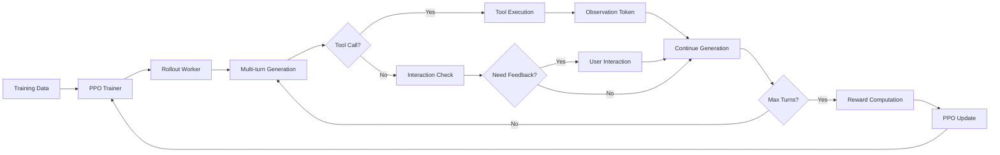
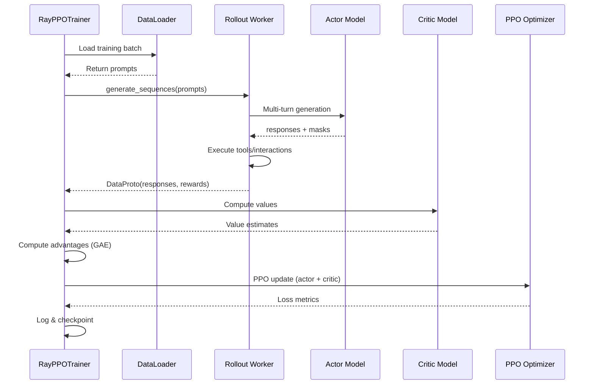

# VERL Multi-turn Agentic Training 详解

本文档详细讲解 VERL 框架中 multi-turn agentic training 的完整链路，包含所有关键步骤的代码实现细节。

## 目录
- [1. 整体架构概览](#1-整体架构概览)
- [2. 核心组件详解](#2-核心组件详解)
- [3. 训练流程链路](#3-训练流程链路)
- [4. Tool 系统](#4-tool-系统)
- [5. Interaction 系统](#5-interaction-系统)
- [6. 关键配置与扩展点](#6-关键配置与扩展点)
- [7. 复杂实现专题](#7-复杂实现专题)
- [8. 代码索引](#8-代码索引)

---

## 1. 整体架构概览

VERL 提供了两套 multi-turn agentic training 架构：

1. **SGLang Multi-turn Architecture**（生产级）：位于 `verl/workers/rollout/sglang_rollout/`
2. **Experimental AgentLoop Architecture**（实验性，更灵活）：位于 `verl/experimental/agent_loop/`

### 1.1 架构对比

```mermaid
graph TB
    subgraph "SGLang Multi-turn (Production)"
        A1[RayPPOTrainer] --> B1[SGLangRollout]
        B1 --> C1[AsyncRolloutRequest]
        C1 --> D1[SGLang Engine]
        D1 --> E1[Tool Execution]
        E1 --> F1[Reward Computation]
    end

    subgraph "AgentLoop (Experimental)"
        A2[AgentLoopManager] --> B2[ToolAgentLoop]
        B2 --> C2[AgentData State Machine]
        C2 --> D2[AsyncLLMServerManager]
        D2 --> E2[Tool/Interaction]
        E2 --> F2[State Transition]
    end

    style A1 fill:#e1f5ff
    style A2 fill:#ffe1f5
```



### 1.2 完整数据流



**关键特性：**
- 支持多轮对话（可配置最大 assistant turns 和 user turns）
- 工具调用与自然语言生成交织
- 支持 turn-level 的用户反馈
- Token-level 和 trajectory-level 奖励计算
- 多模态支持（图像、视频）

---

## 2. 核心组件详解

### 2.1 AsyncRolloutRequest - 多轮对话状态管理

**文件路径：** `verl/verl/workers/rollout/schemas.py`

这是 multi-turn 对话的核心状态容器，管理整个对话的生命周期。

#### 状态枚举定义（第 36-49 行）

```python
class FinishReasonTypeEnum(str, Enum):
    """Generation finish reason"""
    LENGTH = "length"        # 达到最大长度
    STOP = "stop"           # 遇到停止符
    TOOL_CALL = "tool_calls" # 触发工具调用

class AsyncRolloutRequestStateEnum(str, Enum):
    """Request state during multi-turn processing"""
    PENDING = "pending"           # 等待处理
    RUNNING = "running"           # 生成中
    COMPLETED = "completed"       # 已完成
    FAILED = "failed"            # 失败
    TOOL_CALLING = "tool_calling" # 工具调用中
    INTERACTING = "interacting"   # 用户交互中
```

**解释：**
- `FinishReasonTypeEnum` 决定了每一轮生成结束后的下一步动作
- `TOOL_CALL` 触发工具执行流程
- 状态机通过 `AsyncRolloutRequestStateEnum` 跟踪每个请求的处理阶段

#### 核心数据结构（第 79-131 行）

```python
@dataclass
class AsyncRolloutRequest:
    """Manages state for a single multi-turn conversation"""
    request_id: str
    messages: list[dict]  # 对话历史
    prompt_token_ids: list[int] = field(default_factory=list)

    # Multi-turn 关键状态
    state: AsyncRolloutRequestStateEnum = AsyncRolloutRequestStateEnum.PENDING
    finish_reason: FinishReasonTypeEnum | None = None
    current_turn_idx: int = 0  # 当前轮次

    # Generation tracking
    sampling_params: dict = field(default_factory=dict)
    generated_token_ids: list[int] = field(default_factory=list)
    generated_text: str = ""

    # Tool/Interaction metadata
    tool_call_count: int = 0
    interaction_count: int = 0
```

**解释：**
- `messages` 存储完整的对话历史（OpenAI 格式）
- `current_turn_idx` 跟踪当前是第几轮对话
- `tool_call_count` 和 `interaction_count` 用于统计和限制

#### 消息管理方法（第 233-278 行）

```python
def add_assistant_message(self, content: str, tool_calls: list[dict] | None = None):
    """Add assistant's response to conversation history"""
    message = {"role": "assistant", "content": content}
    if tool_calls:
        message["tool_calls"] = tool_calls
    self.messages.append(message)

def add_tool_message(self, tool_call_id: str, content: str):
    """Add tool execution result"""
    self.messages.append({
        "role": "tool",
        "tool_call_id": tool_call_id,
        "content": content
    })

def add_user_message(self, content: str):
    """Add user feedback/interaction"""
    self.messages.append({
        "role": "user",
        "content": content
    })
```

**解释：**
- 这三个方法构成了对话历史的核心操作
- `tool_calls` 遵循 OpenAI 的工具调用格式
- 消息添加后会自动触发 token 重新编码（见下一节）

#### Tokenization 管理（第 356-423 行）

```python
def update_prompt_token_ids(self, tokenizer, processor=None):
    """Re-tokenize messages after adding new content"""
    if processor is not None and self.images:
        # Multi-modal path
        prompt = processor.apply_chat_template(
            self.messages,
            tokenize=False,
            add_generation_prompt=True
        )
        inputs = processor(
            text=prompt,
            images=self.images,
            videos=self.videos,
            return_tensors="pt"
        )
        self.prompt_token_ids = inputs["input_ids"][0].tolist()
        self.image_inputs = {k: v for k, v in inputs.items()
                            if k != "input_ids"}
    else:
        # Text-only path
        self.prompt_token_ids = tokenizer.apply_chat_template(
            self.messages,
            add_generation_prompt=True,
            tokenize=True
        )
```

**解释：**
- 每次添加消息后，必须重新 tokenize 整个对话历史
- 多模态路径使用 `processor`，纯文本路径使用 `tokenizer`
- `add_generation_prompt=True` 添加 assistant 的起始 token

---

### 2.2 SGLangRollout - 生产级多轮生成引擎

**文件路径：** `verl/verl/workers/rollout/sglang_rollout/sglang_rollout.py`

这是实际执行 multi-turn generation 的核心组件，与 SGLang 推理引擎深度集成。

#### 入口方法（第 559-584 行）

```python
def generate_sequences(self, prompts: DataProto, **kwargs) -> DataProto:
    """Generate sequences for a batch of prompts.

    Multi-turn 情况下的 response 结构：
    responses:     |<- LLM gen ->|<- tool_calls ->|<- LLM gen ->|<- pad ->|
    response_mask: | 1, 1, ..., 1 | 0, 0, ..., 0  | 1, 1, ..., 1| 0, ... 0|

    Args:
        prompts: DataProto containing conversation data

    Returns:
        DataProto with generated sequences, masks, and metadata
    """
    if self.config.multi_turn.enable:
        return self._req_level_generate_sequences(prompts, **kwargs)
    else:
        return self._batch_level_generate_sequences(prompts, **kwargs)
```

**解释：**
- `response_mask` 区分 LLM 生成的 token（mask=1）和工具调用/观测 token（mask=0）
- Multi-turn 模式下使用 request-level 处理（每个对话独立管理）
- Single-turn 模式下使用 batch-level 处理（更高效）

#### Request-level 生成主循环（第 586-689 行）

```python
def _req_level_generate_sequences(self, prompts: DataProto, **kwargs) -> DataProto:
    """Process each conversation independently with async execution"""

    # 1. 创建 AsyncRolloutRequest 对象
    requests: list[AsyncRolloutRequest] = []
    for i in range(len(prompts)):
        req = AsyncRolloutRequest(
            request_id=f"req_{i}",
            messages=prompts.batch['messages'][i],
            images=prompts.batch.get('images', [None] * len(prompts))[i],
            videos=prompts.batch.get('videos', [None] * len(prompts))[i],
            data_source=prompts.meta_info['data_source'][i],
            ground_truth=prompts.non_tensor_batch.get('ground_truth', [None] * len(prompts))[i],
            sampling_params=self._get_sampling_params(**kwargs)
        )
        requests.append(req)

    # 2. 异步执行所有 requests
    loop = asyncio.get_event_loop()
    results = loop.run_until_complete(
        asyncio.gather(*[
            self._async_rollout_a_request(req) for req in requests
        ])
    )

    # 3. 聚合结果
    return self._aggregate_results(results, prompts.meta_info)
```

**解释：**
- 每个对话创建独立的 `AsyncRolloutRequest`
- 使用 `asyncio.gather` 并发执行多个对话的生成
- 最后将结果聚合成统一的 `DataProto` 格式

#### 单个 Request 的异步处理（第 691-897 行）

```python
async def _async_rollout_a_request(
    self,
    request: AsyncRolloutRequest
) -> AsyncRolloutRequest:
    """Execute multi-turn generation for a single conversation"""

    assistant_turn_count = 0
    user_turn_count = 0

    while assistant_turn_count < self.config.multi_turn.max_assistant_turns:
        # Step 1: Update tokenization
        request.update_prompt_token_ids(self.tokenizer, self.processor)

        # Step 2: Generate from LLM
        request.state = AsyncRolloutRequestStateEnum.RUNNING
        gen_output = await self._generate_once(request)

        # Step 3: Parse output (text + potential tool calls)
        assistant_message, tool_calls = self._parse_generation(gen_output)
        request.add_assistant_message(assistant_message, tool_calls)
        assistant_turn_count += 1

        # Step 4: Check finish reason
        if gen_output.finish_reason == FinishReasonTypeEnum.STOP:
            request.state = AsyncRolloutRequestStateEnum.COMPLETED
            break
        elif gen_output.finish_reason == FinishReasonTypeEnum.TOOL_CALL:
            # Step 5: Execute tools
            request.state = AsyncRolloutRequestStateEnum.TOOL_CALLING
            for tool_call in tool_calls:
                result = await self._execute_tool(
                    tool_call,
                    request.request_id
                )
                request.add_tool_message(tool_call['id'], result)
            # Continue to next turn
            continue

        # Step 6: Check if interaction needed
        if self._should_interact(request, user_turn_count):
            request.state = AsyncRolloutRequestStateEnum.INTERACTING
            feedback = await self._get_user_interaction(request)
            request.add_user_message(feedback)
            user_turn_count += 1
            continue
        else:
            # No more turns needed
            request.state = AsyncRolloutRequestStateEnum.COMPLETED
            break

    return request
```

**解释：**
- 外层 while 循环控制最大 assistant turns
- 每轮包含：tokenize → generate → parse → 决策（停止/工具/交互/继续）
- Tool call 后自动继续下一轮，不增加 user_turn_count
- Interaction 后增加 user_turn_count 并继续

#### LLM 生成核心（第 1145-1267 行）

```python
async def _generate_once(self, request: AsyncRolloutRequest):
    """Single generation step via SGLang engine"""

    # 1. 构造 SGLang 请求
    if request.image_inputs:
        # Multi-modal generation
        sglang_request = {
            "input_ids": request.prompt_token_ids,
            "image_data": request.image_inputs.get("pixel_values"),
            "sampling_params": request.sampling_params
        }
    else:
        # Text-only generation
        sglang_request = {
            "input_ids": request.prompt_token_ids,
            "sampling_params": request.sampling_params
        }

    # 2. 调用 SGLang 引擎
    response = await self.engine.async_generate(sglang_request)

    # 3. 解析生成结果
    generated_ids = response["output_ids"]
    generated_text = self.tokenizer.decode(
        generated_ids,
        skip_special_tokens=True
    )

    # 4. 检测 finish reason
    finish_reason = self._detect_finish_reason(
        generated_text,
        generated_ids,
        request.sampling_params.get("max_new_tokens")
    )

    # 5. 更新 request 状态
    request.generated_token_ids.extend(generated_ids)
    request.generated_text += generated_text
    request.finish_reason = finish_reason

    return response
```

**解释：**
- SGLang 引擎负责实际的推理计算
- 多模态数据通过 `pixel_values` 传入
- `finish_reason` 的检测至关重要，决定下一步流程

#### Tool Call 检测与解析（第 1345-1456 行）

```python
def _detect_finish_reason(
    self,
    generated_text: str,
    generated_ids: list[int],
    max_new_tokens: int
) -> FinishReasonTypeEnum:
    """Determine why generation stopped"""

    # 1. Check for tool call pattern
    # 支持多种格式：函数调用、JSON、XML 等
    tool_call_patterns = [
        r'<tool_call>.*?</tool_call>',  # XML format
        r'```python\n.*?```',            # Code block
        r'\{"name":\s*".*?".*?\}',      # JSON format
    ]

    for pattern in tool_call_patterns:
        if re.search(pattern, generated_text, re.DOTALL):
            return FinishReasonTypeEnum.TOOL_CALL

    # 2. Check for stop tokens
    if any(self.tokenizer.encode(stop) == generated_ids[-len(self.tokenizer.encode(stop)):]
           for stop in self.config.stop_tokens):
        return FinishReasonTypeEnum.STOP

    # 3. Check for length limit
    if len(generated_ids) >= max_new_tokens:
        return FinishReasonTypeEnum.LENGTH

    return FinishReasonTypeEnum.STOP  # Default
```

**解释：**
- 支持多种工具调用格式，适配不同的模型输出
- 检测顺序：工具调用 → 停止符 → 长度限制
- 这个函数的准确性直接影响 multi-turn 流程的正确性

#### Tool 执行（第 1458-1578 行）

```python
async def _execute_tool(
    self,
    tool_call: dict,
    instance_id: str
) -> str:
    """Execute a tool and return observation"""

    tool_name = tool_call['function']['name']
    parameters = json.loads(tool_call['function']['arguments'])

    # 1. 获取 tool 实例
    if tool_name not in self.tools:
        return f"Error: Tool '{tool_name}' not found"

    tool = self.tools[tool_name]

    # 2. 执行 tool
    try:
        response, reward, metrics = await tool.execute(
            instance_id=instance_id,
            parameters=parameters
        )

        # 3. 记录奖励和指标
        self._record_tool_reward(instance_id, tool_name, reward)
        self._record_tool_metrics(instance_id, tool_name, metrics)

        # 4. 返回观测结果
        return response.text

    except Exception as e:
        logger.error(f"Tool execution failed: {e}")
        return f"Error executing tool: {str(e)}"
```

**解释：**
- Tool 执行是异步的，支持 I/O 密集型操作
- 返回的 `response.text` 会被添加为 tool message
- 奖励和指标会在后续的奖励计算中使用

---

### 2.3 ToolAgentLoop - 实验性状态机架构

**文件路径：** `verl/verl/experimental/agent_loop/tool_agent_loop.py`

这是更加灵活和可扩展的 multi-turn 实现，使用状态机模式。

#### AgentState 状态机（第 32-41 行）

```python
class AgentState(Enum):
    """State machine for agent conversation flow"""
    PENDING = "pending"              # 初始状态
    GENERATING = "generating"         # LLM 生成中
    PROCESSING_TOOLS = "processing_tools"  # 工具处理中
    INTERACTING = "interacting"      # 用户交互中
    TERMINATED = "terminated"         # 已终止
```

**解释：**
- 明确的状态转移，便于调试和理解
- 每个状态对应一个处理函数
- 与 `AsyncRolloutRequest` 的状态枚举类似，但更细粒度

#### AgentData 状态容器（第 43-77 行）

```python
@dataclass
class AgentData:
    """Complete state for one agent conversation"""
    request_id: str
    messages: list[dict]
    state: AgentState = AgentState.PENDING

    # Generation tracking
    current_output: str = ""
    accumulated_tokens: list[int] = field(default_factory=list)

    # Multi-turn control
    assistant_turns: int = 0
    user_turns: int = 0

    # Tool/Interaction state
    pending_tool_calls: list[dict] = field(default_factory=list)
    tool_results: dict[str, Any] = field(default_factory=dict)
    interaction_score: float = 0.0

    # Metadata
    start_time: float = field(default_factory=time.time)
    turn_timestamps: list[float] = field(default_factory=list)
```

**解释：**
- 比 `AsyncRolloutRequest` 更详细的中间状态跟踪
- `pending_tool_calls` 允许批量工具调用
- `turn_timestamps` 用于性能分析

#### ToolAgentLoop 主类（第 79-134 行）

```python
@register("tool_agent")
class ToolAgentLoop(AgentLoopBase):
    """Tool-enabled multi-turn agent with state machine"""

    @classmethod
    def init_class(cls, config, tokenizer, processor, **kwargs):
        """Class-level initialization from config"""
        cls.max_user_turns = config.actor_rollout_ref.rollout.multi_turn.max_user_turns
        cls.max_assistant_turns = config.actor_rollout_ref.rollout.multi_turn.max_assistant_turns

        # Load tools from config
        tool_config_path = config.actor_rollout_ref.rollout.multi_turn.tool_config_path
        if tool_config_path:
            tool_list = initialize_tools_from_config(tool_config_path)
            cls.tools = {tool.name: tool for tool in tool_list}
        else:
            cls.tools = {}

        # Load interactions from config
        interaction_config_path = config.actor_rollout_ref.rollout.multi_turn.interaction_config_path
        if interaction_config_path:
            interaction_list = initialize_interactions_from_config(interaction_config_path)
            cls.interactions = {inter.name: inter for inter in interaction_list}
        else:
            cls.interactions = {}

        cls.tokenizer = tokenizer
        cls.processor = processor
```

**解释：**
- 使用 `@register` 装饰器注册到全局 agent loop registry
- Tools 和 interactions 从配置文件动态加载
- Class-level 初始化，所有实例共享同一套工具

#### 状态转移主循环（第 198-289 行）

```python
async def run(self, initial_messages: list[dict]) -> AgentData:
    """Execute the agent conversation with state machine"""

    # 1. Initialize agent data
    agent_data = AgentData(
        request_id=str(uuid.uuid4()),
        messages=initial_messages.copy(),
        state=AgentState.PENDING
    )

    # 2. State machine loop
    while agent_data.state != AgentState.TERMINATED:

        if agent_data.state == AgentState.PENDING:
            # Transition to generation
            agent_data.state = AgentState.GENERATING

        elif agent_data.state == AgentState.GENERATING:
            # Execute LLM generation
            await self._handle_generation(agent_data)

        elif agent_data.state == AgentState.PROCESSING_TOOLS:
            # Execute pending tools
            await self._handle_tools(agent_data)

        elif agent_data.state == AgentState.INTERACTING:
            # Get user feedback
            await self._handle_interaction(agent_data)

        # Check termination conditions
        if self._should_terminate(agent_data):
            agent_data.state = AgentState.TERMINATED

    return agent_data
```

**解释：**
- 清晰的状态机模式，每个状态有专门的处理函数
- 状态转移逻辑集中在一处，便于维护
- 终止条件检查在每次状态转移后进行

#### Generation 处理（第 291-356 行）

```python
async def _handle_generation(self, agent_data: AgentData):
    """Handle LLM generation state"""

    # 1. Check turn limit
    if agent_data.assistant_turns >= self.max_assistant_turns:
        agent_data.state = AgentState.TERMINATED
        return

    # 2. Prepare prompt
    prompt_ids = self.tokenizer.apply_chat_template(
        agent_data.messages,
        add_generation_prompt=True,
        tokenize=True
    )

    # 3. Generate
    output = await self.llm_server.generate(prompt_ids)
    generated_text = output['text']
    generated_ids = output['token_ids']

    # 4. Parse for tool calls
    tool_calls = self._extract_tool_calls(generated_text)

    # 5. Update messages
    agent_data.messages.append({
        "role": "assistant",
        "content": generated_text,
        "tool_calls": tool_calls if tool_calls else None
    })
    agent_data.assistant_turns += 1
    agent_data.accumulated_tokens.extend(generated_ids)

    # 6. Determine next state
    if tool_calls:
        agent_data.pending_tool_calls = tool_calls
        agent_data.state = AgentState.PROCESSING_TOOLS
    elif self._needs_interaction(agent_data):
        agent_data.state = AgentState.INTERACTING
    else:
        agent_data.state = AgentState.TERMINATED
```

**解释：**
- 生成前先检查 turn limit
- Tool call 检测后直接转到 PROCESSING_TOOLS 状态
- 没有工具调用时，根据配置决定是否需要交互

#### Tool 处理（第 358-421 行）

```python
async def _handle_tools(self, agent_data: AgentData):
    """Handle tool processing state"""

    # 1. Execute all pending tools concurrently
    tool_tasks = []
    for tool_call in agent_data.pending_tool_calls:
        tool_name = tool_call['function']['name']
        parameters = json.loads(tool_call['function']['arguments'])

        if tool_name in self.tools:
            task = self.tools[tool_name].execute(
                instance_id=agent_data.request_id,
                parameters=parameters
            )
            tool_tasks.append((tool_call['id'], tool_name, task))

    # 2. Gather results
    results = await asyncio.gather(*[task for _, _, task in tool_tasks])

    # 3. Process results and add tool messages
    for (call_id, tool_name, _), (response, reward, metrics) in zip(tool_tasks, results):
        # Record tool result
        agent_data.tool_results[call_id] = {
            'tool_name': tool_name,
            'response': response.text,
            'reward': reward,
            'metrics': metrics
        }

        # Add tool message
        agent_data.messages.append({
            "role": "tool",
            "tool_call_id": call_id,
            "content": response.text
        })

    # 4. Clear pending and transition to next generation
    agent_data.pending_tool_calls = []
    agent_data.state = AgentState.GENERATING
```

**解释：**
- 使用 `asyncio.gather` 并发执行多个工具
- 工具执行结果保存到 `tool_results` 供后续奖励计算使用
- 执行完成后自动返回 GENERATING 状态继续对话

#### Interaction 处理（第 423-467 行）

```python
async def _handle_interaction(self, agent_data: AgentData):
    """Handle user interaction state"""

    # 1. Check turn limit
    if agent_data.user_turns >= self.max_user_turns:
        agent_data.state = AgentState.TERMINATED
        return

    # 2. Select interaction handler
    # 根据 data_source 或配置选择对应的 interaction
    interaction_name = self._get_interaction_name(agent_data)

    if interaction_name not in self.interactions:
        # No interaction available, terminate
        agent_data.state = AgentState.TERMINATED
        return

    interaction = self.interactions[interaction_name]

    # 3. Generate interaction response
    should_terminate, response, score, metadata = await interaction.generate_response(
        instance_id=agent_data.request_id,
        messages=agent_data.messages
    )

    # 4. Add user message
    agent_data.messages.append({
        "role": "user",
        "content": response
    })
    agent_data.user_turns += 1
    agent_data.interaction_score += score

    # 5. Determine next state
    if should_terminate:
        agent_data.state = AgentState.TERMINATED
    else:
        agent_data.state = AgentState.GENERATING
```

**解释：**
- Interaction 可以选择终止对话（`should_terminate=True`）
- 每次交互返回一个分数，累加到 `interaction_score`
- 交互后通常继续生成，除非主动终止

---

## 3. 训练流程链路

### 3.1 整体训练流程



### 3.2 PPO Trainer 主循环

**文件路径：** `verl/verl/trainer/ppo/ray_trainer.py`

#### Fit 方法入口（第 920-1050 行）

```python
def fit(self, train_iterator):
    """Main PPO training loop"""

    for epoch in range(self.config.trainer.total_epochs):
        for batch_idx, batch in enumerate(train_iterator):

            # ========== Phase 1: Rollout Generation ==========
            logger.info(f"[Epoch {epoch}] Generating rollout batch {batch_idx}")

            # 1.1 Prepare generation batch
            gen_batch = self._prepare_gen_batch(batch)

            # 1.2 Generate sequences (multi-turn if enabled)
            with marked_timer("gen", self.timing_raw, color="red"):
                if not self.async_rollout_mode:
                    gen_batch_output = self.actor_rollout_wg.generate_sequences(gen_batch)
                else:
                    gen_batch_output = self.async_rollout_manager.generate_sequences(gen_batch)

            # 1.3 Post-process rollout data
            rollout_data = self._postprocess_rollout(gen_batch_output)

            # ========== Phase 2: Reward Computation ==========
            logger.info("Computing rewards")

            # 2.1 Apply reward function
            with marked_timer("reward", self.timing_raw, color="green"):
                rollout_data = self.reward_fn(rollout_data)

            # 2.2 Compute advantages using GAE
            rollout_data = self._compute_advantages(rollout_data)
```

**解释：**
- Phase 1 执行 multi-turn rollout，生成对话数据
- Phase 2 计算奖励和优势估计（Advantage）
- `async_rollout_mode` 支持异步并发生成

#### PPO Update（第 1051-1235 行）

```python
            # ========== Phase 3: PPO Update ==========
            logger.info("Performing PPO updates")

            # 3.1 Prepare training data
            train_data = self._prepare_ppo_data(rollout_data)

            # 3.2 Multiple PPO epochs
            for ppo_epoch in range(self.config.trainer.ppo_epochs):

                # 3.3 Mini-batch updates
                for mini_batch in self._split_into_minibatches(train_data):

                    # 3.3.1 Compute actor loss
                    actor_output = self.actor_model(
                        input_ids=mini_batch['input_ids'],
                        attention_mask=mini_batch['attention_mask']
                    )
                    logprobs = self._compute_logprobs(actor_output, mini_batch)

                    ratio = torch.exp(logprobs - mini_batch['old_logprobs'])
                    surr1 = ratio * mini_batch['advantages']
                    surr2 = torch.clamp(
                        ratio,
                        1.0 - self.config.trainer.cliprange,
                        1.0 + self.config.trainer.cliprange
                    ) * mini_batch['advantages']
                    actor_loss = -torch.min(surr1, surr2).mean()

                    # 3.3.2 Compute critic loss
                    critic_output = self.critic_model(
                        input_ids=mini_batch['input_ids'],
                        attention_mask=mini_batch['attention_mask']
                    )
                    values = critic_output.values
                    value_loss = F.mse_loss(values, mini_batch['returns'])

                    # 3.3.3 Backward and optimize
                    total_loss = actor_loss + self.config.trainer.vf_coef * value_loss
                    total_loss.backward()
                    self.optimizer.step()
                    self.optimizer.zero_grad()

            # ========== Phase 4: Logging & Checkpointing ==========
            self._log_metrics(epoch, batch_idx, rollout_data, actor_loss, value_loss)

            if (batch_idx + 1) % self.config.trainer.save_freq == 0:
                self._save_checkpoint(epoch, batch_idx)
```

**解释：**
- PPO 的核心是 clipped surrogate objective
- Actor loss 使用 importance sampling ratio 的裁剪版本
- Critic loss 是简单的 MSE
- 每个 rollout batch 会进行多轮 mini-batch updates

### 3.3 Rollout 数据后处理

#### Response Masking（第 1237-1356 行）

```python
def _postprocess_rollout(self, gen_batch_output: DataProto) -> DataProto:
    """Post-process multi-turn rollout data"""

    # 1. Extract raw data
    responses = gen_batch_output.batch['responses']  # (B, max_seq_len)
    response_masks = gen_batch_output.batch['response_masks']  # (B, max_seq_len)

    # 2. Apply response mask
    # response_mask: 1 for LLM tokens, 0 for tool/observation tokens
    # We only compute loss on LLM-generated tokens
    valid_responses = responses * response_masks

    # 3. Compute sequence lengths
    seq_lengths = response_masks.sum(dim=1)  # (B,)

    # 4. Create position IDs for multi-turn
    # Position IDs reset at tool boundaries for better positional encoding
    position_ids = self._create_position_ids(response_masks)

    # 5. Package into DataProto
    processed_data = DataProto(
        batch={
            'responses': valid_responses,
            'response_masks': response_masks,
            'position_ids': position_ids,
            'seq_lengths': seq_lengths,
        },
        meta_info=gen_batch_output.meta_info
    )

    return processed_data
```

**解释：**
- `response_mask` 是 multi-turn 的关键：区分训练 token 和上下文 token
- 工具调用和观测结果的 token 不参与 loss 计算（mask=0）
- Position IDs 在工具边界处重置，帮助模型理解多轮结构

#### Advantage 计算（GAE）（第 1358-1467 行）

```python
def _compute_advantages(self, rollout_data: DataProto) -> DataProto:
    """Compute advantages using Generalized Advantage Estimation"""

    # 1. Get values from critic
    with torch.no_grad():
        values = self.critic_model(
            input_ids=rollout_data.batch['input_ids'],
            attention_mask=rollout_data.batch['attention_mask']
        ).values  # (B, T)

    # 2. Get rewards
    rewards = rollout_data.batch['rewards']  # (B, T)
    response_masks = rollout_data.batch['response_masks']  # (B, T)

    # 3. GAE computation
    advantages = torch.zeros_like(rewards)
    returns = torch.zeros_like(rewards)

    gamma = self.config.trainer.gamma
    lam = self.config.trainer.lam

    for b in range(rewards.shape[0]):
        # Find valid sequence length
        seq_len = int(response_masks[b].sum())

        # Backward computation of advantages
        lastgaelam = 0
        for t in reversed(range(seq_len)):
            if t == seq_len - 1:
                nextnonterminal = 0  # Last step
                nextvalues = 0
            else:
                nextnonterminal = 1
                nextvalues = values[b, t + 1]

            delta = rewards[b, t] + gamma * nextvalues * nextnonterminal - values[b, t]
            advantages[b, t] = lastgaelam = delta + gamma * lam * nextnonterminal * lastgaelam

        # Returns = advantages + values
        returns[b, :seq_len] = advantages[b, :seq_len] + values[b, :seq_len]

    # 4. Normalize advantages
    advantages = (advantages - advantages.mean()) / (advantages.std() + 1e-8)

    # 5. Add to data
    rollout_data.batch['advantages'] = advantages
    rollout_data.batch['returns'] = returns
    rollout_data.batch['values'] = values

    return rollout_data
```

**解释：**
- GAE 平衡了 bias 和 variance
- `gamma` 控制折扣因子，`lam` 控制 GAE 的权重
- Multi-turn 中每个对话的 sequence length 可能不同，需要逐个处理

---

## 4. Tool 系统

### 4.1 BaseTool 接口

**文件路径：** `verl/verl/tools/base_tool.py`

#### Tool 生命周期（第 17-91 行）

```python
class BaseTool:
    """Base class for all tools in multi-turn agent system"""

    def __init__(self, config: dict):
        """Initialize tool with configuration

        Args:
            config: Tool-specific configuration dict
        """
        self.config = config
        self.name = self.__class__.__name__
        self.instances = {}  # instance_id -> tool_state mapping

    async def create(self, instance_id: str, ground_truth: Any = None, **kwargs):
        """Create a new tool instance for a conversation.

        Called at the beginning of each rollout to initialize tool state.

        Args:
            instance_id: Unique identifier for this conversation
            ground_truth: Optional ground truth for reward computation
        """
        self.instances[instance_id] = {
            'created_at': time.time(),
            'ground_truth': ground_truth,
            'execution_count': 0,
            'state': {}  # Tool-specific state
        }

    async def execute(
        self,
        instance_id: str,
        parameters: dict[str, Any],
        **kwargs
    ) -> tuple[ToolResponse, float, dict]:
        """Execute the tool with given parameters.

        This is the main method called when LLM triggers a tool call.

        Args:
            instance_id: Conversation identifier
            parameters: Tool parameters from LLM output

        Returns:
            - ToolResponse: Observation to feed back to LLM
            - float: Immediate reward for this tool call (optional)
            - dict: Additional metrics/metadata
        """
        if instance_id not in self.instances:
            await self.create(instance_id)

        self.instances[instance_id]['execution_count'] += 1

        # Default: no-op
        return ToolResponse(text="Tool executed successfully."), 0.0, {}

    async def calc_reward(self, instance_id: str, **kwargs) -> float:
        """Calculate final reward for this conversation.

        Called at the end of rollout to compute trajectory-level reward.

        Args:
            instance_id: Conversation identifier

        Returns:
            float: Final reward score
        """
        return 0.0

    async def release(self, instance_id: str):
        """Release resources for a conversation.

        Called after rollout is complete and reward is computed.

        Args:
            instance_id: Conversation identifier
        """
        if instance_id in self.instances:
            del self.instances[instance_id]
```

**解释：**
- **create**: 每个对话开始时调用，初始化工具状态
- **execute**: LLM 触发工具调用时执行，返回观测结果
- **calc_reward**: 对话结束后计算最终奖励
- **release**: 清理资源
- `instance_id` 是对话的唯一标识，同一对话的多次工具调用共享同一个 instance

### 4.2 GSM8K Tool 实现示例

**文件路径：** `verl/verl/tools/gsm8k_tool.py`

```python
class Gsm8kTool(BaseTool):
    """Tool for GSM8K math problem solving"""

    def __init__(self, config: dict):
        super().__init__(config)
        self.name = "calc_gsm8k_reward"

    async def create(self, instance_id: str, ground_truth: Any = None, **kwargs):
        """Initialize with ground truth answer"""
        await super().create(instance_id, ground_truth, **kwargs)

        # Parse ground truth answer (e.g., "#### 42")
        if ground_truth:
            match = re.search(r'####\s*(\d+)', ground_truth)
            if match:
                self.instances[instance_id]['gt_answer'] = int(match.group(1))

    async def execute(
        self,
        instance_id: str,
        parameters: dict[str, Any],
        **kwargs
    ) -> tuple[ToolResponse, float, dict]:
        """Process model's answer and return feedback"""

        model_answer = parameters.get('answer', '')

        # Store the answer for later reward calculation
        self.instances[instance_id]['model_answer'] = model_answer

        # Return neutral feedback (don't reveal correctness yet)
        response = ToolResponse(
            text=f"Your answer '{model_answer}' has been recorded."
        )

        return response, 0.0, {'answer_submitted': True}

    async def calc_reward(self, instance_id: str, **kwargs) -> float:
        """Calculate final reward based on answer correctness"""

        instance = self.instances.get(instance_id)
        if not instance:
            return 0.0

        gt_answer = instance.get('gt_answer')
        model_answer = instance.get('model_answer')

        if gt_answer is None or model_answer is None:
            return 0.0

        # Parse model's answer
        try:
            # Extract number from model's answer
            model_num = int(re.search(r'\d+', str(model_answer)).group())

            # Binary reward: 1.0 for correct, 0.0 for incorrect
            if model_num == gt_answer:
                return 1.0
            else:
                return 0.0
        except:
            return 0.0  # Parsing failed
```

**解释：**
- `create` 时保存 ground truth
- `execute` 时只记录答案，不立即给出奖励（避免泄露信息）
- `calc_reward` 在最后计算二元奖励
- 这种设计允许模型在不知道正确性的情况下进行推理

### 4.3 Tool 配置与加载

**文件路径：** `verl/examples/sglang_multiturn/config/tool_config/gsm8k_tool_config.yaml`

```yaml
tools:
  - class_name: "verl.tools.gsm8k_tool.Gsm8kTool"
    config:
      type: native  # native or API-based
    tool_schema:
      # OpenAI function calling format
      type: "function"
      function:
        name: "calc_gsm8k_reward"
        description: "A tool for calculating the reward of gsm8k math problems"
        parameters:
          type: "object"
          properties:
            answer:
              type: "string"
              description: "The model's numerical answer to the math problem"
          required: ["answer"]
```

**解释：**
- `class_name` 指定 tool 的 Python 类路径
- `config` 传递给 tool 的 `__init__` 方法
- `tool_schema` 是 OpenAI function calling 格式，会被插入 system prompt

#### Tool 初始化代码（`verl/verl/tools/utils.py`）

```python
def initialize_tools_from_config(config_path: str) -> list[BaseTool]:
    """Load and initialize tools from YAML config"""

    with open(config_path, 'r') as f:
        config = yaml.safe_load(f)

    tools = []
    for tool_config in config.get('tools', []):
        # 1. Dynamic import
        class_name = tool_config['class_name']
        module_name, class_name = class_name.rsplit('.', 1)
        module = importlib.import_module(module_name)
        tool_class = getattr(module, class_name)

        # 2. Instantiate
        tool = tool_class(config=tool_config.get('config', {}))

        # 3. Attach schema
        tool.schema = tool_config.get('tool_schema')

        tools.append(tool)

    return tools
```

**解释：**
- 动态导入允许用户自定义 tool 而无需修改框架代码
- Tool schema 会被用于构造 system prompt，告诉模型可用的工具

### 4.4 Tool Schema 注入

**文件路径：** `verl/verl/workers/rollout/sglang_rollout/sglang_rollout.py`（第 234-312 行）

```python
def _construct_system_prompt_with_tools(self) -> str:
    """Construct system prompt including tool descriptions"""

    base_prompt = "You are a helpful AI assistant."

    if not self.tools:
        return base_prompt

    # Add tool descriptions
    tool_descriptions = []
    for tool in self.tools.values():
        if hasattr(tool, 'schema'):
            schema = tool.schema
            func_schema = schema.get('function', {})

            desc = f"""
Tool: {func_schema['name']}
Description: {func_schema['description']}
Parameters: {json.dumps(func_schema['parameters'], indent=2)}
"""
            tool_descriptions.append(desc)

    tools_section = "\n".join(tool_descriptions)

    full_prompt = f"""{base_prompt}

You have access to the following tools:

{tools_section}

To use a tool, respond with a JSON object in this format:
{{"name": "tool_name", "arguments": {{"param": "value"}}}}
"""

    return full_prompt
```

**解释：**
- System prompt 中包含所有可用工具的描述
- 指导模型如何格式化工具调用
- 这是 in-context learning 的关键

---

## 5. Interaction 系统

### 5.1 BaseInteraction 接口

**文件路径：** `verl/verl/interactions/base.py`

```python
class BaseInteraction:
    """Base class for turn-level user interactions"""

    def __init__(self, config: dict):
        """Initialize interaction handler

        Args:
            config: Interaction-specific configuration
        """
        self.config = config
        self.name = self.__class__.__name__
        self.instances = {}  # instance_id -> interaction_state

    async def create(self, instance_id: str, **kwargs):
        """Create interaction state for a conversation

        Args:
            instance_id: Conversation identifier
        """
        self.instances[instance_id] = {
            'created_at': time.time(),
            'interaction_count': 0,
            'history': []
        }

    async def generate_response(
        self,
        instance_id: str,
        messages: list[dict[str, Any]],
        **kwargs
    ) -> tuple[bool, str, float, dict[str, Any]]:
        """Generate user feedback for current conversation state.

        Called when the agent needs user interaction during rollout.

        Args:
            instance_id: Conversation identifier
            messages: Current conversation history

        Returns:
            - should_terminate_sequence (bool): Whether to end conversation
            - response_content (str): User's feedback message
            - current_turn_score (float): Score for this turn
            - additional_data (dict): Extra metadata
        """
        if instance_id not in self.instances:
            await self.create(instance_id)

        self.instances[instance_id]['interaction_count'] += 1

        # Default: positive feedback, don't terminate
        should_terminate_sequence = False
        response_content = "Your current result seems acceptable."
        current_turn_score = 0.8
        additional_data = {}

        return should_terminate_sequence, response_content, current_turn_score, additional_data

    async def release(self, instance_id: str):
        """Release resources for a conversation

        Args:
            instance_id: Conversation identifier
        """
        if instance_id in self.instances:
            del self.instances[instance_id]
```

**解释：**
- Interaction 与 Tool 类似，但语义不同：
  - Tool: 模型主动调用外部功能
  - Interaction: 系统主动请求用户反馈
- `generate_response` 返回 4 个值：
  1. 是否终止对话
  2. 用户反馈内容
  3. 当前轮次得分
  4. 额外元数据
- Turn-level score 可以用于 dense reward

### 5.2 GSM8K Interaction 实现

**文件路径：** `verl/verl/interactions/gsm8k_interaction.py`

```python
class Gsm8kInteraction(BaseInteraction):
    """Interaction for GSM8K: provide hints based on reasoning progress"""

    def __init__(self, config: dict):
        super().__init__(config)
        self.name = "gsm8k"
        self.max_hints = config.get('max_hints', 2)

    async def create(self, instance_id: str, ground_truth: Any = None, **kwargs):
        """Initialize with problem and solution"""
        await super().create(instance_id, **kwargs)
        self.instances[instance_id]['ground_truth'] = ground_truth
        self.instances[instance_id]['hints_given'] = 0

    async def generate_response(
        self,
        instance_id: str,
        messages: list[dict[str, Any]],
        **kwargs
    ) -> tuple[bool, str, float, dict[str, Any]]:
        """Provide hint or feedback based on reasoning quality"""

        instance = self.instances[instance_id]

        # Get last assistant message
        last_assistant_msg = None
        for msg in reversed(messages):
            if msg['role'] == 'assistant':
                last_assistant_msg = msg['content']
                break

        if not last_assistant_msg:
            return True, "", 0.0, {}

        # Check if max hints reached
        if instance['hints_given'] >= self.max_hints:
            return True, "", 0.0, {'reason': 'max_hints_reached'}

        # Analyze reasoning quality
        reasoning_score = self._analyze_reasoning(last_assistant_msg)

        if reasoning_score < 0.5:
            # Low quality: provide hint
            hint = self._generate_hint(instance['ground_truth'], messages)
            instance['hints_given'] += 1

            response = f"Hint: {hint}. Please reconsider your approach."
            return False, response, 0.3, {'hint_given': True}
        else:
            # Good quality: encourage to continue
            response = "Your reasoning looks good. Please continue."
            return False, response, 0.7, {'hint_given': False}

    def _analyze_reasoning(self, text: str) -> float:
        """Heuristic reasoning quality assessment"""
        score = 0.0

        # Check for key indicators
        if "let's think step by step" in text.lower():
            score += 0.3
        if any(word in text.lower() for word in ['because', 'therefore', 'thus']):
            score += 0.2
        if re.search(r'\d+\s*[+\-*/]\s*\d+', text):  # Math operations
            score += 0.3

        return min(score, 1.0)

    def _generate_hint(self, ground_truth: str, messages: list[dict]) -> str:
        """Generate contextual hint"""
        # Extract solution steps from ground truth
        # Return a relevant hint based on current progress
        return "Consider breaking the problem into smaller steps."
```

**解释：**
- Interaction 可以分析对话历史，提供智能反馈
- `hints_given` 限制交互次数，避免过度依赖
- Turn-level score 奖励高质量推理
- 可以选择终止对话（例如达到最大 hint 数）

### 5.3 Interaction 配置

**文件路径：** `verl/examples/sglang_multiturn/config/interaction_config/gsm8k_interaction_config.yaml`

```yaml
interaction:
  - name: "gsm8k"
    class_name: "verl.interactions.gsm8k_interaction.Gsm8kInteraction"
    config:
      max_hints: 2  # Maximum hints per conversation
      hint_penalty: -0.1  # Penalty for requesting hint
```

#### Interaction 加载（`verl/verl/interactions/utils.py`）

```python
def initialize_interactions_from_config(config_path: str) -> list[BaseInteraction]:
    """Load and initialize interactions from YAML config"""

    with open(config_path, 'r') as f:
        config = yaml.safe_load(f)

    interactions = []
    for inter_config in config.get('interaction', []):
        # Dynamic import
        class_name = inter_config['class_name']
        module_name, class_name = class_name.rsplit('.', 1)
        module = importlib.import_module(module_name)
        inter_class = getattr(module, class_name)

        # Instantiate
        interaction = inter_class(config=inter_config.get('config', {}))
        interaction.name = inter_config.get('name', interaction.name)

        interactions.append(interaction)

    return interactions
```

### 5.4 Interaction 触发逻辑

**文件路径：** `verl/verl/workers/rollout/sglang_rollout/sglang_rollout.py`（第 1580-1648 行）

```python
def _should_interact(
    self,
    request: AsyncRolloutRequest,
    current_user_turns: int
) -> bool:
    """Determine if interaction is needed at this point"""

    # 1. Check user turn limit
    if current_user_turns >= self.config.multi_turn.max_user_turns:
        return False

    # 2. Check interaction interval
    interaction_interval = self.config.multi_turn.get('interaction_interval', 2)
    if request.current_turn_idx % interaction_interval != 0:
        return False

    # 3. Check data source config
    data_source = request.data_source
    if data_source not in self.interactions:
        return False

    # 4. Random sampling (optional)
    interaction_prob = self.config.multi_turn.get('interaction_prob', 1.0)
    if random.random() > interaction_prob:
        return False

    return True

async def _get_user_interaction(
    self,
    request: AsyncRolloutRequest
) -> str:
    """Get user feedback via interaction handler"""

    data_source = request.data_source
    interaction = self.interactions[data_source]

    # Ensure interaction instance exists
    if request.request_id not in interaction.instances:
        await interaction.create(
            instance_id=request.request_id,
            ground_truth=request.ground_truth
        )

    # Generate response
    should_terminate, response, score, metadata = await interaction.generate_response(
        instance_id=request.request_id,
        messages=request.messages
    )

    # Record score
    request.interaction_scores.append(score)

    # Handle termination
    if should_terminate:
        request.state = AsyncRolloutRequestStateEnum.COMPLETED

    return response
```

**解释：**
- `_should_interact` 根据多个条件决定是否触发交互：
  - Turn limit
  - Interaction interval（例如每 2 轮交互一次）
  - Data source 是否有对应的 interaction handler
  - 随机采样（用于控制交互频率）
- Interaction score 被记录下来，可以用于 dense reward shaping

---

## 6. 关键配置与扩展点

### 6.1 Multi-turn 配置项

**文件路径：** `verl/examples/sglang_multiturn/config/gsm8k_multiturn_grpo.yaml`

```yaml
# ========== Data Configuration ==========
data:
  train_files: data/gsm8k/train.parquet
  val_files: data/gsm8k/test.parquet
  train_batch_size: 256
  val_batch_size: 64
  max_prompt_length: 1024
  max_response_length: 1024
  return_raw_chat: True  # Return messages in OpenAI format

# ========== Actor Rollout Configuration ==========
actor_rollout_ref:
  # Hybrid engine: actor & rollout share GPU
  hybrid_engine: True

  rollout:
    name: sglang  # Use SGLang rollout worker

    # ========== Multi-turn Configuration ==========
    multi_turn:
      enable: True
      max_assistant_turns: 5  # Maximum LLM generation turns
      max_user_turns: 2       # Maximum user interaction turns

      # Tool configuration
      tool_config_path: config/tool_config/gsm8k_tool_config.yaml

      # Interaction configuration
      interaction_config_path: config/interaction_config/gsm8k_interaction_config.yaml
      interaction_interval: 2  # Interact every 2 assistant turns
      interaction_prob: 0.8    # 80% chance to trigger interaction

    # ========== Generation Parameters ==========
    generation:
      temperature: 0.7
      top_p: 0.9
      max_new_tokens: 512
      stop_tokens: ["</s>", "<|endoftext|>"]

# ========== Trainer Configuration ==========
trainer:
  total_epochs: 10
  save_freq: 100

  # PPO hyperparameters
  ppo_epochs: 4
  mini_batch_size: 64
  cliprange: 0.2
  vf_coef: 0.5
  gamma: 0.99
  lam: 0.95

# ========== Reward Configuration ==========
reward_model:
  type: rule_based  # or "learned"

  # Token-level reward shaping
  token_reward:
    enable: True
    tool_call_bonus: 0.1     # Bonus for valid tool calls
    interaction_bonus: 0.05   # Bonus for high-quality interactions

  # Trajectory-level reward
  trajectory_reward:
    enable: True
    success_reward: 1.0
    failure_reward: 0.0
    length_penalty: -0.001   # Penalize long conversations
```

**解释：**
- `max_assistant_turns` 限制 LLM 生成轮数，防止无限循环
- `interaction_interval` 和 `interaction_prob` 控制交互频率
- `tool_config_path` 和 `interaction_config_path` 指向外部配置
- 支持 token-level 和 trajectory-level 两种奖励

### 6.2 自定义 Tool 扩展

#### Step 1: 创建 Tool 类

```python
# my_tools/calculator_tool.py
from verl.tools.base_tool import BaseTool, ToolResponse
import ast
import operator

class CalculatorTool(BaseTool):
    """Safe calculator tool for math expressions"""

    # Allowed operations
    OPERATORS = {
        ast.Add: operator.add,
        ast.Sub: operator.sub,
        ast.Mult: operator.mul,
        ast.Div: operator.truediv,
        ast.Pow: operator.pow,
    }

    async def execute(
        self,
        instance_id: str,
        parameters: dict,
        **kwargs
    ) -> tuple[ToolResponse, float, dict]:
        """Evaluate math expression"""

        expression = parameters.get('expression', '')

        try:
            # Parse and evaluate safely
            result = self._safe_eval(expression)

            response = ToolResponse(text=f"Result: {result}")
            reward = 0.1  # Small reward for successful calculation
            metrics = {'expression': expression, 'result': result}

            return response, reward, metrics

        except Exception as e:
            response = ToolResponse(text=f"Error: {str(e)}")
            return response, -0.1, {'error': str(e)}

    def _safe_eval(self, expr: str) -> float:
        """Safely evaluate math expression using AST"""
        tree = ast.parse(expr, mode='eval')
        return self._eval_node(tree.body)

    def _eval_node(self, node):
        if isinstance(node, ast.Num):
            return node.n
        elif isinstance(node, ast.BinOp):
            op_type = type(node.op)
            if op_type not in self.OPERATORS:
                raise ValueError(f"Unsupported operation: {op_type}")
            left = self._eval_node(node.left)
            right = self._eval_node(node.right)
            return self.OPERATORS[op_type](left, right)
        else:
            raise ValueError(f"Unsupported node type: {type(node)}")
```

#### Step 2: 创建配置文件

```yaml
# config/tool_config/calculator_config.yaml
tools:
  - class_name: "my_tools.calculator_tool.CalculatorTool"
    config:
      precision: 6  # Decimal places
    tool_schema:
      type: "function"
      function:
        name: "calculate"
        description: "Evaluate a mathematical expression"
        parameters:
          type: "object"
          properties:
            expression:
              type: "string"
              description: "Mathematical expression (e.g., '2 + 3 * 4')"
          required: ["expression"]
```

#### Step 3: 在训练配置中引用

```yaml
# config/my_experiment.yaml
actor_rollout_ref:
  rollout:
    multi_turn:
      enable: True
      tool_config_path: config/tool_config/calculator_config.yaml
```

**扩展点总结：**
1. 继承 `BaseTool`
2. 实现 `execute` 方法（必须）
3. 可选实现 `create`, `calc_reward`, `release`
4. 配置文件指定类路径和 schema
5. 训练配置引用配置文件

### 6.3 自定义 Interaction 扩展

#### Step 1: 创建 Interaction 类

```python
# my_interactions/code_review_interaction.py
from verl.interactions.base import BaseInteraction

class CodeReviewInteraction(BaseInteraction):
    """Provide code review feedback during generation"""

    async def generate_response(
        self,
        instance_id: str,
        messages: list[dict],
        **kwargs
    ) -> tuple[bool, str, float, dict]:
        """Review generated code and provide feedback"""

        # Extract code from last assistant message
        last_msg = messages[-1]['content']
        code = self._extract_code(last_msg)

        if not code:
            # No code to review, continue
            return False, "Please provide your code solution.", 0.0, {}

        # Perform static analysis
        issues = self._analyze_code(code)

        if not issues:
            # Code looks good, terminate
            return True, "Code looks good!", 1.0, {'issues': []}

        # Provide feedback
        feedback = "I found some issues:\n"
        for issue in issues:
            feedback += f"- {issue}\n"
        feedback += "Please revise your code."

        score = max(0.0, 1.0 - 0.2 * len(issues))

        return False, feedback, score, {'issues': issues}

    def _extract_code(self, text: str) -> str:
        """Extract code block from markdown"""
        import re
        match = re.search(r'```python\n(.*?)\n```', text, re.DOTALL)
        return match.group(1) if match else ""

    def _analyze_code(self, code: str) -> list[str]:
        """Simple static analysis"""
        issues = []

        if 'eval(' in code or 'exec(' in code:
            issues.append("Avoid using eval() or exec()")

        if 'global ' in code:
            issues.append("Avoid using global variables")

        # Add more checks...

        return issues
```

#### Step 2: 配置文件

```yaml
# config/interaction_config/code_review_config.yaml
interaction:
  - name: "code_review"
    class_name: "my_interactions.code_review_interaction.CodeReviewInteraction"
    config:
      max_reviews: 3
      strict_mode: false
```

#### Step 3: 训练配置引用

```yaml
actor_rollout_ref:
  rollout:
    multi_turn:
      interaction_config_path: config/interaction_config/code_review_config.yaml
      interaction_interval: 1  # Review after each generation
```

### 6.4 自定义 AgentLoop 扩展

**文件路径：** 参考 `verl/verl/experimental/agent_loop/tool_agent_loop.py`

#### Step 1: 继承 AgentLoopBase

```python
# my_agent_loops/custom_agent_loop.py
from verl.experimental.agent_loop.agent_loop import AgentLoopBase, register

@register("custom_agent")  # Register with a unique name
class CustomAgentLoop(AgentLoopBase):
    """Custom agent loop with special behavior"""

    @classmethod
    def init_class(cls, config, tokenizer, processor, **kwargs):
        """Class-level initialization"""
        super().init_class(config, tokenizer, processor, **kwargs)

        # Your custom initialization
        cls.custom_param = config.get('custom_param', 'default')

    async def run(self, prompts, **kwargs):
        """Main execution loop"""

        # Your custom logic here
        # Can use self.tools, self.interactions, etc.

        results = []
        for prompt in prompts:
            result = await self._process_single_prompt(prompt)
            results.append(result)

        return results

    async def _process_single_prompt(self, prompt):
        """Process a single prompt with custom logic"""
        # Your implementation
        pass
```

#### Step 2: 配置使用

```yaml
# config/custom_agent_config.yaml
actor_rollout_ref:
  agent_loop:
    name: custom_agent  # Matches @register() name
    custom_param: "value"

    tool_config_path: ...
    interaction_config_path: ...
```

**扩展点：**
- 继承 `AgentLoopBase`
- 使用 `@register(name)` 装饰器
- 实现 `run` 方法
- 可选覆盖 `init_class` 进行类级初始化

---

## 7. 复杂实现专题

### 7.1 Tokenization Sanity Check

**问题：** Multi-turn 中多次 tokenize 可能产生不一致，导致训练和推理不匹配。

**文件路径：** `verl/verl/workers/rollout/sglang_rollout/sglang_rollout.py`（第 1650-1789 行）

```python
def _verify_tokenization_consistency(
    self,
    request: AsyncRolloutRequest,
    previous_token_ids: list[int]
) -> bool:
    """Verify that re-tokenization produces consistent prefix

    When we add a new message and re-tokenize the entire conversation,
    the tokens for previous messages should remain the same.
    This is critical for:
    1. Correct position IDs
    2. Consistent training data
    3. Avoiding KV cache invalidation

    Args:
        request: Current request with updated messages
        previous_token_ids: Token IDs before adding new message

    Returns:
        bool: True if consistent, False otherwise
    """

    # Re-tokenize current messages
    current_token_ids = self.tokenizer.apply_chat_template(
        request.messages,
        add_generation_prompt=False,  # Don't add for prefix check
        tokenize=True
    )

    # Check if previous tokens are a prefix of current tokens
    if len(previous_token_ids) > len(current_token_ids):
        logger.error(
            f"Tokenization inconsistency: previous length {len(previous_token_ids)} "
            f"> current length {len(current_token_ids)}"
        )
        return False

    for i, (prev_id, curr_id) in enumerate(zip(previous_token_ids, current_token_ids)):
        if prev_id != curr_id:
            logger.error(
                f"Tokenization mismatch at position {i}: "
                f"previous={prev_id}, current={curr_id}"
            )

            # Log context for debugging
            prev_text = self.tokenizer.decode(previous_token_ids[max(0, i-5):i+5])
            curr_text = self.tokenizer.decode(current_token_ids[max(0, i-5):i+5])
            logger.error(f"Previous context: {prev_text}")
            logger.error(f"Current context: {curr_text}")

            return False

    return True
```

**解决方案：**

1. **每次添加消息前保存 token IDs**

```python
# Before adding new message
old_token_ids = request.prompt_token_ids.copy()

# Add message
request.add_tool_message(tool_call_id, result)

# Re-tokenize
request.update_prompt_token_ids(self.tokenizer, self.processor)

# Verify consistency
if not self._verify_tokenization_consistency(request, old_token_ids):
    raise RuntimeError("Tokenization inconsistency detected!")
```

2. **使用 chat template 的 continue_final_message 参数**

```python
# For continuing in the same turn (e.g., after tool result)
token_ids = self.tokenizer.apply_chat_template(
    messages,
    continue_final_message=True,  # Don't add role prefix
    tokenize=True
)
```

3. **Frozen chat template**

```python
# Ensure chat template doesn't change during training
self.tokenizer.chat_template = self._load_frozen_chat_template()
```

**关键点：**
- Tokenization 必须是确定性的和一致的
- 任何不一致都会导致训练数据损坏
- 在开发时启用这个检查，生产环境可以关闭以提升性能

### 7.2 Response Mask 生成

**问题：** 区分 LLM 生成的 token 和工具/观测 token，只在 LLM token 上计算 loss。

**文件路径：** `verl/verl/workers/rollout/sglang_rollout/sglang_rollout.py`（第 1791-1923 行）

```python
def _create_response_mask(
    self,
    request: AsyncRolloutRequest,
    all_token_ids: list[int]
) -> list[int]:
    """Create mask distinguishing LLM tokens from tool/observation tokens

    Mask structure for multi-turn:
    [prompt] [LLM_gen_1] [tool_call] [observation] [LLM_gen_2] [padding]
       0          1          0            0             1           0

    Args:
        request: Request with complete conversation
        all_token_ids: All tokens including prompt + responses

    Returns:
        list[int]: Mask of same length as all_token_ids
    """

    mask = [0] * len(all_token_ids)

    # Step 1: Identify prompt length
    prompt_length = len(request.prompt_token_ids)

    # Step 2: Iterate through messages to mark LLM-generated spans
    current_pos = prompt_length

    for msg in request.messages:
        if msg['role'] == 'assistant':
            # This is LLM generation - mark as 1

            # Tokenize this message alone
            msg_tokens = self.tokenizer.encode(msg['content'], add_special_tokens=False)
            msg_length = len(msg_tokens)

            # Mark this span
            for i in range(current_pos, current_pos + msg_length):
                if i < len(mask):
                    mask[i] = 1

            current_pos += msg_length

            # If there are tool calls, they are part of this message but not marked
            if msg.get('tool_calls'):
                tool_call_text = self._format_tool_calls(msg['tool_calls'])
                tool_call_tokens = self.tokenizer.encode(tool_call_text, add_special_tokens=False)
                current_pos += len(tool_call_tokens)

        elif msg['role'] == 'tool':
            # Tool result - mark as 0 (already default)
            tool_tokens = self.tokenizer.encode(msg['content'], add_special_tokens=False)
            current_pos += len(tool_tokens)

        elif msg['role'] == 'user':
            # User feedback from interaction - mark as 0
            user_tokens = self.tokenizer.encode(msg['content'], add_special_tokens=False)
            current_pos += len(user_tokens)

    return mask
```

**使用 response_mask：**

```python
def compute_loss(self, logits, labels, response_mask):
    """Compute loss only on LLM-generated tokens"""

    # logits: (B, T, V)
    # labels: (B, T)
    # response_mask: (B, T)

    # Shift for next-token prediction
    shift_logits = logits[:, :-1, :].contiguous()
    shift_labels = labels[:, 1:].contiguous()
    shift_mask = response_mask[:, 1:].contiguous()

    # Compute per-token loss
    loss_fct = nn.CrossEntropyLoss(reduction='none')
    loss = loss_fct(
        shift_logits.view(-1, shift_logits.size(-1)),
        shift_labels.view(-1)
    )
    loss = loss.view(shift_labels.size())

    # Apply mask
    masked_loss = loss * shift_mask

    # Average over valid tokens only
    total_loss = masked_loss.sum() / shift_mask.sum()

    return total_loss
```

**关键点：**
- Mask = 1: LLM 生成的自然语言 token
- Mask = 0: 工具调用、工具结果、用户反馈、padding
- 只在 mask=1 的位置计算 loss 和梯度

### 7.3 Multi-modal Data Handling

**问题：** 在 multi-turn 中处理图像和视频输入。

**文件路径：** `verl/verl/workers/rollout/schemas.py`（第 356-423 行）

```python
def update_prompt_token_ids(self, tokenizer, processor=None):
    """Update tokens with multi-modal support"""

    # Check if multi-modal
    has_images = self.images is not None and len(self.images) > 0
    has_videos = self.videos is not None and len(self.videos) > 0

    if processor is not None and (has_images or has_videos):
        # ========== Multi-modal Path ==========

        # 1. Apply chat template to get text prompt
        prompt_text = processor.apply_chat_template(
            self.messages,
            tokenize=False,
            add_generation_prompt=True
        )

        # 2. Process text + images + videos together
        inputs = processor(
            text=prompt_text,
            images=self.images if has_images else None,
            videos=self.videos if has_videos else None,
            return_tensors="pt",
            padding=True
        )

        # 3. Extract tokens and image/video features
        self.prompt_token_ids = inputs["input_ids"][0].tolist()

        # 4. Store image/video inputs separately for model forward
        self.image_inputs = {}
        if "pixel_values" in inputs:
            self.image_inputs["pixel_values"] = inputs["pixel_values"]
        if "video_values" in inputs:
            self.image_inputs["video_values"] = inputs["video_values"]
        if "attention_mask" in inputs:
            self.image_inputs["attention_mask"] = inputs["attention_mask"]

    else:
        # ========== Text-only Path ==========
        self.prompt_token_ids = tokenizer.apply_chat_template(
            self.messages,
            add_generation_prompt=True,
            tokenize=True
        )
        self.image_inputs = None
```

**Multi-modal Generation：**

```python
async def _generate_once(self, request: AsyncRolloutRequest):
    """Generate with multi-modal support"""

    if request.image_inputs:
        # Prepare multi-modal inputs
        model_inputs = {
            "input_ids": torch.tensor([request.prompt_token_ids]),
            **request.image_inputs  # pixel_values, etc.
        }
    else:
        # Text-only
        model_inputs = {
            "input_ids": torch.tensor([request.prompt_token_ids])
        }

    # Generate
    outputs = await self.engine.generate(**model_inputs)

    return outputs
```

**关键点：**
- 使用 `processor` 而不是 `tokenizer` 处理多模态
- 图像特征（pixel_values）与 token IDs 分开存储
- 每次 re-tokenize 时重新处理图像（确保一致性）
- 支持图像和视频同时存在

### 7.4 Reward Aggregation

**问题：** 聚合 token-level、tool-level 和 trajectory-level 的奖励。

**文件路径：** `verl/verl/trainer/ppo/reward_aggregator.py`（假设）

```python
class RewardAggregator:
    """Aggregate rewards from multiple sources in multi-turn"""

    def __init__(self, config):
        self.config = config

        # Reward weights
        self.trajectory_weight = config.get('trajectory_weight', 1.0)
        self.tool_weight = config.get('tool_weight', 0.1)
        self.interaction_weight = config.get('interaction_weight', 0.1)

    def aggregate(self, rollout_data: DataProto) -> DataProto:
        """Aggregate all reward signals"""

        batch_size, seq_len = rollout_data.batch['responses'].shape

        # Initialize token-level rewards
        token_rewards = torch.zeros(batch_size, seq_len)

        for i in range(batch_size):
            # ========== 1. Trajectory-level Reward ==========
            trajectory_reward = rollout_data.meta_info['trajectory_rewards'][i]

            # Distribute to all LLM tokens in this trajectory
            response_mask = rollout_data.batch['response_masks'][i]
            num_llm_tokens = response_mask.sum()

            if num_llm_tokens > 0:
                # Distribute evenly (or use other strategies)
                token_rewards[i] += (
                    response_mask * trajectory_reward * self.trajectory_weight / num_llm_tokens
                )

            # ========== 2. Tool-level Rewards ==========
            tool_rewards = rollout_data.meta_info.get('tool_rewards', [None] * batch_size)[i]

            if tool_rewards:
                # tool_rewards: list of (turn_idx, reward) tuples
                for turn_idx, reward in tool_rewards:
                    # Find tokens corresponding to this turn
                    turn_mask = self._get_turn_mask(i, turn_idx, rollout_data)
                    num_turn_tokens = turn_mask.sum()

                    if num_turn_tokens > 0:
                        token_rewards[i] += (
                            turn_mask * reward * self.tool_weight / num_turn_tokens
                        )

            # ========== 3. Interaction-level Rewards ==========
            interaction_rewards = rollout_data.meta_info.get('interaction_rewards', [None] * batch_size)[i]

            if interaction_rewards:
                # interaction_rewards: list of (turn_idx, score) tuples
                for turn_idx, score in interaction_rewards:
                    turn_mask = self._get_turn_mask(i, turn_idx, rollout_data)
                    num_turn_tokens = turn_mask.sum()

                    if num_turn_tokens > 0:
                        token_rewards[i] += (
                            turn_mask * score * self.interaction_weight / num_turn_tokens
                        )

        # Update rollout data
        rollout_data.batch['rewards'] = token_rewards

        return rollout_data

    def _get_turn_mask(self, batch_idx, turn_idx, rollout_data):
        """Get mask for specific turn"""
        # Implementation depends on how turn boundaries are stored
        # Could use turn_indices metadata
        pass
```

**Reward Shaping Strategies：**

1. **均匀分配（Uniform）**
   ```python
   token_rewards = trajectory_reward / num_tokens
   ```

2. **最后 token 奖励（Last-token）**
   ```python
   token_rewards[-1] = trajectory_reward
   ```

3. **指数衰减（Exponential decay）**
   ```python
   gamma = 0.99
   for t in reversed(range(num_tokens)):
       token_rewards[t] = trajectory_reward * (gamma ** (num_tokens - 1 - t))
   ```

4. **基于重要性（Importance-based）**
   ```python
   # Tool call tokens 获得更高奖励
   if is_tool_call_token:
       token_rewards[t] = trajectory_reward * 2.0 / num_tokens
   else:
       token_rewards[t] = trajectory_reward * 0.5 / num_tokens
   ```

---

## 8. 代码索引

### 8.1 核心文件清单

| 文件路径 | 行数 | 功能 | 关键类/函数 |
|---------|------|------|------------|
| `verl/verl/workers/rollout/schemas.py` | 696 | 多轮对话状态管理 | `AsyncRolloutRequest`, `FinishReasonTypeEnum` |
| `verl/verl/workers/rollout/sglang_rollout/sglang_rollout.py` | 1879 | SGLang 多轮生成引擎 | `SGLangRollout.generate_sequences()` |
| `verl/verl/experimental/agent_loop/agent_loop.py` | 884 | Agent Loop 框架 | `AgentLoopManager`, `@register()` |
| `verl/verl/experimental/agent_loop/tool_agent_loop.py` | 467 | 工具状态机实现 | `ToolAgentLoop`, `AgentState` |
| `verl/verl/trainer/ppo/ray_trainer.py` | 1235 | PPO 训练主循环 | `RayPPOTrainer.fit()` |
| `verl/verl/tools/base_tool.py` | 91 | Tool 基类 | `BaseTool.execute()` |
| `verl/verl/interactions/base.py` | 69 | Interaction 基类 | `BaseInteraction.generate_response()` |

### 8.2 配置文件清单

| 文件路径 | 功能 |
|---------|------|
| `verl/examples/sglang_multiturn/config/gsm8k_multiturn_grpo.yaml` | GSM8K 多轮训练主配置 |
| `verl/examples/sglang_multiturn/config/tool_config/gsm8k_tool_config.yaml` | GSM8K 工具配置 |
| `verl/examples/sglang_multiturn/config/interaction_config/gsm8k_interaction_config.yaml` | GSM8K 交互配置 |

### 8.3 关键方法导航

#### 多轮生成链路
```
RayPPOTrainer.fit() [ray_trainer.py:920]
  └─> actor_rollout_wg.generate_sequences() [sglang_rollout.py:559]
      └─> _req_level_generate_sequences() [sglang_rollout.py:586]
          └─> _async_rollout_a_request() [sglang_rollout.py:691]
              ├─> _generate_once() [sglang_rollout.py:1145]
              ├─> _execute_tool() [sglang_rollout.py:1458]
              └─> _get_user_interaction() [sglang_rollout.py:1580]
```

#### Tool 执行链路
```
_execute_tool() [sglang_rollout.py:1458]
  └─> tool.execute() [base_tool.py:60]
      └─> [用户自定义 Tool 实现]
  └─> tool.calc_reward() [base_tool.py:72]
```

#### Interaction 执行链路
```
_get_user_interaction() [sglang_rollout.py:1580]
  └─> interaction.generate_response() [base.py:29]
      └─> [用户自定义 Interaction 实现]
```

#### PPO 更新链路
```
RayPPOTrainer.fit() [ray_trainer.py:1051]
  ├─> _compute_advantages() [ray_trainer.py:1358]
  └─> [Mini-batch PPO updates] [ray_trainer.py:1100-1200]
      ├─> Actor loss computation
      └─> Critic loss computation
```

### 8.4 扩展点快速参考

| 扩展类型 | 基类 | 注册方式 | 配置路径参数 |
|---------|------|---------|-------------|
| Tool | `BaseTool` | YAML config | `tool_config_path` |
| Interaction | `BaseInteraction` | YAML config | `interaction_config_path` |
| AgentLoop | `AgentLoopBase` | `@register()` | `agent_loop.name` |
| RewardFunction | - | Python import | `reward_fn_path` |

---

## 总结

VERL 的 multi-turn agentic training 系统提供了：

1. **两种架构选择**：
   - 生产级 SGLang 架构（高性能）
   - 实验性 AgentLoop 架构（高灵活性）

2. **核心能力**：
   - 多轮对话管理（AsyncRolloutRequest）
   - 工具调用与执行（Tool 系统）
   - 用户交互反馈（Interaction 系统）
   - 多模态支持（图像、视频）
   - 完整的 PPO 训练流程

3. **扩展性**：
   - 插件式 Tool 系统
   - 可配置 Interaction 逻辑
   - 自定义 AgentLoop 架构
   - 灵活的 Reward Shaping

4. **关键技术**：
   - Response masking（区分训练 token）
   - Tokenization sanity check（保证一致性）
   - Reward aggregation（多源奖励聚合）
   - State machine pattern（清晰的状态转移）

**修改/扩展建议：**

- **添加新 Tool**：参考 [6.2 自定义 Tool 扩展](#62-自定义-tool-扩展)
- **添加新 Interaction**：参考 [6.3 自定义 Interaction 扩展](#63-自定义-interaction-扩展)
- **修改奖励函数**：修改 RewardAggregator 或实现自定义 reward function
- **调整多轮逻辑**：修改 `_async_rollout_a_request` 或实现自定义 AgentLoop

所有关键代码位置和扩展点已在本文档中详细标注。

---

**文档版本：** 1.0
**最后更新：** 2025-10-05
**适用 VERL 版本：** 主分支（截至文档创建日期）
