# verl并行化分片策略深度讲解

> **文档目标**: 深入讲解verl中涉及的各种并行化策略（FSDP、TP、PP、SP），包括原理、实现细节、配置方法和扩展指南，帮助开发者快速定位修改点和接入口。

**最后更新**: 2025-10-08

---

## 目录

1. [概述与架构总览](#1-概述与架构总览)
2. [FSDP (Fully Sharded Data Parallel) 详解](#2-fsdp-fully-sharded-data-parallel-详解)
3. [Megatron Tensor Parallel (TP) 详解](#3-megatron-tensor-parallel-tp-详解)
4. [Megatron Pipeline Parallel (PP) 详解](#4-megatron-pipeline-parallel-pp-详解)
5. [Sequence Parallel (SP) 详解](#5-sequence-parallel-sp-详解)
6. [混合并行策略详解](#6-混合并行策略详解)
7. [配置系统与接入点](#7-配置系统与接入点)
8. [实战案例分析](#8-实战案例分析)
9. [常见问题与调试技巧](#9-常见问题与调试技巧)

---

## 1. 概述与架构总览

### 1.1 verl并行化策略全景

verl支持多种并行化策略来高效训练和推理大规模语言模型。这些策略可以单独使用，也可以组合使用以支持超大规模模型。

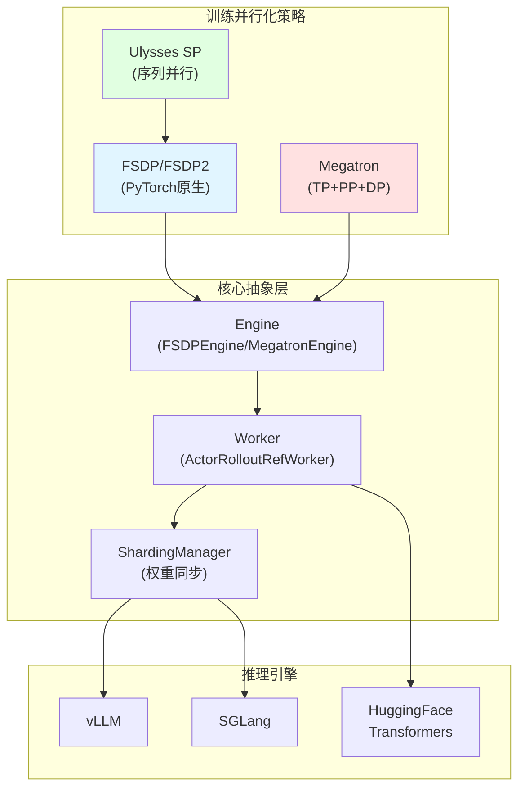
```mermaid
graph TB
    subgraph "训练并行化策略"
        FSDP["FSDP/FSDP2<br/>(PyTorch原生)"]
        Megatron["Megatron<br/>(TP+PP+DP)"]
        Ulysses["Ulysses SP<br/>(序列并行)"]
    end

    subgraph "推理引擎"
        vLLM["vLLM"]
        SGLang["SGLang"]
        HF["HuggingFace<br/>Transformers"]
    end

    subgraph "核心抽象层"
        Worker["Worker<br/>(ActorRolloutRefWorker)"]
        ShardingManager["ShardingManager<br/>(权重同步)"]
        Engine["Engine<br/>(FSDPEngine/MegatronEngine)"]
    end

    FSDP --> Engine
    Megatron --> Engine
    Ulysses --> FSDP

    Engine --> Worker
    Worker --> ShardingManager
    ShardingManager --> vLLM
    ShardingManager --> SGLang
    Worker --> HF

    style FSDP fill:#e1f5ff
    style Megatron fill:#ffe1e1
    style Ulysses fill:#e1ffe1
```

### 1.2 并行策略对比

| 并行策略 | 适用场景 | 通信开销 | 内存节省 | 支持最大模型 | 实现复杂度 |
|---------|---------|---------|---------|-------------|-----------|
| **FSDP** | 中小规模模型 | 中 | 高(Zero3) | ~70B | 低 |
| **FSDP2** | 中小规模模型 | 中 | 高(Zero3) | ~70B | 低 |
| **TP** | 大模型，低延迟 | 高 | 中 | 无限制 | 中 |
| **PP** | 超大模型 | 低 | 低 | 无限制 | 高 |
| **Ulysses SP** | 长序列场景 | 中 | 低 | - | 中 |
| **Megatron SP** | 与TP配合 | 低 | 低 | - | 低 |
| **3D并行(TP+PP+DP)** | 超大模型训练 | 高 | 低 | 671B+ | 高 |
| **FSDP+Ulysses** | 长序列+中等模型 | 中 | 高 | ~70B | 中 |

### 1.3 关键文件索引

#### FSDP相关
- **核心实现**: `verl/utils/fsdp_utils.py` - FSDP工具函数
- **Engine实现**: `verl/workers/engine/fsdp/transformer_impl.py` - FSDPEngine
- **Worker实现**: `verl/workers/fsdp_workers.py` - ActorRolloutRefWorker (FSDP版本)
- **配置定义**: `verl/workers/config/engine.py:FSDPEngineConfig`
- **Sharding Manager**: `verl/workers/sharding_manager/fsdp_vllm.py`, `fsdp_sglang.py`, `fsdp_ulysses.py`

#### Megatron相关
- **核心工具**: `verl/utils/megatron_utils.py` - Megatron工具函数
- **TP工具**: `verl/utils/megatron/tensor_parallel.py`
- **PP工具**: `verl/utils/megatron/pipeline_parallel.py`
- **SP工具**: `verl/utils/megatron/sequence_parallel.py`
- **Worker实现**: `verl/workers/megatron_workers.py`
- **配置定义**: `verl/workers/config/engine.py:McoreEngineConfig`
- **模型实现**: `verl/models/qwen2/megatron/`, `verl/models/llama/megatron/`

#### Ulysses SP相关
- **核心实现**: `verl/utils/ulysses.py`
- **Monkey Patch**: `verl/models/transformers/monkey_patch.py`
- **Sharding Manager**: `verl/workers/sharding_manager/fsdp_ulysses.py`

---

## 2. FSDP (Fully Sharded Data Parallel) 详解

### 2.1 FSDP基本原理

FSDP是PyTorch提供的原生数据并行方案，实现了Zero-3优化，将模型参数、梯度和优化器状态都分片到不同的GPU上。

#### FSDP vs DDP对比

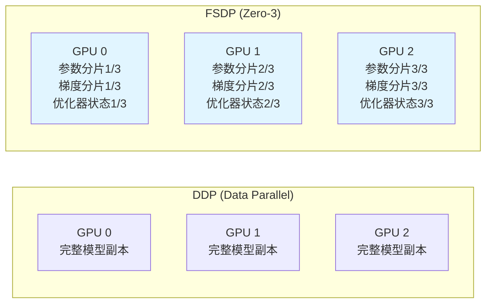
```mermaid
graph LR
    subgraph "DDP (Data Parallel)"
        DDP1["GPU 0<br/>完整模型副本"]
        DDP2["GPU 1<br/>完整模型副本"]
        DDP3["GPU 2<br/>完整模型副本"]
    end

    subgraph "FSDP (Zero-3)"
        FSDP1["GPU 0<br/>参数分片1/3<br/>梯度分片1/3<br/>优化器状态1/3"]
        FSDP2["GPU 1<br/>参数分片2/3<br/>梯度分片2/3<br/>优化器状态2/3"]
        FSDP3["GPU 2<br/>参数分片3/3<br/>梯度分片3/3<br/>优化器状态3/3"]
    end

    style FSDP1 fill:#e1f5ff
    style FSDP2 fill:#e1f5ff
    style FSDP3 fill:#e1f5ff
```

**FSDP工作流程**:
1. **前向传播**: All-gather参数 → 计算 → 释放非本地参数
2. **反向传播**: All-gather参数 → 计算梯度 → Reduce-scatter梯度 → 释放非本地参数
3. **优化器步骤**: 仅更新本地参数分片

#### FSDP1 vs FSDP2

**源码路径**: `verl/utils/fsdp_utils.py:40-47`

```python
if version.parse(torch.__version__) >= version.parse("2.6"):
    from torch.distributed.fsdp import CPUOffloadPolicy, FSDPModule, MixedPrecisionPolicy, fully_shard
    from torch.distributed.tensor import Shard
    fully_shard_module = torch.distributed.fsdp._fully_shard._fully_shard
elif version.parse(torch.__version__) >= version.parse("2.4"):
    from torch.distributed._composable.fsdp import CPUOffloadPolicy, FSDPModule, MixedPrecisionPolicy, fully_shard
    fully_shard_module = torch.distributed._composable.fsdp.fully_shard
```

**讲解**:
- **FSDP1** (PyTorch < 2.4): 使用`FullyShardedDataParallel`类包装模型，通过继承实现
- **FSDP2** (PyTorch >= 2.4): 使用`fully_shard` API，采用组合式(composable)设计，更灵活
- verl通过version checking自动选择合适的FSDP实现

**主要区别**:
| 特性 | FSDP1 | FSDP2 |
|-----|-------|-------|
| API风格 | 类包装 | 函数式 |
| State dict | 需要context manager | 使用新的API |
| CPU Offload | 通过CPUOffload类 | 通过CPUOffloadPolicy |
| 性能 | 基线 | 更优化 |

### 2.2 Device Mesh创建与Sharding策略

#### Device Mesh的概念

Device Mesh是PyTorch distributed中的核心抽象，用于描述GPU的拓扑结构。

**源码路径**: `verl/workers/engine/fsdp/utils.py:19-36`

```python
def create_device_mesh(world_size, fsdp_size):
    """
    Create a device mesh for distributed training based on the world size and FSDP size.

    Args:
        world_size (int): Total number of processes in the distributed training setup.
        fsdp_size (int): Size of the Fully Sharded Data Parallel (FSDP) group.

    Returns:
        torch.distributed.device_mesh.DeviceMesh: The initialized device mesh.
    """
    device_name = get_device_name()
    if fsdp_size < 0 or fsdp_size >= world_size:
        device_mesh = init_device_mesh(device_name, mesh_shape=(world_size,), mesh_dim_names=["fsdp"])
    else:
        device_mesh = init_device_mesh(
            device_name, mesh_shape=(world_size // fsdp_size, fsdp_size), mesh_dim_names=["ddp", "fsdp"]
        )
    return device_mesh
```

**讲解**:
1. **fsdp_size = -1 或 >= world_size**: 创建1D mesh，所有GPU都在一个FSDP组
   - `mesh_shape=(8,)` → 8个GPU全部用于FSDP
   - Sharding Strategy: `FULL_SHARD`

2. **fsdp_size < world_size**: 创建2D mesh，支持混合并行
   - `mesh_shape=(2, 4)` → 2个DDP组，每组4个GPU做FSDP
   - Sharding Strategy: `HYBRID_SHARD`

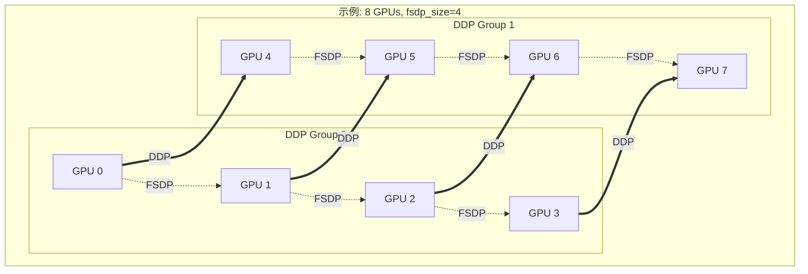
```mermaid
graph TB
    subgraph "示例: 8 GPUs, fsdp_size=4"
        subgraph "DDP Group 0"
            GPU0["GPU 0"]
            GPU1["GPU 1"]
            GPU2["GPU 2"]
            GPU3["GPU 3"]
        end
        subgraph "DDP Group 1"
            GPU4["GPU 4"]
            GPU5["GPU 5"]
            GPU6["GPU 6"]
            GPU7["GPU 7"]
        end
    end

    GPU0 -.FSDP.-> GPU1
    GPU1 -.FSDP.-> GPU2
    GPU2 -.FSDP.-> GPU3
    GPU4 -.FSDP.-> GPU5
    GPU5 -.FSDP.-> GPU6
    GPU6 -.FSDP.-> GPU7

    GPU0 ==DDP==> GPU4
    GPU1 ==DDP==> GPU5
    GPU2 ==DDP==> GPU6
    GPU3 ==DDP==> GPU7
```

#### Sharding策略选择

**源码路径**: `verl/workers/engine/fsdp/utils.py:39-57`

```python
def get_sharding_strategy(device_mesh):
    """
    Determine the appropriate sharding strategy based on the number of dimensions of the device mesh.
    """
    from torch.distributed.fsdp import ShardingStrategy

    if device_mesh.ndim == 1:
        sharding_strategy = ShardingStrategy.FULL_SHARD
    elif device_mesh.ndim == 2:
        sharding_strategy = ShardingStrategy.HYBRID_SHARD
    else:
        raise NotImplementedError(f"Get device mesh ndim={device_mesh.ndim}, but only support 1 or 2")
    return sharding_strategy
```

**讲解**:
- **FULL_SHARD**: 所有参数在所有GPU间分片，通信更多但内存最省
- **HYBRID_SHARD**: 在FSDP组内分片，DDP组间复制，平衡通信和内存

### 2.3 Wrap Policy机制

Wrap policy决定了哪些模块应该被FSDP包装，这直接影响通信粒度和内存效率。

**源码路径**: `verl/utils/fsdp_utils.py:78-152`

```python
def get_fsdp_wrap_policy(module, config=None, is_lora=False):
    """Get FSDP wrap policy for the module.

    Args:
        module: The module to get wrap policy for
        config: Configuration for wrap policy
        is_lora: Whether to enable lambda policy for LoRA modules
    """
    if config is None:
        config = {}

    def _get_attr(attr_name, default_value=None):
        if hasattr(config, "get"):
            return config.get(attr_name, default_value)
        else:
            return config.__getattribute__(attr_name)

    if _get_attr("disable", False):
        return None

    default_transformer_cls_names_to_wrap = getattr(module, "_no_split_modules", None)
    fsdp_transformer_layer_cls_to_wrap = _get_attr(
        "transformer_layer_cls_to_wrap", default_transformer_cls_names_to_wrap
    )
    min_num_params = _get_attr("min_num_params", 0)
    auto_wrap_policy = None

    policies = []

    from torch.distributed.fsdp.wrap import _or_policy, lambda_auto_wrap_policy

    # Add lambda policy for LoRA modules if is_lora is True
    if is_lora:
        def lambda_policy_fn(module):
            return bool(
                len(list(module.named_children())) == 0
                and getattr(module, "weight", None) is not None
                and module.weight.requires_grad
            )

        lambda_policy = functools.partial(lambda_auto_wrap_policy, lambda_fn=lambda_policy_fn)
        policies.append(lambda_policy)

    if min_num_params > 0:
        size_policy = functools.partial(size_based_auto_wrap_policy, min_num_params=min_num_params)
        policies.append(size_policy)
    elif fsdp_transformer_layer_cls_to_wrap is not None:
        transformer_cls_to_wrap = set()
        for layer_class in fsdp_transformer_layer_cls_to_wrap:
            transformer_cls = get_module_class_from_name(module, layer_class)
            if transformer_cls is None:
                raise Exception("Could not find the transformer layer class to wrap in the model.")
            else:
                transformer_cls_to_wrap.add(transformer_cls)

        transformer_policy = functools.partial(
            transformer_auto_wrap_policy,
            transformer_layer_cls=transformer_cls_to_wrap,
        )
        policies.append(transformer_policy)

    if len(policies) > 0:
        auto_wrap_policy = functools.partial(_or_policy, policies=policies)

    return auto_wrap_policy
```

**讲解**:
1. **Transformer层wrap策略** (最常用):
   - 根据`_no_split_modules`自动识别transformer block
   - 例如对于Llama: `["LlamaDecoderLayer"]`
   - 每个decoder layer被独立wrap，形成一个FSDP单元

2. **Size-based策略**:
   - 根据参数量wrap，`min_num_params`控制阈值
   - 适用于非标准结构的模型

3. **LoRA特殊处理**:
   - Lambda policy检查没有子模块、有weight且requires_grad的模块
   - 确保LoRA参数被正确wrap

**配置示例**:
```yaml
# verl/trainer/config/ppo_trainer.yaml
actor_rollout_ref:
  actor:
    fsdp_config:
      wrap_policy:
        transformer_layer_cls_to_wrap: ["LlamaDecoderLayer"]
        # 或使用size-based
        # min_num_params: 100000000  # 100M
```

### 2.4 参数Offload机制

Offload机制允许将参数和优化器状态卸载到CPU，进一步降低GPU显存占用。

#### FSDP1 Offload实现

**源码路径**: `verl/utils/fsdp_utils.py:155-174`

```python
@torch.no_grad()
def offload_fsdp_model_to_cpu(model: FSDP, empty_cache: bool = True):
    if fsdp_version(model) == 2:
        offload_fsdp2_model_to_cpu(model, empty_cache)
        return

    assert isinstance(model, FSDP)
    # lazy init FSDP model
    _lazy_init(model, model)
    assert model._is_root, "Only support root model offloading to CPU"
    for handle in model._all_handles:
        if handle._offload_params:
            continue
        flat_param = handle.flat_param
        assert (
            flat_param.data.data_ptr() == flat_param._local_shard.data_ptr()
            and id(flat_param.data) != id(flat_param._local_shard)
            and flat_param.data.size() == flat_param._local_shard.size()
        )
        handle.flat_param_to(torch.device("cpu"), non_blocking=True)
        # the following still keeps id(._local_shard) != id(.data)
        flat_param._local_shard = flat_param.data
        assert id(flat_param._local_shard) != id(flat_param.data)
    if empty_cache:
        get_torch_device().empty_cache()
```

**讲解**:
1. FSDP1使用`_all_handles`管理所有参数handle
2. 每个handle有`flat_param`（flattened参数）和`_local_shard`（本地分片）
3. Offload过程:
   - 调用`flat_param_to("cpu")`将参数移到CPU
   - 更新`_local_shard`指向CPU tensor
   - 清空GPU cache

**源码路径**: `verl/utils/fsdp_utils.py:182-195`

```python
@torch.no_grad()
def load_fsdp_model_to_gpu(model: FSDP):
    if fsdp_version(model) == 2:
        load_fsdp2_model_to_gpu(model)
        return

    assert isinstance(model, FSDP)
    # lazy init FSDP model
    _lazy_init(model, model)
    assert model._is_root, "Only support root model loading to GPU"
    device_id = get_device_id()
    for handle in model._all_handles:
        if handle._offload_params:
            continue
        flat_param = handle.flat_param
        handle.flat_param_to(torch.device(f"{get_device_name()}:{device_id}"), non_blocking=True)
        # the following still keeps id(._local_shard) != id(.data)
        flat_param._local_shard = flat_param.data
```

**讲解**: Load过程是offload的逆操作，将参数从CPU移回GPU。

#### FSDP2 Offload实现

**源码路径**: `verl/utils/fsdp_utils.py:176-180`, `196-199`

```python
@torch.no_grad()
def offload_fsdp2_model_to_cpu(model, empty_cache: bool = True):
    model.cpu()
    if empty_cache:
        get_torch_device().empty_cache()

@torch.no_grad()
def load_fsdp2_model_to_gpu(model):
    device = get_device_id()
    model.to(device)
```

**讲解**: FSDP2的offload更简洁，直接使用标准的`.cpu()`和`.to(device)`方法。

#### Optimizer Offload

**源码路径**: `verl/utils/fsdp_utils.py:202-219`

```python
@torch.no_grad()
def offload_fsdp_optimizer(optimizer):
    if not optimizer.state:
        return
    for param_group in optimizer.param_groups:
        for param in param_group["params"]:
            state = optimizer.state[param]
            for key, value in state.items():
                if isinstance(value, torch.Tensor):
                    state[key] = value.to("cpu", non_blocking=True)


@torch.no_grad()
def load_fsdp_optimizer(optimizer, device_id):
    if not optimizer.state:
        return
    for param_group in optimizer.param_groups:
        for param in param_group["params"]:
            state = optimizer.state[param]
            for key, value in state.items():
                if isinstance(value, torch.Tensor):
                    state[key] = value.to(device_id, non_blocking=True)
```

**讲解**:
- 遍历优化器state dict
- 将Adam的`exp_avg`和`exp_avg_sq`等momentum buffers移动到CPU/GPU
- 使用`non_blocking=True`异步传输提高效率

#### Offload使用场景

**源码路径**: `verl/workers/fsdp_workers.py:226-230`, `848-850`

```python
# 初始化后offload
if self._is_offload_param:
    # TODO: it seems that manual offload is slowly than FSDP offload
    self._is_offload_param = self.config.actor.fsdp_config.get("param_offload", False)
    self._is_offload_optimizer = self.config.actor.fsdp_config.get("optimizer_offload", False)

# 训练前load
if self._is_offload_param:
    load_fsdp_model_to_gpu(self.actor_module_fsdp)
if self._is_offload_optimizer:
    load_fsdp_optimizer(optimizer=self.actor_optimizer, device_id=get_device_id())
```

**使用模式**:
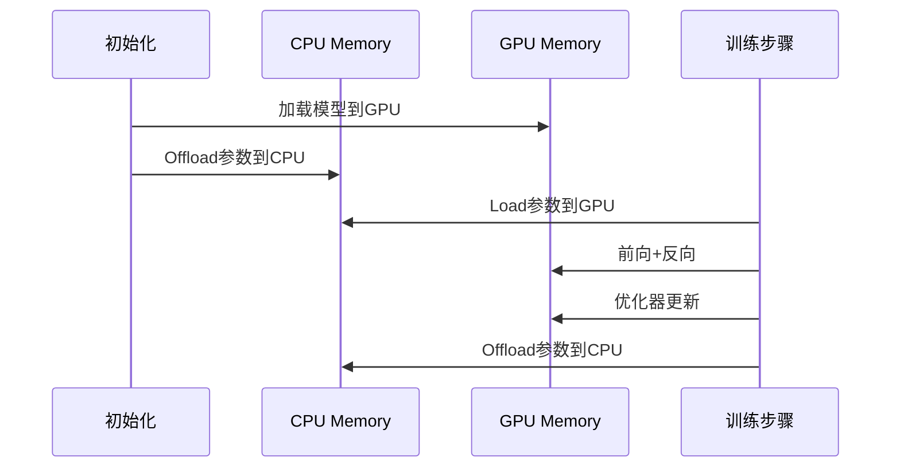
```mermaid
sequenceDiagram
    participant Init as 初始化
    participant CPU as CPU Memory
    participant GPU as GPU Memory
    participant Train as 训练步骤

    Init->>GPU: 加载模型到GPU
    Init->>CPU: Offload参数到CPU
    Train->>CPU: Load参数到GPU
    Train->>GPU: 前向+反向
    Train->>GPU: 优化器更新
    Train->>CPU: Offload参数到CPU
```

### 2.5 FSDP与推理引擎的权重同步

这是verl中非常关键的机制，用于在FSDP训练和vLLM/SGLang推理之间同步权重。

#### FSDPVLLMShardingManager

**源码路径**: `verl/workers/sharding_manager/fsdp_vllm.py:57-128`

```python
class FSDPVLLMShardingManager(BaseShardingManager):
    """Sharding manager for FSDP models with vLLM inference engine integration.

    Manages parameter synchronization between FSDP training models and vLLM
    inference engine, handling LoRA adapters and full model weight transfers.
    """

    def __init__(
        self,
        module: FSDP,
        vllm_config: VLLMConfig,
        model_hf_config: PretrainedConfig,
        model_config: HFModelConfig,
        update_mode: str,
        enable_lora: bool,
    ):
        super().__init__()
        self.module = module
        self.vllm_config = vllm_config
        self.model_hf_config = model_hf_config
        self.model_config = model_config
        self.update_mode = update_mode
        self.enable_lora = enable_lora
        # ... 省略初始化代码

    def _get_fsdp_state_dict(self, full_params=False):
        """Get state dict from FSDP model."""
        if full_params and fsdp_version(self.module) == 1:
            FSDP.set_state_dict_type(
                self.module, StateDictType.FULL_STATE_DICT, FullStateDictConfig(offload_to_cpu=True, rank0_only=True)
            )
        elif fsdp_version(self.module) == 1:
            FSDP.set_state_dict_type(
                self.module,
                StateDictType.SHARDED_STATE_DICT,
                ShardedStateDictConfig(offload_to_cpu=True),
            )
        params = self.module.state_dict()
        return params
```

**讲解**:
1. FSDP1需要设置state dict type:
   - `FULL_STATE_DICT`: 在rank 0上聚合完整参数
   - `SHARDED_STATE_DICT`: 每个rank只保存本地分片
2. FSDP2使用新的state dict API (见下面的`__enter__`方法)

**源码路径**: `verl/workers/sharding_manager/fsdp_vllm.py:128-220`

```python
@GPUMemoryLogger(role="fsdp vllm sharding_manager", logger=logger)
def __enter__(self):
    """Enter the context and prepare model weights for vLLM."""
    self._params_to_sync = OrderedDict()

    # LoRA场景的特殊处理
    if self.enable_lora:
        work with if isinstance(self.module._fsdp_wrapped_module, PeftModel)
        _is_lora = self.enable_lora and isinstance(getattr(self.module, "_fsdp_wrapped_module", None), PeftModel)
        if _is_lora:
            peft_model = getattr(self.module, "_fsdp_wrapped_module", self.module)
            if fsdp_version(self.module) > 0:
                peft_config = peft_model.peft_config
                lora_merged_or_not = peft_model.merged
                if lora_merged_or_not:
                    raise RuntimeError("LoRA weights are already merged, cannot sync separately")

                # 分层summon LoRA参数
                if self.update_mode == "lora":
                    with FSDP.summon_full_params(self.module, writeback=False):
                        for name, param in peft_model.named_parameters():
                            if "lora_" in name:
                                if fsdp_version(self.module) == 1:
                                    param_data = param.data
                                else:  # FSDP2
                                    param_data = param.full_tensor().detach().cpu()

                                # 转换参数名: _fsdp_wrapped_module.base_model.model.xxx -> base_model.model.xxx
                                name = name.replace("_fsdp_wrapped_module.", "").replace(".base_layer", "")
                                self._params_to_sync[name] = param_data

    # 非LoRA场景或base model同步
    else:
        if self._is_offload_param:
            load_fsdp_model_to_gpu(self.module)

        peft_model = getattr(self.module, "_fsdp_wrapped_module", self.module)
        params = self._get_fsdp_state_dict(full_params=False)
        params = convert_weight_keys(params, getattr(self.module, "_fsdp_wrapped_module", self.module))

        if self._is_offload_param:
            offload_fsdp_model_to_cpu(self.module)

        # vLLM需要的参数格式转换
        self._broadcast_params_to_vllm(params)

        logger.debug("fsdp vllm sharding_manager _set_allocator_settings to False")
        # 禁用vLLM的allocator以避免OOM
        set_vllm_allocator_settings(expandable_segments=False)

    return self
```

**讲解**:
1. **LoRA场景**:
   - 使用`FSDP.summon_full_params()`临时聚合完整参数
   - 只提取包含"lora_"的参数
   - 转换参数名以匹配vLLM期望的格式

2. **Full model同步**:
   - 获取state dict (可能是sharded或full)
   - 转换权重key以匹配HuggingFace格式
   - 广播参数到vLLM

3. **内存管理**:
   - 如果启用了offload，需要先load到GPU再获取state dict
   - 同步后立即offload回CPU
   - 禁用vLLM的expandable segments避免内存碎片

#### 权重格式转换

**源码路径**: `verl/utils/model.py` (convert_weight_keys函数)

```python
def convert_weight_keys(params: dict, module) -> dict:
    """Convert FSDP parameter keys to HuggingFace format.

    FSDP adds '_fsdp_wrapped_module' prefix and may have '_flat_param' for flattened params.
    We need to strip these to match HuggingFace checkpoint format.
    """
    converted_params = {}
    for name, param in params.items():
        # Remove FSDP-specific prefixes
        name = name.replace("_fsdp_wrapped_module.", "")
        name = name.replace("_flat_param.", "")
        converted_params[name] = param
    return converted_params
```

**讲解**:
- FSDP在参数名前添加`_fsdp_wrapped_module.`前缀
- Flattened参数有`_flat_param`标记
- 需要strip这些前缀才能匹配HuggingFace/vLLM的参数命名

#### 同步流程图

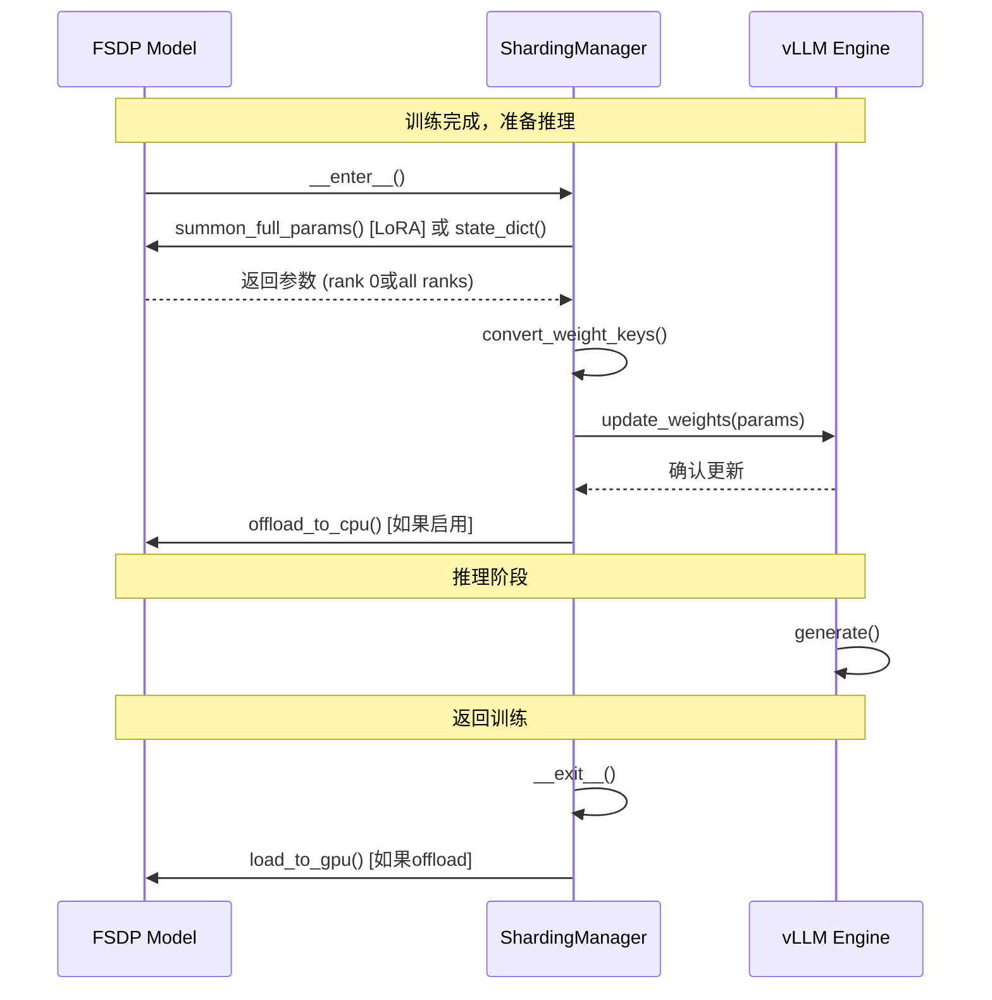
```mermaid
sequenceDiagram
    participant FSDP as FSDP Model
    participant SM as ShardingManager
    participant vLLM as vLLM Engine

    Note over FSDP,vLLM: 训练完成，准备推理

    FSDP->>SM: __enter__()
    SM->>FSDP: summon_full_params() [LoRA] 或 state_dict()
    FSDP-->>SM: 返回参数 (rank 0或all ranks)
    SM->>SM: convert_weight_keys()
    SM->>vLLM: update_weights(params)
    vLLM-->>SM: 确认更新
    SM->>FSDP: offload_to_cpu() [如果启用]

    Note over FSDP,vLLM: 推理阶段

    vLLM->>vLLM: generate()

    Note over FSDP,vLLM: 返回训练

    SM->>SM: __exit__()
    SM->>FSDP: load_to_gpu() [如果offload]
```

### 2.6 FSDP2的State Dict加载 (复杂实现详解)

FSDP2引入了新的state dict API，处理更加复杂。

**源码路径**: `verl/utils/fsdp_utils.py:559-600`

```python
def fsdp2_load_full_state_dict(model: torch.nn.Module, full_state: dict, device_mesh=None, cpu_offload=None):
    """
    Loads the full state dict (could be only on rank 0) into the sharded model. This is done by broadcasting the
    parameters from rank 0 to all other ranks. This function modifies the model in-place.

    Args:
        model (`torch.nn.Module`): The model to load the state dict into
        full_state (`dict`): The full state dict to load, can only be on rank 0
    """

    if version.parse(torch.__version__) >= version.parse("2.7.0"):
        from torch.distributed.checkpoint.state_dict import StateDictOptions, set_model_state_dict
    else:
        # official torch 2.6.0 set_model_state_dict API leads to OOM
        # use torch 2.7.0 copy from verl/third_party/torch/distributed/checkpoint
        from verl.third_party.torch.distributed.checkpoint.state_dict import StateDictOptions, set_model_state_dict

    # To broadcast, it needs to be instantiated in the GPU.
    if dist.get_rank() == 0:
        model = model.to(device=get_device_id(), non_blocking=True)
    else:
        model = model.to_empty(device=get_device_id())

    cpu_offload = cpu_offload is not None
    options = StateDictOptions(full_state_dict=True, cpu_offload=cpu_offload, broadcast_from_rank0=True)
    set_model_state_dict(model, full_state, options=options)

    # rotary_emb is not in state_dict, so we need to broadcast it manually
    for name, buf in model.named_buffers():
        dist.broadcast(buf, src=0)

    if cpu_offload:
        model.to("cpu", non_blocking=True)
        for buf in model.buffers():
            buf.data = buf.data.to(get_device_id())
```

**讲解**:

1. **版本兼容处理**:
   - PyTorch 2.6.0的官方API有OOM问题
   - verl在`third_party/torch/`下复制了2.7.0的修复版本
   - 通过version checking选择正确的实现

2. **Broadcast机制**:
   - Rank 0: 将完整state dict加载到GPU
   - Other ranks: 创建空tensor (`to_empty`)
   - `broadcast_from_rank0=True`: 自动从rank 0广播参数

3. **Buffer处理**:
   - State dict不包含non-persistent buffers (如rotary_emb)
   - 需要手动broadcast这些buffers
   - 这是个tricky的地方，容易遗漏

4. **CPU Offload**:
   - 如果启用，加载后立即移回CPU
   - 但buffers需要保留在GPU (用于计算)

**如何修改/扩展**:
- 如果遇到新的non-persistent buffer，需要在手动broadcast部分添加
- 如果要支持不同的offload策略，修改`cpu_offload`逻辑
- 配置入口: `FSDPEngineConfig.offload_policy`

---

## 3. Megatron Tensor Parallel (TP) 详解

### 3.1 TP初始化与进程组创建

Tensor Parallelism将模型的某一层在多个GPU上按张量维度切分，每个GPU持有部分参数。

#### TP进程组初始化

**源码路径**: `verl/workers/megatron_workers.py:203-217`

```python
mpu.initialize_model_parallel(
    tensor_model_parallel_size=self.config.actor.megatron.tensor_model_parallel_size,
    pipeline_model_parallel_size=self.config.actor.megatron.pipeline_model_parallel_size,
    virtual_pipeline_model_parallel_size=self.config.actor.megatron.virtual_pipeline_model_parallel_size,
    use_sharp=False,
    context_parallel_size=self.config.actor.megatron.context_parallel_size,
    expert_model_parallel_size=self.config.actor.megatron.expert_model_parallel_size,
    expert_tensor_parallel_size=self.config.actor.megatron.expert_tensor_parallel_size,
    nccl_communicator_config_path=None,
)

is_collect = (
    mpu.get_tensor_model_parallel_rank() == 0
    and mpu.get_pipeline_model_parallel_rank() == mpu.get_pipeline_model_parallel_world_size() - 1
    and mpu.get_context_parallel_rank() == 0
)
```

**讲解**:
- `tensor_model_parallel_size`: TP world size，通常设为2/4/8
- Megatron会自动创建TP进程组，分配ranks
- `is_collect`: 判断是否为收集输出的rank (TP rank 0, PP last rank)

#### TP进程组拓扑

假设有8个GPU，TP=4，PP=2:

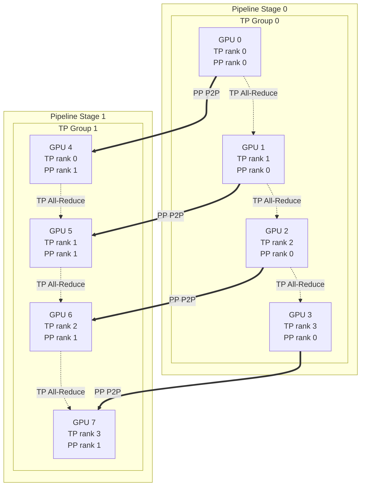
```mermaid
graph TB
    subgraph "Pipeline Stage 0"
        subgraph "TP Group 0"
            GPU0["GPU 0<br/>TP rank 0<br/>PP rank 0"]
            GPU1["GPU 1<br/>TP rank 1<br/>PP rank 0"]
            GPU2["GPU 2<br/>TP rank 2<br/>PP rank 0"]
            GPU3["GPU 3<br/>TP rank 3<br/>PP rank 0"]
        end
    end

    subgraph "Pipeline Stage 1"
        subgraph "TP Group 1"
            GPU4["GPU 4<br/>TP rank 0<br/>PP rank 1"]
            GPU5["GPU 5<br/>TP rank 1<br/>PP rank 1"]
            GPU6["GPU 6<br/>TP rank 2<br/>PP rank 1"]
            GPU7["GPU 7<br/>TP rank 3<br/>PP rank 1"]
        end
    end

    GPU0 -.TP All-Reduce.-> GPU1
    GPU1 -.TP All-Reduce.-> GPU2
    GPU2 -.TP All-Reduce.-> GPU3
    GPU4 -.TP All-Reduce.-> GPU5
    GPU5 -.TP All-Reduce.-> GPU6
    GPU6 -.TP All-Reduce.-> GPU7

    GPU0 ==PP P2P==> GPU4
    GPU1 ==PP P2P==> GPU5
    GPU2 ==PP P2P==> GPU6
    GPU3 ==PP P2P==> GPU7
```

### 3.2 张量分片原理

TP的核心是将Linear层的权重矩阵切分到不同GPU。

#### Column Parallel Linear

**原理**:
```
输入: X [batch, seq_len, hidden_size]
权重: W [hidden_size, output_size]

分片到2个GPU:
GPU 0: W[:, :output_size//2]
GPU 1: W[:, output_size//2:]

前向:
GPU 0: Y0 = X @ W0  -> [batch, seq_len, output_size//2]
GPU 1: Y1 = X @ W1  -> [batch, seq_len, output_size//2]
输出: Concat([Y0, Y1], dim=-1) -> [batch, seq_len, output_size]

反向:
dL/dW0 = X.T @ dL/dY0  (在GPU 0上)
dL/dW1 = X.T @ dL/dY1  (在GPU 1上)
dL/dX需要All-Reduce: dL/dX = dL/dY0 @ W0.T + dL/dY1 @ W1.T
```

**源码路径**: `verl/utils/megatron/tensor_parallel.py:59-77`

```python
def get_column_parallel_config():
    default_model_parallel_config = get_default_model_parallel_config()

    model_parallel_config_kwargs = get_default_kwargs_for_model_parallel_config()
    column_parallel_config_kwargs = {
        "async_tensor_model_parallel_allreduce": False,
    }
    model_parallel_config_kwargs.update(column_parallel_config_kwargs)
    return {
        "config": ModelParallelConfig(**model_parallel_config_kwargs),
        "init_method": default_init_method,
        "bias": True,
        "gather_output": False,  # 不自动gather，保持分片状态
        "skip_bias_add": False,
    }
```

#### Row Parallel Linear

**原理**:
```
输入: X [batch, seq_len, hidden_size] (已分片)
权重: W [hidden_size, output_size]

分片到2个GPU:
GPU 0: X0 [batch, seq_len, hidden_size//2], W0 [hidden_size//2, output_size]
GPU 1: X1 [batch, seq_len, hidden_size//2], W1 [hidden_size//2, output_size]

前向:
GPU 0: Y0 = X0 @ W0
GPU 1: Y1 = X1 @ W1
All-Reduce: Y = Y0 + Y1  -> [batch, seq_len, output_size]

反向:
dL/dW0 = X0.T @ dL/dY
dL/dW1 = X1.T @ dL/dY
dL/dX0 = dL/dY @ W0.T  (分片状态，不需要通信)
```

**源码路径**: `verl/utils/megatron/tensor_parallel.py:80-93`

```python
def get_row_parallel_config():
    model_parallel_config_kwargs = get_default_kwargs_for_model_parallel_config()

    return {
        "config": ModelParallelConfig(**model_parallel_config_kwargs),
        "init_method": default_init_method,
        "bias": True,
        "input_is_parallel": True,  # 输入已经是分片状态
        "skip_bias_add": False,
    }
```

### 3.3 QKV权重的Packed Layout与分片策略

这是TP中最复杂的部分之一，涉及到Attention的QKV权重如何打包和分片。

#### QKV打包格式

现代Transformer通常将Q、K、V权重合并成一个大矩阵以提高效率:

```
标准格式:
q_proj: [hidden_size, num_heads * head_dim]
k_proj: [hidden_size, num_kv_heads * head_dim]
v_proj: [hidden_size, num_kv_heads * head_dim]

Megatron打包格式 (num_heads=32, num_kv_heads=8, head_dim=128):
qkv_proj: [hidden_size, (32+8+8) * 128] = [hidden_size, 6144]

内部layout (按query group打包):
[q0, q1, q2, q3, k0, v0, q4, q5, q6, q7, k1, v1, ...]
每个group: 4个Q head + 1个K head + 1个V head
```

#### TP分片策略

**源码路径**: `verl/utils/megatron_utils.py:636-687`

```python
def convert_qkv_shard(full_tensor, q_name, k_name, v_name):
    """Convert packed QKV tensor from Megatron format to HuggingFace format with TP sharding."""
    nonlocal config
    nonlocal tp_size
    nonlocal num_query_groups

    q_shard_list = []
    k_shard_list = []
    v_shard_list = []
    hidden_size_per_head = getattr(config, "head_dim", config.hidden_size // config.num_attention_heads)

    if config.num_key_value_heads >= tp_size:
        # Case 1: KV heads >= TP size (常见情况)
        # 每个TP rank负责一部分完整的query groups
        q_size_tp = hidden_size_per_head * config.num_attention_heads // tp_size
        kv_size_tp = hidden_size_per_head * config.num_key_value_heads // tp_size
        total_size = q_size_tp + 2 * kv_size_tp

        for i in range(tp_size):
            num_query_groups_per_partition = num_query_groups // tp_size
            qkv_part = full_tensor[i * total_size : (i + 1) * total_size]
            q_size_chunk = q_size_tp // num_query_groups_per_partition
            kv_size_chunk = kv_size_tp // num_query_groups_per_partition

            # 按query group切分
            for qkv_part_chunk in qkv_part.chunk(num_query_groups_per_partition):
                q_part = qkv_part_chunk[:q_size_chunk]
                k_part = qkv_part_chunk[q_size_chunk : q_size_chunk + kv_size_chunk]
                v_part = qkv_part_chunk[q_size_chunk + kv_size_chunk :]
                q_shard_list.append(q_part)
                k_shard_list.append(k_part)
                v_shard_list.append(v_part)
    else:
        # Case 2: KV heads < TP size (GQA with few KV heads)
        # K和V在多个TP rank间复制
        q_size_tp = hidden_size_per_head * config.num_attention_heads // tp_size
        kv_size_tp = hidden_size_per_head
        total_size = q_size_tp + 2 * kv_size_tp

        for i in range(tp_size):
            num_query_groups_per_partition = num_query_groups // tp_size
            qkv_part = full_tensor[i * total_size : (i + 1) * total_size]
            q_size_chunk = q_size_tp // num_query_groups_per_partition
            kv_size_chunk = kv_size_tp // num_query_groups_per_partition

            for qkv_part_chunk in qkv_part.chunk(num_query_groups_per_partition):
                q_part = qkv_part_chunk[:q_size_chunk]
                k_part = qkv_part_chunk[q_size_chunk : q_size_chunk + kv_size_chunk]
                v_part = qkv_part_chunk[q_size_chunk + kv_size_chunk :]
                q_shard_list.append(q_part)
                # K和V只在特定TP ranks上存储
                if i * config.num_key_value_heads % tp_size == 0:
                    k_shard_list.append(k_part)
                    v_shard_list.append(v_part)

    new_params[q_name] = torch.cat(q_shard_list, dim=0)
    new_params[k_name] = torch.cat(k_shard_list, dim=0)
    new_params[v_name] = torch.cat(v_shard_list, dim=0)
```

**讲解**:

1. **Query Groups概念**:
   - Grouped Query Attention (GQA): 多个Q heads共享一个K/V head
   - `num_query_groups = num_kv_heads`
   - 每个group包含`num_heads // num_kv_heads`个Q heads

2. **Case 1: num_kv_heads >= tp_size**:
   - 例如: 32个KV heads，TP=4，每个rank负责8个KV heads
   - 每个TP rank获得完整的query groups
   - Q、K、V都被均匀分片

3. **Case 2: num_kv_heads < tp_size** (tricky!):
   - 例如: 8个KV heads，TP=32
   - Q可以分片到32个ranks
   - K和V只在8个ranks上存储，其他ranks复制
   - 条件`i * config.num_key_value_heads % tp_size == 0`确定哪些ranks存储K/V

**示例**: num_heads=32, num_kv_heads=8, TP=4

```
Query Groups: 8 groups, 每group 4个Q heads

TP Rank 0处理: Groups 0-1
  Q: heads 0-7   (8个heads)
  K: heads 0-1   (2个heads)
  V: heads 0-1   (2个heads)

TP Rank 1处理: Groups 2-3
  Q: heads 8-15
  K: heads 2-3
  V: heads 2-3

TP Rank 2处理: Groups 4-5
  Q: heads 16-23
  K: heads 4-5
  V: heads 4-5

TP Rank 3处理: Groups 6-7
  Q: heads 24-31
  K: heads 6-7
  V: heads 6-7
```

### 3.4 Gate-Up MLP权重的合并分片

MLP通常使用SwiGLU激活，需要gate和up两个projection。

**源码路径**: `verl/utils/megatron_utils.py:689-705`

```python
def convert_gate_up_shard(full_tensor, gate_name, up_name):
    """Convert merged Gate-Up tensor to separate gate and up projections."""
    nonlocal config
    nonlocal tp_size

    intermediate_size_tp = config.intermediate_size // tp_size
    gate_weight_list = []
    up_weight_list = []

    for i in range(tp_size):
        # Megatron将gate和up按[gate, up]顺序packed
        gate_up_weight_tp = full_tensor[intermediate_size_tp * 2 * i : intermediate_size_tp * 2 * (i + 1)]
        gate_weight_tp = gate_up_weight_tp[:intermediate_size_tp]
        up_weight_tp = gate_up_weight_tp[intermediate_size_tp:]
        gate_weight_list.append(gate_weight_tp)
        up_weight_list.append(up_weight_tp)

    new_params[gate_name] = torch.cat(gate_weight_list, dim=0)
    new_params[up_name] = torch.cat(up_weight_list, dim=0)
```

**讲解**:
```
标准格式:
gate_proj: [hidden_size, intermediate_size]
up_proj: [hidden_size, intermediate_size]

Megatron packed格式:
gate_up_proj: [hidden_size, 2 * intermediate_size]
Layout: [gate_weights | up_weights]

TP分片 (intermediate_size=11008, TP=4):
TP Rank 0: [0:5504]       -> gate[0:2752], up[2752:5504]
TP Rank 1: [5504:11008]   -> gate[2752:5504], up[5504:8256]
TP Rank 2: [11008:16512]  -> gate[5504:8256], up[8256:11008]
TP Rank 3: [16512:22016]  -> gate[8256:11008], up[11008:13760] ❌

实际是交错存储:
[gate_0:gate_tp, up_0:up_tp, gate_tp:gate_2tp, up_tp:up_2tp, ...]
```

### 3.5 通信原语实现

#### All-Gather操作

**源码路径**: `verl/models/qwen2/megatron/modeling_qwen2_megatron.py:209`

```python
# 在模型输出时gather所有TP ranks的logits
logits = tensor_parallel.gather_from_tensor_model_parallel_region(logits)
```

**Megatron实现** (简化版):
```python
def gather_from_tensor_model_parallel_region(input_):
    """Gather tensor from all TP ranks."""
    world_size = get_tensor_model_parallel_world_size()
    if world_size == 1:
        return input_

    # All-gather along last dimension
    output = torch.empty(
        *input_.shape[:-1], input_.shape[-1] * world_size,
        dtype=input_.dtype, device=input_.device
    )
    torch.distributed.all_gather_into_tensor(
        output, input_,
        group=get_tensor_model_parallel_group()
    )
    return output
```

#### Scatter to Sequence Parallel

**源码路径**: `verl/models/qwen2/megatron/modeling_qwen2_megatron.py:274`, `508`

```python
if self.megatron_config.sequence_parallel:
    inputs_embeds = tensor_parallel.scatter_to_sequence_parallel_region(inputs_embeds)
```

**讲解**: Sequence Parallel时，将sequence维度scatter到TP ranks，配合TP使用。详见第5章。

### 3.6 Expert Parallel (EP) for MoE

MoE模型引入了Expert Parallel来并行化不同的experts。

**源码路径**: `verl/utils/megatron_utils.py:824-870`

```python
# EP group初始化 (在per_tensor_generator中)
pp_rank = mpu.get_pipeline_model_parallel_rank()
ep_size = mpu.get_expert_model_parallel_world_size()
etp_size = mpu.get_expert_tensor_parallel_world_size()
ep_group = mpu.get_expert_model_parallel_group()
etp_group = mpu.get_expert_tensor_parallel_group()

# 处理expert参数
if ".mlp.experts.linear_fc" in cur_name and ep_size > 1:
    num_experts = weight_converter.mcore_config.num_moe_experts
    num_experts_per_rank = num_experts // ep_size
    infer_params = [torch.empty_like(broad_pp_tensor) for _ in range(ep_size)]

    # EP dimension all-gather
    torch.distributed.all_gather(infer_params, broad_pp_tensor, group=ep_group)

    # 构造全局expert IDs
    name_prefix, local_expert_id = cur_name.split(".weight")
    local_expert_id = int(local_expert_id)
    global_expert_ids = [num_experts_per_rank * ep_rank + local_expert_id for ep_rank in range(ep_size)]
    global_expert_names = [f"{name_prefix}.weight{expert_id}" for expert_id in global_expert_ids]

    for name, param in zip(global_expert_names, infer_params, strict=True):
        if etp_size > 1:
            # Expert Tensor Parallel: expert内部再做TP
            etp_params = [torch.empty_like(param) for _ in range(etp_size)]
            torch.distributed.all_gather(etp_params, param, group=etp_group)
            params = etp_params
        else:
            params = [param]

        # 合并TP维度
        merge_params = default_tp_concat_fn(...)
        converted_names, converted_params = weight_converter.convert_param(name, merge_params)
        yield from zip(converted_names, converted_params)
```

**讲解**:
1. **Expert Parallel**: 将N个experts分配到EP_SIZE个ranks
   - 例如: 64 experts, EP=8, 每个rank负责8个experts

2. **Expert Tensor Parallel**: 每个expert内部再做TP
   - 支持超大expert的场景

3. **All-Gather流程**:
   - EP维度: 收集所有ranks的experts
   - ETP维度: 收集每个expert的TP分片
   - 最终得到完整的expert参数

**拓扑示例** (64 experts, EP=8, ETP=2):
```
EP Rank 0: Experts 0-7,  每个expert TP=2
EP Rank 1: Experts 8-15, 每个expert TP=2
...
EP Rank 7: Experts 56-63, 每个expert TP=2
```

---

**如何修改/扩展TP**:
1. **添加新的并行Linear层**: 参考`ColumnParallelLinear`和`RowParallelLinear`
2. **修改QKV分片策略**: 修改`convert_qkv_shard`函数，注意GQA的特殊处理
3. **支持新的MoE架构**: 扩展EP相关代码，修改expert参数的处理逻辑
4. **配置入口**: `McoreEngineConfig.tensor_model_parallel_size`, `expert_model_parallel_size`

---

## 4. Megatron Pipeline Parallel (PP) 详解

### 4.1 PP基本原理与初始化

Pipeline Parallelism将模型的不同层分配到不同GPU，类似工厂流水线。

#### PP拓扑结构

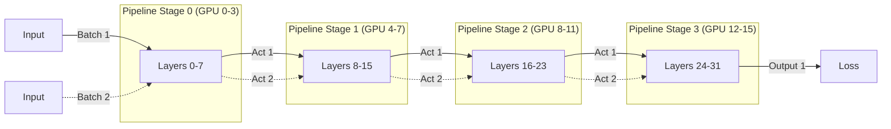
```mermaid
graph LR
    subgraph "Pipeline Stage 0 (GPU 0-3)"
        L0["Layers 0-7"]
    end
    subgraph "Pipeline Stage 1 (GPU 4-7)"
        L1["Layers 8-15"]
    end
    subgraph "Pipeline Stage 2 (GPU 8-11)"
        L2["Layers 16-23"]
    end
    subgraph "Pipeline Stage 3 (GPU 12-15)"
        L3["Layers 24-31"]
    end

    Input -->|Batch 1| L0
    L0 -->|Act 1| L1
    L1 -->|Act 1| L2
    L2 -->|Act 1| L3
    L3 -->|Output 1| Loss

    Input2[Input] -.Batch 2.-> L0
    L0 -.Act 2.-> L1
    L1 -.Act 2.-> L2
    L2 -.Act 2.-> L3
```

**源码路径**: `verl/workers/megatron_workers.py:205`

```python
mpu.initialize_model_parallel(
    tensor_model_parallel_size=self.config.actor.megatron.tensor_model_parallel_size,
    pipeline_model_parallel_size=self.config.actor.megatron.pipeline_model_parallel_size,
    virtual_pipeline_model_parallel_size=self.config.actor.megatron.virtual_pipeline_model_parallel_size,
    ...
)
```

### 4.2 Virtual Pipeline Parallel (VPP)

VPP是PP的优化版本，通过interleaving减少bubble。

#### 标准PP vs VPP


```mermaid
gantt
    title 标准PP (4 stages, 4 micro-batches)
    dateFormat X
    axisFormat %L

    section GPU 0
    F0 :0, 1
    B0 :4, 5

    section GPU 1
    F1 :1, 2
    B1 :5, 6

    section GPU 2
    F2 :2, 3
    B2 :6, 7

    section GPU 3
    F3 :3, 4
    B3 :7, 8
```


```mermaid
gantt
    title VPP (4 stages, VPP=2, 4 micro-batches)
    dateFormat X
    axisFormat %L

    section GPU 0
    F0_chunk0 :0, 1
    F0_chunk1 :1, 2
    B0_chunk1 :5, 6
    B0_chunk0 :6, 7

    section GPU 1
    F1_chunk0 :2, 3
    F1_chunk1 :3, 4
    B1_chunk1 :4, 5
    B1_chunk0 :7, 8
```

**讲解**: VPP=2时，每个GPU负责2个不连续的模型chunk，减少了等待时间（bubble）。

### 4.3 Layer Offset计算 (复杂实现详解)

这是PP实现中最复杂的部分，用于确定每个rank应该加载哪些层。

**源码路径**: `verl/utils/megatron_utils.py:972-1085`

```python
def get_transformer_layer_offset(pipeline_rank, vp_stage, config: TransformerConfig):
    """
    Get the index offset of any pipeline stage, given the level of pipelining.

    Extension to Megatron's original implementation, supports arbitrary pipeline_rank and vp_stage.
    """

    has_vp_stage = (
        inspect.signature(parallel_state.is_pipeline_first_stage).parameters.get("vp_stage", None) is not None
    )
    extra_kwargs = {} if not has_vp_stage else {"ignore_virtual": False, "vp_stage": vp_stage}

    # Handle encoder-decoder models
    if hasattr(parallel_state, "is_inside_encoder") and not parallel_state.is_inside_encoder():
        pp_decoder_start = parallel_state.get_pipeline_model_parallel_decoder_start()
        if pp_decoder_start is not None:
            pipeline_rank = pipeline_rank - pp_decoder_start

    if config.pipeline_model_parallel_size > 1:
        # Case 1: 使用pipeline_model_parallel_layout (新版Megatron)
        if hasattr(config, "pipeline_model_parallel_layout") and config.pipeline_model_parallel_layout:
            from megatron.core.transformer.enums import LayerType

            offset = config.pipeline_model_parallel_layout.get_layer_offset(
                layer_type=LayerType.decoder, vp_stage=vp_stage
            )

        # Case 2: 不均匀pipeline分布 (first/last stage有特殊层数)
        elif (
            config.num_layers_in_first_pipeline_stage is not None
            or config.num_layers_in_last_pipeline_stage is not None
        ):
            # 计算中间stages的数量
            middle_pipeline_stages = config.pipeline_model_parallel_size
            middle_pipeline_stages -= sum(
                [
                    1 if x is not None else 0
                    for x in (
                        config.num_layers_in_first_pipeline_stage,
                        config.num_layers_in_last_pipeline_stage,
                    )
                ]
            )

            # 计算各stage的层数
            num_layers_in_first_pipeline_stage = (
                0 if config.num_layers_in_first_pipeline_stage is None
                else config.num_layers_in_first_pipeline_stage
            )
            num_layers_in_last_pipeline_stage = (
                0 if config.num_layers_in_last_pipeline_stage is None
                else config.num_layers_in_last_pipeline_stage
            )

            middle_num_layers = (
                config.num_layers
                - num_layers_in_first_pipeline_stage
                - num_layers_in_last_pipeline_stage
            )

            # Case 2a: 使用VPP
            if (vp_size := config.virtual_pipeline_model_parallel_size) is not None:
                assert vp_stage is not None

                # 计算每个virtual chunk的层数
                num_layers_per_virtual_model_chunk_in_first = (
                    0 if config.num_layers_in_first_pipeline_stage is None
                    else config.num_layers_in_first_pipeline_stage // vp_size
                )
                num_layers_per_virtual_model_chunk_in_last = (
                    0 if config.num_layers_in_last_pipeline_stage is None
                    else config.num_layers_in_last_pipeline_stage // vp_size
                )
                num_layers_per_virtual_model_chunk_in_middle = middle_num_layers // vp_size

                # 总virtual chunks数
                total_virtual_chunks = (
                    num_layers_per_virtual_model_chunk_in_first
                    + num_layers_per_virtual_model_chunk_in_middle
                    + num_layers_per_virtual_model_chunk_in_last
                )

                # 计算offset
                if pipeline_rank == 0:
                    offset = vp_stage * total_virtual_chunks
                else:
                    offset = (
                        vp_stage * total_virtual_chunks
                        + num_layers_per_virtual_model_chunk_in_first
                        + (pipeline_rank - 1) * (num_layers_per_virtual_model_chunk_in_middle // middle_pipeline_stages)
                    )
            # Case 2b: 不使用VPP
            else:
                if middle_pipeline_stages > 0:
                    num_layers_per_pipeline_rank = middle_num_layers // middle_pipeline_stages
                else:
                    num_layers_per_pipeline_rank = 0

                middle_pipeline_rank = (
                    pipeline_rank if config.num_layers_in_first_pipeline_stage is None
                    else pipeline_rank - 1
                )

                if pipeline_rank == 0:
                    offset = 0
                else:
                    offset = (
                        (middle_pipeline_rank * num_layers_per_pipeline_rank)
                        + num_layers_in_first_pipeline_stage
                    )

        # Case 3: 均匀分布 (最常见)
        else:
            num_layers = config.num_layers

            # 考虑embedding和loss层
            if config.account_for_embedding_in_pipeline_split:
                num_layers += 1
            if config.account_for_loss_in_pipeline_split:
                num_layers += 1

            num_layers_per_pipeline_rank = num_layers // config.pipeline_model_parallel_size

            # Case 3a: 使用VPP
            if (vp_size := config.virtual_pipeline_model_parallel_size) is not None:
                assert vp_stage is not None

                num_layers_per_virtual_rank = num_layers_per_pipeline_rank // vp_size
                total_virtual_chunks = num_layers // vp_size
                offset = vp_stage * total_virtual_chunks + (pipeline_rank * num_layers_per_virtual_rank)

                # Embedding层的offset调整
                if config.account_for_embedding_in_pipeline_split and not parallel_state.is_pipeline_first_stage(
                    **extra_kwargs
                ):
                    offset -= 1
            # Case 3b: 不使用VPP
            else:
                offset = pipeline_rank * num_layers_per_pipeline_rank

                # Embedding层的offset调整
                if config.account_for_embedding_in_pipeline_split and not parallel_state.is_pipeline_first_stage(
                    **extra_kwargs
                ):
                    offset -= 1
    else:
        # No PP
        offset = 0

    return offset
```

**讲解**:

1. **基本思路**: 给定`pipeline_rank`和`vp_stage`，计算该rank应该从第几层开始加载

2. **复杂度来源**:
   - 支持不均匀分布（first/last stage层数不同）
   - 支持VPP (interleaved)
   - 支持Encoder-Decoder架构
   - 需要处理embedding/loss层

3. **示例计算** (32层模型，PP=4，VPP=2):

```python
# 标准均匀分布
config.num_layers = 32
config.pipeline_model_parallel_size = 4
config.virtual_pipeline_model_parallel_size = 2

# 每个PP rank: 32 // 4 = 8层
# 每个VPP chunk: 8 // 2 = 4层
# 总VPP chunks: 32 // 2 = 16

# PP rank 0, VPP stage 0: offset = 0 * 16 + 0 * 4 = 0  -> Layers 0-3
# PP rank 0, VPP stage 1: offset = 1 * 16 + 0 * 4 = 16 -> Layers 16-19
# PP rank 1, VPP stage 0: offset = 0 * 16 + 1 * 4 = 4  -> Layers 4-7
# PP rank 1, VPP stage 1: offset = 1 * 16 + 1 * 4 = 20 -> Layers 20-23
# ...
```

4. **不均匀分布示例** (40层，first=8, middle=24, last=8, PP=4):

```python
config.num_layers = 40
config.num_layers_in_first_pipeline_stage = 8
config.num_layers_in_last_pipeline_stage = 8
config.pipeline_model_parallel_size = 4

# PP rank 0: Layers 0-7 (first stage)
# PP rank 1: Layers 8-15 (middle, 24 // 2 = 12 per rank)
# PP rank 2: Layers 16-23 (middle)
# PP rank 3: Layers 24-31 (last stage) ❌ 错误！

# 实际应该是:
# PP rank 0: Layers 0-7 (8 layers)
# PP rank 1: Layers 8-19 (12 layers)
# PP rank 2: Layers 20-31 (12 layers)
# PP rank 3: Layers 32-39 (8 layers)
```

### 4.4 P2P通信机制

PP stage之间通过点对点通信传递activations和gradients。

**源码路径**: `verl/utils/megatron_utils.py:680-706`

```python
def broadcast_from_megatron_pp(tensor: torch.Tensor):
    """Broadcast tensor from one PP rank to all PP ranks."""

    # Step 1: 收集tensor metadata
    if tensor is not None:
        shape = tensor.shape
        dtype = tensor.dtype
        tensor_parallel = getattr(tensor, "tensor_model_parallel", None)
        partition_dim = getattr(tensor, "partition_dim", None)
        tensor_spec = (shape, dtype, tensor_parallel, partition_dim)
    else:
        tensor_spec = None

    # Step 2: All-gather metadata到所有PP ranks
    tensor_spec_output = [None] * mpu.get_pipeline_model_parallel_world_size()
    torch.distributed.all_gather_object(
        object_list=tensor_spec_output,
        obj=tensor_spec,
        group=mpu.get_pipeline_model_parallel_group()
    )

    # Step 3: 找到持有tensor的rank
    target_tensor_spec = None
    src_rank = None
    for rank, spec in enumerate(tensor_spec_output):
        if spec is not None:
            if target_tensor_spec is None:
                target_tensor_spec = spec
                src_rank = rank
            else:
                raise ValueError("A tensor exists on two pp ranks")

    assert target_tensor_spec is not None

    # Step 4: 创建空tensor (在non-src ranks)
    if tensor is None:
        tensor = torch.empty(
            size=target_tensor_spec[0],
            dtype=target_tensor_spec[1],
            device=get_device_id()
        )
        if target_tensor_spec[2] is not None:
            tensor.tensor_model_parallel = target_tensor_spec[2]
        if target_tensor_spec[3] is not None:
            tensor.partition_dim = target_tensor_spec[3]

    # Step 5: Broadcast tensor
    global_rank = torch.distributed.get_global_rank(
        group=mpu.get_pipeline_model_parallel_group(),
        group_rank=src_rank
    )
    torch.distributed.broadcast(
        tensor=tensor,
        src=global_rank,
        group=mpu.get_pipeline_model_parallel_group()
    )

    return tensor
```

**讲解**:

1. **Why需要metadata exchange?**
   - 不同PP ranks可能只有部分层，某些参数只存在于特定rank
   - 需要先确定哪个rank有数据，其他ranks创建相应的空tensor

2. **Tensor属性传递**:
   - `tensor_model_parallel`: 标记是否为TP分片参数
   - `partition_dim`: TP分片的维度
   - 这些属性需要在broadcast后保留，用于后续的TP操作

3. **使用场景**:
   - 权重转换时，将各PP ranks的参数聚合到推理引擎
   - Checkpoint加载时，某些参数可能只在特定PP rank

**如何修改/扩展PP**:
1. **修改layer分布**: 调整`num_layers_in_first_pipeline_stage`等配置
2. **添加custom pipeline layout**: 实现自定义的`pipeline_model_parallel_layout`
3. **优化P2P通信**: 修改Megatron的`send_forward`/`recv_forward`逻辑
4. **配置入口**: `McoreEngineConfig.pipeline_model_parallel_size`, `virtual_pipeline_model_parallel_size`

---

## 5. Sequence Parallel (SP) 详解

### 5.1 两种Sequence Parallel对比

verl支持两种Sequence Parallel实现，它们的设计理念和适用场景完全不同。

| 特性 | Megatron SP | Ulysses SP |
|------|------------|------------|
| **耦合关系** | 必须与TP配合使用 | 可独立使用或与FSDP配合 |
| **通信模式** | Scatter/Gather (单向) | All-to-All (双向) |
| **切分维度** | Sequence → TP group | Sequence → SP group，Heads → TP group |
| **适用场景** | TP已满足并行需求 | 超长序列 (>32K tokens) |
| **通信开销** | 低 (与TP复用) | 中 (额外All-to-All) |
| **实现复杂度** | 低 | 中 |

### 5.2 Megatron Sequence Parallel

Megatron SP是TP的自然延伸，将sequence维度也切分到TP group。

#### 原理图解

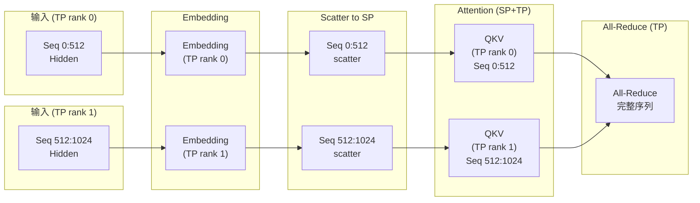
```mermaid
graph LR
    subgraph "输入 (TP rank 0)"
        Input0["Seq 0:512<br/>Hidden"]
    end
    subgraph "输入 (TP rank 1)"
        Input1["Seq 512:1024<br/>Hidden"]
    end

    subgraph "Embedding"
        E0["Embedding<br/>(TP rank 0)"]
        E1["Embedding<br/>(TP rank 1)"]
    end

    Input0 --> E0
    Input1 --> E1

    subgraph "Scatter to SP"
        S0["Seq 0:512<br/>scatter"]
        S1["Seq 512:1024<br/>scatter"]
    end

    E0 --> S0
    E1 --> S1

    subgraph "Attention (SP+TP)"
        A0["QKV<br/>(TP rank 0)<br/>Seq 0:512"]
        A1["QKV<br/>(TP rank 1)<br/>Seq 512:1024"]
    end

    S0 --> A0
    S1 --> A1

    subgraph "All-Reduce (TP)"
        AR["All-Reduce<br/>完整序列"]
    end

    A0 --> AR
    A1 --> AR
```

**源码路径**: `verl/models/qwen2/megatron/modeling_qwen2_megatron.py:273-274`, `348-349`, `399-400`

```python
# Embedding后scatter到sequence parallel region
if self.megatron_config.sequence_parallel:
    inputs_embeds = tensor_parallel.scatter_to_sequence_parallel_region(inputs_embeds)

# Attention输入padding (确保能被SP size整除)
if self.megatron_config.sequence_parallel:
    input_ids = sp_utils.pad_to_sequence_parallel(input_ids)

# LM head前gather回来
if self.megatron_config.sequence_parallel:
    logits = tensor_parallel.gather_from_sequence_parallel_region(
        logits, tensor_parallel_output_grad=False
    )
```

**源码路径**: `verl/utils/megatron/sequence_parallel.py:29-42`

```python
def pad_to_sequence_parallel(unpad_tokens: torch.Tensor):
    """
    Pad the input tokens to be divisible by TP size when using sequence parallel.
    """
    total_nnz = unpad_tokens.size(0)
    sp_world_size = mpu.get_tensor_model_parallel_world_size()

    pad_size = 0 if total_nnz % sp_world_size == 0 else sp_world_size - total_nnz % sp_world_size
    if pad_size > 0:
        pad_tokens = torch.zeros(
            (pad_size, *unpad_tokens.shape[1:]),
            dtype=unpad_tokens.dtype,
            device=unpad_tokens.device,
        )
        unpad_tokens = torch.cat([unpad_tokens, pad_tokens], dim=0)
    return unpad_tokens
```

**讲解**:

1. **为什么耦合TP?**
   - SP和TP共享同一个进程组
   - Scatter/Gather操作可以与TP的通信复用通信domain
   - 减少额外的通信组创建开销

2. **Padding必要性**:
   - 序列长度必须能被`tp_size`整除
   - 例如: 1000 tokens, TP=4, 需要pad到1004

3. **内存节省**:
   - Activation在sequence维度被切分
   - 每个rank只存储`seq_len // tp_size`的activation

#### RMSNorm的SP处理

**源码路径**: `verl/models/qwen2/megatron/layers/parallel_rmsnorm.py:38-39`

```python
if megatron_config.sequence_parallel:
    sp_utils.mark_parameter_as_sequence_parallel(self.weight)
```

**讲解**: RMSNorm的weight参数被标记为sequence parallel，Megatron会自动处理其reduce-scatter操作。

### 5.3 Ulysses Sequence Parallel

Ulysses SP是为超长序列设计的，使用All-to-All通信在sequence和head维度之间转换。

#### 核心原理: All-to-All通信

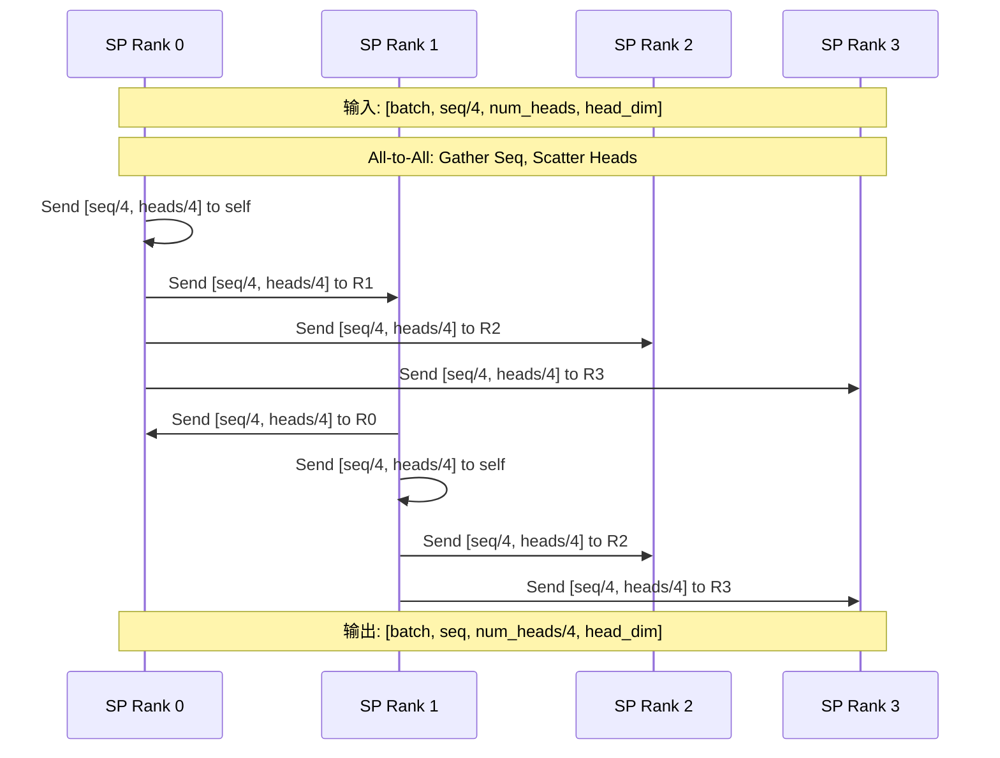
```mermaid
sequenceDiagram
    participant R0 as SP Rank 0
    participant R1 as SP Rank 1
    participant R2 as SP Rank 2
    participant R3 as SP Rank 3

    Note over R0,R3: 输入: [batch, seq/4, num_heads, head_dim]

    Note over R0,R3: All-to-All: Gather Seq, Scatter Heads

    R0->>R0: Send [seq/4, heads/4] to self
    R0->>R1: Send [seq/4, heads/4] to R1
    R0->>R2: Send [seq/4, heads/4] to R2
    R0->>R3: Send [seq/4, heads/4] to R3

    R1->>R0: Send [seq/4, heads/4] to R0
    R1->>R1: Send [seq/4, heads/4] to self
    R1->>R2: Send [seq/4, heads/4] to R2
    R1->>R3: Send [seq/4, heads/4] to R3

    Note over R0,R3: 输出: [batch, seq, num_heads/4, head_dim]
```

**源码路径**: `verl/utils/ulysses.py:145-164`

```python
def all_to_all_tensor(
    local_input: Tensor,
    scatter_dim: int,
    gather_dim: int,
    group: Optional[dist.ProcessGroup] = None,
    async_op: bool = False,
):
    """
    All-to-All communication for Ulysses SP.

    Args:
        local_input: Input tensor
        scatter_dim: Dimension to scatter (分散哪个维度)
        gather_dim: Dimension to gather (聚合哪个维度)
    """
    group = get_ulysses_sequence_parallel_group() if group is None else group
    seq_world_size = dist.get_world_size(group)

    # Split input along scatter_dim
    input_list = [t.contiguous() for t in torch.tensor_split(local_input, seq_world_size, scatter_dim)]

    # Prepare output buffers
    output_list = [torch.empty_like(input_list[0]) for _ in range(seq_world_size)]

    # All-to-All
    comm = dist.all_to_all(output_list, input_list, group=group, async_op=async_op)

    if async_op:
        def wait():
            comm.wait()
            return torch.cat(output_list, dim=gather_dim).contiguous()
        return wait

    # Concatenate along gather_dim
    return torch.cat(output_list, dim=gather_dim).contiguous()
```

**讲解**:

1. **All-to-All过程**:
   - 输入: `[batch, seq/N, heads, head_dim]` (sequence已分片)
   - Split along heads: 每个rank切成N份
   - All-to-All: rank i的第j份发送给rank j
   - Concat along seq: 得到`[batch, seq, heads/N, head_dim]`

2. **为什么需要这种转换?**
   - QKV projection: 输入是`[batch, seq/N, hidden]`，输出需要`[batch, seq/N, heads, head_dim]`
   - Attention计算: 需要完整的sequence，但可以split heads
   - 通过All-to-All实现维度转换

#### Attention的SP实现

**源码路径**: `verl/models/transformers/monkey_patch.py:66-114`

```python
def flash_attn_with_seq_parallel(
    query_states: torch.Tensor,  # (batch, seqlen/sp_size, nheads, head_dim)
    key_states: torch.Tensor,
    value_states: torch.Tensor,
    position_ids: torch.Tensor,  # (batch, seqlen/sp_size)
    ...
) -> torch.Tensor:
    ulysses_sp_size = get_ulysses_sequence_parallel_world_size()

    if ulysses_sp_size <= 1:
        # No SP, standard flash attention
        return flash_attn_varlen_func(...)

    if ulysses_sp_size > 1:
        # Step 1: Repeat K/V for GQA
        # 如果num_kv_heads < num_heads，需要repeat K/V
        # sp_size应该能被nheads整除，但可能不能被nheads_k整除
        # 解决方案: repeat K/V使其能被sp_size整除

        repeats = max(ulysses_sp_size // key_states.size(2), 1)
        key_states = repeat_kv(key_states, repeats)
        value_states = repeat_kv(value_states, repeats)

        # Step 2: All-to-All - Gather sequence, scatter heads
        query_states = gather_seq_scatter_heads(query_states, seq_dim=1, head_dim=2)
        key_states = gather_seq_scatter_heads(key_states, seq_dim=1, head_dim=2)
        value_states = gather_seq_scatter_heads(value_states, seq_dim=1, head_dim=2)

        # 现在: (batch, seqlen, nheads/sp_size, head_dim)

        # Step 3: All-gather position_ids (用于RoPE)
        position_ids_list = [torch.empty_like(position_ids) for _ in range(ulysses_sp_size)]
        torch.distributed.all_gather(
            position_ids_list, position_ids,
            group=get_ulysses_sequence_parallel_group()
        )
        position_ids = torch.cat(position_ids_list, dim=-1)

    # Step 4: Flash Attention (完整序列，部分heads)
    output = flash_attn_varlen_func(
        q=query_states,
        k=key_states,
        v=value_states,
        ...
    )

    # Step 5: All-to-All - Gather heads, scatter sequence
    if ulysses_sp_size > 1:
        output = gather_heads_scatter_seq(output, head_dim=2, seq_dim=1)

    # 输出: (batch, seqlen/sp_size, nheads, head_dim)
    return output
```

**讲解**:

1. **GQA的特殊处理** (tricky!):
   - Llama-3.1: 32 Q heads, 8 KV heads, SP=4
   - Q heads可以均分: 32 // 4 = 8 heads/rank
   - KV heads不能均分: 8 // 4 = 2 heads/rank，但SP=4
   - 解决: Repeat KV by `sp_size // nheads_k = 4 // 8 = 1` (不需要repeat)
   - 如果SP=16: Repeat by 16 // 8 = 2

2. **Position IDs需要All-Gather**:
   - RoPE需要完整的position信息
   - 虽然sequence被split了，但position_ids必须是连续的

3. **双向All-to-All**:
   - 第一次: Seq分片 → Seq完整，Heads分片 (用于attention)
   - 第二次: Seq完整 → Seq分片，Heads完整 (恢复原状)

### 5.4 如何选择Sequence Parallel

**决策树**:

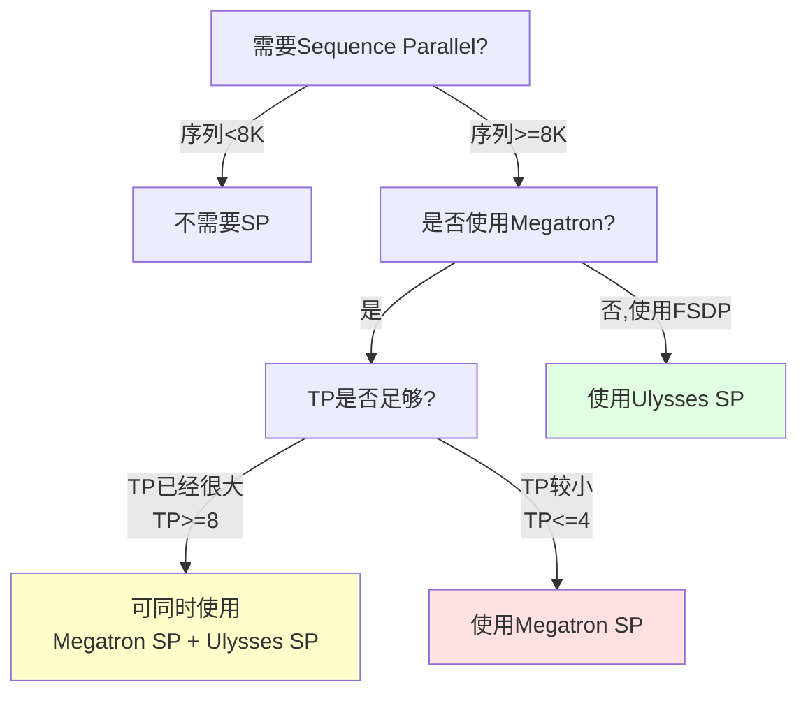
```mermaid
graph TD
    Start[需要Sequence Parallel?]
    Start -->|序列<8K| No[不需要SP]
    Start -->|序列>=8K| Q1[是否使用Megatron?]

    Q1 -->|是| Q2[TP是否足够?]
    Q1 -->|否,使用FSDP| Ulysses[使用Ulysses SP]

    Q2 -->|TP已经很大<br/>TP>=8| Both[可同时使用<br/>Megatron SP + Ulysses SP]
    Q2 -->|TP较小<br/>TP<=4| MegatronSP[使用Megatron SP]

    style Ulysses fill:#e1ffe1
    style MegatronSP fill:#ffe1e1
    style Both fill:#ffffcc
```

**配置示例**:

```yaml
# Megatron SP (自动启用，当TP>1时)
actor_rollout_ref:
  actor:
    megatron:
      tensor_model_parallel_size: 4
      # sequence_parallel: true  # 自动设置

# Ulysses SP (FSDP)
actor_rollout_ref:
  actor:
    strategy: fsdp
    ulysses_sequence_parallel_size: 4  # 独立的SP size
```

**如何修改/扩展SP**:
1. **Megatron SP**: 修改`scatter_to_sequence_parallel_region`等通信原语
2. **Ulysses SP**: 修改`all_to_all_tensor`实现，支持不同的通信pattern
3. **添加新的SP策略**: 实现新的ShardingManager，参考`FSDPUlyssesShardingManager`
4. **配置入口**:
   - Megatron: `McoreEngineConfig.sequence_parallel` (自动)
   - Ulysses: `FSDPActorConfig.ulysses_sequence_parallel_size`

---

## 6. 混合并行策略详解

### 6.1 FSDP + Ulysses SP

这是verl中最常用的混合策略，适合中等规模模型 + 长序列场景。

#### Device Mesh设计

**源码路径**: `verl/workers/fsdp_workers.py:163-167`

```python
self.ulysses_sequence_parallel_size = self.config.actor.get("ulysses_sequence_parallel_size", 1)
dp = world_size // self.ulysses_sequence_parallel_size

if self.ulysses_sequence_parallel_size > 1:
    self.device_mesh = init_device_mesh(
        device_name,
        mesh_shape=(dp, self.ulysses_sequence_parallel_size),
        mesh_dim_names=["dp", "sp"]
    )
```

**讲解**:
```
总GPU数: 16
Ulysses SP size: 4

Device Mesh: [4, 4]
- dim 0 (dp): 4个数据并行组
- dim 1 (sp): 每组4个GPU做Ulysses SP

拓扑:
DP Group 0: GPU 0, 1, 2, 3  (SP group)
DP Group 1: GPU 4, 5, 6, 7  (SP group)
DP Group 2: GPU 8, 9, 10, 11 (SP group)
DP Group 3: GPU 12, 13, 14, 15 (SP group)
```

#### FSDPUlyssesShardingManager

这是verl的关键创新，解决FSDP和Ulysses SP的数据resharding问题。

**源码路径**: `verl/workers/sharding_manager/fsdp_ulysses.py:27-75`

```python
class FSDPUlyssesShardingManager(BaseShardingManager):
    """
    Sharding manager to support data resharding when using FSDP + Ulysses
    """

    def __init__(self, device_mesh: DeviceMesh):
        super().__init__()
        self.device_mesh = device_mesh
        self.seed_offset = 12345

    def __enter__(self):
        if self.device_mesh is not None:
            # Switch to model-specific SP group
            self.prev_sp_group = get_ulysses_sequence_parallel_group()
            set_ulysses_sequence_parallel_group(self.device_mesh["sp"].get_group())

    def __exit__(self, exc_type, exc_value, traceback):
        if self.device_mesh is not None:
            # Restore previous SP group
            set_ulysses_sequence_parallel_group(self.prev_sp_group)

    def preprocess_data(self, data: DataProto) -> DataProto:
        """
        AllGather data from sp region.

        这是因为数据首先在FSDP维度(即DP维度)分片。
        在Ulysses中，我们需要确保SP组内使用相同的数据。
        """
        if self.device_mesh is not None:
            group = self.device_mesh["sp"].get_group()
            all_gather_data_proto(data=data, process_group=group)
        return data

    def postprocess_data(self, data: DataProto) -> DataProto:
        """
        Split the data to follow FSDP partition
        """
        if self.device_mesh is not None:
            sp_size = self.device_mesh["sp"].size()
            sp_rank = self.device_mesh["sp"].get_local_rank()
            data = data.chunk(chunks=sp_size)[sp_rank]
        return data
```

**讲解**:

**Why需要Resharding?**

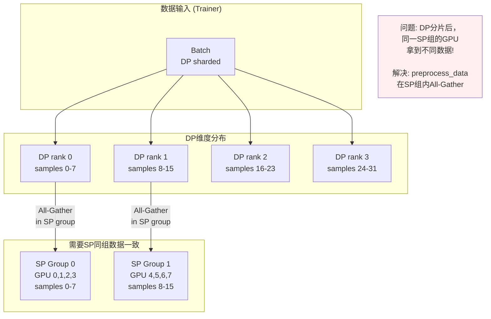
```mermaid
graph TB
    subgraph "数据输入 (Trainer)"
        Data["Batch<br/>DP sharded"]
    end

    subgraph "DP维度分布"
        DP0["DP rank 0<br/>samples 0-7"]
        DP1["DP rank 1<br/>samples 8-15"]
        DP2["DP rank 2<br/>samples 16-23"]
        DP3["DP rank 3<br/>samples 24-31"]
    end

    Data --> DP0
    Data --> DP1
    Data --> DP2
    Data --> DP3

    subgraph "需要SP同组数据一致"
        SP0["SP Group 0<br/>GPU 0,1,2,3<br/>samples 0-7"]
        SP1["SP Group 1<br/>GPU 4,5,6,7<br/>samples 8-15"]
    end

    DP0 -->|All-Gather<br/>in SP group| SP0
    DP1 -->|All-Gather<br/>in SP group| SP1

    note1["问题: DP分片后，<br/>同一SP组的GPU<br/>拿到不同数据!<br/><br/>解决: preprocess_data<br/>在SP组内All-Gather"]

    style note1 fill:#ffeeee
```

**流程**:
1. **Preprocess** (训练前):
   - 输入数据已经按DP分片
   - 在SP group内All-Gather，确保同组GPU有相同数据
   - 例如: SP group 0 (GPU 0-3)都获得samples 0-7

2. **Ulysses SP前向**:
   - 每个GPU处理完整的batch
   - Sequence维度在SP group内分片（通过All-to-All）

3. **Postprocess** (训练后，计算loss):
   - 将数据重新split回DP分片状态
   - 每个GPU只计算自己负责的samples的loss

### 6.2 Megatron 3D Parallelism (TP+PP+DP)

Megatron的3D并行是verl支持超大模型的核心。

#### 3D拓扑结构

**示例**: 64 GPUs, TP=4, PP=4, DP=4

```mermaid
graph TB
    subgraph "DP Replica 0"
        subgraph "PP Stage 0"
            T00["GPU 0<br/>TP0 PP0 DP0"]
            T01["GPU 1<br/>TP1 PP0 DP0"]
            T02["GPU 2<br/>TP2 PP0 DP0"]
            T03["GPU 3<br/>TP3 PP0 DP0"]
        end
        subgraph "PP Stage 1"
            T10["GPU 4<br/>TP0 PP1 DP0"]
            T11["GPU 5<br/>TP1 PP1 DP0"]
            T12["GPU 6<br/>TP2 PP1 DP0"]
            T13["GPU 7<br/>TP3 PP1 DP0"]
        end
    end

    subgraph "DP Replica 1"
        subgraph "PP Stage 0 "
            T20["GPU 16<br/>TP0 PP0 DP1"]
            T21["GPU 17<br/>TP1 PP0 DP1"]
            T22["GPU 18<br/>TP2 PP0 DP1"]
            T23["GPU 19<br/>TP3 PP0 DP1"]
        end
    end

    T00 -.TP Group.-> T01
    T01 -.TP Group.-> T02
    T02 -.TP Group.-> T03

    T00 ==PP P2P==> T10
    T01 ==PP P2P==> T11

    T00 ~~DP All-Reduce~~~ T20
    T01 ~~DP All-Reduce~~~ T21
```

#### 进程组计算

**源码路径**: `verl/workers/megatron_workers.py:215-217`

```python
is_collect = (
    mpu.get_tensor_model_parallel_rank() == 0
    and mpu.get_pipeline_model_parallel_rank() == mpu.get_pipeline_model_parallel_world_size() - 1
    and mpu.get_context_parallel_rank() == 0
)
```

**DP Group计算**:
```python
# Megatron内部实现
def get_data_parallel_world_size():
    return (
        world_size
        // tensor_model_parallel_size
        // pipeline_model_parallel_size
        // context_parallel_size
    )

# 例子: 64 GPUs, TP=4, PP=4, CP=1
dp_size = 64 // 4 // 4 // 1 = 4
```

### 6.3 3D-HybridEngine Resharding (复杂实现详解)

这是verl最复杂的部分之一，实现Megatron训练模型到vLLM/SGLang推理引擎的权重转换。

#### 完整的Resharding流程

**源码路径**: `verl/utils/megatron_utils.py:709-946`

```python
def per_tensor_generator(
    actor_module,
    model_config,
    weight_converter,
    transformer_config,
    layer_name_mapping,
    convert_qkv_gate_up_by_simple_split=True,
):
    """
    Generator that yields (name, tensor) pairs for all model parameters,
    handling TP/PP/EP resharding.
    """
    from megatron.core import parallel_state as mpu

    pp_rank = mpu.get_pipeline_model_parallel_rank()
    ep_size = mpu.get_expert_model_parallel_world_size()
    etp_size = mpu.get_expert_tensor_parallel_world_size()
    vpp_size = len(actor_module)  # virtual pipeline size
    all_gather_group = mpu.get_tensor_model_parallel_group()
    all_gather_group_size = torch.distributed.get_world_size(group=all_gather_group)

    # Step 1: 收集所有ranks的参数元信息
    meta_info = []
    for scan_vpp_idx in range(vpp_size):
        model = unwrap_model(actor_module[scan_vpp_idx])
        for idx, (name, _) in enumerate(model.named_parameters()):
            meta_info.append((pp_rank, scan_vpp_idx, idx, name))

    # All-gather meta info across PP ranks
    obj_spec_output = [None] * mpu.get_pipeline_model_parallel_world_size()
    torch.distributed.all_gather_object(
        object_list=obj_spec_output,
        obj=meta_info,
        group=mpu.get_pipeline_model_parallel_group()
    )
    layer_list_meta = [item for sublist in obj_spec_output for item in sublist]

    # Step 2: 逐个处理参数
    gen_func = tensor_generator()

    for cur_pp_rank, scan_vpp_idx, idx, name in layer_list_meta:
        # Step 2a: PP broadcast
        if cur_pp_rank == pp_rank:
            cur_name, cur_tensor = next(gen_func)
            cur_name = normalize_model_name(name, cur_pp_rank, scan_vpp_idx, transformer_config)
        else:
            cur_tensor, cur_name = None, None

        cur_name = broadcast_str_from_megatron_pp(cur_name)
        broad_pp_tensor = broadcast_from_megatron_pp(cur_tensor)

        # Step 2b: EP all-gather (for MoE experts)
        if ".mlp.experts.linear_fc" in cur_name and ep_size > 1:
            num_experts = weight_converter.mcore_config.num_moe_experts
            num_experts_per_rank = num_experts // ep_size
            infer_params = [torch.empty_like(broad_pp_tensor) for _ in range(ep_size)]

            # All-gather along EP dimension
            torch.distributed.all_gather(infer_params, broad_pp_tensor, group=ep_group)

            # Process each expert
            for ep_rank, param in enumerate(infer_params):
                # ETP all-gather (expert-level TP)
                if etp_size > 1:
                    etp_params = [torch.empty_like(param) for _ in range(etp_size)]
                    torch.distributed.all_gather(etp_params, param, group=etp_group)
                    params = etp_params
                else:
                    params = [param]

                # TP concat
                merge_params = default_tp_concat_fn(...)
                converted_names, converted_params = weight_converter.convert_param(name, merge_params)
                yield from zip(converted_names, converted_params)
            continue

        # Step 2c: TP all-gather (standard parameters)
        if tp_utils.is_tensor_parallel_param(broad_pp_tensor):
            if all_gather_group_size <= 1:
                infer_params = [broad_pp_tensor]
            else:
                infer_params = [torch.empty_like(broad_pp_tensor) for _ in range(all_gather_group_size)]
                torch.distributed.all_gather(
                    infer_params, broad_pp_tensor,
                    group=mpu.get_tensor_model_parallel_group()
                )

            # Concat TP shards (handles QKV/Gate-Up特殊格式)
            infer_params = default_tp_concat_fn(
                layer_name_mapping,
                cur_name,
                broad_pp_tensor,
                infer_params,
                model_config,
                weight_converter.hf_config,
                convert_qkv_gate_up_by_simple_split,
            )
        else:
            # No TP, use as-is
            infer_params = broad_pp_tensor

        # Step 2d: Convert to HuggingFace format
        if not isinstance(infer_params, list):
            infer_params = [infer_params]
        converted_names, converted_params = weight_converter.convert_param(cur_name, infer_params)

        yield from zip(converted_names, [param.detach() for param in converted_params])
```

**讲解**:

**Resharding的复杂性来源**:
1. **多维度并行**: 需要处理TP、PP、EP、ETP四个维度
2. **异构拓扑**: 不同参数可能有不同的并行策略
3. **格式转换**: Megatron打包格式 → HuggingFace标准格式
4. **内存效率**: 不能一次性加载所有参数，必须流式处理

**关键步骤**:

1. **Meta Info Collection**:
   ```python
   # 收集所有ranks的参数列表
   # 结果: [(pp_rank, vpp_idx, param_idx, param_name), ...]
   # 例如:
   # [(0, 0, 0, "layers.0.self_attention.linear_qkv.weight"),
   #  (0, 0, 1, "layers.0.mlp.linear_fc1.weight"),
   #  (1, 0, 0, "layers.8.self_attention.linear_qkv.weight"),
   #  ...]
   ```

2. **PP Broadcast**:
   ```python
   # 只有持有该参数的PP rank有数据
   # 其他ranks创建空tensor并接收broadcast
   ```

3. **EP/ETP All-Gather** (MoE专用):
   ```python
   # EP: 收集所有experts
   # ETP: 收集每个expert的TP分片
   # 生成全局expert IDs
   ```

4. **TP All-Gather + Concat**:
   ```python
   # 对于QKV: 按query group解包
   # 对于Gate-Up: 按gate/up分离
   # 对于普通参数: 直接concat
   ```

5. **Format Conversion**:
   ```python
   # Megatron名称 → HuggingFace名称
   # 例如:
   # "decoder.layers.0.self_attention.linear_qkv.weight" →
   # "model.layers.0.self_attn.qkv_proj.weight" 或
   # ["model.layers.0.self_attn.q_proj.weight",
   #  "model.layers.0.self_attn.k_proj.weight",
   #  "model.layers.0.self_attn.v_proj.weight"]
   ```

#### 使用示例

**源码路径**: `verl/workers/megatron_workers.py:848-870`

```python
async def rollout_mode(self):
    """Context switch hybridengine to rollout mode."""
    # Step 1: 如果启用offload，先load参数到GPU
    if self._is_offload_param:
        load_megatron_model_to_gpu(self.actor.actor_module, load_grad=False)

    # Step 2: Reshard权重
    if self.bridge is not None:
        # 使用bridge (mcore → HF)
        per_tensor_param = self.bridge.export_weights(self.actor.actor_module)
    else:
        # 使用per_tensor_generator
        per_tensor_param = per_tensor_generator(
            self.actor.actor_module,
            self.actor_model_config,
            self.weight_converter,
            self.tf_config,
            self.layer_name_mapping,
        )

    # Step 3: 禁用GPU allocator的expandable segments
    set_expandable_segments(False)

    # Step 4: 更新vLLM/SGLang权重
    await self.rollout.update_weights(per_tensor_param)

    # Step 5: Offload回CPU
    if self._is_offload_param:
        offload_megatron_model_to_cpu(self.actor.actor_module)
```

**时序图**:

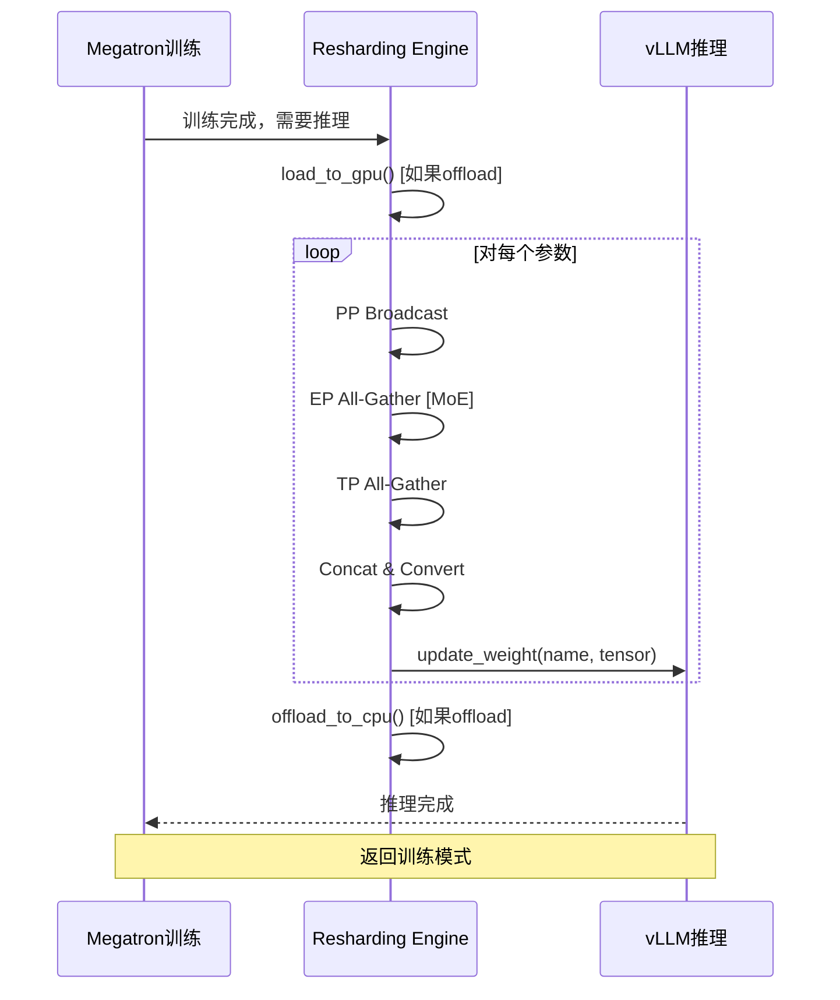
```mermaid
sequenceDiagram
    participant Trainer as Megatron训练
    participant Reshard as Resharding Engine
    participant vLLM as vLLM推理

    Trainer->>Reshard: 训练完成，需要推理
    Reshard->>Reshard: load_to_gpu() [如果offload]

    loop 对每个参数
        Reshard->>Reshard: PP Broadcast
        Reshard->>Reshard: EP All-Gather [MoE]
        Reshard->>Reshard: TP All-Gather
        Reshard->>Reshard: Concat & Convert
        Reshard->>vLLM: update_weight(name, tensor)
    end

    Reshard->>Reshard: offload_to_cpu() [如果offload]
    vLLM-->>Trainer: 推理完成

    Note over Trainer,vLLM: 返回训练模式
```

**如何修改/扩展混合并行**:
1. **FSDP+Ulysses**: 修改`FSDPUlyssesShardingManager`的resharding逻辑
2. **添加新的3D组合**: 实现新的`ShardingManager`，处理自定义的并行维度
3. **优化Resharding性能**:
   - 使用异步通信 (`async_op=True`)
   - Pipeline化参数传输
   - 减少不必要的all-gather (只在推理时做)
4. **配置入口**:
   - `McoreEngineConfig`: 所有Megatron并行参数
   - `FSDPActorConfig.ulysses_sequence_parallel_size`

---

## 7. 配置系统与接入点

### 7.1 配置类层次结构

verl使用dataclass构建了完整的配置系统。

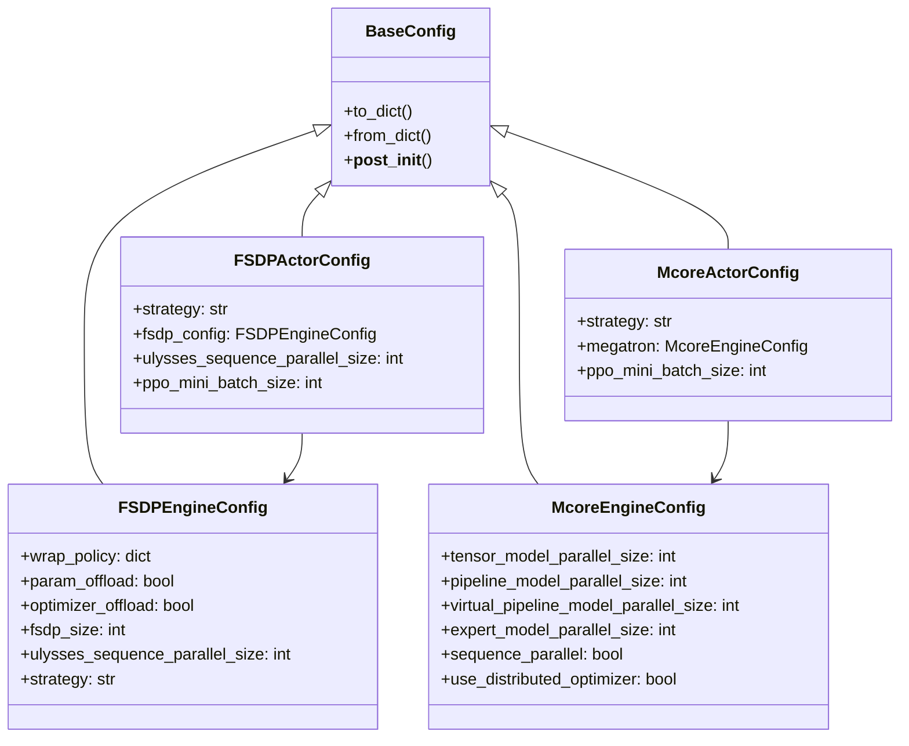
```mermaid
classDiagram
    class BaseConfig {
        +to_dict()
        +from_dict()
        +__post_init__()
    }

    class FSDPEngineConfig {
        +wrap_policy: dict
        +param_offload: bool
        +optimizer_offload: bool
        +fsdp_size: int
        +ulysses_sequence_parallel_size: int
        +strategy: str
    }

    class McoreEngineConfig {
        +tensor_model_parallel_size: int
        +pipeline_model_parallel_size: int
        +virtual_pipeline_model_parallel_size: int
        +expert_model_parallel_size: int
        +sequence_parallel: bool
        +use_distributed_optimizer: bool
    }

    class FSDPActorConfig {
        +strategy: str
        +fsdp_config: FSDPEngineConfig
        +ulysses_sequence_parallel_size: int
        +ppo_mini_batch_size: int
    }

    class McoreActorConfig {
        +strategy: str
        +megatron: McoreEngineConfig
        +ppo_mini_batch_size: int
    }

    BaseConfig <|-- FSDPEngineConfig
    BaseConfig <|-- McoreEngineConfig
    BaseConfig <|-- FSDPActorConfig
    BaseConfig <|-- McoreActorConfig

    FSDPActorConfig --> FSDPEngineConfig
    McoreActorConfig --> McoreEngineConfig
```

### 7.2 关键配置参数速查表

#### FSDP配置

**文件**: `verl/workers/config/engine.py:FSDPEngineConfig`

| 参数 | 类型 | 默认值 | 说明 | 修改入口 |
|------|------|-------|------|---------|
| `strategy` | str | "fsdp" | FSDP版本 ("fsdp" or "fsdp2") | 配置文件 |
| `fsdp_size` | int | -1 | FSDP组大小，-1表示全部GPU | `actor.fsdp_config.fsdp_size` |
| `param_offload` | bool | False | 参数offload到CPU | `actor.fsdp_config.param_offload` |
| `optimizer_offload` | bool | False | 优化器offload到CPU | `actor.fsdp_config.optimizer_offload` |
| `offload_policy` | bool | False | FSDP2的offload policy | `actor.fsdp_config.offload_policy` |
| `wrap_policy` | dict | {} | Wrap策略配置 | `actor.fsdp_config.wrap_policy` |
| `ulysses_sequence_parallel_size` | int | 1 | Ulysses SP大小 | `actor.fsdp_config.ulysses_sequence_parallel_size` |
| `mixed_precision` | dict | None | 混合精度配置 | `actor.fsdp_config.mixed_precision` |

**Wrap Policy子配置**:

| 参数 | 说明 | 示例 |
|------|------|------|
| `transformer_layer_cls_to_wrap` | Transformer层类名列表 | `["LlamaDecoderLayer"]` |
| `min_num_params` | 最小参数量阈值 | `100000000` (100M) |
| `disable` | 禁用wrap policy | `false` |

**配置示例**:
```yaml
# verl/trainer/config/ppo_trainer.yaml
actor_rollout_ref:
  actor:
    strategy: fsdp2
    fsdp_config:
      fsdp_size: -1  # 全部GPU
      param_offload: false
      optimizer_offload: false
      offload_policy: false
      reshard_after_forward: true
      forward_prefetch: false
      model_dtype: fp32
      use_orig_params: false
      ulysses_sequence_parallel_size: 1  # 不使用Ulysses SP
      wrap_policy:
        transformer_layer_cls_to_wrap: ["LlamaDecoderLayer"]
```

#### Megatron配置

**文件**: `verl/workers/config/engine.py:McoreEngineConfig`

| 参数 | 类型 | 默认值 | 说明 | 修改入口 |
|------|------|-------|------|---------|
| `tensor_model_parallel_size` | int | 1 | TP大小 | `actor.megatron.tensor_model_parallel_size` |
| `pipeline_model_parallel_size` | int | 1 | PP大小 | `actor.megatron.pipeline_model_parallel_size` |
| `virtual_pipeline_model_parallel_size` | int | None | VPP大小 | `actor.megatron.virtual_pipeline_model_parallel_size` |
| `context_parallel_size` | int | 1 | Context Parallel大小 | `actor.megatron.context_parallel_size` |
| `expert_model_parallel_size` | int | 1 | Expert Parallel大小 | `actor.megatron.expert_model_parallel_size` |
| `expert_tensor_parallel_size` | int | None | Expert TP大小 | `actor.megatron.expert_tensor_parallel_size` |
| `sequence_parallel` | bool | True | 自动启用SP (当TP>1) | `actor.megatron.sequence_parallel` |
| `use_distributed_optimizer` | bool | True | 使用分布式优化器 | `actor.megatron.use_distributed_optimizer` |
| `param_offload` | bool | False | 参数offload | `actor.megatron.param_offload` |
| `optimizer_offload` | bool | False | 优化器offload | `actor.megatron.optimizer_offload` |

**配置示例**:
```yaml
# verl/trainer/config/ppo_trainer.yaml
actor_rollout_ref:
  actor:
    strategy: megatron
    megatron:
      tensor_model_parallel_size: 4
      pipeline_model_parallel_size: 2
      virtual_pipeline_model_parallel_size: 2  # 启用VPP
      context_parallel_size: 1
      expert_model_parallel_size: 1
      sequence_parallel: true
      use_distributed_optimizer: true
      param_offload: false
      optimizer_offload: false
```

#### Rollout配置

**文件**: `verl/workers/config/rollout.py:RolloutConfig`

| 参数 | 说明 | 修改入口 |
|------|------|---------|
| `name` | 推理引擎 ("vllm", "sglang", "hf_transformers") | `rollout.name` |
| `tensor_model_parallel_size` | 推理TP大小 | `rollout.tensor_model_parallel_size` |
| `data_parallel_size` | 推理DP大小 | `rollout.data_parallel_size` |
| `gpu_memory_utilization` | GPU内存使用率 | `rollout.gpu_memory_utilization` |

### 7.3 如何验证配置

**检查脚本**: `verl/trainer/main_ppo.py`

```python
from verl.trainer.config import parse_config

# 验证配置
config = parse_config('ppo_trainer')

# 检查并行参数
if config.actor_rollout_ref.actor.strategy == "megatron":
    tp_size = config.actor_rollout_ref.actor.megatron.tensor_model_parallel_size
    pp_size = config.actor_rollout_ref.actor.megatron.pipeline_model_parallel_size
    n_gpus = config.trainer.n_gpus_per_node * config.trainer.nnodes

    assert n_gpus % (tp_size * pp_size) == 0, (
        f"GPU数({n_gpus})必须能被TP*PP({tp_size*pp_size})整除"
    )
```

### 7.4 常用配置模板

#### 小模型 (7B, 8 GPUs)

```yaml
# FSDP + Ulysses SP (长序列)
actor_rollout_ref:
  actor:
    strategy: fsdp2
    fsdp_config:
      ulysses_sequence_parallel_size: 4
  rollout:
    name: vllm
    tensor_model_parallel_size: 2
```

#### 中型模型 (70B, 32 GPUs)

```yaml
# FSDP (纯DP) or Megatron (TP+PP)
actor_rollout_ref:
  actor:
    strategy: megatron
    megatron:
      tensor_model_parallel_size: 4
      pipeline_model_parallel_size: 2  # 4*2*4=32
  rollout:
    name: vllm
    tensor_model_parallel_size: 4
    data_parallel_size: 2  # 4*2*4=32
```

#### 超大模型 (671B, 128 GPUs)

```yaml
# Megatron 3D并行
actor_rollout_ref:
  actor:
    strategy: megatron
    megatron:
      tensor_model_parallel_size: 8
      pipeline_model_parallel_size: 8
      virtual_pipeline_model_parallel_size: 4  # VPP减少bubble
      use_distributed_optimizer: true
  rollout:
    name: vllm
    tensor_model_parallel_size: 8
    data_parallel_size: 4  # 8*8*2=128 (PP=2 for inference)
```

---

## 8. 实战案例分析

### 8.1 Case Study: vLLM Rollout + FSDP Training

**场景**: Qwen2-7B模型，8 GPUs，FSDP训练 + vLLM推理

**配置**: `examples/ppo_trainer/run_qwen2-7b_vllm.sh`

#### 架构图

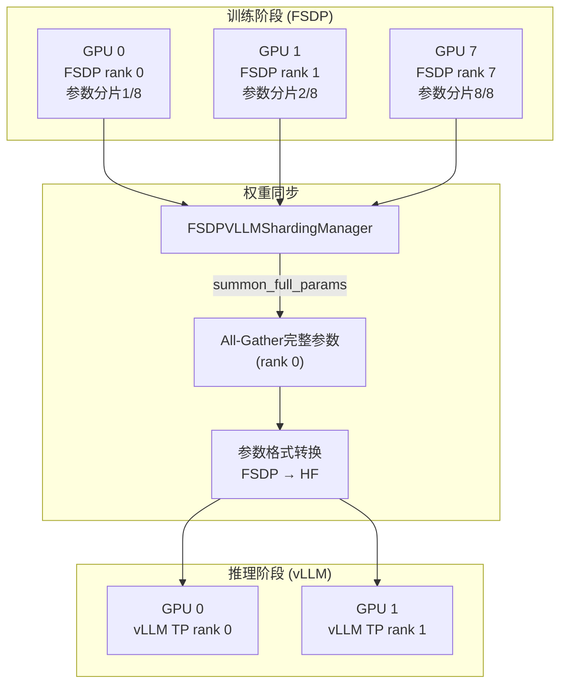
```mermaid
graph TB
    subgraph "训练阶段 (FSDP)"
        FSDP0["GPU 0<br/>FSDP rank 0<br/>参数分片1/8"]
        FSDP1["GPU 1<br/>FSDP rank 1<br/>参数分片2/8"]
        FSDP7["GPU 7<br/>FSDP rank 7<br/>参数分片8/8"]
    end

    subgraph "权重同步"
        SM["FSDPVLLMShardingManager"]
        SM --> |summon_full_params| Gather["All-Gather完整参数<br/>(rank 0)"]
        Gather --> Convert["参数格式转换<br/>FSDP → HF"]
    end

    subgraph "推理阶段 (vLLM)"
        vLLM0["GPU 0<br/>vLLM TP rank 0"]
        vLLM1["GPU 1<br/>vLLM TP rank 1"]
    end

    FSDP0 --> SM
    FSDP1 --> SM
    FSDP7 --> SM

    Convert --> vLLM0
    Convert --> vLLM1
```

#### 关键代码路径

**Worker初始化**: `verl/workers/fsdp_workers.py:ActorRolloutRefWorker`

```python
class ActorRolloutRefWorker:
    def init_model(self):
        # 1. 创建FSDP模型
        self.actor_module_fsdp, self.actor_optimizer = self._build_model_optimizer(
            role="actor",
            fsdp_config=self.config.actor.fsdp_config,
        )

        # 2. 创建vLLM rollout
        rollout_config = RolloutConfig(
            name="vllm",
            tensor_model_parallel_size=2,
            ...
        )
        self.rollout = VLLMRollout(config=rollout_config)

        # 3. 创建sharding manager
        from verl.workers.sharding_manager.fsdp_vllm import FSDPVLLMShardingManager
        self.sharding_manager = FSDPVLLMShardingManager(
            module=self.actor_module_fsdp,
            vllm_config=rollout_config,
            ...
        )
```

**权重同步**: `verl/workers/fsdp_workers.py:generate_sequences`

```python
def generate_sequences(self, prompts: DataProto):
    # 1. 进入rollout mode
    with self.sharding_manager:  # __enter__触发权重同步
        # 2. vLLM生成
        output = self.rollout.generate_sequences(prompts)
    # 3. __exit__自动清理

    return output
```

#### 性能分析

**内存占用** (Qwen2-7B, FP16):
- **FSDP训练** (Per GPU):
  - 参数: 7B * 2 bytes / 8 GPUs = 1.75 GB
  - 梯度: 1.75 GB
  - 优化器状态 (Adam): 7 GB (fp32 main params + momentums)
  - Activations: ~8 GB (batch_size=8, seq_len=2048)
  - **总计**: ~18.5 GB

- **vLLM推理** (Per GPU, TP=2):
  - 参数: 7B * 2 bytes / 2 = 7 GB
  - KV Cache: ~12 GB (batch_size=128, max_seq_len=4096)
  - **总计**: ~19 GB

**同步开销**:
- `summon_full_params`: ~200ms (8 GPUs all-gather)
- 格式转换: ~50ms
- vLLM加载: ~100ms
- **总计**: ~350ms (每次生成前一次性开销)

### 8.2 Case Study: Megatron训练 + SGLang推理

**场景**: Qwen2.5-32B模型，32 GPUs，Megatron TP+PP训练 + SGLang推理

**配置**: `examples/ppo_trainer/run_qwen2.5-32b.sh`

#### 并行配置

```yaml
# 训练配置
actor_rollout_ref:
  actor:
    strategy: megatron
    megatron:
      tensor_model_parallel_size: 4
      pipeline_model_parallel_size: 2
      # DP = 32 / (4*2) = 4

# 推理配置
  rollout:
    name: sglang
    tensor_model_parallel_size: 4
    data_parallel_size: 2  # 共8组，每组TP=4
```

#### Resharding流程

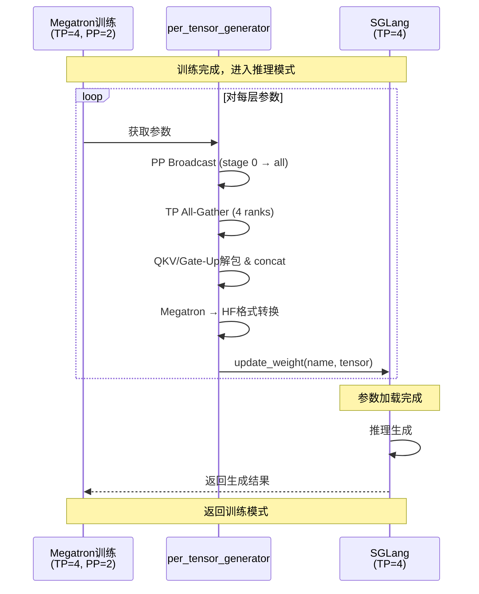
```mermaid
sequenceDiagram
    participant Train as Megatron训练<br/>(TP=4, PP=2)
    participant Gen as per_tensor_generator
    participant SG as SGLang<br/>(TP=4)

    Note over Train,SG: 训练完成，进入推理模式

    loop 对每层参数
        Train->>Gen: 获取参数
        Gen->>Gen: PP Broadcast (stage 0 → all)
        Gen->>Gen: TP All-Gather (4 ranks)
        Gen->>Gen: QKV/Gate-Up解包 & concat
        Gen->>Gen: Megatron → HF格式转换
        Gen->>SG: update_weight(name, tensor)
    end

    Note over SG: 参数加载完成

    SG->>SG: 推理生成
    SG-->>Train: 返回生成结果

    Note over Train,SG: 返回训练模式
```

#### 关键优化点

**1. 流式传输** (避免OOM):

```python
# verl/workers/megatron_workers.py
async def rollout_mode(self):
    # 使用generator，逐个传输参数
    per_tensor_param = per_tensor_generator(...)  # generator

    # SGLang逐个接收
    await self.rollout.update_weights(per_tensor_param)  # async stream
```

**2. 异步通信**:

```python
# verl/utils/ulysses.py:all_to_all_tensor
comm = dist.all_to_all(..., async_op=True)
# 立即返回，可以overlap computation
```

**3. CPU Offload**:

```python
# 训练时offload
offload_megatron_model_to_cpu(self.actor_module)

# 推理前load
load_megatron_model_to_gpu(self.actor_module, load_grad=False)

# 推理后再offload
offload_megatron_model_to_cpu(self.actor_module)
```

---

## 9. 常见问题与调试技巧

### 9.1 OOM (Out of Memory) 问题

#### 症状
```
torch.cuda.OutOfMemoryError: CUDA out of memory.
Tried to allocate 1.95 GiB (GPU 0; 79.35 GiB total capacity)
```

#### 诊断步骤

**1. 检查显存分布**:

```python
# verl/utils/debug.py
from verl.utils.debug import log_gpu_memory_usage

log_gpu_memory_usage("After model init")
# 输出: GPU 0: allocated=15.2GB, reserved=16.0GB, max_allocated=15.5GB
```

**2. 定位OOM发生阶段**:

```python
# 在关键位置添加memory logging
log_gpu_memory_usage("Before FSDP wrap")
model = FSDP(model, ...)
log_gpu_memory_usage("After FSDP wrap")

log_gpu_memory_usage("Before forward")
output = model(input)
log_gpu_memory_usage("After forward")
```

**3. 分析显存占用**:

| 组件 | 预期占用 (7B模型, FP16) | 实际占用 |
|------|------------------------|---------|
| 模型参数 | 14 GB | ? |
| 梯度 | 14 GB | ? |
| 优化器状态 (Adam) | 28 GB (FP32) | ? |
| Activations | ~8 GB | ? |
| **总计** | ~64 GB | ? |

#### 解决方案

**方案1: 启用Offload**

```yaml
# FSDP
actor:
  fsdp_config:
    param_offload: true
    optimizer_offload: true

# Megatron
actor:
  megatron:
    param_offload: true
    optimizer_offload: true
```

**方案2: 增加并行度**

```yaml
# 增加FSDP size (减少每个rank的参数)
actor:
  fsdp_config:
    fsdp_size: 8  # 原来是4

# 增加TP (减少每个rank的参数)
actor:
  megatron:
    tensor_model_parallel_size: 8  # 原来是4
```

**方案3: 减少Activation内存**

```yaml
# 启用gradient checkpointing
actor:
  model:
    enable_gradient_checkpointing: true

# 减少micro batch size
actor:
  ppo_micro_batch_size: 1  # 原来是2
```

**方案4: 使用Mixed Precision**

```yaml
# FSDP
actor:
  fsdp_config:
    mixed_precision:
      param_dtype: bfloat16
      reduce_dtype: bfloat16
      buffer_dtype: bfloat16
```

### 9.2 通信超时问题

#### 症状
```
RuntimeError: [Rank 3] Watchdog caught collective operation timeout:
WorkNCCL(OpType=ALLGATHER, Timeout(ms)=600000)
```

#### 诊断步骤

**1. 检查hang的位置**:

```python
import logging
logger = logging.getLogger(__name__)

logger.info(f"[Rank {dist.get_rank()}] Before all_gather")
dist.all_gather(...)
logger.info(f"[Rank {dist.get_rank()}] After all_gather")
```

**2. 检查进程组状态**:

```python
# 验证进程组是否正确初始化
assert dist.is_initialized()
assert mpu.model_parallel_is_initialized()  # Megatron
print(f"TP group size: {mpu.get_tensor_model_parallel_world_size()}")
print(f"PP group size: {mpu.get_pipeline_model_parallel_world_size()}")
```

**3. 检查tensor shape一致性**:

```python
# 所有ranks的tensor shape必须一致
local_shape = tensor.shape
shapes = [None] * dist.get_world_size()
dist.all_gather_object(shapes, local_shape)
print(f"Shapes across ranks: {shapes}")
assert all(s == shapes[0] for s in shapes), "Shape mismatch!"
```

#### 解决方案

**方案1: 增加超时时间**

```yaml
actor:
  nccl_timeout: 1800  # 30分钟 (默认10分钟)
```

**方案2: 检查数据不一致**

```python
# 确保所有ranks的数据维度一致
if dist.get_rank() == 0:
    data = data[:100]  # ❌ 只在rank 0 truncate!
else:
    data = data  # ❌ 其他ranks保持原样

# 正确做法: 所有ranks同步
local_size = len(data)
sizes = [0] * dist.get_world_size()
dist.all_gather_object(sizes, local_size)
max_size = max(sizes)
data = data[:max_size]  # ✅ 所有ranks统一truncate
```

**方案3: 显式barrier同步**

```python
# 在关键位置添加barrier
dist.barrier()  # 等待所有ranks到达此处
result = collective_op(...)
dist.barrier()  # 确保所有ranks完成
```

### 9.3 权重加载错误

#### 症状
```
RuntimeError: Error(s) in loading state_dict for FSDP:
    Missing key(s): "model.layers.0.self_attn.q_proj.weight"
    Unexpected key(s): "_fsdp_wrapped_module.model.layers.0..."
```

#### 诊断步骤

**1. 检查key mapping**:

```python
# FSDP adds prefix
fsdp_keys = model.state_dict().keys()
print(list(fsdp_keys)[:5])
# ['_fsdp_wrapped_module.model.embed_tokens.weight', ...]

# HuggingFace format
hf_keys = hf_model.state_dict().keys()
print(list(hf_keys)[:5])
# ['model.embed_tokens.weight', ...]
```

**2. 对比参数shape**:

```python
for name, param in model.named_parameters():
    if "qkv" in name:
        print(f"{name}: {param.shape}")
# Megatron: qkv_proj [hidden, (num_heads+num_kv*2)*head_dim]
# HuggingFace: q_proj [hidden, num_heads*head_dim]
#              k_proj [hidden, num_kv*head_dim]
#              v_proj [hidden, num_kv*head_dim]
```

#### 解决方案

**方案1: 使用正确的checkpoint loader**

```python
# FSDP
from verl.utils.checkpoint.fsdp_checkpoint_manager import FSDPCheckpointManager
manager = FSDPCheckpointManager(model=model, ...)
manager.load_checkpoint(path)

# Megatron
from verl.utils.checkpoint.megatron_checkpoint_manager import MegatronCheckpointManager
manager = MegatronCheckpointManager(model=model, ...)
manager.load_checkpoint(path)
```

**方案2: 手动转换keys**

```python
from verl.utils.model import convert_weight_keys

state_dict = torch.load(checkpoint_path)
converted_state_dict = convert_weight_keys(state_dict, model)
model.load_state_dict(converted_state_dict)
```

**方案3: 使用HF权重转换工具**

```bash
# Megatron → HuggingFace
python scripts/convert_checkpoint.py \
    --input-dir /path/to/megatron/checkpoint \
    --output-dir /path/to/hf/checkpoint \
    --model-type qwen2 \
    --tp-size 4 \
    --pp-size 2
```

### 9.4 性能调优技巧

#### Profiling工具

**1. verl内置profiler**:

```yaml
# config
actor:
  profiler:
    tool: torch  # or "nsys", "npu"
    tool_config:
      torch:
        enabled: true
        with_stack: true
        profile_memory: true
```

**2. PyTorch Profiler**:

```python
from torch.profiler import profile, ProfilerActivity

with profile(
    activities=[ProfilerActivity.CPU, ProfilerActivity.CUDA],
    record_shapes=True,
    profile_memory=True,
) as prof:
    output = model(input)

print(prof.key_averages().table(sort_by="cuda_time_total"))
```

#### 通信优化

**1. 启用NCCL优化**:

```bash
# 环境变量
export NCCL_IB_DISABLE=0  # 启用InfiniBand
export NCCL_NET_GDR_LEVEL=5  # GPU Direct RDMA
export NCCL_P2P_DISABLE=0  # 启用P2P
export NCCL_SHM_DISABLE=0  # 启用Shared Memory
```

**2. 使用异步通信**:

```python
# 替换同步all_gather
tensor_list = [torch.empty_like(tensor) for _ in range(world_size)]
handle = dist.all_gather(tensor_list, tensor, async_op=True)

# Overlap computation
result = compute_something()

# Wait for communication
handle.wait()
use_gathered_tensors(tensor_list)
```

**3. Bucket化小参数**:

```yaml
# FSDP
actor:
  fsdp_config:
    wrap_policy:
      min_num_params: 10000000  # 小于10M的参数bucket化
```

#### 计算优化

**1. Flash Attention 2**:

```yaml
actor:
  model:
    use_flash_attention_2: true
```

**2. Sequence Packing**:

```yaml
data:
  pack_sequences: true
  max_packed_seq_len: 4096
```

**3. 混合精度训练**:

```yaml
actor:
  fsdp_config:
    mixed_precision:
      param_dtype: bfloat16
      reduce_dtype: float32  # 梯度accumulation用FP32
```

### 9.5 调试Checklist

#### 初始化阶段

- [ ] `torch.distributed.is_initialized()` 返回 True
- [ ] `dist.get_world_size()` 等于预期的总GPU数
- [ ] Megatron: `mpu.get_tensor_model_parallel_world_size()` 正确
- [ ] Megatron: `mpu.get_pipeline_model_parallel_world_size()` 正确
- [ ] Device mesh shape正确 (FSDP+Ulysses)
- [ ] 所有ranks成功加载模型（检查日志）

#### 训练阶段

- [ ] Loss在合理范围（不是NaN或Inf）
- [ ] 所有ranks的loss一致（DP场景）
- [ ] GPU利用率 > 80% (nvidia-smi)
- [ ] 显存使用稳定（不持续增长）
- [ ] 通信时间 < 30% 总时间

#### 推理阶段

- [ ] 权重同步成功（无维度不匹配错误）
- [ ] vLLM/SGLang成功初始化
- [ ] 生成结果合理（不是乱码）
- [ ] 推理速度达到预期

---

## 总结与扩展指南

### 快速修改指南

**场景**: 我想修改XXX，应该改哪里？

| 需求 | 修改文件 | 关键函数/类 |
|------|---------|------------|
| 添加新的FSDP wrap策略 | `verl/utils/fsdp_utils.py` | `get_fsdp_wrap_policy` |
| 修改QKV分片逻辑 | `verl/utils/megatron_utils.py` | `convert_qkv_shard` |
| 添加新的ShardingManager | `verl/workers/sharding_manager/` | 继承`BaseShardingManager` |
| 修改Layer offset计算 | `verl/utils/megatron_utils.py` | `get_transformer_layer_offset` |
| 添加新的并行维度 | `verl/workers/config/engine.py` | `McoreEngineConfig` |
| 优化权重resharding | `verl/utils/megatron_utils.py` | `per_tensor_generator` |
| 修改Ulysses All-to-All | `verl/utils/ulysses.py` | `all_to_all_tensor` |
| 添加新的推理引擎支持 | `verl/workers/rollout/` | 新建rollout类 |

### 核心原则

1. **优先复用**: 尽量使用现有的并行策略组合，避免重复造轮子
2. **渐进式优化**: 先跑通基础配置，再逐步调优
3. **充分测试**: 每次修改后验证correctness和性能
4. **文档先行**: 修改配置时先更新文档，避免配置漂移

### 参考资源

- **verl官方文档**: https://github.com/volcengine/verl
- **Megatron-LM**: https://github.com/NVIDIA/Megatron-LM
- **PyTorch FSDP**: https://pytorch.org/docs/stable/fsdp.html
- **vLLM**: https://github.com/vllm-project/vllm
- **SGLang**: https://github.com/sgl-project/sglang

---

**文档结束**. 如有问题或建议，请提Issue到verl仓库。
