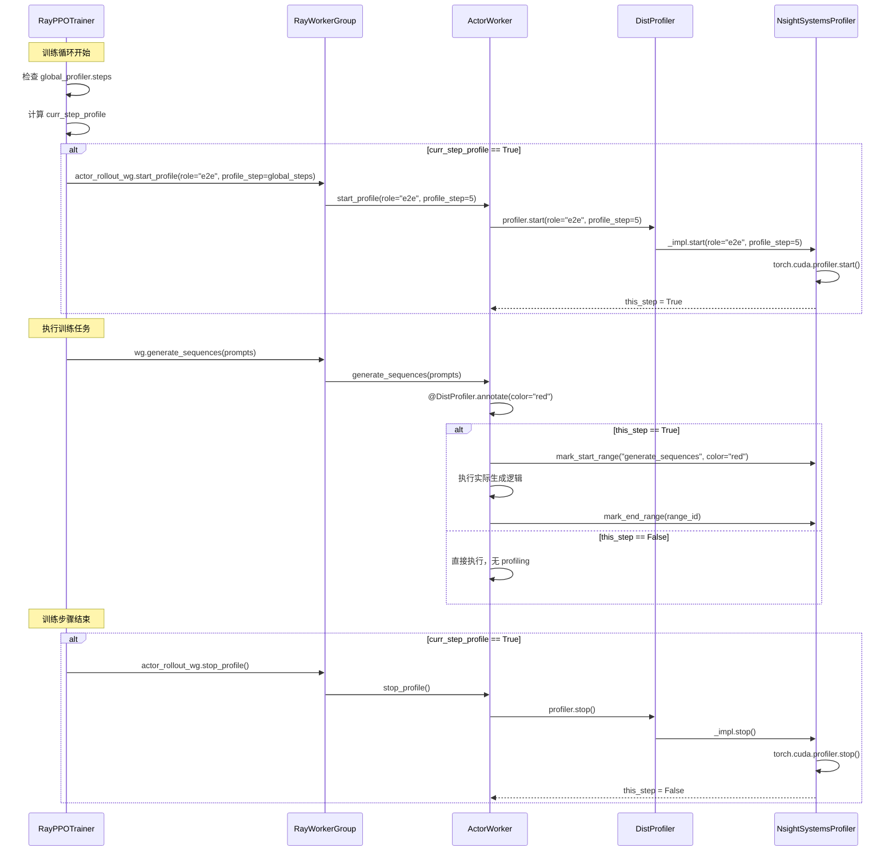

# Verl Profiler 深度讲解：调用机制与使用指南

本文档详细讲解 verl 中 profiler 的实现机制、配置系统、调用流程，以及如何扩展和修改 profiler 功能。

## 目录

- [1. 架构概览](#1-架构概览)
- [2. 配置系统详解](#2-配置系统详解)
- [3. 核心实现组件](#3-核心实现组件)
- [4. 调用流程分析](#4-调用流程分析)
- [5. 代码实现细节](#5-代码实现详解)
- [6. 高级特性和 Tricky 实现](#6-高级特性和-tricky-实现)
- [7. 扩展和修改指南](#7-扩展和修改指南)

---

## 1. 架构概览

### 1.1 整体架构

verl 的 profiler 系统采用**分层架构**设计，支持多种 profiling 工具（NVIDIA Nsight Systems、华为 NPU Profiler、PyTorch Profiler、内存分析器）。

```mermaid
graph TB
    subgraph "Trainer Layer"
        A[RayPPOTrainer] --> B[全局配置 global_profiler]
        A --> C[角色配置 actor/critic/rm/rollout]
    end

    subgraph "Controller Layer"
        D[RayWorkerGroup] --> E[profile_steps 传递]
        E --> F[worker_nsight_options]
    end

    subgraph "Worker Layer"
        G[ActorWorker] --> H[DistProfilerExtension]
        I[CriticWorker] --> H
        J[RewardModelWorker] --> H
        H --> K[DistProfiler 分发器]
    end

    subgraph "Implementation Layer"
        K --> L[NsightSystemsProfiler]
        K --> M[NPUProfiler]
        K --> N[TorchMemoryProfiler]
        K --> O[Profiler - torch.profiler]
    end

    subgraph "Annotation Layer"
        P[@DistProfiler.annotate] --> Q[update_actor]
        P --> R[compute_log_prob]
        P --> S[generate_sequences]
        P --> T[compute_values]
    end

    A --> D
    D --> G
    D --> I
    D --> J

    L --> U[NVTX Markers]
    M --> V[MSTX Markers]
    N --> W[Memory Snapshot]

    style A fill:#e1f5fe
    style K fill:#fff3e0
    style H fill:#f3e5f5
    style P fill:#e8f5e9
```

### 1.2 关键组件说明

| 组件 | 职责 | 位置 |
|------|------|------|
| **全局配置** | 定义 profiling 全局参数（tool、steps、save_path） | `verl/trainer/config/ppo_trainer.yaml` |
| **角色配置** | 每个 worker 角色的 profiler 设置 | `verl/trainer/config/{actor,critic,reward_model,rollout}/*.yaml` |
| **DistProfiler** | 根据 tool 类型分发到具体实现 | `verl/utils/profiler/profile.py:176` |
| **DistProfilerExtension** | Worker 的 profiler 扩展，提供 start/stop API | `verl/utils/profiler/profile.py:346` |
| **具体实现** | NsightSystems/NPU/Torch/Memory profilers | `verl/utils/profiler/{nvtx,mstx}_profile.py` |
| **Decorator** | `@DistProfiler.annotate` 标记需要 profile 的函数 | 各 worker 文件中 |

---

## 2. 配置系统详解

### 2.1 全局配置 (global_profiler)

**文件路径**: `verl/trainer/config/ppo_trainer.yaml:208-296`

```yaml
# profiler configs
global_profiler:
  _target_: verl.utils.profiler.ProfilerConfig

  # 选择 profiling 工具: nsys, npu, torch, torch_memory, null
  tool: null

  # 指定要 profile 的训练步骤，例如 [1, 2, 5]
  steps: null

  # 是否将连续步骤合并到一个数据库
  # True: [1,2] 在一个文件, [5] 在另一个
  # False: [1] [2] [5] 分别在三个文件
  profile_continuous_steps: False

  # Profile 结果保存路径
  save_path: "outputs/profile"

  # 工具特定配置
  global_tool_config:
    # NVIDIA Nsight Systems 配置
    nsys:
      _target_: verl.utils.profiler.config.NsightToolConfig

      # discrete=True: 每个任务独立数据库
      # discrete=False: 一个训练步所有任务共享一个数据库
      discrete: False

      # Controller 的 Nsight 选项
      controller_nsight_options:
        trace: "cuda,nvtx,cublas,ucx"
        cuda-memory-usage: "true"
        cuda-graph-trace: "graph"

      # Worker 的 Nsight 选项
      worker_nsight_options:
        trace: "cuda,nvtx,cublas,ucx"
        cuda-memory-usage: "true"
        cuda-graph-trace: "graph"
        capture-range: "cudaProfilerApi"  # 使用 CUDA profiler API 控制
        capture-range-end: null  # 自动计算重复次数
        kill: none

    # Torch Memory 配置
    torch_memory:
      trace_alloc_max_entries: 100_000
      stack_depth: 32
      context: "all"
      stacks: "all"
      kw_args: {}
```

**配置说明**:

1. **tool**: 核心选择，决定使用哪种 profiler
2. **steps**: 训练的哪些步骤需要 profile，例如 `[1, 5, 10]`
3. **discrete**:
   - `False`: 一个 step 内所有任务（rollout/actor/critic）共享一个 nsys 数据库文件
   - `True`: 每个任务单独生成数据库文件
4. **capture-range-end**: nsys 特定，控制 profiler 启停次数
   - 自动计算: `repeat-shutdown:{len(steps) * 6}` (6 = 大约的子任务数量)

### 2.2 角色配置 (per-role profiler)

每个角色（Actor/Critic/RewardModel/Rollout）都有自己的 profiler 配置。

#### Actor 配置

**文件路径**: `verl/trainer/config/actor/actor.yaml:139-217`

```yaml
# profile the actor model in `update_policy`
profiler:
  _target_: verl.utils.profiler.ProfilerConfig

  # 继承全局 tool 设置
  tool: ${oc.select:global_profiler.tool,null}

  # 是否在 Actor 上启用 profiling
  enable: False

  # 是否 profile 所有 ranks
  all_ranks: False

  # 指定要 profile 的 ranks，例如 [0, 1]
  ranks: []

  # 保存路径，继承全局设置
  save_path: ${oc.select:global_profiler.save_path,null}

  # 工具特定配置
  tool_config:
    nsys:
      _target_: verl.utils.profiler.config.NsightToolConfig
      # 继承全局 discrete 设置
      discrete: ${oc.select:global_profiler.global_tool_config.nsys.discrete}

    npu:
      _target_: verl.utils.profiler.config.NPUToolConfig
      contents: []  # npu, cpu, memory, shapes, module, stack
      level: "level1"  # level_none, level0, level1, level2
      analysis: True
      discrete: False

    torch:
      _target_: verl.utils.profiler.config.TorchProfilerToolConfig
      step_start: 0  # mini-batch 级别的开始步骤
      step_end: null  # mini-batch 级别的结束步骤

    torch_memory:
      _target_: verl.utils.profiler.config.TorchMemoryToolConfig
      trace_alloc_max_entries: ${oc.select:global_profiler.global_tool_config.torch_memory.trace_alloc_max_entries,100000}
      stack_depth: ${oc.select:global_profiler.global_tool_config.torch_memory.stack_depth,32}
```

**配置继承关系**:
- `tool`: 从 `global_profiler.tool` 继承
- `save_path`: 从 `global_profiler.save_path` 继承
- `nsys.discrete`: 从 `global_profiler.global_tool_config.nsys.discrete` 继承
- `torch_memory.*`: 从全局配置继承参数

#### Critic/RewardModel 配置

类似的配置结构，位于：
- **Critic**: `verl/trainer/config/critic/critic.yaml:98-176`
- **RewardModel**: `verl/trainer/config/reward_model/reward_model.yaml:74-97`

### 2.3 配置数据类

**文件路径**: `verl/utils/profiler/config.py`

```python
# 行 105-157
@dataclass
class ProfilerConfig(BaseConfig):
    """Worker profiler config."""

    tool: Optional[str] = MISSING  # nsys, npu, torch, torch_memory
    enable: bool = False
    all_ranks: bool = False
    ranks: list[int] = field(default_factory=list)
    save_path: Optional[str] = MISSING
    tool_config: Any = MISSING  # 具体工具的配置
    global_tool_config: Optional[Any] = None  # 全局工具配置

    def union(self, other: "ProfilerConfig") -> "ProfilerConfig":
        """合并两个 profiler 配置（或操作）"""
        assert self.tool == other.tool
        return ProfilerConfig(
            tool=self.tool,
            enable=self.enable or other.enable,  # 任一启用则启用
            all_ranks=self.all_ranks or other.all_ranks,
            ranks=list(set(self.ranks or []) | set(other.ranks or [])),  # 并集
            save_path=self.save_path,
            tool_config=self.tool_config,
            global_tool_config=self.global_tool_config or other.global_tool_config,
        )

    def intersect(self, other: "ProfilerConfig") -> "ProfilerConfig":
        """取交集配置（与操作）"""
        assert self.tool == other.tool
        return ProfilerConfig(
            tool=self.tool,
            enable=self.enable and other.enable,  # 都启用才启用
            all_ranks=self.all_ranks and other.all_ranks,
            ranks=list(set(self.ranks or []) & set(other.ranks or [])),  # 交集
            save_path=self.save_path,
            tool_config=self.tool_config,
            global_tool_config=self.global_tool_config if self.global_tool_config else other.global_tool_config,
        )
```

**工具特定配置类**:

```python
# 行 25-33: Nsight 配置
@dataclass
class NsightToolConfig(BaseConfig):
    discrete: bool = False  # 每个任务独立数据库

# 行 36-51: Torch Profiler 配置
@dataclass
class TorchProfilerToolConfig(BaseConfig):
    step_start: int = -1  # mini-batch 级别
    step_end: int = -1

# 行 54-75: Torch Memory 配置
@dataclass
class TorchMemoryToolConfig(BaseConfig):
    trace_alloc_max_entries: int = 100_000
    stack_depth: int = 32

# 行 78-102: NPU 配置
@dataclass
class NPUToolConfig(NsightToolConfig):
    contents: list[str] = field(default_factory=list)  # npu, cpu, memory, etc.
    level: str = "level1"  # level_none, level0, level1, level2
    analysis: bool = False  # 是否自动解析
```

---

## 3. 核心实现组件

### 3.1 DistProfiler - 核心分发器

**文件路径**: `verl/utils/profiler/profile.py:176-261`

```python
class DistProfiler:
    """根据 config.tool 分发到具体 profiler 实现的分发器。

    支持的工具:
    - nsys: NsightSystemsProfiler (NVIDIA GPU)
    - npu: NPUProfiler (Ascend NPU)
    - torch: PyTorch torch.profiler wrapper
    - torch_memory: Torch CUDA memory snapshot dump
    """

    def __init__(
        self, rank: int, config: Optional[ProfilerConfig] = None, tool_config: Optional[object] = None, **kwargs
    ):
        # 默认配置
        if not config:
            config = ProfilerConfig(ranks=[], enable=False)

        self._impl = None
        self._tool = getattr(config, "tool", None)

        # 规范化 rank 选择
        self._this_rank = False
        if config.all_ranks:
            self._this_rank = True
        elif config.ranks:
            self._this_rank = rank in config.ranks
        else:
            # 如果启用但未指定 ranks，默认 rank 0
            self._this_rank = (rank == 0) if config.enable else False

        # 延迟导入，避免循环依赖
        if self._tool == "nsys":
            from .nvtx_profile import NsightSystemsProfiler as _Nsight
            self._impl = _Nsight(rank=rank, config=config, tool_config=tool_config, **kwargs)
        elif self._tool == "npu":
            from .mstx_profile import NPUProfiler as _Npu
            self._impl = _Npu(rank=rank, config=config, tool_config=tool_config, **kwargs)
        elif self._tool == "torch":
            self._impl = Profiler(config=config, tool_config=tool_config)
        elif self._tool == "torch_memory":
            self._impl = TorchMemoryProfiler(rank=rank, config=config, tool_config=tool_config)
        else:
            # Fallback to no-op
            self._impl = _NoOpProfiler()

    def start(self, **kwargs):
        return getattr(self._impl, "start", lambda **_: None)(**kwargs)

    def stop(self):
        return getattr(self._impl, "stop", lambda: None)()

    @classmethod
    def annotate(cls, message: Optional[str] = None, color: Optional[str] = None,
                 domain: Optional[str] = None, category: Optional[str] = None, **kwargs_outer) -> Callable:
        """装饰器：标记需要 profile 的函数。

        使用示例:
            @DistProfiler.annotate(color="red", role="actor_update")
            def update_actor(self, data):
                ...
        """
        def decorator(func):
            @functools.wraps(func)
            def wrapper(self_instance, *args, **kwargs_inner):
                profiler = getattr(self_instance, "profiler", None)
                if not profiler:
                    return func(self_instance, *args, **kwargs_inner)

                impl = profiler._impl
                if hasattr(impl, "annotate"):
                    try:
                        actual_decorator = impl.annotate(
                            message=message, color=color, domain=domain, category=category, **kwargs_outer
                        )
                        return actual_decorator(func)(self_instance, *args, **kwargs_inner)
                    except Exception:
                        return func(self_instance, *args, **kwargs_inner)
                return func(self_instance, *args, **kwargs_inner)
            return wrapper
        return decorator
```

**关键设计**:
1. **工具选择**: 根据 `config.tool` 动态选择具体实现
2. **Rank 过滤**: 只在指定的 ranks 上启用 profiling
3. **延迟导入**: 避免不必要的依赖加载
4. **装饰器模式**: `annotate` 提供声明式 API

### 3.2 NsightSystemsProfiler - NVIDIA GPU

**文件路径**: `verl/utils/profiler/nvtx_profile.py:114-201`

```python
class NsightSystemsProfiler(DistProfiler):
    """Nsight Systems profiler，使用 NVTX markers 和 CUDA profiler API。"""

    def __init__(self, rank: int, config: Optional[ProfilerConfig], tool_config: Optional[NsightToolConfig], **kwargs):
        if not config:
            config = ProfilerConfig(ranks=[])
        if not tool_config:
            assert not config.enable, "tool_config must be provided when profiler is enabled"

        self.enable = config.enable
        if not config.enable:
            return

        self.this_step: bool = False  # 当前 step 是否在 profiling
        self.discrete: bool = tool_config.discrete
        self.this_rank: bool = False

        if config.all_ranks:
            self.this_rank = True
        elif config.ranks:
            self.this_rank = rank in config.ranks

    def start(self, **kwargs):
        """开始 profiling（由 trainer 调用）"""
        if self.enable and self.this_rank:
            self.this_step = True
            if not self.discrete:
                # 非 discrete 模式：整个 step 共享一个 profiler session
                torch.cuda.profiler.start()

    def stop(self):
        """停止 profiling（由 trainer 调用）"""
        if self.enable and self.this_rank:
            self.this_step = False
            if not self.discrete:
                torch.cuda.profiler.stop()

    def annotate(self, message: Optional[str] = None, color: Optional[str] = None,
                 domain: Optional[str] = None, category: Optional[str] = None, **kwargs_outer) -> Callable:
        """装饰器：在函数执行前后添加 NVTX range markers。"""
        def decorator(func):
            @functools.wraps(func)
            def wrapper(*args, **kwargs_inner):
                if not self.enable:
                    return func(*args, **kwargs_inner)

                profile_name = message or func.__name__

                if self.this_step:
                    if self.discrete:
                        # Discrete 模式：每个任务启停一次 profiler
                        torch.cuda.profiler.start()
                    # 添加 NVTX marker
                    mark_range = mark_start_range(message=profile_name, color=color, domain=domain, category=category)

                result = func(*args, **kwargs_inner)

                if self.this_step:
                    mark_end_range(mark_range)
                    if self.discrete:
                        torch.cuda.profiler.stop()

                return result
            return wrapper
        return decorator
```

**NVTX Markers**:

```python
# 文件路径: verl/utils/profiler/nvtx_profile.py:27-56

def mark_start_range(message: Optional[str] = None, color: Optional[str] = None,
                     domain: Optional[str] = None, category: Optional[str] = None) -> None:
    """开始一个 NVTX range marker。"""
    return nvtx.start_range(message=message, color=color, domain=domain, category=category)

def mark_end_range(range_id: str) -> None:
    """结束一个 NVTX range marker。"""
    return nvtx.end_range(range_id)

def mark_annotate(message: Optional[str] = None, color: Optional[str] = None,
                  domain: Optional[str] = None, category: Optional[str] = None) -> Callable:
    """装饰器版本的 NVTX annotate。"""
    def decorator(func):
        profile_message = message or func.__name__
        return nvtx.annotate(profile_message, color=color, domain=domain, category=category)(func)
    return decorator
```

### 3.3 NPUProfiler - 华为 Ascend NPU

**文件路径**: `verl/utils/profiler/mstx_profile.py:157-272`

```python
class NPUProfiler(DistProfiler):
    """NPU profiler，使用 torch_npu 和 MSTX markers。"""

    _define_count = 0  # 全局计数器，控制 profiler 生命周期

    def __init__(self, rank: int, config: ProfilerConfig, tool_config: NPUToolConfig, **kwargs):
        if not config:
            config = ProfilerConfig(ranks=[], enable=False)
        if not tool_config:
            assert not config.enable, "tool_config must be set when profiler is enabled"

        self.enable: bool = config.enable
        if not config.enable:
            return

        self.this_step: bool = False
        self.discrete: bool = tool_config.discrete
        self.this_rank: bool = False
        self.profile_npu = None
        self.profile_contents = tool_config.contents  # npu, cpu, memory, etc.
        self.profile_level = tool_config.level  # level0/1/2
        self.profile_save_path = config.save_path
        self.analysis = tool_config.analysis

        if config.all_ranks:
            self.this_rank = True
        elif config.ranks:
            self.this_rank = rank in config.ranks

    def start(self, **kwargs):
        role = kwargs.get("role", None)
        profile_step = str(kwargs.get("profile_step", None)) if kwargs.get("profile_step") is not None else None

        if self.enable and self.this_rank:
            self.this_step = True
            if not self.discrete and NPUProfiler._define_count == 0:
                # 非 discrete 模式：使用全局计数器确保只创建一次 profiler
                self.profile_npu = get_npu_profiler(
                    contents=self.profile_contents,
                    profile_level=self.profile_level,
                    profile_save_path=self.profile_save_path,
                    analysis=self.analysis,
                    role=role,
                    profile_step=profile_step,
                )
                self.profile_npu.start()
                NPUProfiler._define_count += 1

    def stop(self):
        if self.enable and self.this_rank:
            self.this_step = False
            if not self.discrete and NPUProfiler._define_count == 1:
                self.profile_npu.step()
                self.profile_npu.stop()
                NPUProfiler._define_count -= 1

    def annotate(self, message: Optional[str] = None, role: Optional[str] = None, **kwargs_outer) -> Callable:
        """装饰器：使用 MSTX markers。"""
        def decorator(func):
            @functools.wraps(func)
            def wrapper(*args, **kwargs_inner):
                if not self.enable:
                    return func(*args, **kwargs_inner)

                profile_name = message or func.__name__
                discrete_mode = self.discrete
                profile_enable = self.this_step and self.enable

                if not profile_enable:
                    return func(*args, **kwargs_inner)

                if profile_enable:
                    if not discrete_mode:
                        mark_range = mark_start_range(message=profile_name)
                    else:
                        # Discrete 模式：为每个任务创建独立的 profiler
                        profile_npu = get_npu_profiler(
                            contents=self.profile_contents,
                            profile_level=self.profile_level,
                            profile_save_path=self.profile_save_path,
                            analysis=self.analysis,
                            role=role,
                        )
                        profile_npu.start()
                        mark_range = mark_start_range(message=profile_name)

                result = func(*args, **kwargs_inner)

                if profile_enable:
                    mark_end_range(mark_range)
                    if discrete_mode:
                        profile_npu.step()
                        profile_npu.stop()

                return result
            return wrapper
        return decorator
```

**NPU Profiler 创建函数**:

```python
# 文件路径: verl/utils/profiler/mstx_profile.py:89-154

def get_npu_profiler(
    contents: list[str],
    profile_level: str,
    profile_save_path: str,
    analysis: bool,
    role: Optional[str] = None,
    profile_step: Optional[str] = None,
):
    """生成 NPU profiler 对象。"""

    # 解析 level
    if profile_level == "level_none":
        level = torch_npu.profiler.ProfilerLevel.Level_none
    elif profile_level == "level0":
        level = torch_npu.profiler.ProfilerLevel.Level0
    elif profile_level == "level1":
        level = torch_npu.profiler.ProfilerLevel.Level1
    elif profile_level == "level2":
        level = torch_npu.profiler.ProfilerLevel.Level2
    else:
        raise ValueError(f"level only supports level0, 1, 2, and level_none, but gets {profile_level}")

    # 构建保存路径
    if profile_step:
        profile_save_path = os.path.join(profile_save_path, profile_step)
    if role:
        profile_save_path = os.path.join(profile_save_path, role)

    # 实验性配置
    experimental_config = torch_npu.profiler._ExperimentalConfig(
        aic_metrics=torch_npu.profiler.AiCMetrics.PipeUtilization,
        profiler_level=level,
        export_type=torch_npu.profiler.ExportType.Text,
        data_simplification=True,
        msprof_tx=True,
    )

    # 选择要 profile 的 activities
    activites = []
    if contents is None or "npu" in contents:
        activites.append(torch_npu.profiler.ProfilerActivity.NPU)
    if contents is None or "cpu" in contents:
        activites.append(torch_npu.profiler.ProfilerActivity.CPU)

    # 创建 profiler
    prof = torch_npu.profiler.profile(
        with_modules=contents is None or "module" in contents,
        with_stack=contents is None or "stack" in contents,
        record_shapes=contents is None or "shapes" in contents,
        profile_memory=contents is None or "memory" in contents,
        activities=activites,
        on_trace_ready=torch_npu.profiler.tensorboard_trace_handler(profile_save_path, analyse_flag=analysis),
        experimental_config=experimental_config,
    )
    return prof
```

### 3.4 TorchMemoryProfiler - 内存分析

**文件路径**: `verl/utils/profiler/profile.py:271-344`

```python
class TorchMemoryProfiler:
    """Profiler that dumps CUDA memory snapshots at step boundaries.

    行为:
    - 首次构造时（每个进程）: 如果 CUDA 可用，启用内存历史记录
    - start(step=X): 记住当前 step 的 sub_dir
    - stop(): 将内存快照 dump 到 config.save_path/sub_dir
    """

    _memory_history_enabled: bool = False  # 全局状态：是否已启用内存历史

    def __init__(
        self, rank: int, config: Optional[ProfilerConfig], tool_config: Optional[TorchMemoryToolConfig] = None
    ):
        # torch_memory 始终响应 start/stop，与 per-role enable flag 无关
        # 这是为了与全局 step 控制对齐
        self.enable = True
        if not config:
            config = ProfilerConfig(ranks=[])
        self.config = config
        self.rank = rank
        self.this_step = False
        self.sub_dir = None
        self.sampler = MemorySnapshotSampler()

        # 从 tool_config 获取参数
        if tool_config:
            trace_alloc_max_entries = tool_config.trace_alloc_max_entries
            stack_depth = tool_config.stack_depth
        else:
            trace_alloc_max_entries = 100_000
            stack_depth = 32

        # 全局只启用一次内存历史记录
        if not TorchMemoryProfiler._memory_history_enabled:
            try:
                enable_memory_visualize(trace_alloc_max_entries=trace_alloc_max_entries, stack_depth=stack_depth)
            except Exception:
                pass  # 静默忽略不支持的情况
            TorchMemoryProfiler._memory_history_enabled = True

    def start(self, **kwargs):
        if not self.enable:
            return
        if not self._should_profile_this_rank():
            return
        profile_step = kwargs.get("profile_step", None)
        # 所有 ranks 使用相同的文件夹名
        self.sub_dir = f"step{profile_step}" if profile_step is not None else None
        self.this_step = True

    def stop(self):
        if not self.enable or not self.this_step:
            return
        self.this_step = False
        if not self._should_profile_this_rank():
            return
        out_dir = self.config.save_path or "outputs/profile"
        tag = "torch_memory"
        # Dump snapshot；所有 ranks 写入相同的 sub_dir
        try:
            self.sampler.dump_memory_snapshot(out_dir=out_dir, tag=tag, sub_dir=self.sub_dir)
        except Exception:
            pass

    def _should_profile_this_rank(self) -> bool:
        if self.config.all_ranks:
            return True
        if self.config.ranks:
            return self.rank in self.config.ranks
        # 默认 rank 0
        return self.rank == 0
```

**内存快照启用函数**:

```python
# 文件路径: verl/utils/memory_utils.py (需要查看具体实现)

def enable_memory_visualize(trace_alloc_max_entries: int = 100_000, stack_depth: int = 32):
    """启用 PyTorch CUDA 内存历史记录。"""
    torch.cuda.memory._record_memory_history(
        max_entries=trace_alloc_max_entries,
        stacks=stack_depth,
    )
```

### 3.5 DistProfilerExtension - Worker 扩展

**文件路径**: `verl/utils/profiler/profile.py:346-372`

```python
class DistProfilerExtension:
    """DistProfiler 的扩展类，为 verl 的 workers 提供分布式 profiling 能力。

    这个类包装了 DistProfiler 实例，并提供了可以在分布式训练环境中跨多个 ranks
    分发的 start/stop 方法。
    """

    def __init__(self, profiler: DistProfiler):
        self.profiler = profiler

    from verl.single_controller.base.decorator import Dispatch, register

    @register(dispatch_mode=Dispatch.ONE_TO_ALL)
    def start_profile(self, **kwargs) -> None:
        """在当前训练步骤中为当前 rank 启动 profiling。"""
        self.profiler.start(**kwargs)

    @register(dispatch_mode=Dispatch.ONE_TO_ALL)
    def stop_profile(self) -> None:
        """在当前训练步骤中为当前 rank 停止 profiling。"""
        self.profiler.stop()
```

**关键点**:
- `@register(dispatch_mode=Dispatch.ONE_TO_ALL)`: 将方法分发到 WorkerGroup 的所有 workers
- `start_profile(**kwargs)`: 可以传递额外参数，如 `profile_step`, `role`
- 继承此类的 Worker 自动获得 `start_profile` 和 `stop_profile` 方法

---

## 4. 调用流程分析

### 4.1 完整调用链路



### 4.2 Trainer 层调用

**文件路径**: `verl/trainer/ppo/ray_trainer.py:882-902`

```python
def _start_profiling(self, do_profile: bool) -> None:
    """为所有 worker groups 启动 profiling（如果启用）。"""
    if do_profile:
        self.actor_rollout_wg.start_profile(role="e2e", profile_step=self.global_steps)
        if self.use_reference_policy:
            self.ref_policy_wg.start_profile(profile_step=self.global_steps)
        if self.use_critic:
            self.critic_wg.start_profile(profile_step=self.global_steps)
        if self.use_rm:
            self.rm_wg.start_profile(profile_step=self.global_steps)

def _stop_profiling(self, do_profile: bool) -> None:
    """为所有 worker groups 停止 profiling（如果启用）。"""
    if do_profile:
        self.actor_rollout_wg.stop_profile()
        if self.use_reference_policy:
            self.ref_policy_wg.stop_profile()
        if self.use_critic:
            self.critic_wg.stop_profile()
        if self.use_rm:
            self.rm_wg.stop_profile()
```

**训练循环中的调用**:

**文件路径**: `verl/trainer/ppo/ray_trainer.py:963-1191`

```python
# 行 966-972: 计算当前步骤是否需要 profile
prev_step_profile = False
curr_step_profile = (
    self.global_steps in self.config.global_profiler.steps
    if self.config.global_profiler.steps is not None
    else False
)
next_step_profile = False

for epoch in range(self.config.trainer.total_epochs):
    for batch_dict in self.train_dataloader:
        metrics = {}
        timing_raw = {}

        # 行 979-984: 启动 profiling
        with marked_timer("start_profile", timing_raw):
            self._start_profiling(
                not prev_step_profile and curr_step_profile  # 新开始
                if self.config.global_profiler.profile_continuous_steps
                else curr_step_profile
            )

        # ... 执行训练逻辑 ...

        # 行 1178-1190: 停止 profiling
        with marked_timer("stop_profile", timing_raw):
            next_step_profile = (
                self.global_steps + 1 in self.config.global_profiler.steps
                if self.config.global_profiler.steps is not None
                else False
            )
            self._stop_profiling(
                curr_step_profile and not next_step_profile  # 结束
                if self.config.global_profiler.profile_continuous_steps
                else curr_step_profile
            )
            prev_step_profile = curr_step_profile
            curr_step_profile = next_step_profile
```

**profile_continuous_steps 逻辑**:
- `True`: 连续步骤合并
  - 只在连续段的第一步调用 `start`
  - 只在连续段的最后一步调用 `stop`
  - 例如 steps=[1,2,5]: start(1), stop(2), start(5), stop(5)
- `False`: 每步独立
  - 每个 step 都调用 start 和 stop
  - 例如 steps=[1,2,5]: start(1), stop(1), start(2), stop(2), start(5), stop(5)

### 4.3 RayWorkerGroup 配置传递

**文件路径**: `verl/trainer/ppo/ray_trainer.py:712-728`

```python
# 从全局配置中提取 profile_steps 和 worker_nsight_options
wg_kwargs = {}
if OmegaConf.select(self.config.trainer, "ray_wait_register_center_timeout") is not None:
    wg_kwargs["ray_wait_register_center_timeout"] = self.config.trainer.ray_wait_register_center_timeout

if OmegaConf.select(self.config.global_profiler, "steps") is not None:
    wg_kwargs["profile_steps"] = OmegaConf.select(self.config.global_profiler, "steps")

    # 只有在使用 nsys 工具时才需要 worker_nsight_options
    if OmegaConf.select(self.config.global_profiler, "tool") == "nsys":
        assert (
            OmegaConf.select(self.config.global_profiler.global_tool_config.nsys, "worker_nsight_options")
            is not None
        ), "worker_nsight_options must be set when using nsys with profile_steps"
        wg_kwargs["worker_nsight_options"] = OmegaConf.to_container(
            OmegaConf.select(self.config.global_profiler.global_tool_config.nsys, "worker_nsight_options")
        )

wg_kwargs["device_name"] = self.device_name

# 创建 WorkerGroup 时传入这些参数
for resource_pool, class_dict in self.resource_pool_to_cls.items():
    worker_dict_cls = create_colocated_worker_cls(class_dict=class_dict)
    wg = RayWorkerGroup(
        resource_pool=self.resource_pool_manager.get_resource_pool(resource_pool),
        ray_cls_with_init=worker_dict_cls,
        **wg_kwargs  # 传递 profile_steps 和 worker_nsight_options
    )
    all_wg[resource_pool] = wg
```

**RayWorkerGroup 接收参数**:

**文件路径**: `verl/single_controller/ray/base.py:291-306`

```python
class RayWorkerGroup(WorkerGroup):
    def __init__(self, resource_pool, ray_cls_with_init, name_prefix=None,
                 ray_wait_register_center_timeout=300, **kwargs):
        super().__init__(resource_pool=resource_pool, **kwargs)
        self.ray_cls_with_init = ray_cls_with_init
        self.name_prefix = get_random_string(length=6) if name_prefix is None else name_prefix
        self._ray_wait_register_center_timeout = ray_wait_register_center_timeout
        self.fused_worker_used = ray_cls_with_init.fused_worker_used
        self.sub_cls_name = ""
        self.device_name = kwargs.get("device_name", "cuda")

        # 关键：接收 profile_steps 和 worker_nsight_options
        self.profile_steps = kwargs.get("profile_steps", None)
        self.worker_nsight_options = kwargs.get("worker_nsight_options", None)

        self.customized_worker_env = kwargs.get("worker_env", {})

        # 自动计算 capture-range-end
        if self.worker_nsight_options is not None and self.worker_nsight_options["capture-range-end"] is None:
            # 6 = 大约的子任务数量 (rollout, log_prob, value, update_actor, etc.)
            self.worker_nsight_options["capture-range-end"] = f"repeat-shutdown:{6 * len(self.profile_steps)}"
```

**传递给 Ray Actor**:

**文件路径**: `verl/single_controller/ray/base.py:416-426`

```python
# 在创建 Ray actor 时，将 nsight options 传递给 runtime_env
if self.profile_steps and self.device_name == "cuda":
    ray_cls_with_init.update_options(
        {
            "runtime_env": {
                "env_vars": env_vars,
                "nsight": self.worker_nsight_options,  # 关键：nsight 配置
            },
            "name": name,
        }
    )
else:
    ray_cls_with_init.update_options({"runtime_env": {"env_vars": env_vars}, "name": name})
```

### 4.4 Worker 初始化

**ActorWorker 示例**:

**文件路径**: `verl/workers/roles/actor.py:43-56`

```python
class ActorWorker(Worker, DistProfilerExtension):
    """Actor worker，继承 DistProfilerExtension 以支持 profiling。"""

    def __init__(self, config: ActorConfig):
        self.config = config
        Worker.__init__(self)

        # 从配置中提取 profiler 配置和工具配置
        self.profiler_config = self.config.profiler
        tool_config = self.profiler_config.tool_config

        # 初始化 DistProfilerExtension，传入 DistProfiler 实例
        DistProfilerExtension.__init__(
            self, DistProfiler(rank=self.rank, config=self.profiler_config, tool_config=tool_config)
        )

        # ... 其他初始化逻辑 ...
```

**FSDP Worker 示例**:

**文件路径**: `verl/workers/fsdp_workers.py:210-221`

```python
class ActorRolloutRefWorker(Worker, DistProfilerExtension):
    def __init__(self, config: FSDPEngineConfig):
        # ... 省略部分代码 ...

        # 根据 tool 类型选择 tool_config
        profiler_config: ProfilerConfig = config.actor.profiler
        if profiler_config.tool in ["nsys", "npu"]:
            tool_config = profiler_config.tool_config.get(profiler_config.tool)
        else:
            tool_config = None

        # 初始化 DistProfilerExtension
        DistProfilerExtension.__init__(
            self, DistProfiler(rank=self.rank, config=profiler_config, tool_config=tool_config)
        )
```

**Megatron Worker 类似**:

**文件路径**: `verl/workers/megatron_workers.py` (类似模式)

### 4.5 Decorator 使用示例

**Actor update_actor**:

**文件路径**: `verl/workers/fsdp_workers.py:843-845`

```python
@register(dispatch_mode=make_nd_compute_dataproto_dispatch_fn(mesh_name="actor"))
@DistProfiler.annotate(color="red", role="actor_update")
def update_actor(self, data: DataProto):
    assert self._is_actor
    # ... 实际更新逻辑 ...
```

**Rollout generate_sequences**:

**文件路径**: `verl/workers/fsdp_workers.py:886-888`

```python
@register(dispatch_mode=make_nd_compute_dataproto_dispatch_fn(mesh_name="rollout"))
@DistProfiler.annotate(color="red", role="rollout_generate")
def generate_sequences(self, prompts: DataProto):
    assert self._is_rollout
    # ... 实际生成逻辑 ...
```

**Critic compute_values**:

**文件路径**: `verl/workers/roles/critic.py:131-133`

```python
@register(dispatch_mode=make_nd_compute_dataproto_dispatch_fn(mesh_name="critic"))
@DistProfiler.annotate(color="blue", role="critic_compute_values")
def compute_values(self, data: DataProto):
    # ... 实际计算逻辑 ...
```

**RewardModel compute_rm_score**:

**文件路径**: `verl/workers/roles/reward_model.py:193-195`

```python
@register(dispatch_mode=make_nd_compute_dataproto_dispatch_fn(mesh_name="reward_model"))
@DistProfiler.annotate(color="brown")
def compute_rm_score(self, data: DataProto):
    # ... 实际计算逻辑 ...
```

**颜色代码规范**:
- `red`: Actor/Rollout 相关操作
- `blue`: Log prob 计算
- `olive`: Reference policy
- `cyan`: Critic values
- `pink`: Critic update
- `brown`: Reward model

---

## 5. 代码实现详解

### 5.1 配置解析和传递

**从 YAML 到 Dataclass**:

**文件路径**: `verl/trainer/main_ppo.py` (入口点)

```python
# 使用 Hydra 加载配置
@hydra.main(config_path="config", config_name="ppo_trainer", version_base=None)
def main(config: DictConfig):
    # 转换为 dataclass
    from verl.utils.config import omega_conf_to_dataclass

    # global_profiler 配置
    global_profiler_config = omega_conf_to_dataclass(config.global_profiler, ProfilerConfig)

    # actor profiler 配置
    actor_profiler_config = omega_conf_to_dataclass(config.actor_rollout_ref.actor.profiler, ProfilerConfig)

    # ... 传递给 trainer
```

**Trainer 使用配置**:

```python
# verl/trainer/ppo/ray_trainer.py
class RayPPOTrainer:
    def __init__(self, config):
        self.config = config
        # 直接使用 OmegaConf.select 访问配置
        if OmegaConf.select(self.config.global_profiler, "steps") is not None:
            self.profile_steps = self.config.global_profiler.steps
```

### 5.2 Rank 过滤机制

**DistProfiler 的 rank 判断**:

**文件路径**: `verl/utils/profiler/profile.py:196-205`

```python
# 规范化 rank 选择
self._this_rank = False
if config.all_ranks:
    self._this_rank = True  # 所有 ranks 都 profile
elif config.ranks:
    self._this_rank = rank in config.ranks  # 仅指定 ranks
else:
    # 如果启用但未指定 ranks，默认 rank 0
    self._this_rank = (rank == 0) if config.enable else False
```

**在具体实现中的使用**:

```python
# NsightSystemsProfiler.start
def start(self, **kwargs):
    if self.enable and self.this_rank:  # 双重检查
        self.this_step = True
        if not self.discrete:
            torch.cuda.profiler.start()
```

### 5.3 Discrete vs Continuous 模式

**Discrete = False (默认)**:
- 一个训练 step 内所有任务共享一个 profiler session
- Trainer 调用一次 `start_profile`，执行所有任务，然后调用一次 `stop_profile`
- Nsight: `torch.cuda.profiler.start/stop` 在 step 边界
- 所有任务的 NVTX markers 都在同一个数据库文件中

```python
# Trainer
self.actor_rollout_wg.start_profile(profile_step=5)  # 启动 profiler

# Worker: generate_sequences
@DistProfiler.annotate(color="red")
def generate_sequences(...):
    # this_step=True, discrete=False
    # 只添加 NVTX marker，不启停 profiler
    mark_start_range("generate_sequences", color="red")
    # ... 实际逻辑 ...
    mark_end_range(...)

# Worker: update_actor
@DistProfiler.annotate(color="blue")
def update_actor(...):
    # this_step=True, discrete=False
    # 只添加 NVTX marker
    mark_start_range("update_actor", color="blue")
    # ... 实际逻辑 ...
    mark_end_range(...)

# Trainer
self.actor_rollout_wg.stop_profile()  # 停止 profiler
```

**Discrete = True**:
- 每个任务独立启停 profiler
- Trainer 仍然调用 `start_profile/stop_profile` 设置 `this_step` 标志
- 每个被装饰的函数内部启停 profiler
- 生成多个独立的数据库文件

```python
# Trainer
self.actor_rollout_wg.start_profile(profile_step=5)  # 设置 this_step=True

# Worker: generate_sequences
@DistProfiler.annotate(color="red")
def generate_sequences(...):
    # this_step=True, discrete=True
    torch.cuda.profiler.start()  # 独立启动
    mark_start_range("generate_sequences", color="red")
    # ... 实际逻辑 ...
    mark_end_range(...)
    torch.cuda.profiler.stop()  # 独立停止

# Worker: update_actor
@DistProfiler.annotate(color="blue")
def update_actor(...):
    # this_step=True, discrete=True
    torch.cuda.profiler.start()  # 独立启动
    mark_start_range("update_actor", color="blue")
    # ... 实际逻辑 ...
    mark_end_range(...)
    torch.cuda.profiler.stop()  # 独立停止

# Trainer
self.actor_rollout_wg.stop_profile()  # 设置 this_step=False
```

### 5.4 工具选择和懒加载

**DistProfiler 的懒加载机制**:

```python
# verl/utils/profiler/profile.py:207-222
if self._tool == "nsys":
    from .nvtx_profile import NsightSystemsProfiler as _Nsight
    self._impl = _Nsight(rank=rank, config=config, tool_config=tool_config, **kwargs)
elif self._tool == "npu":
    from .mstx_profile import NPUProfiler as _Npu
    self._impl = _Npu(rank=rank, config=config, tool_config=tool_config, **kwargs)
elif self._tool == "torch":
    self._impl = Profiler(config=config, tool_config=tool_config)
elif self._tool == "torch_memory":
    self._impl = TorchMemoryProfiler(rank=rank, config=config, tool_config=tool_config)
else:
    self._impl = _NoOpProfiler()  # 默认 no-op
```

**为什么懒加载**:
1. **避免循环依赖**: nvtx_profile/mstx_profile 可能导入其他模块
2. **减少启动时间**: 只加载实际使用的 profiler
3. **平台兼容性**: NPU profiler 仅在 Ascend 平台可用

### 5.5 Torch Memory Profiler 的全局状态

**文件路径**: `verl/utils/profiler/profile.py:280-311`

```python
class TorchMemoryProfiler:
    _memory_history_enabled: bool = False  # 类变量，全局共享

    def __init__(...):
        # ...

        # 全局只启用一次内存历史记录
        if not TorchMemoryProfiler._memory_history_enabled:
            try:
                enable_memory_visualize(
                    trace_alloc_max_entries=trace_alloc_max_entries,
                    stack_depth=stack_depth
                )
            except Exception:
                pass  # 静默忽略
            TorchMemoryProfiler._memory_history_enabled = True
```

**为什么需要全局状态**:
1. PyTorch 的 `memory._record_memory_history` 是全局的
2. 多次调用会导致错误或资源浪费
3. 所有 TorchMemoryProfiler 实例共享同一个内存历史记录

**NPU Profiler 的全局计数器**:

类似地，NPU Profiler 使用全局计数器 `_define_count` 控制 profiler 生命周期：

```python
# verl/utils/profiler/mstx_profile.py:162
class NPUProfiler(DistProfiler):
    _define_count = 0  # 类变量

    def start(self, **kwargs):
        if self.enable and self.this_rank:
            self.this_step = True
            if not self.discrete and NPUProfiler._define_count == 0:
                # 只有计数为 0 时才创建 profiler
                self.profile_npu = get_npu_profiler(...)
                self.profile_npu.start()
                NPUProfiler._define_count += 1

    def stop(self):
        if self.enable and self.this_rank:
            self.this_step = False
            if not self.discrete and NPUProfiler._define_count == 1:
                # 只有计数为 1 时才停止 profiler
                self.profile_npu.step()
                self.profile_npu.stop()
                NPUProfiler._define_count -= 1
```

---

## 6. 高级特性和 Tricky 实现

### 6.1 NVTX Marker 和颜色编码

**NVTX (NVIDIA Tools Extension)** 允许在代码中插入标记，这些标记会在 Nsight Systems 中可视化显示。

**颜色映射**:

不同的任务使用不同颜色的 marker，便于在 Nsight UI 中区分：

| 颜色 | 任务 | 示例 |
|------|------|------|
| `red` | Actor/Rollout 主要操作 | update_actor, generate_sequences |
| `blue` | Log prob 计算 | compute_log_prob |
| `olive` | Reference policy | compute_ref_log_prob |
| `cyan` | Critic values | compute_values |
| `pink` | Critic update | update_critic |
| `brown` | Reward model | compute_rm_score |
| `green` | Checkpoint | save_checkpoint |

**使用示例**:

```python
@DistProfiler.annotate(color="red", role="actor_update")
def update_actor(self, data: DataProto):
    # ... 实现 ...
```

在 Nsight Systems 中，这个函数的执行会显示为红色的 range。

**marked_timer - 带 NVTX 的计时器**:

**文件路径**: `verl/utils/profiler/nvtx_profile.py:84-112`

```python
@contextmanager
def marked_timer(
    name: str,
    timing_raw: dict[str, float],
    color: str = None,
    domain: Optional[str] = None,
    category: Optional[str] = None,
):
    """Context manager，同时记录时间和添加 NVTX marker。"""
    mark_range = mark_start_range(message=name, color=color, domain=domain, category=category)
    from .performance import _timer
    yield from _timer(name, timing_raw)  # 计时
    mark_end_range(mark_range)
```

**Trainer 中的使用**:

```python
# verl/trainer/ppo/ray_trainer.py
with marked_timer("rollout", timing_raw, color="green"):
    data = self.actor_rollout_wg.generate_sequences(prompts)

with marked_timer("compute_values", timing_raw, color="cyan"):
    values = self.critic_wg.compute_values(data)
```

### 6.2 多 Rank 协调机制

**问题**: 在分布式环境中，如何确保所有 ranks 协调一致地启停 profiler？

**解决方案**:

1. **Trainer 控制**: Trainer 运行在 rank 0（或控制节点），统一发出 `start_profile/stop_profile` 命令
2. **ONE_TO_ALL 分发**: `@register(dispatch_mode=Dispatch.ONE_TO_ALL)` 确保命令发送到所有 workers
3. **Rank 过滤**: 每个 worker 根据自己的 rank 和配置决定是否实际启动 profiler

**流程**:

```python
# Trainer (rank 0)
self.actor_rollout_wg.start_profile(profile_step=5)  # 发送到所有 workers

# Worker (rank 0)
def start_profile(self, **kwargs):
    self.profiler.start(**kwargs)  # this_rank=True, 实际启动

# Worker (rank 1)
def start_profile(self, **kwargs):
    self.profiler.start(**kwargs)  # this_rank=False, 什么都不做

# Worker (rank 0)
@DistProfiler.annotate(...)
def update_actor(...):
    # this_rank=True, this_step=True -> 添加 marker
    ...

# Worker (rank 1)
@DistProfiler.annotate(...)
def update_actor(...):
    # this_rank=False -> 直接执行，无 profiling
    ...
```

### 6.3 Nsight capture-range-end 自动计算

**问题**: Nsight Systems 的 `capture-range-end` 参数控制 profiler 可以重复启停的次数。如果设置不正确，profiler 会提前退出。

**verl 的解决方案**:

**文件路径**: `verl/single_controller/ray/base.py:304-305`

```python
if self.worker_nsight_options is not None and self.worker_nsight_options["capture-range-end"] is None:
    self.worker_nsight_options["capture-range-end"] = f"repeat-shutdown:{6 * len(self.profile_steps)}"
```

**计算逻辑**:
- `len(self.profile_steps)`: profile 的步骤数量
- `6`: 每个步骤大约的子任务数量
  - rollout (generate_sequences)
  - compute_log_prob
  - compute_ref_log_prob (可选)
  - compute_values (可选)
  - update_actor
  - update_critic (可选)

**例子**:
- `profile_steps = [1, 5, 10]` (3 个步骤)
- `capture-range-end = "repeat-shutdown:18"` (3 * 6 = 18)

这确保 profiler 可以重复启停 18 次，足够覆盖所有子任务。

**为什么需要这个**:
- Nsight Systems 要求预先指定重复次数
- 如果次数不够，profiler 会提前退出，无法捕获后续任务
- 如果次数过多，会浪费资源

### 6.4 Memory Snapshot 实现细节

**MemorySnapshotSampler**:

**文件路径**: `verl/utils/memory_utils.py` (假设)

```python
class MemorySnapshotSampler:
    def dump_memory_snapshot(self, out_dir: str, tag: str, sub_dir: str = None):
        """Dump CUDA memory snapshot to file."""
        import torch
        from datetime import datetime

        # 构建保存路径
        if sub_dir:
            save_dir = os.path.join(out_dir, sub_dir, tag)
        else:
            save_dir = os.path.join(out_dir, tag)
        os.makedirs(save_dir, exist_ok=True)

        # 生成文件名
        rank = torch.distributed.get_rank() if torch.distributed.is_initialized() else 0
        timestamp = datetime.now().strftime("%Y%m%d_%H%M%S")
        filename = f"rank{rank}_{timestamp}.pickle"
        filepath = os.path.join(save_dir, filename)

        # Dump snapshot
        try:
            torch.cuda.memory._dump_snapshot(filepath)
            print(f"[MemorySnapshot] Saved to {filepath}")
        except Exception as e:
            print(f"[MemorySnapshot] Failed to save: {e}")
```

**可视化**:

保存的 `.pickle` 文件可以使用 PyTorch 的内存可视化工具分析：

```bash
# 启动可视化服务器
python -m torch.cuda._memory_viz trace_plot rank0_20250106_143022.pickle -o memory_viz.html

# 在浏览器中打开 memory_viz.html
```

### 6.5 配置覆盖和优先级

**OmegaConf 的 select 语法**:

```yaml
# actor/actor.yaml
profiler:
  # 如果 global_profiler.tool 存在，使用它；否则使用 null
  tool: ${oc.select:global_profiler.tool,null}

  # 如果 global_profiler.save_path 存在，使用它；否则使用 null
  save_path: ${oc.select:global_profiler.save_path,null}

  tool_config:
    nsys:
      # 继承全局 discrete 设置
      discrete: ${oc.select:global_profiler.global_tool_config.nsys.discrete}
```

**优先级**:
1. 角色特定配置 (如果显式设置)
2. 通过 `oc.select` 继承的全局配置
3. 默认值

**覆盖示例**:

```yaml
# 全局配置
global_profiler:
  tool: nsys
  save_path: "outputs/profile"

# Actor 配置
actor_rollout_ref:
  actor:
    profiler:
      tool: ${oc.select:global_profiler.tool,null}  # 继承 "nsys"
      save_path: "outputs/actor_profile"  # 覆盖全局路径
```

---

## 7. 扩展和修改指南

### 7.1 添加新的 Profiler 工具

**步骤 1: 创建工具配置类**

```python
# verl/utils/profiler/config.py

@dataclass
class MyCustomToolConfig(BaseConfig):
    """自定义工具配置。"""

    some_param: str = "default"
    another_param: int = 100

    def __post_init__(self):
        # 配置验证逻辑
        assert isinstance(self.some_param, str), f"some_param must be str, got {type(self.some_param)}"
```

**步骤 2: 实现 Profiler 类**

```python
# verl/utils/profiler/my_custom_profiler.py

from .config import ProfilerConfig, MyCustomToolConfig
from .profile import DistProfiler

class MyCustomProfiler(DistProfiler):
    """自定义 profiler 实现。"""

    def __init__(self, rank: int, config: Optional[ProfilerConfig], tool_config: Optional[MyCustomToolConfig], **kwargs):
        if not config:
            config = ProfilerConfig(ranks=[])
        if not tool_config:
            assert not config.enable, "tool_config must be provided when profiler is enabled"

        self.enable = config.enable
        if not config.enable:
            return

        self.this_step: bool = False
        self.this_rank: bool = False
        self.config = config
        self.tool_config = tool_config

        if config.all_ranks:
            self.this_rank = True
        elif config.ranks:
            self.this_rank = rank in config.ranks

    def start(self, **kwargs):
        """启动 profiling。"""
        if self.enable and self.this_rank:
            self.this_step = True
            # 实现具体的启动逻辑
            print(f"[MyCustomProfiler] Starting profiling on rank {rank}")
            # 例如: 启动外部 profiler 工具

    def stop(self):
        """停止 profiling。"""
        if self.enable and self.this_rank:
            self.this_step = False
            # 实现具体的停止逻辑
            print(f"[MyCustomProfiler] Stopping profiling on rank {rank}")
            # 例如: 保存 profiling 数据

    def annotate(self, message: Optional[str] = None, **kwargs_outer) -> Callable:
        """装饰器：标记需要 profile 的函数。"""
        def decorator(func):
            @functools.wraps(func)
            def wrapper(*args, **kwargs_inner):
                if not self.enable or not self.this_step:
                    return func(*args, **kwargs_inner)

                profile_name = message or func.__name__

                # 添加 profiling 标记
                print(f"[MyCustomProfiler] Entering {profile_name}")

                result = func(*args, **kwargs_inner)

                print(f"[MyCustomProfiler] Exiting {profile_name}")

                return result
            return wrapper
        return decorator
```

**步骤 3: 在 DistProfiler 中注册**

```python
# verl/utils/profiler/profile.py

class DistProfiler:
    def __init__(...):
        # ...

        if self._tool == "nsys":
            # ...
        elif self._tool == "npu":
            # ...
        elif self._tool == "my_custom":  # 新增
            from .my_custom_profiler import MyCustomProfiler
            self._impl = MyCustomProfiler(rank=rank, config=config, tool_config=tool_config, **kwargs)
        else:
            self._impl = _NoOpProfiler()
```

**步骤 4: 更新配置文件**

```yaml
# verl/trainer/config/ppo_trainer.yaml

global_profiler:
  tool: my_custom  # 使用新工具

  global_tool_config:
    my_custom:
      _target_: verl.utils.profiler.config.MyCustomToolConfig
      some_param: "custom_value"
      another_param: 200
```

```yaml
# verl/trainer/config/actor/actor.yaml

profiler:
  tool_config:
    my_custom:
      _target_: verl.utils.profiler.config.MyCustomToolConfig
      some_param: ${oc.select:global_profiler.global_tool_config.my_custom.some_param}
```

### 7.2 修改现有 Profiler 行为

**场景 1: 修改 NVTX marker 颜色**

**文件路径**: `verl/workers/fsdp_workers.py` (或任何 worker 文件)

```python
# 原来
@DistProfiler.annotate(color="red", role="actor_update")
def update_actor(self, data: DataProto):
    ...

# 修改为
@DistProfiler.annotate(color="purple", role="actor_update")  # 改为紫色
def update_actor(self, data: DataProto):
    ...
```

**场景 2: 添加额外的 profiling 点**

```python
# verl/workers/fsdp_workers.py

class ActorRolloutRefWorker(Worker, DistProfilerExtension):

    # 新增一个需要 profile 的内部函数
    @DistProfiler.annotate(color="yellow", role="actor_preprocess")
    def _preprocess_data(self, data: DataProto):
        """预处理数据（新增 profiling）。"""
        # ... 实现 ...
        return processed_data

    @DistProfiler.annotate(color="red", role="actor_update")
    def update_actor(self, data: DataProto):
        # 调用新的 profiling 点
        data = self._preprocess_data(data)
        # ... 其余逻辑 ...
```

**场景 3: 修改 discrete 行为**

如果想强制某个角色使用 discrete 模式，即使全局是 non-discrete：

```yaml
# verl/trainer/config/actor/actor.yaml

profiler:
  tool_config:
    nsys:
      discrete: True  # 强制 discrete，不继承全局设置
```

或者在代码中修改：

```python
# verl/workers/fsdp_workers.py

def __init__(self, config: FSDPEngineConfig):
    # ...

    profiler_config: ProfilerConfig = config.actor.profiler
    if profiler_config.tool == "nsys":
        tool_config = profiler_config.tool_config.get("nsys")
        # 强制修改 discrete
        tool_config.discrete = True

    DistProfilerExtension.__init__(
        self, DistProfiler(rank=self.rank, config=profiler_config, tool_config=tool_config)
    )
```

### 7.3 调试 Profiler 问题

**问题 1: Profiler 没有启动**

**检查清单**:
1. ✅ `global_profiler.tool` 是否设置？
2. ✅ `global_profiler.steps` 是否包含当前步骤？
3. ✅ 角色的 `profiler.enable` 是否为 `True`？
4. ✅ 当前 rank 是否在 `profiler.ranks` 或 `profiler.all_ranks=True`？

**调试代码**:

```python
# verl/utils/profiler/profile.py

class DistProfiler:
    def start(self, **kwargs):
        print(f"[DEBUG] DistProfiler.start called with kwargs={kwargs}")
        print(f"[DEBUG] _tool={self._tool}, _this_rank={self._this_rank}")
        result = getattr(self._impl, "start", lambda **_: None)(**kwargs)
        print(f"[DEBUG] DistProfiler.start completed")
        return result
```

**问题 2: Nsight 数据库文件没有生成**

**可能原因**:
1. `worker_nsight_options` 未正确传递
2. `capture-range-end` 次数不够
3. Ray runtime_env 配置问题

**调试**:

```python
# verl/single_controller/ray/base.py

if self.profile_steps and self.device_name == "cuda":
    print(f"[DEBUG] Setting nsight options: {self.worker_nsight_options}")
    ray_cls_with_init.update_options(...)
```

**问题 3: Memory snapshot 文件损坏**

**可能原因**:
1. 多次调用 `enable_memory_visualize`
2. CUDA OOM 导致 snapshot 不完整

**解决**:

```python
# verl/utils/profiler/profile.py

class TorchMemoryProfiler:
    def __init__(...):
        if not TorchMemoryProfiler._memory_history_enabled:
            try:
                print(f"[DEBUG] Enabling memory visualize with max_entries={trace_alloc_max_entries}")
                enable_memory_visualize(...)
                print(f"[DEBUG] Memory visualize enabled successfully")
            except Exception as e:
                print(f"[ERROR] Failed to enable memory visualize: {e}")
            TorchMemoryProfiler._memory_history_enabled = True
```

### 7.4 接入点清单

**要启用 profiling，需要修改以下文件**:

| 文件 | 修改内容 | 说明 |
|------|---------|------|
| `verl/trainer/config/ppo_trainer.yaml` | 设置 `global_profiler.tool` 和 `steps` | 全局配置 |
| `verl/trainer/config/actor/actor.yaml` | 设置 `profiler.enable=True` 和 `ranks` | Actor 角色配置 |
| `verl/trainer/config/critic/critic.yaml` | 设置 `profiler.enable=True` 和 `ranks` | Critic 角色配置 |
| `verl/trainer/config/reward_model/reward_model.yaml` | 设置 `profiler.enable=True` 和 `ranks` | RM 角色配置 |

**要添加新的 profiling 点**:

| 文件 | 修改内容 | 说明 |
|------|---------|------|
| `verl/workers/fsdp_workers.py` | 在函数上添加 `@DistProfiler.annotate(...)` | FSDP worker |
| `verl/workers/megatron_workers.py` | 在函数上添加 `@DistProfiler.annotate(...)` | Megatron worker |
| `verl/workers/roles/actor.py` | 在函数上添加 `@DistProfiler.annotate(...)` | Actor worker |
| `verl/workers/roles/critic.py` | 在函数上添加 `@DistProfiler.annotate(...)` | Critic worker |
| `verl/workers/roles/reward_model.py` | 在函数上添加 `@DistProfiler.annotate(...)` | RM worker |

**要添加新的 profiler 工具**:

| 文件 | 修改内容 | 说明 |
|------|---------|------|
| `verl/utils/profiler/config.py` | 添加新的 `ToolConfig` dataclass | 工具配置类 |
| `verl/utils/profiler/my_tool.py` | 实现新的 profiler 类 | 工具实现 |
| `verl/utils/profiler/profile.py` | 在 `DistProfiler.__init__` 中添加分支 | 注册工具 |
| `verl/trainer/config/ppo_trainer.yaml` | 添加 `global_tool_config.my_tool` | 全局工具配置 |
| `verl/trainer/config/actor/actor.yaml` | 添加 `profiler.tool_config.my_tool` | 角色工具配置 |

### 7.5 最佳实践

**1. 选择合适的工具**:
- **NVIDIA GPU**: 使用 `nsys` (Nsight Systems)
  - 优点: 完整的性能分析、可视化、支持 CUDA/cuBLAS/NCCL
  - 缺点: 需要安装 Nsight Systems
- **华为 Ascend NPU**: 使用 `npu`
  - 优点: 专为 NPU 优化
  - 缺点: 仅支持 Ascend 平台
- **通用分析**: 使用 `torch`
  - 优点: PyTorch 原生、无需额外工具
  - 缺点: 功能相对简单
- **内存分析**: 使用 `torch_memory`
  - 优点: 详细的内存分配追踪
  - 缺点: 开销较大

**2. 合理设置 profile steps**:
- 避免 profile 第一步（warm-up）
- 选择稳定的中间步骤
- 如果分析内存，选择内存峰值附近的步骤

```yaml
global_profiler:
  steps: [5, 10, 15]  # 跳过前几步，选择稳定步骤
```

**3. 使用 discrete 模式的时机**:
- **Non-discrete (默认)**: 适合完整的 E2E 分析
- **Discrete**: 适合单独分析某个任务的性能

```yaml
global_profiler:
  global_tool_config:
    nsys:
      discrete: False  # E2E 分析
      # discrete: True  # 单任务分析
```

**4. Rank 选择策略**:
- 单机单卡: `ranks: [0]`
- 多卡 DP: `ranks: [0]` (rank 0 通常有代表性)
- TP/PP: `all_ranks: True` (需要看所有 ranks 的通信)

```yaml
actor_rollout_ref:
  actor:
    profiler:
      enable: True
      all_ranks: False
      ranks: [0]  # 只 profile rank 0
```

**5. 颜色编码规范**:

建议遵循以下颜色规范，便于在 Nsight UI 中快速识别：

```python
# 主要任务
@DistProfiler.annotate(color="red")     # 核心训练任务
@DistProfiler.annotate(color="blue")    # 推理/计算任务
@DistProfiler.annotate(color="green")   # I/O 操作（checkpoint, data loading）

# 辅助任务
@DistProfiler.annotate(color="yellow")  # 数据预处理
@DistProfiler.annotate(color="purple")  # 模型操作（offload, summon）
@DistProfiler.annotate(color="cyan")    # 通信（all_gather, reduce）
```

**6. 性能优化建议**:
- Profiling 会增加开销（5-15%），生产环境关闭
- 使用 `torch_memory` 时，`trace_alloc_max_entries` 不要过大
- Nsight discrete 模式会产生大量文件，注意磁盘空间

---

## 总结

verl 的 profiler 系统是一个**分层、可扩展、平台无关**的性能分析框架：

### 核心设计原则

1. **分层架构**: Trainer → WorkerGroup → Worker → Profiler → 具体实现
2. **配置驱动**: 通过 YAML 配置控制所有行为，无需修改代码
3. **工具无关**: 支持多种 profiling 工具，通过 `tool` 参数切换
4. **Rank 灵活性**: 可以精确控制哪些 ranks 进行 profiling
5. **装饰器模式**: 通过 `@DistProfiler.annotate` 声明式地标记 profiling 点

### 关键调用路径

```
配置加载 (YAML → Dataclass)
    ↓
Trainer 初始化 (读取 global_profiler 配置)
    ↓
RayWorkerGroup 初始化 (传递 profile_steps, worker_nsight_options)
    ↓
Worker 初始化 (创建 DistProfiler 实例)
    ↓
训练循环
    ├─ _start_profiling() → wg.start_profile() → worker.profiler.start()
    ├─ 执行任务 (@DistProfiler.annotate 添加 markers)
    └─ _stop_profiling() → wg.stop_profile() → worker.profiler.stop()
```

### 扩展点

- **新工具**: 实现 profiler 类 → 在 `DistProfiler` 中注册 → 更新配置
- **新 profiling 点**: 在函数上添加 `@DistProfiler.annotate(...)`
- **修改行为**: 调整配置文件或修改具体 profiler 实现

### 文档使用

本文档可作为：
- 理解 profiler 系统的**架构和设计**
- 配置和使用 profiler 的**操作手册**
- 扩展 profiler 功能的**开发指南**
- 排查 profiling 问题的**调试手册**

如果需要修改或扩展 profiler，参考**第 7 节**的接入点清单和最佳实践。
