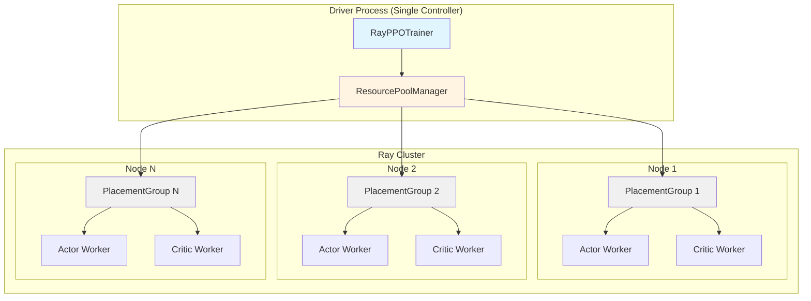
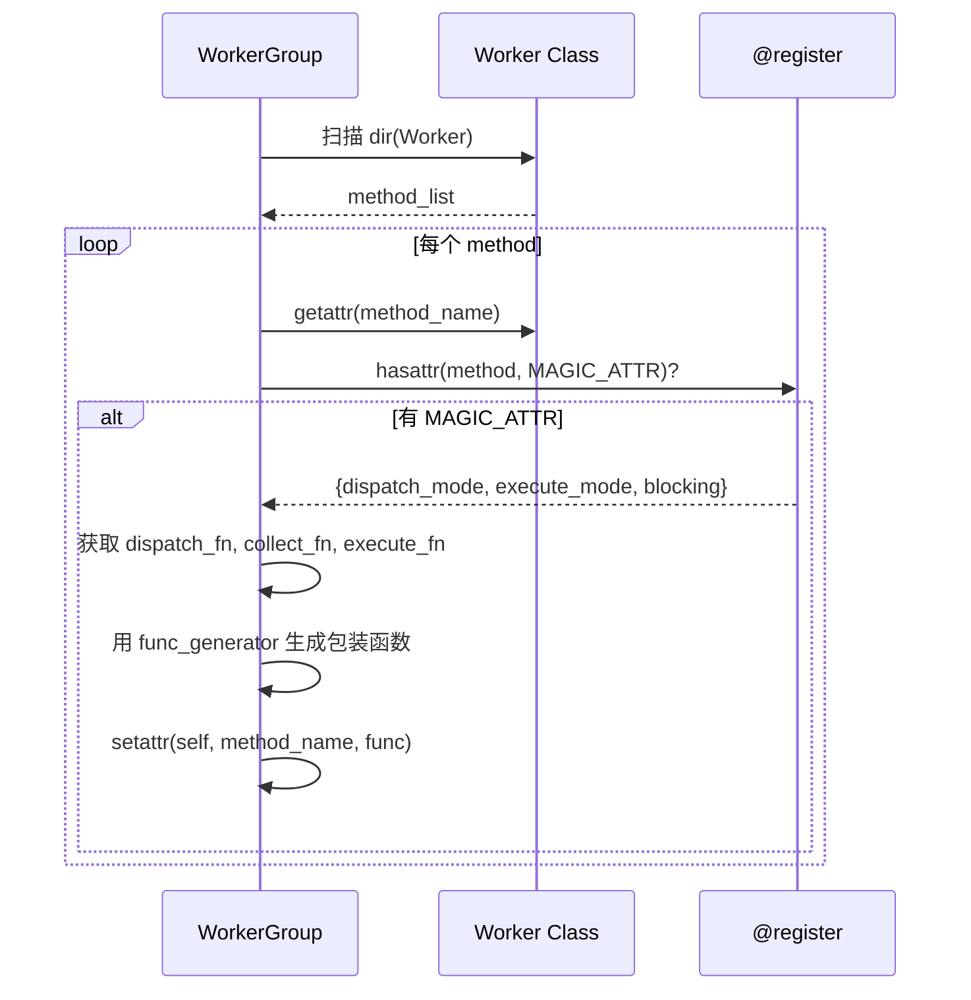
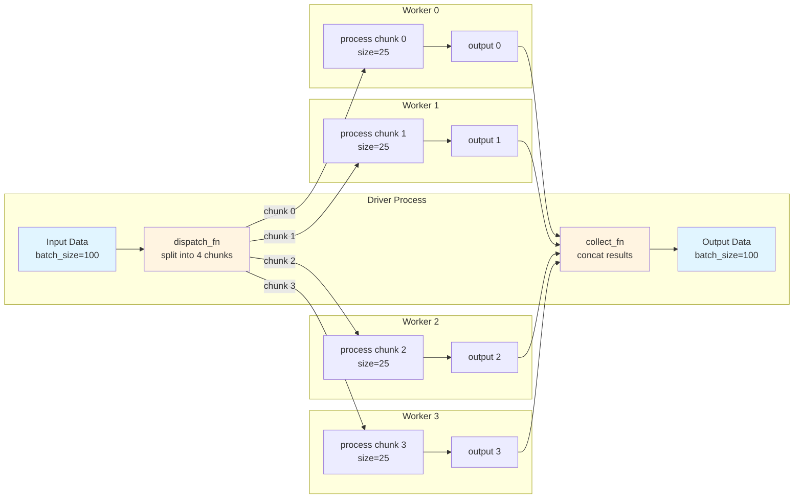
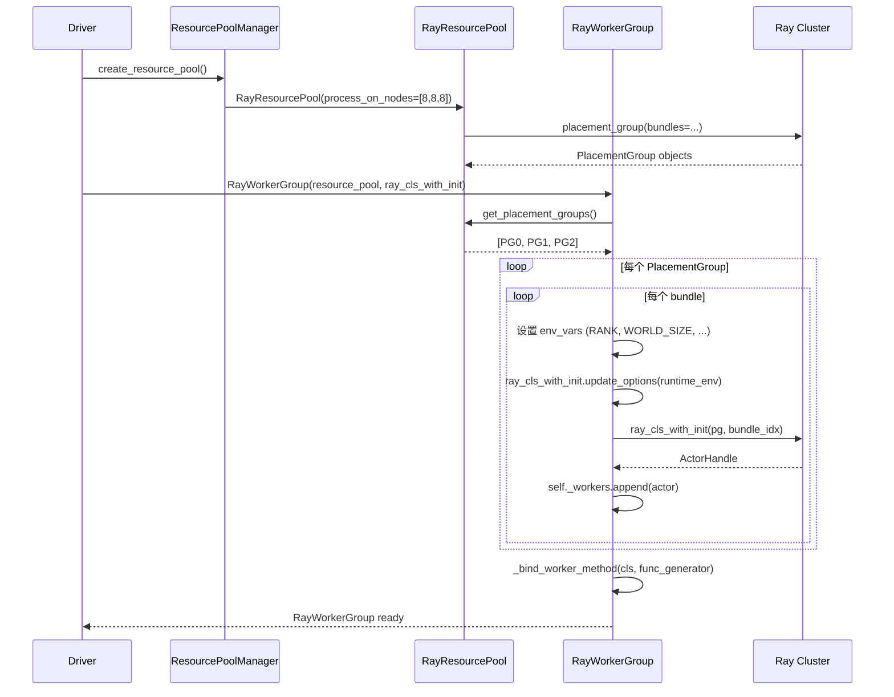
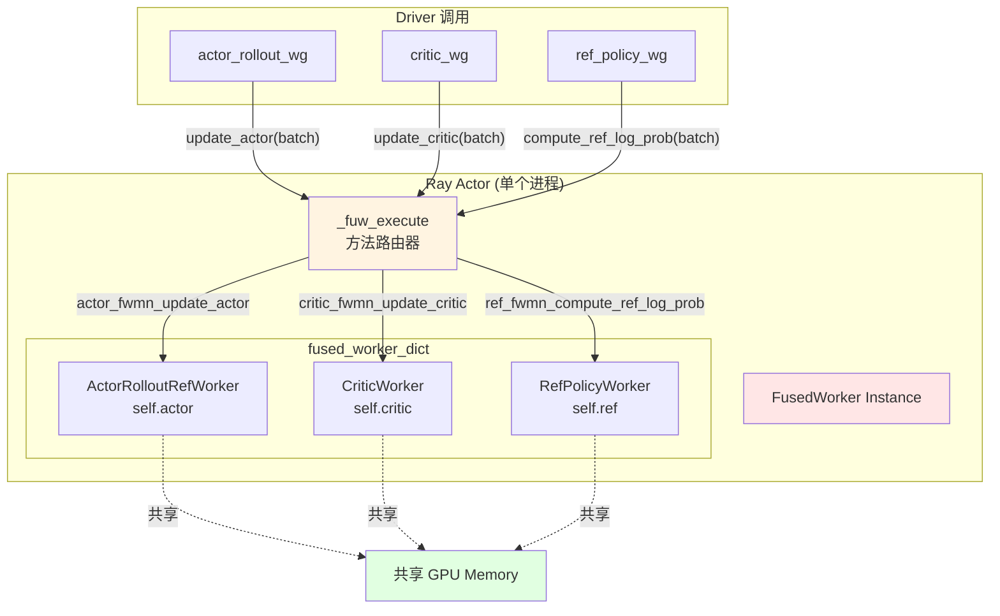
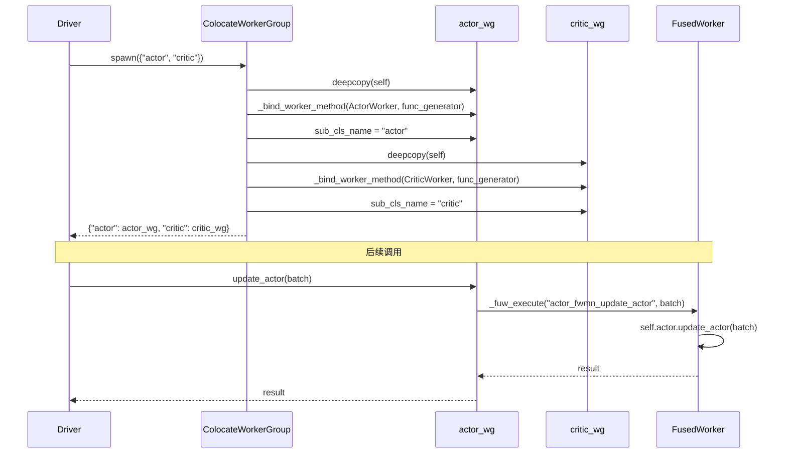
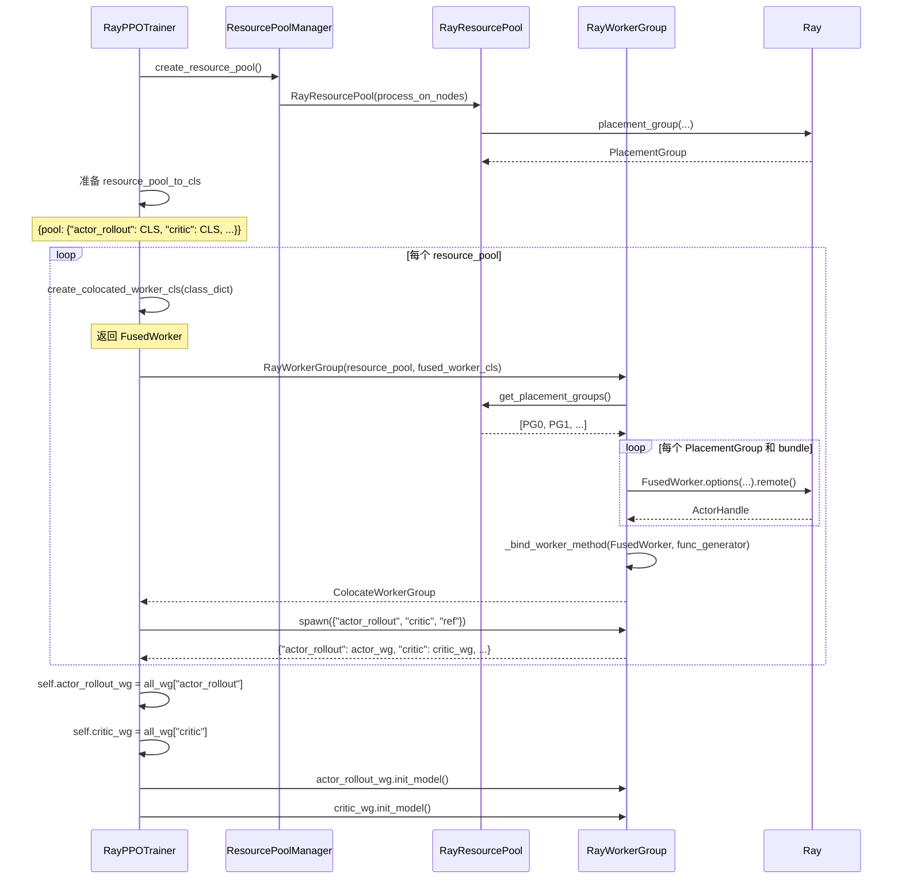
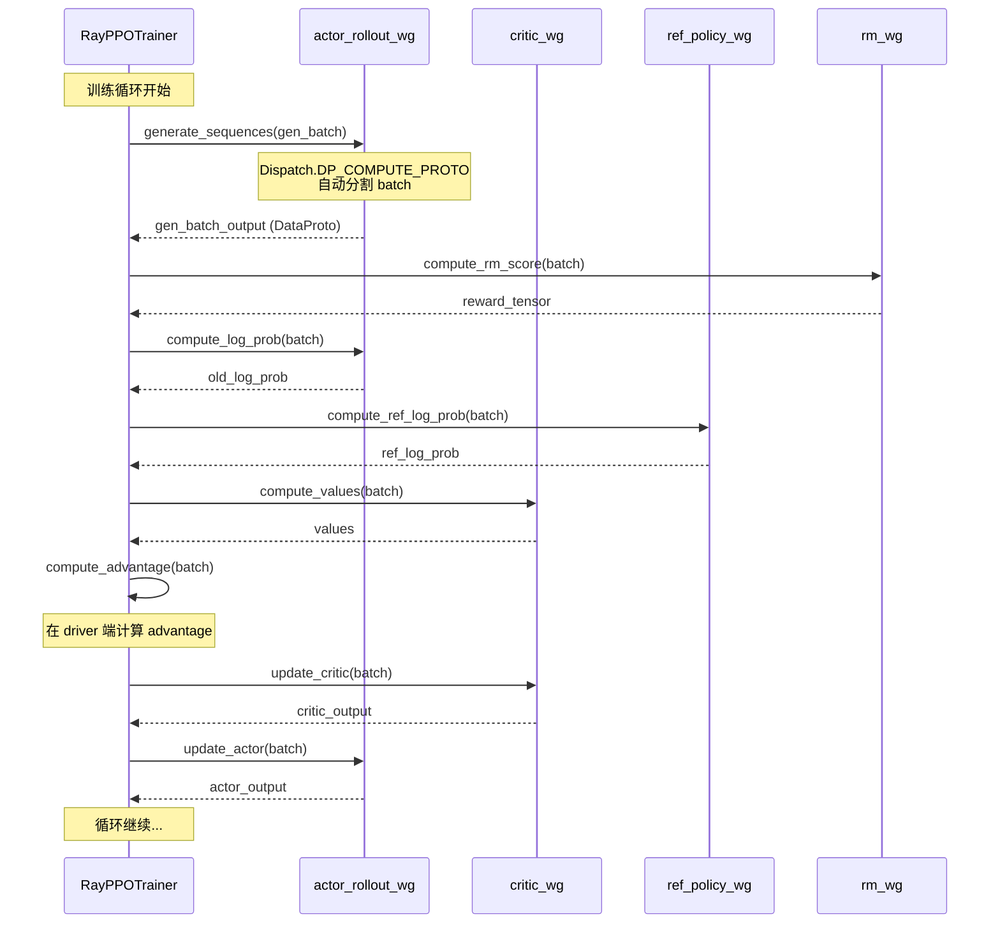

# VERL Ray & WorkerGroup 架构深度解析

> **文档目标**：深入讲解 verl 训练流程中对 Ray 的使用和 WorkerGroup 抽象机制，帮助理解代码架构并快速定位修改点。

---

## 目录

1. [概览](#1-概览-overview)
2. [核心抽象层](#2-核心抽象层-core-abstractions)
3. [装饰器机制](#3-装饰器机制-decorator-system)
4. [Ray 实现层](#4-ray-实现层-ray-implementation)
5. [FusedWorker 机制](#5-fusedworker-机制-tricky-implementation)
6. [训练流程集成](#6-训练流程集成-training-integration)
7. [具体 Worker 实现示例](#7-具体-worker-实现示例)
8. [Ray Utilities](#8-ray-utilities)
9. [扩展指南](#9-扩展指南-extension-guide)

---

## 1. 概览 (Overview)

### 1.1 VERL 分布式架构

VERL (Volcano Engine Reinforcement Learning) 是一个分布式强化学习训练框架，使用 Ray 作为底层分布式调度引擎。核心设计理念是：

- **单控制器模式** (Single Controller)：主进程（driver）负责协调，worker 进程执行计算
- **WorkerGroup 抽象**：统一管理一组分布式 worker
- **角色分离**：Actor、Critic、RefPolicy、RewardModel 等不同角色由不同 WorkerGroup 管理

### 1.2 整体架构图



**关键点**：
- Driver 在单个 CPU 节点运行，负责数据流编排
- ResourcePoolManager 管理 GPU 资源池
- 每个 PlacementGroup 对应一组 GPU bundles
- Worker 是 Ray Actor，分布在不同节点

---

## 2. 核心抽象层 (Core Abstractions)

### 2.1 Worker 基类

**文件位置**: `verl/verl/single_controller/base/worker.py`

#### 核心代码片段

```python
# verl/verl/single_controller/base/worker.py

class Worker(WorkerHelper):
    """分布式 worker 基类，处理初始化、配置和分布式操作"""

    fused_worker_attr_name = "fused_worker_dict"

    def __init__(self, cuda_visible_devices=None) -> None:
        # 从环境变量构建 meta 信息
        import os

        self._setup_env_cuda_visible_devices()

        world_size = int(os.environ["WORLD_SIZE"])
        rank = int(os.environ["RANK"])
        self._rank = rank
        self._world_size = world_size

        master_addr = os.environ["MASTER_ADDR"]
        master_port = os.environ["MASTER_PORT"]

        # 存储配置
        store = {
            "_world_size": world_size,
            "_rank": rank,
            # ... 其他配置
        }
        self._configure_with_store(store=store)

        # FusedWorker 相关
        self.fused_worker_dict = {}
        self.__dispatch_dp_rank = {}
        self.__collect_dp_rank = {}
```

#### 讲解

**Worker 的职责**：
1. **环境变量管理**：从 Ray 传入的环境变量中提取分布式配置（RANK、WORLD_SIZE、MASTER_ADDR 等）
2. **设备管理**：处理 CUDA_VISIBLE_DEVICES、HIP_VISIBLE_DEVICES 等多种加速器的可见性设置
3. **Dispatch/Collect 信息注册**：存储每个 mesh_name 对应的 dp_rank 和是否参与 collect

**关键方法**：

```python
@register(dispatch_mode=Dispatch.ONE_TO_ALL)
def _query_dispatch_info(self, mesh_name: str):
    """查询给定 mesh 的 dispatch 信息（每个 rank 的 dp_rank）"""
    return self.__dispatch_dp_rank[mesh_name]

@register(dispatch_mode=Dispatch.ONE_TO_ALL)
def _query_collect_info(self, mesh_name: str):
    """查询给定 mesh 的 collect 信息（哪些 rank 参与收集）"""
    return self.__collect_dp_rank[mesh_name]
```

**修改点**：
- 如果需要添加新的环境变量，修改 `env_keys()` 类方法
- 如果需要支持新的加速器类型，修改 `_setup_env_cuda_visible_devices()`

---

### 2.2 WorkerGroup 基类

**文件位置**: `verl/verl/single_controller/base/worker_group.py`

#### 核心代码片段

```python
# verl/verl/single_controller/base/worker_group.py

class ResourcePool:
    """管理多节点的资源池，跟踪进程数量和 GPU 分配"""

    def __init__(self, process_on_nodes=None, max_colocate_count: int = 10,
                 n_gpus_per_node=8) -> None:
        if process_on_nodes is None:
            process_on_nodes = []
        self._store = process_on_nodes  # 每个节点的进程数，如 [8, 8, 8]
        self.max_colocate_count = max_colocate_count  # 最大共处进程数
        self.n_gpus_per_node = n_gpus_per_node

    @property
    def world_size(self):
        """所有节点的总进程数"""
        return sum(self._store)

    def local_world_size_list(self) -> list[int]:
        """返回每个进程的 local_world_size"""
        nested = [[lws for _ in range(lws)] for lws in self._store]
        return [item for row in nested for item in row]


class WorkerGroup:
    """管理一组分布式 worker 的基类"""

    fused_worker_execute_fn_name = "_fuw_execute"

    def __init__(self, resource_pool: ResourcePool, **kwargs) -> None:
        self._is_init_with_detached_workers = resource_pool is None
        self.fused_worker_used = False

        if resource_pool is not None:
            self._procecss_dispatch_config = resource_pool()
        else:
            self._procecss_dispatch_config = None

        self._workers = []
        self._worker_names = []

        self._dispatch_info = {}  # mesh_name -> dp_rank_mapping
        self._collect_info = {}   # mesh_name -> collect_mask

        self._master_addr = None
        self._master_port = None
```

#### 方法绑定机制

```python
def _bind_worker_method(self, user_defined_cls, func_generator):
    """将 user_defined_cls 中用 @register 装饰的方法绑定到 WorkerGroup"""
    method_names = []
    for method_name in dir(user_defined_cls):
        try:
            method = getattr(user_defined_cls, method_name)
            assert callable(method)
        except Exception:
            continue

        if hasattr(method, MAGIC_ATTR):
            # 这个方法被 @register 装饰了
            attribute = getattr(method, MAGIC_ATTR)
            dispatch_mode = attribute["dispatch_mode"]
            execute_mode = attribute["execute_mode"]
            blocking = attribute["blocking"]

            # 获取 dispatch_fn 和 collect_fn
            if isinstance(dispatch_mode, Dispatch):
                fn = get_predefined_dispatch_fn(dispatch_mode=dispatch_mode)
                dispatch_fn = fn["dispatch_fn"]
                collect_fn = fn["collect_fn"]
            else:
                # 自定义 dispatch
                dispatch_fn = dispatch_mode["dispatch_fn"]
                collect_fn = dispatch_mode["collect_fn"]

            # 获取 execute_fn
            execute_mode_dict = get_predefined_execute_fn(execute_mode=execute_mode)
            wg_execute_fn_name = execute_mode_dict["execute_fn_name"]
            execute_fn = getattr(self, wg_execute_fn_name)

            # 生成绑定的方法
            func = func_generator(
                self, method_name,
                dispatch_fn=dispatch_fn,
                collect_fn=collect_fn,
                execute_fn=execute_fn,
                blocking=blocking
            )

            # 绑定到 WorkerGroup
            setattr(self, method_name, func)
            method_names.append(method_name)

    return method_names
```

#### 讲解

**WorkerGroup 的核心职责**：
1. **Worker 生命周期管理**：创建、监控、销毁 worker
2. **方法自动绑定**：扫描 Worker 类中的 `@register` 装饰方法，自动生成对应的 WorkerGroup 方法
3. **Dispatch/Collect 缓存**：缓存每个 mesh 的 dispatch 和 collect 信息，避免重复查询

**方法绑定流程图**：



**修改点**：
- 如果需要添加新的 dispatch/collect 逻辑，在 `_bind_worker_method` 中扩展
- 如果需要自定义方法绑定策略，修改 `func_generator` 的实现

---

## 3. 装饰器机制 (Decorator System)

**文件位置**: `verl/verl/single_controller/base/decorator.py`

这是 VERL 最核心、最 tricky 的部分之一。

### 3.1 @register 装饰器

#### 核心代码

```python
# verl/verl/single_controller/base/decorator.py

MAGIC_ATTR = "attrs_3141562937"  # 魔法属性名，避免与用户定义冲突

def register(dispatch_mode=Dispatch.ALL_TO_ALL,
             execute_mode=Execute.ALL,
             blocking=True,
             materialize_futures=True):
    """注册函数，配置分布式执行参数

    Args:
        dispatch_mode: 数据分发模式（如何将数据分配给各 worker）
        execute_mode: 执行模式（ALL 或 RANK_ZERO）
        blocking: 是否阻塞等待结果
        materialize_futures: 是否在 dispatch 前物化 DataProtoFuture
    """
    _check_dispatch_mode(dispatch_mode=dispatch_mode)
    _check_execute_mode(execute_mode=execute_mode)

    def decorator(func):
        @wraps(func)
        def inner(*args, **kwargs):
            if materialize_futures:
                args, kwargs = _materialize_futures(*args, **kwargs)
            return func(*args, **kwargs)

        @wraps(func)
        async def async_inner(*args, **kwargs):
            if materialize_futures:
                args, kwargs = _materialize_futures(*args, **kwargs)
            return await func(*args, **kwargs)

        wrapper = async_inner if inspect.iscoroutinefunction(func) else inner

        # 关键：在函数上附加元数据
        attrs = {
            "dispatch_mode": dispatch_mode,
            "execute_mode": execute_mode,
            "blocking": blocking
        }
        setattr(wrapper, MAGIC_ATTR, attrs)
        return wrapper

    return decorator
```

#### 讲解

**装饰器的作用**：
1. 将 dispatch/execute 配置元数据附加到方法上
2. WorkerGroup 扫描这些元数据，自动生成分布式调用逻辑
3. 可选地物化 Future 对象（Ray ObjectRef）

**使用示例**：

```python
class MyWorker(Worker):
    @register(dispatch_mode=Dispatch.DP_COMPUTE_PROTO, execute_mode=Execute.ALL)
    def train_step(self, batch: DataProto):
        # batch 会被自动 split 到各个 dp_rank
        loss = self.model(batch)
        return loss
```

---

### 3.2 Dispatch 模式详解

#### Dispatch 枚举

```python
class Dispatch(DynamicEnum):
    """分发模式枚举"""
    _registry = {}
    _next_value = 0

# 预定义的模式
Dispatch.register("RANK_ZERO")       # 只发送给 rank 0
Dispatch.register("ONE_TO_ALL")      # 相同数据发送给所有 rank
Dispatch.register("ALL_TO_ALL")      # 数据已按 rank 组织好
Dispatch.register("DP_COMPUTE")      # 数据已按 dp_size 分割
Dispatch.register("DP_COMPUTE_PROTO")  # DataProto 自动按 dp_size 分割
Dispatch.register("DP_COMPUTE_PROTO_WITH_FUNC")  # 带函数的 DataProto 分割
Dispatch.register("DP_COMPUTE_METRIC")  # 分割但不合并结果
Dispatch.register("DIRECT_ROLLOUT_METHOD")  # vLLM 特殊模式
```

#### 关键 Dispatch 函数

##### (1) ONE_TO_ALL - 广播模式

```python
def dispatch_one_to_all(worker_group, *args, **kwargs):
    """将相同的参数广播给所有 worker"""
    args = tuple([arg] * worker_group.world_size for arg in args)
    kwargs = {k: [v] * worker_group.world_size for k, v in kwargs.items()}
    return args, kwargs
```

**使用场景**：配置更新、模型初始化等所有 worker 需要相同数据的场景。

##### (2) DP_COMPUTE_PROTO - 数据并行自动分割

```python
def dispatch_dp_compute_data_proto(worker_group, *args, **kwargs):
    """自动将 DataProto 分割成 world_size 份，支持自动 padding"""
    assert isinstance(worker_group, WorkerGroup)

    # 自动 padding 到能被 world_size 整除
    splitted_args, splitted_kwargs = _split_args_kwargs_data_proto_with_auto_padding(
        worker_group.world_size,
        *args,
        **kwargs,
    )
    return splitted_args, splitted_kwargs


def _split_args_kwargs_data_proto_with_auto_padding(chunks, *args, **kwargs):
    """带自动 padding 的分割"""
    from verl.protocol import DataProto, DataProtoFuture

    data_proto_len = None
    padding_size = None

    def _padding_and_split_data(obj, chunks):
        nonlocal data_proto_len, padding_size
        assert isinstance(obj, DataProto | DataProtoFuture)

        if isinstance(obj, DataProto) and obj.is_padding_enabled():
            # 只有启用 padding 的 DataProto 才会 padding
            if data_proto_len is None:
                data_proto_len = len(obj)
                # 计算需要 padding 的大小
                padding_size = (chunks - (data_proto_len % chunks)) if (data_proto_len % chunks > 0) else 0
            else:
                assert data_proto_len == len(obj)

            obj.padding(padding_size=padding_size)

        return obj.chunk(chunks=chunks)

    splitted_args = [_padding_and_split_data(arg, chunks) for arg in args]
    splitted_kwargs = {key: _padding_and_split_data(val, chunks) for key, val in kwargs.items()}

    # 将 padding_size 传递给 kwargs，后续 collect 时需要 unpad
    if padding_size is not None:
        splitted_kwargs[_padding_size_key] = padding_size

    return splitted_args, splitted_kwargs
```

**关键点**：
- 自动 padding 到能被 `world_size` 整除
- padding_size 通过特殊 key (`_padding_size_key`) 传递给 collect 函数
- 收集时自动 unpad

##### (3) Lazy Dispatch - 延迟查询 dp_rank

```python
def dispatch_lazy_compute_data_proto(mesh_name, worker_group, *args, **kwargs):
    """延迟查询 mesh 的 dp_rank 映射，然后按映射分发数据"""
    assert isinstance(worker_group, WorkerGroup)

    # 如果还没缓存 dispatch_info，则查询所有 worker
    if mesh_name not in worker_group._dispatch_info:
        worker_group._dispatch_info[mesh_name] = worker_group._query_dispatch_info(mesh_name)
        assert len(worker_group._dispatch_info[mesh_name]) == worker_group.world_size

    dp_rank_mapping = worker_group._dispatch_info[mesh_name]
    dp_size = max(dp_rank_mapping) + 1

    # 使用 nd_compute 进行分发
    return dispatch_nd_compute_dataproto(dp_rank_mapping, dp_size, worker_group, *args, **kwargs)


def dispatch_nd_compute_dataproto(dp_rank_mapping: list[int], dp_size, worker_group, *args, **kwargs):
    """按 dp_rank_mapping 重新组织数据

    例如：dp_rank_mapping = [0, 1, 0, 1]，表示 4 个 worker，分成 2 个 dp_rank
         原始数据 split 成 2 份，然后 worker 0 和 2 拿第 0 份，worker 1 和 3 拿第 1 份
    """
    # 1. 先 split 成 dp_size 份
    splitted_args, splitted_kwargs = _split_args_kwargs_data_proto(dp_size, *args, **kwargs)

    # 2. 按 dp_rank_mapping 重新映射
    return dispatch_nd_compute(dp_rank_mapping, dp_size, worker_group, *splitted_args, **splitted_kwargs)


def dispatch_nd_compute(dp_rank_mapping: list[int], dp_size, worker_group, *args, **kwargs):
    """按 dp_rank_mapping 分配数据，支持 Ray parallel_put 优化"""
    import os
    from verl.utils.ray_utils import parallel_put

    # 并行 put 数据到 Ray object store
    max_workers = max(1, min(len(args[0]), os.cpu_count()))
    args = [parallel_put(arg, max_workers=max_workers) for arg in args]
    kwargs = {k: parallel_put(v, max_workers=max_workers) for k, v in kwargs.items()}

    # 重新映射：每个 global_rank 对应一个 dp_rank
    all_args = []
    for arg in args:
        assert len(arg) == dp_size
        transformed_args = []
        for i in range(worker_group.world_size):
            local_dp_rank = dp_rank_mapping[i]
            transformed_args.append(arg[local_dp_rank])
        all_args.append(transformed_args)

    all_kwargs = {}
    for k, v in kwargs.items():
        assert len(v) == dp_size
        transformed_v = []
        for i in range(worker_group.world_size):
            local_dp_rank = dp_rank_mapping[i]
            transformed_v.append(v[local_dp_rank])
        all_kwargs[k] = transformed_v

    return tuple(all_args), all_kwargs
```

**使用场景**：复杂的并行策略（如 3D 并行）中，不同 worker 可能对应不同的 dp_rank。

#### Collect 函数

```python
def collect_dp_compute_data_proto(worker_group, output):
    """收集各 worker 的 DataProto 并 concat"""
    import ray
    from verl.protocol import DataProto

    # 检查类型
    for o in output:
        assert isinstance(o, DataProto | ray.ObjectRef)

    output = collect_dp_compute(worker_group, output)
    return _concat_data_proto_or_future(output)


def _concat_data_proto_or_future(output: list):
    """合并 DataProto 或 Future"""
    import ray
    from verl.protocol import DataProto, DataProtoFuture

    # 确保类型一致
    for o in output:
        assert type(o) is type(output[0])

    o = output[0]
    if isinstance(o, DataProto):
        return DataProto.concat(output)
    elif isinstance(o, ray.ObjectRef):
        return DataProtoFuture.concat(output)
    else:
        raise NotImplementedError
```

### 3.3 Dispatch/Collect 数据流图



### 3.4 自定义 Dispatch 模式

```python
# 注册自定义 dispatch 模式
def my_custom_dispatch(worker_group, *args, **kwargs):
    # 自定义分发逻辑
    return transformed_args, transformed_kwargs

def my_custom_collect(worker_group, output):
    # 自定义收集逻辑
    return aggregated_output

register_dispatch_mode(
    dispatch_mode_name="MY_CUSTOM_MODE",
    dispatch_fn=my_custom_dispatch,
    collect_fn=my_custom_collect
)

# 使用
class MyWorker(Worker):
    @register(dispatch_mode=Dispatch.MY_CUSTOM_MODE)
    def my_method(self, data):
        return process(data)
```

**修改点**：
- 新增 dispatch 模式：调用 `register_dispatch_mode()`
- 修改现有 dispatch 逻辑：在 `verl/verl/single_controller/base/decorator.py` 中修改对应函数
- 查看所有注册的模式：`DISPATCH_MODE_FN_REGISTRY`

---

## 4. Ray 实现层 (Ray Implementation)

**文件位置**: `verl/verl/single_controller/ray/base.py`

### 4.1 RayResourcePool

#### 核心代码

```python
# verl/verl/single_controller/ray/base.py

class RayResourcePool(ResourcePool):
    """Ray 资源池，管理 PlacementGroup"""

    def __init__(
        self,
        process_on_nodes: Optional[list[int]] = None,
        use_gpu: bool = True,
        name_prefix: str = None,
        max_colocate_count: int = 10,
        detached=False,
        accelerator_type: Optional[str] = None,
    ) -> None:
        super().__init__(process_on_nodes, max_colocate_count)
        self.use_gpu = use_gpu
        self.name_prefix = get_random_string(length=6) if name_prefix is None else name_prefix
        self.pgs = None  # PlacementGroup 列表
        self.detached = detached
        self.accelerator_type = accelerator_type

    def get_placement_groups(self, strategy="STRICT_PACK", name=None, device_name="cuda"):
        """创建或获取 PlacementGroup"""
        if self.pgs is not None:
            return self.pgs

        pg_name_prefix = name if name else f"{self.name_prefix}verl_group_..."

        # 设置设备类型
        if device_name == "npu":
            device_name = "NPU"
        elif device_name == "cuda":
            device_name = "GPU"

        # 构建 bundle 配置
        bundle = {"CPU": self.max_colocate_count}
        if self.use_gpu:
            bundle[device_name] = 1
            if self.accelerator_type is not None:
                bundle[self.accelerator_type] = 1e-4

        # 每个节点创建一个 PlacementGroup
        pg_scheme = [[bundle.copy() for _ in range(process_count)]
                     for process_count in self._store]

        lifetime = "detached" if self.detached else None

        pgs = [
            placement_group(
                bundles=bundles,
                strategy=strategy,
                name=pg_name_prefix + str(idx),
                lifetime=lifetime
            )
            for idx, bundles in enumerate(pg_scheme)
        ]

        # 等待所有 PG ready
        ray.get([pg.ready() for pg in pgs])

        self.pgs = pgs
        return pgs
```

#### 讲解

**PlacementGroup 的作用**：
- Ray 的资源调度单元，确保一组 Actor 分配到特定的资源束上
- `STRICT_PACK` 策略：强制所有 bundle 在同一节点
- `PACK` 策略：尽量在同一节点，允许跨节点

**示例配置**：
```python
# process_on_nodes = [8, 8, 8] 表示 3 个节点，每个节点 8 个进程
# 会创建 3 个 PlacementGroup：
# PG 0: 8 bundles on Node 0
# PG 1: 8 bundles on Node 1
# PG 2: 8 bundles on Node 2

# 每个 bundle:
{
    "CPU": 10,     # max_colocate_count
    "GPU": 1,      # 一个 GPU
}
```

#### PlacementGroup 排序

```python
def sort_placement_group_by_node_ip(pgs: list[PlacementGroup]) -> list[PlacementGroup]:
    """按节点 IP 排序 PlacementGroup，确保 RANK 跨 job 一致性"""
    node_ip = {node["NodeID"]: node["NodeManagerAddress"] for node in ray.nodes()}
    pg_ip = {}
    for pg in pgs:
        specs = ray._private.state.state.placement_group_table(pg.id)
        node_id = specs["bundles_to_node_id"][0]
        pg_ip[pg.id] = node_ip[node_id]
    return sorted(pgs, key=lambda pg: pg_ip[pg.id])
```

**为什么需要排序**：
- FSDP checkpoint 保存时，RANK 与本地存储路径绑定
- 如果重启后 RANK 顺序变化，会导致 checkpoint 加载错误
- 按 IP 排序保证确定性的 RANK 分配

---

### 4.2 RayClassWithInitArgs

#### 核心代码

```python
class RayClassWithInitArgs(ClassWithInitArgs):
    """Ray Actor 的延迟实例化包装类"""

    def __init__(self, cls, *args, **kwargs) -> None:
        super().__init__(cls, *args, **kwargs)
        self._options = {}
        self._additional_resource = {}

    def set_additional_resource(self, additional_resource):
        """设置额外资源需求"""
        self._additional_resource = additional_resource

    def update_options(self, options: dict):
        """更新 Ray Actor options"""
        self._options.update(options)

    def __call__(
        self,
        placement_group,
        placement_group_bundle_idx,
        use_gpu: bool = True,
        num_gpus=1,
        sharing_with=None,
        device_name="cuda",
    ):
        """实际创建 Ray Actor"""
        if sharing_with is not None:
            # 与其他 Actor 共享节点
            target_node_id = ray.get(sharing_with.get_node_id.remote())
            visible_devices = ray.get(sharing_with.get_cuda_visible_devices.remote())
            options = {
                "scheduling_strategy": NodeAffinitySchedulingStrategy(
                    node_id=target_node_id, soft=False
                )
            }
            return self.cls.options(**options).remote(
                *self.args,
                cuda_visible_devices=visible_devices,
                **self.kwargs
            )

        # 使用 PlacementGroup 调度
        options = {
            "scheduling_strategy": PlacementGroupSchedulingStrategy(
                placement_group=placement_group,
                placement_group_bundle_index=placement_group_bundle_idx
            )
        }
        options.update(self._options)

        if use_gpu and device_name == "cuda":
            options["num_gpus"] = num_gpus
        if use_gpu and device_name == "npu":
            options["resources"] = {"NPU": num_gpus}

        if len(self._additional_resource) > 1:
            for k, v in self._additional_resource.items():
                options[k] = v

        return self.cls.options(**options).remote(*self.args, **self.kwargs)
```

#### 讲解

**为什么需要延迟实例化**：
1. 在 Driver 端配置 Actor 的参数
2. 在 Worker 端（remote）实际创建 Actor
3. 支持灵活的资源配置（runtime_env、num_gpus 等）

**使用示例**：

```python
# Driver 端
actor_cls = RayClassWithInitArgs(
    cls=ray.remote(MyWorker),
    config=config,
    role="actor"
)
actor_cls.update_options({
    "runtime_env": {"env_vars": {"CUDA_VISIBLE_DEVICES": "0"}},
    "name": "my_actor_0"
})

# 稍后在 RayWorkerGroup 中调用
actor = actor_cls(
    placement_group=pg,
    placement_group_bundle_idx=0,
    use_gpu=True,
    num_gpus=1
)
```

---

### 4.3 RayWorkerGroup

#### 核心代码

```python
class RayWorkerGroup(WorkerGroup):
    """Ray Worker 组管理类"""

    def __init__(
        self,
        resource_pool: RayResourcePool = None,
        ray_cls_with_init: RayClassWithInitArgs = None,
        bin_pack: bool = True,
        name_prefix: str = None,
        detached=False,
        worker_names=None,
        worker_handles: list[ray.actor.ActorHandle] = None,
        **kwargs,
    ) -> None:
        super().__init__(resource_pool=resource_pool, **kwargs)
        self.ray_cls_with_init = ray_cls_with_init
        self.name_prefix = get_random_string(length=6) if name_prefix is None else name_prefix

        self.fused_worker_used = ray_cls_with_init.fused_worker_used
        self.sub_cls_name = ""
        self.device_name = kwargs.get("device_name", "cuda")

        if self._is_init_with_detached_workers:
            # 从已存在的 detached workers 初始化
            self._init_with_detached_workers(worker_names, worker_handles)
        else:
            # 从头创建 workers
            self._init_with_resource_pool(resource_pool, ray_cls_with_init, bin_pack, detached)

        if ray_cls_with_init is not None:
            # 绑定方法
            self._bind_worker_method(self.ray_cls_with_init.cls, func_generator)

    def _init_with_resource_pool(self, resource_pool, ray_cls_with_init, bin_pack, detached, worker_env=None):
        """从 ResourcePool 创建 workers"""
        use_gpu = resource_pool.use_gpu

        strategy = "PACK"
        if bin_pack:
            strategy = "STRICT_PACK"

        pgs = resource_pool.get_placement_groups(strategy=strategy, device_name=self.device_name)
        world_size = resource_pool.world_size
        self._world_size = world_size

        num_gpus = 1 / resource_pool.max_colocate_count  # 每个 worker 的 GPU 份额

        rank = -1
        local_world_size = resource_pool.store[0]

        for pg_idx, pg in enumerate(sort_placement_group_by_node_ip(pgs)):
            if pg_idx == 0:
                self._get_master_addr_port(pg)

            for local_rank in range(local_world_size):
                rank += 1

                # 设置环境变量
                env_vars = {
                    "WORLD_SIZE": str(world_size),
                    "RANK": str(rank),
                    "WG_PREFIX": self.name_prefix,
                    "WG_BACKEND": "ray",
                    "RAY_LOCAL_WORLD_SIZE": str(local_world_size),
                    "MASTER_ADDR": self._master_addr,
                    "MASTER_PORT": self._master_port,
                }

                if worker_env is not None:
                    env_vars.update(worker_env)

                # Actor name
                cia_name = type(ray_cls_with_init.cls).__name__
                match = re.search(r"ActorClass\(([^)]+)\)", cia_name)
                cia_name = match.group(1) if match else cia_name
                name = f"{self.name_prefix}{cia_name}_{pg_idx}:{local_rank}"

                ray_cls_with_init.update_options({
                    "runtime_env": {"env_vars": env_vars},
                    "name": name
                })

                if detached:
                    ray_cls_with_init.update_options({"lifetime": "detached"})

                # 创建 worker
                worker = ray_cls_with_init(
                    placement_group=pg,
                    placement_group_bundle_idx=local_rank,
                    use_gpu=use_gpu,
                    num_gpus=num_gpus,
                    device_name=self.device_name,
                )
                self._workers.append(worker)
                self._worker_names.append(name)
```

#### Worker 创建流程图



#### 执行方法

```python
def execute_all_async(self, method_name: str, *args, **kwargs):
    """异步执行所有 worker 的方法"""
    length = len(self._workers)

    # 如果 args 和 kwargs 都是 list，且长度匹配 worker 数量，则分发
    if all(isinstance(arg, list) for arg in args) and \
       all(isinstance(kwarg, list) for kwarg in kwargs.values()):
        if all(len(arg) == length for arg in args) and \
           all(len(kwarg) == length for kwarg in kwargs.values()):
            result = []
            for i in range(length):
                sliced_args = tuple(arg[i] for arg in args)
                sliced_kwargs = {k: v[i] for k, v in kwargs.items()}
                result.append(
                    self._execute_remote_single_worker(
                        self._workers[i], method_name, *sliced_args, **sliced_kwargs
                    )
                )
            return result

    # 否则，所有 worker 执行相同参数
    return [
        self._execute_remote_single_worker(worker, method_name, *args, **kwargs)
        for worker in self._workers
    ]


def _execute_remote_single_worker(self, worker, method_name: str, *args, **kwargs):
    """执行单个 worker 的方法"""
    if self.fused_worker_used and method_name not in self.method_names:
        # FusedWorker 模式：通过 _fuw_execute 路由
        remote_call = getattr(worker, self.fused_worker_execute_fn_name)
        return remote_call.remote(f"{self.sub_cls_name}_fwmn_{method_name}", *args, **kwargs)

    # 普通模式：直接调用
    remote_call = getattr(worker, method_name)
    return remote_call.remote(*args, **kwargs)
```

#### func_generator - 方法包装器

```python
def func_generator(self, method_name, dispatch_fn, collect_fn, execute_fn, blocking):
    """生成 WorkerGroup 上的方法包装器"""
    class Functor:
        def __call__(this, *args, **kwargs):
            # 1. Dispatch: 分发数据
            args, kwargs = dispatch_fn(self, *args, **kwargs)

            # 2. 提取 padding_count
            padding_count = kwargs.pop(_padding_size_key, 0)

            # 3. Execute: 执行远程方法
            output = execute_fn(method_name, *args, **kwargs)

            # 4. Blocking: 等待结果
            if blocking:
                output = ray.get(output)

            # 5. Collect: 收集结果
            output = collect_fn(self, output)

            # 6. Unpad: 移除 padding
            if padding_count > 0:
                if isinstance(output, DataProto):
                    indices = [i for i in range(len(output))][:-padding_count]
                    output = output.select_idxs(indices)
                elif isinstance(output, list):
                    output = output[:-padding_count]

            return output

    # 使用类型来命名，增强可观测性
    return type(method_name, (Functor,), {})()
```

**调用链路**：

```
WorkerGroup.method(data)
  ├─ dispatch_fn(data) -> [chunk0, chunk1, ...]
  ├─ execute_fn("method", chunks)
  │   └─ [worker0.method.remote(chunk0), worker1.method.remote(chunk1), ...]
  ├─ ray.get([ref0, ref1, ...]) (if blocking=True)
  └─ collect_fn([output0, output1, ...]) -> merged_output
```

---

## 5. FusedWorker 机制 (Tricky Implementation)

**文件位置**: `verl/verl/single_controller/ray/base.py`

这是 VERL 中最复杂、最 tricky 的设计之一。

### 5.1 问题背景

**为什么需要 FusedWorker**：
- 在 PPO 训练中，Actor、Critic、RefPolicy 通常需要共享同一个 GPU
- 如果分别创建 3 个 Ray Actor，会导致：
  - GPU 内存浪费（每个 Actor 独立申请）
  - 通信开销（跨 Actor 传递大模型的 embedding）
  - 调度复杂（需要确保 3 个 Actor 在同一 GPU）

**FusedWorker 的解决方案**：
- 将多个 Worker 类（Actor、Critic、RefPolicy）融合到一个 Ray Actor 中
- 共享 GPU 内存、共享模型 backbone
- 通过方法路由机制，区分不同角色的方法调用

### 5.2 核心实现

#### create_colocated_worker_raw_cls

```python
def create_colocated_worker_raw_cls(class_dict: dict[str, RayClassWithInitArgs]):
    """创建 FusedWorker 原始类

    Args:
        class_dict: {"actor": ActorCIA, "critic": CriticCIA, "ref": RefPolicyCIA}

    Returns:
        FusedWorker 类（未 remote）
    """
    raw_cls_dict = {cls_name: _unwrap_ray_remote(cia.cls)
                    for cls_name, cia in class_dict.items()}
    init_args_dict = {cls_name: cia.args for cls_name, cia in class_dict.items()}
    init_kwargs_dict = {cls_name: cia.kwargs for cls_name, cia in class_dict.items()}
    cls_names = list(class_dict.keys())

    # 生成类名：FusedWorker_Actor_Critic_Ref
    class_name_renamed = "_".join([FusedWorkerCLSName] + cls_names)

    class FusedWorker(Worker):
        """动态生成的 FusedWorker 类"""

        def __init__(self, *args, **kwargs):
            super().__init__(*args, **kwargs)
            self.cls_names = cls_names
            self.raw_cls_dict = raw_cls_dict
            self.init_args_dict = init_args_dict
            self.init_kwargs_dict = init_kwargs_dict

            # 实例化每个子 worker
            for cls_name, udc, ud_args, ud_kwargs in zip(
                self.cls_names,
                self.raw_cls_dict.values(),
                self.init_args_dict.values(),
                self.init_kwargs_dict.values(),
                strict=True,
            ):
                with temp_env_var("DISABLE_WORKER_INIT", "1"):
                    # 注入魔法方法，用于生成方法名
                    udc._get_ray_actor_cls_name = lambda x, name_renamed=class_name_renamed: name_renamed
                    udc._get_ray_method_prefix = lambda x, name_prefixed=cls_name: f"{name_prefixed}_"

                    # 实例化子 worker
                    self.fused_worker_dict[cls_name] = udc(*ud_args, **ud_kwargs)
                    setattr(self, cls_name, self.fused_worker_dict[cls_name])

            # 让每个子 worker 可以访问其他子 worker
            for _, worker in self.fused_worker_dict.items():
                setattr(worker, Worker.fused_worker_attr_name, self.fused_worker_dict)

        def _fuw_execute(self, method_name: str, *args, **kwargs):
            """FusedWorker 的方法路由

            method_name 格式: "{cls_name}_fwmn_{method_name}"
            例如: "actor_fwmn_update_actor"
            """
            names = method_name.split("_fwmn_")
            cls_name = names[0]  # "actor"
            method_name = names[1]  # "update_actor"

            assert cls_name in self.fused_worker_dict
            udc_method = getattr(self.fused_worker_dict[cls_name], method_name)
            return udc_method(*args, **kwargs)

    # 重命名类
    renamed_fused_worker_cls = type(class_name_renamed, (FusedWorker,), {})
    renamed_fused_worker_cls.is_fused_worker = True
    renamed_fused_worker_cls.raw_cls_dict = raw_cls_dict

    return renamed_fused_worker_cls
```

#### create_colocated_worker_cls_fused

```python
def create_colocated_worker_cls_fused(class_dict: dict[str, RayClassWithInitArgs]):
    """创建 FusedWorker 的 RayClassWithInitArgs 包装

    Returns:
        RayClassWithInitArgs(FusedWorker)，标记 fused_worker_used=True
    """
    raw_colocated_worker_cls = create_colocated_worker_raw_cls(class_dict)

    remote_cls = ray.remote(raw_colocated_worker_cls)
    cia = RayClassWithInitArgs(cls=remote_cls)
    cia.fused_worker_used = True

    return cia
```

### 5.3 FusedWorker 架构图



### 5.4 spawn() 和 fuse() 机制

#### spawn_fused

```python
def spawn_fused(self, prefix_set):
    """从 ColocateWorkerGroup 派生出多个独立的 WorkerGroup

    Args:
        prefix_set: {"actor", "critic", "ref"}

    Returns:
        {"actor": actor_wg, "critic": critic_wg, "ref": ref_wg}
    """
    wg_dict = dict()
    for key in prefix_set:
        # 深拷贝当前 WorkerGroup
        new_wg = deepcopy(self)

        # 重新绑定方法：只绑定 key 对应的子类的方法
        new_wg._bind_worker_method(
            self.ray_cls_with_init.cls.raw_cls_dict[key],  # 子类
            func_generator
        )
        new_wg.sub_cls_name = key
        wg_dict[key] = new_wg

    return wg_dict
```

**spawn 后的效果**：

```python
# 创建 ColocateWorkerGroup
colocate_wg = RayWorkerGroup(
    resource_pool=resource_pool,
    ray_cls_with_init=fused_worker_cls,  # FusedWorker
)

# spawn 出独立的 WorkerGroup
wg_dict = colocate_wg.spawn({"actor", "critic", "ref"})

actor_wg = wg_dict["actor"]    # 只有 actor 的方法
critic_wg = wg_dict["critic"]  # 只有 critic 的方法
ref_wg = wg_dict["ref"]        # 只有 ref 的方法

# 调用
actor_wg.update_actor(batch)  # 实际调用 FusedWorker._fuw_execute("actor_fwmn_update_actor", batch)
```

#### spawn 流程图



### 5.5 使用示例

```python
# 在 RayPPOTrainer.init_workers() 中

# 1. 为每个 resource_pool 创建 class_dict
resource_pool_to_cls = {pool: {} for pool in resource_pool_manager.resource_pool_dict.values()}

resource_pool = resource_pool_manager.get_resource_pool(Role.ActorRollout)
actor_rollout_cls = RayClassWithInitArgs(
    cls=self.role_worker_mapping[Role.ActorRollout],
    config=self.config.actor_rollout_ref,
    role="actor_rollout",
)
resource_pool_to_cls[resource_pool]["actor_rollout"] = actor_rollout_cls

# critic, ref_policy 也类似...

# 2. 创建 colocated worker
for resource_pool, class_dict in resource_pool_to_cls.items():
    worker_dict_cls = create_colocated_worker_cls(class_dict=class_dict)  # 返回 FusedWorker
    wg_dict = self.ray_worker_group_cls(
        resource_pool=resource_pool,
        ray_cls_with_init=worker_dict_cls,
    )
    spawn_wg = wg_dict.spawn(prefix_set=class_dict.keys())  # {"actor_rollout", "critic", "ref"}
    all_wg.update(spawn_wg)

# 3. 分别使用
self.actor_rollout_wg = all_wg["actor_rollout"]
self.critic_wg = all_wg["critic"]
self.ref_policy_wg = all_wg["ref"]
```

**修改点**：
- 如果需要添加新的 worker 类型到 FusedWorker：修改 `class_dict`，添加新的 key-value
- 如果需要修改路由逻辑：修改 `_fuw_execute` 方法
- 如果需要自定义 spawn 行为：重写 `spawn_fused` 方法

---

## 6. 训练流程集成 (Training Integration)

### 6.1 main_ppo.py 入口

**文件位置**: `verl/verl/trainer/main_ppo.py`

#### 核心代码片段

```python
# verl/verl/trainer/main_ppo.py

def run_ppo(config) -> None:
    """初始化 Ray cluster 并运行分布式 PPO 训练"""

    # 1. 初始化 Ray
    if not ray.is_initialized():
        default_runtime_env = get_ppo_ray_runtime_env()
        ray_init_kwargs = config.ray_kwargs.get("ray_init", {})
        runtime_env_kwargs = ray_init_kwargs.get("runtime_env", {})
        runtime_env = OmegaConf.merge(default_runtime_env, runtime_env_kwargs)
        ray_init_kwargs = OmegaConf.create({**ray_init_kwargs, "runtime_env": runtime_env})
        ray.init(**OmegaConf.to_container(ray_init_kwargs))

    # 2. 创建 TaskRunner (Ray remote actor)
    runner = TaskRunner.remote()

    # 3. 运行训练
    ray.get(runner.run.remote(config))


@ray.remote(num_cpus=1)
class TaskRunner:
    """Ray remote class，封装主训练逻辑"""

    def __init__(self):
        self.role_worker_mapping = {}  # Role -> Worker Class
        self.mapping = {}              # Role -> ResourcePool ID

    def run(self, config):
        """执行主训练流程"""

        # 1. 添加 worker 类到 role_worker_mapping
        self.add_actor_rollout_worker(config)
        self.add_critic_worker(config)
        self.add_reward_model_worker(config)
        self.add_ref_policy_worker(config, actor_rollout_cls)

        # 2. 初始化 ResourcePoolManager
        resource_pool_manager = self.init_resource_pool_mgr(config)

        # 3. 加载 tokenizer、reward_fn、dataset
        tokenizer = hf_tokenizer(local_path, trust_remote_code=trust_remote_code)
        reward_fn = load_reward_manager(config, tokenizer, ...)
        train_dataset = create_rl_dataset(config.data.train_files, ...)

        # 4. 创建 RayPPOTrainer
        trainer = RayPPOTrainer(
            config=config,
            tokenizer=tokenizer,
            role_worker_mapping=self.role_worker_mapping,
            resource_pool_manager=resource_pool_manager,
            reward_fn=reward_fn,
            train_dataset=train_dataset,
            ...
        )

        # 5. 初始化 workers
        trainer.init_workers()

        # 6. 开始训练
        trainer.fit()
```

#### 讲解

**为什么使用 TaskRunner**：
- Ray 的最佳实践：避免在 driver 进程做计算密集型操作
- TaskRunner 作为 remote actor，可以调度到任意节点
- 便于在多机环境下统一管理

**role_worker_mapping 示例**：

```python
{
    Role.ActorRollout: ray.remote(ActorRolloutRefWorker),
    Role.Critic: ray.remote(CriticWorker),
    Role.RefPolicy: ray.remote(ActorRolloutRefWorker),
    Role.RewardModel: ray.remote(RewardModelWorker),
}
```

**mapping 示例**：

```python
{
    Role.ActorRollout: "global_pool",
    Role.Critic: "global_pool",
    Role.RefPolicy: "global_pool",
    Role.RewardModel: "reward_pool",  # 可以单独的资源池
}
```

---

### 6.2 ResourcePoolManager

**文件位置**: `verl/verl/trainer/ppo/ray_trainer.py`

#### 核心代码

```python
@dataclass
class ResourcePoolManager:
    """管理多个 ResourcePool"""

    resource_pool_spec: dict[str, list[int]]  # pool_name -> process_on_nodes
    mapping: dict[Role, str]                   # Role -> pool_name
    resource_pool_dict: dict[str, RayResourcePool] = field(default_factory=dict)

    def create_resource_pool(self):
        """根据 spec 创建 RayResourcePool"""
        for resource_pool_name, process_on_nodes in self.resource_pool_spec.items():
            resource_pool = RayResourcePool(
                process_on_nodes=process_on_nodes,
                use_gpu=True,
                max_colocate_count=1,  # FSDP 建议设为 1
                name_prefix=resource_pool_name
            )
            self.resource_pool_dict[resource_pool_name] = resource_pool

        self._check_resource_available()

    def get_resource_pool(self, role: Role) -> RayResourcePool:
        """获取 role 对应的 ResourcePool"""
        return self.resource_pool_dict[self.mapping[role]]

    def _check_resource_available(self):
        """检查 Ray cluster 是否有足够资源"""
        node_available_resources = ray._private.state.available_resources_per_node()
        node_available_gpus = {
            node: node_info.get("GPU", 0) if "GPU" in node_info else node_info.get("NPU", 0)
            for node, node_info in node_available_resources.items()
        }

        total_available_gpus = sum(node_available_gpus.values())
        total_required_gpus = sum(
            [n_gpus for process_on_nodes in self.resource_pool_spec.values()
             for n_gpus in process_on_nodes]
        )

        if total_available_gpus < total_required_gpus:
            raise ValueError(
                f"Total available GPUs {total_available_gpus} < "
                f"total required GPUs {total_required_gpus}"
            )
```

#### init_resource_pool_mgr 示例

```python
def init_resource_pool_mgr(self, config):
    """初始化 ResourcePoolManager"""
    global_pool_id = "global_pool"

    # 配置资源池
    resource_pool_spec = {
        global_pool_id: [config.trainer.n_gpus_per_node] * config.trainer.nnodes,
    }

    # 如果 reward_model 需要独立资源池
    if config.reward_model.enable_resource_pool:
        reward_pool = [config.reward_model.n_gpus_per_node] * config.reward_model.nnodes
        resource_pool_spec["reward_pool"] = reward_pool

    # 映射 Role 到 pool
    self.mapping[Role.ActorRollout] = global_pool_id
    self.mapping[Role.Critic] = global_pool_id

    if config.reward_model.enable_resource_pool:
        self.mapping[Role.RewardModel] = "reward_pool"
    else:
        self.mapping[Role.RewardModel] = global_pool_id

    return ResourcePoolManager(
        resource_pool_spec=resource_pool_spec,
        mapping=self.mapping
    )
```

**配置示例**：

```yaml
trainer:
  nnodes: 4
  n_gpus_per_node: 8  # 每个节点 8 个 GPU

reward_model:
  enable_resource_pool: true
  nnodes: 2
  n_gpus_per_node: 4  # 单独 2 个节点，每个 4 个 GPU
```

生成的资源池：
```python
{
    "global_pool": [8, 8, 8, 8],  # 4 nodes, 8 GPUs each
    "reward_pool": [4, 4],        # 2 nodes, 4 GPUs each
}
```

---

### 6.3 RayPPOTrainer.init_workers()

**文件位置**: `verl/verl/trainer/ppo/ray_trainer.py`

#### 核心代码

```python
class RayPPOTrainer:

    def init_workers(self):
        """初始化分布式训练 workers"""

        # 1. 创建资源池
        self.resource_pool_manager.create_resource_pool()

        # 2. 为每个 resource_pool 准备 class_dict
        self.resource_pool_to_cls = {
            pool: {} for pool in self.resource_pool_manager.resource_pool_dict.values()
        }

        # 3. 创建 actor_rollout worker
        if self.hybrid_engine:
            resource_pool = self.resource_pool_manager.get_resource_pool(Role.ActorRollout)
            actor_rollout_cls = RayClassWithInitArgs(
                cls=self.role_worker_mapping[Role.ActorRollout],
                config=self.config.actor_rollout_ref,
                role="actor_rollout",
            )
            self.resource_pool_to_cls[resource_pool]["actor_rollout"] = actor_rollout_cls

        # 4. 创建 critic worker
        if self.use_critic:
            resource_pool = self.resource_pool_manager.get_resource_pool(Role.Critic)
            critic_cfg = omega_conf_to_dataclass(self.config.critic)
            critic_cls = RayClassWithInitArgs(
                cls=self.role_worker_mapping[Role.Critic],
                config=critic_cfg
            )
            self.resource_pool_to_cls[resource_pool]["critic"] = critic_cls

        # 5. 创建 reference policy worker
        if self.use_reference_policy:
            resource_pool = self.resource_pool_manager.get_resource_pool(Role.RefPolicy)
            ref_policy_cls = RayClassWithInitArgs(
                self.role_worker_mapping[Role.RefPolicy],
                config=self.config.actor_rollout_ref,
                role="ref",
            )
            self.resource_pool_to_cls[resource_pool]["ref"] = ref_policy_cls

        # 6. 创建 reward model worker
        if self.use_rm:
            resource_pool = self.resource_pool_manager.get_resource_pool(Role.RewardModel)
            rm_cls = RayClassWithInitArgs(
                self.role_worker_mapping[Role.RewardModel],
                config=self.config.reward_model
            )
            self.resource_pool_to_cls[resource_pool]["rm"] = rm_cls

        # 7. 创建 colocated worker 并 spawn
        all_wg = {}
        wg_kwargs = {}  # RayWorkerGroup 参数

        for resource_pool, class_dict in self.resource_pool_to_cls.items():
            # 创建 FusedWorker
            worker_dict_cls = create_colocated_worker_cls(class_dict=class_dict)

            # 创建 ColocateWorkerGroup
            wg_dict = self.ray_worker_group_cls(
                resource_pool=resource_pool,
                ray_cls_with_init=worker_dict_cls,
                **wg_kwargs,
            )

            # spawn 出独立的 WorkerGroup
            spawn_wg = wg_dict.spawn(prefix_set=class_dict.keys())
            all_wg.update(spawn_wg)

        # 8. 初始化各个 WorkerGroup
        if self.use_critic:
            self.critic_wg = all_wg["critic"]
            self.critic_wg.init_model()

        if self.use_reference_policy and not self.ref_in_actor:
            self.ref_policy_wg = all_wg["ref"]
            self.ref_policy_wg.init_model()

        self.rm_wg = None
        if self.use_rm:
            self.rm_wg = all_wg["rm"]
            self.rm_wg.init_model()

        # actor_rollout 最后创建（为了让 vLLM 更好地估计 kv cache 内存）
        self.actor_rollout_wg = all_wg["actor_rollout"]
        self.actor_rollout_wg.init_model()
```

#### Worker 初始化流程图



---

### 6.4 训练循环中的 WorkerGroup 调用

**文件位置**: `verl/verl/trainer/ppo/ray_trainer.py`

#### fit() 方法核心片段

```python
def fit(self):
    """PPO 训练循环"""

    for epoch in range(self.config.trainer.total_epochs):
        for batch_dict in self.train_dataloader:
            batch: DataProto = DataProto.from_single_dict(batch_dict)

            # 1. 生成序列 (Rollout)
            gen_batch_output = self.actor_rollout_wg.generate_sequences(gen_batch)
            batch = batch.union(gen_batch_output)

            # 2. 计算 reward
            if self.use_rm:
                reward_tensor = self.rm_wg.compute_rm_score(batch)
                batch = batch.union(reward_tensor)

            reward_tensor, reward_extra_infos = compute_reward(batch, self.reward_fn)
            batch.batch["token_level_scores"] = reward_tensor

            # 3. 重新计算 old_log_probs
            old_log_prob = self.actor_rollout_wg.compute_log_prob(batch)
            batch = batch.union(old_log_prob)

            # 4. 计算 reference log_prob (如果需要)
            if self.use_reference_policy:
                if not self.ref_in_actor:
                    ref_log_prob = self.ref_policy_wg.compute_ref_log_prob(batch)
                else:
                    ref_log_prob = self.actor_rollout_wg.compute_ref_log_prob(batch)
                batch = batch.union(ref_log_prob)

            # 5. 计算 values
            if self.use_critic:
                values = self.critic_wg.compute_values(batch)
                batch = batch.union(values)

            # 6. 计算 advantage (在 driver 端)
            batch = compute_advantage(batch, ...)

            # 7. 更新 critic
            if self.use_critic:
                critic_output = self.critic_wg.update_critic(batch)

            # 8. 更新 actor
            actor_output = self.actor_rollout_wg.update_actor(batch)

            # 9. 保存 checkpoint
            if self.global_steps % self.config.trainer.save_freq == 0:
                self._save_checkpoint()

            self.global_steps += 1
```

#### 调用序列图



**关键点**：
- 所有 WorkerGroup 方法调用都是 RPC（Ray remote call）
- 数据在 driver 端编排，计算在 worker 端执行
- DataProto 自动序列化/反序列化，支持 Ray ObjectRef

---

## 7. 具体 Worker 实现示例

**文件位置**: `verl/verl/workers/fsdp_workers.py`

### 7.1 ActorRolloutRefWorker 结构

```python
# verl/verl/workers/fsdp_workers.py

class ActorRolloutRefWorker(Worker):
    """Actor + Rollout + RefPolicy 融合 worker"""

    def __init__(self, config, role='actor_rollout'):
        super().__init__()
        self.config = config
        self.role = role

        # 初始化模型、优化器等
        if not self._is_disabled():
            self._init_model()

    def _init_model(self):
        """初始化模型"""
        # 创建 device_mesh (FSDP)
        self.mesh = create_device_mesh(...)

        # 加载模型
        self.model = ...

        # 应用 FSDP
        self.model = FSDP(self.model, ...)

        # 如果是 actor，还需要 optimizer
        if self.role == 'actor_rollout':
            self.optimizer = ...

    # ============ Rollout 相关方法 ============

    @register(dispatch_mode=Dispatch.DP_COMPUTE_PROTO, execute_mode=Execute.ALL)
    def generate_sequences(self, data: DataProto):
        """生成序列

        data 会自动按 dp_size 分割，每个 dp_rank 处理一部分
        """
        # 提取 input_ids
        prompts = data.batch['input_ids']

        # 生成
        with torch.no_grad():
            output_ids = self.model.generate(
                input_ids=prompts,
                max_new_tokens=...,
                do_sample=True,
                ...
            )

        # 构造返回的 DataProto
        responses = output_ids[:, prompts.size(1):]
        output = DataProto.from_single_dict({
            'responses': responses,
            # ... 其他字段
        })

        return output

    @register(dispatch_mode=Dispatch.DP_COMPUTE_PROTO, execute_mode=Execute.ALL)
    def compute_log_prob(self, data: DataProto):
        """计算 log probability"""
        input_ids = torch.cat([data.batch['prompts'], data.batch['responses']], dim=1)
        attention_mask = data.batch['attention_mask']

        with torch.no_grad():
            outputs = self.model(
                input_ids=input_ids,
                attention_mask=attention_mask,
            )
            logits = outputs.logits

        # 计算 log_probs
        log_probs = compute_token_log_probs(logits, input_ids, ...)

        return DataProto.from_single_dict({
            'old_log_probs': log_probs,
        })

    # ============ Actor 相关方法 ============

    @register(dispatch_mode=Dispatch.DP_COMPUTE_PROTO, execute_mode=Execute.ALL)
    def update_actor(self, data: DataProto):
        """更新 actor 模型"""
        # 提取数据
        advantages = data.batch['advantages']
        old_log_probs = data.batch['old_log_probs']

        # 前向传播
        outputs = self.model(...)
        new_log_probs = ...

        # 计算 PPO loss
        ratio = torch.exp(new_log_probs - old_log_probs)
        loss = -torch.min(
            ratio * advantages,
            torch.clamp(ratio, 1 - self.clip_ratio, 1 + self.clip_ratio) * advantages
        ).mean()

        # 反向传播
        self.optimizer.zero_grad()
        loss.backward()
        self.optimizer.step()

        # 返回 metrics
        metrics = {'actor/loss': loss.item(), ...}
        output = DataProto(meta_info={'metrics': metrics})
        return output

    # ============ RefPolicy 相关方法 ============

    @register(dispatch_mode=Dispatch.DP_COMPUTE_PROTO, execute_mode=Execute.ALL)
    def compute_ref_log_prob(self, data: DataProto):
        """计算 reference policy 的 log prob"""
        # 如果使用 LoRA，disable LoRA adapter
        if hasattr(self.model, 'disable_adapter'):
            self.model.disable_adapter()

        with torch.no_grad():
            outputs = self.model(...)
            ref_log_probs = ...

        # 恢复 LoRA
        if hasattr(self.model, 'enable_adapter'):
            self.model.enable_adapter()

        return DataProto.from_single_dict({
            'ref_log_prob': ref_log_probs
        })
```

### 7.2 @register 使用模式总结

| 方法类型 | dispatch_mode | execute_mode | 说明 |
|---------|--------------|--------------|------|
| 生成序列 | `DP_COMPUTE_PROTO` | `ALL` | 数据自动分割，所有 rank 执行 |
| 计算 log_prob | `DP_COMPUTE_PROTO` | `ALL` | 数据自动分割，所有 rank 执行 |
| 更新模型 | `DP_COMPUTE_PROTO` | `ALL` | 数据自动分割，所有 rank 执行 |
| 保存 checkpoint | `ONE_TO_ALL` | `ALL` | 所有 rank 保存各自的 shard |
| 获取配置 | `ALL_TO_ALL` | `RANK_ZERO` | 只在 rank 0 执行 |

### 7.3 修改指南

**添加新方法**：

```python
class MyCustomWorker(Worker):

    @register(dispatch_mode=Dispatch.DP_COMPUTE_PROTO, execute_mode=Execute.ALL)
    def my_new_method(self, data: DataProto):
        """我的新方法"""
        # 1. 提取数据
        input_tensor = data.batch['my_input']

        # 2. 执行计算
        output_tensor = self.my_model(input_tensor)

        # 3. 返回 DataProto
        return DataProto.from_single_dict({
            'my_output': output_tensor
        })
```

然后在 `RayPPOTrainer.fit()` 中调用：

```python
output = self.my_worker_wg.my_new_method(batch)
```

**修改现有方法**：
- 直接修改 `verl/verl/workers/fsdp_workers.py` 或 `megatron_workers.py`
- 注意保持 `@register` 装饰器的 dispatch/execute 模式
- 确保返回的数据类型一致（DataProto）

---

## 8. Ray Utilities

**文件位置**: `verl/verl/utils/ray_utils.py`

### 8.1 parallel_put

```python
def parallel_put(data_list: list[Any], max_workers: Optional[int] = None):
    """并行将数据 put 到 Ray object store

    Args:
        data_list: 要 put 的数据列表
        max_workers: 最大线程数，默认 min(len(data_list), 16)

    Returns:
        List[ray.ObjectRef]: Ray object references
    """
    assert len(data_list) > 0

    def put_data(index, data):
        return index, ray.put(data)

    if max_workers is None:
        max_workers = min(len(data_list), 16)

    # 使用线程池并行 put
    with concurrent.futures.ThreadPoolExecutor(max_workers=max_workers) as executor:
        data_list_f = [executor.submit(put_data, i, data) for i, data in enumerate(data_list)]
        res_lst = []
        for future in concurrent.futures.as_completed(data_list_f):
            res_lst.append(future.result())

        # 按原始顺序重新排序
        output = [None for _ in range(len(data_list))]
        for res in res_lst:
            index, data_ref = res
            output[index] = data_ref

    return output
```

**使用场景**：
- 在 `dispatch_nd_compute` 中，将分割后的数据并行 put 到 object store
- 大幅减少数据序列化时间（尤其是大 batch）

**性能对比**：
```python
# 串行 put
refs = [ray.put(data) for data in data_list]  # 慢

# 并行 put
refs = parallel_put(data_list, max_workers=16)  # 快
```

### 8.2 ray_noset_visible_devices

```python
def ray_noset_visible_devices(env_vars=os.environ):
    """检查是否设置了 RAY_EXPERIMENTAL_NOSET_*_VISIBLE_DEVICES"""
    NOSET_VISIBLE_DEVICES_ENV_VARS_LIST = [
        "RAY_EXPERIMENTAL_NOSET_CUDA_VISIBLE_DEVICES",
        "RAY_EXPERIMENTAL_NOSET_ROCR_VISIBLE_DEVICES",
        "RAY_EXPERIMENTAL_NOSET_HIP_VISIBLE_DEVICES",
        "RAY_EXPERIMENTAL_NOSET_ASCEND_RT_VISIBLE_DEVICES",
        "RAY_EXPERIMENTAL_NOSET_HABANA_VISIBLE_MODULES",
        "RAY_EXPERIMENTAL_NOSET_NEURON_RT_VISIBLE_CORES",
        "RAY_EXPERIMENTAL_NOSET_TPU_VISIBLE_CHIPS",
        "RAY_EXPERIMENTAL_NOSET_ONEAPI_DEVICE_SELECTOR",
    ]
    return any(env_vars.get(env_var) for env_var in NOSET_VISIBLE_DEVICES_ENV_VARS_LIST)
```

**用途**：
- Ray 默认会自动设置 `*_VISIBLE_DEVICES` 环境变量
- 如果设置了 `RAY_EXPERIMENTAL_NOSET_*_VISIBLE_DEVICES`，Ray 不会自动设置
- Worker 需要手动设置 local_rank 和 device

---

## 9. 扩展指南 (Extension Guide)

### 9.1 添加新的 Worker 类型

**步骤**：

1. **定义 Worker 类**（`verl/verl/workers/my_workers.py`）

```python
from verl.single_controller.base import Worker
from verl.single_controller.base.decorator import register, Dispatch, Execute
from verl.protocol import DataProto

class MyCustomWorker(Worker):
    def __init__(self, config):
        super().__init__()
        self.config = config
        self._init_model()

    def _init_model(self):
        # 初始化你的模型
        self.model = ...

    @register(dispatch_mode=Dispatch.DP_COMPUTE_PROTO, execute_mode=Execute.ALL)
    def my_method(self, data: DataProto):
        # 实现你的方法
        result = self.model(data.batch['input'])
        return DataProto.from_single_dict({'output': result})
```

2. **在 `main_ppo.py` 的 `TaskRunner` 中注册**

```python
def add_my_worker(self, config):
    from verl.workers.my_workers import MyCustomWorker
    from verl.trainer.ppo.ray_trainer import Role

    # 注册新 Role（如果需要）
    Role.register("MyWorker")

    self.role_worker_mapping[Role.MyWorker] = ray.remote(MyCustomWorker)
    self.mapping[Role.MyWorker] = "global_pool"  # 或者其他资源池
```

3. **在 `RayPPOTrainer.init_workers()` 中创建 WorkerGroup**

```python
if config.my_worker.enable:
    resource_pool = self.resource_pool_manager.get_resource_pool(Role.MyWorker)
    my_worker_cls = RayClassWithInitArgs(
        cls=self.role_worker_mapping[Role.MyWorker],
        config=config.my_worker
    )
    self.resource_pool_to_cls[resource_pool]["my_worker"] = my_worker_cls

# 后续在 spawn 后使用
self.my_worker_wg = all_wg["my_worker"]
self.my_worker_wg.init_model()
```

4. **在训练循环中调用**

```python
def fit(self):
    for batch in self.train_dataloader:
        # ...
        my_output = self.my_worker_wg.my_method(batch)
        # ...
```

---

### 9.2 自定义 Dispatch 模式

**场景**：需要特殊的数据分发逻辑。

**步骤**：

1. **定义 dispatch 和 collect 函数**

```python
# verl/verl/single_controller/base/my_dispatch.py

def my_custom_dispatch(worker_group, *args, **kwargs):
    """自定义分发逻辑"""
    # 例如：按某种规则重新组织数据
    custom_split_args = []
    for arg in args:
        # 自定义分割逻辑
        splits = my_split_logic(arg, worker_group.world_size)
        custom_split_args.append(splits)

    return tuple(custom_split_args), kwargs


def my_custom_collect(worker_group, output):
    """自定义收集逻辑"""
    # 例如：按某种规则合并结果
    merged = my_merge_logic(output)
    return merged
```

2. **注册 Dispatch 模式**

```python
from verl.single_controller.base.decorator import register_dispatch_mode, Dispatch

register_dispatch_mode(
    dispatch_mode_name="MY_CUSTOM",
    dispatch_fn=my_custom_dispatch,
    collect_fn=my_custom_collect
)
```

3. **使用**

```python
class MyWorker(Worker):
    @register(dispatch_mode=Dispatch.MY_CUSTOM, execute_mode=Execute.ALL)
    def my_method(self, data):
        return process(data)
```

---

### 9.3 调整资源分配

**场景 1：增加节点数**

修改配置文件：
```yaml
trainer:
  nnodes: 8  # 从 4 增加到 8
  n_gpus_per_node: 8
```

**场景 2：为不同 Role 分配不同资源**

```python
# 在 TaskRunner.init_resource_pool_mgr() 中

resource_pool_spec = {
    "actor_pool": [8, 8, 8, 8],  # 4 nodes for actor
    "critic_pool": [4, 4],       # 2 nodes for critic
    "rm_pool": [8],              # 1 node for reward model
}

self.mapping[Role.ActorRollout] = "actor_pool"
self.mapping[Role.Critic] = "critic_pool"
self.mapping[Role.RewardModel] = "rm_pool"
```

**场景 3：调整 max_colocate_count**

```python
# 在 ResourcePoolManager.create_resource_pool() 中

resource_pool = RayResourcePool(
    process_on_nodes=process_on_nodes,
    use_gpu=True,
    max_colocate_count=2,  # 允许 2 个 WorkerGroup 共享一个 GPU
    name_prefix=resource_pool_name
)
```

**注意**：
- `max_colocate_count` 影响每个 worker 的 `num_gpus` 份额：`num_gpus = 1 / max_colocate_count`
- 对于 FSDP，建议 `max_colocate_count=1`（每个 GPU 一个进程）
- 对于 Megatron，可以设置 `max_colocate_count>1`（支持 Tensor Parallel）

---

### 9.4 调试技巧

#### 1. 检查 Actor 状态

```python
from ray.experimental.state.api import get_actor

# 获取 actor 信息
actor_id = worker._actor_id.hex()
actor_info = get_actor(actor_id)

print(f"Actor state: {actor_info.get('state', 'unknown')}")
print(f"Node ID: {actor_info.get('node_id', 'unknown')}")
```

#### 2. 查看 PlacementGroup

```python
import ray

# 列出所有 PlacementGroup
pgs = ray.util.placement_group_table()
for pg_id, pg_info in pgs.items():
    print(f"PG {pg_id}: {pg_info}")
```

#### 3. 监控 Ray Dashboard

```bash
# 启动 Ray 时指定 dashboard port
ray start --head --dashboard-host=0.0.0.0 --dashboard-port=8265

# 浏览器访问
http://<head-node-ip>:8265
```

#### 4. 日志调试

```python
# 在 Worker 中打印日志
import logging
logger = logging.getLogger(__name__)

class MyWorker(Worker):
    def my_method(self, data):
        logger.info(f"Rank {self.rank}: Processing data of size {len(data)}")
        # ...
```

#### 5. 检查资源分配

```python
# 在 Driver 端
import ray

available_resources = ray.available_resources()
print(f"Available GPUs: {available_resources.get('GPU', 0)}")

cluster_resources = ray.cluster_resources()
print(f"Total GPUs: {cluster_resources.get('GPU', 0)}")
```

---

## 总结

### 核心文件索引

| 文件路径 | 作用 | 关键修改点 |
|---------|------|-----------|
| `verl/verl/single_controller/base/worker.py` | Worker 基类 | 添加环境变量、设备类型支持 |
| `verl/verl/single_controller/base/worker_group.py` | WorkerGroup 基类 | 修改方法绑定逻辑 |
| `verl/verl/single_controller/base/decorator.py` | 装饰器和 Dispatch 机制 | 添加新 Dispatch 模式、修改分发逻辑 |
| `verl/verl/single_controller/ray/base.py` | Ray 实现层 | 修改资源分配、PlacementGroup 策略、FusedWorker |
| `verl/verl/trainer/main_ppo.py` | 训练入口 | 添加新 Worker 类型、配置资源池 |
| `verl/verl/trainer/ppo/ray_trainer.py` | PPO 训练器 | 修改训练流程、添加新方法调用 |
| `verl/verl/workers/fsdp_workers.py` | FSDP Worker 实现 | 添加新方法、修改模型逻辑 |
| `verl/verl/utils/ray_utils.py` | Ray 工具函数 | 添加新的 Ray 辅助功能 |

### 关键概念速查

- **Worker**：分布式计算的基本单元，Ray Actor
- **WorkerGroup**：管理一组 Worker，提供统一接口
- **ResourcePool**：GPU 资源池，管理跨节点的资源分配
- **PlacementGroup**：Ray 的资源调度单元
- **@register**：装饰器，配置方法的 dispatch/execute 模式
- **Dispatch**：数据分发模式（如何将数据分配给 workers）
- **Execute**：执行模式（ALL 或 RANK_ZERO）
- **FusedWorker**：多个 Worker 融合到一个 Ray Actor，共享资源
- **spawn()**：从 ColocateWorkerGroup 派生出独立的 WorkerGroup
- **DataProto**：统一的数据传输协议

### 常见问题

**Q1: 如何让不同 Worker 使用不同的 GPU 数量？**
A: 创建不同的 ResourcePool，配置不同的 `process_on_nodes`。

**Q2: 如何调试 Worker 内部的错误？**
A: 查看 Ray Dashboard 的日志，或在 Worker 中添加 logging。

**Q3: 如何优化数据传输性能？**
A: 使用 `parallel_put` 并行存储数据到 object store，使用 `DataProtoFuture` 延迟物化。

**Q4: FusedWorker 和普通 WorkerGroup 的区别？**
A: FusedWorker 将多个 Worker 类融合到一个 Ray Actor，共享 GPU 和内存；普通 WorkerGroup 是独立的 Actor。

---

## 附录：Mermaid 图表源码

所有 Mermaid 图表的源码已内嵌在各个章节中，可以直接复制到支持 Mermaid 的编辑器（如 Typora、VSCode + Mermaid 插件）中渲染。

---

**文档版本**: v1.0
**最后更新**: 2025-01-XX
**作者**: Claude Code
**联系方式**: 如有问题，请提交 GitHub Issue
