# verl Sequence Parallel 深度讲解

> 本文档深入讲解 verl 中实现的所有 sequence parallel 方案，包括原理、实现细节、代码索引和扩展接入点。

## 目录

- [Section 1: 总览与对比](#section-1-总览与对比)
- [Section 2: Ulysses Sequence Parallel 详解](#section-2-ulysses-sequence-parallel-详解)
- [Section 3: Megatron Sequence Parallel 详解](#section-3-megatron-sequence-parallel-详解)
- [Section 4: Megatron Context Parallel 详解](#section-4-megatron-context-parallel-详解)
- [Section 5: 复杂实现深入讲解](#section-5-复杂实现深入讲解)
- [Section 6: 实战指南](#section-6-实战指南)

---

## Section 1: 总览与对比

### 1.1 verl 中的三种 Sequence Parallel

verl 实现了 **3 种** sequence parallel 方案，分别适用于不同的并行策略和场景：

| Sequence Parallel 类型 | 适用策略 | 配置参数 | 核心原理 | 主要用途 |
|------------------------|---------|---------|---------|---------|
| **Ulysses SP** | FSDP/FSDP2 | `ulysses_sequence_parallel_size` | All-to-All 在 seq 和 head 维度间转换 | 长序列训练 (FSDP) |
| **Megatron SP** | Megatron | `sequence_parallel: bool` | 沿 TP 维度切分 sequence | 与 TP 配合的 SP |
| **Megatron CP** | Megatron | `context_parallel_size` | 序列分成 CP*2 chunks | 超长序列 (Ring Attention) |

### 1.2 架构总览

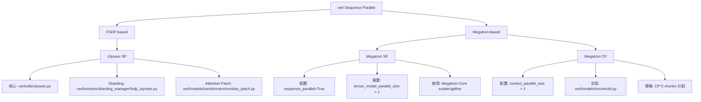

### 1.3 配置示例对比

#### 1.3.1 Ulysses SP 配置 (FSDP)

**配置文件路径**: `verl/workers/config/actor.py:229` 和 `verl/workers/config/critic.py:195`

```yaml
actor_rollout_ref:
  actor:
    strategy: fsdp2
    ulysses_sequence_parallel_size: 4  # Ulysses SP size
    model:
      use_remove_padding: true  # 必须开启
```

**代码路径**: `verl/workers/config/actor.py:219-230`
```python
@dataclass
class FSDPActorRolloutConfig(BaseActorRolloutConfig):
    """FSDP/FSDP2 actor configuration.

    Args:
        ...
        ulysses_sequence_parallel_size (int): Ulysses sequence parallel size for long sequences.
        ...
    """
    strategy: str = "fsdp"
    grad_clip: float = 1.0
    ulysses_sequence_parallel_size: int = 1  # 默认不启用
```

#### 1.3.2 Megatron SP 配置

**配置文件路径**: `verl/workers/config/engine.py:63`

```yaml
actor_rollout_ref:
  actor:
    strategy: megatron
    megatron:
      tensor_model_parallel_size: 4
      sequence_parallel: true  # 自动启用（当 TP > 1）
```

**代码路径**: `verl/workers/config/engine.py:41-80`
```python
@dataclass
class McoreEngineConfig(BaseConfig):
    """Configuration for Megatron parallelism.

    Args:
        ...
        sequence_parallel (bool): Whether to enable sequence parallelism.
        ...
    """
    tensor_model_parallel_size: int = 1
    sequence_parallel: bool = True  # 默认启用

    def __post_init__(self) -> None:
        """config validation logics go here"""
        assert self.strategy == "megatron"
        if self.tensor_model_parallel_size == 1:
            warnings.warn("set sequence parallel to false as TP size is 1", stacklevel=2)
            self.sequence_parallel = False  # TP=1 时自动禁用
```

#### 1.3.3 Megatron CP 配置

**配置文件路径**: `verl/workers/config/engine.py:62`

```yaml
actor_rollout_ref:
  actor:
    strategy: megatron
    megatron:
      context_parallel_size: 2  # CP size for ultra-long sequences
      tensor_model_parallel_size: 4
```

**代码路径**: `verl/workers/config/engine.py:40-62`
```python
@dataclass
class McoreEngineConfig(BaseConfig):
    """Configuration for Megatron parallelism.

    Args:
        context_parallel_size (int): Context parallel size for long sequences.
        ...
    """
    context_parallel_size: int = 1  # 默认不启用
```

### 1.4 选择指南

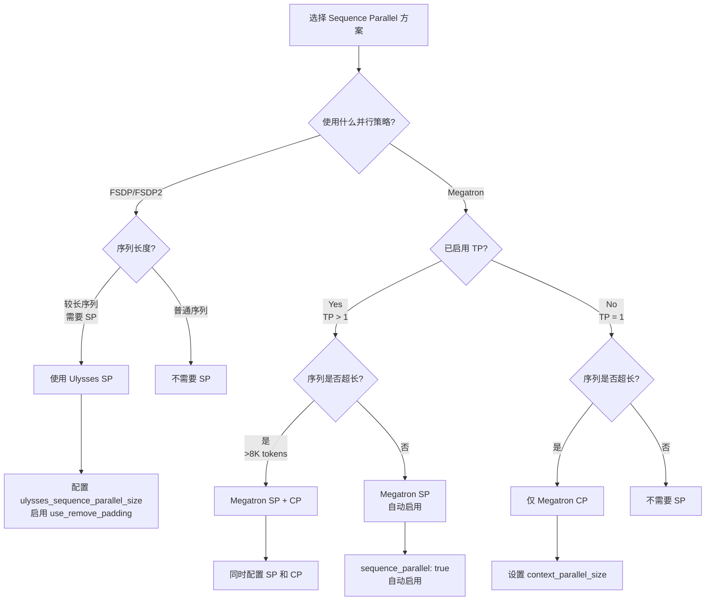

**关键决策点**:
1. **FSDP 策略** → 只能使用 **Ulysses SP**
2. **Megatron 策略**:
   - TP > 1 → 自动启用 **Megatron SP**
   - 超长序列 → 考虑启用 **Megatron CP**
   - 可以同时使用 SP + CP

### 1.5 核心文件索引

| 文件路径 | 功能描述 | 相关 SP |
|---------|---------|---------|
| `verl/utils/ulysses.py` | Ulysses SP 核心工具函数 | Ulysses SP |
| `verl/workers/sharding_manager/fsdp_ulysses.py` | FSDP Ulysses sharding manager | Ulysses SP |
| `verl/models/transformers/monkey_patch.py` | Attention monkey patch for Ulysses | Ulysses SP |
| `verl/models/transformers/qwen2.py` | Qwen2 attention with Ulysses | Ulysses SP |
| `verl/workers/actor/dp_actor.py` | FSDP Actor with Ulysses SP | Ulysses SP |
| `verl/workers/config/engine.py` | Megatron SP/CP 配置 | Megatron SP/CP |
| `verl/models/mcore/util.py` | Megatron CP 预处理/后处理 | Megatron CP |
| `verl/models/mcore/patch_v012.py` | Megatron SP scatter/gather | Megatron SP |

---

## Section 2: Ulysses Sequence Parallel 详解

### 2.1 核心原理

Ulysses Sequence Parallel 基于 DeepSpeed-Ulysses 论文 ([arXiv:2309.14509](https://arxiv.org/abs/2309.14509))，通过 **All-to-All 通信**在 sequence 维度和 attention head 维度之间进行切换，从而实现序列并行。

**核心思想**:
- **Forward**: Sequence 维度切分 → All-to-All → Head 维度切分 → Attention 计算 → All-to-All → Sequence 维度切分
- **Backward**: 反向梯度传播时自动处理通信

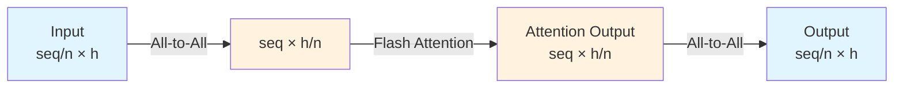

**维度变换**:
```
[batch, seq_len/n, num_heads, head_dim]        # 输入 (sequence 切分)
         ↓ All-to-All (gather seq, scatter head)
[batch, seq_len, num_heads/n, head_dim]        # Attention 计算 (head 切分)
         ↓ Flash Attention
[batch, seq_len, num_heads/n, head_dim]        # Attention 输出
         ↓ All-to-All (gather head, scatter seq)
[batch, seq_len/n, num_heads, head_dim]        # 输出 (sequence 切分)
```

### 2.2 关键实现

#### 2.2.1 核心工具函数 (`verl/utils/ulysses.py`)

##### 🔸 **All-to-All 操作**: `SeqAllToAll`

**文件路径**: `verl/utils/ulysses.py:165-191`

```python
class SeqAllToAll(torch.autograd.Function):
    @staticmethod
    def forward(
        ctx: Any,
        group: dist.ProcessGroup,
        local_input: Tensor,
        scatter_dim: int,
        gather_dim: int,
        async_op: bool = False,
    ) -> Tensor:
        ctx.group = group
        ctx.scatter_dim = scatter_dim
        ctx.gather_dim = gather_dim
        ctx.async_op = async_op
        return all_to_all_tensor(local_input, scatter_dim, gather_dim, group, async_op)

    @staticmethod
    def backward(ctx: Any, *grad_output: Tensor) -> tuple[None, Tensor, None, None]:
        input_t = torch.cat(grad_output[1:], dim=ctx.gather_dim).contiguous() if ctx.async_op else grad_output[0]
        return (
            None,
            all_to_all_tensor(input_t, ctx.gather_dim, ctx.scatter_dim, ctx.group, False),
            None,
            None,
            None,
            None,
        )
```

**讲解**:
- `SeqAllToAll` 是一个 **自定义 autograd function**，实现了 All-to-All 通信的前向和反向传播
- `forward`: 在 `scatter_dim` 上切分，在 `gather_dim` 上聚合
- `backward`: **自动反转维度**，在 `gather_dim` 上切分，在 `scatter_dim` 上聚合
- 支持异步操作 (`async_op=True`)

##### 🔸 **Gather Sequence, Scatter Heads**: `gather_seq_scatter_heads`

**文件路径**: `verl/utils/ulysses.py:62-83`

```python
def gather_seq_scatter_heads(
    x: Tensor,
    seq_dim: int,
    head_dim: int,
    unpadded_dim_size: int = 0,
    group: ProcessGroup = None,
) -> Tensor:
    """
    A func to sync embedding input with alltoall in sequence parallel
    gather sequence dimension and scatter head dim:
    e.g. seq_dim: 1, head_dim: 2
    [bsz, seq/n, h, ...] -> [bsz, seq, h/n, ...]
    """
    group = get_ulysses_sequence_parallel_group() if group is None else group
    if not group:
        return x
    sp_world = get_ulysses_sequence_parallel_world_size(group)
    x = SeqAllToAll.apply(group, x, head_dim, seq_dim)
    if unpadded_dim_size and unpadded_dim_size % sp_world != 0:
        padding_size = x.size(seq_dim) - unpadded_dim_size
        x = _unpad_tensor(x, seq_dim, padding_size)
    return x
```

**讲解**:
- **输入**: `[bsz, seq/n, h, ...]` - sequence 维度已经被切分
- **输出**: `[bsz, seq, h/n, ...]` - sequence 聚合，head 切分
- **用途**: Attention 计算前，将输入从 sequence 切分转换为 head 切分
- 支持 **unpadding** 处理不能被 sp_size 整除的序列长度

##### 🔸 **Gather Heads, Scatter Sequence**: `gather_heads_scatter_seq`

**文件路径**: `verl/utils/ulysses.py:86-101`

```python
def gather_heads_scatter_seq(x: Tensor, head_dim: int, seq_dim: int, group: ProcessGroup = None) -> Tensor:
    """
    A func to sync attention result with alltoall in sequence parallel
    gather head dimension and scatter seq dim:
    e.g. seq_dim: 1, head_dim: 2
    [bsz, seq, h/n, ...] -> [bsz, seq/n, h, ...]
    """
    group = get_ulysses_sequence_parallel_group() if group is None else group
    if not group:
        return x
    dim_size = x.size(seq_dim)
    sp_world = get_ulysses_sequence_parallel_world_size(group)
    if dim_size % sp_world != 0:
        padding_size = sp_world - (dim_size % sp_world)
        x = _pad_tensor(x, seq_dim, padding_size)
    return SeqAllToAll.apply(group, x, seq_dim, head_dim, False)
```

**讲解**:
- **输入**: `[bsz, seq, h/n, ...]` - head 维度已经被切分
- **输出**: `[bsz, seq/n, h, ...]` - head 聚合，sequence 切分
- **用途**: Attention 计算后，将输出从 head 切分转换回 sequence 切分
- 自动处理 **padding** 确保序列长度能被 sp_size 整除

##### 🔸 **Pad and Slice Inputs**: `ulysses_pad_and_slice_inputs`

**文件路径**: `verl/utils/ulysses.py:296-321`

```python
def ulysses_pad_and_slice_inputs(
    input_ids_rmpad: torch.Tensor, position_ids_rmpad: Optional[torch.Tensor] = None, sp_size: int = 1
):
    """
    Pad and slice input_ids to be divisible by sp_size
    Pad position_ids to be divisible by sp_size.

    Note both input_ids_rmpad and position_ids_rmpad will be padded and sliced.

    The is the utility of pre-forward for ulysses sequence parallelism

    Args:
        input_ids_rmpad: shape of [bsz, seqlen]
        position_ids_rmpad: shape of [bsz, seqlen], where bsz must be 1
        sp_size (int): ulysses sequence parallelism size

    Returns:
        torch.Tensor: padded and sliced input_ids
        torch.Tensor: padded and sliced position_ids
        int: pad size
    """
    input_ids_rmpad, position_ids_rmpad, pad_size = ulysses_pad(input_ids_rmpad, position_ids_rmpad, sp_size)
    input_ids_rmpad = slice_input_tensor(input_ids_rmpad, dim=1, padding=False)
    if position_ids_rmpad is not None:
        position_ids_rmpad = slice_input_tensor(position_ids_rmpad, dim=1, padding=False)
    return input_ids_rmpad, position_ids_rmpad, pad_size
```

**讲解**:
- **目的**: 在模型 forward 之前对输入进行 padding 和 slicing
- **步骤**:
  1. `ulysses_pad`: 将序列长度 pad 到能被 `sp_size` 整除
  2. `slice_input_tensor`: 按照当前 rank 切分输入
- **返回**: 切分后的 input_ids, position_ids, 以及 pad_size (用于后续 unpad)

#### 2.2.2 Attention Monkey Patch (`verl/models/transformers/monkey_patch.py`)

##### 🔸 **Ulysses Flash Attention Forward**: `_ulysses_flash_attention_forward`

**文件路径**: `verl/models/transformers/monkey_patch.py:49-117`

```python
def _ulysses_flash_attention_forward(
    query_states: torch.Tensor,
    key_states: torch.Tensor,
    value_states: torch.Tensor,
    attention_mask: Optional[torch.Tensor],
    query_length: int,
    *args,
    position_ids: Optional[torch.Tensor] = None,
    **kwargs,
):
    """Insert all-to-all before and after flash attention.
    DeepSpeed-Ulysses: https://arxiv.org/pdf/2309.14509

    For transformers>=4.55, the flash attention api has changed,
    we need to pass the query_length after doing ulysses all2all.

    Args:
        query_states (torch.Tensor): (batch_size, seqlen/sp_size, nheads, head_dim)
        key_states (torch.Tensor): (batch_size, seqlen/sp_size, nheads_k, head_dim)
        value_states (torch.Tensor): (batch_size, seqlen/sp_size, nheads_k, head_dim)
        position_ids (torch.Tensor, optional): (batch_size, seqlen/sp_size)

    Returns:
        torch.Tensor: (batch_size, seqlen/sp_size, nheads, head_dim)
    """
    ulysses_sp_size = get_ulysses_sequence_parallel_world_size()

    ########## AlltoAll for Ulysses ##########
    if ulysses_sp_size > 1:
        assert position_ids is not None, "position_ids is required for Ulysses sequence parallelism"

        # NOTE: repeat kv heads to be divided by sequence parallel. Instead of repeating nheads_q//nheads_k,
        # we choose to repeat sp_size//nheads_k, since flash_attention supports MQA/GQA.
        # For example:
        # - nheads_k=4, sp=8, repeats=2
        # - nheads_k=8, sp=8, repeats=1
        # - nheads_k=16, sp=8, repeats=1
        repeats = max(ulysses_sp_size // key_states.size(2), 1)
        key_states = repeat_kv(key_states, repeats)
        value_states = repeat_kv(value_states, repeats)

        # (bsz, seq_len/n, n_head, head_dim) -> (bsz, seq_len, n_head/n, head_dim)
        query_states = gather_seq_scatter_heads(query_states, seq_dim=1, head_dim=2)
        key_states = gather_seq_scatter_heads(key_states, seq_dim=1, head_dim=2)
        value_states = gather_seq_scatter_heads(value_states, seq_dim=1, head_dim=2)

        # TODO: all_gather position_ids because `prepare_fa2_from_position_ids` needs it
        # (bsz, seq_len/n) -> (bsz, seq_len)
        position_ids_list = [torch.empty_like(position_ids) for _ in range(ulysses_sp_size)]
        torch.distributed.all_gather(position_ids_list, position_ids, group=get_ulysses_sequence_parallel_group())
        position_ids = torch.concat(position_ids_list, dim=-1)

    # (bsz, seq_len, n_head/n, head_dim)
    query_length = query_states.size(1)
    attn_output = _flash_attention_forward(
        query_states, key_states, value_states, attention_mask, query_length, *args, position_ids=position_ids, **kwargs
    )

    ########## AlltoAll for Ulysses ##########
    if ulysses_sp_size > 1:
        # (bsz, seq_len, n_head/n, head_dim) -> (bsz, seq_len/n, n_head, head_dim)
        attn_output = gather_heads_scatter_seq(attn_output, seq_dim=1, head_dim=2)

    return attn_output
```

**讲解** (这是一个复杂且 tricky 的实现):

1. **KV Heads Repeat** (Line 85-90):
   - **问题**: MQA/GQA 中 `nheads_k < nheads_q`，需要确保 kv heads 能被 `sp_size` 整除
   - **解决方案**: `repeats = max(sp_size // nheads_k, 1)`
   - **示例**:
     - `nheads_k=4, sp=8` → `repeats=2` (重复2次)
     - `nheads_k=8, sp=8` → `repeats=1` (不重复)
     - `nheads_k=16, sp=8` → `repeats=1` (已经足够大)

2. **All-to-All Sequence → Heads** (Line 93-95):
   - 将 `(bsz, seq/n, nheads, head_dim)` 转换为 `(bsz, seq, nheads/n, head_dim)`
   - **目的**: Flash Attention 需要完整的序列长度

3. **Position IDs All-Gather** (Line 99-104):
   - **原因**: Flash Attention 需要完整的 position_ids 来计算 RoPE
   - **TODO**: 未来可以优化，直接传递 `cu_seqlens` 等参数，避免 all-gather

4. **Flash Attention** (Line 107-110):
   - 在完整序列长度 `seq_len` 上计算 attention
   - 每个 rank 只负责 `nheads/n` 个 heads

5. **All-to-All Heads → Sequence** (Line 114-115):
   - 将 `(bsz, seq, nheads/n, head_dim)` 转换回 `(bsz, seq/n, nheads, head_dim)`
   - **结果**: 每个 rank 持有完整的 heads，但只有部分序列

#### 2.2.3 FSDP Ulysses Sharding Manager

**文件路径**: `verl/workers/sharding_manager/fsdp_ulysses.py:27-72`

```python
class FSDPUlyssesShardingManager(BaseShardingManager):
    """
    Sharding manager to support data resharding when using FSDP + Ulysses
    """

    def __init__(self, device_mesh: DeviceMesh):
        super().__init__()
        self.device_mesh = device_mesh
        self.seed_offset = 12345

    def __enter__(self):
        if self.device_mesh is not None:
            # We have a global SP group
            # so we have to change to use model-specific sp group
            self.prev_sp_group = get_ulysses_sequence_parallel_group()
            set_ulysses_sequence_parallel_group(self.device_mesh["sp"].get_group())
            # TODO: check how to set seed for each model

    def __exit__(self, exc_type, exc_value, traceback):
        # restore random states
        if self.device_mesh is not None:
            # revert to previous sp group
            set_ulysses_sequence_parallel_group(self.prev_sp_group)
            # TODO: check how to set seed for each model

    def preprocess_data(self, data: DataProto) -> DataProto:
        """
        AllGather data from sp region
        This is because the data is first sharded along the FSDP dimension as we utilize the DP_COMPUTE
        In Ulysses, we need to make sure the same data is used across a SP group
        """
        if self.device_mesh is not None:
            group = self.device_mesh["sp"].get_group()
            all_gather_data_proto(data=data, process_group=group)
        return data

    def postprocess_data(self, data: DataProto) -> DataProto:
        """
        Split the data to follow FSDP partition
        """
        if self.device_mesh is not None:
            sp_size = self.device_mesh["sp"].size()
            sp_rank = self.device_mesh["sp"].get_local_rank()
            data = data.chunk(chunks=sp_size)[sp_rank]
        return data
```

**讲解**:
- **Context Manager**: 使用 `with sharding_manager:` 语法
- **`__enter__`**: 设置当前的 SP process group
- **`preprocess_data`**: 在 forward 前 **all-gather** 数据，确保 SP group 内所有 ranks 有相同数据
- **`postprocess_data`**: 在 forward 后 **split** 数据，恢复 DP 分片
- **用途**: 协调 FSDP (DP 维度) 和 Ulysses (SP 维度) 的数据分片

#### 2.2.4 Worker 集成 (`verl/workers/actor/dp_actor.py`)

**文件路径**: `verl/workers/actor/dp_actor.py:139-160`

```python
# pad and slice the inputs if sp > 1
if self.use_ulysses_sp:
    is_vlm_model = hasattr(
        getattr(self.actor_module, "module", self.actor_module).config, "vision_config"
    )
    if is_vlm_model:
        # vlm model's inputs will be sliced after embedding
        input_ids_rmpad, position_ids_rmpad, pad_size = ulysses_pad(
            input_ids_rmpad,
            position_ids_rmpad=position_ids_rmpad,
            sp_size=self.ulysses_sequence_parallel_size,
        )
    else:
        input_ids_rmpad, position_ids_rmpad, pad_size = ulysses_pad_and_slice_inputs(
            input_ids_rmpad,
            position_ids_rmpad=position_ids_rmpad,
            sp_size=self.ulysses_sequence_parallel_size,
        )
    input_ids_rmpad_rolled, _, _ = ulysses_pad_and_slice_inputs(
        input_ids_rmpad_rolled,
        position_ids_rmpad=None,
        sp_size=self.ulysses_sequence_parallel_size,
    )
```

**讲解**:
- **VLM vs LLM**:
  - **VLM**: 只 pad，不 slice，因为 embedding 后才 slice (见 Section 5.1)
  - **LLM**: pad + slice，直接在 input_ids 上切分
- **input_ids_rmpad_rolled**: 用于计算 log_prob 的 shifted labels

### 2.3 数据流转图

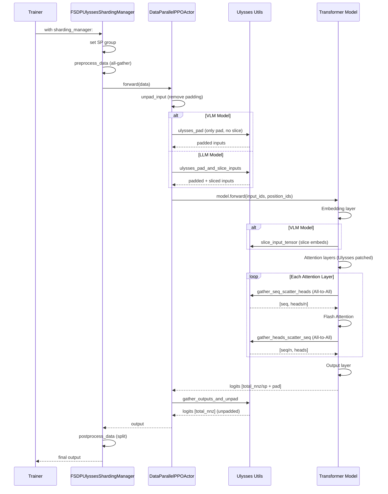

### 2.4 配置和使用

#### 2.4.1 完整配置示例

```yaml
# verl/trainer/config/ppo_trainer.yaml
actor_rollout_ref:
  actor:
    strategy: fsdp2  # 或 fsdp
    ulysses_sequence_parallel_size: 4  # SP size (必须是 2 的幂次)

    model:
      use_remove_padding: true  # 必须开启，Ulysses 依赖 varlen attention

    # 其他配置
    ppo_mini_batch_size: 128
    ppo_micro_batch_size: 2  # micro_batch_size * sp_size >= n_gpus
```

#### 2.4.2 限制条件

**代码路径**: `verl/workers/config/actor.py:244-250`

```python
if self.strategy in {"fsdp", "fsdp2"} and self.ulysses_sequence_parallel_size > 1:
    if model_config and not model_config.get("use_remove_padding", False):
        raise ValueError(
            "Ulysses sequence parallelism requires use_remove_padding=True. "
            "Please set actor_rollout_ref.actor.model.use_remove_padding=True in your config."
        )
```

**代码路径**: `verl/utils/ulysses.py:324-328`

```python
def validate_ulysses_config(num_heads, ulysses_sequence_size):
    if ulysses_sequence_size > 1:
        assert num_heads % ulysses_sequence_size == 0, (
            f"num_heads ({num_heads}) must be divisible by ulysses sequence size({ulysses_sequence_size})"
        )
```

**限制条件总结**:
1. ✅ 必须开启 `use_remove_padding=True`
2. ✅ `num_attention_heads % ulysses_sequence_parallel_size == 0`
3. ✅ `ppo_micro_batch_size * ulysses_sequence_parallel_size >= n_gpus`

### 2.5 修改和扩展接入点

#### 🔧 **接入点 1**: 添加新模型的 Ulysses 支持

**文件路径**: `verl/models/transformers/monkey_patch.py:209-388`

**步骤**:
1. 在 `apply_monkey_patch` 函数中添加新模型的 elif 分支
2. 替换 `_flash_attention_forward` 为 `_ulysses_flash_attention_forward`
3. (VLM only) 调用 `patch_vlm_for_ulysses_input_slicing` 进行 input slicing

**示例**:
```python
# verl/models/transformers/monkey_patch.py
elif model.config.model_type == "your_new_model":
    if use_remove_padding or ulysses_sp_size > 1:
        from transformers.models.your_model.modeling_your_model import YourModelAttention
        YourModelAttention.forward = your_custom_attn_forward  # 参考 qwen2_attn_forward

    if ulysses_sp_size > 1:
        # VLM only
        patch_vlm_for_ulysses_input_slicing(YourModelTextModel)
```

#### 🔧 **接入点 2**: 自定义 Attention Forward

**文件路径**: `verl/models/transformers/qwen2.py:35-238`

**关键点**:
- 在 QKV projection 之后添加 `gather_seq_scatter_heads`
- 在 Attention 计算之后添加 `gather_heads_scatter_seq`
- 处理 position_ids 的 all-gather

**模板**:
```python
def custom_attn_forward(self, hidden_states, attention_mask, position_ids, ...):
    # 1. QKV projection
    query_states = self.q_proj(hidden_states)
    key_states = self.k_proj(hidden_states)
    value_states = self.v_proj(hidden_states)

    # 2. Reshape to [bsz, seq_len, num_heads, head_dim]
    query_states = query_states.view(bsz, q_len, self.num_heads, self.head_dim).transpose(1, 2)

    # 3. Ulysses All-to-All (if sp_size > 1)
    ulysses_sp_size = get_ulysses_sequence_parallel_world_size()
    if ulysses_sp_size > 1:
        validate_ulysses_config(self.num_heads, ulysses_sp_size)
        query_states = gather_seq_scatter_heads(query_states, seq_dim=2, head_dim=1)
        key_states = gather_seq_scatter_heads(key_states, seq_dim=2, head_dim=1)
        value_states = gather_seq_scatter_heads(value_states, seq_dim=2, head_dim=1)

    # 4. RoPE
    query_states, key_states = apply_rotary_pos_emb(query_states, key_states, cos, sin)

    # 5. Attention computation
    attn_output = flash_attention_forward(query_states, key_states, value_states, ...)

    # 6. Ulysses All-to-All back (if sp_size > 1)
    if ulysses_sp_size > 1:
        attn_output = gather_heads_scatter_seq(attn_output, seq_dim=2, head_dim=1)

    # 7. Output projection
    attn_output = self.o_proj(attn_output)
    return attn_output
```

#### 🔧 **接入点 3**: 修改 Sharding Manager

**文件路径**: `verl/workers/sharding_manager/fsdp_ulysses.py`

**场景**: 需要自定义数据预处理/后处理逻辑

**方法**: 继承 `FSDPUlyssesShardingManager` 并重写:
- `preprocess_data`: 自定义 all-gather 逻辑
- `postprocess_data`: 自定义 split 逻辑

---

## Section 3: Megatron Sequence Parallel 详解

### 3.1 核心原理

Megatron Sequence Parallel 是 Megatron-LM 中的 sequence parallel 实现，与 **Tensor Parallelism (TP)** 紧密耦合。它沿着 TP 维度切分 sequence，从而在不增加额外通信的情况下减少激活内存。

**核心思想**:
- **与 TP 耦合**: Sequence Parallel 只在 `tensor_model_parallel_size > 1` 时启用
- **Sequence 切分**: 在 TP group 内沿 sequence 维度切分激活
- **通信原语**: 使用 `scatter_to_sequence_parallel_region` 和 `gather_from_sequence_parallel_region`

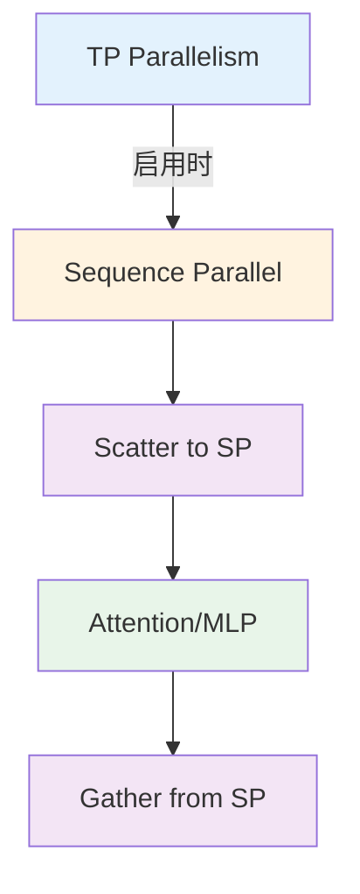

**关键区别** (vs Ulysses):
| 特性 | Megatron SP | Ulysses SP |
|------|-------------|------------|
| **依赖** | 需要 TP > 1 | 独立于 TP |
| **通信原语** | Scatter/Gather | All-to-All |
| **适用场景** | Megatron 策略 | FSDP 策略 |
| **内存节省** | 激活内存 / TP_size | 激活内存 / SP_size |

### 3.2 关键实现

#### 3.2.1 配置自动启用

**文件路径**: `verl/workers/config/engine.py:75-80`

```python
def __post_init__(self) -> None:
    """config validation logics go here"""
    assert self.strategy == "megatron"
    if self.tensor_model_parallel_size == 1:
        warnings.warn("set sequence parallel to false as TP size is 1", stacklevel=2)
        self.sequence_parallel = False  # TP=1 时自动禁用
```

**讲解**:
- `sequence_parallel` 默认为 `True` (line 63)
- 当 `tensor_model_parallel_size == 1` 时自动禁用
- **原因**: Megatron SP 依赖 TP group 进行通信

#### 3.2.2 Scatter/Gather 操作 (`Megatron-Core`)

Megatron-Core 提供了核心的 scatter/gather 操作:

**文件路径**: `megatron/core/tensor_parallel/mappings.py`

```python
# 来自 Megatron-Core (外部库)
def scatter_to_sequence_parallel_region(input_):
    """
    Scatter the input tensor across sequence parallel region.

    Args:
        input_: shape [seq_len, batch, hidden]

    Returns:
        output: shape [seq_len/tp_size, batch, hidden]
    """
    # 实现: 沿 sequence 维度切分
    ...

def gather_from_sequence_parallel_region(input_, tensor_parallel_output_grad=True):
    """
    Gather the input tensor from sequence parallel region.

    Args:
        input_: shape [seq_len/tp_size, batch, hidden]

    Returns:
        output: shape [seq_len, batch, hidden]
    """
    # 实现: All-Gather 沿 sequence 维度
    ...
```

**通信模式**:
```
Scatter: [seq_len, batch, hidden] -> [seq_len/tp_size, batch, hidden] (每个 TP rank 一个切片)
Gather:  [seq_len/tp_size, batch, hidden] -> [seq_len, batch, hidden] (All-Gather)
```

#### 3.2.3 在 Attention 中的使用 (verl patch)

**文件路径**: `verl/models/mcore/patch_v012.py:82-104`

```python
# verl 对 Megatron-Core 0.12 的 patch
if q_compressed.size(-1) != self.config.q_lora_rank:
    q_compressed = gather_from_tensor_model_parallel_region(q_compressed)
    if self.config.sequence_parallel:
        q_compressed = scatter_to_sequence_parallel_region(q_compressed)  # Line 84

q_compressed = self.q_layernorm(q_compressed)

# ... KV projection ...

if kv_combined.size(-1) != self.config.kv_lora_rank + self.config.qk_pos_emb_head_dim:
    kv_combined = gather_from_tensor_model_parallel_region(kv_combined)
    kv_compressed, k_pos_emb = torch.split(
        kv_combined, [self.config.kv_lora_rank, self.config.qk_pos_emb_head_dim], dim=-1
    )
    if self.config.sequence_parallel:
        # kv_compressed:[s / TP, b, kv_lora_rank]
        kv_compressed = scatter_to_sequence_parallel_region(kv_compressed)  # Line 104
else:
    # ...
    if parallel_state.get_tensor_model_parallel_world_size() > 1:
        # k_pos_emb: [s, b, qk_pos_emb_head_dim]
        k_pos_emb = gather_from_sequence_parallel_region(k_pos_emb)  # Line 112
```

**讲解**:
1. **Line 84**: 在 TP gather 之后，scatter 回 SP region
   - TP Gather: `[s/TP, b, q_lora_rank/TP]` → `[s/TP, b, q_lora_rank]`
   - SP Scatter: `[s/TP, b, q_lora_rank]` → `[s/TP, b, q_lora_rank]` (保持sequence切分)

2. **Line 104**: 对 KV 进行类似操作

3. **Line 112**: 对 position embedding 进行 gather (需要完整的 position_ids)

#### 3.2.4 在模型初始化中的设置

**文件路径**: `verl/utils/megatron_utils.py:275-279`

```python
# 在创建模型时传递 sequence_parallel 配置
model = GPTModel(
    config=transformer_config,
    # ...
    pipeline_model_parallel_size=mpu.get_pipeline_model_parallel_world_size(),
    virtual_pipeline_model_parallel_size=mpu.get_virtual_pipeline_model_parallel_world_size(),
    context_parallel_size=mpu.get_context_parallel_world_size(),
    # sequence_parallel 通过 transformer_config 传递
)
```

**文件路径**: `verl/utils/megatron_utils.py:309-313`

```python
# 创建 TransformerConfig 时设置 sequence_parallel
from megatron.core.transformer.transformer_config import TransformerConfig

transformer_config = TransformerConfig(
    # ...
    pipeline_model_parallel_size=mpu.get_pipeline_model_parallel_world_size(),
    virtual_pipeline_model_parallel_size=mpu.get_virtual_pipeline_model_parallel_world_size(),
    context_parallel_size=mpu.get_context_parallel_world_size(),
    sequence_parallel=sequence_parallel,  # 从 engine_config 传入
    # ...
)
```

### 3.3 数据流转图

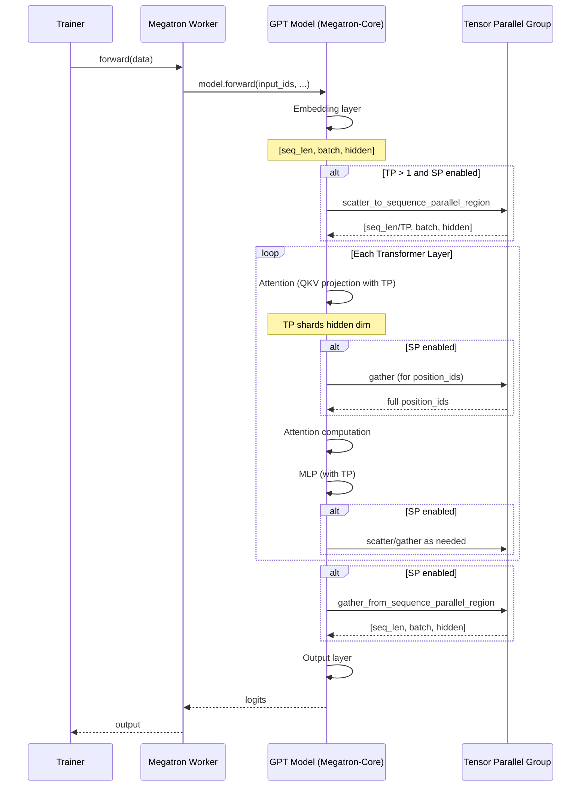

### 3.4 与 TP 的协同

Megatron SP 与 TP 的协同工作流程:

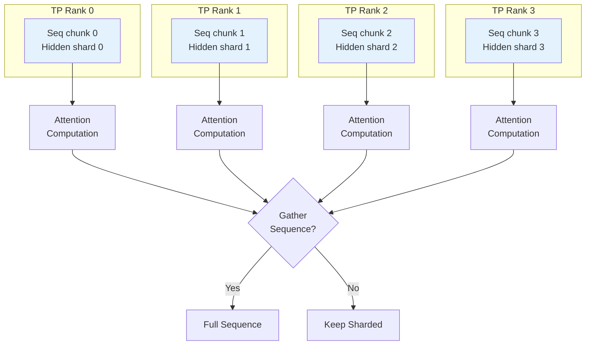

**关键点**:
1. **TP**: 沿 hidden dimension 切分 (QKV projection, MLP)
2. **SP**: 沿 sequence dimension 切分 (激活值)
3. **通信重叠**: 由于使用相同的 TP group，通信可以复用

### 3.5 配置和使用

#### 3.5.1 完整配置示例

```yaml
# verl/trainer/config/ppo_trainer.yaml
actor_rollout_ref:
  actor:
    strategy: megatron

    megatron:
      tensor_model_parallel_size: 4  # TP size
      sequence_parallel: true  # 自动启用（TP > 1）
      pipeline_model_parallel_size: 1
      context_parallel_size: 1  # 可选: 超长序列时启用 CP

    # 其他配置
    ppo_mini_batch_size: 128
```

#### 3.5.2 限制条件

**代码路径**: `verl/workers/actor/megatron_actor.py:159`

```python
assert config.get("ulysses_sequence_parallel_size", 1) == 1
# Megatron actor 不支持 Ulysses SP
```

**代码路径**: `verl/workers/critic/megatron_critic.py:84`

```python
assert config.get("ulysses_sequence_parallel_size", 1) == 1
# Megatron critic 不支持 Ulysses SP
```

**限制条件总结**:
1. ✅ 必须设置 `tensor_model_parallel_size > 1`
2. ❌ 不能与 Ulysses SP 同时使用
3. ✅ 可以与 Context Parallel 同时使用

### 3.6 修改和扩展接入点

#### 🔧 **接入点 1**: 修改 TransformerConfig

**文件路径**: `verl/utils/megatron_utils.py:275-313`

**场景**: 添加新的 Megatron-Core 配置选项

**方法**:
```python
transformer_config = TransformerConfig(
    # 现有配置
    sequence_parallel=sequence_parallel,
    context_parallel_size=mpu.get_context_parallel_world_size(),
    # 添加新配置
    your_new_option=your_value,
)
```

#### 🔧 **接入点 2**: 自定义 Scatter/Gather 逻辑

**场景**: 需要特殊的 sequence 切分策略

**方法**: 继承 Megatron-Core 的 `scatter_to_sequence_parallel_region` 并重写

**示例**:
```python
from megatron.core.tensor_parallel import mappings

# 保存原始函数
_original_scatter = mappings.scatter_to_sequence_parallel_region

def custom_scatter_to_sequence_parallel_region(input_):
    # 自定义逻辑
    if your_condition:
        return your_custom_scatter(input_)
    else:
        return _original_scatter(input_)

# 替换
mappings.scatter_to_sequence_parallel_region = custom_scatter_to_sequence_parallel_region
```

#### 🔧 **接入点 3**: 添加新的 Megatron 模型支持

**文件路径**: `verl/models/mcore/` 目录

**步骤**:
1. 创建新的模型配置文件 (参考 `qwen2_5_vl/vision_config.py`)
2. 实现模型 forward (参考 `qwen2_5_vl/model.py`)
3. 在 `registry.py` 中注册模型

**关键配置**:
```python
# verl/models/mcore/your_model/config.py
config.sequence_parallel = True  # 启用 SP
config.tp_comm_overlap = False   # 通信重叠
```

---

## Section 4: Megatron Context Parallel 详解

### 4.1 核心原理

Megatron Context Parallel (CP) 是专门为**超长序列**设计的并行策略，基于 **Ring Attention** 思想。它将序列分成 **CP*2 chunks**，每个 GPU 获得 **2 个非连续的 chunks**，从而在 causal masking 下实现负载均衡。

**核心思想**:
- **CP*2 Chunks**: 序列被分成 `context_parallel_size * 2` 个 chunks
- **Load Balancing**: 每个 GPU 分配到 first chunk 和 last chunk，避免 causal mask 导致的负载不均
- **Ring Communication**: 通过 ring all-gather 实现 chunks 间的通信

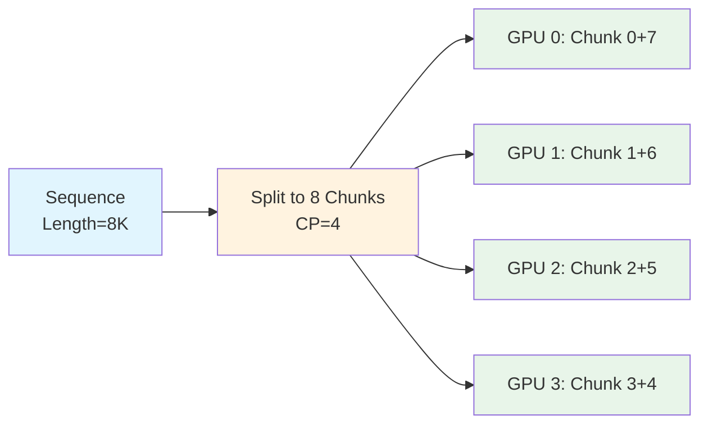

**Load Balancing 原理**:
```
Causal Mask (8 chunks, CP=4):
GPU 0: Chunk 0 (first)  + Chunk 7 (last)   → balanced
GPU 1: Chunk 1          + Chunk 6          → balanced
GPU 2: Chunk 2          + Chunk 3          → balanced
GPU 3: Chunk 3          + Chunk 4          → balanced

Without this strategy:
GPU 0: Chunk 0          → many valid positions (full attention)
GPU 3: Chunk 7          → few valid positions (only self-attention)
```

### 4.2 关键实现

#### 4.2.1 Packed Sequences 预处理 (`verl/models/mcore/util.py`)

##### 🔸 **preprocess_packed_seqs**: CP*2 Chunks 分配

**文件路径**: `verl/models/mcore/util.py:23-102`

```python
def preprocess_packed_seqs(
    input_ids: torch.Tensor, attention_mask: torch.Tensor, pre_process: bool = True
) -> tuple[torch.Tensor, PackedSeqParams]:
    """
    Preprocess packed sequences
    CP splits sequence into CP*2 chunks, and each GPU gets 2 chunks (GPU0 gets first and last chunks, GPU1
    gets second and second last chunks, and so on), this is for load balancing with causal masking.
    See https://github.com/NVIDIA/TransformerEngine/issues/1368
    """
    batch_size = input_ids.shape[0]

    seqlens_in_batch = attention_mask.sum(dim=-1, dtype=torch.int32)
    tp_size = mpu.get_tensor_model_parallel_world_size()
    cp_size = mpu.get_context_parallel_world_size()
    cp_rank = mpu.get_context_parallel_rank()
    align_size = tp_size * cp_size * 2 if cp_size > 1 else tp_size

    # Pad to align_size
    pad_size = (align_size - seqlens_in_batch % align_size) % align_size
    seqlens_in_batch_padded = seqlens_in_batch + pad_size

    # ... cu_seqlens calculation ...

    # --------------------------------------------------------------------
    # Move index information to CPU to avoid D2H sync in the loop
    # --------------------------------------------------------------------
    seqlens_in_batch_cpu: list[int] = seqlens_in_batch.tolist()
    seqlens_in_batch_padded_cpu: list[int] = seqlens_in_batch_padded.tolist()
    cu_seqlens_padded_cpu: list[int] = cu_seqlens_padded.tolist()

    max_seqlen_in_batch = max(seqlens_in_batch_padded_cpu)

    shape = list(input_ids.shape[1:])
    shape[0] = sum(seqlens_in_batch_padded_cpu) // cp_size
    if pre_process:
        input_ids_rmpad = torch.zeros(shape, dtype=input_ids.dtype, device=input_ids.device)
        for i in range(batch_size):
            if cp_size <= 1:
                seqlen = seqlens_in_batch_cpu[i]
                start_idx = cu_seqlens_padded_cpu[i]
                input_ids_rmpad[start_idx : start_idx + seqlen] = input_ids[i, attention_mask[i]]
                continue

            # CP > 1: Split to 2 chunks
            seqlen_padded_i = seqlens_in_batch_padded_cpu[i]
            seqlen = seqlen_padded_i // cp_size
            half_seqlen = seqlen // 2
            start_idx = cu_seqlens_padded_cpu[i] // cp_size

            d = input_ids[i, attention_mask[i]]
            # First chunk: [cp_rank * half_seqlen : (cp_rank+1) * half_seqlen]
            input_ids_rmpad[start_idx : start_idx + half_seqlen] = d[
                half_seqlen * cp_rank : half_seqlen * (cp_rank + 1)
            ]

            # Last chunk (reversed): [seqlen_padded - (cp_rank+1)*half : seqlen_padded - cp_rank*half]
            remain_start = seqlen_padded_i - half_seqlen * (cp_rank + 1)
            remain_end = seqlen_padded_i - half_seqlen * cp_rank
            remain_end = min(remain_end, d.shape[0])
            remain_len = remain_end - remain_start
            if remain_len > 0:
                input_ids_rmpad[start_idx + half_seqlen : start_idx + half_seqlen + remain_len] = d[
                    remain_start:remain_end
                ]

    packed_seq_params = PackedSeqParams(
        qkv_format="thd",
        cu_seqlens_q=cu_seqlens_padded,
        max_seqlen_q=max_seqlen_in_batch,
        cu_seqlens_kv=cu_seqlens_padded,
        max_seqlen_kv=max_seqlen_in_batch,
        cu_seqlens_q_padded=cu_seqlens_padded,
        cu_seqlens_kv_padded=cu_seqlens_padded,
    )
    if pre_process:
        return input_ids_rmpad.unsqueeze(0), packed_seq_params
    else:
        return input_ids, packed_seq_params
```

**讲解** (这是一个复杂的实现):

1. **Alignment Calculation** (Line 36-41):
   - `align_size = tp_size * cp_size * 2` (如果 CP > 1)
   - 将序列长度 pad 到 `align_size` 的倍数
   - **原因**: 确保可以均匀地分成 CP*2 chunks

2. **CPU移到前面** (Line 51-55):
   - 将所有索引信息提前移到 CPU，避免循环中频繁的 D2H 同步
   - **优化点**: 减少 GPU-CPU 通信开销

3. **CP Chunking** (Line 70-87):
   - **第一个 chunk**: `d[half_seqlen * cp_rank : half_seqlen * (cp_rank + 1)]`
   - **最后一个 chunk (reversed)**: `d[seqlen - half_seqlen * (cp_rank + 1) : seqlen - half_seqlen * cp_rank]`
   - **示例** (CP=4, seqlen=8000):
     - GPU 0: `d[0:1000]` + `d[7000:8000]`
     - GPU 1: `d[1000:2000]` + `d[6000:7000]`
     - GPU 2: `d[2000:3000]` + `d[5000:6000]`
     - GPU 3: `d[3000:4000]` + `d[4000:5000]`

##### 🔸 **postprocess_packed_seqs**: 恢复原始序列

**文件路径**: `verl/models/mcore/util.py:105-162`

```python
def postprocess_packed_seqs(
    output: torch.Tensor,
    packed_seq_params: PackedSeqParams,
    attention_mask: torch.Tensor,
    batch_size: int,
    seq_len: int,
    post_process: bool = True,
) -> torch.Tensor:
    """
    Postprocess packed sequences
    """
    if not post_process:
        return output

    # Move lengths to CPU
    cu_padded_cpu: list[int] = packed_seq_params.cu_seqlens_q_padded.tolist()
    seq_lens_cpu: list[int] = attention_mask.sum(dim=1, dtype=torch.int32).cpu().tolist()

    shape = [batch_size, seq_len] + list(output.shape[2:])
    output_new = torch.zeros(shape, dtype=output.dtype, device=output.device)

    cp_size = mpu.get_context_parallel_world_size()
    # all gather output across context parallel group
    if cp_size > 1:
        output_list = [torch.empty_like(output) for _ in range(cp_size)]
        torch.distributed.all_gather(output_list, output.detach(), group=mpu.get_context_parallel_group())
        output_list[mpu.get_context_parallel_rank()] = output
    else:
        output_list = [output]

    for i in range(batch_size):
        if cp_size <= 1:
            s = seq_lens_cpu[i]
            start_idx = cu_padded_cpu[i]
            output_new[i, attention_mask[i]] = output[0][start_idx : start_idx + s]
            continue

        # CP > 1: Reconstruct from 2 chunks
        s_len_padded_chunk = (cu_padded_cpu[i + 1] - cu_padded_cpu[i]) // cp_size
        half_seqlen = s_len_padded_chunk // 2
        s_len = seq_lens_cpu[i]
        s_len_padded = s_len_padded_chunk * cp_size
        tmp = torch.empty(s_len_padded, *output.shape[2:], device=output.device)

        for j in range(cp_size):
            o = output_list[j][0]
            packed_start_idx = cu_padded_cpu[i] // cp_size
            # First chunk and last chunk
            o0, o1 = (
                o[packed_start_idx : packed_start_idx + half_seqlen],
                o[packed_start_idx + half_seqlen : packed_start_idx + s_len_padded_chunk],
            )
            tmp[j * half_seqlen : (j + 1) * half_seqlen] = o0
            tmp[s_len_padded - (j + 1) * half_seqlen : s_len_padded - j * half_seqlen] = o1
        output_new[i, attention_mask[i]] = tmp[:s_len]

    return output_new
```

**讲解**:

1. **All-Gather Across CP Group** (Line 131-136):
   - 从所有 CP ranks 收集 output
   - 每个 rank 有 2 个 chunks 的输出

2. **Reconstruct Sequence** (Line 145-160):
   - 将所有 CP ranks 的 2 chunks 组合回完整序列
   - **顺序**: GPU 0 的 chunk 0 → GPU 1 的 chunk 0 → ... → GPU 1 的 chunk 1 (reversed) → GPU 0 的 chunk 1 (reversed)

### 4.3 数据流转图

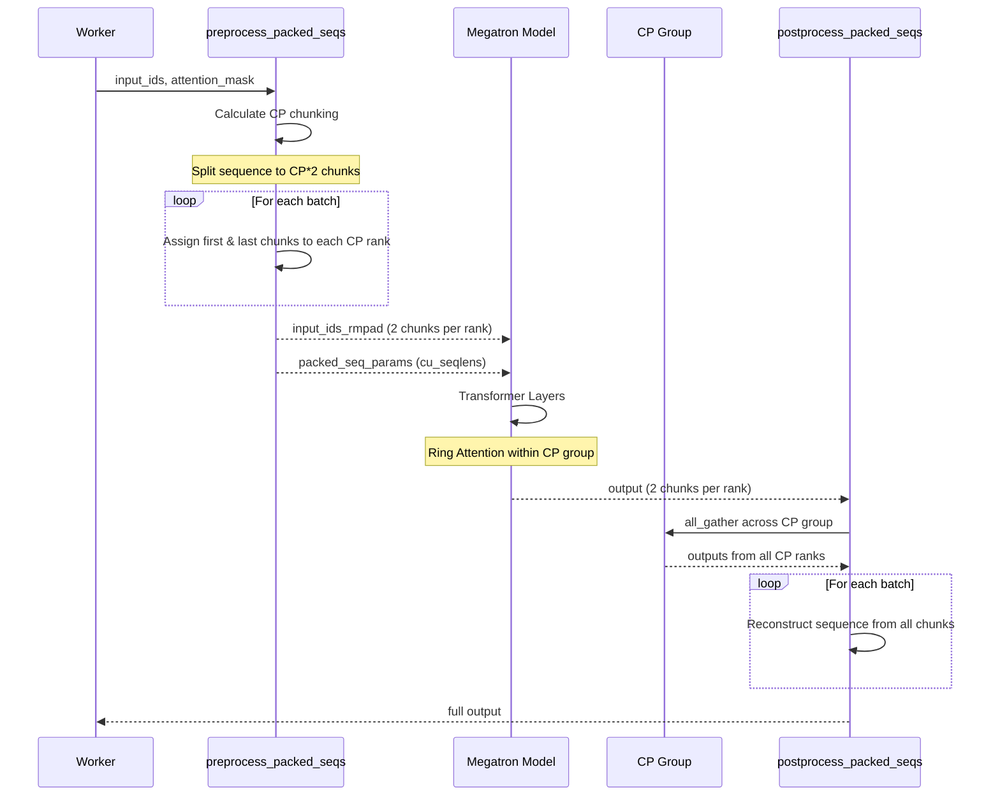

### 4.4 Ring Attention 机制

CP 使用 Ring Attention 在 chunks 间进行通信:

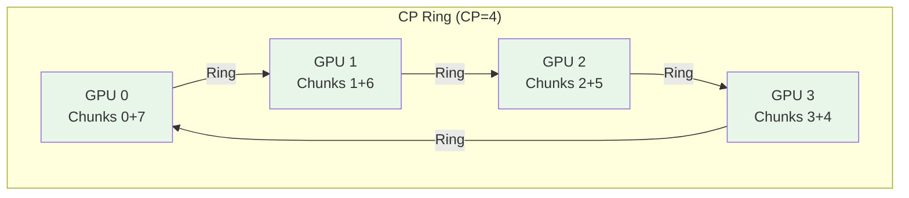

**通信模式**:
1. 每个 GPU 计算自己的 2 chunks 的 Q
2. 通过 ring all-gather 逐步获取其他 GPU 的 K/V chunks
3. 计算 Q 与所有 K/V 的 attention
4. 最终每个 GPU 持有自己 2 chunks 的输出

### 4.5 配置和使用

#### 4.5.1 完整配置示例

```yaml
# verl/trainer/config/ppo_trainer.yaml
actor_rollout_ref:
  actor:
    strategy: megatron

    megatron:
      tensor_model_parallel_size: 2
      context_parallel_size: 4  # CP size for ultra-long sequences
      sequence_parallel: true   # 可以同时启用 SP

    # 数据配置
    ppo_mini_batch_size: 128
    forward_max_token_len_per_gpu: 16384  # 每个 GPU 的最大 token 数
```

#### 4.5.2 限制条件

**代码路径**: `verl/models/mcore/util.py:178-179`

```python
cp_size = mpu.get_context_parallel_world_size()
assert cp_size == 1, "Context parallel size without seq_pack is not supported"
# 如果不使用 packed sequences，CP 不支持
```

**代码路径**: `verl/models/mcore/model_forward.py:93`

```python
assert mpu.get_context_parallel_world_size() == 1, "qwen2_5_vl's context parallel is not accurate yet"
# VLM 模型的 CP 支持尚不完善
```

**限制条件总结**:
1. ✅ 必须使用 packed sequences (varlen attention)
2. ⚠️ VLM 模型的 CP 支持有限
3. ✅ 可以与 Megatron SP 同时使用
4. ❌ 不能与 Ulysses SP 同时使用

### 4.6 修改和扩展接入点

#### 🔧 **接入点 1**: 修改 CP Chunking 策略

**文件路径**: `verl/models/mcore/util.py:23-102`

**场景**: 需要自定义 chunks 分配策略（如非均匀分配）

**方法**: 修改 `preprocess_packed_seqs` 中的 chunking 逻辑 (Line 70-87)

**关键修改点**:
```python
# 当前策略: first + last chunks
# 自定义策略: 可以改为其他分配方式
for i in range(batch_size):
    if cp_size > 1:
        # Your custom chunking logic here
        chunk_indices = your_custom_chunking(seqlen_padded_i, cp_size, cp_rank)
        input_ids_rmpad[...] = d[chunk_indices]
```

#### 🔧 **接入点 2**: 支持新的 Attention 模式

**文件路径**: `verl/models/mcore/util.py` 和 Megatron-Core

**场景**: 添加新的 attention 计算模式（如 bidirectional attention for CP）

**方法**:
1. 修改 `PackedSeqParams` 的创建 (Line 90-98)
2. 在 Megatron-Core 中实现新的 attention forward

#### 🔧 **接入点 3**: 优化通信策略

**文件路径**: `verl/models/mcore/util.py:131-136`

**场景**: 优化 all-gather 通信（如使用异步通信）

**方法**:
```python
# 当前: 同步 all-gather
torch.distributed.all_gather(output_list, output.detach(), group=mpu.get_context_parallel_group())

# 优化: 异步 all-gather
handle = torch.distributed.all_gather(
    output_list, output.detach(), group=mpu.get_context_parallel_group(), async_op=True
)
# ... do other work ...
handle.wait()
```

---

## Section 5: 复杂实现深入讲解

### 5.1 VLM 的 Ulysses SP 特殊处理

#### 问题背景

VLM (Vision-Language Models) 的输入包含 **image tokens** 和 **text tokens**，它们的处理方式不同：
- **Image tokens**: 经过 vision encoder，产生固定长度的 embeddings
- **Text tokens**: 经过 text embedding layer

**挑战**: 如果在 input_ids 层面 slice，会破坏 image tokens 的完整性。

#### 解决方案: Embedding 后 Slice

**文件路径**: `verl/workers/actor/dp_actor.py:139-160`

```python
if self.use_ulysses_sp:
    is_vlm_model = hasattr(
        getattr(self.actor_module, "module", self.actor_module).config, "vision_config"
    )
    if is_vlm_model:
        # VLM: 只 pad，不 slice
        input_ids_rmpad, position_ids_rmpad, pad_size = ulysses_pad(
            input_ids_rmpad,
            position_ids_rmpad=position_ids_rmpad,
            sp_size=self.ulysses_sequence_parallel_size,
        )
    else:
        # LLM: pad + slice
        input_ids_rmpad, position_ids_rmpad, pad_size = ulysses_pad_and_slice_inputs(
            input_ids_rmpad,
            position_ids_rmpad=position_ids_rmpad,
            sp_size=self.ulysses_sequence_parallel_size,
        )
```

**文件路径**: `verl/models/transformers/monkey_patch.py:120-154`

```python
def patch_vlm_for_ulysses_input_slicing(model_class: type):
    """
    Applies a monkey patch to the forward method of a given model class
    to enable Ulysses sequence parallelism input slicing.
    """

    def _create_ulysses_wrapped_decoder_forward(original_forward):
        def ulysses_wrapped_decoder_forward(self, *args, **kwargs):
            inputs_embeds = kwargs.get("inputs_embeds")
            position_ids = kwargs.get("position_ids")
            call_kwargs = kwargs.copy()

            current_ulysses_sp_size = get_ulysses_sequence_parallel_world_size()

            slice_now = (
                inputs_embeds is not None
                and current_ulysses_sp_size > 1
                and getattr(self, "_needs_initial_slice", True)
            )
            if slice_now:
                # Slice embeddings, not input_ids
                call_kwargs["inputs_embeds"] = slice_input_tensor(inputs_embeds, dim=1, padding=False)
                call_kwargs["position_ids"] = slice_input_tensor(position_ids, dim=-1, padding=False)
                self._needs_initial_slice = False
            try:
                return original_forward(self, *args, **call_kwargs)
            finally:
                if slice_now:
                    self._needs_initial_slice = True

        return ulysses_wrapped_decoder_forward

    original_forward = model_class.forward
    wrapped_forward = _create_ulysses_wrapped_decoder_forward(original_forward)
    model_class.forward = wrapped_forward
    print(f"Monkey patch {model_class.__name__}.forward for Ulysses SP input slicing.")
```

**流程图**:

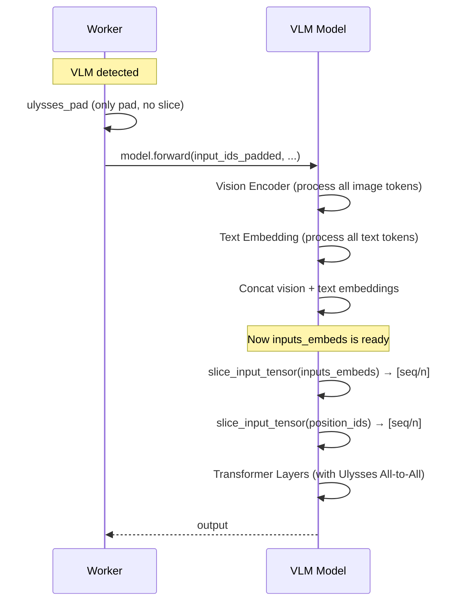

### 5.2 MQA/GQA 的 KV Heads Repeat

#### 问题背景

Multi-Query Attention (MQA) 和 Grouped-Query Attention (GQA) 中:
- `num_key_value_heads < num_attention_heads`
- KV heads 需要 repeat 才能与 Q heads 数量匹配

在 Ulysses SP 中，heads 会被切分，因此需要确保 **kv_heads 能被 sp_size 整除**。

#### 解决方案: 动态 Repeat

**文件路径**: `verl/models/transformers/monkey_patch.py:85-90`

```python
# NOTE: repeat kv heads to be divided by sequence parallel. Instead of repeating nheads_q//nheads_k,
# we choose to repeat sp_size//nheads_k, since flash_attention supports MQA/GQA.
# For example:
# - nheads_k=4, sp=8, repeats=2
# - nheads_k=8, sp=8, repeats=1
# - nheads_k=16, sp=8, repeats=1
repeats = max(ulysses_sp_size // key_states.size(2), 1)
key_states = repeat_kv(key_states, repeats)
value_states = repeat_kv(value_states, repeats)
```

**数学原理**:
```
目标: nheads_k_after_repeat % sp_size == 0

方案: repeats = max(sp_size // nheads_k, 1)
      nheads_k_after_repeat = nheads_k * repeats

示例:
- nheads_k=4, sp=8:  repeats=2, nheads_k_after=8  ✅ 8 % 8 == 0
- nheads_k=8, sp=8:  repeats=1, nheads_k_after=8  ✅ 8 % 8 == 0
- nheads_k=16, sp=8: repeats=1, nheads_k_after=16 ✅ 16 % 8 == 0
- nheads_k=32, sp=8: repeats=1, nheads_k_after=32 ✅ 32 % 8 == 0
```

### 5.3 Position IDs All-Gather 的必要性

#### 问题

Flash Attention 需要完整的 `position_ids` 来计算 RoPE (Rotary Position Embedding)，但在 Ulysses SP 中，每个 rank 只有部分 sequence。

#### 临时方案: All-Gather Position IDs

**文件路径**: `verl/models/transformers/monkey_patch.py:99-104`

```python
# TODO: all_gather position_ids because `prepare_fa2_from_position_ids` needs it, we can eliminate
# this all_gather by passing cu_seq_lens_q, cu_seq_lens_k, max_length_k, max_length_q explicitly.
# https://github.com/huggingface/transformers/pull/33932

# (bsz, seq_len/n) -> (bsz, seq_len)
position_ids_list = [torch.empty_like(position_ids) for _ in range(ulysses_sp_size)]
torch.distributed.all_gather(position_ids_list, position_ids, group=get_ulysses_sequence_parallel_group())
position_ids = torch.concat(position_ids_list, dim=-1)
```

**未来优化方向**:
- 直接传递 `cu_seqlens_q`, `cu_seqlens_k`, `max_length_k`, `max_length_q`
- 避免 all-gather 通信
- 参考: [HuggingFace PR #33932](https://github.com/huggingface/transformers/pull/33932)

---

## Section 6: 实战指南

### 6.1 如何选择 Sequence Parallel 方案

#### 决策树

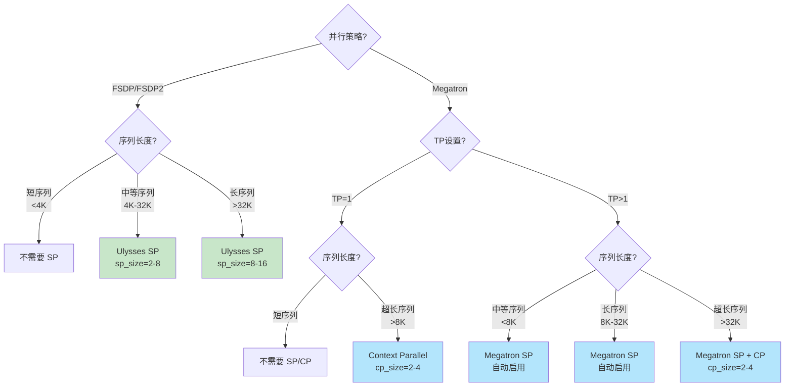

#### 性能对比

| 方案 | 通信量 | 内存节省 | 适用场景 | 限制 |
|------|--------|---------|---------|-----|
| **Ulysses SP** | 2 × All-to-All per layer | activation / sp_size | FSDP + 长序列 | 需要 use_remove_padding |
| **Megatron SP** | Scatter + Gather (复用TP) | activation / tp_size | Megatron + TP>1 | 必须启用 TP |
| **Megatron CP** | Ring All-Gather | memory / cp_size | 超长序列 (>8K) | 需要 packed sequences |

### 6.2 常见问题排查

#### 问题 1: Ulysses SP 报错 "num_heads must be divisible by ulysses sequence size"

**错误信息**:
```
AssertionError: num_heads (32) must be divisible by ulysses sequence size (6)
```

**原因**: `num_attention_heads % ulysses_sequence_parallel_size != 0`

**解决方案**:
- 修改 `ulysses_sequence_parallel_size` 为能整除 `num_attention_heads` 的值
- 示例: 如果 `num_heads=32`，可以选择 `sp_size=2, 4, 8, 16, 32`

**代码路径**: `verl/utils/ulysses.py:324-328`

#### 问题 2: Ulysses SP 报错 "requires use_remove_padding=True"

**错误信息**:
```
ValueError: Ulysses sequence parallelism requires use_remove_padding=True.
```

**原因**: Ulysses SP 依赖 varlen flash attention

**解决方案**:
```yaml
actor_rollout_ref:
  actor:
    ulysses_sequence_parallel_size: 4
    model:
      use_remove_padding: true  # 必须开启
```

#### 问题 3: Megatron SP 没有生效

**症状**: 设置了 `sequence_parallel: true` 但内存没有减少

**检查清单**:
1. ✅ `tensor_model_parallel_size > 1`
2. ✅ 查看日志是否有 "set sequence parallel to false" warning
3. ✅ 确认 `TransformerConfig` 中 `sequence_parallel=True`

**调试代码**:
```python
# verl/utils/megatron_utils.py
print(f"TP size: {mpu.get_tensor_model_parallel_world_size()}")
print(f"SP enabled: {transformer_config.sequence_parallel}")
```

#### 问题 4: Context Parallel OOM

**症状**: 启用 CP 后显存溢出

**原因**: CP 需要额外的通信 buffer

**解决方案**:
1. 减小 `context_parallel_size`
2. 减小 `forward_max_token_len_per_gpu`
3. 启用 gradient checkpointing

```yaml
actor_rollout_ref:
  actor:
    megatron:
      context_parallel_size: 2  # 减小 CP size
    forward_max_token_len_per_gpu: 8192  # 减小 max tokens
    model:
      enable_gradient_checkpointing: true  # 启用 gradient checkpointing
```

### 6.3 性能调优建议

#### 6.3.1 Ulysses SP 调优

**最佳 SP Size 选择**:
```python
# 经验公式
sp_size = min(
    num_gpus,  # 不超过 GPU 数量
    num_attention_heads,  # 能整除 num_heads
    ceil(seq_len / 4096)  # 根据序列长度估算
)
```

**示例**:
- `num_gpus=8, num_heads=32, seq_len=8192` → `sp_size=4`
- `num_gpus=16, num_heads=64, seq_len=16384` → `sp_size=8`

**通信优化**:
```yaml
# 启用异步通信 (需要自定义实现)
actor_rollout_ref:
  actor:
    ulysses_sequence_parallel_size: 4
    ulysses_async_comm: true  # 自定义选项
```

#### 6.3.2 Megatron SP+CP 调优

**混合使用 SP 和 CP**:
```yaml
actor_rollout_ref:
  actor:
    strategy: megatron
    megatron:
      tensor_model_parallel_size: 4  # TP
      context_parallel_size: 2        # CP for ultra-long seq
      # SP 自动启用
```

**内存分析**:
```
Total GPUs = 16
TP = 4, CP = 2, DP = 2

Effective DP for data = 16 / (4 * 2) = 2
Activation memory per GPU ≈ activation_total / (TP * CP) = activation_total / 8
```

#### 6.3.3 调试和Profiling

**启用详细日志**:
```bash
export VERL_LOGGING_LEVEL=DEBUG
export NCCL_DEBUG=INFO  # 查看通信日志
```

**Profiling 工具**:
```python
# verl/trainer/main_ppo.py
python -m verl.trainer.main_ppo \
    trainer.enable_profiling=True \
    trainer.profiler_output_dir=/path/to/profiler
```

**检查通信开销**:
```python
# 在代码中添加
import torch.distributed as dist
start = torch.cuda.Event(enable_timing=True)
end = torch.cuda.Event(enable_timing=True)

start.record()
dist.all_gather(...)  # 或其他通信操作
end.record()
torch.cuda.synchronize()
print(f"Communication time: {start.elapsed_time(end)} ms")
```

### 6.4 未来改进方向

#### 6.4.1 Ulysses SP

1. **消除 Position IDs All-Gather**:
   - 直接传递 `cu_seqlens` 到 Flash Attention
   - 参考: HuggingFace PR #33932

2. **支持更多模型架构**:
   - 当前主要支持 Llama/Qwen 系列
   - 扩展到 MoE, State Space Models 等

3. **异步通信**:
   - All-to-All 异步化，与计算重叠

#### 6.4.2 Megatron CP

1. **VLM 支持完善**:
   - 当前 VLM 的 CP 支持有限
   - 需要处理 image tokens 的特殊性

2. **动态 Chunking**:
   - 根据序列长度动态调整 chunks 数量
   - 自适应 load balancing

3. **通信优化**:
   - Ring All-Gather 优化
   - 考虑使用 NCCL's built-in ring primitives

---

## 总结

本文档详细讲解了 verl 中的 **3 种 Sequence Parallel** 实现：

1. **Ulysses SP** (FSDP-based): 通过 All-to-All 在 seq 和 head 维度间转换
2. **Megatron SP**: 与 TP 耦合，沿 TP 维度切分 sequence
3. **Megatron CP**: 超长序列，CP*2 chunks + Ring Attention

每种方案都有其适用场景和限制，选择时需要综合考虑：
- 并行策略 (FSDP vs Megatron)
- 序列长度
- GPU 资源
- 模型架构

希望本文档能帮助您:
✅ 理解各种 SP 的原理和实现
✅ 选择合适的 SP 方案
✅ 修改和扩展 SP 功能
✅ 排查和优化 SP 性能

**文件位置**: `claude_docs/verl_sequence_parallel_深度讲解.md`

---

**相关文档**:
- [CLAUDE.md](../CLAUDE.md) - verl 开发指南
- [DataProto深度讲解](./DataProto深度讲解.md)
- [ulysses_sharding_manager_context_protocol](./ulysses_sharding_manager_context_protocol.md)
