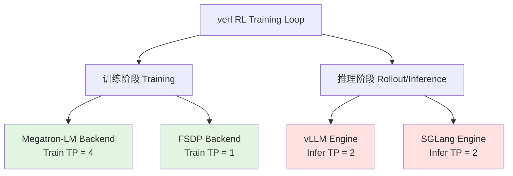
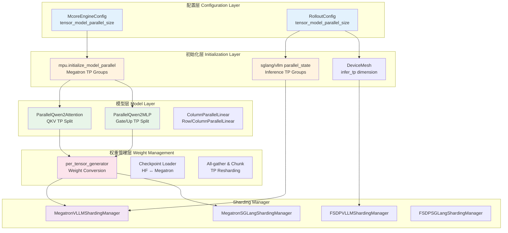
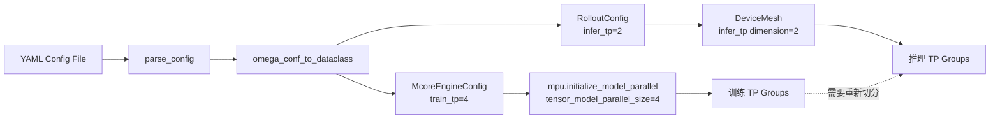
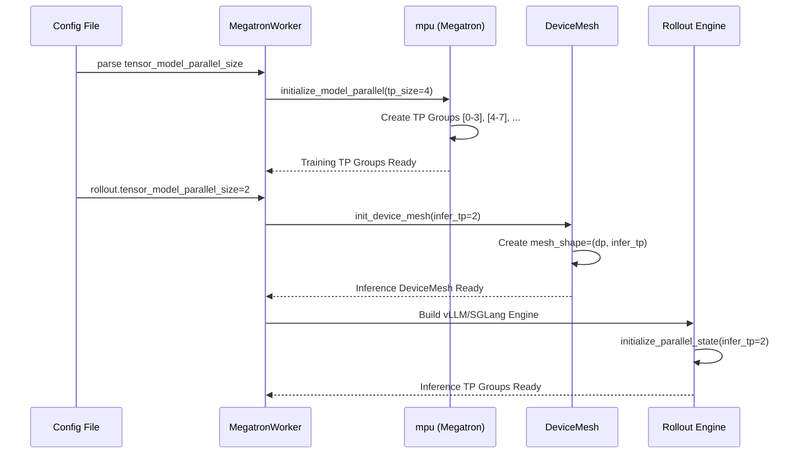
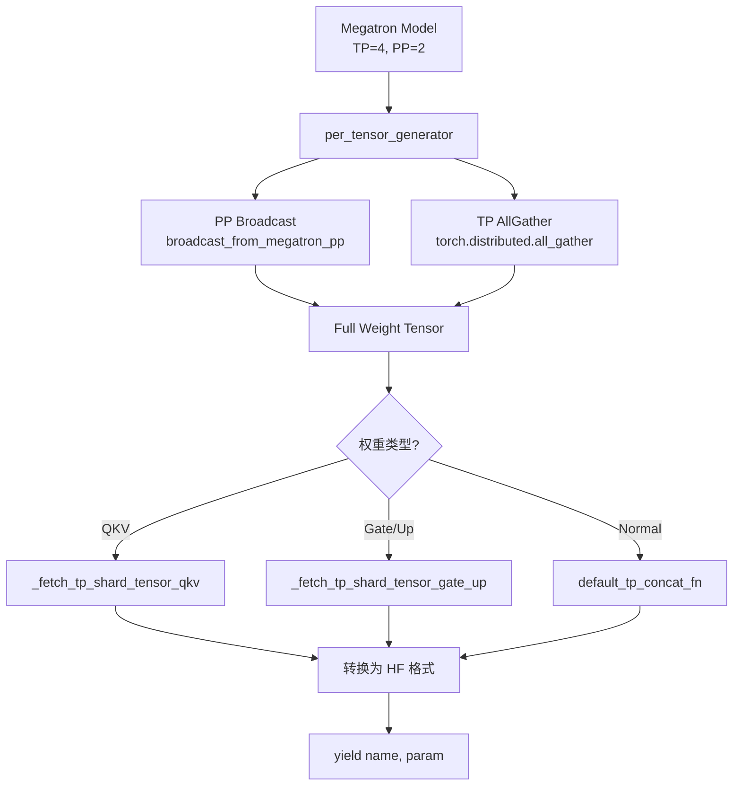
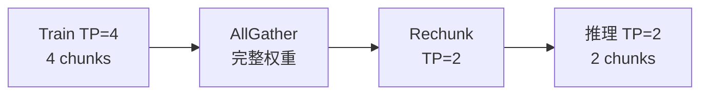
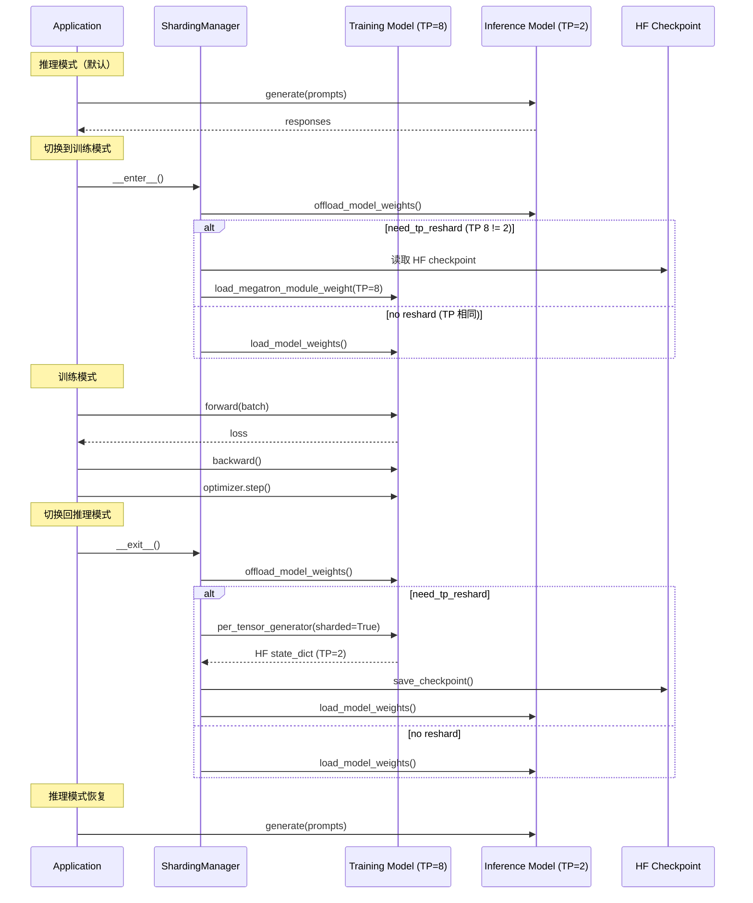
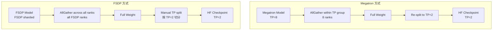

# Verl Tensor Parallel 深度讲解

> **文档目标**：深入理解 verl 中 Tensor Parallel (TP) 的原理和实现，明确修改和扩展的接入点

---

## Section 1: 概述与架构

### 1.1 Tensor Parallel 在 verl 中的定位

Tensor Parallel (张量并行) 是 verl 支持的核心并行策略之一，主要用于**在模型层面切分参数**，使得单个大模型可以分布在多个 GPU 上训练和推理。

**verl 的独特之处**：verl 需要同时支持**训练**和**推理**两个阶段，且两者可能使用不同的 TP 配置：



**关键挑战**：
1. **训练 TP ≠ 推理 TP**：训练可能用 TP=4，推理用 TP=2，需要权重重新切分
2. **多后端支持**：训练可以用 Megatron 或 FSDP，推理可以用 vLLM 或 SGLang
3. **高效切换**：训练和推理间需要快速切换，避免频繁的权重传输

### 1.2 核心组件架构



### 1.3 训练 TP vs 推理 TP

| 维度 | 训练 TP (Train TP) | 推理 TP (Infer TP) |
|------|-------------------|-------------------|
| **配置位置** | `actor.megatron.tensor_model_parallel_size` | `rollout.tensor_model_parallel_size` |
| **文件位置** | `verl/workers/config/engine.py` | `verl/workers/config/rollout.py` |
| **作用范围** | Actor/Critic/RewardModel 训练 | vLLM/SGLang 推理生成 |
| **典型大小** | TP=4, TP=8 (大模型训练) | TP=1, TP=2 (推理优化) |
| **通信原语** | AllReduce, ReduceScatter (Megatron) | AllGather (vLLM/SGLang) |
| **参数存储** | 每个 rank 只持有 1/TP 的参数 | 每个 rank 只持有 1/TP 的参数 |

**重要概念：Hybrid Engine**

verl 的核心创新是 **Hybrid Engine（混合引擎）**，它允许：
- 训练时用 Megatron TP=4
- 推理时用 vLLM TP=2
- 自动处理 TP=4 → TP=2 的权重重新切分

### 1.4 关键文件索引

| 类别 | 文件路径 | 作用 |
|------|---------|------|
| **配置** | `verl/workers/config/engine.py` | McoreEngineConfig 定义 |
| **配置** | `verl/workers/config/rollout.py` | RolloutConfig 定义 |
| **初始化** | `verl/workers/megatron_workers.py:204` | Megatron TP 初始化 |
| **初始化** | `verl/third_party/sglang/parallel_state.py:112` | SGLang TP 初始化 |
| **模型层** | `verl/models/qwen2/megatron/layers/parallel_attention.py:166` | Attention TP 切分 |
| **模型层** | `verl/models/qwen2/megatron/layers/parallel_mlp.py:47` | MLP TP 切分 |
| **权重** | `verl/utils/megatron_utils.py:752` | per_tensor_generator |
| **权重** | `verl/models/qwen2/megatron/checkpoint_utils/qwen2_loader.py:173` | QKV 权重重组 |
| **Sharding** | `verl/workers/sharding_manager/megatron_vllm.py:123` | Megatron+vLLM 混合 |
| **Sharding** | `verl/workers/sharding_manager/fsdp_sglang.py:80` | FSDP+SGLang 混合 |

### 1.5 本文档导航

- **Section 2**：配置系统 - 如何配置 TP 大小
- **Section 3**：初始化流程 - TP 组如何创建
- **Section 4**：模型层实现 - Attention/MLP 如何切分
- **Section 5**：权重管理 - 权重转换和重新切分
- **Section 6**：Hybrid Engine - 训练/推理权重共享
- **Section 7**：关键代码路径 - 修改和扩展指南
- **Section 8**：Tricky 细节 - GQA、Expert Parallel 等

---

## Section 2: 配置系统

### 2.1 核心配置类：McoreEngineConfig

**文件位置**：`verl/workers/config/engine.py:24-78`

```python
@dataclass
class McoreEngineConfig(BaseConfig):
    """Configuration for Megatron parallelism."""

    # 关键参数：Tensor Parallel 大小
    tensor_model_parallel_size: int = 1

    # Expert Parallel（MoE 模型专用）
    expert_model_parallel_size: int = 1
    expert_tensor_parallel_size: Optional[int] = None

    # Pipeline Parallel 和 Virtual Pipeline
    pipeline_model_parallel_size: int = 1
    virtual_pipeline_model_parallel_size: Optional[int] = None

    # Context Parallel（长序列支持）
    context_parallel_size: int = 1

    # Sequence Parallel（需要 TP > 1）
    sequence_parallel: bool = True

    # 分布式优化器
    use_distributed_optimizer: bool = True

    # ...其他配置

    def __post_init__(self) -> None:
        """配置验证逻辑"""
        assert self.strategy == "megatron"
        # 关键验证：TP=1 时自动关闭 Sequence Parallel
        if self.tensor_model_parallel_size == 1:
            warnings.warn("set sequence parallel to false as TP size is 1")
            self.sequence_parallel = False
```

**关键点**：
1. `tensor_model_parallel_size` 是训练 TP 的核心配置
2. `sequence_parallel` 依赖于 `tensor_model_parallel_size > 1`
3. `expert_tensor_parallel_size` 用于 MoE 模型的 Expert 切分

### 2.2 核心配置类：RolloutConfig

**文件位置**：`verl/workers/config/rollout.py:85-183`

```python
@dataclass
class RolloutConfig(BaseConfig):
    """Configuration for Rollout (Inference)."""

    # Rollout 引擎选择
    name: Optional[str] = MISSING  # "vllm", "sglang", "hf_transformers"

    # 推理 Tensor Parallel 大小
    tensor_model_parallel_size: int = 2

    # Data Parallel 大小（推理层面）
    data_parallel_size: int = 1

    # Expert Parallel（MoE 推理）
    expert_parallel_size: int = 1

    # GPU 资源配置
    gpu_memory_utilization: float = 0.5
    max_num_batched_tokens: int = 8192
    max_model_len: Optional[int] = None
    max_num_seqs: int = 1024

    # ...其他推理配置

    def __post_init__(self):
        """配置验证"""
        if self.expert_parallel_size > 1:
            # Expert Parallel 必须等于 TP × DP
            assert self.expert_parallel_size == (
                self.tensor_model_parallel_size * self.data_parallel_size
            ), "expert_parallel_size must be equal to tensor_model_parallel_size * data_parallel_size"
```

**关键点**：
1. `tensor_model_parallel_size` 是推理 TP 的核心配置
2. 推理 TP 可以和训练 TP **不同**
3. `expert_parallel_size = TP × DP`（MoE 约束）

### 2.3 配置协调机制

**完整的 TP 配置体系**：

```yaml
# 示例：examples/sglang_multiturn/config/geo3k_multiturn_grpo.yaml (部分)

# 训练配置
actor_rollout_ref:
  actor:
    strategy: megatron
    megatron:
      tensor_model_parallel_size: 4  # 训练 TP=4
      pipeline_model_parallel_size: 1
      sequence_parallel: true
      use_distributed_optimizer: true

  # 推理配置
  rollout:
    name: sglang  # 使用 SGLang 引擎
    tensor_model_parallel_size: 2  # 推理 TP=2
    data_parallel_size: 1
    mode: sync
```

**配置解读流程**：



### 2.4 世界大小计算公式

**Megatron 训练世界大小**：
```
world_size = TP × PP × DP × CP × EP
```
- `TP`：tensor_model_parallel_size
- `PP`：pipeline_model_parallel_size
- `DP`：data_parallel (自动计算)
- `CP`：context_parallel_size
- `EP`：expert_model_parallel_size

**推理世界大小**：
```
rollout_world_size = infer_TP × infer_DP
```

**示例计算**：
- 假设总共 16 GPUs
- 训练：TP=4, PP=1, CP=1, EP=1 → DP=4
- 推理：infer_TP=2 → infer_DP=8

### 2.5 配置最佳实践

#### 场景 1：小模型快速推理
```yaml
actor_rollout_ref:
  actor:
    megatron:
      tensor_model_parallel_size: 1  # 不用 TP
  rollout:
    tensor_model_parallel_size: 1
    data_parallel_size: 8  # 全部用于 DP
```

#### 场景 2：大模型训练+优化推理
```yaml
actor_rollout_ref:
  actor:
    megatron:
      tensor_model_parallel_size: 8  # 训练需要大 TP
  rollout:
    tensor_model_parallel_size: 2  # 推理降低 TP
    data_parallel_size: 4
```

#### 场景 3：MoE 模型
```yaml
actor_rollout_ref:
  actor:
    megatron:
      tensor_model_parallel_size: 4
      expert_model_parallel_size: 4  # EP=TP
      expert_tensor_parallel_size: 1  # 或设为其他值
  rollout:
    tensor_model_parallel_size: 2
    expert_parallel_size: 8  # 必须 = TP×DP
```

### 2.6 修改接入点

**Q: 如果我想修改训练 TP 大小，需要改哪些地方？**

A: 修改配置文件中的 `actor_rollout_ref.actor.megatron.tensor_model_parallel_size`

```yaml
actor_rollout_ref:
  actor:
    megatron:
      tensor_model_parallel_size: 8  # 改这里！
```

**Q: 如果我想修改推理 TP 大小，需要改哪些地方？**

A: 修改配置文件中的 `actor_rollout_ref.rollout.tensor_model_parallel_size`

```yaml
actor_rollout_ref:
  rollout:
    tensor_model_parallel_size: 4  # 改这里！
```

**Q: 训练 TP 和推理 TP 可以不同吗？**

A: **可以！** 这正是 verl Hybrid Engine 的核心优势。但需要注意：
- 推理 TP 应该是训练 TP 的因子（如 train_tp=8, infer_tp=4）或倍数
- Sharding Manager 会自动处理权重重新切分（见 Section 6）

---

## Section 3: 初始化流程

### 3.1 Megatron TP 组初始化

**入口点**：`verl/workers/megatron_workers.py:204`

```python
# verl/workers/megatron_workers.py:204-215
mpu.initialize_model_parallel(
    tensor_model_parallel_size=self.config.actor.megatron.tensor_model_parallel_size,
    pipeline_model_parallel_size=self.config.actor.megatron.pipeline_model_parallel_size,
    virtual_pipeline_model_parallel_size=self.config.actor.megatron.virtual_pipeline_model_parallel_size,
    use_sharp=False,
    context_parallel_size=self.config.actor.megatron.context_parallel_size,
    expert_model_parallel_size=self.config.actor.megatron.expert_model_parallel_size,
    expert_tensor_parallel_size=self.config.actor.megatron.expert_tensor_parallel_size,
    nccl_communicator_config_path=None,
)
```

**核心逻辑**：创建 TP process group

```
假设 world_size=16, TP=4
创建 4 个 TP groups:
  Group 0: [rank 0, 1, 2, 3]
  Group 1: [rank 4, 5, 6, 7]
  Group 2: [rank 8, 9, 10, 11]
  Group 3: [rank 12, 13, 14, 15]
```

### 3.2 SGLang/vLLM TP 组初始化

**SGLang 初始化**：`verl/third_party/sglang/parallel_state.py:203-283`

```python
# verl/third_party/sglang/parallel_state.py:248-254
num_tensor_model_parallel_groups: int = world_size // tensor_model_parallel_size

for i in range(num_tensor_model_parallel_groups):
    ranks = list(range(
        i * tensor_model_parallel_size,
        (i + 1) * tensor_model_parallel_size
    ))
    group_ranks.append(ranks)
```

**关键差异**：SGLang/vLLM 的 TP 初始化独立于 Megatron，通过 DeviceMesh 协调。

### 3.3 DeviceMesh 构建（推理专用）

**文件位置**：`verl/workers/megatron_workers.py:398-403` (ActorRolloutRefWorker._build_rollout)

```python
# 计算推理 TP 和 DP
infer_tp = self.config.rollout.tensor_model_parallel_size * self.config.rollout.data_parallel_size
dp = self.world_size // infer_tp

# 构建 DeviceMesh
rollout_device_mesh = init_device_mesh(
    get_device_name(),
    mesh_shape=(dp, infer_tp),
    mesh_dim_names=["dp", "infer_tp"]
)
```

**DeviceMesh 结构**：
```
mesh_shape = (dp=8, infer_tp=2)
例如 16 GPUs:
  DP Group 0: [GPU 0, 1]   (TP ranks)
  DP Group 1: [GPU 2, 3]
  ...
  DP Group 7: [GPU 14, 15]
```

### 3.4 完整初始化流程图



### 3.5 关键代码路径

**Q: TP 组在哪里被使用？**

A: TP 组通过 `mpu.get_tensor_model_parallel_group()` 获取，主要用于：

1. **AllReduce/ReduceScatter**：`verl/utils/megatron/tensor_parallel.py:117`
   ```python
   dist.all_reduce(logits_max, op=dist.ReduceOp.MAX,
                   group=mpu.get_tensor_model_parallel_group())
   ```

2. **Parameter Sharding**：`verl/models/qwen2/megatron/layers/parallel_attention.py:166-177`
   ```python
   tp_size = mpu.get_tensor_model_parallel_world_size()
   self.num_heads_per_tp = self.num_heads // tp_size
   ```

3. **Weight AllGather**：`verl/utils/megatron_utils.py:939`
   ```python
   torch.distributed.all_gather(infer_params, broad_pp_tensor,
                                group=mpu.get_tensor_model_parallel_group())
   ```

---

## Section 4: 模型层实现

### 4.1 Attention 层的 TP 切分

**文件位置**：`verl/models/qwen2/megatron/layers/parallel_attention.py:166-177`

```python
# TP 大小获取
tp_size = mpu.get_tensor_model_parallel_world_size()

# 断言：num_heads 必须能被 tp_size 整除
assert self.num_heads % tp_size == 0
assert self.num_key_value_heads % tp_size == 0

# 每个 TP rank 分配的 heads 数量
self.num_heads_per_tp = self.num_heads // tp_size
self.num_key_value_heads_per_tp = self.num_key_value_heads // tp_size
self.hidden_size_per_tp = self.hidden_size // tp_size
```

**QKV 投影的 TP 切分**：`verl/models/qwen2/megatron/layers/parallel_attention.py:190-204`

```python
self.qkv_proj = QKVParallelLinear(
    input_size=self.hidden_size,
    num_heads=self.num_heads,
    num_key_value_heads=self.num_key_value_heads,
    head_dim=self.head_dim,
    bias=True,
    gather_output=False,  # 不 gather，保持 TP 切分状态
    skip_bias_add=False,
    **column_kwargs,  # ColumnParallelLinear 参数
)

# 输出投影（RowParallelLinear）
self.o_proj = tensor_parallel.RowParallelLinear(
    input_size=self.num_heads * self.head_dim,
    output_size=self.hidden_size,
    bias=False,
    input_is_parallel=True,  # 输入已经是 TP 切分状态
    skip_bias_add=False,
    **row_kwargs,
)
```

**GQA (Grouped Query Attention) 处理**：

当 `num_key_value_heads < num_heads` 时（例如 Llama 2 的 GQA）：

```
例如：num_heads=32, num_key_value_heads=8, tp_size=4
每个 TP rank:
  - Q: 32 // 4 = 8 heads
  - K, V: 8 // 4 = 2 heads
  
需要 repeat_kv 将 KV 扩展到匹配 Q 的 heads 数：
  num_key_value_groups = num_heads // num_key_value_heads = 4
  key_states = repeat_kv(key_states, n_rep=4)
```

### 4.2 MLP 层的 TP 切分

**文件位置**：`verl/models/qwen2/megatron/layers/parallel_mlp.py:47-71`

```python
tp_size = mpu.get_tensor_model_parallel_world_size()

# Gate-Up 投影（合并的 ColumnParallelLinear）
self.gate_up_proj = MergedColumnParallelLinear(
    input_size=self.hidden_size,
    gate_ouput_size=self.intermediate_size,
    up_output_size=self.intermediate_size,
    bias=False,
    gather_output=False,
    skip_bias_add=False,
    **column_kwargs,
)
self.gate_size = self.intermediate_size // tp_size

# Down 投影（RowParallelLinear）
self.down_proj = tensor_parallel.RowParallelLinear(
    input_size=self.intermediate_size,
    output_size=self.hidden_size,
    bias=False,
    input_is_parallel=True,
    skip_bias_add=False,
    **row_kwargs,
)

# Forward pass
def forward(self, x):
    gate_up = self.gate_up_proj(x)[0]
    gate, up = gate_up.split(self.gate_size, dim=-1)
    return self.down_proj(self.act_fn(gate) * up)[0]
```

**切分示意图**：

```
输入: [batch, seq, hidden_size]
              ↓
    ColumnParallelLinear (gate_up_proj)
    每个 TP rank: [batch, seq, 2 * intermediate_size / tp_size]
              ↓
        Split → Gate, Up
        各 [batch, seq, intermediate_size / tp_size]
              ↓
     gate_act(Gate) * Up
              ↓
    RowParallelLinear (down_proj)
    内部 AllReduce 合并各 TP rank 结果
              ↓
    输出: [batch, seq, hidden_size]
```

### 4.3 ColumnParallelLinear vs RowParallelLinear

| 类型 | 参数切分维度 | 输入 | 输出 | 通信 |
|------|-------------|------|------|------|
| **ColumnParallelLinear** | dim=0 (列切分) | 完整 | TP 切分 | 无（或输入 AllGather） |
| **RowParallelLinear** | dim=1 (行切分) | TP 切分 | 完整 | AllReduce |

**ColumnParallelLinear 示例**：
```python
# 权重: [output_size, input_size] → 切分为 [output_size/tp, input_size]
# 每个 rank 计算部分输出，不做 AllReduce
```

**RowParallelLinear 示例**：
```python
# 权重: [output_size, input_size] → 切分为 [output_size, input_size/tp]
# 每个 rank 计算部分乘法，最后 AllReduce 合并
```

### 4.4 Sequence Parallel 与 TP 的协同

**文件位置**：`verl/models/qwen2/megatron/layers/parallel_attention.py:328-333`

```python
if self.megatron_config.sequence_parallel:
    sequence_parallel_pad = total_nnz - cu_seqlens[-1]
    total_nnz = cu_seqlens[-1]  # 去除 SP padding
    query_states = query_states[:total_nnz]
    key_states = key_states[:total_nnz]
    value_states = value_states[:total_nnz]
```

**Sequence Parallel 原理**：
- 在 TP 的基础上，**序列维度**也进行切分
- 每个 TP rank 处理 `seq_len / tp_size` 的序列
- 减少激活内存，但增加通信开销

---

## Section 5: 权重管理与转换

### 5.1 权重转换核心：per_tensor_generator

**文件位置**：`verl/utils/megatron_utils.py:752-939`

这是 verl 最复杂也最关键的函数之一，负责将 Megatron 格式的 TP 切分权重转换为推理引擎（vLLM/SGLang）所需的格式。

**核心流程**：



### 5.2 QKV 权重重组逻辑

**文件位置**：`verl/models/qwen2/megatron/checkpoint_utils/qwen2_loader.py:173-215`

**Megatron QKV 格式**（训练 TP=4）：
```
每个 TP rank 存储：
  QKV = [Q_chunk, K_chunk, V_chunk]  # 按 chunk 合并

假设 num_heads=32, num_kv_heads=8, hidden_size=4096, tp_size=4:
每个 rank 的 QKV shape: [(32/4 + 8/4 + 8/4) * head_dim, hidden_size]
                      = [12 * 128, 4096] = [1536, 4096]
```

**HuggingFace 格式**（全量）：
```
Q: [num_heads * head_dim, hidden_size] = [4096, 4096]
K: [num_kv_heads * head_dim, hidden_size] = [1024, 4096]
V: [num_kv_heads * head_dim, hidden_size] = [1024, 4096]
```

**重组代码**：
```python
# verl/models/qwen2/megatron/checkpoint_utils/qwen2_loader.py:181-215
if config.num_key_value_heads >= tp_size:
    # 正常情况：KV heads 足够多
    q_size_tp = config.hidden_size // tp_size
    kv_size_tp = hidden_size_per_head * config.num_key_value_heads // tp_size
    total_size = q_size_tp + 2 * kv_size_tp
    
    for i in range(tp_size):
        # 从 Megatron 格式提取
        qkv_part = full_weight[i * total_size : (i + 1) * total_size]
        q_part = qkv_part[:q_size_tp]
        k_part = qkv_part[q_size_tp : q_size_tp + kv_size_tp]
        v_part = qkv_part[q_size_tp + kv_size_tp :]
        
        # 重组为 HF 格式
        new_weight_qkv[i * total_size : (i + 1) * total_size].copy_(
            torch.cat([q_part, k_part, v_part], dim=0)
        )
else:
    # GQA 情况：KV heads 少于 tp_size
    # 需要特殊处理 KV 的切分
    ...
```

### 5.3 Gate-Up 权重重组

**文件位置**：`verl/utils/megatron_utils.py:590-600`

**Megatron Gate-Up 格式**（合并存储）：
```
gate_up_weight: [2 * intermediate_size / tp_size, hidden_size]
  前半部分：gate_proj
  后半部分：up_proj
```

**HuggingFace 格式**（分开存储）：
```
gate_proj.weight: [intermediate_size, hidden_size]
up_proj.weight: [intermediate_size, hidden_size]
```

**重组代码**：
```python
def _fetch_tp_shard_tensor_gate_up(tensor, gate_name, up_name):
    for i in range(tp_size):
        intermediate_size_tp = config.intermediate_size // tp_size
        gate_weight_tp = gate_weight[i * intermediate_size_tp : (i + 1) * intermediate_size_tp]
        up_weight_tp = up_weight[i * intermediate_size_tp : (i + 1) * intermediate_size_tp]
        
        # 合并为 Megatron 格式
        new_gate_up_weight[intermediate_size_tp * 2 * i : intermediate_size_tp * 2 * (i + 1)].copy_(
            torch.cat([gate_weight_tp, up_weight_tp], dim=0)
        )
```

### 5.4 TP Resharding（重新切分）

**场景**：训练 TP=4，推理 TP=2

**文件位置**：`verl/workers/sharding_manager/megatron_vllm.py:132-133`

```python
self.need_tp_reshard = self.train_tp_size != self.infer_tp_size
self.train_tp_larger = self.train_tp_size > self.infer_tp_size
```

**Resharding 流程**：



**代码实现**：`verl/utils/megatron_utils.py:827-939`

```python
# 1. AllGather 获取完整权重
infer_params = [torch.empty_like(broad_pp_tensor) for _ in range(all_gather_group_size)]
torch.distributed.all_gather(infer_params, broad_pp_tensor, 
                             group=mpu.get_tensor_model_parallel_group())

# 2. Concat 合并
infer_params = default_tp_concat_fn(
    layer_name_mapping, cur_name, broad_pp_tensor, 
    infer_params, model_config
)

# 3. 转换为 HF 格式后，推理引擎会自动按 infer_tp_size 重新切分
```

### 5.5 修改接入点

**Q: 如果我要添加新模型的 TP 支持，需要实现什么？**

A: 需要实现以下组件：

1. **Parallel Layers**：
   - `ParallelAttention`（参考 `verl/models/qwen2/megatron/layers/parallel_attention.py`）
   - `ParallelMLP`（参考 `verl/models/qwen2/megatron/layers/parallel_mlp.py`）

2. **Weight Loader**：
   - `load_state_dict_to_megatron_xxx`（参考 `verl/models/qwen2/megatron/checkpoint_utils/qwen2_loader.py`）
   - 实现 QKV/Gate-Up 的重组逻辑

3. **Weight Converter**：
   - 继承 `McoreToHFWeightConverterBase`
   - 实现 `convert_param` 方法

---


## Section 6: Hybrid Engine - 训练与推理模式切换

### 6.1 Hybrid Engine 架构

Hybrid Engine 是 verl 的核心创新之一，它允许在同一个 Worker 中**用不同的 TP Size 进行训练和推理**。

**为什么需要 Hybrid Engine？**
- **训练**：需要较大的 TP Size（如 8）以加载大模型参数
- **推理**：可以使用较小的 TP Size（如 2）以提高吞吐量
- **资源优化**：训练和推理可以使用不同的 GPU 分配策略

**核心机制**：
```python
# 训练模式
with worker.sharding_manager:
    # 使用训练 TP Size（如 8）
    loss = model(input)
    loss.backward()
    optimizer.step()

# 推理模式（不在 context manager 内）
with torch.no_grad():
    # 使用推理 TP Size（如 2）
    outputs = model.generate(prompts)
```

### 6.2 四种 Sharding Manager

verl 根据训练后端和推理后端的组合，提供了 4 种 Sharding Manager：

| 训练后端 | 推理后端 | Sharding Manager Class |
|---------|---------|------------------------|
| Megatron | vLLM | `MegatronvLLMShardingManager` |
| FSDP | vLLM | `FSDPvLLMShardingManager` |
| Megatron | SGLang | `MegatronSGLangShardingManager` |
| FSDP | SGLang | `FSDPSGLangShardingManager` |

#### 6.2.1 MegatronvLLMShardingManager

**文件**: `verl/workers/sharding_manager/megatron_vllm.py`

**核心逻辑**：
```python
# Lines 47-65: 初始化
class MegatronvLLMShardingManager(BaseShardingManager):
    def __init__(self, module: nn.Module, inference_engine: vLLMEngine, config: vLLMConfig, model_config):
        super().__init__(module=module, inference_engine=inference_engine)
        self.model_config = model_config
        
        # 获取训练和推理的 TP Size
        self.train_tp_size = mpu.get_tensor_model_parallel_world_size()
        self.infer_tp_size = self.device_mesh["infer_tp"].size()
        
        # 判断是否需要 TP Reshard
        self.need_tp_reshard = self.train_tp_size != self.infer_tp_size
        
        # 推理引擎状态
        self.inference_engine_loaded = False
```

**Lines 120-142: 训练模式进入 (`__enter__`)**
```python
def __enter__(self):
    """进入训练模式：从推理模式切换到训练模式"""
    if self.inference_engine_loaded:
        # 1. 卸载推理引擎的模型权重（释放 GPU 显存）
        self.inference_engine.model_executor.driver_worker.offload_model_weights()
        
        # 2. 如果需要 TP Reshard，从 HF 格式转回 Megatron 格式
        if self.need_tp_reshard:
            # 使用 per_tensor_generator 的逆操作
            # 从 HF checkpoint 加载并转换为 Megatron TP 格式
            load_megatron_module_weight(...)
            
        # 3. 加载训练模型的权重到 GPU
        self.module.load_model_weights()
```

**Lines 144-175: 训练模式退出 (`__exit__`)**
```python
def __exit__(self, exc_type, exc_val, exc_tb):
    """退出训练模式：从训练模式切换到推理模式"""
    # 1. 卸载训练模型的权重
    self.module.offload_model_weights()
    
    # 2. 如果需要 TP Reshard，将 Megatron 格式转为 HF 格式
    if self.need_tp_reshard:
        # 使用 per_tensor_generator 进行转换
        state_dict_generator = per_tensor_generator(
            module=self.module,
            megatron_config=...,
            sharded=True  # 输出仍然是 sharded（推理 TP Size）
        )
        
        # 保存为 HF checkpoint
        for name, tensor in state_dict_generator:
            save_checkpoint(name, tensor)
    
    # 3. 加载推理引擎的权重
    if not self.inference_engine_loaded:
        self.inference_engine.model_executor.driver_worker.load_model()
        self.inference_engine_loaded = True
    else:
        self.inference_engine.model_executor.driver_worker.load_model_weights()
```

**时序图**：


**关键点**：
1. **显存管理**：通过 `offload_model_weights()` 和 `load_model_weights()` 实现训练/推理模型的交替加载
2. **TP Reshard**：只有当 `train_tp_size != infer_tp_size` 时才进行权重转换
3. **Checkpoint 中介**：使用 HF format checkpoint 作为中间格式，避免直接在两种 TP layout 之间转换

#### 6.2.2 FSDPvLLMShardingManager

**文件**: `verl/workers/sharding_manager/fsdp_vllm.py`

**核心差异**：
```python
# Lines 41-62: 初始化
class FSDPvLLMShardingManager(BaseShardingManager):
    def __init__(self, module: nn.Module, inference_engine: vLLMEngine, config: vLLMConfig):
        super().__init__(module=module, inference_engine=inference_engine)
        
        # FSDP 没有训练 TP，只有推理 TP
        # 训练使用 FSDP sharding（按 parameter 分片）
        # 推理使用 TP sharding（按 tensor dimension 分片）
        self.need_tp_reshard = True  # FSDP 和 TP 总是不同的分片方式
```

**Lines 64-95: `__enter__` 逻辑**
```python
def __enter__(self):
    """进入训练模式"""
    if self.inference_engine_loaded:
        # 1. 卸载推理引擎权重
        self.inference_engine.model_executor.driver_worker.offload_model_weights()
        
        # 2. 从 HF checkpoint 加载 FSDP 权重
        # FSDP 使用 `module._fsdp_wrapped_module` 访问原始模型
        load_fsdp_module_weight(self.module, checkpoint_path)
```

**Lines 97-125: `__exit__` 逻辑**
```python
def __exit__(self, exc_type, exc_val, exc_tb):
    """退出训练模式"""
    # 1. 从 FSDP 模型收集完整权重
    full_state_dict = {}
    with FSDP.state_dict_type(self.module, StateDictType.FULL_STATE_DICT):
        full_state_dict = self.module.state_dict()
    
    # 2. 将完整权重转换为推理 TP 格式
    # 这里需要手动进行 TP split
    infer_tp_state_dict = convert_fsdp_to_tp_format(
        full_state_dict, 
        tp_size=self.device_mesh["infer_tp"].size()
    )
    
    # 3. 保存为 HF checkpoint
    save_checkpoint(infer_tp_state_dict)
    
    # 4. 加载推理引擎权重
    self.inference_engine.model_executor.driver_worker.load_model_weights()
```

**FSDP vs Megatron 对比**：

| 方面 | Megatron | FSDP |
|------|----------|------|
| 训练分片方式 | TP sharding (tensor 维度) | FSDP sharding (parameter 维度) |
| 训练 TP Size | 配置的 `tensor_model_parallel_size` | 无（使用 FSDP） |
| `need_tp_reshard` | 取决于训练/推理 TP 是否相同 | 总是 `True` |
| 权重收集 | 使用 `mpu.gather_from_tensor_model_parallel_region` | 使用 `FSDP.state_dict_type` |
| AllGather 范围 | 仅 TP group 内 | 所有 FSDP ranks |

#### 6.2.3 MegatronSGLangShardingManager

**文件**: `verl/workers/sharding_manager/megatron_sglang.py`

**核心差异**：
SGLang 使用不同的 `parallel_state` 模块，但整体逻辑与 vLLM 版本类似。

```python
# Lines 52-75: 初始化
class MegatronSGLangShardingManager(BaseShardingManager):
    def __init__(self, module: nn.Module, inference_engine: SGLangEngine, config: SGLangConfig):
        # 主要差异：使用 verl.third_party.sglang.parallel_state
        from verl.third_party.sglang import parallel_state as sglang_mpu
        
        self.train_tp_size = mpu.get_tensor_model_parallel_world_size()  # Megatron
        self.infer_tp_size = sglang_mpu.get_tensor_model_parallel_world_size()  # SGLang
```

**Lines 120-145: DeviceMesh 构建**
```python
def _build_device_mesh(self):
    """构建 SGLang 的 DeviceMesh"""
    # SGLang 使用自己的 parallel_state 管理 TP groups
    # 这里需要从 sglang_mpu 中获取 TP group 信息
    from verl.third_party.sglang.parallel_state import get_tensor_model_parallel_group
    
    tp_group = get_tensor_model_parallel_group()
    # 构建与 vLLM 兼容的 DeviceMesh
    ...
```

**关键点**：
1. **双 parallel_state 管理**：训练使用 Megatron 的 `mpu`，推理使用 SGLang 的 `sglang_mpu`
2. **Process Group 隔离**：训练和推理使用不同的 NCCL communicator
3. **权重格式**：SGLang 也使用 HF 格式作为中间表示

#### 6.2.4 FSDPSGLangShardingManager

**文件**: `verl/workers/sharding_manager/fsdp_sglang.py`

结合了 FSDP 和 SGLang 的特点，逻辑与 `FSDPvLLMShardingManager` 类似。

### 6.3 权重同步策略

#### 6.3.1 使用 `per_tensor_generator` 进行转换

**场景**：Megatron (TP=8) → HF (TP=2)

```python
# verl/workers/sharding_manager/megatron_vllm.py: Lines 160-175
def __exit__(self, exc_type, exc_val, exc_tb):
    # 生成 HF 格式的 state_dict（已经是推理 TP Size）
    state_dict_generator = per_tensor_generator(
        module=self.module,                    # Megatron 模型 (TP=8)
        megatron_config=self.model_config,
        sharded=True,                          # 输出 sharded state_dict (TP=2)
        model_type="megatron",
        target_model_type="hf"
    )
    
    # 逐个保存 tensor
    checkpoint_path = get_checkpoint_path()
    for name, tensor in state_dict_generator:
        # tensor 已经是正确的 shape 和 TP split
        save_tensor(checkpoint_path, name, tensor)
```

**为什么可以直接输出推理 TP Size？**

`per_tensor_generator` 的 `sharded=True` 参数会：
1. 从训练 TP group 中 AllGather 完整权重（TP=8 → full）
2. 重新按推理 TP Size 进行分片（full → TP=2）
3. 输出推理 rank 对应的分片

**实现细节** (`verl/utils/megatron_utils.py: Lines 752-939`)：
```python
def per_tensor_generator(module, megatron_config, sharded=True, ...):
    # 获取当前训练 TP 信息
    train_tp_rank = mpu.get_tensor_model_parallel_rank()
    train_tp_size = mpu.get_tensor_model_parallel_world_size()
    
    # 获取目标推理 TP 信息（从 device_mesh）
    infer_tp_rank = get_infer_tp_rank()
    infer_tp_size = get_infer_tp_size()
    
    for name, param in module.named_parameters():
        # 1. 检查是否是 TP sharded 参数
        if is_tp_sharded(name):
            # 2. AllGather 完整权重（仅在训练 TP group 内）
            full_param = allgather_from_tp_group(param, train_tp_size)
            
            # 3. 重新分片到推理 TP Size
            if sharded:
                # 根据参数类型（column/row）决定分片维度
                if is_column_parallel(name):
                    split_dim = 0  # 输出维度
                else:  # row_parallel
                    split_dim = 1  # 输入维度
                
                # 切分为推理 TP 分片
                param_for_infer_tp = torch.chunk(full_param, infer_tp_size, dim=split_dim)[infer_tp_rank]
                yield name, param_for_infer_tp
            else:
                yield name, full_param
        else:
            # 非 TP 参数直接返回
            yield name, param
```

#### 6.3.2 FSDP 的权重收集

**场景**：FSDP → HF (TP=2)

```python
# verl/workers/sharding_manager/fsdp_vllm.py: Lines 97-110
def __exit__(self, exc_type, exc_val, exc_tb):
    # 1. 收集完整权重（需要在所有 FSDP ranks 间 AllGather）
    with FSDP.state_dict_type(
        self.module,
        StateDictType.FULL_STATE_DICT,
        FullStateDictConfig(offload_to_cpu=True, rank0_only=False)
    ):
        full_state_dict = self.module.state_dict()
    
    # 2. 手动进行 TP split
    infer_tp_state_dict = {}
    for name, tensor in full_state_dict.items():
        if should_split_for_tp(name):
            # 根据推理 TP rank 切分
            split_dim = get_split_dim(name)
            infer_tp_state_dict[name] = tensor.chunk(infer_tp_size, dim=split_dim)[infer_tp_rank]
        else:
            infer_tp_state_dict[name] = tensor
    
    # 3. 保存 checkpoint
    save_checkpoint(infer_tp_state_dict)
```

**FSDP vs Megatron 权重收集对比**：



### 6.4 内存管理与优化

#### 6.4.1 Offload/Load 策略

**目标**：在训练和推理间切换时，最小化显存占用峰值。

**策略 1：交替加载**（默认）
```python
# 推理 → 训练
offload_inference_weights()   # 卸载推理权重
load_training_weights()        # 加载训练权重

# 训练 → 推理
offload_training_weights()     # 卸载训练权重
load_inference_weights()       # 加载推理权重
```

**显存占用**：`max(training_memory, inference_memory)`

**策略 2：使用 CPU Offload**（内存充足时）
```python
# 推理 → 训练
offload_inference_weights(device='cpu')   # 卸载到 CPU
load_training_weights()                   # 加载到 GPU

# 训练 → 推理
offload_training_weights(device='cpu')    # 卸载到 CPU
load_inference_weights()                  # 加载到 GPU
```

**显存占用**：`max(training_memory, inference_memory)`  
**主存占用**：`training_memory + inference_memory`

**优点**：避免从磁盘重新加载 checkpoint（更快）

#### 6.4.2 Checkpoint 缓存

为避免每次切换都保存/加载 checkpoint，可以使用内存缓存：

```python
class MegatronvLLMShardingManager(BaseShardingManager):
    def __init__(self, ...):
        self.checkpoint_cache = {}  # 缓存转换后的权重
        self.use_cache = True
    
    def __exit__(self, ...):
        if self.need_tp_reshard:
            # 生成 HF state_dict
            state_dict = {}
            for name, tensor in per_tensor_generator(...):
                state_dict[name] = tensor
            
            # 缓存到内存（如果内存足够）
            if self.use_cache:
                self.checkpoint_cache = state_dict
            else:
                # 否则保存到磁盘
                save_checkpoint(state_dict)
        
        # 加载推理权重
        if self.use_cache and self.checkpoint_cache:
            self.inference_engine.load_state_dict(self.checkpoint_cache)
        else:
            self.inference_engine.load_from_checkpoint()
```

**内存占用**：`training_memory + inference_memory + converted_checkpoint_memory`  
**速度**：比磁盘 I/O 快 10-100x

#### 6.4.3 渐进式加载

对于超大模型，可以逐层加载：

```python
def __exit__(self, exc_type, exc_val, exc_tb):
    # 逐层转换并加载
    for layer_idx in range(num_layers):
        # 1. 卸载训练模型的当前层
        self.module.layers[layer_idx].offload()
        
        # 2. 转换当前层的权重
        layer_state_dict = per_tensor_generator(
            module=self.module.layers[layer_idx],
            ...
        )
        
        # 3. 加载到推理引擎
        self.inference_engine.load_layer(layer_idx, layer_state_dict)
```

**显存占用**：`max(training_layer_memory, inference_layer_memory) * num_layers`  
**优点**：避免加载完整模型的显存峰值

### 6.5 修改指南

#### 新增训练/推理后端组合

**步骤 1**：创建新的 Sharding Manager

```python
# verl/workers/sharding_manager/new_backend.py
from verl.workers.sharding_manager.base import BaseShardingManager

class NewBackendShardingManager(BaseShardingManager):
    def __init__(self, module, inference_engine, config):
        super().__init__(module, inference_engine)
        # 初始化训练/推理 TP 信息
        self.train_tp_size = ...
        self.infer_tp_size = ...
        self.need_tp_reshard = self.train_tp_size != self.infer_tp_size
    
    def __enter__(self):
        # 实现推理 → 训练切换逻辑
        ...
    
    def __exit__(self, exc_type, exc_val, exc_tb):
        # 实现训练 → 推理切换逻辑
        ...
```

**步骤 2**：注册到工厂函数

```python
# verl/workers/sharding_manager/__init__.py
def get_sharding_manager(train_backend, infer_backend):
    if train_backend == "new" and infer_backend == "vllm":
        return NewBackendShardingManager
    elif ...:
        ...
```

**步骤 3**：实现权重转换逻辑

如果新后端的权重格式与 HF 不同，需要实现转换函数：

```python
# verl/utils/new_backend_utils.py
def convert_new_backend_to_hf(state_dict, tp_size):
    """将新后端的权重格式转换为 HF 格式"""
    hf_state_dict = {}
    for name, tensor in state_dict.items():
        # 转换权重名称
        hf_name = convert_name(name)
        # 转换权重 shape
        hf_tensor = convert_shape(tensor, tp_size)
        hf_state_dict[hf_name] = hf_tensor
    return hf_state_dict
```

---


## Section 7: 关键代码路径索引

本节提供了常见修改场景的代码路径索引，帮助开发者快速定位需要修改的文件。

### 7.1 新增模型的 TP 支持

#### 场景：为新模型（如 Llama4）添加 Megatron TP 支持

**涉及文件和修改顺序**：

1. **创建模型目录结构**
   ```
   verl/models/llama4/
   ├── __init__.py
   ├── megatron/
   │   ├── __init__.py
   │   ├── model.py                    # 主模型类
   │   ├── layers/
   │   │   ├── parallel_attention.py   # TP Attention 实现
   │   │   ├── parallel_mlp.py         # TP MLP 实现
   │   │   └── parallel_linear.py      # 可选：自定义 TP Linear
   │   └── checkpoint_utils/
   │       └── llama4_loader.py        # HF ↔ Megatron 转换
   └── hf/
       └── modeling_llama4.py          # HF 模型包装（如需要）
   ```

2. **实现 Attention 层** (`verl/models/llama4/megatron/layers/parallel_attention.py`)
   
   参考：`verl/models/qwen2/megatron/layers/parallel_attention.py`
   
   **关键代码**：
   ```python
   from megatron.core import tensor_parallel as tp
   from megatron.core import parallel_state as mpu
   
   class ParallelLlama4Attention(nn.Module):
       def __init__(self, config, megatron_config, layer_idx):
           # 1. 计算 TP 分片后的 head 数量
           tp_size = mpu.get_tensor_model_parallel_world_size()
           self.num_heads_per_tp = config.num_attention_heads // tp_size
           self.num_key_value_heads_per_tp = config.num_key_value_heads // tp_size
           
           # 2. 检查是否需要特殊处理 GQA
           if config.num_key_value_heads < tp_size:
               # 需要在某些 TP rank 上复制 KV heads
               self.num_key_value_heads_per_tp = max(1, config.num_key_value_heads // tp_size)
           
           # 3. 创建 QKV ColumnParallelLinear
           self.qkv_proj = tp.ColumnParallelLinear(
               input_size=config.hidden_size,
               output_size=(self.num_heads_per_tp + 2 * self.num_key_value_heads_per_tp) * self.head_dim,
               bias=False,
               gather_output=False,  # 保持 TP sharded
               **column_kwargs
           )
           
           # 4. 创建输出投影（RowParallelLinear）
           self.o_proj = tp.RowParallelLinear(
               input_size=self.num_heads_per_tp * self.head_dim,
               output_size=config.hidden_size,
               bias=False,
               input_is_parallel=True,  # 输入已经是 TP sharded
               **row_kwargs
           )
   ```

3. **实现 MLP 层** (`verl/models/llama4/megatron/layers/parallel_mlp.py`)
   
   参考：`verl/models/qwen2/megatron/layers/parallel_mlp.py`
   
   **关键代码**：
   ```python
   class ParallelLlama4MLP(nn.Module):
       def __init__(self, config, megatron_config):
           # 使用 MergedColumnParallelLinear 合并 gate 和 up 投影
           self.gate_up_proj = MergedColumnParallelLinear(
               input_size=config.hidden_size,
               gate_output_size=config.intermediate_size,
               up_output_size=config.intermediate_size,
               bias=False,
               **column_kwargs
           )
           
           self.down_proj = tp.RowParallelLinear(
               input_size=config.intermediate_size,
               output_size=config.hidden_size,
               **row_kwargs
           )
   ```

4. **实现权重转换** (`verl/models/llama4/megatron/checkpoint_utils/llama4_loader.py`)
   
   参考：`verl/models/qwen2/megatron/checkpoint_utils/qwen2_loader.py: Lines 173-215`
   
   **关键函数**：
   ```python
   def reorganize_qkv_weight_from_megatron_to_hf(weight, num_heads, num_kv_heads, head_dim, tp_size):
       """
       Megatron 格式: [num_heads_per_tp * head_dim + 2 * num_kv_heads_per_tp * head_dim, hidden_size]
       HF 格式: [num_heads * head_dim, hidden_size] (Q), [num_kv_heads * head_dim, hidden_size] (K/V)
       """
       # 实现与 Qwen2 类似的重组逻辑
       ...
   
   def reorganize_gate_up_weight_from_megatron_to_hf(weight, intermediate_size, tp_size):
       """
       Megatron 格式: [2 * intermediate_size_per_tp, hidden_size]
       HF 格式: [intermediate_size, hidden_size] (gate), [intermediate_size, hidden_size] (up)
       """
       # 分离 gate 和 up，然后在 TP 维度 concat
       ...
   ```

5. **注册模型** (`verl/models/llama4/__init__.py`)
   ```python
   from .megatron.model import MegatronLlama4ForCausalLM
   
   __all__ = ['MegatronLlama4ForCausalLM']
   ```

6. **更新工厂函数** (`verl/workers/megatron_workers.py` 或相应的 worker 文件)
   ```python
   def get_megatron_model(model_name):
       if 'llama4' in model_name.lower():
           from verl.models.llama4 import MegatronLlama4ForCausalLM
           return MegatronLlama4ForCausalLM
       elif ...:
           ...
   ```

**测试路径**：
```bash
# 1. 单元测试：验证 TP 分片正确性
pytest tests/models/test_llama4_tp.py

# 2. 权重转换测试
python tests/models/test_llama4_conversion.py

# 3. 端到端训练测试
python examples/ppo_trainer/run_llama4_test.sh
```

### 7.2 修改 TP Size

#### 场景：将训练 TP Size 从 4 改为 8

**涉及文件**：

1. **配置文件** (`verl/trainer/config/ppo_megatron_trainer.yaml`)
   ```yaml
   actor_rollout_ref:
     actor:
       megatron:
         tensor_model_parallel_size: 8  # 修改这里
   ```

2. **验证 GPU 资源** (`verl/single_controller/ray/base.py`)
   ```python
   # 确保 GPU 数量能被 TP Size 整除
   assert num_gpus % tensor_model_parallel_size == 0
   ```

3. **调整 Hybrid Engine 配置**（如果使用 Hybrid Engine）
   
   **文件**: `verl/trainer/config/ppo_megatron_trainer.yaml`
   ```yaml
   actor_rollout_ref:
     rollout:
       tensor_model_parallel_size: 2  # 推理 TP Size 可以保持不变
   ```

4. **重新生成配置**
   ```bash
   scripts/generate_trainer_config.sh
   ```

**注意事项**：
- 训练 TP Size 改变后，旧的 checkpoint 无法直接加载
- 需要使用权重转换工具：
  ```bash
  python scripts/convert_checkpoint.py \
      --input-model-path /path/to/old_checkpoint \
      --output-model-path /path/to/new_checkpoint \
      --source-tp-size 4 \
      --target-tp-size 8
  ```

### 7.3 新增推理后端

#### 场景：新增对 TensorRT-LLM 的支持

**涉及文件和修改顺序**：

1. **创建推理引擎配置** (`verl/workers/config/rollout.py`)
   ```python
   @dataclass
   class TensorRTLLMConfig:
       """TensorRT-LLM 推理引擎配置"""
       tensor_model_parallel_size: int = 2
       max_batch_size: int = 256
       max_input_len: int = 2048
       max_output_len: int = 512
       engine_dir: str = None  # TRT 引擎目录
       
       # TRT 特定配置
       use_cuda_graph: bool = True
       enable_kv_cache_reuse: bool = True
   ```

2. **实现推理引擎包装器** (`verl/workers/rollout/tensorrt_rollout/tensorrt_engine.py`)
   ```python
   from verl.workers.rollout.base import BaseRolloutEngine
   
   class TensorRTLLMEngine(BaseRolloutEngine):
       def __init__(self, config: TensorRTLLMConfig):
           # 初始化 TRT 引擎
           self.engine = tensorrt_llm.ModelRunner(
               engine_dir=config.engine_dir,
               ...
           )
       
       def generate(self, prompts, sampling_params):
           # 实现生成逻辑
           return self.engine.generate(prompts, ...)
       
       def load_model(self):
           # 加载模型到 GPU
           ...
       
       def offload_model_weights(self):
           # 卸载模型权重
           ...
   ```

3. **实现 Sharding Manager** (`verl/workers/sharding_manager/megatron_tensorrt.py`)
   ```python
   class MegatronTensorRTShardingManager(BaseShardingManager):
       def __init__(self, module, inference_engine: TensorRTLLMEngine, config):
           # TRT 使用预编译的引擎，TP Size 在编译时固定
           self.infer_tp_size = config.tensor_model_parallel_size
           
           # TRT 需要特定格式的权重
           self.need_weight_export = True
       
       def __enter__(self):
           # 训练模式：加载 Megatron 权重
           ...
       
       def __exit__(self, exc_type, exc_val, exc_tb):
           # 推理模式：导出为 TRT 格式并加载
           if self.need_weight_export:
               export_to_tensorrt_format(
                   self.module,
                   output_dir=config.engine_dir
               )
           self.inference_engine.load_model()
   ```

4. **实现权重转换** (`verl/utils/tensorrt_utils.py`)
   ```python
   def export_to_tensorrt_format(megatron_module, output_dir, tp_size):
       """将 Megatron 权重转换为 TensorRT-LLM 格式"""
       # 1. 收集完整权重
       state_dict = {}
       for name, tensor in per_tensor_generator(megatron_module, sharded=True):
           state_dict[name] = tensor
       
       # 2. 转换为 TRT 格式
       trt_state_dict = convert_to_trt_format(state_dict, tp_size)
       
       # 3. 保存为 TRT checkpoint
       save_trt_checkpoint(trt_state_dict, output_dir)
   ```

5. **注册到工厂函数** (`verl/workers/rollout/__init__.py`)
   ```python
   def get_rollout_engine(engine_name, config):
       if engine_name == "tensorrt":
           from .tensorrt_rollout import TensorRTLLMEngine
           return TensorRTLLMEngine(config)
       elif ...:
           ...
   ```

6. **更新配置** (`verl/trainer/config/ppo_trainer.yaml`)
   ```yaml
   actor_rollout_ref:
     rollout:
       name: tensorrt  # 使用 TensorRT-LLM
       tensor_model_parallel_size: 2
       engine_dir: /path/to/trt_engine
   ```

### 7.4 调试 TP 通信问题

#### 场景：TP AllReduce 出现 hang 或错误

**调试路径**：

1. **检查 Process Group 初始化** (`verl/third_party/sglang/parallel_state.py: Lines 248-254`)
   ```python
   # 添加日志
   import logging
   logger = logging.getLogger(__name__)
   
   logger.info(f"Creating TP group: ranks={ranks}, backend={backend}")
   group = torch.distributed.new_group(ranks=ranks, backend=backend)
   logger.info(f"TP group created: {group}")
   ```

2. **验证 Rank 分配** (`verl/workers/megatron_workers.py: Lines 204-215`)
   ```python
   # 打印每个 rank 的 TP 信息
   print(f"[Rank {global_rank}] TP rank: {mpu.get_tensor_model_parallel_rank()}, "
         f"TP size: {mpu.get_tensor_model_parallel_world_size()}")
   ```

3. **检查 AllReduce 调用** (`verl/models/qwen2/megatron/layers/parallel_attention.py: Lines 263-268`)
   ```python
   # 在 RowParallelLinear 输出处添加日志
   output, _ = self.o_proj(context_layer)
   print(f"[TP Rank {mpu.get_tensor_model_parallel_rank()}] "
         f"After AllReduce: shape={output.shape}, norm={output.norm()}")
   ```

4. **使用 NCCL 调试环境变量**
   ```bash
   export NCCL_DEBUG=INFO
   export NCCL_DEBUG_SUBSYS=ALL
   export NCCL_TREE_THRESHOLD=0  # 强制使用 ring algorithm
   
   python -m verl.trainer.main_ppo ...
   ```

5. **检查 DeviceMesh 一致性** (`verl/workers/megatron_workers.py: Lines 398-403`)
   ```python
   # 验证所有 rank 的 DeviceMesh 一致
   mesh_ranks = self.device_mesh["infer_tp"].mesh.tolist()
   print(f"[Rank {global_rank}] DeviceMesh ranks: {mesh_ranks}")
   
   # 在所有 ranks 间同步
   torch.distributed.barrier()
   ```

6. **单独测试 TP 通信** (`tests/test_tp_communication.py`)
   ```python
   import torch
   import torch.distributed as dist
   from megatron.core import parallel_state as mpu
   
   def test_tp_allreduce():
       # 初始化
       mpu.initialize_model_parallel(tensor_model_parallel_size=4)
       
       # 创建测试 tensor
       tp_rank = mpu.get_tensor_model_parallel_rank()
       x = torch.ones(10, device='cuda') * (tp_rank + 1)
       
       # AllReduce
       group = mpu.get_tensor_model_parallel_group()
       dist.all_reduce(x, group=group)
       
       # 验证结果（应该是 1+2+3+4=10）
       expected = torch.ones(10, device='cuda') * 10
       assert torch.allclose(x, expected), f"AllReduce failed: {x}"
       
   if __name__ == "__main__":
       test_tp_allreduce()
   ```

### 7.5 优化 TP 性能

#### 场景：减少 TP 通信开销

**优化路径**：

1. **启用 Sequence Parallel** (`verl/trainer/config/ppo_megatron_trainer.yaml`)
   ```yaml
   actor_rollout_ref:
     actor:
       megatron:
         sequence_parallel: true  # 启用 SP
   ```
   
   **原理**：将 LayerNorm 和 Dropout 的 activation 也在 sequence 维度分片，减少 AllGather 开销。
   
   **代码位置**：`verl/models/qwen2/megatron/layers/parallel_attention.py: Lines 328-333`

2. **使用 Fused Kernels** (`verl/trainer/config/ppo_megatron_trainer.yaml`)
   ```yaml
   actor_rollout_ref:
     actor:
       megatron:
         use_flash_attn: true       # Flash Attention
         use_fused_rmsnorm: true    # Fused RMSNorm
         use_fused_swiglu: true     # Fused SwiGLU
   ```

3. **调整 Micro Batch Size**
   ```yaml
   data:
     train_batch_size: 1024          # Global batch size
   actor_rollout_ref:
     actor:
       ppo_micro_batch_size: 8      # 增大以减少通信次数
   ```
   
   **权衡**：Micro batch size 越大，通信次数越少，但显存占用越高。

4. **使用 Gradient Accumulation**
   ```yaml
   actor_rollout_ref:
     actor:
       ppo_micro_batch_size: 4
       gradient_accumulation_steps: 4  # 累积 4 个 micro batch
   ```

5. **Profile TP 通信** (`verl/trainer/config/ppo_trainer.yaml`)
   ```yaml
   trainer:
     enable_profiling: true
     profile_dir: ./profile_results
   ```
   
   然后使用 PyTorch Profiler 分析：
   ```python
   from torch.profiler import profile, ProfilerActivity
   
   with profile(
       activities=[ProfilerActivity.CPU, ProfilerActivity.CUDA],
       with_stack=True,
       record_shapes=True
   ) as prof:
       # 训练一个 step
       trainer.train_step()
   
   # 输出通信时间占比
   print(prof.key_averages().table(sort_by="cuda_time_total", row_limit=10))
   
   # 查找 AllReduce/AllGather 操作
   for event in prof.events():
       if "nccl" in event.name.lower():
           print(f"{event.name}: {event.cuda_time_total}us")
   ```

### 7.6 添加新的 Parallel Linear 类型

#### 场景：实现 Expert Parallel 的自定义 Linear

**涉及文件**：

1. **创建新的 Parallel Linear** (`verl/models/shared/layers/expert_parallel_linear.py`)
   ```python
   from megatron.core.tensor_parallel import ColumnParallelLinear, RowParallelLinear
   from megatron.core import parallel_state as mpu
   
   class ExpertParallelLinear(nn.Module):
       """Expert Parallel: 不同 expert 分配到不同 GPU"""
       
       def __init__(self, input_size, output_size, num_experts, expert_parallel_size):
           self.num_experts = num_experts
           self.ep_size = expert_parallel_size
           self.ep_rank = mpu.get_expert_model_parallel_rank()
           
           # 每个 EP rank 只持有部分 experts
           self.num_local_experts = num_experts // ep_size
           
           # 创建本地 experts 的参数
           self.experts = nn.ModuleList([
               nn.Linear(input_size, output_size)
               for _ in range(self.num_local_experts)
           ])
       
       def forward(self, hidden_states, expert_indices):
           """
           hidden_states: [batch, seq_len, hidden_size]
           expert_indices: [batch, seq_len] - 每个 token 对应的 expert ID
           """
           # 1. 根据 expert_indices 分组
           local_tokens_mask = (expert_indices >= self.ep_rank * self.num_local_experts) & \
                               (expert_indices < (self.ep_rank + 1) * self.num_local_experts)
           local_tokens = hidden_states[local_tokens_mask]
           
           # 2. 分发到对应的本地 expert
           outputs = []
           for i, expert in enumerate(self.experts):
               expert_id = self.ep_rank * self.num_local_experts + i
               expert_mask = expert_indices == expert_id
               expert_tokens = hidden_states[expert_mask]
               outputs.append(expert(expert_tokens))
           
           # 3. AllToAll 通信：交换不同 EP rank 的结果
           output = all_to_all_expert_parallel(outputs)
           return output
   ```

2. **实现 Expert Parallel AllToAll** (`verl/utils/megatron/expert_parallel.py`)
   ```python
   def all_to_all_expert_parallel(tensor_list):
       """在 Expert Parallel group 间进行 AllToAll 通信"""
       ep_group = mpu.get_expert_model_parallel_group()
       
       # 将 tensor_list 转换为单个 tensor
       tensor = torch.cat(tensor_list, dim=0)
       
       # AllToAll
       output = torch.distributed.all_to_all_single(
           output=torch.empty_like(tensor),
           input=tensor,
           group=ep_group
       )
       
       return output
   ```

3. **注册 Expert Parallel Group** (`verl/third_party/sglang/parallel_state.py`)
   ```python
   def initialize_model_parallel(..., expert_model_parallel_size=1):
       # 创建 Expert Parallel group
       for i in range(num_expert_model_parallel_groups):
           start_rank = i * expert_model_parallel_size
           end_rank = (i + 1) * expert_model_parallel_size
           ranks = range(start_rank, end_rank)
           group = torch.distributed.new_group(ranks)
           if rank in ranks:
               _EXPERT_MODEL_PARALLEL_GROUP = group
   ```

### 7.7 修改权重转换逻辑

#### 场景：HF 新增了权重格式，需要更新转换逻辑

**涉及文件**：

1. **更新 `per_tensor_generator`** (`verl/utils/megatron_utils.py: Lines 752-939`)
   
   例如，HF 将 `q_proj`, `k_proj`, `v_proj` 合并为 `qkv_proj`：
   
   ```python
   def per_tensor_generator(module, megatron_config, target_model_type="hf", ...):
       # 原有逻辑...
       
       # 新增：处理 HF 的 qkv_proj
       if target_model_type == "hf_new" and "qkv_proj" in name:
           # Megatron 格式: q, k, v 分开存储
           # HF 新格式: qkv 合并存储
           
           # 提取 q, k, v
           q_weight = megatron_module.self_attn.q_proj.weight
           k_weight = megatron_module.self_attn.k_proj.weight
           v_weight = megatron_module.self_attn.v_proj.weight
           
           # 合并为 HF 的 qkv_proj
           qkv_weight = torch.cat([q_weight, k_weight, v_weight], dim=0)
           
           yield "qkv_proj.weight", qkv_weight
   ```

2. **更新模型加载器** (`verl/models/qwen2/megatron/checkpoint_utils/qwen2_loader.py`)
   
   添加反向转换逻辑（HF → Megatron）：
   
   ```python
   def load_megatron_module_weight(hf_state_dict, megatron_module, ...):
       # 原有逻辑...
       
       # 新增：处理 HF 的 qkv_proj
       if "qkv_proj.weight" in hf_state_dict:
           qkv_weight = hf_state_dict["qkv_proj.weight"]
           
           # 分离为 q, k, v
           q_size = megatron_module.self_attn.q_proj.weight.shape[0]
           k_size = megatron_module.self_attn.k_proj.weight.shape[0]
           v_size = megatron_module.self_attn.v_proj.weight.shape[0]
           
           q_weight, k_weight, v_weight = torch.split(
               qkv_weight, [q_size, k_size, v_size], dim=0
           )
           
           # 加载到 Megatron 模块
           megatron_module.self_attn.q_proj.weight.copy_(q_weight)
           megatron_module.self_attn.k_proj.weight.copy_(k_weight)
           megatron_module.self_attn.v_proj.weight.copy_(v_weight)
   ```

---

