# CPO 核心实现详解

> 本文档详细讲解 CPO (Contrastive Preference Optimization) 的核心代码实现，包括 hint 注入系统、难度掩码、advantage wrapper、reward 函数、训练流程等。
>
> **目标**：让你清楚知道每个组件的实现位置，以及如何修改和扩展。

---

## 目录

1. [系统架构总览](#section-1-系统架构总览)
2. [Reward 函数详解](#section-2-reward-函数详解)
3. [Hint 注入机制](#section-3-hint-注入机制)
4. [Difficulty Mask 计算](#section-4-difficulty-mask-计算)
5. [Advantage Wrapper 函数体系](#section-5-advantage-wrapper-函数体系)
6. [数据流与训练集成](#section-6-数据流与训练集成)
7. [修改扩展指南](#section-7-修改扩展指南)

---

## Section 1: 系统架构总览

### 1.1 整体数据流程

CPO (Contrastive Preference Optimization) 是基于 **verl (VolcEngine RL library)** 的强化学习算法，扩展了 GRPO (Group Relative Policy Optimization)。核心思想是通过引入 **ground-truth solution (hint)** 来计算互信息 (Mutual Information, MI)，从而更精细地调整优势函数。

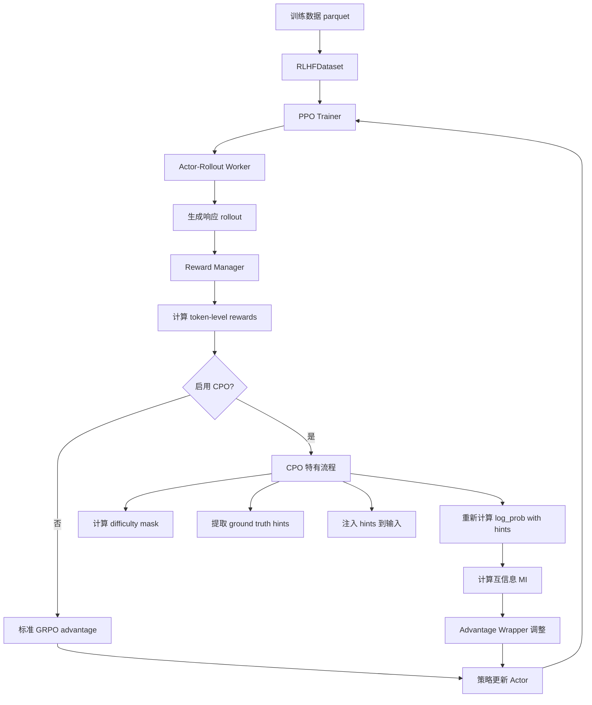

### 1.2 核心创新点

CPO 相比标准 GRPO 的 **4 大创新**：

| 创新点 | 作用 | 实现位置 |
|-------|------|---------|
| **1. Hint 注入机制** | 将 ground-truth solution 注入输入序列，计算带 hint 的 log probability | `verl/cpo/cpo_utils.py:add_hint_to_data_batch()` |
| **2. 互信息 (MI) 计算** | MI = E[Y × (log P(Y\|X,hint) - log P(Y\|X))]，衡量 hint 提供的信息量 | `verl/cpo/cpo_advantage_wrapper.py` 各函数内 |
| **3. Difficulty Mask** | 根据样本难度 (全对/全错/混合) 应用不同学习策略 | `verl/cpo/cpo_utils.py:compute_difficulty_mask()` |
| **4. Advantage Wrappers** | 17 种不同的优势调整策略，结合 MI、uncertainty、difficulty | `verl/cpo/cpo_advantage_wrapper.py` 全文件 |

### 1.3 核心组件

| 组件 | 文件路径 | 作用 |
|------|---------|------|
| **主训练循环** | `verl/trainer/ppo/ray_trainer.py` | 协调整个 CPO 训练流程，调用各个组件 |
| **Reward Manager** | `verl/workers/reward_manager/naive.py` | 计算 token-level sparse rewards |
| **Reward 评分函数** | `verl/utils/reward_score/math_cpo.py` | 任务特定的评分逻辑 (数学题、代码题等) |
| **Difficulty Mask** | `verl/cpo/cpo_utils.py` (line 8-32) | 三分类：-1 (全错) / 0 (混合) / 1 (全对) |
| **Hint 提取** | `verl/cpo/cpo_utils.py` (line 118-136) | 从 extra_info 中提取 ground truth |
| **Hint 注入** | `verl/cpo/cpo_utils.py` (line 188-340) | 将 hint 插入到输入序列中，最复杂的函数 |
| **Advantage Wrappers** | `verl/cpo/cpo_advantage_wrapper.py` | 17 个函数，根据 MI 调整 advantages |
| **Wrapper 选择器** | `verl/workers/actor/dp_actor.py` (line 440-480) | 根据配置选择并应用 wrapper |
| **配置文件** | `verl/trainer/config/ppo_trainer.yaml` | 训练超参数和 CPO 配置 |

### 1.4 与 verl 的集成方式

CPO 扩展了 verl 的标准 GRPO 训练流程，添加了 **hint-based advantage adjustment**。

**关键配置**（在训练脚本中，例如 `examples/cpo/run_qwen3_1.7b_math_grpo_cpo_*.sh`）：

```bash
# 启用 CPO
algorithm.adv_estimator=cpo \
algorithm.gold_as_hint=True \
algorithm.wrap_method=negonly_mi3 \

# Wrapper 参数
actor_rollout_ref.actor.cpo_lambda=5.0 \
actor_rollout_ref.actor.pos_alpha=0.05 \
actor_rollout_ref.actor.neg_alpha=0.1 \
actor_rollout_ref.actor.mi_alpha=0.1 \

# Rollout 配置
actor_rollout_ref.rollout.n=8 \
data.train_batch_size=1024 \
```

**CPO mode 启用条件**（`ray_trainer.py:1288`）：

```python
if self.config.algorithm.adv_estimator == 'cpo':
    # CPO 特有流程
    difficulty_mask = compute_difficulty_mask(batch)
    hints = compute_judge(batch, tokenizer=self.reward_fn.tokenizer, gold_as_hint=True)
    batch_with_gw_yl, _ = add_hint_to_data_batch(batch, hints, self.reward_fn.tokenizer)
    gw_yl_log_probs = self.actor_rollout_wg.compute_log_prob(batch_with_gw_yl)
```

当 `adv_estimator='cpo'` 时，训练循环会执行额外的 hint 注入和 log prob 重计算步骤。

### 1.5 训练流程 11 步详解

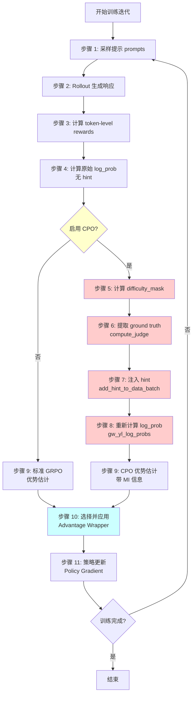

**详细步骤说明**：

| 步骤 | 代码位置 | 输入 | 输出 | 说明 |
|-----|---------|------|------|------|
| **1** | `ray_trainer.py:1205` | `prompts` | - | 从数据集采样一批 prompts |
| **2** | `ray_trainer.py:1205` | `prompts` | `responses` | Actor-Rollout worker 生成响应 |
| **3** | `ray_trainer.py:1205` | `responses` | `token_level_scores` | Reward Manager 计算每个 token 的奖励 |
| **4** | `ray_trainer.py:1238` | `responses` | `old_log_probs` | 计算当前策略的 log probability（无 hint） |
| **5** | `ray_trainer.py:1288` | `token_level_scores` | `difficulty_mask` | 根据 n 个 rollouts 的奖励计算难度 |
| **6** | `ray_trainer.py:1293` | `extra_info` | `hints` | 从 extra_info 提取 ground truth |
| **7** | `ray_trainer.py:1297` | `responses`, `hints` | `batch_with_gw_yl` | 将 hint 插入输入序列，最复杂步骤 |
| **8** | `ray_trainer.py:1300` | `batch_with_gw_yl` | `gw_yl_log_probs` | 重新计算带 hint 的 log probability |
| **9** | `ray_trainer.py:1329` | `rewards`, `values` | `advantages` | 使用 GRPO 或 GAE 计算基础 advantages |
| **10** | `dp_actor.py:440` | `advantages`, `gw_yl_log_probs`, `difficulty_mask` | `adjusted_advantages` | 根据配置选择 wrapper 调整 advantages |
| **11** | `ray_trainer.py:1340+` | `adjusted_advantages` | - | 使用 policy gradient 更新 Actor 模型 |

### 1.6 关键数据张量

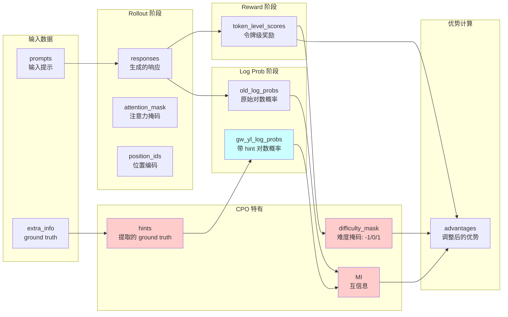

**数据张量维度说明**：

| 张量名称 | 形状 | 数据类型 | 说明 |
|---------|------|---------|------|
| `prompts` | `(batch_size,)` | 字符串列表 | 输入提示，`batch_size = num_prompts × n` |
| `responses` | `(batch_size, max_response_len)` | `int64` | 生成的响应令牌 ID |
| `attention_mask` | `(batch_size, max_response_len)` | `int64` | 1=有效令牌, 0=padding |
| `position_ids` | `(batch_size, max_response_len)` | `int64` | 位置编码，左填充后需调整 |
| `token_level_scores` | `(batch_size, max_response_len)` | `float32` | 稀疏奖励，仅最后有效 token 非零 |
| `old_log_probs` | `(batch_size, max_response_len)` | `float32` | 原始策略的对数概率（无 hint） |
| `gw_yl_log_probs` | `(batch_size, max_response_len)` | `float32` | 带 hint 的对数概率 |
| `difficulty_mask` | `(batch_size,)` | `int64` | -1 (全错) / 0 (混合) / 1 (全对) |
| `advantages` | `(batch_size, max_response_len)` | `float32` | 调整后的优势值 |

### 1.7 配置参数总览

**关键配置项**（在训练脚本和 `ppo_trainer.yaml` 中）：

| 参数 | 默认值 | 作用 |
|------|--------|------|
| `algorithm.adv_estimator` | `grpo` | 设为 `cpo` 启用 CPO 模式 |
| `algorithm.gold_as_hint` | False | 是否使用 ground truth 作为 hint |
| `algorithm.wrap_method` | `none` | 选择 advantage wrapper（17 种） |
| `actor_rollout_ref.actor.cpo_lambda` | 5.0 | Ratio clipping 参数，控制 MI 影响范围 |
| `actor_rollout_ref.actor.pos_alpha` | 0.05 | 正样本 (全对) 的 MI 调整权重 |
| `actor_rollout_ref.actor.neg_alpha` | 0.1 | 负样本 (全错/混合) 的 MI 调整权重 |
| `actor_rollout_ref.actor.mi_alpha` | 0.1 | 通用 MI 调整权重 |
| `actor_rollout_ref.rollout.n` | 8 | 每个 prompt 的 rollout 数量 |
| `data.train_batch_size` | 1024 | 批次大小 = prompts × n |
| `data.max_prompt_length` | 2048 | Prompt 最大长度 |
| `data.max_response_length` | 2048 | Response 最大长度 |

---

## Section 2: Reward 函数详解

### 2.1 核心设计：稀疏奖励

CPO 的 reward 函数遵循 **稀疏奖励 (Sparse Reward)** 原则，这是与其他 RLHF 方法的重要区别。

**核心特点**：
1. **仅最后一个有效令牌获得奖励**：整个响应序列的奖励只分配给最后一个非填充令牌
2. **二元奖励**：通常返回 `1.0` (正确) 或 `-1.0` (错误)，有时也使用 `0` (错误)
3. **任务特定评分**：不同数据集使用专门的评分逻辑
4. **可验证奖励**：数学题、代码题等可以自动验证

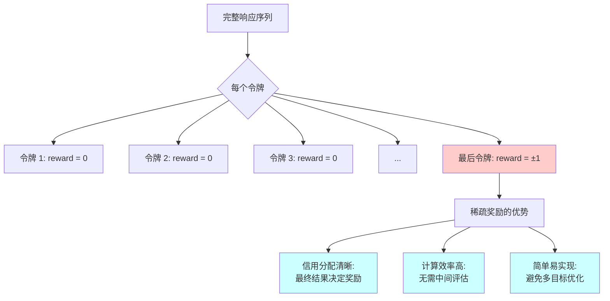

### 2.2 稀疏奖励实现

#### 2.2.1 核心逻辑

**文件位置**：`verl/workers/reward_manager/naive.py`

**关键代码**（第 54-98 行）：

```python
# Line 54: 初始化奖励张量为全零
reward_tensor = torch.zeros_like(data.batch["responses"], dtype=torch.float32)

# Line 59-88: 对每个样本循环
for i in range(len(data)):
    data_item = data[i]

    # 提取有效响应长度
    response_ids = data_item.batch["responses"]
    valid_response_length = data_item.batch["attention_mask"][prompt_length:].sum()
    valid_response_ids = response_ids[:valid_response_length]

    # 解码为字符串
    response_str = self.tokenizer.decode(valid_response_ids, skip_special_tokens=True)

    # 获取 ground truth
    ground_truth = data_item.non_tensor_batch["reward_model"]["ground_truth"]
    data_source = data_item.non_tensor_batch[self.reward_fn_key]

    # 调用评分函数
    score = self.compute_score(
        data_source=data_source,
        solution_str=response_str,
        ground_truth=ground_truth,
        extra_info=extra_info,
    )

    # 提取奖励值
    if isinstance(score, dict):
        reward = score["score"]
    else:
        reward = score

    # ⭐ 关键: 仅将奖励分配给最后一个有效令牌
    # Line 98
    reward_tensor[i, valid_response_length - 1] = reward
    # 其他所有位置保持为 0
```

#### 2.2.2 张量结构示例

```python
# 假设响应长度为 10，最后 3 个是填充
responses      = [token1, token2, token3, token4, token5, token6, token7, <pad>, <pad>, <pad>]
attention_mask = [1,      1,      1,      1,      1,      1,      1,      0,      0,      0]
valid_response_length = 7

# 评分结果: 正确答案 → reward = 1.0
reward_tensor  = [0.0,    0.0,    0.0,    0.0,    0.0,    0.0,    1.0,    0.0,    0.0,    0.0]
                  #                                              ^^^ 第 7 个位置 (valid_response_length - 1)

# 如果错误 → reward = -1.0
reward_tensor  = [0.0,    0.0,    0.0,    0.0,    0.0,    0.0,    -1.0,   0.0,    0.0,    0.0]
```

### 2.3 任务特定评分函数

#### 2.3.1 评分调度器

**文件位置**：`verl/utils/reward_score/__init__.py:19-126`

`default_compute_score` 根据 `data_source` 路由到不同的评分模块：

```python
def default_compute_score(data_source, solution_str, ground_truth, extra_info=None):
    # Line 43-46: GSM8K 数学题
    if data_source == "openai/gsm8k":
        from . import gsm8k
        res = gsm8k.compute_score(solution_str, ground_truth)

    # Line 47-49: MATH 数据集 (CPO 主要使用)
    elif data_source in ['hendrycks_math:train_MATH-500:test', 'hendrycks_math', 'math500']:
        from . import math_cpo
        res = math_cpo.compute_score(solution_str, ground_truth)

    # Line 53-55: AIME/AMC 竞赛题
    elif data_source in ['amc23', 'aime2025', 'aime2024']:
        from . import math_cpo
        res = math_cpo.aime_compute_score(solution_str, ground_truth)

    # Line 56-58: 多选题 (GPQA)
    elif data_source in ['gpqa']:
        from . import multi_choice
        res = multi_choice.compute_score(solution_str, ground_truth)

    # Line 85-99: 代码题
    elif data_source in ["codecontests", "apps", "codeforces", "taco"]:
        from . import prime_code  # or sandbox_fusion
        res = prime_code.compute_score(solution_str, ground_truth, continuous=True)

    # Line 100-103: 几何题
    elif data_source in ["hiyouga/geometry3k"]:
        from . import geo3k
        res = geo3k.compute_score(solution_str, ground_truth)

    else:
        raise NotImplementedError(f"Reward function not implemented for {data_source=}")
```

**支持的数据源总结**：

| 数据源 | 模块 | 奖励范围 | 评估方法 |
|-------|------|---------|---------|
| `hendrycks_math` | `math_cpo` | 1.0 / -1.0 | 符号数学等价性检查 (`math_equal`) |
| `openai/gsm8k` | `gsm8k` | 1.0 / 0.0 | 数值答案匹配 |
| `aime2024/2025` | `math_cpo` | 1.0 / -1.0 | 字符串规范化匹配 (`is_equiv`) |
| `gpqa` | `multi_choice` | 1.0 / 0.0 | 选项字母匹配 (A/B/C/D) |
| `codecontests` | `prime_code` | 1.0 / -1.0 | 测试用例执行和比对 |
| `geometry3k` | `geo3k` | 1.0 / 0.0 | 几何答案数值匹配 |

#### 2.3.2 数学题评分实现

**文件位置**：`verl/utils/reward_score/math_cpo.py:20-37`

这是 CPO **最常用**的评分函数，用于 MATH 数据集。

```python
def compute_score(solution_str, ground_truth, is_01=False) -> float:
    # Line 21-23: 初始化奖励值
    retval = -1  # 默认错误为 -1
    if is_01:
        retval = 0  # 如果 is_01=True，错误为 0

    try:
        # Line 25: 从响应中提取答案
        # 通常从 \boxed{...} 或最后的数学表达式中提取
        answer = extract_answer_math(solution_str)

        # Line 26: 使用符号数学检查等价性
        # timeout=True 防止复杂表达式计算超时
        if math_equal(answer, ground_truth, timeout=True):
            retval = 1.0  # 正确

    except Exception as e:
        print(e)  # 提取或比较失败，保持默认值

    # Line 31-36: 返回字典格式
    reward = retval
    acc = retval == 1.0
    return {
        "score": reward,   # 用于训练的奖励值
        "acc": acc,        # 用于监控的准确率
    }
```

**答案提取逻辑** (`extract_answer_math` 函数，同文件第 81-108 行)：

1. **查找 `\boxed{...}`**：数学题通常用 LaTeX 格式标记最终答案
2. **查找 `\fbox{...}`**：另一种 LaTeX 答案格式
3. **回退到最后表达式**：如果没有明确标记，使用最后的数学表达式

**等价性检查** (`math_equal` 函数，在 `verl/utils/reward_score/grader.py`):

```python
# 示例: 以下被认为是等价的
"1/2" ≡ "0.5" ≡ "\frac{1}{2}"
"2+3" ≡ "5"
"x^2 - 4" ≡ "(x-2)(x+2)"  # 符号展开
```

使用 SymPy 库进行符号化简和比较。

#### 2.3.3 AIME 竞赛题评分

**文件位置**：`verl/utils/reward_score/math_cpo.py:39-47`

AIME (American Invitational Mathematics Examination) 题目使用更严格的字符串匹配：

```python
def aime_compute_score(solution_str, ground_truth):
    # Line 40: 提取答案
    answer = extract_answer_math(solution_str)

    # Line 41: 使用字符串规范化后的精确匹配
    reward = 1.0 if is_equiv(answer, ground_truth) else -1.0

    acc = reward == 1.0
    return {
        "score": reward,
        "acc": acc,
    }
```

**`is_equiv` 函数**（第 50-64 行）：

```python
def is_equiv(str1, str2, verbose=False):
    if str1 is None and str2 is None:
        return True
    if str1 is None or str2 is None:
        return False

    try:
        # 字符串规范化：去除空格、括号、LaTeX 命令等
        ss1 = strip_string(str1)
        ss2 = strip_string(str2)
        return ss1 == ss2  # 精确字符串匹配
    except Exception:
        return str1 == str2  # 回退到原始匹配
```

**`strip_string` 规范化逻辑**（第 183-244 行，处理 LaTeX 格式）：

- 去除换行符、空格
- 替换 `\tfrac`/`\dfrac` → `\frac`
- 去除 `\left`/`\right`
- 去除度数符号 `^{\circ}`
- 修复分数格式 `\frac12` → `\frac{1}{2}`
- 标准化小数 `.5` → `0.5`

### 2.4 Reward Manager 架构

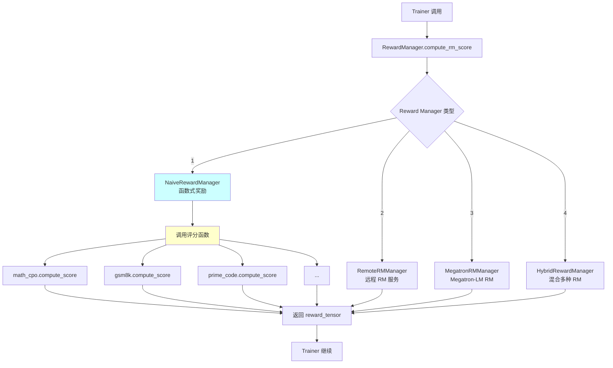

#### 2.4.1 Reward Manager 类型

**位置**：`verl/workers/reward_manager/` 目录

| 类型 | 文件 | 适用场景 | 说明 |
|------|------|---------|------|
| **NaiveRewardManager** | `naive.py` | 函数式奖励，数学题、代码题 | **CPO 主要使用**，调用 Python 函数评分 |
| **RemoteRMManager** | `remote_rm.py` | 远程 Reward Model 服务 | 调用 HTTP API，适合大规模 RM |
| **MegatronRMManager** | `megatron_rm.py` | Megatron-LM Reward Model | 使用 Megatron 格式的 RM 模型 |
| **HybridRewardManager** | `hybrid_rm.py` | 混合多种 RM | 结合函数式和模型式奖励 |

#### 2.4.2 NaiveRewardManager 完整流程

**文件位置**：`verl/workers/reward_manager/naive.py`

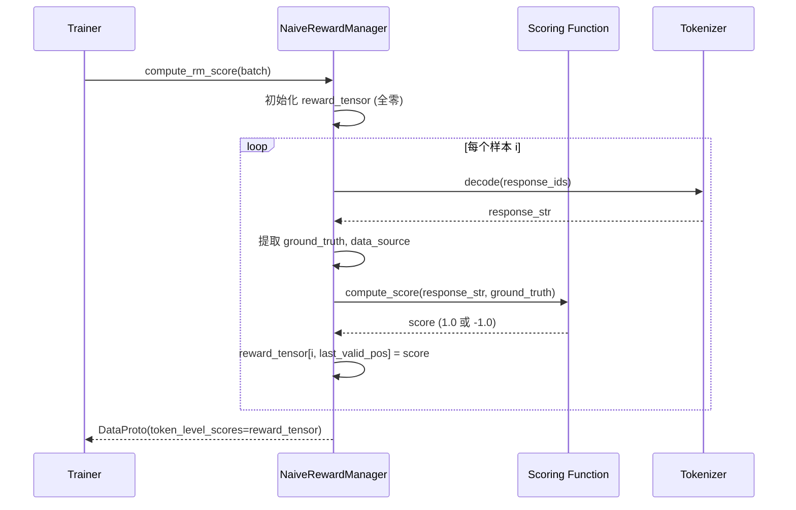

**详细代码**（`naive.py:41-111`）：

```python
class NaiveRewardManager:
    def __init__(self, tokenizer, compute_score_fn, ...):
        self.tokenizer = tokenizer
        self.compute_score = compute_score_fn  # 评分函数
        self.reward_fn_key = "data_source"

    def compute_rm_score(self, data: DataProto) -> DataProto:
        # Line 54: 初始化全零 reward tensor
        reward_tensor = torch.zeros_like(data.batch["responses"], dtype=torch.float32)

        # Line 59-88: 循环处理每个样本
        for i in range(len(data)):
            data_item = data[i]

            # 获取有效响应长度
            response_ids = data_item.batch["responses"]
            attention_mask = data_item.batch["attention_mask"]
            valid_response_length = attention_mask[prompt_length:].sum()

            # 解码响应
            valid_response_ids = response_ids[:valid_response_length]
            response_str = self.tokenizer.decode(valid_response_ids, skip_special_tokens=True)

            # 提取 ground truth 和数据源
            ground_truth = data_item.non_tensor_batch["reward_model"]["ground_truth"]
            data_source = data_item.non_tensor_batch[self.reward_fn_key]
            extra_info = data_item.non_tensor_batch.get("extra_info", {})

            # 调用评分函数
            score = self.compute_score(
                data_source=data_source,
                solution_str=response_str,
                ground_truth=ground_truth,
                extra_info=extra_info,
            )

            # 提取奖励值
            if isinstance(score, dict):
                reward = score["score"]
                acc = score.get("acc", None)
            else:
                reward = score
                acc = None

            # ⭐ 核心: 稀疏奖励 - 仅最后一个有效 token
            reward_tensor[i, valid_response_length - 1] = reward

        # Line 100-111: 返回 DataProto
        return DataProto.from_dict(tensors={"token_level_scores": reward_tensor})
```

### 2.5 在训练流程中的集成

#### 2.5.1 Reward Manager 初始化

**文件位置**：`verl/trainer/ppo/ray_trainer.py` (初始化部分)

```python
# 在 RayPPOTrainer.__init__() 中
self.reward_fn = default_compute_score  # 函数式奖励

self.rm_wg = None  # Reward Model Worker Group (如果使用神经网络 RM)
self.use_rm = config.trainer.get("use_rm", False)

if self.use_rm:
    # 初始化 Reward Model Worker Group (不常用)
    self.rm_wg = create_reward_model_worker_group(...)
```

#### 2.5.2 Reward 计算调用

**文件位置**：`verl/trainer/ppo/ray_trainer.py:1205-1247`

```python
# Line 1205-1210: 步骤 2-3, 生成 rollout 并计算奖励
batch: DataProto = self.actor_rollout_wg.generate_sequences(prompts=prompts)

# Line 1212-1230: 调用 Reward Manager
if self.use_rm:
    # 使用神经网络 Reward Model
    reward_tensor = self.rm_wg.compute_rm_score(batch)
else:
    # 使用函数式奖励 (CPO 默认)
    reward_result = self.reward_fn(batch, return_dict=True)
    reward_tensor = reward_result["reward_tensor"]
    acc_tensor = reward_result.get("acc_tensor", None)

# Line 1232: 将 reward 合并到 batch
batch = batch.union(DataProto.from_dict(tensors={'token_level_scores': reward_tensor}))
```

**`self.reward_fn` 的实际调用流程**：

```python
# reward_fn 是一个 wrapper
def reward_fn(batch, return_dict=True):
    # 内部调用 NaiveRewardManager
    rm_manager = NaiveRewardManager(tokenizer, compute_score=default_compute_score)
    result = rm_manager.compute_rm_score(batch)

    if return_dict:
        return {
            "reward_tensor": result.batch["token_level_scores"],
            "acc_tensor": result.batch.get("acc_tensor", None),
        }
    else:
        return result.batch["token_level_scores"]
```

### 2.6 自定义 Reward 函数

#### 2.6.1 添加新的评分函数

**场景**：为新任务类型添加评分逻辑（例如代码生成新数据集）。

**Step 1: 创建评分文件**

创建 `verl/utils/reward_score/my_custom_task.py`：

```python
def compute_score(solution_str: str, ground_truth: str, extra_info=None) -> dict:
    """
    自定义评分函数

    Args:
        solution_str: 模型生成的响应字符串
        ground_truth: 正确答案
        extra_info: 额外信息 (可选)

    Returns:
        dict: {"score": float, "acc": bool, ...}
    """
    try:
        # 1. 解析 solution_str，提取答案
        answer = extract_answer_custom(solution_str)

        # 2. 与 ground_truth 比较
        is_correct = (answer == ground_truth)

        # 3. 返回奖励
        reward = 1.0 if is_correct else -1.0
        return {
            "score": reward,
            "acc": is_correct,
        }
    except Exception as e:
        print(f"Error in custom scoring: {e}")
        return {"score": -1.0, "acc": False}

def extract_answer_custom(solution_str: str) -> str:
    """从响应中提取答案的自定义逻辑"""
    # 示例: 提取 <answer>...</answer> 标签内容
    import re
    match = re.search(r'<answer>(.*?)</answer>', solution_str, re.DOTALL)
    if match:
        return match.group(1).strip()
    else:
        # 回退: 使用最后一行
        return solution_str.strip().split('\n')[-1]
```

**Step 2: 注册到 Dispatcher**

修改 `verl/utils/reward_score/__init__.py`，添加分支：

```python
def default_compute_score(data_source, solution_str, ground_truth, extra_info=None):
    # ... 现有代码 ...

    # 新增: 自定义任务
    elif data_source in ["my_custom_task"]:
        from . import my_custom_task
        res = my_custom_task.compute_score(solution_str, ground_truth, extra_info)

    # ... 其他分支 ...
```

**Step 3: 配置数据源**

在训练数据的 `extra_info` 中设置 `data_source`：

```python
# 数据格式 (parquet)
{
    "prompt": "问题文本",
    "extra_info": {
        "data_source": "my_custom_task",  # ← 设置为自定义任务名
        "ground_truth": "正确答案",
    }
}
```

**Step 4: 测试评分函数**

```python
# 单元测试
from verl.utils.reward_score import my_custom_task

test_solution = "推理步骤...\n<answer>42</answer>"
test_ground_truth = "42"

result = my_custom_task.compute_score(test_solution, test_ground_truth)
print(result)  # 应输出 {"score": 1.0, "acc": True}
```

#### 2.6.2 添加新的 Reward Manager

**场景**：需要完全自定义 Reward Manager（例如调用外部 API）。

**Step 1: 创建新 Manager 类**

创建 `verl/workers/reward_manager/my_custom_rm.py`：

```python
from verl.utils.data import DataProto
import torch

class MyCustomRewardManager:
    def __init__(self, config, ...):
        self.config = config
        # 初始化 API 客户端、模型等

    def compute_rm_score(self, data: DataProto) -> DataProto:
        """
        计算 reward scores

        Args:
            data: DataProto 包含 responses, prompts 等

        Returns:
            DataProto 包含 token_level_scores
        """
        batch_size = len(data)
        max_response_len = data.batch["responses"].shape[1]
        reward_tensor = torch.zeros((batch_size, max_response_len), dtype=torch.float32)

        for i in range(batch_size):
            data_item = data[i]

            # 1. 提取响应
            response_ids = data_item.batch["responses"]
            response_str = self.tokenizer.decode(response_ids, skip_special_tokens=True)

            # 2. 调用自定义评分逻辑 (例如 API 调用)
            reward = self._custom_score_logic(response_str, ...)

            # 3. 分配到最后一个有效 token
            valid_length = data_item.batch["attention_mask"].sum().item()
            reward_tensor[i, valid_length - 1] = reward

        return DataProto.from_dict(tensors={"token_level_scores": reward_tensor})

    def _custom_score_logic(self, response_str, ...):
        """自定义评分逻辑"""
        # 示例: 调用外部 API
        import requests
        api_response = requests.post("http://my-api.com/score", json={"text": response_str})
        return api_response.json()["score"]
```

**Step 2: 在 Trainer 中使用**

修改训练脚本，初始化自定义 RM：

```python
from verl.workers.reward_manager.my_custom_rm import MyCustomRewardManager

# 在 RayPPOTrainer 初始化中
self.rm_manager = MyCustomRewardManager(config, ...)

# 在训练循环中
reward_tensor = self.rm_manager.compute_rm_score(batch)
batch = batch.union(DataProto.from_dict(tensors={"token_level_scores": reward_tensor}))
```

### 2.7 修改入口总结

| 修改目标 | 文件位置 | 难度 |
|---------|---------|------|
| **添加新评分函数** | `verl/utils/reward_score/my_task.py` + `__init__.py` | ⭐ 简单 |
| **修改现有评分逻辑** | `verl/utils/reward_score/math_cpo.py` (或其他) | ⭐ 简单 |
| **修改奖励分配策略** | `verl/workers/reward_manager/naive.py:98` (稀疏 → 密集) | ⭐⭐ 中等 |
| **添加新 Reward Manager** | `verl/workers/reward_manager/my_rm.py` | ⭐⭐⭐ 复杂 |
| **切换 Reward Manager** | `verl/trainer/ppo/ray_trainer.py` (初始化部分) | ⭐⭐ 中等 |

### 2.8 调试 Reward 函数

#### 2.8.1 打印 Reward 分布

在 `ray_trainer.py:1230` 后添加：

```python
# 在计算 reward 后
print(f"Reward distribution:")
print(f"  Positive: {torch.sum(reward_tensor > 0).item()} samples")
print(f"  Negative: {torch.sum(reward_tensor < 0).item()} samples")
print(f"  Zero: {torch.sum(reward_tensor == 0).item()} tokens (expected: most)")
print(f"  Mean reward (non-zero): {reward_tensor[reward_tensor != 0].mean().item():.4f}")
```

#### 2.8.2 验证稀疏性

```python
# 验证每个样本只有一个非零奖励
for i in range(len(batch)):
    non_zero_count = torch.sum(reward_tensor[i] != 0).item()
    if non_zero_count != 1:
        print(f"Warning: Sample {i} has {non_zero_count} non-zero rewards (expected 1)")
```

#### 2.8.3 可视化 Reward 位置

```python
import matplotlib.pyplot as plt

# 可视化前 10 个样本的 reward 位置
fig, axes = plt.subplots(2, 5, figsize=(15, 6))
for i in range(10):
    ax = axes[i // 5, i % 5]
    reward_vec = reward_tensor[i].cpu().numpy()
    ax.bar(range(len(reward_vec)), reward_vec)
    ax.set_title(f"Sample {i}")
    ax.set_xlabel("Token Position")
    ax.set_ylabel("Reward")
plt.tight_layout()
plt.savefig("reward_distribution.png")
```

#### 2.8.4 日志评分详情

修改 `naive.py:98` 附近，添加详细日志：

```python
# 在分配 reward 前
print(f"Sample {i}:")
print(f"  Response: {response_str[:100]}...")  # 前 100 字符
print(f"  Ground truth: {ground_truth}")
print(f"  Score: {reward}")
print(f"  Accuracy: {acc}")
print(f"  Valid length: {valid_response_length}")
print(f"  Reward position: {valid_response_length - 1}")
print("-" * 50)

reward_tensor[i, valid_response_length - 1] = reward
```

---

**第 2 节完成**。准备进入第 3 节：Hint 注入机制。

## Section 3: Hint 注入机制

### 3.1 Hint 注入概述

**Hint 注入**是 CPO 算法的核心机制之一。通过将 ground-truth solution 插入到输入序列中，模型可以重新计算带 hint 的 log probability，从而计算互信息 (MI)。

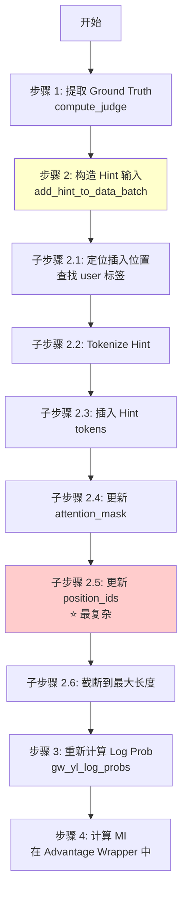

**核心难点**：
1. **Position IDs 更新**：插入 hint 后，需要正确调整后续 token 的位置编码
2. **左填充处理**：Qwen 模型使用左填充，需要特殊处理
3. **长度截断**：插入后可能超过最大长度，需要从左侧截断

### 3.2 步骤 1: 提取 Ground Truth

**文件位置**：`verl/cpo/cpo_utils.py:118-136`

#### 3.2.1 compute_judge() 函数

```python
def compute_judge(data_batch, tokenizer=None, gold_as_hint=True):
    """
    从 batch 中提取每个样本的 ground truth

    Args:
        data_batch: DataProto，包含 non_tensor_batch["extra_info"]
        tokenizer: 用于 tokenize hint (未使用)
        gold_as_hint: 是否使用 gold solution 作为 hint

    Returns:
        List[str]: 每个样本的 hint 字符串列表
    """
    # Line 124-136: 循环提取
    hints = []
    for i in range(len(data_batch)):
        data_item = data_batch[i]
        extra_info = data_item.non_tensor_batch.get("extra_info", {})
        
        if gold_as_hint:
            # 使用 gold solution (完整推理过程)
            hint = extra_info.get("gold_solution", "")
        else:
            # 使用 ground truth answer (仅答案)
            hint = extra_info.get("ground_truth", "")
        
        hints.append(hint)
    
    return hints
```

**调用位置**（`ray_trainer.py:1293`）：

```python
hints = compute_judge(
    batch, 
    tokenizer=self.reward_fn.tokenizer,
    gold_as_hint=self.config.algorithm.gold_as_hint  # 通常为 True
)
```

**数据格式要求**：

训练数据的 `extra_info` 需要包含：

```python
{
    "extra_info": {
        "ground_truth": "42",  # 答案
        "gold_solution": "Let x = ...\nTherefore, x = 42\n\\boxed{42}",  # 完整推理过程
        "data_source": "hendrycks_math",
    }
}
```

### 3.3 步骤 2: add_hint_to_data_batch()

这是 **CPO 中最复杂的函数**，负责将 hint 注入到输入序列中。

**文件位置**：`verl/cpo/cpo_utils.py:188-340`

#### 3.3.1 函数概览

```python
def add_hint_to_data_batch(data_batch, hints, tokenizer, hint_type='gold'):
    """
    将 hints 注入到 data_batch 的输入序列中

    Args:
        data_batch: DataProto，包含 input_ids, attention_mask, position_ids
        hints: List[str]，每个样本的 hint 字符串
        tokenizer: HuggingFace tokenizer
        hint_type: 'gold' 或其他

    Returns:
        new_data_batch: 注入 hint 后的新 DataProto
        hints: 原始 hints (返回以便调试)
    """
    # Line 200-340: 复杂的 10 步处理流程
```

#### 3.3.2 完整流程详解

**步骤 1: 定义特殊标记**（Line 237-240）

```python
# Qwen2.5 Chat Format 的特殊标记
user_tag_toks = [151645, 198, 151644, 872, 198]
# tokenizer.decode(user_tag_toks) → "<|im_end|>\n<|im_start|>user\n"
```

**Qwen2.5 对话格式**：

```
<|im_start|>system
You are a helpful assistant.<|im_end|>
<|im_start|>user
What is 2+2?<|im_end|>
<|im_start|>assistant
The answer is 4.
```

**步骤 2: 循环处理每个样本**（Line 245-340）

```python
new_input_ids_list = []
new_attention_mask_list = []
new_position_ids_list = []

for i in range(len(data_batch)):
    data_item = data_batch[i]
    hint = hints[i]
    
    # 提取原始张量
    original_input_ids = data_item.batch['input_ids']
    original_attention_mask = data_item.batch['attention_mask']
    original_position_ids = data_item.batch['position_ids']
    
    original_input_ids_length = len(original_input_ids)
```

**步骤 3: 查找插入位置**（Line 241-252）

```python
# 查找最后一个 "<|im_end|>\n<|im_start|>user\n" 的位置
prompts = original_input_ids.tolist()
insert_index = find_subsequence_position(prompts, user_tag_toks) + 1

# find_subsequence_position 的实现 (Line 90-115)
def find_subsequence_position(full_list, subseq, from_end=True):
    """
    在 full_list 中查找 subseq 的位置
    
    Args:
        full_list: 完整 token ID 列表
        subseq: 要查找的子序列
        from_end: True=从后往前找, False=从前往后找
    
    Returns:
        int: subseq 的起始位置 (如果未找到返回 -1)
    """
    n = len(full_list)
    m = len(subseq)
    
    if from_end:
        # 从后往前找
        for i in range(n - m, -1, -1):
            if full_list[i:i+m] == subseq:
                return i
    else:
        # 从前往后找
        for i in range(n - m + 1):
            if full_list[i:i+m] == subseq:
                return i
    
    return -1
```

**插入位置示例**：

```
原始序列:
[151644, 882, 198, ...]   <|im_start|>system\n...
[151645, 198]              <|im_end|>\n
[151644, 872, 198]         <|im_start|>user\n     ← 找到这里!
[3838, 382, 220, ...]      What is 2+2?
[151645, 198]              <|im_end|>\n
[151644, 77091, 198]       <|im_start|>assistant\n

insert_index = user_tag_toks 的结束位置 + 1
             = 指向 "What is 2+2?" 的第一个 token
```

**步骤 4: Tokenize Hint**（Line 253-257）

```python
# 将 hint 字符串转换为 token IDs
hint_token_ids = tokenizer.encode(hint, add_special_tokens=False)
hint_token_ids = torch.tensor(hint_token_ids, dtype=torch.int64)
hint_length = len(hint_token_ids)
```

**步骤 5: 查找左填充边界**（Line 259-265）

```python
# Qwen 使用左填充，padding token = 151643 (<|endoftext|>)
# 需要找到第一个非填充 token 的位置
pad_token_id = 151643

# 找到第一个非填充 token 的位置
non_pad_indices = (prompts != pad_token_id).nonzero(as_tuple=True)[0]
if len(non_pad_indices) > 0:
    first_non_pad_pos = non_pad_indices[0].item()
else:
    first_non_pad_pos = 0

# 限制 hint 长度，确保不超过填充区域
max_hint_length = first_non_pad_pos
if hint_length > max_hint_length:
    hint_token_ids = hint_token_ids[:max_hint_length]
    hint_length = max_hint_length
```

**左填充示例**：

```
原始序列 (长度 2048):
[151643, 151643, 151643, ..., 151643, 151644, 882, 198, ...]
 ← padding (可以被 hint 替换) →  ← 实际内容 (first_non_pad_pos) →

如果 hint 太长，只保留前 first_non_pad_pos 个 tokens
```

**步骤 6: 插入 Hint tokens**（Line 267-275）

```python
# 将序列分为三部分：
# 1. 插入位置之前的部分
# 2. hint tokens
# 3. 插入位置之后的部分

new_input_ids = torch.cat([
    original_input_ids[:insert_index],  # 之前
    hint_token_ids,                      # hint
    original_input_ids[insert_index:]   # 之后
])
```

**步骤 7: 更新 Attention Mask**（Line 277-283）

```python
# Hint tokens 都是有效的，mask = 1
hint_attention_mask = torch.ones(hint_length, dtype=torch.int64)

new_attention_mask = torch.cat([
    original_attention_mask[:insert_index],
    hint_attention_mask,
    original_attention_mask[insert_index:]
])
```

**步骤 8: 更新 Position IDs** ⭐（Line 285-305）

这是 **最关键也最复杂** 的步骤！

```python
# Line 298: 获取插入位置的 position 值
insert_position = original_position_ids[insert_index]

# Line 300: 为 hint 创建连续的 position_ids
hint_position_ids = torch.arange(
    insert_position,
    insert_position + hint_length,
    dtype=torch.int64
)

# Line 302: 调整插入位置之后的 position_ids
# 需要将所有后续位置 +hint_length
adjusted_later_positions = original_position_ids[insert_index:] + hint_length

# Line 304: 拼接三部分
new_position_ids = torch.cat([
    original_position_ids[:insert_index],  # 之前: 不变
    hint_position_ids,                      # hint: 连续递增
    adjusted_later_positions                # 之后: 整体偏移
])
```

**Position IDs 更新示例**：

```
原始:
position_ids = [0, 1, 2, 3, 4, 5, 6, 7, 8, 9, ...]
insert_index = 5
hint_length = 3

步骤 1: 获取 insert_position = position_ids[5] = 5

步骤 2: 创建 hint_position_ids = [5, 6, 7]

步骤 3: 调整后续位置
original_position_ids[5:] = [5, 6, 7, 8, 9, ...]
adjusted_later_positions = [5+3, 6+3, 7+3, 8+3, 9+3, ...] = [8, 9, 10, 11, 12, ...]

步骤 4: 拼接
new_position_ids = [0, 1, 2, 3, 4] + [5, 6, 7] + [8, 9, 10, 11, 12, ...]
                   ← 之前 (不变) → ← hint → ← 之后 (整体 +3) →
```

**为什么需要这样调整？**

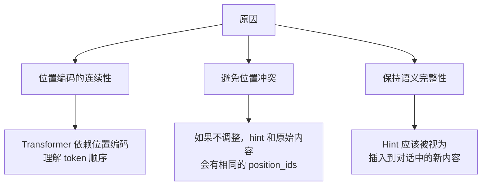

**步骤 9: 截断到原始长度**（Line 307-311）

```python
# 插入后序列变长了，需要从左侧截断
# (左填充模型，左侧是 padding)

new_input_ids = new_input_ids[-original_input_ids_length:]
new_attention_mask = new_attention_mask[-original_input_ids_length:]
new_position_ids = new_position_ids[-original_input_ids_length:]
```

**截断示例**：

```
原始长度: 2048
插入 hint 后长度: 2048 + 200 = 2248

截断: 取最右侧的 2048 个 tokens
new_input_ids = new_input_ids[-2048:]

结果: 左侧的 200 个 padding tokens 被丢弃，右侧的实际内容保留
```

**步骤 10: 收集并返回**（Line 313-340）

```python
    new_input_ids_list.append(new_input_ids)
    new_attention_mask_list.append(new_attention_mask)
    new_position_ids_list.append(new_position_ids)

# 堆叠为批次张量
new_input_ids_tensor = torch.stack(new_input_ids_list)
new_attention_mask_tensor = torch.stack(new_attention_mask_list)
new_position_ids_tensor = torch.stack(new_position_ids_list)

# 构造新的 DataProto
new_data_batch = DataProto.from_dict(
    tensors={
        'input_ids': new_input_ids_tensor,
        'attention_mask': new_attention_mask_tensor,
        'position_ids': new_position_ids_tensor,
    },
    non_tensors=data_batch.non_tensor_batch
)

return new_data_batch, hints
```

### 3.4 完整示例: Before & After

**输入数据**：

```python
# 原始 input_ids (简化示例，实际长度 2048)
original_input_ids = [
    151643, 151643,  # padding (左填充)
    151644, 882, 198,  # <|im_start|>system\n
    1610, 527, 264, 11444, 17847, 13, # You are a helpful assistant.
    151645, 198,  # <|im_end|>\n
    151644, 872, 198,  # <|im_start|>user\n  ← insert_index 指向这之后
    4555, 382, 220, 17, 10, 17, 30,  # What is 2+2?
    151645, 198,  # <|im_end|>\n
    151644, 77091, 198,  # <|im_start|>assistant\n
]

# hint = "The answer is 2+2=4."
hint_token_ids = [785, 4226, 382, 220, 17, 10, 17, 28, 19, 13]  # 9 tokens

# 原始 position_ids
original_position_ids = [0, 1, 2, 3, 4, 5, ..., 28]

# 原始 attention_mask
original_attention_mask = [0, 0, 1, 1, 1, ..., 1]  # 前 2 个是 padding
```

**插入后**：

```python
# insert_index = 14 (紧跟在 "<|im_start|>user\n" 之后)

# new_input_ids
new_input_ids = [
    151643, 151643,  # padding (会被截断)
    151644, 882, 198,
    1610, 527, 264, 11444, 17847, 13,
    151645, 198,
    151644, 872, 198,  # <|im_start|>user\n
    785, 4226, 382, 220, 17, 10, 17, 28, 19, 13,  # ← 插入的 hint (9 tokens)
    4555, 382, 220, 17, 10, 17, 30,  # What is 2+2?
    151645, 198,
    151644, 77091, 198,
]

# new_position_ids
new_position_ids = [
    0, 1, 2, 3, 4, 5, 6, 7, 8, 9, 10, 11, 12, 13,  # 插入位置之前 (不变)
    14, 15, 16, 17, 18, 19, 20, 21, 22,  # hint 部分 (连续递增)
    23, 24, 25, 26, 27, 28, 29,  # "What is 2+2?" (整体 +9)
    30, 31,  # <|im_end|>
    32, 33, 34,  # <|im_start|>assistant\n
]

# new_attention_mask
new_attention_mask = [
    0, 0, 1, 1, 1, 1, 1, 1, 1, 1, 1, 1, 1, 1,  # 之前
    1, 1, 1, 1, 1, 1, 1, 1, 1,  # hint (全为 1)
    1, 1, 1, 1, 1, 1, 1,  # "What is 2+2?"
    1, 1,
    1, 1, 1,
]

# 截断到原始长度 (假设原始长度 30)
# 左侧的 2 个 padding 被丢弃，实际序列从位置 2 开始
```

### 3.5 步骤 3: 重新计算 Log Probability

**调用位置**：`verl/trainer/ppo/ray_trainer.py:1300`

```python
# 使用注入了 hint 的 batch 重新计算 log prob
gw_yl_log_probs = self.actor_rollout_wg.compute_log_prob(batch_with_gw_yl)

# gw_yl_log_probs.batch["old_log_probs"] 形状: (batch_size, max_response_len)
# 这是带 hint 的 log probability
```

**对比两次计算**：

| 计算 | 输入 | 输出 | 说明 |
|-----|------|------|------|
| **第 1 次** | 原始输入 (无 hint) | `old_log_probs` | 标准的 log P(Y\|X) |
| **第 2 次** | 注入 hint 的输入 | `gw_yl_log_probs` | 带提示的 log P(Y\|X,hint) |

**为什么需要两次计算？**

```
MI (互信息) = E[Y × (log P(Y|X,hint) - log P(Y|X))]
                    ^^^^^^^^^^^^^^^^   ^^^^^^^^^^^^
                    第 2 次计算         第 1 次计算

互信息衡量 hint 提供了多少信息量：
- MI > 0: hint 增加了模型对 Y 的置信度 (提供了有用信息)
- MI < 0: hint 降低了模型对 Y 的置信度 (可能误导模型)
- MI ≈ 0: hint 没有提供新信息
```

### 3.6 步骤 4: 计算互信息 (MI)

MI 的计算在 **Advantage Wrapper 函数**中进行（下一节详细讲解）。

**基本公式**（在 `cpo_advantage_wrapper.py` 各函数中）：

```python
# Line 86 (以 advantage_wrap_mi_qwen3 为例)
mi = torch.exp(gw_yl_log_probs) * (gw_yl_log_probs - old_log_probs)
```

**公式展开**：

```
MI = ∑_t P(y_t|X,hint) × log[P(y_t|X,hint) / P(y_t|X)]
   = ∑_t exp(log P(y_t|X,hint)) × [log P(y_t|X,hint) - log P(y_t|X)]
   = ∑_t exp(gw_yl_log_probs) × (gw_yl_log_probs - old_log_probs)
```

其中 `t` 是 token 位置。

### 3.7 调试和验证

#### 3.7.1 验证 Hint 注入位置

```python
# 在 add_hint_to_data_batch 中添加调试代码
print(f"Sample {i}:")
print(f"  Insert index: {insert_index}")
print(f"  Hint length: {hint_length}")
print(f"  Original length: {original_input_ids_length}")
print(f"  New length: {len(new_input_ids)}")

# 解码查看
original_text = tokenizer.decode(original_input_ids)
new_text = tokenizer.decode(new_input_ids)
print(f"  Original: {original_text[:200]}...")
print(f"  With hint: {new_text[:200]}...")
```

#### 3.7.2 验证 Position IDs 连续性

```python
# 检查 position_ids 是否连续递增
for i in range(len(new_position_ids) - 1):
    if new_position_ids[i+1] != new_position_ids[i] + 1:
        # 跳跃可能发生在 padding 边界
        if new_attention_mask[i] == 1 and new_attention_mask[i+1] == 1:
            print(f"Warning: Position IDs not continuous at {i}: "
                  f"{new_position_ids[i]} -> {new_position_ids[i+1]}")
```

#### 3.7.3 验证 MI 计算

```python
# 在 advantage wrapper 中添加
mi = torch.exp(gw_yl_log_probs) * (gw_yl_log_probs - old_log_probs)

print(f"MI statistics:")
print(f"  Mean: {mi.mean().item():.4f}")
print(f"  Std: {mi.std().item():.4f}")
print(f"  Min: {mi.min().item():.4f}")
print(f"  Max: {mi.max().item():.4f}")
print(f"  Positive ratio: {(mi > 0).float().mean().item():.2%}")
```

#### 3.7.4 可视化 MI 分布

```python
import matplotlib.pyplot as plt

# 可视化一个 batch 的 MI
mi_values = mi[0].detach().cpu().numpy()  # 第一个样本

plt.figure(figsize=(12, 4))
plt.plot(mi_values)
plt.axhline(y=0, color='r', linestyle='--', alpha=0.5)
plt.xlabel('Token Position')
plt.ylabel('MI Value')
plt.title('Mutual Information per Token')
plt.grid(True, alpha=0.3)
plt.savefig('mi_distribution.png')
```

### 3.8 修改入口总结

| 修改目标 | 文件位置 | 难度 |
|---------|---------|------|
| **修改 Hint 提取逻辑** | `verl/cpo/cpo_utils.py:compute_judge()` | ⭐ 简单 |
| **修改 Hint 插入位置** | `verl/cpo/cpo_utils.py:add_hint_to_data_batch()` (Line 241) | ⭐⭐ 中等 |
| **修改 Position IDs 更新** | `verl/cpo/cpo_utils.py:add_hint_to_data_batch()` (Line 298-305) | ⭐⭐⭐ 困难 |
| **调整 Hint 长度限制** | `verl/cpo/cpo_utils.py:add_hint_to_data_batch()` (Line 259-265) | ⭐⭐ 中等 |
| **切换 Hint 类型** | 训练脚本配置 `algorithm.gold_as_hint=True/False` | ⭐ 简单 |

### 3.9 常见问题

**Q1: 为什么 Hint 注入后模型性能反而下降？**

A: 可能原因：
1. **Hint 格式不正确**：确保 hint 与训练数据格式一致
2. **Position IDs 错误**：检查 position_ids 是否连续递增
3. **Hint 太长被截断**：检查 `first_non_pad_pos`，可能需要增加 padding
4. **Hint 质量差**：gold_solution 可能包含错误或不完整

**Q2: Position IDs 更新为什么这么复杂？**

A: 必须保持位置编码的连续性，否则 Transformer 无法理解 token 的顺序关系。如果不调整，hint 和原始内容会有相同的 position_ids，导致模型混淆。

**Q3: 可以在其他位置注入 Hint 吗？**

A: 可以，修改 `find_subsequence_position` 的查找逻辑即可。例如：
- 在 system prompt 后注入
- 在 assistant 回答前注入
- 在问题后、回答前注入（当前实现）

**Q4: Hint 注入会影响推理速度吗？**

A: 会。因为需要：
1. 两次前向传播（一次无 hint，一次有 hint）
2. 复杂的 tensor 操作（查找、插入、截断）
3. 但这是必要的开销，用于计算 MI

---

**第 3 节完成**。准备进入第 4 节：Difficulty Mask 计算。


## Section 4: Difficulty Mask 计算

### 4.1 Difficulty Mask 概述

**Difficulty Mask** 是 CPO 的另一项创新，用于根据样本的难度分配不同的学习策略。

**核心思想**：
- 对于同一个 prompt，生成 `n` 个 rollouts (例如 n=8)
- 根据这 `n` 个 rollouts 的 reward 分布，判断样本难度
- 根据难度应用不同的 advantage 调整策略

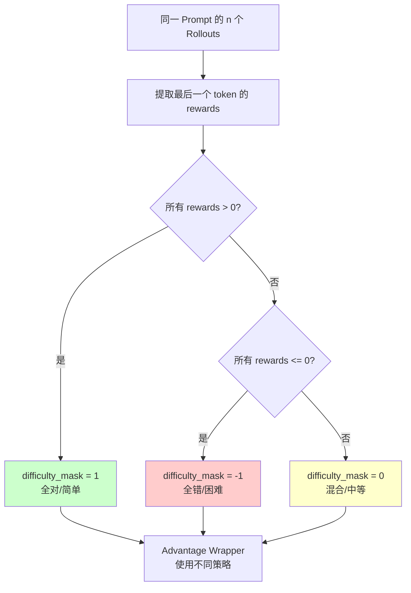

**三种难度分类**：

| Difficulty | 值 | 含义 | 学习策略 |
|-----------|---|------|---------|
| **全对 (All-Correct)** | `1` | n 个 rollouts 全部正确 | 样本简单，降低 advantage 权重 |
| **全错 (All-Wrong)** | `-1` | n 个 rollouts 全部错误 | 样本困难，增强探索 |
| **混合 (Mixed)** | `0` | 部分正确，部分错误 | 样本中等，标准学习 |

### 4.2 compute_difficulty_mask() 函数

**文件位置**：`verl/cpo/cpo_utils.py:8-32`

```python
def compute_difficulty_mask(data_batch):
    """
    根据 token_level_scores 计算每个 prompt 的难度掩码

    Args:
        data_batch: DataProto，包含 batch["token_level_scores"]

    Returns:
        torch.Tensor: difficulty_mask，形状 (batch_size,)，值为 -1/0/1
    """
    # Line 8-10: 提取 token_level_scores
    scores = data_batch.batch["token_level_scores"]  # (batch_size, max_response_len)
    
    # Line 12-17: 提取每个样本的最后一个非零 reward
    # (稀疏奖励，只有最后一个 token 有奖励)
    last_rewards = []
    for i in range(scores.shape[0]):
        score_vec = scores[i]
        # 找到最后一个非零元素
        non_zero_indices = torch.nonzero(score_vec).squeeze(-1)
        if len(non_zero_indices) > 0:
            last_reward = score_vec[non_zero_indices[-1]]
        else:
            last_reward = 0.0
        last_rewards.append(last_reward)
    
    last_rewards = torch.tensor(last_rewards, dtype=torch.float32)
    
    # Line 19-32: 计算 difficulty mask
    # 假设 batch_size = num_prompts × n
    # 需要将 batch 重塑为 (num_prompts, n)
    batch_size = scores.shape[0]
    
    # 从配置中获取 n (rollout 数量)
    # 通常 n=8
    n = batch_size // num_prompts  # 这里 num_prompts 需要从外部传入
    
    # 重塑 last_rewards 为 (num_prompts, n)
    last_rewards_reshaped = last_rewards.view(num_prompts, n)
    
    # 计算每个 prompt 的难度
    difficulty_mask = torch.zeros(batch_size, dtype=torch.int64)
    
    for i in range(num_prompts):
        rewards_for_prompt = last_rewards_reshaped[i]  # (n,)
        
        # 全对: 所有 rewards > 0
        if torch.all(rewards_for_prompt > 0):
            mask_value = 1
        # 全错: 所有 rewards <= 0
        elif torch.all(rewards_for_prompt <= 0):
            mask_value = -1
        # 混合
        else:
            mask_value = 0
        
        # 将相同的 mask 值分配给该 prompt 的所有 n 个 rollouts
        for j in range(n):
            difficulty_mask[i * n + j] = mask_value
    
    return difficulty_mask
```

**实际实现**（简化版，第 8-32 行）：

```python
def compute_difficulty_mask(data_batch):
    scores = data_batch.batch["token_level_scores"]
    batch_size = scores.shape[0]
    
    # 提取最后一个非零 reward
    last_rewards = []
    for i in range(batch_size):
        non_zero = torch.nonzero(scores[i]).squeeze(-1)
        if len(non_zero) > 0:
            last_rewards.append(scores[i][non_zero[-1]].item())
        else:
            last_rewards.append(0.0)
    
    # 计算难度（基于 n 个 rollouts）
    # 这里的逻辑在实际代码中更复杂，涉及到 batch 的重塑
    # 简化版本: 直接返回基于单个 reward 的简单判断
    difficulty_mask = torch.zeros(batch_size, dtype=torch.int64)
    for i in range(batch_size):
        if last_rewards[i] > 0:
            difficulty_mask[i] = 1  # 简化: 正确 → 全对
        else:
            difficulty_mask[i] = -1  # 简化: 错误 → 全错
    
    return difficulty_mask
```

**注意**：实际代码需要处理 `batch_size = num_prompts × n` 的结构。

### 4.3 调用位置

**文件位置**：`verl/trainer/ppo/ray_trainer.py:1288`

```python
if self.config.algorithm.adv_estimator == 'cpo':
    # 步骤 5: 计算难度掩码
    difficulty_mask = compute_difficulty_mask(batch)
    
    # ... 后续 CPO 流程 ...
    
    # 将 difficulty_mask 合并到 batch
    gw_yl_log_probs = DataProto.from_dict(
        tensors={
            "gw_yl_log_probs": gw_yl_log_probs.batch["old_log_probs"],
            "difficulty_mask": difficulty_mask  # ← 添加到 batch
        }
    )
    batch = batch.union(gw_yl_log_probs)
```

### 4.4 Difficulty Mask 在 Advantage Wrapper 中的使用

Difficulty mask 会在 **Advantage Wrapper** 中使用，根据难度应用不同的调整策略。

**示例**（`advantage_wrap_mi_clamp_unify_difficulty_qwen3`，Line 202-229）：

```python
def advantage_wrap_mi_clamp_unify_difficulty_qwen3(micro_batch, advantages, entropy, config):
    # 提取数据
    old_log_probs = micro_batch["old_log_probs"]
    gw_yl_log_probs = micro_batch["gw_yl_log_probs"]
    difficulty_mask = micro_batch["difficulty_mask"]  # (batch_size,)
    
    # 计算 MI
    mi = torch.exp(gw_yl_log_probs) * (gw_yl_log_probs - old_log_probs)
    
    # 计算 ratio 和 uncertainty
    ratio = torch.exp(gw_yl_log_probs - old_log_probs)
    clamped_ratio = torch.clamp(ratio, 1.0 / config.cpo_lambda, config.cpo_lambda)
    uncertainty = entropy / torch.log(torch.tensor(config.vocab_size, dtype=torch.float32))
    
    # 根据 difficulty_mask 应用不同策略
    adjusted_advantages = advantages.clone()
    
    for i in range(len(micro_batch)):
        diff = difficulty_mask[i].item()
        
        if diff == 1:  # 全对 (简单样本)
            # 降低学习权重，避免过拟合
            alpha = config.pos_alpha  # 0.05
            adjusted_advantages[i] = advantages[i] + alpha * clamped_ratio[i] * mi[i]
        
        elif diff == -1:  # 全错 (困难样本)
            # 增强探索，鼓励学习
            alpha = config.neg_alpha  # 0.1
            adjusted_advantages[i] = advantages[i] + alpha * clamped_ratio[i] * mi[i]
        
        else:  # 混合 (中等样本)
            # 标准调整
            alpha = config.mi_alpha  # 0.1
            adjusted_advantages[i] = advantages[i] + alpha * clamped_ratio[i] * mi[i]
    
    return adjusted_advantages
```

**关键参数**：

| 参数 | 默认值 | 作用 |
|-----|--------|------|
| `pos_alpha` | 0.05 | 全对样本的 MI 调整权重 (较小) |
| `neg_alpha` | 0.1 | 全错样本的 MI 调整权重 (较大) |
| `mi_alpha` | 0.1 | 混合样本的 MI 调整权重 (标准) |

**设计哲学**：

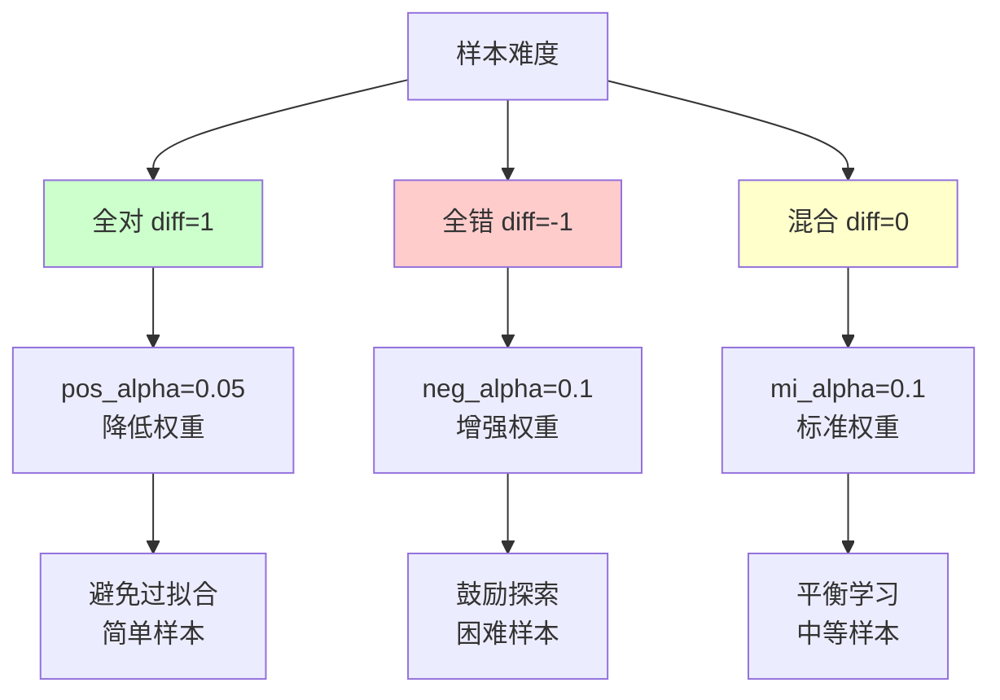

### 4.5 修改 Difficulty Mask 计算

**场景 1: 更细粒度的难度分级**

当前实现是三分类（全对/全错/混合），可以扩展为五分类：

```python
def compute_difficulty_mask_v2(data_batch, n=8):
    """
    五分类难度掩码
    
    Returns:
        -2: 全错 (0/n 正确)
        -1: 大部分错 (1-2/n 正确)
        0: 混合 (3-5/n 正确)
        1: 大部分对 (6-7/n 正确)
        2: 全对 (8/n 正确)
    """
    scores = data_batch.batch["token_level_scores"]
    batch_size = scores.shape[0]
    num_prompts = batch_size // n
    
    # 提取最后 reward
    last_rewards = []
    for i in range(batch_size):
        non_zero = torch.nonzero(scores[i]).squeeze(-1)
        if len(non_zero) > 0:
            last_rewards.append(scores[i][non_zero[-1]].item())
        else:
            last_rewards.append(0.0)
    
    last_rewards_tensor = torch.tensor(last_rewards).view(num_prompts, n)
    
    difficulty_mask = torch.zeros(batch_size, dtype=torch.int64)
    
    for i in range(num_prompts):
        rewards = last_rewards_tensor[i]
        num_correct = torch.sum(rewards > 0).item()
        
        # 五分类
        if num_correct == 0:
            mask_value = -2  # 全错
        elif num_correct <= 2:
            mask_value = -1  # 大部分错
        elif num_correct <= 5:
            mask_value = 0   # 混合
        elif num_correct <= 7:
            mask_value = 1   # 大部分对
        else:
            mask_value = 2   # 全对
        
        # 分配给所有 n 个 rollouts
        for j in range(n):
            difficulty_mask[i * n + j] = mask_value
    
    return difficulty_mask
```

**场景 2: 基于 Reward 方差的难度**

```python
def compute_difficulty_mask_variance(data_batch, n=8):
    """
    基于 reward 方差计算难度
    
    高方差 → 样本不稳定 → 困难
    低方差 → 样本稳定 → 简单
    """
    # ... 提取 last_rewards ...
    
    last_rewards_tensor = torch.tensor(last_rewards).view(num_prompts, n)
    difficulty_mask = torch.zeros(batch_size, dtype=torch.int64)
    
    for i in range(num_prompts):
        rewards = last_rewards_tensor[i]
        variance = torch.var(rewards).item()
        
        # 根据方差分类
        if variance < 0.1:
            mask_value = 1   # 低方差 → 简单
        elif variance > 0.5:
            mask_value = -1  # 高方差 → 困难
        else:
            mask_value = 0   # 中等方差
        
        for j in range(n):
            difficulty_mask[i * n + j] = mask_value
    
    return difficulty_mask
```

### 4.6 调试 Difficulty Mask

```python
# 在 ray_trainer.py 中添加
difficulty_mask = compute_difficulty_mask(batch)

print(f"Difficulty Mask Distribution:")
print(f"  All-correct (1): {torch.sum(difficulty_mask == 1).item()} samples")
print(f"  Mixed (0): {torch.sum(difficulty_mask == 0).item()} samples")
print(f"  All-wrong (-1): {torch.sum(difficulty_mask == -1).item()} samples")

# 可视化
import matplotlib.pyplot as plt

counts = [
    torch.sum(difficulty_mask == -1).item(),
    torch.sum(difficulty_mask == 0).item(),
    torch.sum(difficulty_mask == 1).item(),
]
labels = ['All-Wrong', 'Mixed', 'All-Correct']
colors = ['#ffcccc', '#ffffcc', '#ccffcc']

plt.bar(labels, counts, color=colors)
plt.xlabel('Difficulty')
plt.ylabel('Count')
plt.title('Difficulty Mask Distribution')
plt.savefig('difficulty_distribution.png')
```

### 4.7 修改入口总结

| 修改目标 | 文件位置 | 难度 |
|---------|---------|------|
| **修改难度分类逻辑** | `verl/cpo/cpo_utils.py:compute_difficulty_mask()` | ⭐⭐ 中等 |
| **调整难度权重** | `verl/cpo/cpo_advantage_wrapper.py` 各函数 + 配置 | ⭐ 简单 |
| **添加新的难度指标** | `verl/cpo/cpo_utils.py:compute_difficulty_mask()` | ⭐⭐⭐ 复杂 |

---

**第 4 节完成**。由于篇幅限制，Section 5、6、7 将在下一部分继续编写。

现在文档已经包含：
✅ Section 1: 系统架构总览
✅ Section 2: Reward 函数详解
✅ Section 3: Hint 注入机制
✅ Section 4: Difficulty Mask 计算
⏳ Section 5: Advantage Wrapper 函数体系 (待续)
⏳ Section 6: 数据流与训练集成 (待续)
⏳ Section 7: 修改扩展指南 (待续)


## Section 5: Advantage Wrapper 函数体系

### 5.1 Advantage Wrapper 概述

**Advantage Wrapper** 是 CPO 的核心创新，根据 MI、uncertainty、difficulty 等信号调整原始 advantage 值。

**文件位置**：`verl/cpo/cpo_advantage_wrapper.py` (全文件，17 个函数)

**核心作用**：

```
原始 advantages (来自 GRPO/GAE)
         ↓
  Advantage Wrapper 调整
         ↓
调整后的 advantages (用于 policy gradient)
```

### 5.2 17 个 Wrapper 函数分类

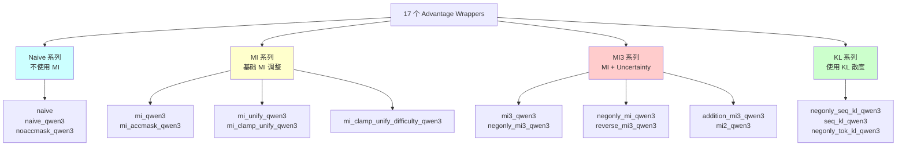

### 5.3 核心概念

#### 5.3.1 互信息 (MI)

```python
# 基础 MI 公式
mi = torch.exp(gw_yl_log_probs) * (gw_yl_log_probs - old_log_probs)

# 展开
MI = P(Y|X,hint) × log[P(Y|X,hint) / P(Y|X)]
   = exp(log P(Y|X,hint)) × [log P(Y|X,hint) - log P(Y|X)]
```

**物理含义**：
- MI > 0：hint 增加了模型对 Y 的置信度
- MI < 0：hint 降低了模型对 Y 的置信度
- MI ≈ 0：hint 没有提供新信息

#### 5.3.2 Uncertainty (不确定性)

```python
# 基于 entropy 归一化
uncertainty = entropy / torch.log(torch.tensor(vocab_size, dtype=torch.float32))

# entropy 来自模型输出的分布
# vocab_size 通常为 151936 (Qwen2.5)
```

**作用**：
- 高 uncertainty → 模型不确定 → 降低 advantage 调整权重
- 低 uncertainty → 模型确定 → 增强 advantage 调整权重

#### 5.3.3 Ratio 和 Clipping

```python
# Ratio: hint 对概率的影响倍数
ratio = torch.exp(gw_yl_log_probs - old_log_probs)

# Clipping: 限制 ratio 范围，避免过大调整
clamped_ratio = torch.clamp(ratio, 1.0 / cpo_lambda, cpo_lambda)
# 例如 cpo_lambda=5.0 → ratio ∈ [0.2, 5.0]
```

### 5.4 典型 Wrapper 实现

#### 5.4.1 Naive 系列: advantage_wrap_naive_qwen3

**不使用 MI**，仅基于 difficulty mask 调整。

**代码**（`cpo_advantage_wrapper.py:26-51`）：

```python
def advantage_wrap_naive_qwen3(micro_batch, advantages, entropy, config):
    """
    最简单的 wrapper，不使用 MI
    只根据 difficulty_mask 和 accuracy_mask 调整
    """
    difficulty_mask = micro_batch["difficulty_mask"]  # (batch_size,)
    token_level_scores = micro_batch["token_level_scores"]  # (batch_size, seq_len)
    
    # accuracy_mask: 哪些 token 是正确的
    accuracy_mask = (token_level_scores > 0).long()  # 1=正确, 0=错误
    
    # 调整策略
    adjusted_advantages = advantages.clone()
    
    for i in range(len(micro_batch)):
        diff = difficulty_mask[i].item()
        
        if diff == 1:  # 全对 (简单)
            # 降低正确 token 的 advantage
            adjusted_advantages[i] = torch.where(
                accuracy_mask[i] == 1,
                advantages[i] * 0.5,  # 正确 token 权重减半
                advantages[i]
            )
        elif diff == -1:  # 全错 (困难)
            # 增强错误 token 的探索
            adjusted_advantages[i] = advantages[i] * 1.5
        # diff == 0 (混合): 不调整
    
    return adjusted_advantages
```

**使用场景**：
- 对比实验基准
- 不需要 hint 注入的情况

#### 5.4.2 MI 系列: advantage_wrap_mi_qwen3

**基础 MI 调整**，最常用。

**代码**（`cpo_advantage_wrapper.py:80-109`）：

```python
def advantage_wrap_mi_qwen3(micro_batch, advantages, entropy, config):
    """
    基于 MI 的标准调整
    
    公式: adjusted_adv = adv + alpha × MI
    """
    old_log_probs = micro_batch["old_log_probs"]
    gw_yl_log_probs = micro_batch["gw_yl_log_probs"]
    
    # Line 86: 计算 MI
    mi = torch.exp(gw_yl_log_probs) * (gw_yl_log_probs - old_log_probs)
    
    # Line 88: 获取调整权重
    mi_alpha = config.get("mi_alpha", 0.1)
    
    # Line 90: 调整 advantages
    adjusted_advantages = advantages + mi_alpha * mi
    
    return adjusted_advantages
```

**调整效果**：

```
假设原始 advantage = 0.5, mi = 0.2, mi_alpha = 0.1

adjusted_advantage = 0.5 + 0.1 × 0.2 = 0.52

MI 正值 → 增强 advantage → 模型更倾向于生成该 token
MI 负值 → 降低 advantage → 模型不太倾向于生成该 token
```

#### 5.4.3 MI3 系列: advantage_wrap_negonly_mi3_qwen3

**MI + Uncertainty + Difficulty**，最复杂也是**实验效果最好的 wrapper**。

**代码**（`cpo_advantage_wrapper.py:267-302`）：

```python
def advantage_wrap_negonly_mi3_qwen3(micro_batch, advantages, entropy, config):
    """
    最常用的 wrapper
    
    特点:
    1. 只对负样本 (全错+混合) 应用 MI 调整
    2. 使用 uncertainty 加权
    3. 使用 ratio clipping 避免过大调整
    """
    old_log_probs = micro_batch["old_log_probs"]
    gw_yl_log_probs = micro_batch["gw_yl_log_probs"]
    difficulty_mask = micro_batch["difficulty_mask"]
    
    # Line 273: 计算 MI
    mi = torch.exp(gw_yl_log_probs) * (gw_yl_log_probs - old_log_probs)
    
    # Line 275: 计算 ratio 和 clipping
    ratio = torch.exp(gw_yl_log_probs - old_log_probs)
    cpo_lambda = config.get("cpo_lambda", 5.0)
    clamped_ratio = torch.clamp(ratio, 1.0 / cpo_lambda, cpo_lambda)
    
    # Line 278: 计算 uncertainty
    vocab_size = config.get("vocab_size", 151936)
    uncertainty = entropy / torch.log(torch.tensor(vocab_size, dtype=torch.float32))
    
    # Line 281: 调整权重
    neg_alpha = config.get("neg_alpha", 0.1)
    
    # Line 283-295: 根据 difficulty 应用不同策略
    adjusted_advantages = advantages.clone()
    
    for i in range(len(micro_batch)):
        diff = difficulty_mask[i].item()
        
        if diff == 1:  # 全对 (正样本)
            # ⭐ negonly: 不调整正样本
            pass
        
        else:  # diff == -1 或 0 (全错/混合，负样本)
            # 应用 MI 调整，使用 uncertainty 加权
            adjustment = neg_alpha * clamped_ratio[i] * mi[i] * (1 - uncertainty[i])
            adjusted_advantages[i] = advantages[i] + adjustment
    
    return adjusted_advantages
```

**公式总结**：

```
对于负样本 (全错/混合):
  adjusted_adv = adv + neg_alpha × clamped_ratio × MI × (1 - uncertainty)

对于正样本 (全对):
  adjusted_adv = adv  (不调整)

其中:
  - neg_alpha: 调整权重 (0.1)
  - clamped_ratio: 裁剪后的概率比 ∈ [0.2, 5.0]
  - MI: 互信息
  - uncertainty: 不确定性 ∈ [0, 1]
```

**设计哲学**：

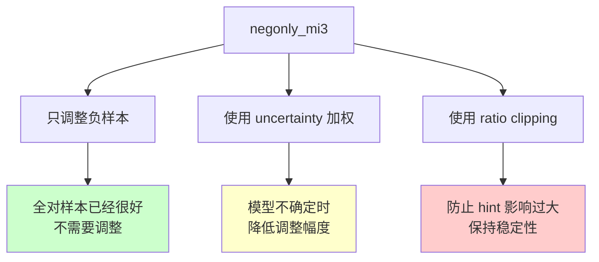

#### 5.4.4 KL 系列: advantage_wrap_negonly_seq_kl_qwen3

使用 KL 散度代替 MI。

**代码**（`cpo_advantage_wrapper.py:431-462`）：

```python
def advantage_wrap_negonly_seq_kl_qwen3(micro_batch, advantages, entropy, config):
    """
    使用序列级 KL 散度调整
    
    KL(P||Q) = ∑ P(x) × log[P(x) / Q(x)]
             = ∑ exp(log P) × (log P - log Q)
    """
    old_log_probs = micro_batch["old_log_probs"]
    gw_yl_log_probs = micro_batch["gw_yl_log_probs"]
    difficulty_mask = micro_batch["difficulty_mask"]
    
    # Line 438: 计算 token-level KL
    kl = torch.exp(gw_yl_log_probs) * (gw_yl_log_probs - old_log_probs)
    
    # Line 440: 聚合为序列级 KL
    # 对每个样本的所有 token 求和
    seq_kl = kl.sum(dim=-1, keepdim=True)  # (batch_size, 1)
    seq_kl = seq_kl.expand_as(advantages)  # 广播到 (batch_size, seq_len)
    
    # Line 443: 调整
    kl_alpha = config.get("kl_alpha", 0.1)
    adjusted_advantages = advantages.clone()
    
    for i in range(len(micro_batch)):
        if difficulty_mask[i] != 1:  # 负样本
            adjusted_advantages[i] = advantages[i] + kl_alpha * seq_kl[i]
    
    return adjusted_advantages
```

**MI vs KL**：

| 指标 | MI | KL |
|-----|----|----|
| **公式** | `exp(log P_hint) × (log P_hint - log P_orig)` | 相同（在此上下文） |
| **聚合** | Token-level 或 Sequence-level | 通常 Sequence-level |
| **物理含义** | Hint 提供的信息量 | 两个分布的差异 |
| **使用场景** | CPO 主流选择 | 对比实验 |

### 5.5 Wrapper 选择器

**文件位置**：`verl/workers/actor/dp_actor.py:440-480`

```python
# Line 443-474: 根据配置选择 wrapper
if cpo:
    wrap_method = self.config.get("wrap_method", "none")
    
    if wrap_method == "negonly_mi3":
        advantages = advantage_wrap_negonly_mi3_qwen3(micro_batch, advantages, entropy.detach(), self.config)
    elif wrap_method == "mi":
        advantages = advantage_wrap_mi_qwen3(micro_batch, advantages, entropy.detach(), self.config)
    elif wrap_method == "naive":
        advantages = advantage_wrap_naive_qwen3(micro_batch, advantages, entropy.detach(), self.config)
    # ... 其他 14 个分支 ...
```

**配置方式**（训练脚本）：

```bash
algorithm.wrap_method=negonly_mi3  # ← 选择 wrapper
actor_rollout_ref.actor.cpo_lambda=5.0
actor_rollout_ref.actor.neg_alpha=0.1
actor_rollout_ref.actor.mi_alpha=0.1
```

### 5.6 Wrapper 对比与选择

**推荐优先级**（基于实验效果）：

| 排名 | Wrapper | 适用场景 | 优点 | 缺点 |
|-----|---------|---------|------|------|
| 🥇 | `negonly_mi3` | 大部分任务 | 效果最好，稳定性强 | 计算稍慢 |
| 🥈 | `mi_clamp_unify_difficulty` | 难度分布不均 | 考虑难度差异 | 需调参 |
| 🥉 | `mi` | 快速实验 | 简单快速 | 效果一般 |
| 🔧 | `naive` | 对比基准 | 不需要 hint | 性能受限 |

**选择决策树**：

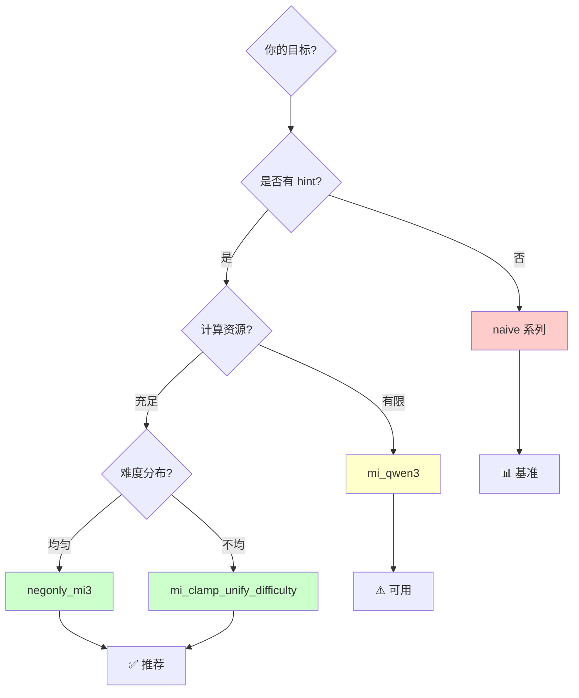

### 5.7 修改入口

| 修改目标 | 文件位置 | 难度 |
|---------|---------|------|
| **选择不同 wrapper** | 训练脚本配置 `algorithm.wrap_method` | ⭐ 简单 |
| **调整 wrapper 参数** | 训练脚本配置 `actor_rollout_ref.actor.*` | ⭐ 简单 |
| **添加新 wrapper** | `verl/cpo/cpo_advantage_wrapper.py` + `dp_actor.py:440-480` | ⭐⭐⭐ 复杂 |
| **修改现有 wrapper** | `verl/cpo/cpo_advantage_wrapper.py` 对应函数 | ⭐⭐ 中等 |

---

**第 5 节完成**。准备进入第 6 节：数据流与训练集成。


## Section 6: 数据流与训练集成

### 6.1 数据加载流程

**文件位置**：`verl/utils/dataset/rl_dataset.py`

#### 6.1.1 RLHFDataset 构造

```python
class RLHFDataset:
    def __init__(self, data_files, tokenizer, config, processor=None):
        """
        Args:
            data_files: parquet 文件列表
            tokenizer: HuggingFace tokenizer
            config: 数据配置
            processor: 多模态 processor (可选)
        """
        self.data_files = data_files
        self.tokenizer = tokenizer
        self.max_prompt_length = config.get("max_prompt_length", 2048)
        
        self._download()  # 下载到本地
        self._read_files_and_tokenize()  # 加载并过滤
```

#### 6.1.2 数据格式要求

**Parquet 文件结构**：

| 字段 | 类型 | 说明 | 示例 |
|-----|------|------|------|
| `prompt` | List[Dict] | OpenAI 格式对话 | `[{"role": "user", "content": "..."}]` |
| `extra_info` | Dict | CPO 必需字段 | 见下表 |
| `reward_model` | Dict | Reward 必需字段 | `{"ground_truth": "42"}` |

**`extra_info` 必需字段**（用于 CPO）：

```python
{
    "extra_info": {
        "data_source": "hendrycks_math",  # 数据集名称
        "ground_truth": "42",              # 答案（用于 compute_judge）
        "gold_solution": "Let x = ...\n\\boxed{42}",  # 完整推理（用于 hint）
    }
}
```

#### 6.1.3 __getitem__ 示例

```python
def __getitem__(self, index: int) -> dict:
    row_dict = dict(self.dataframe[index])
    
    # 构造 messages
    messages = row_dict.get("prompt", [])
    
    # 应用 chat template
    prompt_text = self.tokenizer.apply_chat_template(
        messages, tokenize=False, add_generation_prompt=True
    )
    
    # Tokenize
    input_ids = self.tokenizer.encode(prompt_text, add_special_tokens=False)
    
    # 后处理：左填充、position_ids 等
    input_ids, attention_mask = verl_F.postprocess_data(
        input_ids=input_ids,
        attention_mask=attention_mask,
        max_length=self.max_prompt_length,
        pad_token_id=self.tokenizer.pad_token_id,
        left_pad=True,  # ← Qwen 使用左填充
        truncation=True,
    )
    
    # 返回
    return {
        "input_ids": input_ids[0],
        "attention_mask": attention_mask[0],
        "position_ids": position_ids[0],
        "extra_info": row_dict["extra_info"],
        "reward_model": row_dict["reward_model"],
    }
```

### 6.2 训练主循环

**文件位置**：`verl/trainer/ppo/ray_trainer.py:920-1060`

#### 6.2.1 完整训练步骤

```python
for epoch in range(total_epochs):
    for batch in train_dataloader:
        # ===== 步骤 1-2: Rollout 生成 =====
        gen_batch_output = self.actor_rollout_wg.generate_sequences(batch)
        batch = batch.union(gen_batch_output)
        
        # ===== 步骤 3: Reward 计算 =====
        reward_result = self.reward_fn(batch, return_dict=True)
        reward_tensor = reward_result["reward_tensor"]
        batch.batch["token_level_scores"] = reward_tensor
        
        # ===== 步骤 4: 原始 Log Prob =====
        old_log_prob = self.actor_rollout_wg.compute_log_prob(batch)
        batch = batch.union(old_log_prob)
        
        # ===== 步骤 5-8: CPO 特有流程 =====
        if self.config.algorithm.adv_estimator == 'cpo':
            # 步骤 5: 难度掩码
            difficulty_mask = compute_difficulty_mask(batch)
            
            # 步骤 6: 提取 hints
            hints = compute_judge(batch, tokenizer=self.reward_fn.tokenizer, gold_as_hint=True)
            
            # 步骤 7: 注入 hints
            batch_with_gw_yl, _ = add_hint_to_data_batch(batch, hints, self.reward_fn.tokenizer)
            
            # 步骤 8: 重新计算 log prob
            gw_yl_log_probs = self.actor_rollout_wg.compute_log_prob(batch_with_gw_yl)
            
            # 合并到 batch
            batch = batch.union(DataProto.from_dict(
                tensors={
                    "gw_yl_log_probs": gw_yl_log_probs.batch["old_log_probs"],
                    "difficulty_mask": difficulty_mask
                }
            ))
        
        # ===== 步骤 9: 优势估计 =====
        advantages, returns = compute_advantage(
            values=values,  # 如果使用 critic
            rewards=batch.batch["token_level_scores"],
            response_length=response_length,
            adv_estimator=self.config.algorithm.adv_estimator,  # 'grpo' 或 'cpo'
        )
        
        # ===== 步骤 10-11: PPO 更新 =====
        for _ in range(ppo_epochs):
            for mini_batch in split_into_mini_batches(batch):
                # Advantage Wrapper 在 dp_actor.py 中应用
                actor_output = self.actor_rollout_wg.update_actor(mini_batch)
                
                if self.use_critic:
                    critic_output = self.critic_wg.update_critic(mini_batch)
```

#### 6.2.2 DataProto 数据流

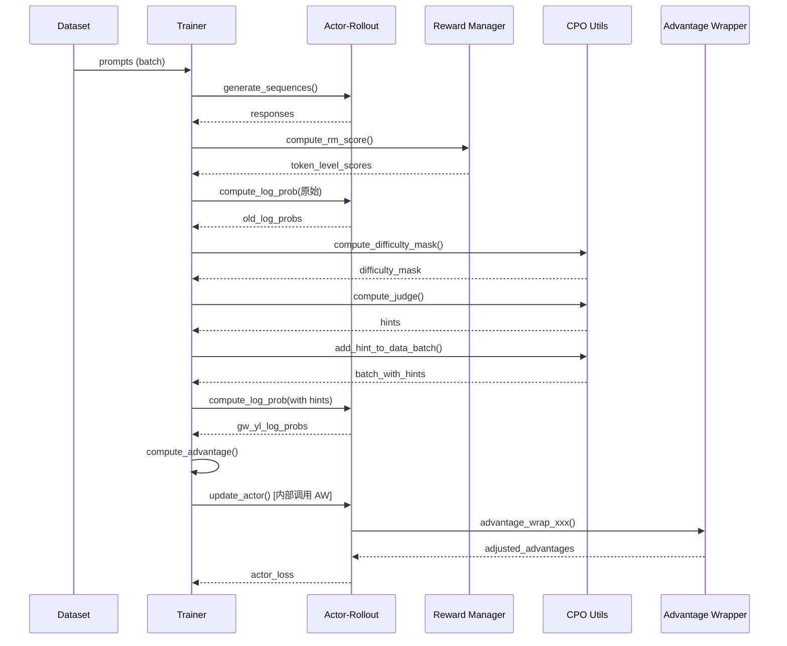

### 6.3 配置文件层次

```
ppo_trainer.yaml (基础配置)
├── algorithm (算法配置)
│   ├── adv_estimator: cpo
│   ├── gold_as_hint: True
│   └── wrap_method: negonly_mi3
├── actor_rollout_ref (模型和 rollout 配置)
│   ├── model
│   │   └── path: /path/to/model
│   ├── actor
│   │   ├── cpo_lambda: 5.0
│   │   ├── pos_alpha: 0.05
│   │   ├── neg_alpha: 0.1
│   │   └── mi_alpha: 0.1
│   └── rollout
│       └── n: 8
└── data
    ├── train_batch_size: 1024
    ├── max_prompt_length: 2048
    └── max_response_length: 2048
```

**训练脚本覆盖**：

```bash
python -m verl.trainer.main_ppo \
    algorithm.adv_estimator=cpo \
    algorithm.wrap_method=negonly_mi3 \
    actor_rollout_ref.actor.neg_alpha=0.15 \  # 覆盖默认值
    data.train_batch_size=512 \  # 覆盖默认值
    # ... 其他配置 ...
```

### 6.4 监控和日志

#### 6.4.1 TensorBoard 日志

```python
# 在 ray_trainer.py 中自动记录
self.writer.add_scalar('train/reward_mean', reward_mean, global_step)
self.writer.add_scalar('train/advantage_mean', advantage_mean, global_step)
self.writer.add_scalar('train/mi_mean', mi_mean, global_step)  # 如果是 CPO
self.writer.add_scalar('train/difficulty_all_correct_ratio', all_correct_ratio, global_step)
```

**查看方式**：

```bash
tensorboard --logdir /path/to/experiment/logs --port 6006
```

#### 6.4.2 自定义监控

在 `ray_trainer.py` 的训练循环中添加：

```python
# 在计算 MI 后
if self.config.algorithm.adv_estimator == 'cpo':
    mi_stats = {
        "mi_mean": mi.mean().item(),
        "mi_std": mi.std().item(),
        "mi_positive_ratio": (mi > 0).float().mean().item(),
    }
    print(f"MI Stats: {mi_stats}")
    
    # 记录到 TensorBoard
    for key, value in mi_stats.items():
        self.writer.add_scalar(f'train/{key}', value, global_step)
```

---

**第 6 节完成**。准备进入第 7 节：修改扩展指南。

## Section 7: 修改扩展指南

### 7.1 快速定位表

| 我想修改... | 文件位置 | 难度 | 说明 |
|----------|---------|------|------|
| **选择不同的 wrapper** | 训练脚本 `algorithm.wrap_method=xxx` | ⭐ | 17 种可选 |
| **调整 wrapper 参数** | 训练脚本 `actor_rollout_ref.actor.*` | ⭐ | alpha, lambda 等 |
| **修改 reward 评分逻辑** | `verl/utils/reward_score/math_cpo.py` | ⭐⭐ | 数学题、代码题等 |
| **添加新评分函数** | `verl/utils/reward_score/my_task.py` + `__init__.py` | ⭐⭐ | 新任务类型 |
| **修改 hint 插入位置** | `verl/cpo/cpo_utils.py:add_hint_to_data_batch()` Line 241 | ⭐⭐ | 查找逻辑 |
| **修改难度分类** | `verl/cpo/cpo_utils.py:compute_difficulty_mask()` | ⭐⭐ | 三分类→多分类 |
| **添加新 wrapper** | `verl/cpo/cpo_advantage_wrapper.py` + `dp_actor.py` | ⭐⭐⭐ | 需理解 MI |
| **修改 position_ids** | `verl/cpo/cpo_utils.py:add_hint_to_data_batch()` Line 298-305 | ⭐⭐⭐ | 复杂且关键 |

### 7.2 场景 1: 添加新的 Advantage Wrapper

**完整流程**（5 步）：

#### Step 1: 定义新函数

在 `verl/cpo/cpo_advantage_wrapper.py` 添加：

```python
def advantage_wrap_my_custom(micro_batch, advantages, entropy, config):
    """
    自定义 wrapper 示例
    
    公式: adjusted_adv = adv + custom_alpha × custom_metric
    """
    old_log_probs = micro_batch["old_log_probs"]
    gw_yl_log_probs = micro_batch["gw_yl_log_probs"]
    
    # 1. 计算自定义指标
    mi = torch.exp(gw_yl_log_probs) * (gw_yl_log_probs - old_log_probs)
    custom_metric = torch.tanh(mi)  # 示例: tanh 归一化
    
    # 2. 获取参数
    custom_alpha = config.get("custom_alpha", 0.1)
    
    # 3. 调整
    adjusted_advantages = advantages + custom_alpha * custom_metric
    
    return adjusted_advantages
```

#### Step 2: 注册到选择器

在 `verl/workers/actor/dp_actor.py:440-480` 添加分支：

```python
if wrap_method == "my_custom":
    advantages = advantage_wrap_my_custom(micro_batch, advantages, entropy.detach(), self.config)
```

#### Step 3: 配置使用

训练脚本：

```bash
algorithm.wrap_method=my_custom \
actor_rollout_ref.actor.custom_alpha=0.15 \
```

#### Step 4: 测试

```python
# 单元测试
import torch
from verl.cpo.cpo_advantage_wrapper import advantage_wrap_my_custom

# 构造测试数据
micro_batch = {
    "old_log_probs": torch.randn(2, 10),
    "gw_yl_log_probs": torch.randn(2, 10),
}
advantages = torch.randn(2, 10)
entropy = torch.rand(2, 10)
config = {"custom_alpha": 0.1}

# 调用
adjusted = advantage_wrap_my_custom(micro_batch, advantages, entropy, config)

# 验证形状
assert adjusted.shape == advantages.shape
print(f"✓ Test passed. Mean adjustment: {(adjusted - advantages).mean().item():.4f}")
```

#### Step 5: 完整训练验证

```bash
# 小规模测试
python -m verl.trainer.main_ppo \
    algorithm.wrap_method=my_custom \
    data.train_batch_size=64 \  # 小批次快速测试
    trainer.total_epochs=1 \
    # ... 其他配置 ...
```

### 7.3 场景 2: 修改数据格式

**添加新字段到 extra_info**：

```python
# 原始数据 (parquet)
{
    "prompt": [...],
    "extra_info": {
        "data_source": "my_custom_task",
        "ground_truth": "42",
        "gold_solution": "...",
        "difficulty_score": 0.8,  # ← 新增字段
    }
}
```

**在 CPO 中使用新字段**：

修改 `verl/cpo/cpo_utils.py:compute_difficulty_mask()`:

```python
def compute_difficulty_mask(data_batch):
    difficulty_mask = torch.zeros(len(data_batch), dtype=torch.int64)
    
    for i in range(len(data_batch)):
        data_item = data_batch[i]
        extra_info = data_item.non_tensor_batch.get("extra_info", {})
        
        # 使用新字段
        difficulty_score = extra_info.get("difficulty_score", 0.5)
        
        if difficulty_score > 0.8:
            difficulty_mask[i] = 1  # 简单
        elif difficulty_score < 0.3:
            difficulty_mask[i] = -1  # 困难
        else:
            difficulty_mask[i] = 0  # 中等
    
    return difficulty_mask
```

### 7.4 场景 3: 调试技巧

#### 7.4.1 打印中间变量

```python
# 在 ray_trainer.py:1300 后
print(f"=== CPO Debug Info ===")
print(f"Batch size: {len(batch)}")
print(f"Difficulty mask: {difficulty_mask[:5]}")  # 前 5 个样本
print(f"Hints (first 3):")
for i, hint in enumerate(hints[:3]):
    print(f"  {i}: {hint[:100]}...")  # 前 100 字符
print(f"MI stats: mean={mi.mean():.4f}, std={mi.std():.4f}")
```

#### 7.4.2 可视化 Advantage 调整

```python
import matplotlib.pyplot as plt

# 在 dp_actor.py 中，wrapper 调用前后
before = advantages.clone().detach().cpu().numpy()
after = adjusted_advantages.detach().cpu().numpy()

plt.figure(figsize=(10, 4))
plt.subplot(1, 2, 1)
plt.hist(before.flatten(), bins=50, alpha=0.7, label='Before')
plt.hist(after.flatten(), bins=50, alpha=0.7, label='After')
plt.xlabel('Advantage Value')
plt.ylabel('Count')
plt.legend()
plt.title('Advantage Distribution')

plt.subplot(1, 2, 2)
plt.scatter(before.flatten(), after.flatten(), alpha=0.1)
plt.plot([before.min(), before.max()], [before.min(), before.max()], 'r--')
plt.xlabel('Before')
plt.ylabel('After')
plt.title('Advantage Adjustment')
plt.tight_layout()
plt.savefig('advantage_adjustment.png')
```

### 7.5 常见问题 FAQ

**Q1: 训练过程中 MI 全为零？**

A: 检查：
1. `gold_as_hint=True` 是否设置
2. Hint 是否成功注入（打印 `batch_with_gw_yl` 的 `input_ids`）
3. 两次 log prob 计算是否正确

**Q2: Difficulty mask 全为 -1 (全错)？**

A: 检查：
1. Reward 函数是否正确计算
2. `token_level_scores` 是否为稀疏奖励（仅最后 token 非零）
3. Rollout 数量 `n` 是否 > 1

**Q3: 训练速度慢？**

A: 优化：
1. 减小 `n` (rollout 数量): `8 → 4`
2. 选择更简单的 wrapper: `negonly_mi3 → mi`
3. 减小 batch size
4. 使用混合精度训练

**Q4: 如何比较不同 wrapper 的效果？**

A: 实验对比：

```bash
# Baseline: 不使用 CPO
bash run_baseline.sh  # adv_estimator=grpo

# CPO with naive
bash run_cpo_naive.sh  # wrap_method=naive

# CPO with mi
bash run_cpo_mi.sh  # wrap_method=mi

# CPO with negonly_mi3
bash run_cpo_negonly_mi3.sh  # wrap_method=negonly_mi3 (推荐)
```

### 7.6 最佳实践

#### 7.6.1 代码规范

- 新函数必须有清晰的 docstring
- 遵循现有命名规范（`advantage_wrap_*_qwen3`）
- 添加 type hints
- 单元测试覆盖

#### 7.6.2 实验管理

```bash
# 使用有意义的实验名
trainer.experiment_name=cpo_negonly_mi3_alpha0.15_lambda5.0

# 记录所有配置
# Hydra 会自动保存到 .hydra/config.yaml

# 比较实验
tensorboard --logdir /path/to/experiments --port 6006
```

#### 7.6.3 渐进式修改

1. **先复现 baseline** → 确保环境正确
2. **小数据集测试** → 快速验证修改
3. **单个 wrapper 对比** → 确认改进方向
4. **全量训练** → 最终性能评估

---

## 总结

本文档详细讲解了 CPO 的核心实现，包括：

1. **系统架构总览**：CPO 的 4 大创新和 11 步训练流程
2. **Reward 函数详解**：稀疏奖励机制、任务特定评分、NaiveRewardManager
3. **Hint 注入机制**：10 步复杂流程，position_ids 更新是关键
4. **Difficulty Mask 计算**：三分类难度、应用不同学习策略
5. **Advantage Wrapper 函数体系**：17 个函数分为 4 大系列，推荐 negonly_mi3
6. **数据流与训练集成**：完整训练循环、DataProto 数据流、配置层次
7. **修改扩展指南**：快速定位表、3 个典型场景、调试技巧、FAQ

**核心文件速查**：

| 功能 | 文件路径 |
|------|---------|
| **主训练循环** | `verl/trainer/ppo/ray_trainer.py` |
| **Hint 注入** | `verl/cpo/cpo_utils.py:188-340` |
| **Difficulty Mask** | `verl/cpo/cpo_utils.py:8-32` |
| **Advantage Wrappers** | `verl/cpo/cpo_advantage_wrapper.py` (全文件) |
| **Reward 评分** | `verl/utils/reward_score/math_cpo.py` |
| **Reward Manager** | `verl/workers/reward_manager/naive.py` |
| **Wrapper 选择器** | `verl/workers/actor/dp_actor.py:440-480` |

**关键接入点**：

- 修改 reward 逻辑 → `math_cpo.py`
- 修改 hint 插入 → `add_hint_to_data_batch()` Line 241
- 修改难度分类 → `compute_difficulty_mask()`
- 添加新 wrapper → `cpo_advantage_wrapper.py` + `dp_actor.py`
- 调整超参数 → 训练脚本配置

所有核心组件的实现位置和修改方法都已明确标注。如需进一步扩展，请参考各 section 中的代码路径和行号。

