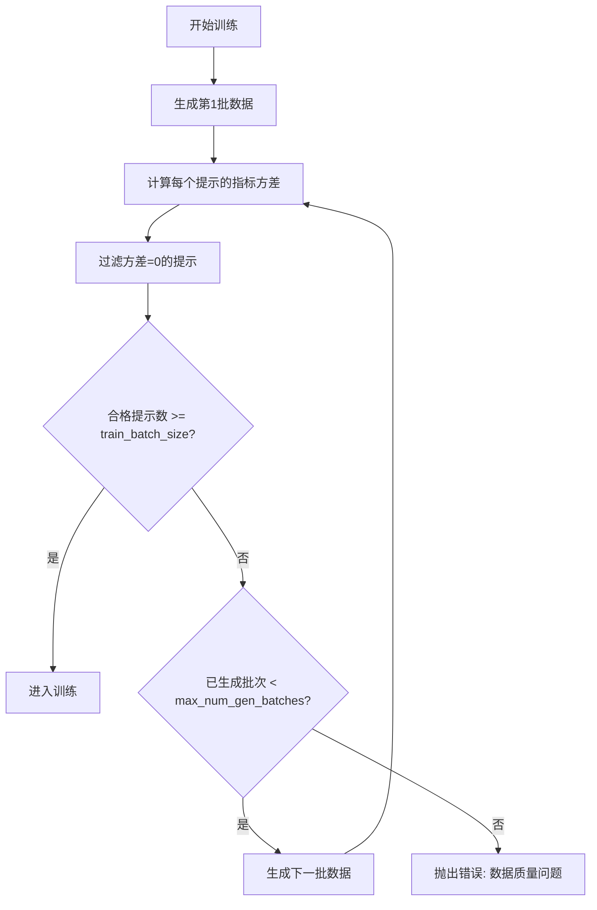

# FilterGroup 机制详解

> 本文档详细介绍 verl 中 FilterGroup 功能的原理、配置、实现和最佳实践。

## 目录
- [概述](#概述)
- [核心机制](#核心机制)
- [配置详解](#配置详解)
- [代码实现](#代码实现)
- [使用示例](#使用示例)
- [最佳实践](#最佳实践)
- [调试与监控](#调试与监控)
- [参考资料](#参考资料)

---

## 概述

### FilterGroup 是什么？

**FilterGroup** 是 verl 训练框架中的一个**数据质量控制机制**，主要用于：
- 在 RL 训练过程中动态过滤低质量的训练样本组
- 确保每个训练样本都具有对比学习价值
- 提高训练数据质量，特别适用于稀疏奖励任务

### 核心目的

在强化学习训练（特别是 GRPO、DAPO 等算法）中：
- 如果一个提示（prompt）生成的所有响应都获得**相同的奖励**（全部正确或全部错误）
- 这个提示对**对比学习**没有帮助，无法提供正负样本对比
- FilterGroup 会**过滤掉这些无差异的组**，继续生成新数据，直到收集足够多的有效样本

### 适用场景

#### ✅ 推荐使用的场景

1. **稀疏奖励任务**
   - 数学推理（正确率 10%-50%）
   - 代码生成
   - 复杂问题求解

2. **需要对比学习的算法**
   - DAPO (Data Augmented Policy Optimization)
   - GRPO (Group Relative Policy Optimization)
   - CPO with contrastive learning

3. **数据质量要求高的场景**
   - 每个提示需要有正负样本对
   - 需要确保样本多样性

#### ❌ 不推荐使用的场景

1. **奖励密集的任务**
   - 大部分响应都能获得奖励
   - 正确率 > 80% 的简单任务

2. **计算资源受限**
   - 动态生成会增加 2-3 倍计算成本

3. **标准 PPO 算法**
   - 有 critic 网络的算法不需要组过滤

---

## 核心机制

### 方差过滤原理

FilterGroup 使用**标准差（Standard Deviation）**作为过滤依据：

```python
# 核心逻辑
for each prompt:
    metric_values = [响应1的指标, 响应2的指标, ..., 响应n的指标]
    std = np.std(metric_values)

    if std > 0:
        保留该提示  # 有差异，对学习有价值
    else:
        过滤该提示  # 无差异，对学习无价值
```

### 过滤示例

假设使用 `metric="acc"`（准确率），每个提示生成 8 个响应：

| 提示 | 响应指标 | 标准差 | 是否保留 | 原因 |
|------|----------|--------|----------|------|
| 提示1 | [1,1,1,1,1,1,1,1] | 0.0 | ❌ 过滤 | 全部正确，无对比价值 |
| 提示2 | [1,0,1,0,1,0,1,1] | 0.464 | ✅ 保留 | 有正有负，可以学习 |
| 提示3 | [1,1,1,1,1,1,0,1] | 0.331 | ✅ 保留 | 主要正确但有错误样本 |
| 提示4 | [0,0,0,0,0,0,0,0] | 0.0 | ❌ 过滤 | 全部错误，无对比价值 |

### 动态批次生成流程



### 详细流程说明

1. **第1批生成**
   ```python
   生成 train_batch_size 个提示
   每个提示生成 rollout.n 个响应
   总轨迹数 = train_batch_size × rollout.n
   ```

2. **组过滤**
   ```python
   对每个提示:
       计算其 n 个响应的指标标准差
       如果 std > 0: 保留
       如果 std = 0: 过滤
   ```

3. **数量检查**
   ```python
   if 保留的提示数 < train_batch_size:
       if 已生成批次数 < max_num_gen_batches:
           继续生成下一批
       else:
           raise ValueError("生成批次过多，数据可能有问题")
   else:
       取前 train_batch_size × rollout.n 条轨迹
       进入训练
   ```

### 支持的过滤指标

| 指标名称 | 类型 | 适用场景 | 值范围 |
|---------|------|----------|--------|
| `acc` | 离散 | 分类任务、数学题、选择题 | 0 或 1 |
| `score` | 连续 | 评分任务、质量评估 | 任意实数 |
| `seq_reward` | 连续 | 序列级奖励 | 任意实数 |
| `seq_final_reward` | 连续 | 最终奖励（如答案正确性） | 任意实数 |
| `token_level_rewards` | 连续 | token级别奖励求和 | 任意实数 |

---

## 配置详解

### 配置参数定义

**位置**: `verl/trainer/config/algorithm.py`

```python
@dataclass
class FilterGroupsConfig(BaseConfig):
    """Configuration for filter groups (used in DAPO and Entropy).

    Args:
        enable (bool): Whether to enable filter groups.
        metric (Optional[str]): Metric to use for filtering:
                                "acc", "score", "seq_reward", "seq_final_reward", etc.
        max_num_gen_batches (int): Non-positive values mean no upper limit.
                                    Maximum number of generation batches to prevent infinite loops.
    """
    enable: bool = False
    metric: Optional[str] = None
    max_num_gen_batches: int = 0  # ≤0 表示无上限
```

### 配置参数说明

#### 1. `enable` (bool)
- **默认值**: `False`
- **作用**: 是否启用 FilterGroup 功能
- **重要**: 只有设置为 `True` 时，整个 FilterGroup 机制才会生效

#### 2. `metric` (str)
- **默认值**: `None`
- **作用**: 指定用于过滤的指标名称
- **可选值**: `"acc"`, `"score"`, `"seq_reward"`, `"seq_final_reward"` 等
- **注意**: 该指标必须在数据批次的 `non_tensor_batch` 中存在

#### 3. `max_num_gen_batches` (int)
- **默认值**: `0`
- **作用**: 限制动态生成的最大批次数
- **取值**:
  - `≤ 0`: 无上限（不推荐，可能无限循环）
  - `> 0`: 最多生成该数量的批次
- **推荐值**: `10-20`

### 配置文件位置

#### YAML 配置模板

**DAPO 配置**: `recipe/dapo/config/dapo_trainer.yaml`
```yaml
algorithm:
  filter_groups:
    _target_: verl.trainer.config.FilterGroupsConfig
    enable: False
    metric: null
    max_num_gen_batches: 0  # Non-positive values mean no upper limit
```

**Entropy 配置**: `recipe/entropy/config/entropy_trainer.yaml`
```yaml
algorithm:
  filter_groups:
    enable: False
    metric: null
    max_num_gen_batches: 0
```

#### Shell 脚本配置

**示例**: `recipe/entropy/7b_kl_cov.sh`
```bash
enable_filter_groups=True
filter_groups_metric=acc
max_num_gen_batches=10

# 传递给训练命令
python -m verl.trainer.main_ppo \
    algorithm.filter_groups.enable=${enable_filter_groups} \
    algorithm.filter_groups.metric=${filter_groups_metric} \
    algorithm.filter_groups.max_num_gen_batches=${max_num_gen_batches} \
    ...
```

### 参数协同关系

FilterGroup 需要与以下参数配合使用：

```bash
# 核心参数组
data.train_batch_size=1024           # 每次训练需要的提示数量
actor_rollout_ref.rollout.n=8        # 每个提示生成的响应数量

# FilterGroup 参数
algorithm.filter_groups.enable=True
algorithm.filter_groups.metric=acc
algorithm.filter_groups.max_num_gen_batches=10

# 计算关系
# - 每批生成: train_batch_size 个提示
# - 每个提示: rollout.n 个响应
# - 总轨迹数: train_batch_size × rollout.n
# - 过滤后可能需要生成多批才能凑够 train_batch_size 个合格提示
```

---

## 代码实现

### 核心代码位置

| 功能 | 文件路径 | 行号 | 说明 |
|------|---------|------|------|
| 配置定义 | `verl/trainer/config/algorithm.py` | 49-61 | FilterGroupsConfig 类定义 |
| DAPO 实现 | `recipe/dapo/dapo_ray_trainer.py` | 201-256 | DAPO 算法的过滤逻辑 |
| Entropy 实现 | `recipe/entropy/entropy_ray_trainer.py` | 187-240 | Entropy 算法的过滤逻辑 |
| PPO DAPO 实现 | `verl/trainer/ppo/ray_trainer_dapo.py` | 1641-1650 | PPO+DAPO 的过滤逻辑 |

### 详细实现逻辑

#### 步骤1: 收集指标值

```python
# 来源: recipe/dapo/dapo_ray_trainer.py, lines 210-217

metric_name = self.config.algorithm.filter_groups.metric  # 例如 "acc"

# 按提示 UID 收集所有响应的指标值
prompt_uid2metric_vals = defaultdict(list)
for uid, metric_val in zip(
    new_batch.non_tensor_batch["uid"],
    new_batch.non_tensor_batch[metric_name]
):
    prompt_uid2metric_vals[uid].append(metric_val)

# 结果示例:
# {
#     "prompt_001": [1, 0, 1, 1, 0, 1, 1, 0],  # 8个响应的acc值
#     "prompt_002": [0, 0, 0, 0, 0, 0, 0, 0],  # 全错
#     "prompt_003": [1, 1, 1, 1, 1, 1, 1, 1],  # 全对
# }
```

#### 步骤2: 计算标准差

```python
# 来源: recipe/dapo/dapo_ray_trainer.py, lines 219-223

prompt_uid2metric_std = {}
for prompt_uid, metric_vals in prompt_uid2metric_vals.items():
    prompt_uid2metric_std[prompt_uid] = np.std(metric_vals)

# 结果示例:
# {
#     "prompt_001": 0.464,  # std > 0, 保留
#     "prompt_002": 0.0,    # std = 0, 过滤
#     "prompt_003": 0.0,    # std = 0, 过滤
# }
```

#### 步骤3: 过滤提示

```python
# 来源: recipe/dapo/dapo_ray_trainer.py, lines 225-231

kept_prompt_uids = [
    uid
    for uid, std in prompt_uid2metric_std.items()
    if std > 0 or len(prompt_uid2metric_vals[uid]) == 1  # 单样本也保留
]

# 创建掩码并过滤批次
kept_mask = np.isin(new_batch.non_tensor_batch["uid"], kept_prompt_uids)
batch = new_batch[kept_mask]
```

#### 步骤4: 批次累积

```python
# 来源: recipe/dapo/dapo_ray_trainer.py, lines 233-240

# 合并多批次数据
if num_gen_batches == 1:
    accumulated_batch = batch
else:
    accumulated_batch = DataProto.concat([accumulated_batch, batch])

# 统计当前累积的合格提示数
num_prompt_in_batch = len(np.unique(accumulated_batch.non_tensor_batch["uid"]))
```

#### 步骤5: 决策逻辑

```python
# 来源: recipe/dapo/dapo_ray_trainer.py, lines 242-256

prompt_bsz = self.config.data.train_batch_size

if num_prompt_in_batch < prompt_bsz:
    print(f"{num_prompt_in_batch=} < {prompt_bsz=}")
    max_num_gen_batches = self.config.algorithm.filter_groups.max_num_gen_batches

    if max_num_gen_batches <= 0 or num_gen_batches < max_num_gen_batches:
        print(f"{num_gen_batches=}. Keep generating...")
        num_gen_batches += 1
        continue  # 继续生成下一批
    else:
        raise ValueError(
            f"{num_gen_batches=} >= {max_num_gen_batches=}. "
            "Generated too many batches. Please check your data."
        )
else:
    # 有足够的合格提示，准备训练
    traj_bsz = prompt_bsz * self.config.actor_rollout_ref.rollout.n
    batch = accumulated_batch[:traj_bsz]
    break  # 退出生成循环
```

### 完整代码流程

```python
# 伪代码：完整的 FilterGroup 流程

num_gen_batches = 0
accumulated_batch = None

while True:
    # 1. 生成一批数据
    new_batch = rollout_worker.generate_batch()
    num_gen_batches += 1

    # 2. 过滤（如果启用）
    if self.config.algorithm.filter_groups.enable:
        # 2.1 收集指标
        prompt_uid2metric_vals = defaultdict(list)
        for uid, val in zip(new_batch["uid"], new_batch[metric_name]):
            prompt_uid2metric_vals[uid].append(val)

        # 2.2 计算标准差
        prompt_uid2metric_std = {
            uid: np.std(vals)
            for uid, vals in prompt_uid2metric_vals.items()
        }

        # 2.3 过滤 std=0 的提示
        kept_uids = [
            uid for uid, std in prompt_uid2metric_std.items()
            if std > 0
        ]
        new_batch = new_batch[new_batch["uid"].isin(kept_uids)]

    # 3. 累积批次
    if accumulated_batch is None:
        accumulated_batch = new_batch
    else:
        accumulated_batch = DataProto.concat([accumulated_batch, new_batch])

    # 4. 检查是否满足训练要求
    num_prompts = len(np.unique(accumulated_batch["uid"]))

    if num_prompts >= train_batch_size:
        # 足够了，取前 train_batch_size × rollout.n 条轨迹
        traj_bsz = train_batch_size * rollout_n
        batch = accumulated_batch[:traj_bsz]
        break

    # 5. 检查是否超过上限
    if max_num_gen_batches > 0 and num_gen_batches >= max_num_gen_batches:
        raise ValueError("Too many generation batches")

    # 继续生成下一批
    print(f"Generated {num_gen_batches} batches, {num_prompts} prompts so far...")

# 6. 进入训练
train(batch)
```

---

## 使用示例

### 示例1: 数学推理任务（DAPO）

#### 配置脚本

```bash
#!/bin/bash
# 文件: run_math_dapo.sh

# 数据路径
train_path=~/data/math/train.parquet
test_path=~/data/math/test.parquet

# FilterGroup 配置
enable_filter_groups=True
filter_groups_metric=acc
max_num_gen_batches=15

# 训练参数
train_batch_size=1024
rollout_n=8

# 启动训练
python -m verl.trainer.main_ppo \
    algorithm.adv_estimator=dapo \
    algorithm.filter_groups.enable=${enable_filter_groups} \
    algorithm.filter_groups.metric=${filter_groups_metric} \
    algorithm.filter_groups.max_num_gen_batches=${max_num_gen_batches} \
    data.train_files="['${train_path}']" \
    data.val_files="['${test_path}']" \
    data.train_batch_size=${train_batch_size} \
    actor_rollout_ref.rollout.n=${rollout_n} \
    trainer.n_gpus_per_node=8 \
    trainer.logger='["console","wandb"]'
```

#### 预期效果

假设数学题正确率约 30%：

**第1批生成**: 1024 个提示
- 全对: 100 个 (10%) → 过滤
- 全错: 500 个 (49%) → 过滤
- 有对有错: 424 个 (41%) → **保留**
- 合格提示数: **424 < 1024**

**第2批生成**: 再生成 1024 个提示
- 保留约 420 个合格提示
- 累计: **424 + 420 = 844 < 1024**

**第3批生成**: 再生成 1024 个提示
- 保留约 415 个合格提示
- 累计: **844 + 415 = 1259 > 1024** ✓

**训练**: 取前 1024 个提示 × 8 个响应 = 8192 条轨迹进入训练

#### 日志输出

```
INFO: Starting rollout generation...
INFO: Generated batch 1, 1024 prompts, 8192 trajectories
INFO: Filter groups enabled, metric=acc
INFO: Calculating metric std for 1024 prompts...
INFO: Filtered: 600 prompts with std=0 (58.6%)
INFO: Kept: 424 prompts with std>0
INFO: num_prompt_in_batch=424 < prompt_bsz=1024
INFO: num_gen_batches=1. Keep generating...

INFO: Generated batch 2, 1024 prompts, 8192 trajectories
INFO: Filtered: 604 prompts with std=0 (59.0%)
INFO: Kept: 420 prompts with std>0
INFO: Accumulated: 844 prompts
INFO: num_prompt_in_batch=844 < prompt_bsz=1024
INFO: num_gen_batches=2. Keep generating...

INFO: Generated batch 3, 1024 prompts, 8192 trajectories
INFO: Filtered: 609 prompts with std=0 (59.5%)
INFO: Kept: 415 prompts with std>0
INFO: Accumulated: 1259 prompts
INFO: num_prompt_in_batch=1259 >= prompt_bsz=1024
INFO: Collected enough data. Taking first 8192 trajectories.
INFO: Starting training iteration...
```

### 示例2: 使用序列奖励过滤

```bash
# 使用连续值的 seq_final_reward 作为过滤指标
python -m verl.trainer.main_ppo \
    algorithm.adv_estimator=grpo \
    algorithm.filter_groups.enable=True \
    algorithm.filter_groups.metric=seq_final_reward \
    algorithm.filter_groups.max_num_gen_batches=10 \
    data.train_batch_size=512 \
    actor_rollout_ref.rollout.n=16 \
    ...
```

### 示例3: 禁用 FilterGroup（标准训练）

```bash
# 当前脚本: run_qwen3_base_math_grpo_cpo_seqkl_neg.sh
enable_filter_groups=False  # 禁用
filter_groups_metric=acc
max_num_gen_batches=10      # 此参数无效

# 训练命令
python -m verl.trainer.main_ppo \
    algorithm.adv_estimator=cpo \
    algorithm.filter_groups.enable=${enable_filter_groups} \  # False
    algorithm.filter_groups.max_num_gen_batches=${max_num_gen_batches} \
    ...
```

**结果**:
- 不进行组过滤
- 只生成 1 批数据
- 直接使用所有 1024 × 8 = 8192 条轨迹训练

---

## 最佳实践

### 场景适用性分析

#### 场景1: 困难数学题（正确率 10-30%）

```bash
✅ 推荐配置
enable_filter_groups=True
filter_groups_metric=acc
max_num_gen_batches=20  # 较大值，预计过滤率高

理由:
- 大部分提示会全错 → 需要过滤
- 需要较多批次才能收集足够的有效样本
- 数据质量提升带来的收益 > 计算成本
```

#### 场景2: 中等难度（正确率 40-60%）

```bash
✅ 推荐配置
enable_filter_groups=True
filter_groups_metric=acc
max_num_gen_batches=10  # 中等值

理由:
- 自然产生较多正负样本对
- 过滤率适中（30-40%）
- 少量额外生成即可满足需求
```

#### 场景3: 简单任务（正确率 > 80%）

```bash
❌ 不推荐启用
enable_filter_groups=False

理由:
- 大部分提示会全对 → 大量被过滤
- 需要过多批次生成（可能超过 max_num_gen_batches）
- 计算成本过高，不如调整任务难度
```

#### 场景4: 标准 PPO（有 Critic）

```bash
❌ 不需要启用
enable_filter_groups=False

理由:
- PPO 使用 value function，不依赖组内对比
- 无需保证每组都有正负样本
- FilterGroup 不会带来收益
```

### 参数调优建议

#### max_num_gen_batches 设置策略

根据任务正确率估算：

| 正确率 | 预计过滤率 | 推荐 max_num_gen_batches | 说明 |
|--------|-----------|-------------------------|------|
| < 20% | > 60% | 15-25 | 困难任务，需要多次生成 |
| 20-40% | 40-60% | 10-15 | 中等偏难 |
| 40-60% | 20-40% | 5-10 | 中等难度 |
| 60-80% | 10-20% | 3-5 | 中等偏易 |
| > 80% | < 10% | 不推荐启用 | 简单任务 |

#### metric 选择策略

| 任务类型 | 推荐 metric | 原因 |
|---------|------------|------|
| 分类、数学题 | `acc` | 二元指标，清晰明确 |
| 评分任务 | `score` | 连续值，能区分质量差异 |
| 多步推理 | `seq_final_reward` | 关注最终结果 |
| 过程奖励 | `seq_reward` | 关注整个序列的质量 |

### 计算成本权衡

#### 成本分析

```
假设配置:
- train_batch_size = 1024
- rollout.n = 8
- 过滤率 = 50%

无 FilterGroup:
- 生成批次数: 1
- 推理次数: 1024 × 8 = 8,192
- 相对成本: 1.0x

有 FilterGroup:
- 生成批次数: 平均 2.5 批
- 推理次数: 2.5 × 1024 × 8 = 20,480
- 相对成本: 2.5x
```

#### 收益评估

| 维度 | 无 FilterGroup | 有 FilterGroup | 提升 |
|------|---------------|---------------|------|
| 样本质量 | 低（含全对/全错组） | 高（全部有对比） | +++ |
| 训练稳定性 | 中等 | 较高 | ++ |
| 收敛速度 | 较慢 | 较快 | ++ |
| 最终性能 | 基线 | 提升 5-15% | ++ |
| 计算成本 | 基线 | 增加 2-3x | --- |

#### 决策建议

```
启用 FilterGroup 当:
✓ 数据质量 > 计算成本
✓ 稀疏奖励任务
✓ GPU 资源充足
✓ 追求最优性能

不启用 FilterGroup 当:
✓ 计算成本 > 数据质量
✓ 奖励密集任务
✓ GPU 资源紧张
✓ 快速实验迭代
```

---

## 调试与监控

### 常见问题排查

#### 问题1: 达到 max_num_gen_batches 上限

**现象**:
```
ValueError: num_gen_batches=15 >= max_num_gen_batches=15.
Generated too many batches. Please check your data.
```

**原因**:
1. 任务太难或太简单，导致过滤率过高（> 70%）
2. `max_num_gen_batches` 设置过小
3. `train_batch_size` 设置过大

**解决方案**:
```bash
# 方案1: 增加上限
max_num_gen_batches=25  # 从 15 增加到 25

# 方案2: 减少 batch size
data.train_batch_size=512  # 从 1024 减少到 512

# 方案3: 增加 rollout.n
actor_rollout_ref.rollout.n=16  # 从 8 增加到 16

# 方案4: 检查任务难度
# - 如果正确率 < 5%: 任务太难，调整数据或模型
# - 如果正确率 > 95%: 任务太简单，禁用 FilterGroup
```

#### 问题2: 所有提示都被过滤

**现象**:
```
WARNING: All prompts filtered. No data left for training.
```

**原因**:
1. `rollout.n` 太小（如 n=1），所有提示只有单个响应，std 必为 0
2. 奖励函数有问题，所有响应获得相同奖励
3. 模型已过拟合，所有响应都相同

**解决方案**:
```bash
# 方案1: 增加采样数量
actor_rollout_ref.rollout.n=8  # 至少 4-8 个

# 方案2: 检查奖励函数
# 确保奖励能正确区分正负样本

# 方案3: 增加采样多样性
actor_rollout_ref.rollout.temperature=0.8  # 提高温度
actor_rollout_ref.rollout.top_p=0.95
```

#### 问题3: FilterGroup 未生效

**现象**:
- 日志中没有过滤信息
- 只生成了 1 批数据

**检查清单**:
```bash
# 1. 确认 enable=True
algorithm.filter_groups.enable=True  # 不是 False

# 2. 确认 metric 正确
algorithm.filter_groups.metric=acc  # 数据中必须有该字段

# 3. 查看代码中的条件判断
if self.config.algorithm.filter_groups.enable:
    # 此处应该执行
```

### 关键日志解读

#### 正常运行日志

```
[2024-01-01 10:00:00] INFO: Starting rollout generation...
[2024-01-01 10:00:15] INFO: Generated batch 1, 1024 prompts
[2024-01-01 10:00:16] INFO: Filter groups enabled, metric=acc
[2024-01-01 10:00:17] INFO: Computing metric std for 1024 prompts...
[2024-01-01 10:00:18] INFO: Filter statistics:
  - Total prompts: 1024
  - Filtered (std=0): 620 (60.5%)
  - Kept (std>0): 404 (39.5%)
  - Mean std: 0.246
[2024-01-01 10:00:18] INFO: Accumulated prompts: 404 / 1024
[2024-01-01 10:00:18] INFO: num_gen_batches=1. Continue generating...

[2024-01-01 10:00:33] INFO: Generated batch 2, 1024 prompts
[2024-01-01 10:00:35] INFO: Filtered (std=0): 615 (60.1%)
[2024-01-01 10:00:35] INFO: Kept (std>0): 409 (39.9%)
[2024-01-01 10:00:35] INFO: Accumulated prompts: 813 / 1024
[2024-01-01 10:00:35] INFO: num_gen_batches=2. Continue generating...

[2024-01-01 10:00:50] INFO: Generated batch 3, 1024 prompts
[2024-01-01 10:00:52] INFO: Filtered (std=0): 605 (59.1%)
[2024-01-01 10:00:52] INFO: Kept (std>0): 419 (40.9%)
[2024-01-01 10:00:52] INFO: Accumulated prompts: 1232 / 1024 ✓
[2024-01-01 10:00:52] INFO: Enough data collected. Taking first 8192 trajectories.
[2024-01-01 10:00:53] INFO: train/num_gen_batches: 3
[2024-01-01 10:00:53] INFO: train/filter_rate: 0.598
[2024-01-01 10:00:53] INFO: Starting training iteration...
```

#### 关键指标监控

使用 WandB 监控以下指标：

```python
# 在训练代码中记录
metrics = {
    "train/num_gen_batches": num_gen_batches,  # 生成批次数
    "train/filter_rate": n_filtered / n_total,  # 过滤率
    "train/mean_metric_std": np.mean(list(prompt_uid2metric_std.values())),  # 平均标准差
    "train/num_kept_prompts": len(kept_prompt_uids),  # 保留的提示数
}
```

### 性能优化建议

#### 优化1: 并行生成

如果 GPU 充足，可以并行生成多批：

```python
# 伪代码
from concurrent.futures import ThreadPoolExecutor

def generate_and_filter():
    batch = rollout_worker.generate_batch()
    filtered_batch = apply_filter_groups(batch)
    return filtered_batch

# 并行生成 3 批
with ThreadPoolExecutor(max_workers=3) as executor:
    futures = [executor.submit(generate_and_filter) for _ in range(3)]
    batches = [f.result() for f in futures]

# 合并
accumulated_batch = DataProto.concat(batches)
```

#### 优化2: 自适应 max_num_gen_batches

根据过滤率动态调整：

```python
# 伪代码
filter_rates = []

while num_prompts < train_batch_size:
    batch = generate_and_filter()
    filter_rate = compute_filter_rate(batch)
    filter_rates.append(filter_rate)

    # 自适应上限
    avg_filter_rate = np.mean(filter_rates)
    estimated_batches_needed = int(1 / (1 - avg_filter_rate) + 2)

    if num_gen_batches >= estimated_batches_needed:
        raise ValueError("Exceeded estimated batches needed")
```

#### 优化3: 缓存过滤结果

避免重复计算：

```python
# 缓存每个 prompt 的 std
prompt_std_cache = {}

for uid in batch["uid"]:
    if uid in prompt_std_cache:
        std = prompt_std_cache[uid]
    else:
        std = compute_std(uid)
        prompt_std_cache[uid] = std
```

---

## 参考资料

### 相关文件索引

#### 配置相关
- `verl/trainer/config/algorithm.py` (lines 49-61) - FilterGroupsConfig 定义
- `recipe/dapo/config/dapo_trainer.yaml` - DAPO 配置模板
- `recipe/entropy/config/entropy_trainer.yaml` - Entropy 配置模板

#### 实现代码
- `recipe/dapo/dapo_ray_trainer.py` (lines 201-256) - DAPO 实现
- `recipe/entropy/entropy_ray_trainer.py` (lines 187-240) - Entropy 实现
- `verl/trainer/ppo/ray_trainer_dapo.py` (lines 1641-1650) - PPO DAPO 实现

#### 使用示例
- `recipe/entropy/7b_kl_cov.sh` - Entropy KL Cov 示例
- `recipe/entropy/7b_clip_cov.sh` - Entropy Clip Cov 示例
- `recipe/dapo/run_qwen2.5_math_dapo.sh` - DAPO 数学训练示例

### 算法文档

- [DAPO README](../recipe/dapo/README.md) - DAPO 算法详细文档
- [Entropy Mechanism](../recipe/entropy/README.md) - Entropy 机制说明
- [verl Documentation](https://verl.readthedocs.io/) - 官方文档

### 论文参考

- **DAPO**: Data Augmented Policy Optimization
- **GRPO**: Group Relative Policy Optimization
- **HybridFlow**: [arxiv.org/abs/2409.19256](https://arxiv.org/abs/2409.19256)

### 快速查询表

| 需求 | 查看文件 | 位置 |
|------|---------|------|
| 修改配置定义 | `verl/trainer/config/algorithm.py` | class FilterGroupsConfig |
| 理解过滤逻辑 | `recipe/dapo/dapo_ray_trainer.py` | lines 201-256 |
| 查看配置示例 | `recipe/entropy/7b_kl_cov.sh` | 完整脚本 |
| 调试过滤问题 | `verl/trainer/ppo/ray_trainer_dapo.py` | _run_step 方法 |
| 学习 DAPO 算法 | `recipe/dapo/README.md` | 完整文档 |

---

## 附录

### A. 完整配置示例

```bash
#!/bin/bash
# 完整的 FilterGroup 配置示例

# === 路径配置 ===
PROJECT_DIR="$(pwd)"
train_path=$PROJECT_DIR/data/math/train.parquet
test_path=$PROJECT_DIR/data/math/test.parquet

# === FilterGroup 配置 ===
enable_filter_groups=True
filter_groups_metric=acc
max_num_gen_batches=15

# === 训练配置 ===
train_batch_size=1024
rollout_n=8
learning_rate=1e-6
total_epochs=20

# === 日志配置 ===
project_name="math_dapo_experiment"
experiment_name="qwen2_7b_filtergroups_enabled"

# === 启动训练 ===
python -m verl.trainer.main_ppo \
    algorithm.adv_estimator=dapo \
    \
    `# FilterGroup 配置` \
    algorithm.filter_groups.enable=${enable_filter_groups} \
    algorithm.filter_groups.metric=${filter_groups_metric} \
    algorithm.filter_groups.max_num_gen_batches=${max_num_gen_batches} \
    \
    `# 数据配置` \
    data.train_files="['${train_path}']" \
    data.val_files="['${test_path}']" \
    data.train_batch_size=${train_batch_size} \
    data.max_prompt_length=2048 \
    data.max_response_length=2048 \
    \
    `# 模型配置` \
    actor_rollout_ref.model.path=Qwen/Qwen2-7B-Instruct \
    actor_rollout_ref.actor.optim.lr=${learning_rate} \
    \
    `# Rollout 配置` \
    actor_rollout_ref.rollout.n=${rollout_n} \
    actor_rollout_ref.rollout.temperature=0.7 \
    actor_rollout_ref.rollout.name=vllm \
    \
    `# 训练配置` \
    trainer.total_epochs=${total_epochs} \
    trainer.n_gpus_per_node=8 \
    trainer.save_freq=5 \
    trainer.test_freq=2 \
    \
    `# 日志配置` \
    trainer.logger='["console","wandb"]' \
    trainer.project_name=${project_name} \
    trainer.experiment_name=${experiment_name}
```

### B. 监控脚本

```python
# monitor_filter_groups.py
# 用于监控 FilterGroup 运行状态

import re
from pathlib import Path

def parse_filter_logs(log_file):
    """解析训练日志，提取 FilterGroup 相关信息"""

    filter_stats = {
        "batches": [],
        "filter_rates": [],
        "kept_prompts": [],
    }

    with open(log_file) as f:
        for line in f:
            # 提取生成批次信息
            if "Generated batch" in line:
                match = re.search(r"Generated batch (\d+)", line)
                if match:
                    batch_num = int(match.group(1))
                    filter_stats["batches"].append(batch_num)

            # 提取过滤率
            if "Filtered" in line and "std=0" in line:
                match = re.search(r"(\d+) \((\d+\.\d+)%\)", line)
                if match:
                    filtered_count = int(match.group(1))
                    filter_rate = float(match.group(2)) / 100
                    filter_stats["filter_rates"].append(filter_rate)

            # 提取保留的提示数
            if "Kept" in line and "std>0" in line:
                match = re.search(r"(\d+) prompts", line)
                if match:
                    kept_count = int(match.group(1))
                    filter_stats["kept_prompts"].append(kept_count)

    return filter_stats

def print_summary(stats):
    """打印统计摘要"""
    print("=== FilterGroup Statistics ===")
    print(f"Total batches generated: {len(stats['batches'])}")
    print(f"Average filter rate: {sum(stats['filter_rates'])/len(stats['filter_rates']):.2%}")
    print(f"Total kept prompts: {sum(stats['kept_prompts'])}")
    print(f"Average kept per batch: {sum(stats['kept_prompts'])/len(stats['kept_prompts']):.1f}")

if __name__ == "__main__":
    stats = parse_filter_logs("train.log")
    print_summary(stats)
```

### C. 常见配置对比

| 场景 | enable | metric | max_num_gen_batches | rollout.n | 说明 |
|------|--------|--------|---------------------|-----------|------|
| DAPO 数学 | True | acc | 15 | 8 | 标准 DAPO 配置 |
| DAPO 代码 | True | acc | 20 | 16 | 代码任务需要更多样本 |
| Entropy 机制 | True | seq_reward | 10 | 8 | 使用序列奖励 |
| 标准 GRPO | False | - | 0 | 8 | 不使用 FilterGroup |
| CPO 数学 | False | - | 0 | 8 | CPO 自带对比机制 |
| 困难任务 | True | acc | 25 | 12 | 高过滤率场景 |
| 简单任务 | False | - | 0 | 4 | 不需要过滤 |

---

**文档版本**: v1.0
**最后更新**: 2025-01-27
**维护者**: CPO Team
